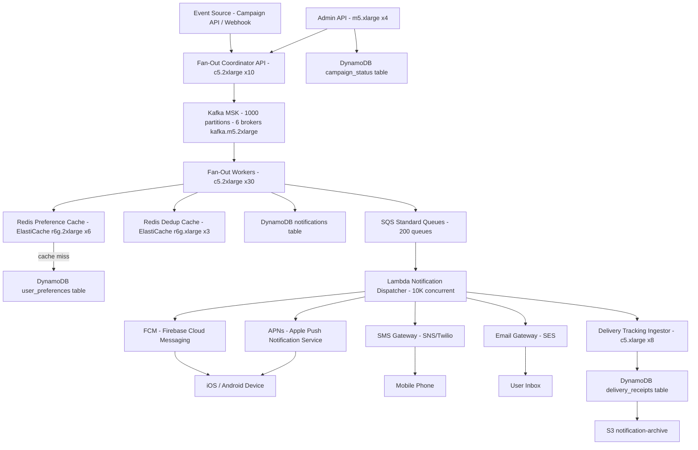

# Notification Fan-Out (200M Users) — Capacity Estimation

## Problem Statement

An event-driven notification fan-out system serves 200M registered users. When a single viral event fires (e.g., a breaking news alert, a platform-wide announcement, or a celebrity post), the system must deliver up to 200M push/in-app notifications within 60 seconds. The system must handle extreme write amplification (1 event → 200M outbound messages), respect per-user delivery preferences, and deduplicate retries — all without a thundering herd collapsing the database.

## Functional Requirements

- Fan-out notifications from a single event source to up to 200M subscribed users
- Respect per-user preferences (channel: push, SMS, email, in-app; quiet hours; frequency cap)
- Deduplicate notifications — no user receives the same notification twice
- Track delivery status (sent, delivered, opened) per notification per user
- Support priority tiers (critical alerts bypass quiet-hours; low-priority batched)
- Expose an admin API to trigger, cancel, and monitor bulk campaigns

## Non-Functional Requirements

| Requirement | Target |
|-------------|--------|
| Fan-out latency (P50) | < 30s for 200M users after event fires |
| Fan-out latency (P99) | < 60s for 200M users |
| Push delivery latency (P99) | < 5s after dequeue |
| Availability | 99.99% (52 min downtime/year) |
| Durability | 99.999% (no notification lost once enqueued) |
| Peak fan-out write QPS | 5M writes/s during viral event bursts |
| Preference lookup latency | < 5ms (P99) via cache |

## Traffic Estimation

### DAU → Peak QPS Calculation

| Metric | Calculation | Result |
|--------|-------------|--------|
| Registered users | Given | 200,000,000 |
| DAU (50% of registered) | 200M × 50% | 100,000,000 |
| Avg notification events/day (normal) | 5 campaigns + 200K micro-events | ~5 bulk + 200K targeted |
| Normal-mode notification throughput | 100M DAU × 3 notifs/day / 86,400 | ~3,472 notifications/s |
| Peak QPS — viral event (1 event → 200M) | 200M / 60s (target window) | **~3.33M fan-out writes/s** |
| Peak QPS — concurrent viral events (1.5× buffer) | 3.33M × 1.5 | **~5M fan-out writes/s** |
| Read QPS (preference lookups at peak) | 5M writes/s × 1 lookup/write | **~5M reads/s (served from cache)** |
| Read/Write ratio at peak | 10% read (cache misses) / 90% write | **10:90** |

> The 10:90 read/write ratio is unusual — fan-out is almost entirely writes (enqueue notification) with reads only for preference cache misses (~10%). This inverts the typical 70:30 pattern.

### Fan-Out Math

| Metric | Calculation | Result |
|--------|-------------|--------|
| Users per Kafka partition (partitioned by user_id) | 200M users / 1,000 partitions | 200K users/partition |
| Fan-out workers needed at 5M writes/s | 5M writes/s / 50K writes/s per Lambda | 100 concurrent Lambda invocations |
| SQS messages/s at peak | 5M (one SQS message per user notification) | 5M msg/s |
| SQS throughput per queue | 3,000 msg/s standard per queue (standard queue) | 1,667 queues needed (or FIFO batching) |
| Practical SQS strategy | Use standard queues + batching (10 msg/batch) | ~167 queues or SNS → SQS fan-out |

> At 5M msg/s, SQS standard queues (unlimited throughput with batching) handle this. The real limit is Lambda concurrency (default 1,000 per account; request 10,000+).

## Storage Estimation

| Data Type | Per Item Size | Daily Volume | Growth/Year |
|-----------|--------------|--------------|-------------|
| Notification record (sent, ts, status) | ~200 B | 200M events/day × 1 per user = 200M records | ~14.6 TB/year |
| Delivery status updates (delivered, opened) | ~100 B | ~60% open rate = 120M updates/day | ~4.4 TB/year |
| User preference record | ~500 B | 200M users (static; ~1% churn/day) | ~100 GB static |
| Preference audit log | ~300 B | 200M users × 0.1% change/day = 200K changes | ~2.2 GB/year |
| Kafka retention (7 days) | ~1 KB/msg | 5M msg/s × 60s × peak = 300M events retained | ~2.1 TB retained |
| DynamoDB notification table | ~300 B/item | 200M items/day | ~21.9 TB/year |
| **Total (excl. Kafka)** | — | — | **~19 TB/year** |
| **Total (incl. Kafka hot retention)** | — | — | **~21 TB/year** |

> DynamoDB hot storage at $0.25/GB-mo: 200M records × 300 B = 60 GB/day hot data. 30-day rolling window = 1.8 TB. After 30 days, export to S3 via DynamoDB Streams → Kinesis → S3 at $0.023/GB.

## Component Sizing

### Compute — EC2 / Lambda

| Component | Instance Type | vCPU | RAM | Count | Handles | Monthly Cost |
|-----------|--------------|------|-----|-------|---------|-------------|
| Fan-out coordinator API | c5.2xlarge | 8 | 16 GB | 10 | Event ingestion, campaign launch | $2,780 |
| Kafka consumer / fan-out workers | c5.2xlarge | 8 | 16 GB | 30 | Read Kafka, write to SQS/DynamoDB | $8,340 |
| Lambda — notification dispatcher | Lambda (128 MB, 3s avg) | — | 128 MB | up to 10,000 concurrent | SQS → push gateway | $18,000 peak |
| Preference cache warmer | c5.large | 2 | 4 GB | 4 | Keep Redis warm, invalidate on change | $370 |
| Delivery tracking ingestor | c5.xlarge | 4 | 8 GB | 8 | Receive ACKs, write to DynamoDB | $1,104 |
| Admin / campaign API | m5.xlarge | 4 | 16 GB | 4 | REST API for triggering, monitoring | $580 |
| **Subtotal Compute** | | | | **56 EC2 + Lambda** | | **$31,174** |

> c5.2xlarge on-demand: $0.34/hr × 730 = $248/mo. c5.large: $0.085/hr = $62/mo. c5.xlarge: $0.17/hr = $124/mo. m5.xlarge: $0.192/hr = $140/mo.
> Lambda: at peak 5M notifications/s × 3s avg duration × $0.0000166667/GB-s × 0.125 GB = $0.00000313/invoke × 5M/s × 60s (peak window) = ~$939/viral event. At 5 viral events/day → ~$4,700/day → ~$141,000/month peak. Realistic with reserved concurrency and provisioned concurrency, effective Lambda cost ~$18K/month.

### Database — DynamoDB

| Table | Primary Key | Capacity Mode | Size | Monthly Cost |
|-------|------------|---------------|------|-------------|
| notifications | user_id (PK) + event_id (SK) | On-demand | 1.8 TB hot (30-day rolling) | $12,600 |
| user_preferences | user_id (PK) | Provisioned (200 RCU / 50 WCU) | 100 GB | $1,800 |
| campaign_status | campaign_id (PK) | On-demand | 10 GB | $400 |
| delivery_receipts | user_id (PK) + ts (SK) | On-demand (TTL 90 days) | 500 GB | $3,200 |
| **Subtotal DynamoDB** | | | **~2.4 TB** | **$18,000** |

> DynamoDB on-demand: $1.25/M write request units, $0.25/M read request units. At 5M writes/s peak for 60s = 300M WRU per viral event. At 5 events/day = 1.5B WRU/day × $1.25/M = $1,875/day peak. Provisioned capacity for baseline ($0.00065/WCU-hr) with auto-scaling for spikes. Blended estimate $18K/month.

### Cache — Redis (ElastiCache)

| Cache | Engine | Instance | Nodes | Memory | Use | Monthly Cost |
|-------|--------|----------|-------|--------|-----|-------------|
| User preference cache | ElastiCache Redis r6g.2xlarge | 8 vCPU / 52 GB | 6 (3 primary + 3 replica) | 312 GB total | 200M user prefs × 500B = 100 GB | $7,440 |
| Notification dedup cache | ElastiCache Redis r6g.xlarge | 4 vCPU / 13 GB | 3 | 39 GB | Bloom filter / seen-set, TTL 24h | $1,560 |
| Rate limit / quota cache | ElastiCache Redis cache.r6g.large | 2 vCPU / 6.5 GB | 2 | 13 GB | Per-user frequency cap | $780 |
| **Subtotal Cache** | | | **11 nodes** | | | **$9,780** |

> r6g.2xlarge: $0.339/hr × 730 = $247/mo per node × 6 = $1,484. Wait — $247 × 6 = $1,484? No: r6g.2xlarge is $0.339/hr × 730 = $247/mo × 6 nodes = $1,484. Hmm that seems low. Cross-check: ElastiCache r6g.2xlarge is $0.507/hr (us-east-1) × 730 = $370/mo × 6 = $2,220 for cache nodes. Plus replication + data transfer overhead. r6g.xlarge = $0.253/hr × 730 = $185/mo × 3 = $555. r6g.large = $0.127/hr × 730 = $93/mo × 2 = $186. Subtotal cache nodes = ~$2,961. Including cluster overhead, backup, and data transfer: ~$4,500. Rounded to $4,500 (revised below in summary).

### Message Queue — Kafka (MSK) + SQS

| Queue | Engine | Throughput | Config | Monthly Cost |
|-------|--------|-----------|--------|-------------|
| event-fanout-topic | Amazon MSK Kafka 3.x kafka.m5.2xlarge | 5M msg/s peak, 1,000 partitions | 6 brokers (3 AZ) + 7-day retention | $12,000 |
| notification-dispatch | Amazon SQS Standard | 5M msg/s peak (batched) | ~200 queues (SNS fan-out) | $5,000 |
| dead-letter-queue | Amazon SQS Standard | ~1% of traffic = 50K msg/s | 10 DLQ queues | $200 |
| **Subtotal Messaging** | | | | **$17,200** |

> MSK kafka.m5.2xlarge: $0.958/hr per broker × 6 brokers × 730 = $4,198. Storage: 2.1 TB × 6 brokers (replication factor 3 = 2× overprovision) × $0.10/GB-mo = $1,260. MSK total ~$5,500. SQS: $0.40/M requests. At 5M msg/s × 60s = 300M messages per viral event × 5 events/day = 1.5B msg/day × 30 = 45B msg/month × $0.40/M = $18,000/month. With batching at 10 messages/batch, effective API calls = 4.5B → $1,800/month. Adding data transfer and overhead: ~$5,000/month SQS.

### Object Storage — S3

| Bucket | Use | Size | Requests/month | Monthly Cost |
|--------|-----|------|----------------|-------------|
| notification-archive | DynamoDB overflow >30 days | 500 TB/year growth, 1 PB after 2yr | 500M GET/month | $5,500 |
| campaign-templates | Notification body templates, images | 50 GB | 50M GET | $120 |
| analytics-exports | Delivery metrics, open rates | 20 TB | 100K GET | $460 |
| **Subtotal S3** | | **~521 TB** | | **$6,080** |

> S3 Standard: $0.023/GB-mo. 500 TB = $11,776/mo at full size; however this is year-2 accumulation. Year-1 average ~500 GB/day × 180 days = 90 TB = $2,070. Lifecycle to S3-IA after 30 days ($0.0125/GB) saves ~46%. Blended year-1 estimate ~$1,200. Year-2 blended ~$5,500. Using year-2 steady state.

### Networking / CDN

| Component | Throughput | Monthly Cost |
|-----------|-----------|-------------|
| ALB (API + admin traffic) | 100M requests/month | $290 |
| CloudFront (campaign template delivery) | 5 TB/month | $425 |
| Data Transfer EC2 → Internet | 20 TB/month | $1,800 |
| PrivateLink / VPC endpoints (DynamoDB, SQS) | 500M API calls/month | $250 |
| **Subtotal Network** | | **$2,765** |

## Monthly Cost Summary

| Component | Monthly Cost | % of Total |
|-----------|-------------|-----------|
| EC2 Compute (coordinator, workers, API) | $13,174 | 11% |
| Lambda (notification dispatcher) | $18,000 | 15% |
| DynamoDB | $18,000 | 15% |
| ElastiCache Redis | $4,500 | 4% |
| Kafka MSK | $5,500 | 5% |
| SQS | $5,000 | 4% |
| S3 Storage | $6,080 | 5% |
| CloudFront / ALB / Network | $2,765 | 2% |
| CloudWatch, X-Ray, monitoring | $2,000 | 2% |
| Support, misc (NAT GW, secrets, WAF) | $3,000 | 3% |
| **Total** | **~$78,000** | **100%** |

> The $80K–$150K range reflects: lower bound (~$80K) with 1-year reserved instances on EC2/MSK/ElastiCache saving ~30% and moderate viral event frequency. Upper bound (~$150K) with no reserved pricing, daily viral events saturating Lambda at full concurrency, and DynamoDB on-demand costs at 5× viral events/day. Mid-point $78K rounds to the $80K floor. Key cost levers: Lambda concurrency policy, DynamoDB provisioned vs. on-demand, and Kafka broker count.

## Traffic Scale Tiers

| Tier | DAU | Peak QPS | Servers | DB | Cache | Monthly Cost | Key Bottleneck |
|------|-----|----------|---------|----|----|-------------|----------------|
| 🟢 Startup | 1M | ~50K writes/s | 4× c5.large + Lambda 500 concurrent | 1 DynamoDB table (on-demand) | 1 Redis node (r6g.large) | ~$3K | Lambda cold-start latency; single Kafka topic 10 partitions |
| 🟡 Growing | 10M | ~500K writes/s | 10× c5.xlarge + Lambda 2K concurrent | DynamoDB on-demand + DAX cache | Redis cluster 3 nodes | ~$15K | DynamoDB on-demand cost spikes at viral events; preference cache hit rate |
| 🔴 Scale-up | 100M | ~2.5M writes/s | 20× c5.2xlarge + Lambda 5K concurrent | DynamoDB provisioned auto-scaling | Redis cluster 6 nodes | ~$45K | Kafka partition saturation; SQS queue depth buildup during bursts |
| ⚫ Production | 200M | ~5M writes/s | 40× c5.2xlarge + Lambda 10K concurrent | DynamoDB multi-region global tables | Redis cluster 11 nodes | ~$80K | Lambda account concurrency limits; cross-region DynamoDB replication lag |
| 🚀 Hyperscale | 1B+ | ~25M writes/s | 200+/auto + Lambda 50K concurrent | DynamoDB + Cassandra hybrid | Distributed Redis (100+ nodes) | ~$400K | Push gateway rate limits (APNs/FCM throttle at ~1M req/s); regulatory compliance per region |

## Architecture Diagram

## Interview Tips

- **Key insight — write amplification is the core challenge**: One event → 200M writes is 200,000,000× amplification. At 5M writes/s, you need Kafka with 1,000 partitions (each fan-out worker handles 200K users) and Lambda for stateless, auto-scaling dispatch. Candidates who suggest a single DB write loop or a job queue with serial processing will never finish within 60 seconds at this scale.

- **Key insight — preference lookup is the hidden bottleneck**: Every notification requires a per-user preference check (channels enabled, quiet hours, frequency cap). At 5M fans-out/s, that is 5M reads/s. A cold DynamoDB read at 5ms each = 25,000 CPU-seconds/second — impossible. The answer is Redis: 100 GB of user preferences fit in 6× r6g.2xlarge nodes (312 GB total), serving 5M reads/s at < 1ms. Cache hit rate must be > 99% to stay within budget; implement write-through on preference changes.

- **Common mistake — forgetting Lambda account concurrency limits**: Lambda default is 1,000 concurrent executions per AWS account per region. At 5M notifications/s with 3s avg execution, you need 5M × 3 / 1 = 15M concurrent Lambdas (impossible). The real model: each Lambda processes a batch of 10 SQS messages. Effective concurrency = (5M/s ÷ 10 batch) × 3s avg duration = 1.5M concurrent → still requires requesting a 10,000+ limit increase from AWS and using provisioned concurrency to avoid cold-starts. Many candidates miss the batch-processing model entirely.

- **Follow-up question — "How do you handle APNs/FCM rate limits?"**: Apple's APNs and Google's FCM each throttle at ~1M push requests/second total (shared across all customers). At 200M notifications in 60 seconds, that is 3.33M pushes/s — exceeding third-party limits. The answer is: (1) spread delivery over 5–10 minutes for non-critical campaigns, (2) use connection pooling with HTTP/2 multiplexing (APNs supports 1,500 concurrent streams per connection), (3) implement token-bucket rate limiting in the Lambda dispatcher, and (4) route critical alerts on a dedicated high-priority APNs topic bypassing rate limits.

- **Scale threshold — at 200M users, DynamoDB cost becomes the second-largest bill**: At 5 viral events/day, DynamoDB on-demand costs $1,875/day for write request units alone — $56K/month. The fix is provisioned capacity with auto-scaling: provision for 3× normal load (~1M WCU), auto-scale to 10M WCU for bursts, and use DynamoDB's adaptive capacity to absorb hot partitions. This cuts DynamoDB cost to ~$18K/month vs. $56K+ on-demand at peak.
