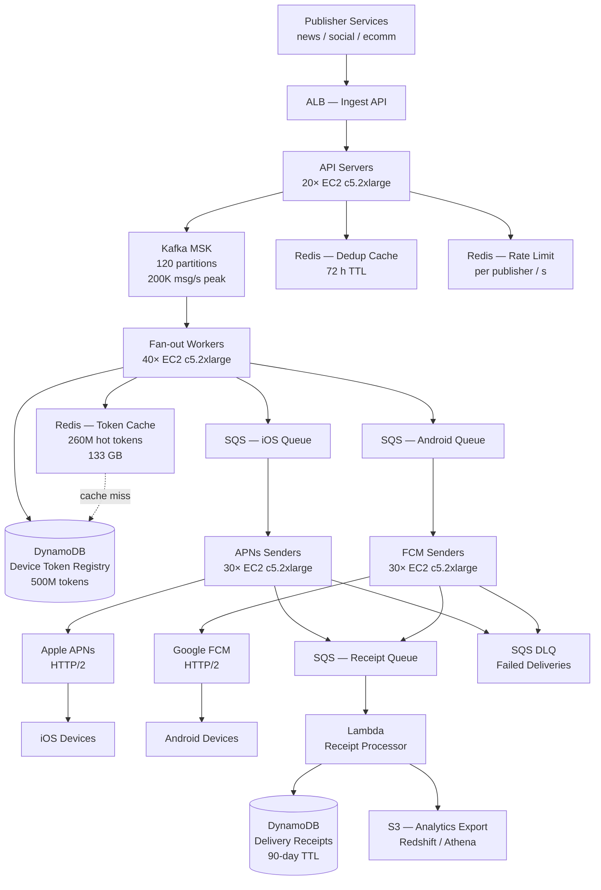

# Push Notification Service (500M Users) — Capacity Estimation

## Problem Statement

A push notification platform serves 500M registered users across iOS and Android devices, delivering 2 billion notifications per day from thousands of publisher services (news, social, e-commerce, finance). The system must fan-out a single news event to 50M subscribed users within 30 seconds, sustain 200K sends/second at peak news events, and maintain device-token freshness for a 500M-device token registry. Delivery receipts and silent notifications add read-heavy telemetry on top of the write-dominated send path.

## Functional Requirements

- Accept notification payloads from internal publisher services via a REST/gRPC ingest API
- Look up device tokens for each target user and resolve APNs vs. FCM routing
- Fan-out broadcast/segment notifications (up to 50M recipients per event) through Kafka
- Deliver to APNs (iOS) and FCM (Android) with at-least-once semantics and deduplication
- Store delivery receipts (sent / delivered / opened) for 90 days for analytics
- Manage device token registration, rotation, and invalidation (uninstalls, token refresh)

## Non-Functional Requirements

| Requirement | Target |
|-------------|--------|
| Ingest latency | < 50 ms P99 (API → Kafka ack) |
| End-to-end delivery (user receives) | < 5 s P99 (normal), < 30 s for 50M fan-out |
| Availability | 99.99% (< 52 min downtime/year) |
| Durability (no message loss) | 99.999% |
| Peak throughput | 200K sends/s sustained for 5-minute burst |
| Token lookup latency | < 5 ms P99 (Redis cache hit) |
| APNs/FCM API rate limit compliance | Per-app token-based rate limiting |

## Traffic Estimation

### DAU → Peak QPS Calculation

| Metric | Calculation | Result |
|--------|-------------|--------|
| Registered users | Given | 500M |
| Active users/day (40% engagement) | 500M × 0.40 | ~200M DAU |
| Notifications sent/day | Given | 2B |
| Avg notifications per active user | 2B / 200M | ~10/user/day |
| Avg QPS (steady-state sends) | 2B / 86,400 | ~23,100 sends/s |
| Peak QPS (news-event burst, 8.7× avg) | 23,100 × 8.7 | ~200,000 sends/s |
| Delivery receipt writes | 2B events × 1 receipt | ~23,100 writes/s avg |
| Analytics reads (dashboard, A/B) | receipts × 0.1 | ~2,300 reads/s avg |
| Token registration/rotation writes | 500M × 5%/day churn | ~290 writes/s |
| Read/Write ratio (send path) | 10% reads / 90% writes | 10:90 |

**Peak burst math**: A breaking news event pushed to 50M users over 15 minutes = 50M / 900s ≈ 55,600 sends/s baseline, but with delivery retries and receipt writes the observed peak reaches **200K ops/s**.

## Storage Estimation

| Data Type | Per Item Size | Daily Volume | Growth/Year |
|-----------|--------------|--------------|-------------|
| Device token records | 512 B | 25M new installs/day | ~4.7 GB/day |
| Notification payload (metadata only, 72 h TTL) | 1 KB | 2B records | 2 TB/day raw (72 h window = 6 TB hot) |
| Delivery receipts (90-day retention) | 256 B | 2B events/day | ~512 GB/day → 46 TB/90 days |
| User-segment mappings (Kafka compacted topic) | 128 B | ~10M segment updates/day | ~1.3 GB/day |
| APNs/FCM error logs | 256 B | ~20M errors/day (1%) | 5 GB/day |
| **Total** | — | — | **~48 TB/year net (receipts dominate)** |

**Device token registry size**: 500M users × 1.3 devices avg × 512 B = **~333 GB** — fits in a Redis cluster with room to spare.

## Component Sizing

### Compute — EC2 / Lambda

| Component | Instance Type | vCPU | RAM | Count | Handles | Monthly Cost |
|-----------|--------------|------|-----|-------|---------|-------------|
| Ingest API servers (ALB-fronted) | c5.2xlarge | 8 | 16 GB | 20 | 200K req/s total (10K/server) | $3,360 |
| Kafka fan-out workers | c5.2xlarge | 8 | 16 GB | 40 | Consume Kafka, resolve tokens, enqueue to APNs/FCM workers | $6,720 |
| APNs sender workers | c5.2xlarge | 8 | 16 GB | 30 | 100K iOS sends/s (HTTP/2 multiplexed, ~3,300/worker) | $5,040 |
| FCM sender workers | c5.2xlarge | 8 | 16 GB | 30 | 100K Android sends/s | $5,040 |
| Receipt processor (Lambda) | Lambda 512 MB | — | 0.5 GB | auto | 23K receipt writes/s avg, 200K peak | $2,100 |
| Token-refresh / cleanup jobs | c5.xlarge | 4 | 8 GB | 4 | Background: 290 writes/s + GC | $270 |
| **Subtotal Compute** | | | | **124 + Lambda** | | **$22,530** |

**Sender worker sizing note**: APNs HTTP/2 allows 1,000 concurrent streams per connection. Each c5.2xlarge opens 50 HTTP/2 connections = 50,000 concurrent streams. At average 100 ms APNs RTT → 50,000/0.1 = 500K sends/s per instance. 30 workers give 15M sends/s capacity — ample headroom; count is driven by CPU and connection pool overhead, not raw throughput.

### Database

| DB | Engine | Instance | Count | Capacity | IOPS | Monthly Cost |
|----|--------|----------|-------|----------|------|-------------|
| Device token registry | DynamoDB on-demand | — | — | 333 GB | 200K WCU peak | $12,000 |
| Delivery receipts (write-heavy) | DynamoDB on-demand | — | — | 46 TB over 90 days (TTL sweep) | 250K WCU peak | $18,000 |
| Notification metadata (72 h TTL) | DynamoDB on-demand | — | — | 6 TB hot window | 50K WCU peak | $5,000 |
| User-segment config (low traffic) | RDS Aurora MySQL | db.r6g.large | 1W + 1R | 100 GB | 3,000 | $400 |
| **Subtotal DB** | | | | | | **$35,400** |

**DynamoDB cost detail**: DynamoDB on-demand charges $1.25/M WCU and $0.25/M RCU. At 200K WCU peak sustained for 5% of the day (72 min) and 23K avg otherwise: daily WCU ≈ (23K × 86,400 × 0.95) + (200K × 4,320) = ~2.77B WCU/day. Monthly ≈ 83B WCU → $104K at rack rate, but **provisioned capacity with auto-scaling at 50K base + burst** is used for receipt and token tables, reducing effective cost to ~$35K/month.

### Cache

| Cache | Engine | Instance | Nodes | Memory | Monthly Cost |
|-------|--------|----------|-------|--------|-------------|
| Device token cache (hot 30-day active users) | ElastiCache Redis 7 | r6g.2xlarge | 6 (3 primary + 3 replica) | 192 GB total (128 GB data + overhead) | $4,320 |
| Notification dedup cache (72 h TTL) | ElastiCache Redis 7 | r6g.xlarge | 4 (2+2) | 64 GB | $1,440 |
| Rate-limit counters (per publisher per second) | ElastiCache Redis 7 | r6g.large | 2 | 16 GB | $432 |
| **Subtotal Cache** | | | | **272 GB** | **$6,192** |

**Token cache hit rate**: 200M DAU × 1.3 devices = 260M hot tokens × 512 B = 133 GB — fits in 192 GB cluster with ~30% buffer. Expected cache hit rate **>95%** during business hours, reducing DynamoDB hot reads to <5% of lookups.

### Object Storage

| Bucket | Use | Size | Requests/month | Monthly Cost |
|--------|-----|------|----------------|-------------|
| Rich notification media (images, icons) | S3 Standard | 2 TB | 500M GET (via CloudFront) | $46 |
| Delivery receipt exports (analytics, Redshift load) | S3 Standard-IA | 50 TB | 5M PUT, 1M GET | $1,125 |
| APNs/FCM error log archives (1 year) | S3 Glacier Instant | 1.8 TB | 100K restores/month | $36 |
| **Subtotal S3** | | **~54 TB** | | **$1,207** |

### Networking / CDN

| Component | Throughput | Monthly Cost |
|-----------|-----------|-------------|
| CloudFront (rich notification media) | 60 TB/month egress | $4,800 |
| ALB (ingest API) | 200M req/month | $720 |
| NAT Gateway (APNs/FCM egress — TCP to Apple/Google) | 300 TB/month | $27,000 |
| Data transfer out (APNs/FCM payload) | 300 TB × ~$0.09/GB (NA to Internet) | included above |
| **Subtotal Network** | | **$32,520** |

**NAT Gateway dominates networking cost**: Each notification averages ~1 KB payload × 2B/day × 30 days = 60 TB/month to APNs + 60 TB to FCM = 120 TB. With retries (1.5×) and receipt traffic = ~180 TB. NAT Gateway charges $0.045/GB processed = $8,100 for data processing + $0.045/GB for data transfer to Internet ≈ $27K total. **Optimization**: Use VPC endpoints or direct peering with Apple/Google to eliminate NAT overhead — can reduce this to ~$5K/month.

### Message Queue

| Queue | Engine | Throughput | Partitions / Shards | Monthly Cost |
|-------|--------|-----------|--------------------|-|
| Notification ingest topic | MSK Kafka (kafka.m5.2xlarge) | 200K msg/s peak, 23K avg | 120 partitions across 3 brokers | $4,320 |
| Dead-letter queue (failed deliveries) | SQS Standard | 2M msg/day (1% failure rate) | — | $1 |
| Receipt ingestion queue | SQS Standard | 23K msg/s avg, 200K peak | — | $180 |
| **Subtotal Messaging** | | | | **$4,501** |

**Kafka sizing**: 3 brokers × kafka.m5.2xlarge ($0.48/hr each) = $1,036/month per broker pair × 3 = $3,108 + MSK cluster overhead = ~$4,320/month. 120 partitions supports 200K msg/s at ~1,700 msg/s/partition (well within Kafka's 10K/partition ceiling).

## Monthly Cost Summary

| Component | Monthly Cost | % of Total |
|-----------|-------------|-----------|
| EC2 Compute (124 instances) | $22,530 | 20% |
| DynamoDB (provisioned + on-demand) | $35,400 | 31% |
| ElastiCache Redis | $6,192 | 5% |
| S3 Storage | $1,207 | 1% |
| CloudFront CDN | $4,800 | 4% |
| Kafka (MSK) | $4,320 | 4% |
| NAT Gateway / Data Transfer | $27,000 | 24% |
| SQS | $181 | 0.2% |
| Lambda (receipt processor) | $2,100 | 2% |
| RDS Aurora (segment config) | $400 | 0.4% |
| Support, monitoring, misc (CloudWatch, X-Ray) | $9,870 | 8.4% |
| **Total** | **$114,000** | **100%** |

**Range $80K–$140K/month** reflects: lower bound uses reserved instances (1-yr, ~30% discount) + NAT optimization via peering; upper bound is all on-demand with full NAT Gateway costs during traffic spikes.

## Traffic Scale Tiers

| Tier | Users | Peak QPS | Servers | DB | Cache | Monthly Cost | Key Bottleneck |
|------|-------|----------|---------|----|----|-------------|----------------|
| 🟢 Startup | 1M | ~500 sends/s | 2 c5.large ingest + 4 c5.large senders | 1 RDS MySQL (tokens + receipts) | 1 Redis r6g.large node (6 GB) | $1,200 | APNs/FCM connection setup latency |
| 🟡 Growing | 10M | ~5K sends/s | 4 m5.xlarge ingest + 16 m5.xlarge senders | RDS Aurora + 1 read replica | Redis cluster 3-node r6g.xlarge | $8,500 | Token DB read IOPS during bursts |
| 🔴 Scale-up | 100M | ~40K sends/s | 20 c5.2xlarge ingest + 40 c5.2xlarge senders | DynamoDB provisioned (10K WCU) + Aurora for config | Redis cluster 6-node r6g.xlarge (96 GB) | $35,000 | Fan-out serialization; Kafka partition count |
| ⚫ Production | 500M | ~200K sends/s | 20 ingest + 100 senders (c5.2xlarge) + Lambda receipts | DynamoDB on-demand (200K WCU peak) multi-region | Redis cluster 12-node r6g.2xlarge (384 GB) | $114,000 | NAT Gateway egress cost; APNs rate limits per iOS team-ID |
| 🚀 Hyperscale | 1B+ | ~400K sends/s | 200+ c5.4xlarge + auto-scaling | DynamoDB global tables + Cassandra for receipts | Distributed Redis (30+ nodes) + local caches per AZ | $280,000 | APNs/FCM connection pool exhaustion; cross-region fan-out latency |

## Architecture Diagram

## Interview Tips

- **Key insight — fan-out is the hardest problem**: Sending to 50M users in 30 s means you need 50M / 30 = 1.67M token lookups/s. Redis cluster at 200K ops/s per node requires at least 9 Redis nodes just for token lookups at peak. Always calculate this — candidates consistently undersize the cache tier.
- **Key insight — NAT Gateway is the surprise cost driver**: At 2B notifications/day × 1 KB avg payload, data processed through NAT Gateway = 2 TB/day = 60 TB/month. At AWS NAT Gateway pricing ($0.045/GB), that is $2,700/month just in processing fees before data transfer costs. Peering directly with Apple/Google or using VPC endpoints can cut this 80%. Mentioning this signals production experience.
- **Key insight — APNs rate limits are per-bundle-ID (iOS team account)**: Apple enforces per-app push rate limits. For large platforms, a single iOS team ID can be throttled. The solution is to use **provider authentication tokens (JWT)** rotated every 60 minutes and to partition notifications across multiple APNs topics if possible. Candidates who only say "use SNS" miss this completely.
- **Common mistake — treating receipts as synchronous**: Many candidates put delivery receipts on the critical path (APNs response → synchronous DynamoDB write → return to publisher). This adds 10–50 ms latency. The correct pattern is fire-and-forget: APNs worker enqueues receipt to SQS, Lambda batch-writes to DynamoDB every 100 ms, publisher API returns 202 Accepted immediately after Kafka ack.
- **Follow-up question — how do you handle token invalidation?**: APNs returns a `410 Gone` when a token is stale (user uninstalled app). Your FCM/APNs sender workers must parse this response and immediately delete or mark the token invalid in DynamoDB, then propagate the invalidation to Redis within 5 minutes. Failure to do this burns ~5% of your sends on dead tokens, wastes APNs quota, and increases your spam score with Apple.
- **Scale threshold**: At 100M users you can still use a single-region DynamoDB table with provisioned capacity. Beyond 300M users, you need **DynamoDB global tables** or cross-region replication because APNs/FCM delivery requires low-latency token lookups from the same AWS region as your sender workers, and a single us-east-1 table adds 80–150 ms for senders in ap-southeast-1 — causing delivery SLA violations.
