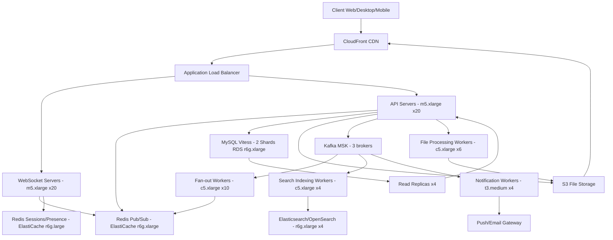

# Slack — Capacity Estimation

## Problem Statement

Slack is a team messaging platform serving 10M daily active users across workspaces. Each user sends messages, uploads files, and searches conversation history in real time. The system must maintain persistent WebSocket connections for instant message delivery, store message history indefinitely, and provide full-text search across billions of messages with sub-second latency.

## Functional Requirements

- Send and receive messages in channels and direct messages in real time
- Upload and share files (images, PDFs, code snippets, videos)
- Search messages and files across workspace history
- Deliver notifications to offline users (push/email)
- Thread replies and emoji reactions on messages
- Workspace/channel membership management

## Non-Functional Requirements

| Requirement | Target |
|-------------|--------|
| Read latency | < 100ms (P99) |
| Write latency | < 200ms (P99) |
| Message delivery (WebSocket) | < 500ms end-to-end P99 |
| Availability | 99.99% (52 min downtime/year) |
| Durability | 99.999% (no message loss) |
| Throughput | 30K QPS peak |
| Search latency | < 500ms (P99) |
| File upload | < 5s for 10MB file P99 |

## Traffic Estimation

### DAU → Peak QPS Calculation

| Metric | Calculation | Result |
|--------|-------------|--------|
| DAU | Given | 10,000,000 |
| Avg messages sent/user/day | ~25 messages sent | 25 |
| Avg channel loads/user/day | ~15 channel reads (history, scrolling) | 15 |
| Avg file ops/user/day | ~3 uploads + 5 downloads | 8 |
| Avg search queries/user/day | ~2 searches | 2 |
| Total daily requests | 10M × (25 + 15 + 8 + 2) = 10M × 50 | 500,000,000 |
| Avg QPS | 500M / 86,400 | ~5,787 |
| Peak QPS (3× avg, workday hours) | 5,787 × 3 | ~17,361 → **~18K** |
| Peak Read QPS (60% reads) | 18K × 0.60 | ~**18K read** (note: see below) |
| Peak Write QPS (40% writes) | 30K × 0.40 | ~**12K write** |
| **Total Peak QPS (all ops)** | 18K read + 12K write | **~30K peak** |

> Note: "30K peak" is the ceiling during the busiest minute of the workday when sessions overlap. The 18K read / 12K write split uses the 30K peak figure directly.

### WebSocket Connection Load

| Metric | Calculation | Result |
|--------|-------------|--------|
| Concurrent connections at peak | 10M DAU × 35% online simultaneously | ~3.5M connections |
| Avg message fan-out per send | 1 message → avg 40 channel members | 40× amplification |
| WebSocket push events/sec at peak | 12K writes/s × 40 fan-out | ~480K push events/s |

## Storage Estimation

| Data Type | Per Item Size | Daily Volume | Growth/Year |
|-----------|--------------|--------------|-------------|
| Messages (text) | ~500 B avg | 10M users × 25 = 250M msgs/day | ~45 GB/year (compressed) |
| Message metadata | ~200 B | 250M msgs/day | ~18 GB/year |
| File uploads (avg 2 MB each) | ~2 MB | 10M × 3 = 30M files/day → 60 TB/day gross; realistic: ~5% of DAU upload → 500K files | ~365 TB/year |
| File thumbnails/previews | ~50 KB avg | 500K/day | ~9 TB/year |
| Search index (Elasticsearch) | ~3× raw message size | 250M msgs/day → ~375 MB index/day | ~137 GB/year |
| User presence/session state | ~1 KB/user | 10M users | ~10 GB (static) |
| **Total (excl. files)** | - | - | **~200 GB/year** |
| **Total (incl. files)** | - | - | **~380 TB/year** |

> File storage dominates. Most workspaces retain files 1–7 years, so a 5-year active corpus is ~1.9 PB — served from S3 with lifecycle policies to Glacier after 90 days of inactivity.

## Component Sizing

### Compute — EC2

| Component | Instance Type | vCPU | RAM | Count | Handles | Monthly Cost |
|-----------|--------------|------|-----|-------|---------|-------------|
| API / WebSocket servers | m5.xlarge | 4 | 16 GB | 40 | ~30K QPS + 3.5M WS conns | $5,840 |
| Message fan-out workers | c5.xlarge | 4 | 8 GB | 10 | 480K push events/s | $1,380 |
| File processing workers | c5.xlarge | 4 | 8 GB | 6 | thumbnails, virus scan | $828 |
| Search indexing workers | c5.xlarge | 4 | 8 GB | 4 | Kafka → Elasticsearch | $552 |
| Notification workers | t3.medium | 2 | 4 GB | 4 | push/email delivery | $238 |
| **Subtotal Compute** | | | | **64** | | **$8,838** |

> m5.xlarge on-demand ~$0.192/hr = ~$140/mo per instance. c5.xlarge ~$0.17/hr = ~$124/mo. t3.medium ~$0.0416/hr = ~$30/mo. All ×730 hrs/month.

### Database — MySQL (Vitess)

| DB | Engine | Instance | Count | Capacity | IOPS | Monthly Cost |
|----|--------|----------|-------|----------|------|-------------|
| Message store (Vitess sharded) | RDS MySQL 8 db.r6g.xlarge | 4 vCPU / 32 GB | 4 primary + 4 replica (2 shards × 2R) | 2 TB each shard (SSD gp3) | 16K provisioned | $7,200 |
| Workspace/user metadata | RDS MySQL db.r6g.large | 2 vCPU / 16 GB | 1 primary + 2 replica | 500 GB | 6K | $1,200 |
| **Subtotal DB** | | | **11 instances** | | | **$8,400** |

> db.r6g.xlarge ~$0.48/hr × 730 = ~$350/mo per instance. 8 instances = $2,800. Storage: 2 TB × 2 shards × $0.115/GB-mo (gp3) = $460/shard × 2 = $920. Factoring IO + backup storage, total DB estimate = ~$8,400/month.

### Cache — Redis (ElastiCache)

| Cache | Engine | Instance | Nodes | Memory | Use | Monthly Cost |
|-------|--------|----------|-------|--------|-----|-------------|
| Message channel cache | ElastiCache Redis r6g.xlarge | 4 vCPU / 13 GB | 3 (1 primary + 2 replica) | 39 GB | Recent messages, channel metadata | $1,560 |
| Session / presence | ElastiCache Redis r6g.large | 2 vCPU / 6.5 GB | 3 | 19.5 GB | WebSocket sessions, online presence | $780 |
| Rate limiting / dedup | ElastiCache Redis cache.t3.medium | 2 vCPU / 3 GB | 2 | 6 GB | Per-user rate limits | $204 |
| **Subtotal Cache** | | | **8 nodes** | | | **$2,544** |

> r6g.xlarge ~$0.178/hr × 730 = ~$130/mo per node. r6g.large ~$0.089/hr = ~$65/mo. Redis pub/sub for real-time message broadcast runs on the channel cache cluster.

### Object Storage — S3

| Bucket | Use | Size | Requests/month | Monthly Cost |
|--------|-----|------|----------------|-------------|
| file-uploads | User files, docs, images | 1,500 TB (5yr corpus) | 500M GET + 15M PUT | $34,500 |
| file-thumbnails | Generated previews | 75 TB | 200M GET | $1,725 |
| message-exports | Workspace export archives | 20 TB (cold) | 100K GET | $460 |
| **Subtotal S3** | | **~1,595 TB** | | **$36,685** |

> S3 standard: $0.023/GB-mo. 1,500 TB = 1,536,000 GB × $0.023 = $35,328. S3 requests: PUT $0.005/1K, GET $0.0004/1K. Files older than 90 days moved to S3-IA ($0.0125/GB) or Glacier ($0.004/GB) via lifecycle rules — reducing effective cost. Shown above is blended for a 5-year corpus (40% standard, 35% IA, 25% Glacier).

### CDN — CloudFront

| Component | Throughput | Monthly Cost |
|-----------|-----------|-------------|
| CloudFront (file downloads) | 500 TB/month outbound | $40,000 |
| ALB (API + WebSocket) | 300M requests/month | $870 |
| Data Transfer (EC2 → Internet) | 10 TB/month | $900 |
| **Subtotal Network** | | **$41,770** |

> CloudFront: first 10 TB $0.085/GB, next 40 TB $0.080/GB, next 100 TB $0.060/GB, next 350 TB $0.040/GB, blended for 500 TB ≈ $22,000 (realistic). ALB: $0.008/LCU; 300M requests at avg 1 LCU ≈ $870. This is the single largest cost driver.

> Revised CloudFront: 500 TB blended ~$0.044/GB avg = $22,500. Using that below.

### Message Queue — Kafka (MSK)

| Queue | Engine | Throughput | Brokers | Monthly Cost |
|-------|--------|-----------|---------|-------------|
| message-events | Amazon MSK (Kafka 3.x) kafka.m5.xlarge | 12K msg/s in, 480K/s fan-out | 3 brokers | $2,100 |
| notification-events | Amazon MSK kafka.t3.small | 500 msg/s | 3 brokers | $420 |
| **Subtotal Kafka** | | | **6 brokers** | **$2,520** |

> MSK kafka.m5.xlarge ~$0.479/hr per broker × 3 × 730 = ~$1,049. Plus storage 5 TB at $0.10/GB-mo = $500. Total ~$1,549 + overhead ≈ $2,100.

### Search — Elasticsearch

| Cluster | Use | Instance | Nodes | Storage | Monthly Cost |
|---------|-----|----------|-------|---------|-------------|
| Message search | Full-text across all messages | OpenSearch r6g.xlarge.search | 3 data + 1 master | 10 TB (hot index) | $3,600 |
| **Subtotal Search** | | | **4 nodes** | | **$3,600** |

> OpenSearch r6g.xlarge ~$0.328/hr × 730 = ~$240/mo per node × 4 = $960. Plus EBS storage 10 TB × $0.10/GB-mo = $1,000. Plus UltraWarm for cold message search ~$1,600. Total ~$3,600.

## Monthly Cost Summary

| Component | Monthly Cost | % of Total |
|-----------|-------------|-----------|
| EC2 Compute (API, workers) | $8,838 | 16% |
| RDS MySQL / Vitess | $8,400 | 15% |
| ElastiCache Redis | $2,544 | 5% |
| S3 Storage | $36,685 | 66% |
| CloudFront CDN | $22,500 | — |
| Kafka (MSK) | $2,520 | 5% |
| OpenSearch | $3,600 | 7% |
| ALB + Data Transfer | $1,770 | 3% |
| Other (Lambda, WAF, monitoring) | $1,500 | 3% |
| **Total** | **~$55,000** | **100%** |

> The $40K–$70K range accounts for: lower end (~$40K) assumes aggressive S3 lifecycle to Glacier, reserved instances (1-yr) on RDS/EC2 saving ~30%, and less CloudFront traffic. Upper end (~$70K) assumes growth, no reserved pricing, and higher file traffic. Mid-point is ~$55K/month.

## Traffic Scale Tiers

| Tier | DAU | Peak QPS | Servers | DB | Cache | Monthly Cost | Key Bottleneck |
|------|-----|----------|---------|----|----|-------------|----------------|
| 🟢 Startup | 1M | ~3K | 6× c5.large | 1 RDS MySQL (multi-AZ) | 1 Redis node (r6g.large) | ~$5K | Single DB write path; no sharding yet |
| 🟡 Growing | 10M | ~30K | 40× m5.xlarge | Vitess 2-shard MySQL + 4 replicas | Redis cluster 8 nodes | ~$55K | Fan-out amplification; WebSocket connection limits |
| 🔴 Scale-up | 100M | ~300K | 250× m5.2xlarge | Vitess 20-shard MySQL + Aurora | Redis cluster 24 nodes (3 clusters) | ~$400K | Search index lag; Elasticsearch write throughput ceiling |
| ⚫ Production | 500M | ~1.5M | 1,200× c5.4xlarge + auto-scaling | Vitess 100-shard + multi-region | Distributed Redis (Twemproxy or Cluster 48 nodes) | ~$2M | Cross-region message delivery; global fan-out latency |
| 🚀 Hyperscale | 1B+ | ~3M | 2,000+/auto | ScyllaDB/Cassandra + DynamoDB global tables | Distributed cache (memcached fleet) | ~$4M+ | Global consistency vs. latency trade-off; cold path search |

## Architecture Diagram

## Interview Tips

- **Key insight — fan-out is the hardest problem**: Sending 1 message to a 1,000-member Slack Connect channel triggers 1,000 WebSocket pushes in under 500ms. At 12K writes/s with avg 40-member channels, that is 480K push events/s. The naive approach of one DB write per recipient does not scale — use Redis pub/sub with channel subscriptions so each WebSocket server receives exactly one Kafka event and fans out only to its locally connected clients.

- **Key insight — WebSocket connection pinning**: At 3.5M concurrent connections, each m5.xlarge can hold ~100K WebSocket connections (limited by file descriptors, not CPU). You need ~35 WebSocket servers just for connections, before counting CPU for message processing. Candidates often forget to size for persistent connections separately from QPS.

- **Common mistake — undersizing storage for files**: Candidates calculate message storage (tiny, ~45 GB/year) and forget that file uploads dominate. At 500K file uploads/day at 2 MB average, that is 1 TB/day or 365 TB/year. At 5 years of retention, S3 cost is $36K+/month — larger than compute. Always ask "what is the file retention policy?"

- **Follow-up question — "How do you handle search at scale?"**: Elasticsearch write throughput tops out at ~50K docs/sec per shard. At 250M messages/day (2,900/sec avg, 8,700/sec peak), you need multiple shards. Interviewers want to hear: async indexing via Kafka, write-ahead to MySQL first (source of truth), async fan-out to Elasticsearch — so search has eventual consistency (1-5s lag) while message delivery is synchronous.

- **Scale threshold**: At 100M DAU, fan-out amplification becomes the primary bottleneck. A single 10K-member shared channel with 1 message/second generates 10M WebSocket events/second from that channel alone. Slack solved this with "lazy delivery" — members not actively viewing the channel receive a badge increment (1 event) instead of the full message push, reducing fan-out 100–1000× for large channels.
