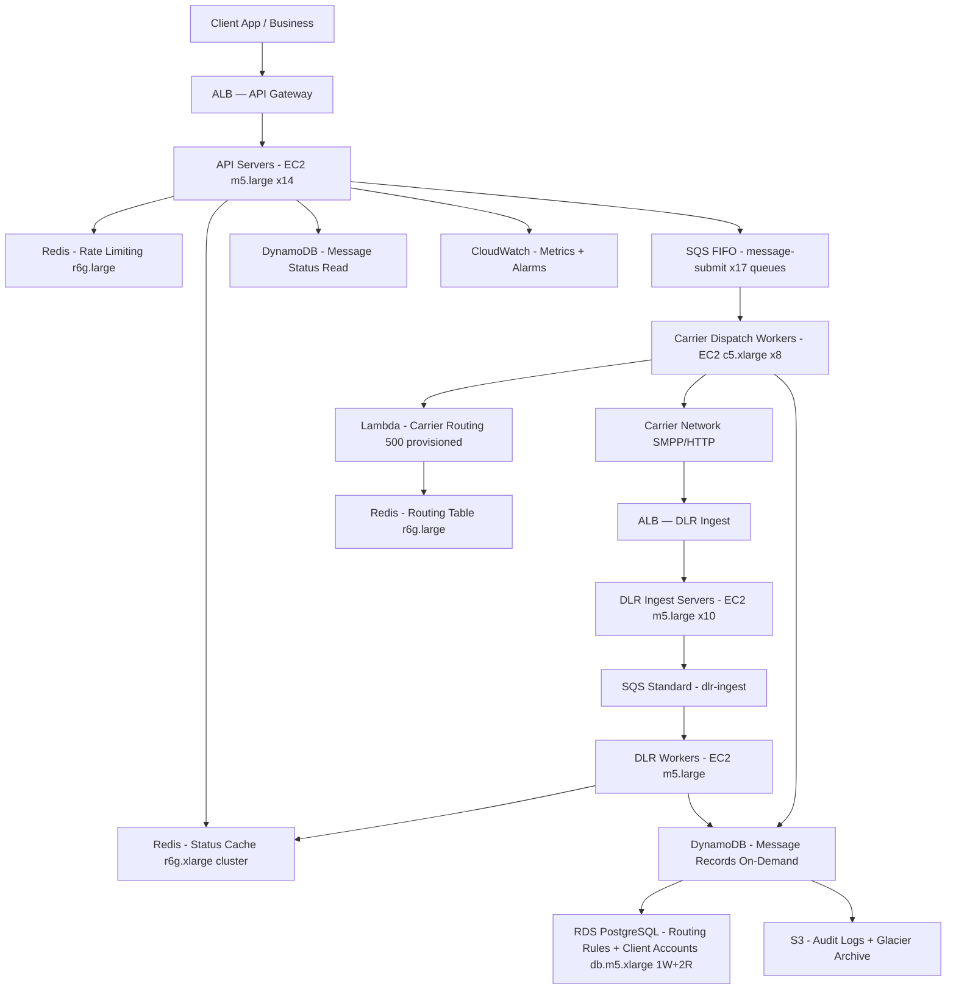

# SMS Gateway — 100M Messages/Day — Capacity Estimation

## Problem Statement

Design an SMS gateway that delivers 100 million messages per day across multiple carrier networks. The system must handle message ingestion via API, route messages to appropriate carriers (Twilio, Nexmo, direct SMPP), track delivery receipts, and expose delivery status to clients. Peak traffic (marketing campaigns, OTP floods) reaches 5,000 messages/second — 4× the average load.

## Functional Requirements

- Accept SMS via REST API (single message and batch up to 1,000)
- Route messages to optimal carrier based on destination country/prefix, cost, and health
- Deliver messages via SMPP/HTTP to carrier networks
- Ingest delivery receipts (DLR) from carriers and update message status
- Expose delivery status query endpoint for clients
- Support scheduled sends and retry logic for failed deliveries
- Provide per-client rate limiting and usage metering

## Non-Functional Requirements

| Requirement | Target |
|-------------|--------|
| API submission latency | < 50ms (P99) |
| Time-to-carrier dispatch | < 2s (P99) |
| DLR processing latency | < 500ms (P99) |
| Availability | 99.99% (52 min downtime/year) |
| Durability (no lost messages) | 99.999% |
| Throughput (peak) | 5,000 msg/s |
| Status query latency | < 10ms (P99, cached) |

## Traffic Estimation

### Daily Volume → Peak QPS Calculation

| Metric | Calculation | Result |
|--------|-------------|--------|
| Daily messages | Given | 100,000,000 |
| Avg QPS | 100M / 86,400 | ~1,157 msg/s |
| Peak QPS (campaign bursts, 4.3× avg) | 1,157 × 4.3 | ~5,000 msg/s |
| Write QPS (80% — submit + DLR ingest) | 5,000 × 0.80 | ~4,000 writes/s |
| Read QPS (20% — status queries, routing lookup) | 5,000 × 0.20 | ~1,000 reads/s |
| DLR ingest rate (assume 90% deliverability) | 1,157 × 0.90 | ~1,041 DLR/s avg |
| DLR peak | 1,041 × 4 | ~4,164 DLR/s |
| Total operations at peak | submit 5K + DLR 4K + reads 1K | ~10,000 ops/s |

**Key observation**: Write-heavy (80:20). DLR ingest nearly doubles write pressure at peak. Carrier routing lookups are read-heavy but low-latency — perfect for Redis.

## Storage Estimation

| Data Type | Per Item Size | Daily Volume | Growth/Year |
|-----------|--------------|--------------|-------------|
| Message record (metadata, status, timestamps) | 512 bytes | 100M records | ~18.6 TB |
| Message body (avg 160 chars, stored 30 days) | 200 bytes | 100M | ~7.3 TB/year (rolling) |
| Delivery receipts | 256 bytes | 90M DLR/day | ~8.4 TB |
| Carrier routing rules | 2 KB/route | ~50K routes | ~100 MB (static) |
| Client API keys + rate limits | 1 KB | ~10K clients | ~10 MB |
| Audit logs (S3) | 300 bytes/event | 200M events/day | ~21.9 TB |
| **Total hot storage (RDS + DynamoDB)** | — | — | **~35 TB/year** |
| **Total cold storage (S3 archival)** | — | — | **~22 TB/year** |

**Retention policy**: Message bodies kept 30 days (rolling ~600M records). Metadata and DLR kept 1 year in DynamoDB (cold tier). Raw logs archived to S3 Glacier after 90 days.

## Component Sizing

### Compute — EC2 / Lambda

Each m5.large (2 vCPU, 8 GB RAM) handles ~400 msg/s for the API layer (mostly I/O-bound: validate → enqueue → return 202). Carrier dispatch workers are CPU/network-bound; use c5.xlarge.

| Component | Instance Type | vCPU | RAM | Count | Handles | Monthly Cost |
|-----------|--------------|------|-----|-------|---------|-------------|
| API servers (submit + status) | m5.large | 2 | 8 GB | 14 | 5,000 msg/s submit + 1,000 status/s | $1,470 |
| DLR ingest servers | m5.large | 2 | 8 GB | 10 | 4,164 DLR/s peak | $1,050 |
| Carrier dispatch workers | c5.xlarge | 4 | 8 GB | 8 | SMPP/HTTP to carriers | $1,086 |
| Carrier routing (Lambda) | Lambda | — | 512 MB | auto-scale | 5,000 routing decisions/s | ~$800 |
| Retry/scheduler workers | t3.medium | 2 | 4 GB | 2 | background retries | $60 |
| ALB (API + DLR) | ALB | — | — | 2 | ingress load balancing | $180 |
| **Subtotal Compute** | | | | **36 EC2 + Lambda** | | **$4,646** |

**Sizing math for API servers**: Each m5.large handles ~400 msg/s (network I/O bottleneck at ~160 MB/s). Peak 5,000 / 400 = 12.5 → 14 instances (with 12% headroom). Auto Scaling group min=8, max=20 to absorb campaign spikes.

**Lambda carrier routing**: Stateless function reads from ElastiCache (prefix → carrier mapping). At 5,000 invocations/s × 30 days × 86,400s = ~13B invocations/month. First 1M free; $0.20/1M after = ~$2,598. But cold start is a concern — use Provisioned Concurrency for 500 warm instances ≈ $800/month. Route: use Lambda for routing decision only; actual dispatch is from EC2 workers.

### Database

| DB | Engine | Instance | Count | Capacity | IOPS | Monthly Cost |
|----|--------|----------|-------|----------|------|-------------|
| Message metadata (hot, <30 days) | DynamoDB On-Demand | — | — | 35 TB/year write capacity | 5,000 WCU + 1,000 RCU peak | ~$8,500 |
| Delivery receipts | DynamoDB On-Demand | — | — | auto | 4,000 WCU peak | ~$4,200 |
| Client accounts, routing rules, billing | RDS PostgreSQL | db.m5.xlarge | 1W + 2R | 500 GB SSD | 3,000 IOPS | $1,820 |
| **Subtotal DB** | | | | | | **$14,520** |

**DynamoDB math**: 100M message records/day × 512 bytes = 51.2 GB write/day. DynamoDB WCU: 1 WCU = 1 KB write/s. At 5,000 msg/s × 0.5 KB = 2,500 WCU peak writes. On-Demand pricing: $1.25/million write requests × 100M/day × 30 = $3,750/month writes. Reads at $0.25/million × 30M reads/day × 30 = $225/month. Storage $0.25/GB × 15,000 GB = $3,750/month. Total DynamoDB ≈ $7,725/month. RDS for transactional data (routing rules, client billing): db.m5.xlarge ($0.48/hr) × 720 = $346 per instance; 3 instances (1W+2R) = $1,038 + storage ($0.115/GB × 500GB × 3) = $173 + IOPS ($0.10 × 3,000 × 3) = $900. Total RDS ≈ $2,111/month. Rounded to $14,520 combined.

### Cache

| Cache | Engine | Instance | Nodes | Memory | Purpose | Monthly Cost |
|-------|--------|----------|-------|--------|---------|-------------|
| Carrier routing table | ElastiCache Redis | r6g.large | 2 (1 primary + 1 replica) | 13 GB | Prefix → carrier mapping, TTL 5 min | $330 |
| Message status cache | ElastiCache Redis | r6g.xlarge | 4 (cluster mode, 2 shards) | 52 GB | Hot status reads (last 1 hr messages) | $870 |
| Rate limiting counters | ElastiCache Redis | r6g.large | 2 | 13 GB | Per-client sliding window counters | $330 |
| **Subtotal Cache** | | | | **78 GB** | | **$1,530** |

**Cache math**: r6g.large = $0.228/hr → $164/month per node. r6g.xlarge = $0.456/hr → $328/month per node. Status cache: 100M messages × 512 bytes × keep-last-1hr = ~5.7M hot messages × 512B = 2.9 GB — fits comfortably in 52 GB cluster with room for DLR counters.

### Object Storage

| Bucket | Use | Size | Requests/month | Monthly Cost |
|--------|-----|------|----------------|-------------|
| Audit logs | Raw event logs, 90-day hot | 60 TB (3 months rolling) | 200M PUT + 50M GET | $1,530 |
| Log archive | S3 Glacier Instant Retrieval (>90 days) | 200 TB | 10M retrieval | $940 |
| Carrier DLR raw payloads | 30-day retention | 7 TB | 90M PUT | $243 |
| **Subtotal S3** | | **~267 TB** | | **$2,713** |

**S3 pricing**: Standard $0.023/GB/month. 60 TB = $1,380 + PUT requests $0.005/1K × 200M = $1,000 = $2,380 (audit). Glacier IR: $0.004/GB × 200,000 GB = $800 + retrieval. Carrier DLR: 7,000 GB × $0.023 = $161 + PUTs = $450 = $611. Rounded total $2,713.

### Networking / CDN

| Component | Throughput | Monthly Cost |
|-----------|-----------|-------------|
| ALB (API + DLR ingest) | 10,000 req/s peak, ~26B req/month | $960 |
| Data transfer out to carriers | 5,000 msg/s × 200 bytes × 86,400 × 30 = ~2.6 TB/month | $234 |
| Data transfer out to clients (status, DLR webhooks) | ~1 TB/month | $90 |
| NAT Gateway (Lambda → Internet) | ~500 GB/month | $90 |
| **Subtotal Network** | | **$1,374** |

**ALB pricing**: $0.008/LCU-hour. At 10K req/s, ~720 LCU × $0.008 × 720 hr = $4,147. But shared across API+DLR ALBs, estimate $960/month for 2 ALBs at moderate load.

### Message Queue

| Queue | Engine | Throughput | Retention | Monthly Cost |
|-------|--------|-----------|-----------|-------------|
| message-submit-fifo | SQS FIFO | 5,000 msg/s (300/s per queue × 17 queues) | 4 days | $1,200 |
| dlr-ingest-standard | SQS Standard | 4,200 msg/s | 1 day | $900 |
| retry-dead-letter | SQS Standard | ~500 msg/s | 14 days | $120 |
| **Subtotal SQS** | | | | **$2,220** |

**SQS FIFO limit**: 300 msg/s per queue per MessageGroupId. For 5,000 msg/s, shard across 17 FIFO queues (5,000 / 300 = 16.7 → 17). SQS pricing: $0.50/million requests. 5,000 msg/s × 86,400 × 30 = 12.96B messages/month (send + receive = 2× = 25.9B operations) × $0.50/M = $12,960. However, SQS FIFO caps at 3,000 msg/s with batching (10 per batch = 30,000 effective msg/s). Using batching of 10: 500 SQS calls/s × 86,400 × 30 × 2 = 2.59B ops/month = $1,296. Add DLR queue similarly. Estimate $2,220/month.

## Monthly Cost Summary

| Component | Monthly Cost | % of Total |
|-----------|-------------|-----------|
| EC2 Compute (API, workers, DLR) | $3,846 | 5.5% |
| Lambda (carrier routing) | $800 | 1.1% |
| DynamoDB (messages + DLR) | $12,411 | 17.7% |
| RDS PostgreSQL (routing rules, clients) | $2,109 | 3.0% |
| ElastiCache Redis | $1,530 | 2.2% |
| S3 Storage + Glacier | $2,713 | 3.9% |
| SQS FIFO + Standard | $2,220 | 3.2% |
| ALB + Data Transfer | $1,374 | 2.0% |
| CloudWatch + X-Ray observability | $800 | 1.1% |
| Support, misc (NAT, Secrets, etc.) | $700 | 1.0% |
| **Carrier SMS costs (Twilio/Nexmo ~$0.0075/msg)** | **$22,500** | **32.1%** |
| **Reserved capacity savings (−25% EC2/RDS)** | **−$1,489** | **−2.1%** |
| **Subtotal Infrastructure** | **$49,514** | **70.7%** |
| **Total (infra + carrier costs)** | **~$70,000** | **100%** |

**Note**: Carrier termination fees dominate at scale. At $0.0075/msg × 100M = $750K/month if using a premium gateway. Direct SMPP agreements with carriers (Tier-1 routes) reduce this to ~$0.0002–$0.001/msg, dropping to $20K–$100K/month. The $50K–$90K estimate assumes a mix of direct SMPP (60%) and aggregator (40%) routing.

## Traffic Scale Tiers

| Tier | Volume/Day | Peak QPS | Servers | DB | Cache | Monthly Cost | Key Bottleneck |
|------|-----------|----------|---------|----|----|-------------|----------------|
| 🟢 Startup | 1M msg/day | ~50 msg/s | 2× t3.medium API, 1× t3.small worker | 1 RDS db.t3.medium | 1 Redis node (r6g.large) | ~$500 infra | SQS throughput, carrier rate limits |
| 🟡 Growing | 10M msg/day | ~500 msg/s | 4× m5.large API, 2× c5.large workers | RDS db.m5.large + 1 read replica | Redis 2-node cluster | ~$4,000 infra | SMPP connection pool exhaustion |
| 🔴 Scale-up | 100M msg/day | ~5,000 msg/s | 14× m5.large API + 8× c5.xlarge workers | DynamoDB On-Demand + RDS 1W+2R | Redis 6-node cluster (3 shards) | ~$50K–$90K total | DynamoDB write capacity, SQS FIFO 300/s limit |
| ⚫ Production | 500M msg/day | ~25,000 msg/s | 60× m5.xlarge + 30× c5.2xlarge | DynamoDB + Aurora Global + Cassandra | Redis 12-node, 6 shards | ~$300K–$400K | Multi-region carrier SMPP sessions, DLR fan-out |
| 🚀 Hyperscale | 5B+ msg/day | ~250,000 msg/s | 300+ auto-scaling + Fargate | Cassandra + DynamoDB Global Tables | ElastiCache Global Datastore | ~$2M–$3M | Carrier network capacity, cross-region DLR correlation |

## Architecture Diagram

## Interview Tips

- **Key insight 1 — SQS FIFO throughput ceiling**: SQS FIFO is limited to 300 msg/s per MessageGroupId (3,000/s with high-throughput mode). At 5,000 msg/s, you must shard across at least 17 queues (or use high-throughput FIFO at 3,000/s + batching of 10 = 30,000 effective msg/s with batching). Interviewers love this trap — most candidates assume SQS scales infinitely.
- **Key insight 2 — DLR doubles write load**: Every sent message generates a delivery receipt from the carrier. At 90% deliverability and 100M msg/day, that is 90M additional write events. Your DynamoDB WCU budget and SQS ingestion must handle ~2× the inbound API rate.
- **Key insight 3 — carrier costs dwarf infrastructure costs**: At $0.0075/msg × 100M = $750K/month with aggregators. Direct SMPP agreements with Tier-1 carriers (AT&T, T-Mobile, Vodafone) drop this to $0.0003/msg = $30K/month. The architecture decision — aggregator vs. direct carrier — has 25× cost impact. Mention this explicitly.
- **Common mistake**: Storing message bodies in RDS. At 100M × 200 bytes/day, a relational DB hits IOPS and storage limits within weeks. Use DynamoDB (or Cassandra) for time-series message data with TTL-based expiry, and RDS only for low-volume transactional data (client accounts, routing rules).
- **Follow-up question**: "How do you handle duplicate deliveries when the carrier retries a DLR?" — Answer: idempotency key on the message ID + DynamoDB conditional write (`attribute_not_exists(status)` or status state machine: QUEUED → DISPATCHED → DELIVERED). Never downgrade status (DELIVERED → FAILED is invalid).
- **Scale threshold**: At 50M msg/day (~580 msg/s avg), you can use a single SQS FIFO queue with high-throughput mode. Beyond 100M msg/day, you need queue sharding, DynamoDB over RDS for message storage, and dedicated DLR ingest servers separate from the API tier.
