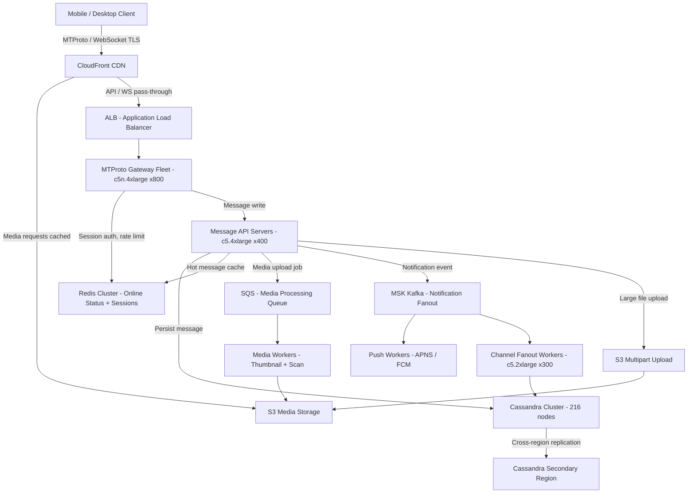

# Telegram — Capacity Estimation

## Problem Statement

Telegram is a cloud-based secure messaging platform serving 500M DAU, supporting 1-on-1 chats, group chats (up to 200K members), and broadcast channels. Every message is encrypted in transit via MTProto, and optional end-to-end encrypted "Secret Chats" are available. The platform must deliver messages with sub-100ms latency globally while supporting rich media (photos, videos, files up to 2GB) and maintaining persistent WebSocket/MTProto connections for real-time push delivery.

## Functional Requirements

- Send and receive text messages, photos, videos, and files (up to 2GB) in 1-on-1 and group chats
- Broadcast messages to channels with up to millions of subscribers
- End-to-end encrypted Secret Chats (client-side key exchange, no server storage)
- Persistent real-time delivery via WebSocket/MTProto connections
- Message history synced across multiple devices (cloud messages stored server-side)
- Online/offline presence and read receipts

## Non-Functional Requirements

| Requirement | Target |
|-------------|--------|
| Message delivery latency | < 100ms P99 (same region), < 300ms P99 (cross-region) |
| Read latency (history fetch) | < 50ms P99 |
| Write latency (send message) | < 80ms P99 |
| Availability | 99.99% (< 52 min downtime/year) |
| Durability | 99.999% (cloud messages; Secret Chat messages are ephemeral) |
| Throughput | 1.5M peak messages/s |
| Concurrent connections | ~150M simultaneous WebSocket/MTProto connections at peak |

## Traffic Estimation

### DAU → Peak QPS Calculation

| Metric | Calculation | Result |
|--------|-------------|--------|
| DAU | Given | 500M |
| Avg messages sent/user/day | ~30 messages sent | ~30 |
| Avg reads (history, channel loads)/user/day | ~50 reads | ~50 |
| Avg media uploads/user/day | ~2 (photos/files) | ~2 |
| Total daily write events | 500M × 30 | 15B messages/day |
| Total daily read events | 500M × 50 | 25B reads/day |
| Total daily requests | 15B + 25B + 500M×2 | ~41B |
| Avg write QPS | 15B / 86,400 | ~174K msg/s |
| Avg read QPS | 25B / 86,400 | ~289K req/s |
| Avg total QPS | 41B / 86,400 | ~475K QPS |
| Peak QPS (3× avg) | 475K × 3 | ~1.43M QPS |
| Peak message QPS (rounded) | — | ~1.5M msg/s |
| Read QPS at peak (55%) | 1.5M × 0.55 | ~825K read QPS |
| Write QPS at peak (45%) | 1.5M × 0.45 | ~675K write QPS |

**Concurrent connections**: 500M DAU × 30% online at any time = ~150M concurrent WebSocket/MTProto sessions.

## Storage Estimation

| Data Type | Per Item Size | Daily Volume | Growth/Year |
|-----------|--------------|--------------|-------------|
| Text messages (metadata + body) | ~500 bytes | 15B msgs × 500B = 7.5TB | ~2.7PB |
| Media thumbnails (stored server-side) | ~20KB avg | 1B uploads × 20KB = 20TB | ~7.3PB |
| Full media files (photos, videos, docs) | ~500KB avg | 1B uploads × 500KB = 500TB | ~182PB |
| User profile / account data | ~2KB | negligible churn | ~10GB/year |
| Channel/group metadata + message index | ~1KB/msg | 15B × 1KB = 15TB/day in indexes | ~5.5PB |
| **Total (text + media)** | — | ~530TB/day | **~190PB/year** |

> Media dominates. In practice Telegram deduplicates files by content hash — estimated real storage growth is ~20–30% of raw due to deduplication, bringing effective growth to **~40–60PB/year**.

## Component Sizing

### Compute — EC2 Fleet

| Component | Instance Type | vCPU | RAM | Count | Handles | Monthly Cost |
|-----------|--------------|------|-----|-------|---------|-------------|
| MTProto/WebSocket gateway | c5n.4xlarge | 16 | 42GB | 800 | ~200K conns each = 160M conns | $211K |
| Message API servers | c5.4xlarge | 16 | 32GB | 400 | ~1,500 write req/s each | $148K |
| Media upload/download servers | m5.4xlarge | 16 | 64GB | 200 | streaming I/O | $111K |
| Channel fanout workers | c5.2xlarge | 8 | 16GB | 300 | async broadcast delivery | $55K |
| Notification push workers | c5.xlarge | 4 | 8GB | 200 | APNS/FCM delivery | $18K |
| Secret Chat relay (stateless) | c5.large | 2 | 4GB | 100 | E2E relay only, no storage | $9K |
| Background/cleanup workers | c5.xlarge | 4 | 8GB | 100 | TTL purge, sync jobs | $9K |
| **Subtotal Compute** | | | | **~2,100** | | **~$561K** |

> c5n instances used for gateway to leverage enhanced networking (100Gbps) needed for 150M concurrent TCP connections.

### Database — Cassandra (Self-Managed on EC2)

Telegram uses Cassandra for message storage due to its write-optimized LSM tree and natural time-series partitioning by (chat_id, bucket_timestamp).

| Cluster | Purpose | Instance Type | Nodes | Storage/Node | Total Capacity | Monthly Cost |
|---------|---------|--------------|-------|-------------|----------------|-------------|
| Messages (primary) | All cloud messages | i3en.6xlarge | 120 | 7.5TB NVMe | 900TB raw, ~300TB usable (RF=3) | $190K |
| Messages (secondary region) | Cross-region replication | i3en.6xlarge | 60 | 7.5TB NVMe | replica set | $95K |
| Channel/Group metadata | group/channel records | r6g.4xlarge | 24 | 200GB EBS gp3 | — | $22K |
| User/account data | profile, auth tokens | r6g.2xlarge | 12 | 100GB EBS gp3 | — | $8K |
| **Subtotal Cassandra** | | | **216** | | | **~$315K** |

> i3en provides local NVMe for Cassandra's compaction-heavy write path — avoids EBS IOPS bottleneck at 675K write QPS.

### Cache — Redis (ElastiCache)

| Cache Cluster | Engine | Instance | Nodes | Memory | Purpose | Monthly Cost |
|---------------|--------|----------|-------|--------|---------|-------------|
| Online presence / sessions | ElastiCache Redis 7 | r6g.4xlarge | 12 | 128GB each = 1.5TB | TTL-based online status, session tokens | $38K |
| Hot message cache (recent chats) | ElastiCache Redis 7 | r6g.2xlarge | 6 | 52GB each = 312GB | Last 100 messages per active chat | $11K |
| Rate limiting / dedup | ElastiCache Redis 7 | r6g.xlarge | 6 | 26GB each = 156GB | Per-user rate limits, idempotency keys | $5K |
| Channel subscriber cache | ElastiCache Redis 7 | r6g.4xlarge | 6 | 128GB each = 768GB | Hot channel subscriber lists | $19K |
| **Subtotal Cache** | | | **30** | **~2.7TB** | | **~$73K** |

### Object Storage — S3

| Bucket | Use | Estimated Size | Requests/month | Monthly Cost |
|--------|-----|---------------|----------------|-------------|
| media-originals | Full-res photos, videos, docs | 500TB (hot tier, recent 6 months) | 30B GET, 1B PUT | $14K storage + $15K requests = $29K |
| media-thumbnails | Compressed previews | 50TB | 100B GET | $1.2K storage + $10K requests = $11K |
| media-archive | Videos/docs older than 6 months (S3 Glacier IR) | 2PB | 500M GET | $23K storage + $5K retrieval = $28K |
| backups | Cassandra snapshots | 100TB | 10M operations | $2.3K storage + $0.1K = $2.4K |
| **Subtotal S3** | | **~2.65PB** | | **~$70K** |

> S3 pricing: $0.023/GB standard, $0.0036/GB Glacier IR. S3 GET: $0.0004/1K requests, PUT: $0.005/1K.

### Networking / CDN

| Component | Throughput | Details | Monthly Cost |
|-----------|-----------|---------|-------------|
| CloudFront CDN (media delivery) | ~5PB/month egress | 80% cache hit on media; $0.0085/GB after 10TB | $42K |
| ALB (API load balancing) | 1.5M req/s peak | ~120B LCU-hours/month | $18K |
| Data Transfer Out (non-CDN, API responses) | ~500TB/month | $0.09/GB first 10TB tier blended | $45K |
| Inter-region replication (Cassandra) | ~100TB/month | $0.02/GB cross-region | $2K |
| **Subtotal Network** | | | **~$107K** |

### Message Queue — SQS / Internal Kafka

| Queue | Engine | Purpose | Throughput | Monthly Cost |
|-------|--------|---------|-----------|-------------|
| Notification fanout | MSK (Kafka) | Trigger push to APNS/FCM | 500K msg/s | $12K |
| Channel broadcast queue | MSK (Kafka) | Async fanout to large channels | 200K msg/s | $8K |
| Media processing jobs | SQS Standard | Thumbnail gen, virus scan | 20M jobs/day | $0.8K |
| **Subtotal Messaging** | | | | **~$21K** |

## Monthly Cost Summary

| Component | Monthly Cost | % of Total |
|-----------|-------------|-----------|
| EC2 Compute (gateway + API + workers) | $561K | 57% |
| Cassandra on EC2 (i3en + r6g nodes) | $315K | 32% |
| ElastiCache Redis | $73K | 7% |
| S3 Storage (all tiers) | $70K | 7% |
| CloudFront CDN | $42K | 4% |
| Data Transfer Out (API) | $45K | 5% |
| MSK Kafka | $20K | 2% |
| ALB + inter-region | $20K | 2% |
| Other (Lambda, CloudWatch, SQS) | $10K | 1% |
| **Total** | **~$1.156M** | **100%** |

> At-scale cost can be reduced 30–40% with 1-year Reserved Instances and Savings Plans, bringing effective monthly cost to the **$700K–$800K** range. Spot instances for stateless workers (fanout, notification) save additional ~15%.

## Traffic Scale Tiers

| Tier | DAU | Peak QPS | Servers | DB | Cache | Monthly Cost | Key Bottleneck |
|------|-----|----------|---------|----|----|-------------|----------------|
| 🟢 Startup | 1M | ~9K | 4× c5.large API + 4× c5.large WS | 1 RDS PostgreSQL (db.r6g.xlarge) | 1 Redis node (r6g.large, 13GB) | ~$3K | Single-AZ DB failover; no horizontal read scale |
| 🟡 Growing | 10M | ~90K | 20× m5.xlarge API + 20× c5.xlarge WS | RDS Aurora + 2 read replicas | Redis cluster 3-node (r6g.xlarge) | ~$25K | Aurora write IOPS ceiling (~80K writes/s); start sharding messages |
| 🔴 Scale-up | 100M | ~430K | 200× c5.2xlarge API + 200× c5n.2xlarge WS | Cassandra 24-node cluster (i3en.2xlarge) | Redis cluster 6-node (r6g.2xlarge) | ~$180K | Channel fanout latency for 10K+ member groups; need async queue |
| ⚫ Production | 500M | ~1.5M | 2,100× mixed fleet (see above) | Cassandra 216-node multi-region | Redis 30-node multi-cluster 2.7TB | ~$800K–$1M | Cross-DC replication lag; MTProto connection memory on gateways |
| 🚀 Hyperscale | 1B+ | ~3M | 4,000+ with auto-scaling groups | Cassandra 400+ nodes OR Spanner for consistency | Distributed Redis/Dragonfly, 6TB+ | ~$2M+ | Global consistency for channel subscriber counts; hot partition on viral channels |

## Architecture Diagram

## Interview Tips

- **Key insight — MTProto vs WebSocket**: Telegram uses its own MTProto protocol rather than standard WebSocket for mobile clients because MTProto is designed for unreliable networks (multiplexes over UDP when available, retransmits at the application layer, resumes sessions without full TLS handshake). At 150M concurrent connections, the memory overhead per connection (~50KB per session on the gateway) means 150M × 50KB = ~7.5TB RAM needed just for connection state — this is why you need a large, specialized gateway fleet.

- **Key insight — channel fanout is the hard problem**: A channel with 5M subscribers posting one message requires fanout to 5M connections. Naive synchronous delivery would block for minutes. Telegram uses a tiered approach: online subscribers get immediate push via Kafka fanout workers; offline subscribers get a "new message" flag written to Cassandra and pulled on next connect. Interviewers love asking "how do you handle a channel with 10M subscribers getting a viral post?"

- **Key insight — Cassandra partition key design**: Messages are partitioned by (chat_id, time_bucket) where time_bucket = floor(unix_timestamp / 86400). This prevents hot partitions on high-traffic channels and bounds partition size to ~1 day of messages per chat. Without bucketing, a group with 1B messages would create a single 500GB Cassandra partition — unreadable. Always call this out.

- **Common mistake — underestimating connection memory**: Candidates calculate QPS correctly but forget that 500M DAU with 30% concurrency = 150M simultaneous long-lived TCP connections. Each connection holds TLS state, session keys, and receive buffer — ~50–100KB per connection = 7.5–15TB of RAM required on gateways. At c5n.4xlarge (42GB RAM), you need 150M × 75KB / 42GB ≈ 268 nodes minimum just for connection state, which aligns with the 800-node gateway fleet (accounting for CPU headroom).

- **Follow-up question**: "How would you implement Secret Chats at scale?" — Secret Chats use client-side Diffie-Hellman key exchange; the server acts as a relay and never stores the plaintext or private keys. The server stores only the encrypted blob and the DH public parameters. At 500M DAU with 5% using Secret Chats, that is 25M concurrent E2E sessions — the key insight is the server has no additional crypto burden, only relay bandwidth, which is why Telegram can offer E2E without significant cost overhead.

- **Scale threshold**: At ~50M DAU, single-region Cassandra starts hitting cross-node latency issues during compaction — you need multi-DC Cassandra with NetworkTopologyStrategy. At ~200M DAU, per-connection gateway memory forces dedicated gateway instances separate from API servers. At 500M DAU, channel fanout latency becomes P99 SLA risk — Kafka partitioning by channel_id with dedicated consumer groups per shard is required.
