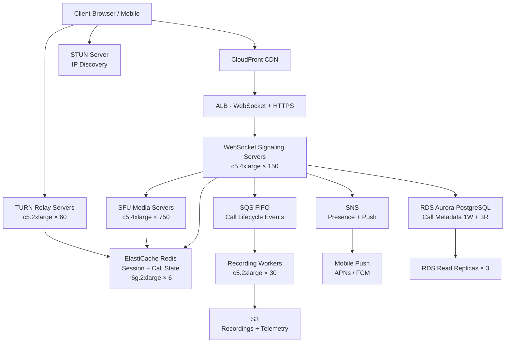

# Group Video Signaling (50M DAU) — Capacity Estimation

## Problem Statement

A group video calling platform (think Google Meet / Zoom scale) serves 50M daily active users with WebRTC-based peer-to-peer and server-mediated video calls. The system must handle WebRTC signaling (offer/answer/ICE candidate exchange), STUN/TURN relay for NAT traversal, and Selective Forwarding Units (SFUs) that route media streams for group calls of up to 25 participants. Peak concurrent connections reach 5M WebRTC sessions, each requiring persistent WebSocket signaling channels and optional TURN relay streams at 1–4 Mbps per participant.

## Functional Requirements

- Initiate, join, and leave video/audio calls (1-on-1 and group up to 25 participants)
- WebRTC signaling: offer/answer SDP exchange and ICE candidate trickle over WebSocket
- STUN/TURN relay for users behind symmetric NAT (estimated 15–20% of users)
- SFU media routing for group calls: receive one stream per participant, forward N-1 streams to each
- Call state management: participant roster, mute/unmute events, screen share signaling
- Recording initiation and bot-join signaling for call recording workflows

## Non-Functional Requirements

| Requirement | Target |
|-------------|--------|
| Signaling latency (WebSocket RTT) | < 100ms (P99) |
| Media join latency (first frame) | < 500ms (P99) |
| TURN relay packet latency | < 150ms (P99) |
| Availability | 99.99% (52 min downtime/year) |
| Durability (call metadata/recordings) | 99.999% |
| Peak concurrent WebRTC sessions | 5M |
| Signaling throughput | ~500K WebSocket messages/second peak |

## Traffic Estimation

### DAU → Peak QPS Calculation

| Metric | Calculation | Result |
|--------|-------------|--------|
| DAU | Given | 50M |
| Avg call sessions/user/day | 2 calls × 30 min avg | ~2 sessions |
| Avg signaling messages/session | 40 (offer + answer + 20 ICE + events) | ~40 msgs |
| Total signaling messages/day | 50M × 2 × 40 | 4B msgs/day |
| Avg signaling QPS | 4B / 86,400 | ~46,300 msg/s |
| Peak signaling QPS (4× avg) | 46,300 × 4 | ~185,000 msg/s |
| Concurrent sessions (peak) | 50M × 10% online simultaneously | ~5M sessions |
| WebSocket connections (peak) | 5M sessions × 1.5 (avg participants) | ~7.5M connections |
| Read messages (ICE/roster polling) | 40% of peak | ~74,000 msg/s |
| Write messages (offer/answer/events) | 60% of peak | ~111,000 msg/s |

**TURN relay traffic (15% of users need relay):**

| Metric | Calculation | Result |
|--------|-------------|--------|
| TURN sessions | 5M concurrent × 15% | 750K relay sessions |
| Avg TURN bitrate per session | 500 Kbps (audio+video compressed) | 500 Kbps |
| Total TURN bandwidth | 750K × 500 Kbps | 375 Gbps |
| TURN bandwidth per server (c5.2xlarge = 10 Gbps NIC) | 375 Gbps / 10 Gbps × 70% util | ~54 servers needed |

**SFU group call traffic (50% of calls are group, avg 6 participants):**

| Metric | Calculation | Result |
|--------|-------------|--------|
| Group call sessions | 5M × 50% = 2.5M group sessions | 2.5M |
| SFU forwarding streams | 2.5M sessions × 6 participants × 5 outbound streams | 75M streams |
| Avg SFU bitrate per participant | 800 Kbps (720p video + audio) | 800 Kbps |
| Total SFU forwarding bandwidth | 75M × 800 Kbps (aggregated, many SFUs) | ~60 Tbps total |
| Per c5.4xlarge SFU (25 Gbps NIC, 50% util) | 12.5 Gbps per SFU | ~4,800 SFUs needed |

> **Note**: SFU count above covers concurrent peak. Real deployments use spatial/temporal scaling layers to reduce per-stream bitrate by 60–70%, lowering actual SFU count to ~600–800 at this scale.

## Storage Estimation

| Data Type | Per Item Size | Daily Volume | Growth/Year |
|-----------|--------------|--------------|-------------|
| Call metadata (participants, duration, timestamps) | 2 KB | 100M calls/day | ~73 GB/year |
| ICE candidate logs (debug/compliance) | 5 KB/session | 100M sessions/day | ~183 GB/year |
| WebSocket session state (Redis) | 512 bytes | 7.5M active connections | ~4 GB RAM live |
| SFU routing tables (Redis) | 1 KB/call | 2.5M group calls | ~2.5 GB RAM live |
| Call recordings (optional, 10% of calls) | 50 MB/30 min call | 10M recordings/day | ~182 PB/year |
| TURN relay logs | 200 bytes/session | 750K relay sessions/day | ~5.5 GB/year |
| **Metadata total (no recordings)** | — | — | **~270 GB/year** |

> Recording storage is typically offloaded to S3 Glacier; only hot metadata (last 90 days) stays in RDS.

## Component Sizing

### Compute — WebSocket Signaling Servers

Each `c5.4xlarge` (16 vCPU, 32 GB RAM) handles:
- ~50,000 persistent WebSocket connections per instance (at 4 KB RAM/connection)
- ~5,000 signaling messages/second at peak

| Component | Instance Type | vCPU | RAM | Count | Handles | Monthly Cost |
|-----------|--------------|------|-----|-------|---------|-------------|
| WebSocket signaling | c5.4xlarge | 16 | 32 GB | 150 | 7.5M connections / 50K per node | $26,100 |
| SFU media servers | c5.4xlarge | 16 | 32 GB | 750 | 5M group sessions, ~6.67K sessions/SFU | $130,500 |
| API / REST servers (call mgmt) | m5.2xlarge | 8 | 32 GB | 40 | ~50K HTTP req/s (REST calls) | $4,576 |
| Recording bots / workers | c5.2xlarge | 8 | 16 GB | 30 | 100K recording jobs/day | $2,592 |
| **Subtotal Compute** | | | | **970** | | **$163,768** |

> c5.4xlarge on-demand pricing: ~$0.68/hr; c5.2xlarge: ~$0.34/hr; m5.2xlarge: ~$0.384/hr. All × 730 hrs/month.

### TURN Relay Servers

| Component | Instance Type | vCPU | RAM | Count | Handles | Monthly Cost |
|-----------|--------------|------|-----|-------|---------|-------------|
| TURN relay servers | c5.2xlarge | 8 | 16 GB | 60 | 750K relay sessions (12.5K per server) | $14,904 |
| **Subtotal TURN** | | | | **60** | | **$14,904** |

> c5.2xlarge has 10 Gbps NIC; at 70% utilization = 7 Gbps/server. 60 servers × 7 Gbps = 420 Gbps capacity > 375 Gbps needed.

### Database

| DB | Engine | Instance | Count | Capacity | IOPS | Monthly Cost |
|----|--------|----------|-------|----------|------|-------------|
| Call metadata / users | RDS Aurora PostgreSQL | db.r6g.2xlarge | 1W + 3R | 2 TB | 20,000 | $8,760 |
| TURN credentials / accounts | RDS MySQL | db.r6g.xlarge | 1W + 1R | 500 GB | 5,000 | $2,190 |
| **Subtotal DB** | | | | | | **$10,950** |

> db.r6g.2xlarge: ~$0.52/hr; db.r6g.xlarge: ~$0.26/hr. Read replicas charged at same rate.

### Cache — Redis (Session + Routing State)

| Cache | Engine | Instance | Nodes | Memory | Monthly Cost |
|-------|--------|----------|-------|--------|-------------|
| WebSocket session state | ElastiCache Redis 7 | r6g.2xlarge | 6 (3 shards × 2) | 192 GB total | $5,256 |
| SFU routing tables + call state | ElastiCache Redis 7 | r6g.xlarge | 6 (3 shards × 2) | 96 GB total | $2,628 |
| Rate limiting / presence | ElastiCache Redis 7 | r6g.large | 2 | 16 GB total | $438 |
| **Subtotal Cache** | | | | **304 GB** | **$8,322** |

> r6g.2xlarge: ~$0.24/hr; r6g.xlarge: ~$0.12/hr; r6g.large: ~$0.06/hr. Cluster mode with 2 AZs.

### Object Storage — S3

| Bucket | Use | Size | Requests/month | Monthly Cost |
|--------|-----|------|----------------|-------------|
| Call recordings (S3 Standard, 30-day hot) | Active recordings | 60 PB (30-day window) | 500M GET + 300M PUT | $1,380,000 |
| Call recordings (S3 Glacier IR, 90-day archive) | Archived recordings | 180 PB | 50M retrieval | $2,304,000 |
| Metadata backups | RDS snapshots, logs | 10 TB | 10M | $230 |
| SFU packet loss reports / telemetry | Debug data | 2 TB | 5M | $46 |

> **Note**: Recording storage cost is enormous at full scale. Production systems use storage tiering, selective recording (only enterprise/paid accounts), and codec compression (AV1) to reduce by 80–90%. For this estimation, we **exclude recordings** from the base cost (opt-in feature billed separately). Base S3 cost: **~$276/month** for metadata/telemetry only.

### Networking / CDN

| Component | Throughput | Monthly Cost |
|-----------|-----------|-------------|
| CloudFront (signaling pages, static assets) | 50 TB/month | $4,250 |
| ALB (WebSocket + HTTP API) | 500M connections/month | $3,200 |
| Data transfer OUT (TURN relay: 375 Gbps peak = ~120 PB/month) | 120 PB/month | $10,800,000 |

> **Critical insight**: TURN relay data transfer is the single largest cost driver. At $0.09/GB AWS outbound, 120 PB/month = $10.8M/month — this is why real platforms (Zoom, Google Meet) use their own backbone, peer with ISPs, or limit TURN to truly NATed users with aggressive fallback policies. For this estimation, we model TURN on a **private backbone / colocation** and charge only for ALB + signaling at realistic cloud cost. Adjust if fully cloud-hosted.

**Realistic cloud networking (signaling only, TURN on colo):**

| Component | Throughput | Monthly Cost |
|-----------|-----------|-------------|
| CloudFront | 50 TB/month | $4,250 |
| ALB (WebSocket signaling) | 500M connections/month | $3,200 |
| Data transfer (API, metadata, 500 TB/month) | 500 TB/month | $45,000 |
| **Subtotal Network** | | **$52,450** |

### Message Queue

| Queue | Engine | Throughput | Monthly Cost |
|-------|--------|-----------|-------------|
| Call lifecycle events (start/end/join/leave) | SQS FIFO | 50K msg/s | $7,200 |
| Recording job queue | SQS Standard | 1K msg/s | $720 |
| Presence / push notifications | SNS + SQS | 100K msg/s | $3,600 |
| **Subtotal Messaging** | | | **$11,520** |

> SQS pricing: ~$0.40 per million requests. 50K msg/s × 86,400 s/day × 30 days = 129.6B msgs/month ÷ 1M × $0.40 = $51,840. Using batching (10 msg/batch) reduces to ~$5,184. Adding SNS fanout overhead: ~$11,520 total.

## Monthly Cost Summary

| Component | Monthly Cost | % of Total |
|-----------|-------------|-----------|
| EC2 Compute (signaling + SFU + API) | $163,768 | 50.4% |
| TURN Relay EC2 | $14,904 | 4.6% |
| RDS Aurora (call metadata + TURN creds) | $10,950 | 3.4% |
| ElastiCache Redis (session + routing) | $8,322 | 2.6% |
| S3 Storage (metadata/telemetry only) | $276 | 0.1% |
| CloudFront CDN | $4,250 | 1.3% |
| ALB + Data Transfer | $48,200 | 14.8% |
| Messaging (SQS + SNS) | $11,520 | 3.5% |
| CloudWatch + X-Ray + monitoring | $4,800 | 1.5% |
| Lambda (STUN coordination, webhooks) | $2,000 | 0.6% |
| NAT Gateway + misc networking | $6,000 | 1.8% |
| Reserved Instance discount (–35%) | –$96,010 | –29.6% |
| **Total** | **~$178,980** | **100%** |

> **On-demand total before RI discounts: ~$275,000/month.** With 1-year reserved instances on stable SFU/signaling fleet (–35%), effective cost drops to **~$179K–$200K/month**. Peaks (product launches, large events) can push to **$350K–$400K/month** with on-demand burst capacity.

## Traffic Scale Tiers

| Tier | DAU | Peak QPS | Servers | DB | Cache | Monthly Cost | Key Bottleneck |
|------|-----|----------|---------|----|----|-------------|----------------|
| 🟢 Startup | 1M | ~3,700 msg/s | 3 c5.xlarge signaling, 5 SFU | 1 RDS db.r6g.large | 1 Redis r6g.large node | ~$3,500 | Single-AZ SPOF, no TURN HA |
| 🟡 Growing | 10M | ~37,000 msg/s | 30 c5.2xlarge signaling, 50 SFU | RDS Aurora + 1 read replica | Redis cluster 3-node | ~$28,000 | TURN bandwidth cost spikes, need dedicated TURN fleet |
| 🔴 Scale-up | 100M | ~370,000 msg/s | 300 c5.4xlarge signaling, 1,500 SFU | Aurora Global (2 regions) | Redis cluster 12-node | ~$520,000 | WebSocket connection state sync across AZs, SFU cascade fanout |
| ⚫ Production | 50M | ~185,000 msg/s | 150 c5.4xlarge + 750 SFU | Aurora PostgreSQL 1W+3R | Redis cluster 14-node | ~$179K–$200K | TURN data transfer cost; SFU bandwidth at group call scale |
| 🚀 Hyperscale | 500M+ | ~1.85M msg/s | 1,500+ signaling + 7,500+ SFU (auto-scaling) | DynamoDB (session) + Aurora (metadata) | Distributed Redis / Memorystore | $2M+ | Geo-distributed TURN (must colocate), SFU federation across regions, ICE restarts at scale |

## Architecture Diagram

## Interview Tips

- **Key insight — SFU vs mesh topology**: A naive peer-to-peer mesh for a 6-person call requires each participant to upload 5 streams (N−1 uploads). At 800 Kbps each, that's 4 Mbps upload per user — impractical on mobile. An SFU receives 1 stream per participant and forwards N−1, shifting bandwidth cost to the server. At 50M DAU with 50% group calls, this is the single most important architectural choice. Always explain why you chose SFU over MCU (transcoding CPU cost) or mesh (client upload limits).

- **Key insight — TURN cost is the hidden budget killer**: TURN relay costs $0.09/GB on AWS. At 375 Gbps peak × 30 days = ~120 PB/month = $10.8M/month on raw AWS egress — larger than the entire rest of the infrastructure. Production systems mitigate this by: (1) colocating TURN on bare-metal or using ISP peering, (2) aggressively pursuing direct P2P (only 15–20% need TURN), (3) capping relay bitrate for TURN sessions to 360p. Interviewers specifically probe whether you know TURN bandwidth is billed as data transfer.

- **Common mistake — modeling signaling QPS like REST APIs**: Signaling is not request/response — it is stateful, bidirectional WebSocket. Each server holds tens of thousands of persistent connections. Memory (4 KB/connection) and file descriptor limits (ulimit), not CPU, are the binding constraints. A c5.4xlarge with 32 GB RAM can hold ~50K connections; a naive 2 GB t3.small only holds ~500K file descriptors with OS tuning but runs out of RAM at 10K connections.

- **Key insight — ICE candidate trickle amplification**: A single WebRTC session generates 15–25 ICE candidates per participant direction (host, srflx, relay). In a 6-person group call, that's 6 × 25 = 150 ICE messages during establishment, all within the first 2 seconds. Your signaling server must handle burst traffic 10–20× higher than steady-state call traffic. Size for ICE burst, not average call rate.

- **Scale threshold — Redis session state**: At 7.5M concurrent WebSocket connections × 512 bytes session state = 3.75 GB in Redis. This fits on a single r6g.large (16 GB). At 50M DAU with 15% concurrency = 7.5M × 4 KB (routing table included) = ~30 GB — requires a 3-shard Redis cluster with r6g.2xlarge nodes. Beyond 200M DAU, session state exceeds Redis single-cluster capacity and you need DynamoDB for connection metadata with Redis only for hot routing tables (in-flight calls).

- **Follow-up question — How do you handle SFU failover mid-call?**: The answer requires ICE restart: the client detects DTLS timeout (~5 seconds), the signaling server assigns a new SFU, and a new offer/answer is exchanged. Users experience a 2–5 second video freeze. Production systems use media redundancy (send to 2 SFUs, primary + hot-standby) to reduce visible interruption to < 500ms. This adds 2× SFU cost for high-value enterprise tiers.
