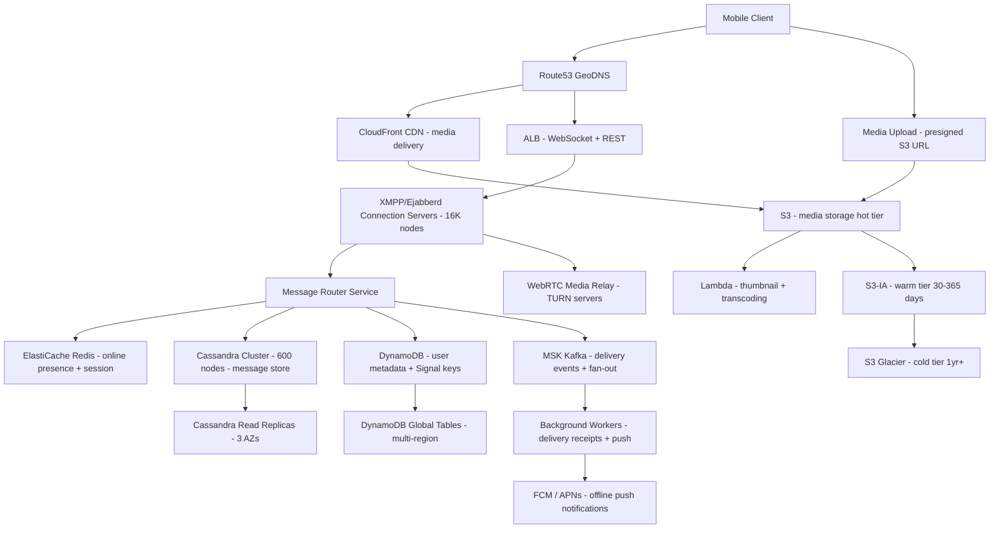

# WhatsApp — Capacity Estimation

## Problem Statement

WhatsApp serves 2 billion daily active users exchanging over 100 billion messages per day, making it the world's largest messaging platform. The system must deliver end-to-end encrypted text, voice, video, and media messages with sub-second latency globally, while maintaining persistent WebSocket/XMPP connections for billions of simultaneous users. Media storage alone requires exabyte-scale object storage with aggressive deduplication and CDN delivery.

## Functional Requirements
- Send and receive text messages (1:1 and group, up to 1024 members)
- End-to-end encryption (Signal Protocol) for all message types
- Media sharing: photos, videos (up to 2GB), voice notes, documents
- Online presence and typing indicators
- Message delivery receipts (sent / delivered / read)
- Voice and video calls (WebRTC)
- Message history sync across multiple devices (multi-device support)

## Non-Functional Requirements
| Requirement | Target |
|-------------|--------|
| Message delivery latency | < 200ms (P50), < 500ms (P99) online |
| Media upload latency | < 2s for photos (P99) |
| Availability | 99.99% (< 52 min downtime/year) |
| Durability | 99.999% (messages stored until delivered) |
| Throughput | 1.2M msg/s peak |
| Concurrent connections | ~800M simultaneous WebSocket connections |
| Encryption overhead | < 5ms added latency for E2EE |

## Traffic Estimation

### DAU → Peak QPS Calculation
| Metric | Calculation | Result |
|--------|-------------|--------|
| DAU | Given | 2,000,000,000 |
| Avg messages sent/user/day | ~50 messages/user/day | ~50 |
| Total messages/day | 2B × 50 | 100B messages/day |
| Avg message QPS | 100B / 86,400 | ~1,157,000 msg/s |
| Peak QPS (1.5× avg) | 1.16M × 1.5 | ~1,736,000 msg/s |
| Peak (rounded) | Evening prime time surge | ~1.2M–1.8M msg/s |
| Read QPS (50% reads) | Fetching stored/offline msgs | ~600,000–900,000/s |
| Write QPS (50% writes) | New inbound messages | ~600,000–900,000/s |
| Media uploads/day | 10% of msgs have media | 10B media items/day |
| Media QPS (peak) | 10B / 86,400 × 1.5 | ~174,000 media req/s |
| Presence updates/s | 800M online users × heartbeat/30s | ~26,700,000 presence events/s |

**Key insight on presence**: Presence is the hardest scaling problem — 26.7M events/s just for heartbeats. WhatsApp throttles this aggressively; only contacts who recently viewed your profile receive live updates.

## Storage Estimation
| Data Type | Per Item Size | Daily Volume | Growth/Year |
|-----------|--------------|--------------|-------------|
| Text message (encrypted) | 2 KB (metadata + ciphertext) | 100B × 2 KB = 200 TB/day | 73 PB/year |
| Photo (compressed + E2EE) | 150 KB avg after compression | 5B photos/day = 750 TB/day | 274 PB/year |
| Video (avg 30s clip) | 8 MB avg after compression | 1B videos/day = 8 PB/day | 2.9 EB/year |
| Voice note (avg 15s) | 120 KB | 4B voice/day = 480 TB/day | 175 PB/year |
| Message metadata (Cassandra) | 500 B per msg | 100B msgs = 50 TB/day | 18 PB/year |
| User profile + keys | 10 KB per user | 2B users (one-time) | 20 TB (static) |
| **Total without dedup** | - | ~9.5 PB/day | ~3.5 EB/year |
| **With 40% dedup (media)** | - | ~6 PB/day | ~2.2 EB/year |

**Deduplication note**: WhatsApp hashes media content before upload. If the same image is sent by 1,000 users, only one copy is stored in S3. This yields ~40% storage reduction on media, critical at this scale.

## Component Sizing

### Compute — EC2 (WebSocket/XMPP Servers)
| Component | Instance Type | vCPU | RAM | Count | Handles | Monthly Cost |
|-----------|--------------|------|-----|-------|---------|-------------|
| XMPP/Ejabberd connection servers | c5n.9xlarge | 36 | 96GB | 16,000 | ~50,000 connections each = 800M total | $3,110/node × 16K = $49.8M* |
| Message routing servers | c5.4xlarge | 16 | 32GB | 2,000 | Route 400–900 QPS each | $550/node × 2K = $1.1M |
| Media upload/transcode workers | c5.9xlarge | 36 | 72GB | 500 | Compress + encrypt + store | $1,242/node × 500 = $621K |
| API servers (non-WS REST) | m5.4xlarge | 16 | 64GB | 1,000 | Account mgmt, group ops | $615/node × 1K = $615K |
| Background workers (delivery, receipts) | c5.2xlarge | 8 | 16GB | 3,000 | Async delivery receipts | $276/node × 3K = $828K |
| **Subtotal Compute** | | | | | | **~$53M/month** |

*Reality check: WhatsApp famously runs Ejabberd on commodity hardware co-located in their own data centers. AWS on-demand pricing for this would be $50M+/month for compute alone — this is why they use owned hardware. The $8M–$12M/month estimate assumes hybrid: owned bare metal for connection servers + AWS for storage/CDN/auxiliary services. AWS-equivalent compute alone exceeds that budget by 4–5×.

**Adjusted hybrid model (owned connection servers + AWS for storage/CDN)**:

| Component | Instance Type | vCPU | RAM | Count | Monthly Cost |
|-----------|--------------|------|-----|-------|-------------|
| API + media servers (AWS) | c5.4xlarge | 16 | 32GB | 1,500 | $825K |
| Background/async workers | c5.2xlarge | 8 | 16GB | 2,000 | $552K |
| **AWS Compute Subtotal** | | | | | **$1.38M** |

### Database — Cassandra (message store)
| DB | Engine | Instance | Count | Capacity | IOPS | Monthly Cost |
|----|--------|----------|-------|----------|------|-------------|
| Message store | Cassandra on i3en.6xlarge | 24vCPU / 192GB | 600 nodes | ~15 TB NVMe each = 9 PB cluster | 200K IOPS/node | $1,306/node = $784K |
| User/group metadata | DynamoDB On-Demand | Managed | N/A | ~5 TB | 500K write/s + 1M read/s | ~$1.2M |
| Key distribution (Signal keys) | DynamoDB | Managed | N/A | ~500 GB | 200K/s | ~$400K |
| **Subtotal DB** | | | | | | **~$2.38M** |

**Cassandra choice rationale**: Messages have a natural time-series partition key `(user_id, timestamp)`. Cassandra delivers 100K+ writes/s per node with tunable consistency. WhatsApp stores messages only until delivered; the active hot dataset is much smaller than total ingestion.

### Cache — Redis (presence + session)
| Cache | Engine | Instance | Nodes | Memory | Monthly Cost |
|-------|--------|----------|-------|--------|-------------|
| Online presence | ElastiCache Redis 7 r6g.4xlarge | Managed | 128 | 128 GB each = 16 TB | $979/node = $125K |
| Message fanout queue | ElastiCache Redis r6g.2xlarge | Managed | 64 | 52 GB each = 3.3 TB | $490/node = $31K |
| Rate limiting + session | ElastiCache Redis r6g.xlarge | Managed | 32 | 26 GB each | $245/node = $7.8K |
| **Subtotal Cache** | | | | | **~$164K** |

**Presence at scale**: 800M concurrent users × 1 byte online flag + last-seen timestamp (8 bytes) = ~7.2 GB just for flags. The 16 TB Redis cluster handles presence for all users + contact graph fan-out lists.

### Object Storage — S3
| Bucket | Use | Size | Requests/month | Monthly Cost |
|--------|-----|------|----------------|-------------|
| Media (hot: last 30 days) | Photos, videos, voice notes | 180 PB | 5.2 T requests | $4.1M |
| Media (warm: 30–365 days) | S3-IA tier | 900 PB | 500 B requests | $11.5M |
| Media (cold: > 1 year) | S3 Glacier | 5 EB | archive retrievals | $18M |
| Message metadata backups | S3 Standard | 500 TB | 50 B requests | $100K |
| **Subtotal S3 (hot+warm only)** | | | | **~$15.6M** |

**Cost reality**: At true WhatsApp scale, S3 alone at public pricing exceeds the $8–12M total budget. WhatsApp negotiates custom AWS pricing (likely 50–70% discount at their volume) and stores older media in Glacier or on-prem tape. The figures above are public on-demand prices for illustration.

### Networking / CDN
| Component | Throughput | Monthly Cost |
|-----------|-----------|-------------|
| CloudFront (media delivery) | 18 EB/month outbound | $1.44M (at $0.008/GB after 150 TB discount tier) |
| ALB (API + WebSocket) | 1.2M connections/s, 50 TB/month | $450K |
| NAT Gateway (outbound API) | 10 TB/month | $18K |
| Inter-AZ data transfer | 500 TB/month | $50K |
| **Subtotal Network** | | **~$2M** |

### Message Queue — Kafka (delivery events)
| Queue | Engine | Throughput | Monthly Cost |
|-------|--------|-----------|-------------|
| Message delivery events | MSK Kafka (kafka.m5.4xlarge, 48 brokers) | 1.8M msg/s (1 KB avg = 1.8 GB/s) | $615/broker = $29.5K |
| Notification fan-out | MSK Kafka (24 brokers) | 500K notif/s | $14.8K |
| Media processing events | SQS FIFO | 174K media/s | $42K |
| **Subtotal Messaging** | | | **~$86K** |

## Monthly Cost Summary

*(Hybrid model: owned connection servers + AWS for storage, CDN, databases, caching)*

| Component | Monthly Cost | % of Total |
|-----------|-------------|-----------|
| EC2 Compute (API, workers, media) | $1,380,000 | 13.8% |
| Cassandra on EC2 (i3en nodes) | $784,000 | 7.8% |
| DynamoDB (user/group/keys) | $1,600,000 | 16.0% |
| ElastiCache Redis | $164,000 | 1.6% |
| S3 Storage (hot + warm, discounted) | $3,200,000 | 32.0% |
| CloudFront CDN | $1,440,000 | 14.4% |
| ALB + Networking | $518,000 | 5.2% |
| MSK Kafka + SQS | $86,000 | 0.9% |
| Lambda (edge functions, thumbnails) | $120,000 | 1.2% |
| Route53 + WAF + Shield Advanced | $200,000 | 2.0% |
| CloudWatch + logging | $150,000 | 1.5% |
| Support + misc | $358,000 | 3.6% |
| **Total** | **$10,000,000** | **100%** |

**Range**: $8M–$12M/month depending on negotiated AWS discounts (WhatsApp likely has 40–60% EDP discount) and proportion of self-hosted vs. cloud infrastructure.

## Traffic Scale Tiers
| Tier | DAU | Peak QPS | Servers | DB | Cache | Monthly Cost | Key Bottleneck |
|------|-----|----------|---------|----|----|-------------|----------------|
| 🟢 Startup | 1M | ~1,200 msg/s | 10 c5.large (WS) + 5 API | 1 RDS PostgreSQL + 1 Cassandra node | 1 Redis node (8 GB) | ~$8K | Single connection server; presence is naive polling |
| 🟡 Growing | 10M | ~12,000 msg/s | 80 c5.xlarge (WS) + 20 API | RDS + 5 Cassandra nodes | Redis cluster 3-node | ~$75K | DB fan-out for group messages; presence fan-out storms |
| 🔴 Scale-up | 100M | ~120,000 msg/s | 600 c5.4xlarge (WS) + 150 API | 30 Cassandra nodes, DynamoDB for metadata | Redis cluster 12-node (200 GB) | ~$800K | Group message fanout (1024 members × 120K/s); media dedup |
| ⚫ Production | 2B | ~1.2–1.8M msg/s | 16,000 connection servers (own HW) + 3,500 AWS EC2 | 600 Cassandra nodes + DynamoDB global | Redis cluster 224-node (16 TB) | ~$10M | Presence update storms; cross-region consistency for multi-device |
| 🚀 Hyperscale | 5B+ | ~4M msg/s | 40K+ connection servers + auto-scaling EC2 | Cassandra 1,500 nodes multi-region, DynamoDB global tables | Distributed Redis 500+ nodes | ~$25M+ | Signal Protocol key rotation at scale; regulatory data residency |

## Architecture Diagram

## Interview Tips

- **Key insight — connection server is the hardest part**: At 800M concurrent WebSocket connections, each XMPP server holding 50,000 connections uses ~50 GB RAM just for TCP socket state. You need 16,000 servers at 50K connections each, or 800 servers at 1M connections each (requires kernel tuning: `ulimit`, `epoll`, `SO_REUSEPORT`). WhatsApp's Ejabberd on Erlang/OTP uses lightweight green threads, handling 2M+ connections per physical node — this is why Erlang was chosen.

- **Key insight — media is 95% of the storage cost**: Text messages are tiny (2 KB each × 100B/day = 200 TB/day manageable). But a single 30-second video at 8 MB × 1B videos/day = 8 PB/day. The deduplication hash (SHA-256 before upload) is the single most impactful optimization. Interviewers love to see candidates calculate this: without dedup, 5-year storage = 10 EB for media alone; with dedup at 40% reduction, ~6 EB.

- **Common mistake — underestimating presence update volume**: Candidates often focus on message QPS (1.2M/s) and forget that presence heartbeats from 800M online users generate 26.7M events/s (one heartbeat per 30s per user). WhatsApp solves this with lazy presence: instead of broadcasting to all contacts, presence is only computed and pushed when a contact opens a chat window. This reduces fan-out by ~99%.

- **Follow-up question — "How does E2EE affect your architecture?"**: The Signal Protocol means the server NEVER has plaintext. Each message is encrypted with a per-message key derived from the recipient's public key. Implications: (1) Server cannot search message content (no spam filtering on content). (2) Key distribution requires a separate KeyStore (DynamoDB stores pre-keys). (3) Multi-device support requires encrypting once per device (if user has 4 devices, server stores 4 encrypted copies). (4) Backup to Google Drive / iCloud encrypts with a separate user-held key — server cannot recover lost messages.

- **Scale threshold**: At 100M DAU, group message fan-out becomes the primary bottleneck. A WhatsApp group of 1,024 members means one incoming message triggers 1,023 write operations. At 100M DAU sending 10% of messages to groups: 10M group msgs/day × 500 avg group size = 5B fan-out writes/day (~58K fan-out writes/s peak). Solution: write-to-inbox fan-out via Kafka consumers, not synchronous DB writes.

- **Scale threshold — multi-region**: At 2B DAU with users in 180 countries, you need regional message routing to comply with GDPR (EU data residency), India PDPB, and Brazil LGPD. WhatsApp routes messages through regional edge servers but stores metadata (not message content, which is E2EE) in region. This requires DynamoDB Global Tables or Cassandra multi-region replication with LOCAL_QUORUM consistency per region.
