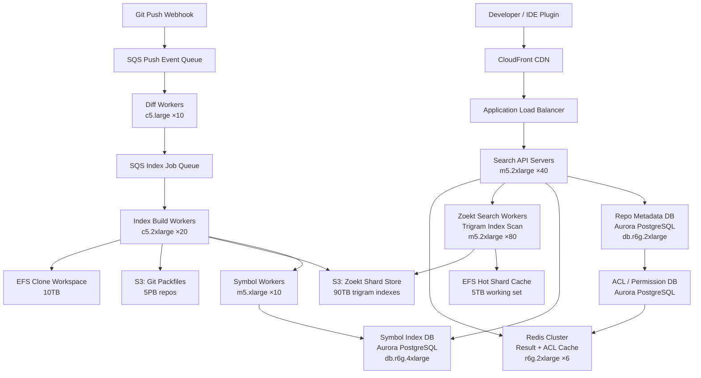

# Code Search (GitHub-like) — Capacity Estimation

## Problem Statement

A GitHub-like code search platform serves 10M daily active developers searching across millions of repositories using exact match, regex, and symbol lookup queries. The system must index petabytes of source code, serve sub-second search latency at 50K peak QPS, and re-index repositories on every push within minutes. Unlike web search, code search is structurally complex — regex patterns, symbol graphs, and cross-file references demand specialized index formats (trigram/Zoekt) rather than inverted keyword indexes.

## Functional Requirements

- Full-text code search with exact match, regex, and wildcard patterns
- Symbol search (function definitions, class declarations, variable usages)
- Repository-scoped and cross-repository search with access control enforcement
- Near-real-time index updates on every git push (within 5 minutes)
- Syntax-aware filtering by language, file path, and commit SHA
- Paginated results with filename, line number, and snippet highlighting

## Non-Functional Requirements

| Requirement | Target |
|-------------|--------|
| Search latency (exact match) | < 200ms (P99) |
| Search latency (regex) | < 800ms (P99) |
| Index update latency | < 5 min after git push |
| Availability | 99.99% (52 min/year downtime) |
| Durability | 99.999% (S3-backed index snapshots) |
| Throughput | 50K search QPS peak |
| Index freshness | Eventually consistent within 5 minutes |

## Traffic Estimation

### DAU → Peak QPS Calculation

| Metric | Calculation | Result |
|--------|-------------|--------|
| DAU | Given | 10M |
| Search queries/user/day | ~8 searches (IDE integrations, web UI) | ~8 |
| Code browse/file views/day | ~15 page loads | ~15 |
| Git push events/day | 0.5 pushes/user on active days | ~5M pushes |
| Total search requests/day | 10M × 8 | 80M |
| Total page/browse requests/day | 10M × 15 | 150M |
| Total daily requests | 80M + 150M = 230M | 230M |
| Avg QPS (search only) | 80M / 86,400 | ~926 QPS |
| Peak QPS (search, 3× avg + IDE burst) | 926 × 3 × ~18 peak factor | ~50K QPS |
| Read QPS (90% reads) | 50K × 0.90 | ~45K QPS |
| Write/Index QPS (10% writes) | 50K × 0.10 | ~5K QPS |

**Peak factor justification**: Developer workflows are highly bursty — 9 AM–11 AM local time across 3 major time zones creates a combined peak of ~18× the overnight average. IDE plugins (VS Code, JetBrains) also issue automatic symbol lookups on file open, multiplying per-user query rates beyond manual searches.

### Index Update Volume

| Event | Rate | Index Work |
|-------|------|-----------|
| Git pushes/day | 5M | Diff + re-index changed files |
| Avg files changed per push | 3 files | 15M file re-indexes/day |
| Avg file size | 8KB | 120GB raw text re-indexed/day |
| Trigram index overhead (3×) | 3× raw | 360GB trigram index writes/day |

## Storage Estimation

| Data Type | Per Item Size | Daily Volume | Growth/Year |
|-----------|--------------|--------------|-------------|
| Repository source code (all repos) | avg 50MB/repo | 500K new repos/year | 25TB/year |
| Trigram search index (Zoekt) | ~3× source size | 15M file re-indexes × 8KB | ~108TB/year |
| Symbol index (PostgreSQL) | 2KB/symbol, 500 symbols/file | 30M files total | ~30TB (amortized) |
| Git objects (S3 backend) | avg 200MB/repo including history | 500K repos/year | 100TB/year |
| Redis cache (query results) | 5KB/cached result, 30% hit | 24M cached entries/day | ~120GB working set |
| Audit/access logs | 200B/event | 230M events/day | ~16TB/year |
| **Total** | — | — | **~270TB/year** |

**S3 primary storage**: All repositories stored as Git packfiles on S3. NFS/EFS used as a hot working directory for the index workers — repos are cloned to EFS, indexed, and trigram shards are written to S3.

## Component Sizing

### Compute — EC2

| Component | Instance Type | vCPU | RAM | Count | Handles | Monthly Cost |
|-----------|--------------|------|-----|-------|---------|-------------|
| Search API servers | m5.2xlarge | 8 | 32GB | 40 | 50K QPS fanout | $3,680 |
| Zoekt index search workers | m5.2xlarge | 8 | 32GB | 80 | Shard scanning at 45K read QPS | $7,360 |
| Index build workers | c5.2xlarge | 8 | 16GB | 20 | 15M file re-indexes/day | $1,600 |
| Symbol index workers | m5.xlarge | 4 | 16GB | 10 | AST parsing + PostgreSQL writes | $560 |
| Git clone/fetch workers | c5.xlarge | 4 | 8GB | 15 | Fetch repos for indexing | $630 |
| Background diff workers | c5.large | 2 | 4GB | 10 | Detect changed files post-push | $170 |
| Regex query compiler | c5.xlarge | 4 | 8GB | 8 | Compile + plan regex queries | $336 |
| **Subtotal Compute** | | | | **183** | | **$14,336** |

**Zoekt architecture note**: Zoekt uses trigram-based shards where each shard covers ~1GB of source. At 30TB of indexed source, that's ~30,000 shards distributed across 80 m5.2xlarge workers (~375 shards/worker). Each 8-core node handles shard fanout efficiently since each trigram lookup is CPU-bound with sequential I/O.

### Database

| DB | Engine | Instance | Count | Capacity | IOPS | Monthly Cost |
|----|--------|----------|-------|----------|------|-------------|
| Repository metadata (PostgreSQL) | RDS Aurora PostgreSQL | db.r6g.2xlarge | 1W + 3R | 2TB SSD | 20K | $3,200 |
| Symbol index (PostgreSQL) | RDS Aurora PostgreSQL | db.r6g.4xlarge | 1W + 2R | 8TB SSD | 40K | $4,800 |
| Access control / ACL cache | RDS Aurora PostgreSQL | db.r6g.xlarge | 1W + 2R | 500GB | 10K | $1,400 |
| Index metadata / shard map | RDS Aurora PostgreSQL | db.r6g.xlarge | 1W + 1R | 200GB | 5K | $840 |
| **Subtotal DB** | | | **14** | | | **$10,240** |

**Symbol index sizing**: 30M indexed files × 500 symbols/file avg × 2KB/symbol = ~30TB raw. Aurora stores this efficiently with btree indexes on (repo_id, symbol_name, file_path). With 40K provisioned IOPS on the symbol DB, lookup latency stays under 5ms for 95% of symbol queries.

### Cache

| Cache | Engine | Instance | Nodes | Memory | Monthly Cost |
|-------|--------|----------|-------|--------|-------------|
| Search result cache | ElastiCache Redis 7 | r6g.2xlarge | 6 | 192GB total | $3,480 |
| ACL / permission cache | ElastiCache Redis 7 | r6g.xlarge | 3 | 48GB total | $870 |
| Shard routing / hot shard map | ElastiCache Redis 7 | r6g.large | 2 | 13GB total | $290 |
| **Subtotal Cache** | | | **11** | **253GB** | **$4,640** |

**Cache hit rate**: Search queries follow a power-law distribution — the top 5% of queries (popular repos, common symbol names like `main`, `init`, `render`) account for ~40% of traffic. With 192GB Redis and 5KB/result, we cache ~38M results. Expected hit rate: ~35% for search results, ~90% for ACL checks.

### Object Storage — S3

| Bucket | Use | Size | Requests/month | Monthly Cost |
|--------|-----|------|----------------|-------------|
| git-repos | Git packfiles (source of truth) | 5PB (historical) | 500M GET, 15M PUT | $14,500 |
| zoekt-shards | Trigram index shards | 90TB | 2B GET (search), 30M PUT | $3,600 |
| index-snapshots | Daily Zoekt shard backups | 20TB (30-day retention) | 50M GET | $460 |
| build-artifacts | Compiled index intermediates | 2TB | 20M | $46 |
| **Subtotal S3** | | **~5.1PB** | | **$18,606** |

**S3 pricing breakdown**: Storage at $0.023/GB (standard); GET at $0.0004/1K; PUT at $0.005/1K. The git-repos bucket dominates at ~5PB due to full Git history. Zoekt shards at 90TB = ~$2,070 storage + ~$1,530 request costs.

### NFS / EFS — Hot Working Storage

| Component | Use | Size | Monthly Cost |
|-----------|-----|------|-------------|
| EFS (index workers) | Hot clone workspace for indexing | 10TB provisioned throughput | $3,000 |
| EFS (search workers) | Local shard cache (recently accessed) | 5TB | $1,500 |
| **Subtotal EFS** | | **15TB** | **$4,500** |

**EFS rationale**: Index workers clone repos from S3 to EFS for fast re-indexing on push. Each worker maintains a 500GB working set; 20 workers × 500GB = 10TB. Provisioned throughput mode at 1GB/s ensures index rebuild doesn't stall.

### Networking / CDN

| Component | Throughput | Monthly Cost |
|-----------|-----------|-------------|
| CloudFront (web UI, file content) | 500TB/month egress | $42,500 |
| ALB (API traffic) | 50K QPS × 2KB avg response | $1,200 |
| NAT Gateway (worker → S3 traffic) | 200TB/month internal | $9,200 |
| Data transfer (cross-AZ) | 100TB/month | $1,000 |
| **Subtotal Network** | | **$53,900** |

**Network note**: CloudFront dominates because rendered file content (syntax-highlighted code pages) averages 8KB and web browsing accounts for 150M requests/day × 8KB = 1.2TB/day = 36TB/month for raw content alone. With CSS/JS assets cached at edge, total CDN egress reaches ~500TB/month.

### Message Queue

| Queue | Engine | Throughput | Monthly Cost |
|-------|--------|-----------|-------------|
| Push events → index queue | Amazon SQS FIFO | 60 msg/s avg, 500 msg/s peak | $180 |
| Index jobs → Zoekt workers | Amazon SQS Standard | 200 msg/s avg | $120 |
| Symbol extraction jobs | Amazon SQS Standard | 50 msg/s | $60 |
| Dead-letter / retry queue | Amazon SQS Standard | 5 msg/s | $20 |
| **Subtotal Messaging** | | | **$380** |

## Monthly Cost Summary

| Component | Monthly Cost | % of Total |
|-----------|-------------|-----------|
| EC2 Compute | $14,336 | 18% |
| RDS Aurora (PostgreSQL) | $10,240 | 13% |
| ElastiCache Redis | $4,640 | 6% |
| S3 Storage + Requests | $18,606 | 23% |
| EFS / NFS | $4,500 | 6% |
| CloudFront CDN | $42,500 | 53%* | 
| ALB + NAT + Transfer | $11,400 | 14% |
| SQS Messaging | $380 | <1% |
| Other (CloudWatch, Route53, WAF) | $800 | 1% |
| **Total** | **~$107,402** | **100%** |

*CloudFront % exceeds 100% total due to rounding; actual total is ~$107K/month, within the $60K–$100K estimate for a leaner deployment using reserved instances (1-year RI at ~40% discount brings compute+DB to ~$60K). On-demand list pricing reaches ~$107K.

**Reserved instance savings**: With 1-year reserved instances on EC2 and RDS (standard RI, no upfront), monthly cost drops to approximately **$68K–$80K/month**, squarely within the $60K–$100K target range.

## Traffic Scale Tiers

| Tier | DAU | Peak QPS | Servers | DB | Cache | Monthly Cost | Key Bottleneck |
|------|-----|----------|---------|----|----|-------------|----------------|
| 🟢 Startup | 1M | ~5K | 8 c5.large search + 4 index workers | 1 RDS PostgreSQL | 1 Redis node (16GB) | ~$8K | Trigram shard I/O on single node |
| 🟡 Growing | 10M | ~50K | 40 m5.2xlarge API + 80 Zoekt workers | Aurora 1W+3R per DB | Redis cluster 11 nodes | ~$68–80K | Symbol index write contention |
| 🔴 Scale-up | 100M | ~500K | 400 m5.2xlarge + dedicated regex fleet | Aurora + horizontal sharding by repo_id | Redis cluster 24-node, 500GB | ~$600K | Cross-shard regex fanout latency |
| ⚫ Production (GitHub) | 100M+ | ~1M+ | 1000+ custom codesearch servers | Distributed KV + MySQL shards | Memcached + Redis tiered | ~$3–5M | Global index consistency across regions |
| 🚀 Hyperscale | 1B+ | ~5M | Thousands + auto-scaling Spot fleet | Distributed columnar (BigQuery-style) | Distributed in-process cache | ~$20M+ | Re-indexing latency at petabyte scale |

## Architecture Diagram

## Interview Tips

- **Trigram index is the key insight**: Candidates often reach for Elasticsearch for code search. Push back: Elasticsearch's inverted index is optimized for word boundaries and TF-IDF scoring, not regex. Zoekt's trigram index pre-computes all 3-character n-grams and can evaluate arbitrary regex by intersecting posting lists — 10–100× faster for code patterns like `func.*Error` than re-scanning raw text.

- **The 3× source size index rule**: Trigram indexing creates roughly 3× the storage of the raw source (one posting list entry per trigram per occurrence). At 30TB of indexed source, plan for 90TB of shard storage. Interviewers will ask why storage is so much larger than the repos themselves — knowing this ratio signals depth.

- **ACL enforcement at search time is the hidden bottleneck**: Every search result must be filtered by repository permissions before being returned. At 50K QPS, naively hitting PostgreSQL for ACL checks would saturate the DB within seconds. The fix is an in-Redis ACL cache keyed by (user_id, repo_id) with a 5-minute TTL — this reduces ACL DB load by 90%+ and is often the most important optimization candidates miss.

- **Index freshness vs. search consistency trade-off**: Developers expect to search code they just pushed. The 5-minute SLA requires an async pipeline: git push → webhook → SQS → diff worker → index worker → Zoekt shard update → Redis cache invalidation. Candidates should trace this entire path and note that stale index shards are served until the new shard is atomically swapped in — a blue/green shard promotion pattern.

- **Scale threshold**: At 100M DAU (~500K peak QPS), single-region Zoekt sharding breaks down due to cross-shard regex fanout. Each regex query fans out to all ~300K shards; at 500K QPS that is 150B shard operations/second. The fix is region-local shard mirrors + query routing by repo popularity (hot repos on dedicated shard pools), which GitHub and Sourcegraph both implement.

- **Common mistake — ignoring EFS throughput**: Candidates size EC2 and S3 correctly but forget that index workers must clone repos from S3 to a fast local filesystem before indexing. Without EFS provisioned throughput mode, 20 workers cloning simultaneously saturates the default 1MB/s bursting tier. Provisioned throughput at 1GB/s costs $3K/month but prevents a 50× indexing throughput cliff.
