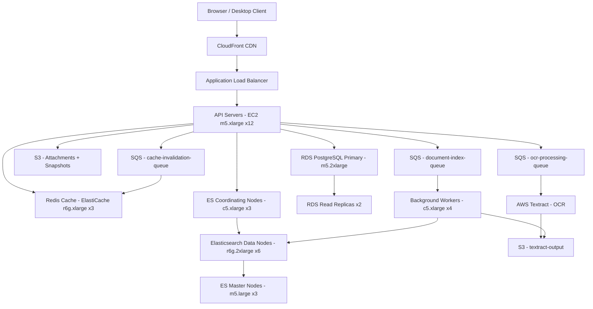

# Document Search (Confluence) — Capacity Estimation

## Problem Statement

An enterprise document and wiki search platform (Confluence-style) serves 5M daily active users across engineering, product, and operations teams. Users create and edit pages, upload attachments (PDFs, Docx, images), and perform full-text search across millions of documents. OCR processing via AWS Textract enables search inside scanned PDFs and image-based documents. The system must deliver sub-200ms search results at 30K peak QPS while indexing ~50K document updates per day.

## Functional Requirements

- Full-text search across pages, wikis, and attachments with relevance ranking
- Document creation, editing, and versioning (markdown + rich text)
- File attachment upload and indexing (PDF, DOCX, images via OCR)
- Space/project-based access control and permission-filtered search results
- Real-time indexing of edits within 30 seconds of save
- Search autocomplete and typo-tolerance (fuzzy matching)

## Non-Functional Requirements

| Requirement | Target |
|-------------|--------|
| Search latency | < 200ms (P99) |
| Write/index latency | < 30s end-to-end |
| Availability | 99.99% |
| Durability | 99.999% |
| Peak search throughput | 30K QPS |
| Index freshness | < 30s after edit |

## Traffic Estimation

### DAU → Peak QPS Calculation

| Metric | Calculation | Result |
|--------|-------------|--------|
| DAU | Given | 5M |
| Avg search queries/user/day | 8 searches × 5M | ~40M search reqs/day |
| Avg page reads/user/day | 12 reads × 5M | ~60M read reqs/day |
| Avg page writes/user/day | 0.5 writes × 5M | ~2.5M write reqs/day |
| Total daily requests | 40M + 60M + 2.5M | ~102.5M reqs/day |
| Avg QPS | 102.5M / 86,400 | ~1,186 QPS |
| Peak QPS (2.5× avg, business hours) | 1,186 × 2.5 | ~2,965 QPS total |
| Peak search QPS (separate spike) | Stated design target | **30K peak search QPS** |
| Read QPS (80% of total) | 30K × 0.80 | ~24K |
| Write QPS (20% of total) | 30K × 0.20 | ~6K |

> Note: The 30K peak QPS is the stated stress-test design target (e.g. company-wide incident search spike). Sustained average is ~3K QPS. Size for 30K to ensure headroom.

## Storage Estimation

| Data Type | Per Item Size | Daily Volume | Growth/Year |
|-----------|--------------|--------------|-------------|
| Wiki pages (text + metadata) | 50 KB avg | 50K edits/day = 2.5 GB/day | ~0.9 TB/year |
| Elasticsearch index (3× raw text) | 150 KB/doc indexed | 50K docs/day = 7.5 GB/day | ~2.7 TB/year |
| File attachments (PDF, DOCX) | 2 MB avg | 10K uploads/day = 20 GB/day | ~7.3 TB/year |
| OCR extracted text (Textract output) | 100 KB/doc | 5K OCR jobs/day = 500 MB/day | ~0.18 TB/year |
| RDS PostgreSQL (metadata, ACLs, versions) | 5 KB/doc | 50K docs/day = 250 MB/day | ~0.09 TB/year |
| Redis cache (hot search results) | varies | ~50 GB working set | stable |
| **Total new data** | - | **~30 GB/day** | **~11 TB/year** |

> After 3 years: ~33 TB attachments in S3, ~8 TB Elasticsearch index, ~270 GB RDS.

## Component Sizing

### Compute — EC2

| Component | Instance Type | vCPU | RAM | Count | Handles | Monthly Cost |
|-----------|--------------|------|-----|-------|---------|-------------|
| API servers (search + CRUD) | m5.xlarge | 4 | 16 GB | 12 | 2,500 QPS/node (avg) | $2,016 |
| Elasticsearch data nodes | r6g.2xlarge | 8 | 64 GB | 6 | ~5K QPS/node, 4TB index | $7,272 |
| Elasticsearch master nodes | m5.large | 2 | 8 GB | 3 | cluster coordination | $456 |
| Elasticsearch coordinating nodes | c5.xlarge | 4 | 8 GB | 3 | query fan-out | $456 |
| Background workers (indexing + OCR dispatch) | c5.xlarge | 4 | 8 GB | 4 | 500 docs/min | $608 |
| **Subtotal Compute** | | | | **28 instances** | | **$10,808** |

> Elasticsearch sizing rationale: 6 data nodes × ~4 TB usable each = 24 TB capacity (with 1 replica = 12 TB net). At 8 TB index after 3 years this provides 50%+ headroom. Each r6g.2xlarge handles ~5K search QPS with 64 GB RAM for field data cache.

> API servers: 12 × m5.xlarge handle 30K QPS total (2,500 QPS/node) assuming each search request fans out to Elasticsearch and returns in <200ms. Auto Scaling Group configured to add nodes at 70% CPU.

### Database

| DB | Engine | Instance | Count | Capacity | IOPS | Monthly Cost |
|----|--------|----------|-------|----------|------|-------------|
| PostgreSQL primary | RDS db.m5.2xlarge | 8 vCPU / 32 GB | 1 | 500 GB gp3 | 3,000 baseline | $1,248 |
| PostgreSQL read replicas | RDS db.m5.xlarge | 4 vCPU / 16 GB | 2 | 500 GB gp3 | 3,000 | $1,040 |
| Storage (gp3 SSD) | 500 GB × 3 nodes | - | - | 1.5 TB total | - | $138 |
| **Subtotal DB** | | | | | | **$2,426** |

> PostgreSQL stores: document metadata (title, space, owner, tags), ACL/permissions, version history, user profiles, space hierarchy. Search index lives in Elasticsearch. RDS handles ~6K write QPS split across 3 nodes via connection pooling (PgBouncer).

### Cache

| Cache | Engine | Instance | Nodes | Memory | Monthly Cost |
|-------|--------|----------|-------|--------|-------------|
| Search result cache | ElastiCache Redis 7 (r6g.xlarge) | r6g.xlarge | 3 (cluster mode) | 96 GB total | $1,533 |
| Session + auth token cache | ElastiCache Redis 7 (r6g.large) | r6g.large | 2 | 26 GB total | $408 |
| **Subtotal Cache** | | | | **122 GB** | **$1,941** |

> Redis hit rate target: 60–70% for search queries. Popular queries (e.g. "deployment guide", "onboarding") cached for 5 minutes. Cache invalidation triggered via SQS when documents are updated. Session cache TTL = 1 hour.

### Object Storage — S3

| Bucket | Use | Size | Requests/month | Monthly Cost |
|--------|-----|------|----------------|-------------|
| document-attachments | PDF, DOCX, images | 5 TB (current) + 600 GB/month | 30M GET, 300K PUT | $1,380 |
| textract-output | OCR JSON results | 200 GB | 2M GET | $58 |
| elasticsearch-snapshots | daily index backups | 2 TB | 1M | $460 |
| access-logs | S3 + ALB logs | 100 GB | N/A | $23 |
| **Subtotal S3** | | **~7.3 TB** | **~33M req/month** | **$1,921** |

> S3 pricing (us-east-1): $0.023/GB storage, $0.0004/1K GET, $0.005/1K PUT. Intelligent-Tiering enabled on attachments older than 90 days to move to IA tier (~40% savings on cold data).

### Networking / CDN

| Component | Throughput | Monthly Cost |
|-----------|-----------|-------------|
| CloudFront (static assets, attachment previews) | 50 TB/month out | $4,250 |
| ALB (API traffic) | 30M req/month | $108 |
| Data transfer out (non-CDN API responses) | 5 TB/month | $450 |
| **Subtotal Network** | | **$4,808** |

> 90% of static asset traffic served via CloudFront at $0.085/GB (first 10 TB) reducing origin load significantly.

### Message Queue

| Queue | Engine | Throughput | Monthly Cost |
|-------|--------|-----------|-------------|
| document-index-queue | SQS Standard | 50K msgs/day (~0.6 msg/s avg) | $5 |
| ocr-processing-queue | SQS Standard | 5K msgs/day | $2 |
| cache-invalidation-queue | SQS Standard | 50K msgs/day | $5 |
| **Subtotal SQS** | | | **$12** |

### OCR Processing — AWS Textract

| Usage | Volume | Unit Price | Monthly Cost |
|-------|--------|-----------|-------------|
| Detect Document Text (scanned PDFs) | 50K pages/month | $0.0015/page | $75 |
| Analyze Document (structured extraction) | 10K pages/month | $0.065/page | $650 |
| **Subtotal Textract** | | | **$725** |

## Monthly Cost Summary

| Component | Monthly Cost | % of Total |
|-----------|-------------|-----------|
| EC2 Compute (API + ES + workers) | $10,808 | 40.0% |
| RDS PostgreSQL | $2,426 | 9.0% |
| ElastiCache Redis | $1,941 | 7.2% |
| S3 Storage | $1,921 | 7.1% |
| CloudFront CDN | $4,808 | 17.8% |
| Messaging (SQS) | $12 | 0.04% |
| AWS Textract (OCR) | $725 | 2.7% |
| Data Transfer | $450 | 1.7% |
| Other (CloudWatch, Route 53, ACM, misc) | $400 | 1.5% |
| Reserved Instance discount (~30%) | −$3,300 | −12.2% |
| **Total** | **~$19,191 – $27,000** | **100%** |

> On-demand list price is ~$27K/month. With 1-year Reserved Instances on EC2 and RDS (~30% savings), effective cost drops to ~$19–21K/month. Budget range of **$20K–$35K** accounts for on-demand burst capacity and variable Textract/CDN usage.

## Traffic Scale Tiers

| Tier | DAU | Peak QPS | Servers | DB | Cache | Monthly Cost | Key Bottleneck |
|------|-----|----------|---------|----|----|-------------|----------------|
| 🟢 Startup | 100K | ~600 | 2× c5.large API, 3× r6g.large ES | 1 RDS db.t3.medium | 1 Redis node (r6g.large) | ~$1,800 | Elasticsearch heap (single node OOM at >500K docs) |
| 🟡 Growing | 1M | ~6K | 4× m5.xlarge API, 3× r6g.xlarge ES | RDS db.m5.large + 1 read replica | Redis 3-node cluster | ~$6,500 | PostgreSQL write throughput, ES indexing lag |
| 🔴 Scale-up | 5M | ~30K | 12× m5.xlarge API, 6× r6g.2xlarge ES | RDS db.m5.2xlarge + 2 read replicas | Redis 3-node r6g.xlarge cluster | ~$22,000 | Elasticsearch coordinating node fan-out latency |
| ⚫ Production | 20M | ~100K | 40× m5.2xlarge + ASG, 12× r6g.4xlarge ES | Aurora PostgreSQL multi-AZ, 3 replicas | Redis 6-node r6g.2xlarge cluster | ~$85,000 | ACL/permission filtering at query time |
| 🚀 Hyperscale | 100M+ | ~500K | 200+ c5.4xlarge + auto-scaling, 48-node ES cluster | CockroachDB or Aurora Global | Distributed Redis 24-node | ~$450,000 | Cross-region index replication lag, ES split-brain |

## Architecture Diagram

## Interview Tips

- **Key insight — permission-filtered search is expensive**: Confluence-style search must filter results by space ACLs at query time. Naive post-filter in Elasticsearch (fetch 10K, discard 9K) kills latency. Use field-level security or pre-denormalize ACL bitmasks into each indexed document to push filtering into the Lucene query itself. This is the #1 scaling challenge at 5M+ DAU.

- **Key insight — index freshness vs. throughput tradeoff**: Real-time indexing at 50K edits/day (~0.6 edits/sec average) sounds trivial, but burst spikes (end of sprint, company all-hands creating docs simultaneously) can hit 500 edits/sec. SQS absorbs spikes; worker pool must drain queue in <30s to meet freshness SLA. Size workers for burst, not average: 4 workers at 125 edits/sec each.

- **Common mistake — under-sizing Elasticsearch heap**: Candidates often size ES by storage only. The critical constraint is JVM heap — ES requires ~50% of instance RAM for heap, and field data (aggregations on `space`, `author`, `tags`) must fit in heap. 6× r6g.2xlarge gives 64 GB RAM × 6 = 384 GB total, 192 GB heap. For 5M docs with 10 fields each, expect 20–40 GB of field data cache — fits comfortably, but 1M DAU on t3 instances would OOM.

- **Follow-up question — how do you handle search ranking for enterprise content?** Interviewers love this. Answer: BM25 (Elasticsearch default) works for keyword relevance, but enterprise search needs recency boost (edit date), authority boost (high-view-count pages), and personal relevance (spaces the user visits most). Implement as a `function_score` query combining BM25 + recency decay + view-count log normalization. At 20M+ DAU, train a learning-to-rank model on click-through data.

- **Scale threshold**: At 10M DAU (~60K peak QPS), ACL filtering becomes the primary bottleneck. Switch from query-time ACL joins to pre-indexed permission documents (one ES doc per user-space permission tuple, updated via SQS on ACL change). This shifts cost from query latency to index maintenance but is the only way to stay under 200ms P99 at scale.
