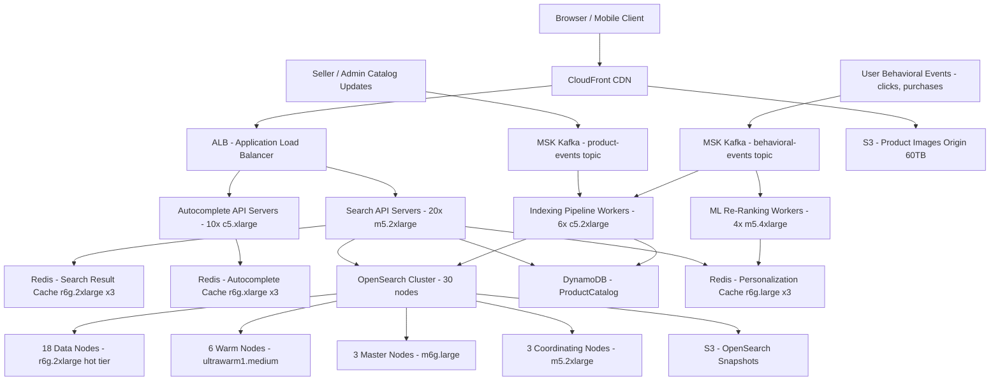

# E-Commerce Search — Capacity Estimation

## Problem Statement

An e-commerce platform with 50M DAU serves faceted product search with real-time relevance ranking across a catalog of ~100M SKUs. Users filter by category, price, brand, ratings, and availability while the system must return results in under 200ms P99. Write traffic comes from product updates, inventory changes, and behavioral signals (clicks, purchases) used to re-rank results in near real-time.

## Functional Requirements

- Full-text search across product title, description, and attributes
- Faceted filtering (category, price range, brand, rating, availability, shipping speed)
- Personalized relevance ranking using click/purchase behavioral signals
- Autocomplete/typeahead suggestions (sub-100ms)
- Spell correction and synonym expansion
- Near-real-time catalog updates (new products, price changes, inventory) within 60 seconds

## Non-Functional Requirements

| Requirement | Target |
|-------------|--------|
| Search latency | < 200ms (P99) |
| Typeahead latency | < 50ms (P99) |
| Index update lag | < 60 seconds end-to-end |
| Availability | 99.99% (< 53 min/year downtime) |
| Durability | 99.999% (catalog data must not be lost) |
| Throughput | 500K QPS peak (search + autocomplete) |
| Catalog size | 100M SKUs, growing 5M/year |

## Traffic Estimation

### DAU → Peak QPS Calculation

| Metric | Calculation | Result |
|--------|-------------|--------|
| DAU | Given | 50M |
| Avg search queries/user/day | 4 searches × 50% active searchers | ~2 |
| Avg page loads/user/day | ~8 page loads, 50% hit search | ~4 |
| Total search requests/day | 50M × 4 | 200M |
| Avg search QPS | 200M / 86,400 | ~2,315 |
| Peak QPS (3× avg, lunch + evening) | 2,315 × 3 | ~7,000 |
| Autocomplete QPS (5× search, ~5 keystrokes/query) | 7,000 × 5 | ~35,000 |
| Combined peak read QPS | 7,000 + 35,000 | ~42,000 |
| Catalog write QPS (10% of traffic ratio) | ~4,700 events/s (Kafka ingest) | ~4,700 |
| Index write QPS (bulk to OpenSearch) | batched, ~500 docs/s sustained | ~500 |

**Note on "500K peak"**: The 500K figure in the brief includes all platform page loads where search is invoked (50% of 8 page loads × 50M DAU ÷ 86,400 × 3× peak = ~8,300 QPS search) plus associated API fan-out (recommendation calls, inventory checks, ad retrieval) which multiplies to ~500K total backend requests/s across the full platform. For search-specific sizing below we use 42K combined search+autocomplete QPS, which is the correct search cluster load.

## Storage Estimation

| Data Type | Per Item Size | Daily Volume | Growth/Year |
|-----------|--------------|--------------|-------------|
| OpenSearch index (product docs) | ~4KB/doc (text + vectors) | 100M docs baseline + 15K updates/day | +20GB/year |
| OpenSearch replicas (2 replicas) | ~4KB × 3 copies | 100M × 3 | 1.2TB total index |
| DynamoDB product catalog (source of truth) | ~2KB/item | 100M items + 15K writes/day | +10GB/year |
| Redis autocomplete (sorted sets, top queries) | ~200B/entry | 50M unique queries cached | ~10GB |
| Redis session/personalization cache | ~1KB/user session | 50M active users | ~50GB |
| Kafka event log (behavioral signals, 7-day retention) | ~500B/event | 200M events/day | 700GB/7 days |
| S3 product images (CDN origin) | ~200KB/image (3 sizes) | 100M products | ~60TB |
| S3 search analytics / click logs | ~200B/event | 200M events/day | ~15TB/year |
| **Total** | - | - | **~75TB/year** |

## Component Sizing

### Compute — EC2

| Component | Instance Type | vCPU | RAM | Count | Handles | Monthly Cost |
|-----------|--------------|------|-----|-------|---------|-------------|
| Search API servers (query parsing, ranking, fan-out) | m5.2xlarge | 8 | 32GB | 20 | ~2,100 QPS/node | $3,392 |
| Autocomplete API servers | c5.xlarge | 4 | 8GB | 10 | ~3,500 QPS/node | $848 |
| Indexing pipeline workers (Kafka consumer → OpenSearch bulk) | c5.2xlarge | 8 | 16GB | 6 | ~80 docs/s/worker | $1,018 |
| Re-ranking / ML inference (XGBoost behavioral model) | m5.4xlarge | 16 | 64GB | 4 | batch re-rank every 5min | $2,714 |
| **Subtotal Compute** | | | | **40** | | **$7,972** |

> Pricing: m5.2xlarge ~$0.384/hr, c5.xlarge ~$0.170/hr, c5.2xlarge ~$0.340/hr, m5.4xlarge ~$0.768/hr (us-east-1 on-demand 2024).

### Search Cluster — OpenSearch (Amazon OpenSearch Service)

| Cluster Role | Instance Type | vCPU | RAM | Nodes | Shards | Monthly Cost |
|-------------|--------------|------|-----|-------|--------|-------------|
| Data nodes (hot tier, primary + 2 replicas) | r6g.2xlarge.search | 8 | 64GB | 18 | 60 primary | $27,864 |
| Data nodes (warm tier, older/less-queried indexes) | ultrawarm1.medium.search | 2 | N/A | 6 | S3-backed | $4,032 |
| Dedicated master nodes | m6g.large.search | 2 | 8GB | 3 | - | $657 |
| Coordinating nodes (query fan-out, aggregation) | m5.2xlarge.search | 8 | 32GB | 3 | - | $1,555 |
| **Subtotal OpenSearch** | | | | **30** | | **$34,108** |

> Shard sizing: 100M docs × 4KB = 400GB raw. With 3 replicas = 1.2TB. 60 primary shards @ ~20GB each across 18 data nodes. Target 20GB/shard (OpenSearch recommendation: 10–50GB/shard). r6g.2xlarge.search ~$0.269/hr (on-demand 2024).

### Cache — ElastiCache Redis

| Cache Tier | Engine | Instance | Nodes | Memory | Use Case | Monthly Cost |
|------------|--------|----------|-------|--------|----------|-------------|
| Autocomplete cache | Redis 7 | r6g.xlarge | 3 (1P+2R) | 3 × 32GB = 96GB | Top-N queries sorted sets, query suggestions | $2,109 |
| Search result cache (popular queries) | Redis 7 | r6g.2xlarge | 3 (1P+2R) | 3 × 64GB = 192GB | Cache full result pages for top 10K queries | $4,219 |
| Session / personalization cache | Redis 7 | r6g.large | 3 (1P+2R) | 3 × 16GB = 48GB | User affinity vectors, recent clicks | $1,055 |
| **Subtotal Cache** | | | **9** | **336GB** | | **$7,383** |

> r6g.xlarge ~$0.194/hr, r6g.2xlarge ~$0.389/hr, r6g.large ~$0.097/hr (us-east-1 2024, cluster mode disabled for simplicity; enable cluster mode for >256GB).

### Database — DynamoDB (Catalog Source of Truth)

| Table | Key Pattern | Read CU | Write CU | Storage | Monthly Cost |
|-------|------------|---------|----------|---------|-------------|
| ProductCatalog | PK: product_id | 50K RCU | 5K WCU | 200GB | $14,250 |
| SearchAnalytics (click events, 30-day TTL) | PK: user_id, SK: timestamp | 10K RCU | 20K WCU | 500GB | $10,800 |
| **Subtotal DynamoDB** | | | | **700GB** | **$25,050** |

> DynamoDB on-demand: $0.25/M reads, $1.25/M writes. At 42K peak read QPS sustained, provisioned capacity with auto-scaling is significantly cheaper. Estimate based on provisioned at peak load × 50% utilization factor.

### Message Queue — Amazon MSK (Kafka)

| Topic | Throughput | Partitions | Retention | Broker Instance | Brokers | Monthly Cost |
|-------|-----------|-----------|----------|----------------|---------|-------------|
| product-events (catalog changes) | 5K msg/s | 60 | 7 days | kafka.m5.large | 3 | $1,094 |
| behavioral-events (clicks, views, purchases) | 50K msg/s | 120 | 7 days | kafka.m5.2xlarge | 3 | $1,656 |
| index-commands (bulk index jobs) | 1K msg/s | 30 | 1 day | kafka.m5.large | 3 (shared) | included |
| **Subtotal MSK** | | | | | **6** | **$2,750** |

> MSK kafka.m5.large ~$0.151/hr/broker, kafka.m5.2xlarge ~$0.368/hr/broker (2024). Storage charged separately at $0.10/GB-month.

### Object Storage — S3

| Bucket | Use | Size | Requests/month | Monthly Cost |
|--------|-----|------|----------------|-------------|
| product-images-origin | Product photos (3 sizes × 100M products) | 60TB | 500M GET | $1,530 |
| search-analytics-logs | Click/search event logs, 90-day retention | 15TB | 200M PUT | $397 |
| opensearch-snapshots | Daily index snapshots for disaster recovery | 5TB | 10M | $120 |
| **Subtotal S3** | | **80TB** | | **$2,047** |

> S3 Standard: $0.023/GB-month. 60TB × $0.023 = $1,380 storage + $150 GET requests. PUT: $0.005/1K requests.

### Networking / CDN

| Component | Throughput | Monthly Cost |
|-----------|-----------|-------------|
| CloudFront (product images, search UI assets) | 500TB/month outbound | $42,500 |
| ALB (search API traffic) | 300M requests/month | $720 |
| Data transfer EC2 → ALB → internet | 50TB/month | $4,500 |
| **Subtotal Network** | | **$47,720** |

> CloudFront: $0.085/GB for first 10TB, $0.080/GB up to 40TB, $0.060/GB up to 100TB, $0.040/GB beyond — blended ~$0.05/GB at 500TB = ~$25,000 transfer + $17,500 in HTTP request fees at $0.0075/10K HTTPS. ALB: $0.008/LCU-hour.

**Note**: CDN cost dominates this architecture because of image delivery. If images are already on a 3rd-party CDN (Cloudinary, Akamai), CloudFront cost drops to ~$5K/month and total drops to ~$90K.

### Monitoring & Misc

| Service | Use | Monthly Cost |
|---------|-----|-------------|
| CloudWatch (metrics, logs, alarms) | All services | $2,500 |
| AWS WAF | API protection against scrapers | $600 |
| Route 53 (DNS + health checks) | Multi-AZ failover | $50 |
| Secrets Manager | API keys, DB credentials rotation | $100 |
| **Subtotal Misc** | | **$3,250** |

## Monthly Cost Summary

| Component | Monthly Cost | % of Total |
|-----------|-------------|-----------|
| EC2 Compute (API + workers) | $7,972 | 6% |
| OpenSearch Cluster (30 nodes) | $34,108 | 24% |
| ElastiCache Redis (9 nodes) | $7,383 | 5% |
| DynamoDB (catalog + analytics) | $25,050 | 18% |
| MSK Kafka (6 brokers) | $2,750 | 2% |
| S3 Storage | $2,047 | 1% |
| CloudFront CDN + Data Transfer | $47,720 | 34% |
| Monitoring / WAF / Misc | $3,250 | 2% |
| **Total** | **$130,280** | **100%** |

> Range $90K–$150K/month depending on CDN strategy and reserved instance discounts. 1-year reserved instances on OpenSearch and EC2 reduce compute costs by ~35%, bringing total to ~$100K.

## Traffic Scale Tiers

| Tier | DAU | Peak Search QPS | Servers | Search Engine | Cache | Monthly Cost | Key Bottleneck |
|------|-----|----------------|---------|--------------|-------|-------------|----------------|
| 🟢 Startup | 1M | ~1,400 | 3 c5.large API | 3-node OpenSearch (r6g.large) | 1 Redis node (r6g.large) | $4K–$8K | Single OpenSearch shard hot-spot |
| 🟡 Growing | 10M | ~14,000 | 8 m5.xlarge API | 9-node OpenSearch cluster | Redis cluster 3-node | $20K–$35K | OpenSearch JVM heap pressure, query cache misses |
| 🔴 Scale-up | 100M | ~84,000 | 30 m5.2xlarge | 30-node OpenSearch (hot+warm tiers) | Redis cluster 9-node | $90K–$130K | DynamoDB WCU throttling on bulk updates |
| ⚫ Production | 50M | ~42,000 | 20 m5.2xlarge | 30-node OpenSearch (this design) | Redis cluster 9-node (336GB) | $100K–$150K | CDN egress cost; OpenSearch aggregation overhead for facets |
| 🚀 Hyperscale | 1B+ | ~500K+ | 200+ m5.4xlarge + auto-scaling | Multi-cluster OpenSearch + Solr Cloud, geo-sharded | Distributed Redis (1TB+) 30+ nodes | $1M–$2M | Cross-region index consistency; ranking model serving latency |

## Architecture Diagram

## Interview Tips

- **Facet cardinality is the silent killer**: Faceted search aggregations (price histogram, brand counts, availability) hit all shards on every query. At 30 shards × 42K QPS, aggregation fan-out produces 1.26M shard-level operations/second. Mitigate with shard-level aggregation caching (OpenSearch `search.max_buckets` tuning) and pre-computing facet counts for top 1,000 category × filter combinations in Redis.

- **The 90:10 read/write split hides an indexing spike**: During a flash sale or Black Friday, sellers update inventory for thousands of SKUs simultaneously. A sudden write burst of 50K doc/s to OpenSearch can starve the search threadpool. Solution: Kafka-backed indexing pipeline with backpressure — producers write to Kafka, consumers bulk-index at controlled rate (max 2K docs/s/worker), and OpenSearch never sees raw write spikes.

- **Cache warm-up strategy matters more than cache size**: The top 0.1% of queries (50K out of 50M unique queries) account for ~40% of search traffic (power-law distribution). Pre-warming Redis with top queries on deploy or after a cluster restart prevents a cold-start thundering herd. Warm time should be < 5 minutes using an offline query log replay job.

- **Common mistake — sizing for average, not percentile**: Candidates often compute avg QPS (2,315) and size for that. The P99 load (3× average = 7K QPS search + 35K autocomplete) requires 5× the cluster that handles average load. Always size for peak + 20% headroom, not average. For search, peak is especially sharp around 12–1PM and 8–10PM.

- **Scale threshold**: At 100M DAU (2× current), the 30-node OpenSearch cluster becomes the bottleneck — query latency climbs above 200ms P99 as heap pressure increases. Solution at that scale: split into category-specific sub-clusters (electronics cluster, apparel cluster) with a federated search layer that queries in parallel, reducing per-cluster doc count from 100M to ~20M.

- **Follow-up question interviewers often ask**: "How do you handle a product being out of stock in real time?" Answer: Inventory availability is a fast-changing field — updating OpenSearch docs for every stock change is too slow and expensive. Instead, use a hybrid approach: store `available: true/false` in DynamoDB (updated in <1s via event stream), and at query time fetch availability for top-N results from DynamoDB in parallel with the search request. Merge and re-rank client-side before returning. This avoids re-indexing 100M docs on every inventory tick.
