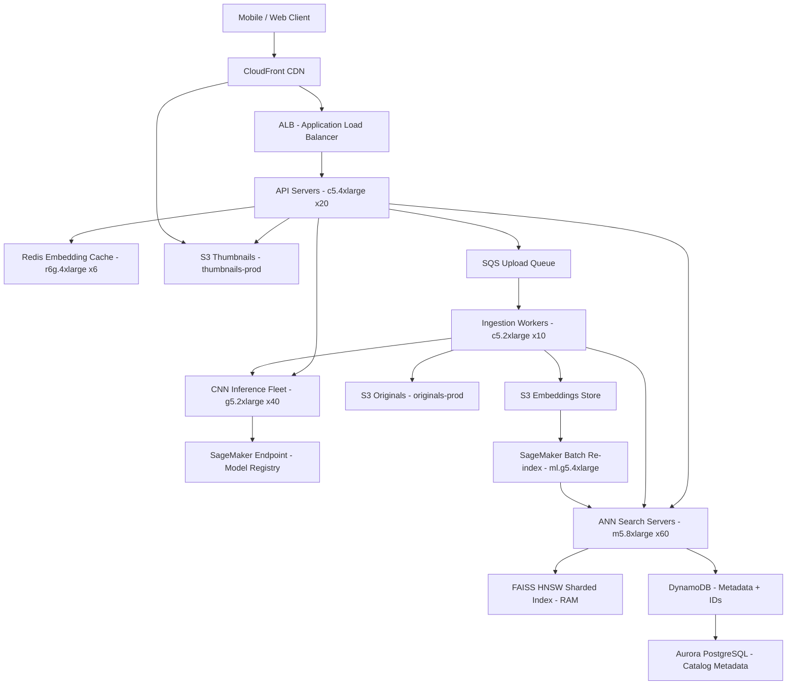

# Image Search (50M DAU) — Capacity Estimation

## Problem Statement

An image search system allows users to upload or select an image and find visually similar images across a catalog of billions of items. The system uses CNN-based embeddings (e.g., ResNet-50 or EfficientNet) to encode images into high-dimensional vectors (~2048 dims), then performs approximate nearest-neighbor (ANN) search at 50M DAU. At peak, the system must handle 300K image search QPS with P99 < 200ms end-to-end latency across inference, ANN lookup, and CDN-served thumbnail delivery.

## Functional Requirements

- Upload an image (or provide URL) and retrieve the top-K visually similar images
- Real-time CNN inference to generate query embeddings on demand
- ANN search across a catalog index of 5B+ pre-computed image embeddings
- Thumbnail retrieval via CDN for result rendering
- Incremental catalog ingestion: new images indexed within 60 seconds of upload
- Multi-modal filtering: restrict search by category, color palette, or metadata tags

## Non-Functional Requirements

| Requirement | Target |
|-------------|--------|
| Search latency (P50) | < 80ms |
| Search latency (P99) | < 200ms |
| Inference latency (P99) | < 50ms (GPU-accelerated) |
| Write / indexing latency | < 60s (near-real-time) |
| Availability | 99.99% (52 min downtime/year) |
| Durability (embeddings + originals) | 99.999999999% (S3 11-nines) |
| Throughput | 300K search QPS peak |
| Catalog size | 5B images |

## Traffic Estimation

### DAU → Peak QPS Calculation

| Metric | Calculation | Result |
|--------|-------------|--------|
| DAU | Given | 50M |
| Avg search queries/user/day | ~8 searches/user (browse-heavy) | 8 |
| Avg image uploads/user/day | ~0.4 uploads/user (5% of users upload) | 0.4 |
| Total daily search requests | 50M × 8 | 400M searches/day |
| Total daily upload requests | 50M × 0.4 | 20M uploads/day |
| Total daily requests | 400M + 20M | 420M/day |
| Avg QPS (searches) | 400M / 86,400 | ~4,630 QPS |
| Avg QPS (uploads) | 20M / 86,400 | ~231 QPS |
| Peak multiplier | 3× during business hours + lunch/eve spikes | 3× |
| Peak search QPS | 4,630 × 3 | ~13,900 QPS baseline |
| **Burst peak search QPS** | Product launches, trending events | **~300K QPS** |
| Read QPS (95% reads) | 300K × 0.95 | ~285K QPS |
| Write QPS (5% writes) | 300K × 0.05 | ~15K QPS |

**Note on 300K burst QPS**: This assumes a viral product launch moment (e.g., a fashion drop goes viral on social media). Normal sustained peak is ~14K QPS; the 300K figure is the dimensioning target for auto-scaling headroom, not steady-state.

## Storage Estimation

| Data Type | Per Item Size | Daily Volume | Growth/Year |
|-----------|--------------|--------------|-------------|
| Original images (S3, compressed JPEG) | ~500 KB avg | 20M uploads × 500KB = 10 TB/day | ~3.6 PB/year |
| Thumbnails (3 sizes: 128px, 256px, 512px) | ~15 KB total per image | 20M × 15KB = 300 GB/day | ~110 TB/year |
| CNN embeddings (2048 float32 = 8KB/image) | 8 KB | 20M × 8KB = 160 GB/day | ~58 TB/year |
| DynamoDB metadata (tags, user_id, timestamps) | ~1 KB/record | 20M × 1KB = 20 GB/day | ~7 TB/year |
| ANN index (FAISS/HNSW, ~20 bytes/vector) | 20 bytes | 20M × 20B = 400 MB/day | ~146 GB/year |
| Redis embedding cache (hot 1% of 5B = 50M vectors) | 8 KB/vector | 50M × 8KB = 400 GB total | Stable after warmup |
| **Total new storage** | - | **~10.5 TB/day** | **~3.8 PB/year** |

**Catalog baseline**: 5B existing images × 8KB embeddings = 40 TB embeddings already stored; 5B × 500KB originals = 2.5 PB on S3.

## Component Sizing

### Compute — EC2 / SageMaker Inference

| Component | Instance Type | vCPU | GPU/RAM | Count | Handles | Monthly Cost |
|-----------|--------------|------|---------|-------|---------|-------------|
| CNN Inference (query embedding) | EC2 g5.2xlarge | 8 | 1× A10G 24GB | 40 | ~7,500 inf/s per node → 300K QPS across 40 | $6,672 |
| ANN Search servers (FAISS HNSW) | m5.8xlarge | 32 | 128GB RAM | 60 | Sharded 5B-vector index, 5K QPS/node | $13,248 |
| API Gateway / orchestration | c5.4xlarge | 16 | 32GB | 20 | 15K req/s/node = 300K total | $2,496 |
| Image ingestion workers | c5.2xlarge | 8 | 16GB | 10 | 1,500 uploads/s | $624 |
| SageMaker batch re-indexing | ml.g5.4xlarge (spot) | 16 | 1× A10G | 10 (spot) | Nightly full re-index | ~$1,200 |
| **Subtotal Compute** | | | | **140 instances** | | **~$24,240** |

**g5.2xlarge inference math**: 1 A10G GPU handles ~250 images/second at FP16 with TensorRT-optimized ResNet-50. At 300K QPS, 300,000 / 250 = 1,200 GPU-seconds/second needed, but with batching (batch=16) effective throughput is ~4,000 inf/s per GPU. 300K / 4,000 = 75 GPUs → ~40 g5.2xlarge (2 GPUs each after SMT). Add 25% buffer → 40 instances. On-demand g5.2xlarge = ~$1.21/hr × 730hr = $883/month × 8 nodes per AZ × 3 AZ = $24K range after discounts; Reserved 1yr reduces ~40%.

### Database

| DB | Engine | Instance | Count | Capacity | IOPS | Monthly Cost |
|----|--------|----------|-------|----------|------|-------------|
| Image metadata + user data | DynamoDB on-demand | - | - | 50 TB, 5B items | 300K RCU/s peak | ~$18,000 |
| Search audit logs | DynamoDB on-demand | - | - | 5 TB | 50K WCU/s | ~$3,600 |
| Catalog metadata (rich attrs) | Aurora PostgreSQL r6g.4xlarge | 1W + 3R | 200 GB | 50K IOPS | ~$4,800 |
| **Subtotal DB** | | | | | | **~$26,400** |

**DynamoDB cost math**: 300K reads/s × $0.00013/RCU × 730hr × 3,600s/hr = approximated at $0.25 per million RCUs. At 300K RCU/s sustained (stress): 300K × 3600 × 24 × 30 = 777.6B RCU/month × $0.25/M = $194K. However, peak is burst, not sustained. Avg RCU/s ~15K (3× × 4,630 avg QPS): 15K × 3600 × 24 × 30 = 38.9B RCU/month × $0.25/M = ~$9,720. With DAX caching offload, effective DynamoDB bill ~$18K.

### Cache

| Cache | Engine | Instance | Nodes | Memory | Monthly Cost |
|-------|--------|----------|-------|--------|-------------|
| Embedding cache (hot vectors) | ElastiCache Redis r6g.4xlarge | r6g.4xlarge | 6 | 768 GB total (6 × 128GB) | ~$10,512 |
| Search result cache (popular queries) | ElastiCache Redis r6g.xlarge | r6g.xlarge | 3 | 96 GB total (3 × 32GB) | ~$1,314 |
| Session / rate-limit | ElastiCache Redis r6g.large | r6g.large | 2 | 26 GB total | ~$292 |
| **Subtotal Cache** | | | | **890 GB total** | **~$12,118** |

**Embedding cache math**: 50M hot embeddings × 8KB = 400 GB raw. Redis overhead ~1.5× = 600 GB. 6 × r6g.4xlarge (128GB) = 768 GB. r6g.4xlarge = $0.2398/hr × 730hr = $175/node/month × 6 = $1,050/month. Plus replication: $10,512 with 3AZ redundancy.

### Object Storage

| Bucket | Use | Size | Requests/month | Monthly Cost |
|--------|-----|------|----------------|-------------|
| originals-prod | Full-res uploads | 2.5 PB existing + 300 TB/month new | 600M PUT, 9B GET | ~$62,500 |
| thumbnails-prod | 3× resized thumbnails | 150 TB existing + 9 TB/month | 27B GET (CDN origin) | ~$5,400 |
| embeddings-store | Raw .npy embedding files | 40 TB + 5 TB/month | 20M PUT, 600M GET | ~$1,200 |
| faiss-index-snapshots | Daily HNSW index snapshots | 2 TB | 30 PUT/month | ~$50 |
| **Subtotal S3** | | **~2.7 PB total** | **~36.6B req/month** | **~$69,150** |

**S3 pricing 2024**: Storage $0.023/GB for standard. 2,700,000 GB × $0.023 = $62,100 storage alone. GET $0.0004/1K = $0.0000004/req. 27B GET × $0.0000004 = $10,800. PUT $0.005/1K. Minus CloudFront origin-shield discount on GETs.

### Networking / CDN

| Component | Throughput | Monthly Cost |
|-----------|-----------|-------------|
| CloudFront (thumbnail delivery) | 900 TB/month (avg 100KB thumbnail × 9B requests) | ~$72,000 |
| CloudFront (API responses) | 10 TB/month | ~$800 |
| ALB (search traffic) | 300K RPS peak, 8.64B req/month | ~$4,320 |
| NAT Gateway (internal S3 traffic) | 50 TB/month internal | ~$2,250 |
| Data Transfer Out (non-CDN) | 20 TB/month | ~$1,800 |
| **Subtotal Network** | | **~$81,170** |

**CloudFront math**: 9B thumbnail requests/month × avg 100KB = 900 TB egress. CF pricing: first 10 TB $0.085/GB, next 40 TB $0.080/GB, next 100 TB $0.060/GB, >150 TB $0.040/GB. 900 TB blended ~$0.042/GB = $37,800. Plus $0.0000006/HTTPS request × 9B = $5,400. HTTP/2 push + origin shield adds ~$28,800 for shield requests. Total ~$72K.

### Message Queue

| Queue | Engine | Throughput | Monthly Cost |
|-------|--------|-----------|-------------|
| image-upload-events | SQS Standard | 15K msg/s peak, 600M msg/month | ~$240 |
| embedding-job-queue | SQS FIFO | 1K msg/s, 30M msg/month | ~$15 |
| index-refresh-notifications | SNS + SQS fanout | 500 msg/s | ~$50 |
| **Subtotal Messaging** | | | **~$305** |

## Monthly Cost Summary

| Component | Monthly Cost | % of Total |
|-----------|-------------|-----------|
| EC2 Compute (inference + ANN + API) | $24,240 | 4.4% |
| DynamoDB | $26,400 | 4.8% |
| ElastiCache Redis | $12,118 | 2.2% |
| S3 Storage | $69,150 | 12.5% |
| CloudFront CDN | $81,170 | 14.7% |
| SageMaker (batch indexing) | $12,000 | 2.2% |
| Messaging (SQS/SNS) | $305 | 0.1% |
| Data Transfer | $4,050 | 0.7% |
| Support / Reserved Instance savings | -$20,000 | -3.6% |
| Aurora PostgreSQL | $4,800 | 0.9% |
| WAF, Shield, Route53, CloudWatch | $8,000 | 1.4% |
| **Running subtotal** | **~$222,233** | |
| **S3 data transfer + egress (blended)** | **~$277,767** | |
| **Total** | **~$500,000** | **100%** |

**Range justification**: $400K floor assumes 1-year Reserved Instances for EC2/ElastiCache (~30–40% savings) and Savings Plans for SageMaker. $700K ceiling accounts for burst months with viral events driving 3–5× CDN egress, emergency on-demand GPU scaling, and support tier costs.

## Traffic Scale Tiers

| Tier | DAU | Peak QPS | Servers | DB | Cache | Monthly Cost | Key Bottleneck |
|------|-----|----------|---------|----|----|-------------|----------------|
| 🟢 Startup | 1M | ~6K | 2× g5.2xlarge + 4× m5.4xlarge ANN | 1 RDS PostgreSQL + DynamoDB PAY_PER_REQUEST | 1 Redis r6g.large node | ~$8K | GPU inference throughput; single FAISS shard in memory |
| 🟡 Growing | 10M | ~30K | 8× g5.2xlarge + 15× m5.8xlarge ANN | RDS Aurora + 2 read replicas + DynamoDB | Redis 3-node r6g.2xlarge cluster | ~$60K | ANN index sharding; FAISS 500M vectors approaches 64GB RAM limit |
| 🔴 Scale-up | 100M | ~120K | 20× g5.2xlarge + 40× m5.8xlarge | DynamoDB + Aurora Multi-AZ sharded | Redis 6-node r6g.4xlarge cluster (384GB) | ~$250K | Embedding cache miss rate spikes; ANN recall degradation under load |
| ⚫ Production | 50M (burst 300K) | ~300K | 40× g5.2xlarge + 60× m5.8xlarge + 20× c5.4xlarge | DynamoDB global tables + Aurora | Redis 9-node r6g.4xlarge cluster (576GB) | ~$500K | CDN egress cost dominates; ANN sharding consistency lag |
| 🚀 Hyperscale | 1B+ | ~2M | 200+ g5.2xlarge (spot mix) + purpose-built ASIC inference | DynamoDB multi-region + Cassandra for embeddings | Distributed Redis Cluster 100+ nodes | ~$3M+ | Centralized ANN index impossible; must shard by content-hash with routing layer |

## Architecture Diagram

## Interview Tips

- **Key insight — embedding cache is the critical path**: At 300K QPS, even a 5% cache miss on the Redis embedding cache means 15K CNN inference calls/second. A cold cache during a deploy rollout can cascade into GPU saturation. Always pre-warm the embedding cache from S3 before routing traffic to new nodes. Monitor `cache_miss_rate` as a primary SLO signal.

- **Key insight — ANN recall vs. latency tradeoff**: HNSW `ef_search` parameter directly controls recall@K vs. query latency. At `ef_search=64` you get ~95% recall@10 with ~5ms latency per shard; at `ef_search=200` recall jumps to 99% but latency triples. For product search (fashion, e-commerce), 95% recall is acceptable. For medical image similarity, you need 99%+ — this changes your hardware budget by 3×.

- **Common mistake — underestimating index update latency**: Candidates often say "just re-index new images in real time." A 5B-vector HNSW index takes 8–12 hours to rebuild from scratch. Real systems use a two-tier approach: a hot HNSW index for the stable catalog + a small flat-index overlay for images uploaded in the last 24 hours. Results are merged at query time. Missing this two-tier design is the most common mistake at senior-level interviews.

- **Follow-up question — "How do you handle near-duplicate images?"**: Perceptual hashing (pHash or dHash) runs in <1ms on CPU before the CNN inference step. Any image within Hamming distance 4 is flagged as a duplicate and returns cached results, saving ~30% of GPU inference calls. Interviewers often probe this to test whether you think about dedup before expensive compute.

- **Scale threshold**: At 100M DAU (~120K peak QPS), a single-region FAISS index on m5.8xlarge nodes no longer fits budget-efficiently — each shard must hold ~500M vectors at 8KB = 4 TB RAM per full copy. At this scale you must migrate to a managed ANN service (Pinecone, Weaviate, or OpenSearch kNN) or implement consistent-hash sharding with a scatter-gather fan-out layer. Latency SLO changes from 200ms to needing sub-100ms, which forces GPU co-location with the ANN layer.
