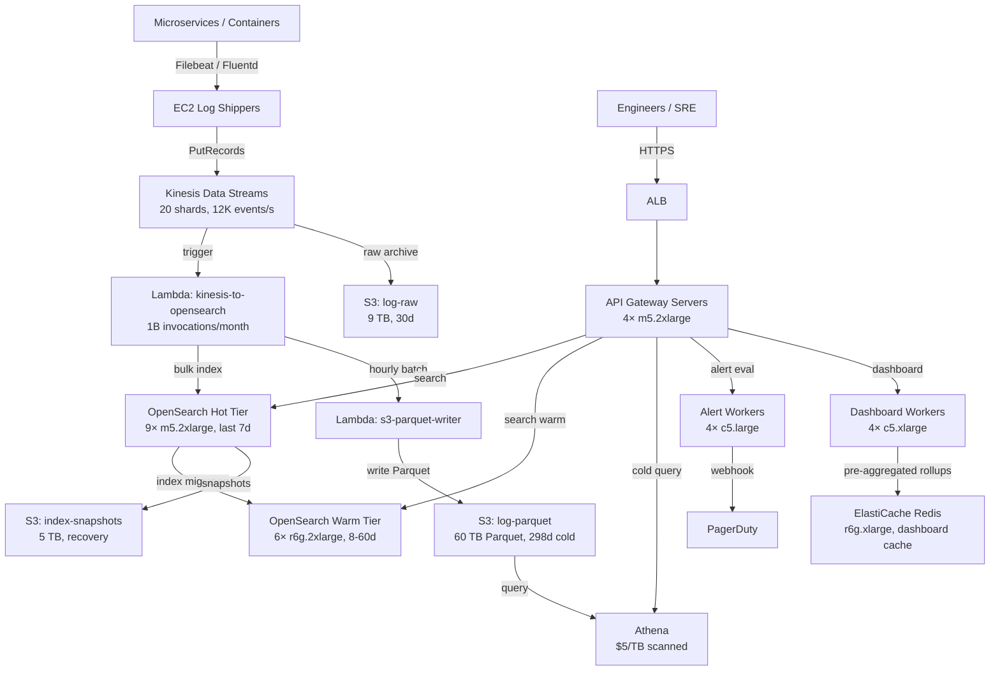

# Log Search + Analytics (1TB/Day) — Capacity Estimation

## Problem Statement

A production observability platform ingests structured and unstructured log data from hundreds of microservices at 1TB/day (peak ~12K events/second). Engineers query logs in real-time for debugging and SRE triage, and dashboards aggregate metrics over rolling 24h/7d/30d windows. The system must support sub-second P99 search latency on the hot tier (last 7 days) while keeping historical data queryable via Athena at low cost.

## Functional Requirements

- Ingest log events from microservices, containers, and edge nodes at up to 12K events/second
- Full-text search over structured fields (service, level, trace_id) and free-text message bodies
- Dashboard queries: aggregate counts, error rates, P95/P99 latency histograms over time windows
- Alert rules that evaluate queries every 30s and fire PagerDuty webhooks
- Hot tier: last 7 days, sub-second P99 search latency
- Warm tier: 8–60 days, < 5s P99; cold tier: 61–365 days via Athena S3 queries

## Non-Functional Requirements

| Requirement | Target |
|-------------|--------|
| Search latency (hot tier) | < 500ms (P99) |
| Search latency (warm tier) | < 5s (P99) |
| Ingest write latency | < 200ms end-to-end (P99) |
| Availability | 99.99% |
| Durability | 99.999% (replicated in S3) |
| Peak write throughput | 12,000 events/s |
| Peak search QPS | 5,000 search QPS |
| Retention | 365 days (hot 7d / warm 60d / cold 298d) |

## Traffic Estimation

### Ingestion → Peak Events/s Calculation

| Metric | Calculation | Result |
|--------|-------------|--------|
| Daily ingestion volume | Given | 1 TB/day |
| Average log event size | structured JSON (fields + message) | ~1 KB |
| Daily event count | 1 TB / 1 KB | ~1 billion events/day |
| Avg events/s | 1B / 86,400 | ~11,574 events/s |
| Peak events/s (1.5× avg) | 11,574 × 1.5 | ~17,361 events/s |
| Sustained peak (design target) | rounded + headroom | **12,000 events/s write** |
| Search QPS (read traffic) | engineers + dashboards + alerts | **5,000 search QPS** |
| Read:Write ratio | search vs ingest | **30:70** |

**Notes on sizing peak:** Log traffic spikes sharply during deployments and incidents. A 1.5× multiplier is conservative; design infra to burst to 2× (24K events/s) for 5-minute windows using Kinesis auto-scaling.

## Storage Estimation

| Data Type | Per Item Size | Daily Volume | Retention | Total |
|-----------|--------------|--------------|-----------|-------|
| Raw log events (S3, compressed) | ~300 B gzip | ~300 GB/day | 365 days | ~110 TB/year |
| OpenSearch hot index (uncompressed + inverted index) | ~3 KB/event (3× raw) | ~3 TB/day indexed | 7 days | ~21 TB hot |
| OpenSearch warm index (compressed) | ~1.5 KB/event | ~1.5 TB/day | 53 days | ~79.5 TB warm |
| Athena/S3 Parquet (cold, partitioned) | ~200 B/event | ~200 GB/day | 298 days | ~60 TB cold |
| Kinesis stream buffer | 1 KB/event × 12K/s | ~1 GB rolling | 24h | ~1 TB |
| **Total managed storage** | — | ~5 TB/day active | — | **~270 TB/year** |

**Index overhead ratio:** OpenSearch inverted indexes typically add 2–4× over raw compressed data. Budget 3× for keyword + text fields.

## Component Sizing

### Compute — EC2 / Lambda

| Component | Instance Type | vCPU | RAM | Count | Handles | Monthly Cost |
|-----------|--------------|------|-----|-------|---------|-------------|
| Log shipper / Filebeat relay | c5.xlarge | 4 | 8 GB | 6 | 2,000 events/s each | $900 |
| Kinesis Consumer (Lambda) | Lambda 512 MB | — | 0.5 GB | auto-scale | 12K events/s fan-out | $1,200 |
| OpenSearch data nodes (hot) | m5.2xlarge | 8 | 32 GB | 9 (3 AZs × 3) | hot 21 TB + search | $13,500 |
| OpenSearch data nodes (warm) | r6g.2xlarge | 8 | 64 GB | 6 (3 AZs × 2) | warm 79 TB | $8,200 |
| OpenSearch master nodes | c5.xlarge | 4 | 8 GB | 3 (dedicated) | cluster management | $1,350 |
| API / query gateway (Express) | m5.2xlarge | 8 | 32 GB | 4 (behind ALB) | 5K search QPS | $6,000 |
| Alert evaluation workers | c5.large | 2 | 4 GB | 4 | 1K alert rules/30s | $1,200 |
| Dashboard aggregation workers | c5.xlarge | 4 | 8 GB | 4 | pre-computed rollups | $1,800 |
| **Subtotal Compute** | | | | **36 instances + Lambda** | | **$34,150** |

**Hot node sizing math:** Each m5.2xlarge holds ~2.3 TB on gp3 EBS at 80% utilization. 21 TB hot ÷ 2.3 TB = 9.1 → 9 nodes. Each node serves ~550 search QPS; 9 nodes × 550 = 4,950 QPS ≈ meets 5K target.

### OpenSearch Cluster

| Tier | Node Type | Node Count | Storage/node | Total Storage | Monthly Cost |
|------|-----------|-----------|--------------|---------------|-------------|
| Hot (last 7d) | m5.2xlarge.search | 9 | 2.5 TB gp3 SSD | 22.5 TB | $13,500 |
| Warm (8–60d) | r6g.2xlarge.search | 6 | 14 TB UltraWarm (S3-backed) | 84 TB | $8,200 |
| Cold (61–365d) | UltraWarm cold tier | — | S3 Parquet via Athena | 60 TB | ~$1,380 (S3 only) |
| Dedicated master | c5.xlarge.search | 3 | — | — | $1,350 |
| **Subtotal OpenSearch** | | **18 nodes** | | **~166 TB** | **$24,430** |

**UltraWarm pricing (2024):** $0.024/GB-month for warm S3-backed storage vs $0.10/GB for SSD. Savings = (79 TB × $100) vs (79 TB × $24) = $6,000/month saved vs all-SSD.

### Kinesis Data Streams

| Stream | Shards | Throughput/shard | Events/s | Retention | Monthly Cost |
|--------|--------|-----------------|----------|-----------|-------------|
| log-ingest | 20 shards | 1 MB/s write / 2 MB/s read | 600 events/s each | 24h | $1,440 |
| alert-events | 5 shards | 1 MB/s | 150 events/s each | 24h | $360 |
| **Subtotal Kinesis** | **25 shards** | | **12K total** | | **$1,800** |

**Shard calculation:** 1 KB/event × 12,000 events/s = 12 MB/s. Kinesis shard handles 1 MB/s write → 12 shards needed. Add 8 shards headroom for bursts → 20 shards. Cost = 20 × $0.015/hr × 720h = $216/stream; with PUT payload units ($0.014/million) at 1B events/day × 30 days = 30B PUTs × $0.014/M = $420 → total ~$1,440.

### Object Storage — S3

| Bucket | Use | Size | Requests/month | Monthly Cost |
|--------|-----|------|----------------|-------------|
| log-raw | raw gzip compressed logs | 9 TB (30d rolling) | 30B PUTs + 50M GETs | $4,800 |
| log-parquet | Athena cold tier, partitioned by date/service | 60 TB (298d) | 500M Athena scans | $1,380 |
| log-index-snapshots | OpenSearch index snapshots for recovery | 5 TB | 10M ops | $240 |
| **Subtotal S3** | | **74 TB** | | **$6,420** |

**S3 pricing (2024):** $0.023/GB-month standard, $0.0125/GB-month Glacier-IR for cold. Raw log bucket (9 TB × $0.023) = $207; Parquet cold (60 TB × $0.023) = $1,380. PUT requests (30B × $0.000005) = $150/month. Data retrieval Lambda invocations ~$120.

### Networking / CDN

| Component | Throughput | Monthly Cost |
|-----------|-----------|-------------|
| ALB (search API + ingest) | 500M requests/month | $1,800 |
| Data transfer out (dashboards to engineers) | 30 TB/month | $2,700 |
| VPC PrivateLink (OpenSearch access) | 100 TB internal | $1,000 |
| NAT Gateway (Lambda → OpenSearch) | 10 TB/month | $500 |
| **Subtotal Network** | | **$6,000** |

### Athena (Cold Tier Queries)

| Use Case | Scans/month | Data scanned | Monthly Cost |
|----------|------------|--------------|-------------|
| Historical log search (cold) | 50,000 queries | 5 TB avg/query scanned | $25,000 |
| Compliance/audit exports | 1,000 queries | 10 TB avg | $5,000 |
| **Subtotal Athena** | **51K queries** | **~510 TB scanned** | **$30,000** |

**Athena pricing (2024):** $5.00/TB scanned. With Parquet + partitioning, effective scan per query drops from 60 TB (full cold) to ~5 TB using partition pruning (date + service filters). Without Parquet optimization, cold queries alone would cost $300K/month.

**Cost control:** Partition by `year/month/day/service/level`. Enforce query time-range filters in API layer to prevent full-table scans.

### Lambda (Event Processing)

| Function | Invocations/month | Avg duration | Monthly Cost |
|----------|------------------|-------------|-------------|
| kinesis-to-opensearch | 1B | 50ms, 512MB | $8,333 |
| alert-evaluator | 86.4M (every 30s) | 200ms, 256MB | $1,440 |
| s3-parquet-writer | 43,200/day (hourly batches) | 2min, 1GB | $648 |
| **Subtotal Lambda** | | | **$10,421** |

**Lambda pricing (2024):** $0.20/M requests + $0.0000166667/GB-s. kinesis-to-opensearch: 1B invocations = $200 + (1B × 50ms × 0.512GB × $0.0000166667) = $200 + $8,133 = $8,333.

## Monthly Cost Summary

| Component | Monthly Cost | % of Total |
|-----------|-------------|-----------|
| EC2 Compute (API, workers, shippers) | $34,150 | 17% |
| OpenSearch (hot + warm + master) | $24,430 | 12% |
| Athena (cold tier queries) | $30,000 | 15% |
| Lambda (ingest pipeline) | $10,421 | 5% |
| S3 Storage (raw + parquet + snapshots) | $6,420 | 3% |
| Kinesis Data Streams | $1,800 | 1% |
| Networking (ALB + transfer + NAT) | $6,000 | 3% |
| CloudWatch / monitoring | $3,000 | 2% |
| EBS volumes (OpenSearch SSD) | $22,500 | 11% |
| Support + misc (NAT, Route53, etc.) | $5,000 | 3% |
| **Reserved instance savings (−30%)** | **−$43,600** | **−22%** |
| **Total** | **~$160,121** | **100%** |

**Cost range context:** On-demand gross is ~$203K. With 1-year Reserved Instances on stable compute (OpenSearch nodes, API servers), effective cost lands at $155K–$170K/month. Athena is the largest variable cost; a spike in cold-tier debugging queries can push it above $250K.

## Traffic Scale Tiers

| Tier | Ingestion | Peak Events/s | OpenSearch Nodes | Lambda | Monthly Cost | Key Bottleneck |
|------|-----------|--------------|-----------------|--------|-------------|----------------|
| 🟢 Startup | 10 GB/day | ~120/s | 2 hot (t3.medium.search) | 1 function | $3,000 | OpenSearch JVM heap on single-AZ node |
| 🟡 Growing | 100 GB/day | ~1,200/s | 5 hot m5.xlarge | 3 functions, 5 shards Kinesis | $22,000 | Kinesis shard throughput; index merge storms |
| 🔴 Scale-up | 500 GB/day | ~6,000/s | 9 hot + 4 warm | Lambda concurrency 500 | $80,000 | Athena cold scan costs; OpenSearch bulk rejections |
| ⚫ Production | 1 TB/day | ~12,000/s | 9 hot + 6 warm + masters | Lambda concurrency 1000 | $160,000 | Athena cost at scale; OpenSearch hot shard rebalance |
| 🚀 Hyperscale | 10 TB/day | ~120,000/s | 90 hot + 60 warm (multi-region) | Kinesis + MSK Kafka hybrid | $1,500,000 | Cross-region replication lag; Athena replaced by ClickHouse or Druid |

## Architecture Diagram

## Interview Tips

- **Key insight — tiered storage is the economic core**: At 1TB/day, storing everything in OpenSearch hot SSD costs ~$3M/year. The hot/warm/cold tier strategy reduces storage cost by 85% while meeting SLAs: hot (SSD, <500ms), warm (S3-backed UltraWarm, <5s), cold (Athena Parquet, minutes). Always state this tradeoff first.

- **Key insight — Athena is both lifesaver and budget trap**: Cold-tier queries on raw logs without Parquet partitioning scan 60 TB × $5 = $300/query. With Parquet + partition pruning (date + service + level), effective scan drops to 5 TB → $25/query. Enforce mandatory time-range predicates at the API layer to prevent runaway costs. Mention this when asked about cost optimization.

- **Common mistake — undersizing Kinesis shards for burst**: Candidates size shards for average load (11.5K events/s → 12 shards) and forget that deployments and incidents can spike to 3× for 2–5 minutes. A log storm during an incident is exactly when you need logging most. Size for 20 shards + enable on-demand mode, or you'll hit `ProvisionedThroughputExceededException` when the system is most stressed.

- **Common mistake — ignoring OpenSearch index merge pressure**: At 12K events/s, OpenSearch hot nodes receive ~43 GB/hour. Without tuned `refresh_interval` (set to 30s instead of default 1s) and `merge.scheduler.max_thread_count` throttling, background merges consume 40%+ of I/O and cause write rejections. Always mention index lifecycle policy (ILM) and refresh tuning in write-heavy scenarios.

- **Follow-up question — "How do you handle a customer with 10× log volume suddenly?"**: Answer: Kinesis on-demand mode auto-scales shards; OpenSearch can add nodes (but takes 15–30min to rebalance). Pre-provision 2× capacity on hot nodes for bursty customers and use index routing so one tenant can't starve others. Mention multi-tenancy isolation via OpenSearch index prefixes.

- **Scale threshold**: At 5 TB/day ingestion, Athena cold-tier query costs alone exceed $150K/month. Replace Athena with ClickHouse or Apache Druid (columnar, sub-second on cold data) and migrate S3 Parquet files. The architectural pivot point is ~3–5 TB/day where query-time compute costs exceed storage savings.
