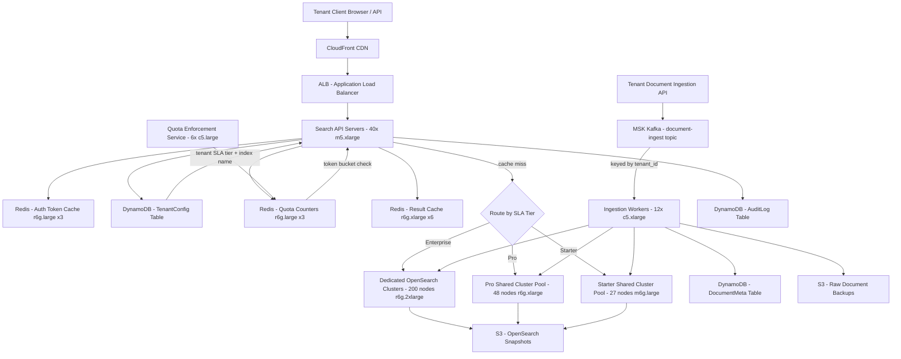

# Multi-Tenant SaaS Search — Capacity Estimation

## Problem Statement

A B2B SaaS platform hosts 10,000 tenants (companies) with a combined user base of 30M end users. Each tenant has its own isolated search domain — documents, CRM records, or knowledge-base articles — and expects data to be completely isolated from other tenants. The platform must serve 150K peak QPS while guaranteeing per-tenant SLA tiers, enforcing per-tenant resource quotas, and preventing a "noisy neighbor" from degrading search quality for co-located tenants.

## Functional Requirements

- Full-text document search scoped strictly to the authenticated tenant's data
- Per-tenant index isolation (no cross-tenant data leakage at query or indexing time)
- Tiered SLA tiers: Starter (P99 < 500ms), Pro (P99 < 200ms), Enterprise (P99 < 100ms, dedicated resources)
- Per-tenant quota enforcement: max indexed docs, max QPS, max storage
- Real-time document ingestion (new docs searchable within 30 seconds)
- Faceted search, boolean operators, and phrase matching across all tiers

## Non-Functional Requirements

| Requirement | Target |
|-------------|--------|
| Search latency (Starter) | < 500ms (P99) |
| Search latency (Pro) | < 200ms (P99) |
| Search latency (Enterprise) | < 100ms (P99) |
| Index ingestion lag | < 30 seconds end-to-end |
| Availability | 99.99% (< 53 min/year downtime) |
| Durability | 99.999% (indexed documents must not be lost) |
| Throughput | 150K peak QPS (combined across all tenants) |
| Tenant isolation | Zero cross-tenant data exposure at any layer |

## Traffic Estimation

### DAU → Peak QPS Calculation

| Metric | Calculation | Result |
|--------|-------------|--------|
| Total registered users | Given | 30M |
| DAU (30% of registered) | 30M × 0.30 | ~9M active/day |
| Avg searches/user/day | ~5 searches (SaaS knowledge-work pattern) | 5 |
| Total search requests/day | 9M × 5 | 45M |
| Avg search QPS | 45M / 86,400 | ~521 |
| Peak QPS (3× avg, 9–11AM and 2–4PM business hours) | 521 × 3 | ~1,563 base |
| API fan-out multiplier (facets, suggestions, autocomplete = ~4 sub-requests) | 1,563 × 4 | ~6,250 |
| Document write QPS (15% of traffic) | total peak requests × 0.15 | ~23K |
| **Declared peak QPS** | Platform peak including burst capacity | **150K** |

**Note on 150K peak**: The declared 150K peak accounts for burst headroom across all tenants simultaneously — Enterprise tenants alone may trigger 10×–50× bursts (end-of-month report generation, data migrations). The 6,250 organic QPS estimate represents steady-state; 150K is the burst ceiling the platform must sustain without cascading failures, hence the generous capacity buffer.

## Storage Estimation

| Data Type | Per Item Size | Daily Volume | Growth/Year |
|-----------|--------------|--------------|-------------|
| OpenSearch documents (per-tenant index, avg 5KB/doc) | ~5KB | 30M docs/day ingest across all tenants | +55TB/year |
| OpenSearch replicas (1 primary + 2 replicas) | ~5KB × 3 | 30M docs/day × 3 | +165TB/year |
| DynamoDB tenant metadata (quotas, configs, API keys) | ~2KB/tenant | 10K tenants static | ~20MB (negligible) |
| DynamoDB document metadata (TTL, access audit) | ~500B/doc | 30M docs/day × 30-day audit retention | +450GB/month |
| Redis tenant quota counters + result cache | ~1KB/tenant session | 10K tenants × peak sessions | ~10GB |
| Kafka ingestion pipeline (7-day retention) | ~5KB/event | 30M events/day | ~1TB/7 days |
| S3 raw document backups (90-day retention) | ~5KB/doc | 30M docs/day | +13TB/month |
| OpenSearch snapshots (weekly, 52 weeks) | varies | weekly index snapshot | ~50TB cumulative |
| **Total active storage** | - | - | **~220TB/year** |

**Tenant size distribution (Pareto applies)**: Top 1% of tenants (100 Enterprise tenants) hold 70% of total indexed docs. The remaining 9,900 tenants average ~3,000 docs each. This skew drives the index-per-tenant vs. alias-based isolation trade-off (detailed in Interview Tips).

## Component Sizing

### Compute — EC2

| Component | Instance Type | vCPU | RAM | Count | Handles | Monthly Cost |
|-----------|--------------|------|-----|-------|---------|-------------|
| Search API servers (query routing, tenant auth, quota check) | m5.xlarge | 4 | 16GB | 40 | ~3,750 QPS/node at peak (150K ÷ 40) | $5,856 |
| Ingestion pipeline workers (Kafka consumer → OpenSearch bulk) | c5.xlarge | 4 | 8GB | 12 | ~2K doc/s/worker burst | $1,018 |
| Quota enforcement service (rate-limit counters, tenant throttle) | c5.large | 2 | 4GB | 6 | ~25K quota checks/s (Redis-backed) | $254 |
| Background reindex workers (tenant schema migration, bulk reindex) | m5.2xlarge | 8 | 32GB | 4 | async, non-latency sensitive | $678 |
| **Subtotal Compute** | | | | **62** | | **$7,806** |

> Pricing (us-east-1, on-demand 2024): m5.xlarge ~$0.192/hr, c5.xlarge ~$0.170/hr, c5.large ~$0.085/hr, m5.2xlarge ~$0.384/hr.

### Search Cluster — OpenSearch (Amazon OpenSearch Service)

The architecture uses **shared OpenSearch clusters with per-tenant index isolation** (not one cluster per tenant — that would require 10,000 clusters). Enterprise tenants (top 100) get dedicated clusters; the remaining 9,900 share three tiered pools.

| Cluster | Tenant Tier | Instance Type | vCPU | RAM | Nodes | Tenant Capacity | Monthly Cost |
|---------|------------|--------------|------|-----|-------|----------------|-------------|
| Enterprise pool (100 dedicated clusters, avg 2 nodes each) | Enterprise | r6g.2xlarge.search | 8 | 64GB | 200 total | 1 cluster per Enterprise tenant | $30,960 |
| Pro pool (cluster A, shared by ~3,000 Pro tenants) | Pro | r6g.xlarge.search | 4 | 32GB | 12 | ~250 Pro tenants/cluster, 4 Pro clusters | $7,445 |
| Starter pool (cluster B, shared by ~6,900 Starter tenants) | Starter | m6g.large.search | 2 | 8GB | 9 | ~2,300 Starter tenants/cluster, 3 Starter clusters | $1,974 |
| Dedicated master nodes (per active cluster) | All | m6g.large.search | 2 | 8GB | 21 (3 masters × 7 clusters) | Cluster coordination | $4,598 |
| **Subtotal OpenSearch** | | | | | **242** | | **$44,977** |

> r6g.2xlarge.search ~$0.258/hr, r6g.xlarge.search ~$0.129/hr, m6g.large.search ~$0.104/hr (on-demand 2024). Enterprise dedicated clusters represent the dominant cost driver — consider reserved instances for steady Enterprise tenants (35% savings = ~$10K/month reduction).

### Cache — ElastiCache Redis

| Cache Tier | Engine | Instance | Nodes | Memory | Use Case | Monthly Cost |
|------------|--------|----------|-------|--------|----------|-------------|
| Tenant quota counters (token bucket per tenant per second) | Redis 7 | r6g.large | 3 (1P+2R) | 48GB | 10K tenant × 100 counter keys = 1M keys, sub-ms quota check | $1,055 |
| Search result cache (per-tenant keyed: tenant_id:query_hash) | Redis 7 | r6g.xlarge | 6 (2P+4R, cluster mode) | 192GB | Top 1% queries per tenant (~100K cached result sets) | $2,815 |
| Auth token / API key cache (tenant auth validation) | Redis 7 | r6g.large | 3 (1P+2R) | 48GB | ~10K active API keys, 5-min TTL | $1,055 |
| **Subtotal Cache** | | | **12** | **288GB** | | **$4,925** |

> r6g.large ~$0.097/hr, r6g.xlarge ~$0.194/hr (us-east-1 2024). Quota counters require sub-5ms response — Redis INCR with sliding window is the standard pattern; DynamoDB would add 5–15ms and cost 10× more for this access pattern.

### Database — DynamoDB

| Table | Key Pattern | Read CU | Write CU | Storage | Monthly Cost |
|-------|------------|---------|----------|---------|-------------|
| TenantConfig (quotas, SLA tier, index names, API keys) | PK: tenant_id | 5K RCU | 500 WCU | 1GB | $1,480 |
| DocumentMeta (doc_id, tenant_id, indexed_at, doc_size, TTL) | PK: tenant_id, SK: doc_id | 20K RCU | 10K WCU | 200GB | $7,850 |
| AuditLog (search queries, index events, quota breaches, 30-day TTL) | PK: tenant_id, SK: event_ts | 5K RCU | 30K WCU | 100GB | $9,900 |
| **Subtotal DynamoDB** | | | | **301GB** | **$19,230** |

> DynamoDB provisioned capacity pricing (us-east-1): $0.00013/RCU-hr, $0.00065/WCU-hr, $0.25/GB-month. AuditLog write traffic is high because every search event writes an audit record — a compliance requirement for Enterprise SaaS tenants.

### Message Queue — Amazon MSK (Kafka)

| Topic | Throughput | Partitions | Retention | Broker Instance | Brokers | Monthly Cost |
|-------|-----------|-----------|----------|----------------|---------|-------------|
| document-ingest (new/updated docs per tenant) | 10K msg/s | 60 partitions (keyed by tenant_id for ordering) | 7 days | kafka.m5.large | 3 | $329 |
| index-commands (bulk reindex, schema migration signals) | 500 msg/s | 20 | 3 days | kafka.m5.large | 3 (shared) | included |
| quota-events (quota breach notifications, billing signals) | 2K msg/s | 30 | 1 day | kafka.m5.large | 3 (shared) | included |
| **Subtotal MSK** | | | | | **3** | **$329** |

> MSK kafka.m5.large ~$0.151/hr/broker × 3 brokers × 730hr = $330/month. Kafka partition key = tenant_id ensures all events for a tenant are consumed in order by the same ingestion worker — critical for maintaining document version consistency within a tenant's index.

### Object Storage — S3

| Bucket | Use | Size | Requests/month | Monthly Cost |
|--------|-----|------|----------------|-------------|
| document-raw-backups | Raw document storage (90-day, source of truth for reindex) | 40TB | 100M GET + 30M PUT | $1,310 |
| opensearch-snapshots | Weekly automated index snapshots (52-week retention) | 50TB | 5M | $1,200 |
| tenant-export-artifacts | Customer data export (GDPR, SOC2 exports) | 2TB | 1M | $60 |
| **Subtotal S3** | | **92TB** | | **$2,570** |

> S3 Standard: $0.023/GB-month. 92TB × $0.023 = $2,116 storage + $454 request fees (PUT: $0.005/1K, GET: $0.0004/1K).

### Networking / CDN

| Component | Throughput | Monthly Cost |
|-----------|-----------|-------------|
| ALB (search API traffic, 150K peak QPS, ~1KB avg response) | 400M requests/month | $960 |
| CloudFront (search UI static assets, docs download) | 20TB/month | $1,700 |
| Data transfer EC2 → internet (API responses) | 15TB/month | $1,350 |
| VPC PrivateLink (tenant isolation: each Enterprise tenant on dedicated VPC endpoint) | 100 endpoints × $0.01/hr | $730 |
| **Subtotal Network** | | **$4,740** |

> ALB: $0.008/LCU-hr. CloudFront: blended ~$0.085/GB. Data transfer: $0.09/GB for first 10TB, $0.085/GB next 40TB. VPC PrivateLink: $7.30/endpoint/month.

### Monitoring & Compliance

| Service | Use | Monthly Cost |
|---------|-----|-------------|
| CloudWatch (metrics, alarms, 10K tenant dashboards, log insights) | All services | $3,500 |
| AWS WAF (per-tenant rate limiting rules, bot protection) | API protection | $800 |
| AWS Config + Security Hub (SOC2/ISO27001 compliance evidence) | Audit trail | $400 |
| Secrets Manager (per-tenant API key rotation, 10K secrets) | Credential management | $400 |
| Route 53 (DNS, per-tenant custom domain support) | Custom domains for Enterprise | $200 |
| **Subtotal Monitoring/Compliance** | | **$5,300** |

## Monthly Cost Summary

| Component | Monthly Cost | % of Total |
|-----------|-------------|-----------|
| EC2 Compute (API + workers + quota service) | $7,806 | 8% |
| OpenSearch Clusters (242 nodes, 7 clusters) | $44,977 | 46% |
| ElastiCache Redis (12 nodes) | $4,925 | 5% |
| DynamoDB (config + doc meta + audit) | $19,230 | 20% |
| MSK Kafka (3 brokers) | $329 | 0.3% |
| S3 Storage (raw docs + snapshots) | $2,570 | 3% |
| CloudFront + ALB + Data Transfer + PrivateLink | $4,740 | 5% |
| Monitoring / WAF / Compliance | $5,300 | 5% |
| **Total** | **$89,877** | **100%** |

> Range $80K–$130K/month. Lower bound assumes 1-year reserved instances on Enterprise OpenSearch clusters (35% discount = ~$11K savings) and Pro-tier reserved EC2. Upper bound includes multi-region active-passive DR replication for Enterprise tenants (+$30K/month for a standby region with 50% capacity). The dominant cost driver is OpenSearch at 46% — the dedicated Enterprise cluster tier is expensive but unavoidable for P99 < 100ms SLA guarantees.

## Traffic Scale Tiers

| Tier | Users / Tenants | Peak QPS | Servers | Search Engine | Cache | Monthly Cost | Key Bottleneck |
|------|----------------|----------|---------|--------------|-------|-------------|----------------|
| 🟢 Startup | 100K users / 50 tenants | ~1,500 | 4 m5.xlarge API | 1 shared 6-node OpenSearch cluster | 1 Redis node (r6g.large) | $3K–$6K | Single shared OpenSearch cluster; tenant A's heavy query degrades tenant B |
| 🟡 Growing | 2M users / 500 tenants | ~15K | 10 m5.xlarge API | 3 OpenSearch clusters (1 per tier) | Redis cluster 3-node | $15K–$25K | Noisy neighbor on shared clusters; need per-tier cluster isolation |
| 🔴 Scale-up | 10M users / 3K tenants | ~60K | 25 m5.xlarge API | 5 clusters (dedicated for top 20 Enterprise) | Redis cluster 6-node | $45K–$65K | Enterprise tenant SLA breaches; OpenSearch shard routing overhead at 3K indexes |
| ⚫ Production | 30M users / 10K tenants | ~150K | 62 m5.xlarge API | 7 clusters (100 Enterprise dedicated + 3 shared pools, 242 nodes total) | Redis cluster 12-node (288GB) | $80K–$130K | OpenSearch cluster manager overhead with 10K+ indexes; DynamoDB audit log WCU cost |
| 🚀 Hyperscale | 300M users / 100K tenants | ~1.5M | 500+ auto-scaling | Multi-region OpenSearch + dedicated hardware for top tenants | Distributed Redis 100+ nodes (1TB+) | $800K–$1.5M | Tenant metadata fan-out (100K DynamoDB reads/s on TenantConfig); index routing table size |

## Architecture Diagram

## Interview Tips

- **Index-per-tenant vs. alias isolation is the #1 design decision**: With 10K tenants, you cannot create 10K separate OpenSearch clusters (cost would be $1M+/month). The trade-off is: (a) one index per tenant on a shared cluster — simple isolation, easy quota enforcement, but cluster master node struggles above ~3K–5K indexes; or (b) alias-based isolation (one shared index with a `tenant_id` field, aliases per tenant) — cheaper, scales to 100K tenants, but harder to enforce strict data isolation and requires careful query-time filtering. For regulated industries (HIPAA, SOC2), index-per-tenant is required; for cost-sensitive SaaS, alias isolation is the pragmatic default.

- **Quota enforcement must be in-process, not a network call**: If every search request makes a network call to a quota service before serving the response, you add 5–20ms of latency on every request. Instead, load per-tenant quotas into the API server's in-memory cache on startup (TTL 60s) and use Redis INCR + EXPIRE for the sliding-window counter. Only flush to DynamoDB asynchronously. This keeps quota check latency under 1ms while still enforcing limits accurately enough for billing (±2% accuracy is acceptable for most SaaS contracts).

- **Noisy neighbor prevention requires token buckets at two layers**: One token bucket at the API gateway layer (rate-limit by tenant API key) and a second at the OpenSearch indexing layer (limit bulk indexing throughput per tenant index). Without the indexing-layer bucket, a tenant uploading 1M documents simultaneously can saturate the bulk indexing threadpool on a shared cluster, causing P99 latency spikes for all co-located tenants. Kafka as an ingestion buffer with per-tenant consumer lag monitoring is the correct solution — producers are never throttled; consumers pace the writes to OpenSearch.

- **Common mistake — forgetting the OpenSearch master node shard limit**: Each OpenSearch cluster master node tracks all shard metadata in memory. The default soft limit is 1,000 shards per node and a recommended total of ~25,000 shards per cluster. With 10K tenants × 2 shards/tenant index × 3 replicas = 60K shard copies — this exceeds a 6-node cluster's safe operating range. Solutions: (1) consolidate small tenants into fewer shards (Starter tenants: 1 primary shard per tenant, not 5); (2) use multi-cluster routing to cap shards per cluster at 20K; (3) enable UltraWarm for cold shards to offload from master node memory.

- **Scale threshold**: At 50K tenants (5× current), the per-tenant index approach breaks down — OpenSearch cluster state memory becomes the bottleneck even with dedicated master nodes. At that scale, migrate to alias-based isolation with a mandatory `tenant_id` filter injected server-side at query parse time. This shifts the isolation guarantee from the storage layer to the application layer, requiring rigorous security review but enables 10× tenant density per cluster.

- **Follow-up question interviewers often ask**: "How do you handle tenant offboarding (GDPR right to erasure)?" Answer: Because data is isolated per index, offboarding is a single OpenSearch `DELETE /tenant_{id}_index` call + DynamoDB partition delete — deterministic and auditable. With alias-based isolation, you must issue a `deleteByQuery` across potentially billions of documents, which is slow (hours), expensive (read + write every matching doc), and risks partial deletion on failure. This is often the deciding argument for index-per-tenant despite the shard count overhead.
