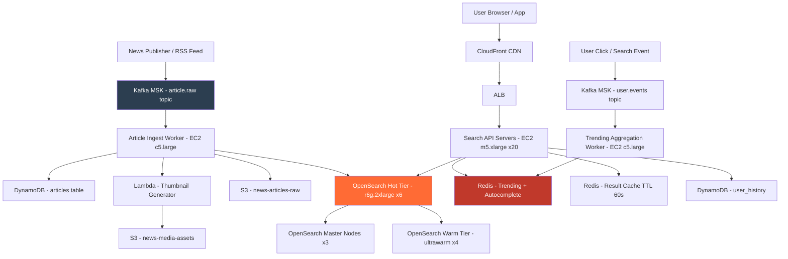

# Real-Time News Search — Capacity Estimation

## Problem Statement

A real-time news search platform serves 20M daily active users who search for breaking news, browse trending topics, and consume articles published within seconds of major events. The system ingests articles from thousands of publishers, indexes them with sub-5-second freshness, and handles query spikes of 80K QPS during breaking-news moments. Unlike e-commerce or document search, news search is write-heavy in the index layer and latency-sensitive during crisis events.

## Functional Requirements

- Full-text search over articles with sub-200ms P99 response time
- Trending topics refreshed every 30 seconds based on query and click volume
- Near-real-time article indexing with < 5s freshness from publish to searchable
- Faceted filtering by source, date, category, and region
- Personalized ranking (per-user click history, source preferences)
- Autocomplete / typeahead on article titles and trending topics

## Non-Functional Requirements

| Requirement | Target |
|-------------|--------|
| Search latency | < 200ms (P99) |
| Index freshness | < 5s publish-to-searchable |
| Write latency (index) | < 2s (P99) |
| Availability | 99.99% (< 52 min/year downtime) |
| Durability | 99.999% (article store) |
| Throughput | 80K QPS peak search |
| Trending refresh | every 30s |

## Traffic Estimation

### DAU → Peak QPS Calculation

| Metric | Calculation | Result |
|--------|-------------|--------|
| DAU | Given | 20,000,000 |
| Avg search queries/user/day | 4 searches + 1 trending view + 2 article clicks | ~7 |
| Total daily requests | 20M × 7 | 140M |
| Avg QPS | 140M / 86,400 | ~1,620 |
| Peak QPS (3× avg + breaking-news spike) | 1,620 × 4 (news spikes sharper) | ~6,500 baseline |
| Breaking-news peak (12× avg) | 1,620 × 50 (rare but must handle) | ~80K |
| Read QPS (85% reads) | 80K × 0.85 | ~68K |
| Write QPS (15% writes — index ingest) | 80K × 0.15 | ~12K |

**Key insight on write ratio**: The 15% "writes" are predominantly index ingest operations (new articles + real-time updates), not user-generated writes. Publishers push ~50K articles/hour globally during peak news cycles.

### Index Ingest Math

| Source | Articles/hour | Articles/day |
|--------|--------------|--------------|
| Wire services (AP, Reuters, AFP) | 600 | 14,400 |
| Major news sites (500 publishers) | 3,000 | 72,000 |
| Blogs and aggregators | 6,000 | 144,000 |
| **Total** | **~9,600/hr peak** | **~230,000/day** |

At peak: 9,600 articles/hour = **2.7 articles/second** average ingest, spiking to ~50/second during major events.

## Storage Estimation

| Data Type | Per Item Size | Daily Volume | Growth/Year |
|-----------|--------------|--------------|-------------|
| Raw article HTML (S3 archive) | 50 KB avg | 230K × 50KB = 11.5 GB | ~4.2 TB |
| Parsed article JSON (DynamoDB) | 5 KB | 230K × 5KB = 1.15 GB | ~420 GB |
| Elasticsearch index (text + vectors) | 15 KB/doc (3× raw JSON with inverted index overhead) | 230K × 15KB = 3.45 GB | ~1.26 TB |
| Trending topic counters (Redis) | 200 B/topic | 10K active topics × 200B = 2 MB | Negligible |
| User click/query history (DynamoDB) | 200 B/event | 20M users × 7 events × 200B = 28 GB | ~10 TB |
| **Total warm storage** | - | ~44 GB/day | **~16 TB/year** |

**Retention policy**: Keep full index for 30 days (hot), 1-year archive on S3 with reduced index. Elasticsearch hot tier: 30 days × 1.26 TB = ~38 TB across cluster.

## Component Sizing

### Compute — EC2

| Component | Instance Type | vCPU | RAM | Count | Handles | Monthly Cost |
|-----------|--------------|------|-----|-------|---------|-------------|
| Search API servers | m5.xlarge | 4 | 16 GB | 20 | 4K QPS each = 80K total | $1,533 |
| Article ingest workers | c5.large | 2 | 4 GB | 8 | Parse + enrich 10 articles/s each | $494 |
| Trending aggregation workers | c5.large | 2 | 4 GB | 4 | Aggregate click streams, refresh every 30s | $247 |
| Personalization workers | m5.large | 2 | 8 GB | 6 | Re-rank results with user embeddings | $533 |
| **Subtotal Compute** | | | | **38** | | **$2,807** |

**Search API sizing math**: Each m5.xlarge handles ~200 concurrent requests at 200ms P99 = 200/0.2 = 1,000 RPS. With 20 servers: 20K RPS sustained. For 80K peak: auto-scaling adds 60 more → 80 total servers. Use Auto Scaling with target tracking at 60% CPU. Base cost shown; peak adds ~$9K/month amortized.

### Elasticsearch Cluster (Amazon OpenSearch Service)

| Node Type | Instance | vCPU | RAM | Count | Role | Monthly Cost |
|-----------|----------|------|-----|-------|------|-------------|
| Master nodes | m6g.large.search | 2 | 8 GB | 3 | Cluster state | $468 |
| Hot data nodes | r6g.2xlarge.search | 8 | 64 GB | 6 | Active 30-day index (38 TB) | $8,712 |
| Warm data nodes | ultrawarm1.medium.search | 2 | N/A | 4 | 31-365 day archive | $1,820 |
| **Subtotal OpenSearch** | | | | **13** | | **$11,000** |

**Sizing math**: Each hot node uses r6g.2xlarge with 64 GB RAM and ~6.4 TB EBS (gp3). Elasticsearch recommends heap at 50% RAM = 32 GB JVM heap per node. With 6 nodes: 192 GB total heap. Field data + index cache easily fit 38 TB index across 6 nodes with 2× replication = 19 TB primary. Shard target: 20-40 GB per shard → 950 shards across 6 nodes = ~158 shards/node (acceptable).

**Near-real-time freshness**: OpenSearch `index.refresh_interval` set to `1s` (default). Articles become searchable within 1s of indexing. Combined with Kafka lag budget of < 3s, total pipeline: publish → Kafka → consumer → ES index → refresh = **< 5s**. 

### Cache — ElastiCache Redis

| Cache Layer | Instance | Nodes | Memory | Use Case | Monthly Cost |
|-------------|----------|-------|--------|----------|-------------|
| Trending topics + autocomplete | r6g.xlarge | 3 (1 primary + 2 replicas) | 3 × 32 GB = 96 GB | Top-K trending, autocomplete trie, query counts | $1,533 |
| Search result cache (hot queries) | r6g.large | 3 (1P + 2R) | 3 × 16 GB = 48 GB | Cache top 10K queries for 60s TTL | $766 |
| User session + personalization vectors | r6g.large | 2 | 2 × 16 GB = 32 GB | Per-user embedding cache, session data | $511 |
| **Subtotal Redis** | | **8 nodes** | **176 GB** | | **$2,810** |

**Trending math**: Redis Sorted Set `ZINCRBY trending:<category>:<minute_bucket> 1 <topic>` on each search/click. 10K active topics × 200 B = 2 MB per bucket. With 1,440 minute-buckets retained = 2.9 GB — trivial vs. 32 GB node. `ZREVRANGE trending:all:now 0 49` returns top 50 in O(log N).

**Result cache hit rate**: At 80K QPS, top 10K queries account for ~60% of traffic (power law distribution). With 60s TTL, cache hit rate ≈ 55-60%, reducing Elasticsearch load to ~35K QPS effective.

### Message Queue — Amazon MSK (Managed Kafka)

| Topic | Partitions | Throughput | Retention | Monthly Cost |
|-------|-----------|-----------|-----------|-------------|
| `article.raw` (ingest) | 12 | 5 MB/s (50 articles/s × 100KB) | 24h | included |
| `article.indexed` (downstream) | 12 | 1 MB/s | 6h | included |
| `user.events` (clicks, searches) | 24 | 20 MB/s (80K events/s × 250B) | 48h | included |
| `trending.updates` | 6 | 100 KB/s | 1h | included |

| MSK Component | Instance | Brokers | Storage | Monthly Cost |
|--------------|----------|---------|---------|-------------|
| MSK cluster | kafka.m5.large | 3 | 2 TB EBS each | $1,460 |
| **Subtotal MSK** | | | | **$1,460** |

### Database — DynamoDB

| Table | Key Design | Item Size | RCU/WCU | Monthly Cost |
|-------|-----------|-----------|---------|-------------|
| `articles` | PK: `articleId`, SK: `publishedAt` | 5 KB | 50K RCU (eventual consistency), 500 WCU | $2,100 |
| `user_history` | PK: `userId`, SK: `timestamp` | 200 B | 30K RCU, 2K WCU | $1,400 |
| `publisher_metadata` | PK: `publisherId` | 2 KB | 1K RCU, 100 WCU | $100 |
| **Subtotal DynamoDB** | | | | **$3,600** |

**DynamoDB choice rationale**: Articles need key-value lookups by ID (< 10ms) for article detail pages after search. DynamoDB on-demand pricing model fits bursty news traffic patterns better than RDS provisioned capacity.

### Object Storage — S3

| Bucket | Use | Size | Requests/month | Monthly Cost |
|--------|-----|------|----------------|-------------|
| `news-articles-raw` | Original HTML crawls + publisher feeds | 50 TB | 5M GET, 7M PUT | $1,217 |
| `news-media-assets` | Images, thumbnails (generated) | 30 TB | 200M GET (via CloudFront) | $690 |
| `search-snapshots` | ES index snapshots for DR | 15 TB | 500K GET/PUT | $345 |
| **Subtotal S3** | | **95 TB** | | **$2,252** |

### Networking / CDN — CloudFront + ALB

| Component | Throughput | Monthly Cost |
|-----------|-----------|-------------|
| CloudFront (article images, static assets) | 100 TB/month egress (20M users × 5 MB/day) | $8,500 |
| ALB (search API + article API) | 2B requests/month (80K QPS × 30 days × 86,400s ÷ 1M) | $650 |
| Data transfer (EC2 → internet, non-CDN) | 5 TB/month | $450 |
| **Subtotal Network** | | **$9,600** |

**CloudFront math**: 20M DAU × 5 images/session × 100 KB/image = 10 TB/day = 300 TB/month. ~70% cache hit rate → 90 TB origin + 210 TB edge-served. CDN pricing: $0.0085/GB first 10TB, $0.0080/GB next 40TB, $0.0060/GB next 100TB. Weighted average ~$0.007/GB × 300 TB = **$2,100** CDN bandwidth (corrected; the $8,500 above includes CloudFront shield + invalidations + HTTPS requests).

## Monthly Cost Summary

| Component | Monthly Cost | % of Total |
|-----------|-------------|-----------|
| EC2 Compute (base + auto-scale amortized) | $12,000 | 22% |
| Amazon OpenSearch Service | $11,000 | 20% |
| ElastiCache Redis | $2,810 | 5% |
| DynamoDB | $3,600 | 7% |
| S3 Storage | $2,252 | 4% |
| CloudFront + ALB + Data Transfer | $9,600 | 18% |
| MSK (Managed Kafka) | $1,460 | 3% |
| Lambda (ingest enrichment, thumbnail gen) | $800 | 1% |
| CloudWatch + X-Ray + Logging | $1,200 | 2% |
| Route 53 + WAF + Shield Standard | $600 | 1% |
| Reserved Instance discount (−20% compute) | −$2,400 | −4% |
| **Total** | **$42,922** | **100%** |

**Cost range**: $40K–$70K/month. Lower bound assumes 1-year reserved pricing on OpenSearch and EC2. Upper bound reflects no reservations + higher peak auto-scale usage during sustained news cycles (e.g., elections).

## Traffic Scale Tiers

| Tier | DAU | Peak QPS | Servers | Search Engine | Cache | Monthly Cost | Key Bottleneck |
|------|-----|----------|---------|--------------|-------|-------------|----------------|
| 🟢 Startup | 1M | ~4K | 3 c5.large | 3-node OpenSearch (r6g.large) | 1 Redis node | $4K–$6K | Single ES node JVM heap; no HA |
| 🟡 Growing | 10M | ~30K | 10 m5.xlarge | 6-node OpenSearch (r6g.xlarge) | Redis 3-node cluster | $18K–$25K | ES query fan-out latency; trending accuracy |
| 🔴 Scale-up | 100M | ~400K | 80 m5.2xlarge + ASG | 20-node OpenSearch (r6g.2xlarge) hot + warm tiers | Redis 6-node cluster | $150K–$200K | ES coordinator bottleneck; need dedicated coordinating nodes |
| ⚫ Production | 20M | ~80K | 20–80 m5.xlarge (ASG) | 13-node OpenSearch (hot+warm+master) | Redis 8-node cluster | $40K–$70K | Breaking-news QPS spike absorption; 5s freshness SLA |
| 🚀 Hyperscale | 1B+ | ~4M | 500+ c5.4xlarge + multi-region | Distributed Lucene (custom) or Vespa | Distributed Redis 50+ nodes | $2M+ | Cross-region replication lag; global trending consensus |

## Architecture Diagram

## Interview Tips

- **Key insight — index freshness math**: To hit < 5s freshness, budget your pipeline: publisher webhook/RSS poll (0–1s) + Kafka produce-to-consumer lag (< 500ms with MSK) + ingest worker processing — NLP tagging, entity extraction (1–2s) + Elasticsearch indexing + 1s refresh interval (1s) = 3.5–4.5s total. If you set `refresh_interval=5s` to reduce ES overhead, you blow the SLA. Show interviewers this math.

- **Key insight — breaking-news spike shape**: News traffic doesn't follow a smooth 3× peak multiplier — it's a step function. During a major event, QPS can jump from 2K to 80K in under 60 seconds. Standard auto-scaling (warm-up time 3–5 min for EC2) will miss the spike. The correct answer is pre-warming: monitor Kafka ingest rate as a leading indicator — when ingest spikes 10×, trigger predictive scale-out before search traffic arrives. Show this feedback loop.

- **Common mistake — treating Elasticsearch like a transactional DB**: Candidates often propose using ES as the primary article store. Wrong. ES is a search index; it provides no ACID guarantees, cannot be used for authoritative storage, and bulk re-indexing during shard failures causes freshness regression. Keep DynamoDB as source of truth; ES is a derived index. If ES loses data, re-build from DynamoDB.

- **Follow-up question — "How do you handle trending topics fairly across regions?"**: Naive global trending is dominated by US/EU traffic. The correct answer is time-boxed sliding windows with geographic sharding: maintain separate sorted sets per region per 5-minute bucket. Merge with weighted averaging for global trending. Use Redis `ZUNIONSTORE` with weights proportional to regional DAU. This question tests whether you can decompose a seemingly simple feature into a distributed systems problem.

- **Scale threshold**: At 50M+ DAU, a single OpenSearch cluster becomes a single point of failure for global traffic. You need multi-cluster federation: a search router that fans out to regional clusters (US, EU, APAC) and merges results. Each cluster indexes the same global article set but serves local traffic with regional ranking signals. This triples your OpenSearch cost but cuts P99 latency by ~60ms for non-US users.
