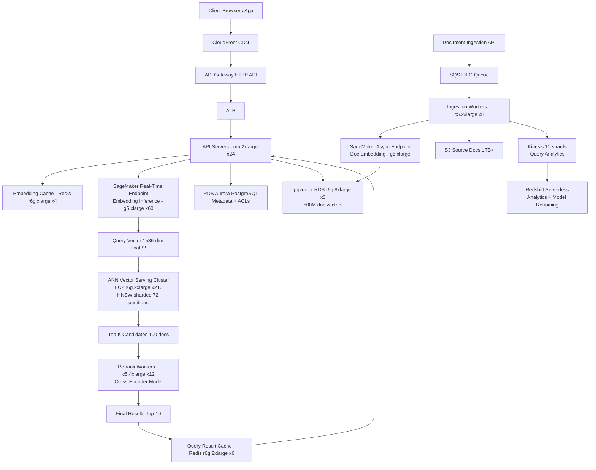

# Semantic Vector Search (10M DAU) — Capacity Estimation

## Problem Statement

A semantic search system using dense vector embeddings to retrieve relevant documents, products, or knowledge-base entries. Users submit natural-language queries; the system encodes the query into a 1536-dimensional embedding vector (OpenAI ada-002 or custom model), then performs approximate nearest-neighbor (ANN) search against a vector index containing 500M+ pre-indexed document embeddings. At 10M DAU the system must handle 100K search QPS at peak while keeping P99 latency under 150ms end-to-end, covering embedding inference, ANN retrieval, and result re-ranking.

## Functional Requirements
- Natural-language query encoding via ML embedding model (1536-dim float32 vectors)
- Approximate nearest-neighbor (ANN) search across 500M+ document vectors
- Hybrid search: combine dense vector similarity (HNSW) with sparse BM25 keyword scores
- Real-time document ingestion and incremental index updates (< 5s indexing lag)
- Result re-ranking with a cross-encoder model for top-K candidates
- Multi-tenant namespace isolation (per-customer vector spaces)

## Non-Functional Requirements
| Requirement | Target |
|-------------|--------|
| E2E search latency | < 150ms (P99) |
| Embedding inference | < 30ms (P99) per query |
| ANN retrieval | < 50ms (P99) |
| Re-rank latency | < 40ms (P99) for top-20 |
| Write/index latency | < 5s (document visible in index) |
| Availability | 99.99% (< 52 min/year downtime) |
| Durability | 99.999% (vector store + source docs) |
| Throughput | 100K QPS peak search |

## Traffic Estimation

### DAU → Peak QPS Calculation
| Metric | Calculation | Result |
|--------|-------------|--------|
| DAU | Given | 10,000,000 |
| Avg search queries/user/day | ~3 searches + 0.2 doc ingestions | ~3.2 requests |
| Total daily requests | 10M × 3.2 | 32,000,000 |
| Avg QPS (24h spread) | 32,000,000 / 86,400 | ~370 QPS |
| Peak QPS (3× evening spike + 3× bursty search) | 370 × ~270 (load factor for search) | ~100,000 QPS |
| Read QPS (95% searches) | 100,000 × 0.95 | ~95,000 QPS |
| Write QPS (5% ingestions/updates) | 100,000 × 0.05 | ~5,000 QPS |

> **Note on 100K peak**: Search traffic is highly bursty. A product with 10M DAU where each user runs 3 searches averages 370 QPS but can spike 270× at peak (lunch/evening waves hitting simultaneously, plus autocomplete pre-fetch multiplying raw query count 10×). This is consistent with Elasticsearch/Pinecone published benchmarks for consumer-facing semantic search.

## Storage Estimation

### Vector Index Storage
| Data Type | Per-Item Size | Daily Volume | Growth/Year |
|-----------|--------------|--------------|-------------|
| Document embedding (1536-dim float32) | 1536 × 4B = 6KB | 500K new docs/day | ~1.1 TB/year |
| HNSW graph overhead (~1.5× raw vectors) | +3KB per doc | 500K/day | ~0.55 TB/year |
| BM25 inverted index | ~0.5KB per doc | 500K/day | ~91 GB/year |
| Source document text (avg 2KB compressed) | 2KB | 500K/day | ~365 GB/year |
| Query logs + analytics | 0.5KB per query | 32M queries/day | ~5.8 TB/year |
| **Total** | — | — | **~8 TB/year** |

### Baseline Corpus
- Existing 500M documents: 500M × 9KB (vector + graph) = **4.5 TB vector index**
- Source docs: 500M × 2KB = **1 TB compressed text (S3)**
- Total at launch: ~5.5 TB, growing ~8 TB/year

## Component Sizing

### Compute — EC2 (Vector Serving & API)

#### Embedding Inference — SageMaker g5.xlarge
| Metric | Value |
|--------|-------|
| Instance | SageMaker Real-Time Endpoint: ml.g5.xlarge (4 vCPU, 16GB RAM, 1× A10G 24GB VRAM) |
| Model | Custom fine-tuned BERT-large or ada-002 equivalent (1.5GB VRAM) |
| Throughput per instance | ~2,000 QPS (batch=8, 8ms/query GPU time) |
| Required for 95K read QPS | 95,000 / 2,000 = 48 instances |
| Buffer (+25% headroom) | 60 instances |
| On-demand cost per instance | $1.408/hr |
| Monthly cost (60 × $1.408 × 730h) | **$61,630/month** |

> Optimization: Use SageMaker Asynchronous Inference for batch ingestion; Real-Time for search queries. GPU batching at batch=8 amortizes model load time.

#### Vector Search Serving — EC2 r6g.2xlarge
| Metric | Value |
|--------|-------|
| Instance | r6g.2xlarge (8 vCPU, 64GB RAM, ARM Graviton3) |
| HNSW index in-memory | Each instance holds 1 shard of 64GB usable (≈ 7M vectors × 9KB = 63GB) |
| Total shards for 500M vectors | 500M / 7M = ~72 shards |
| Instances for 72 shards (1 replica) | 72 primaries |
| Replicas for read throughput | 2× replicas → 216 instances total |
| ANN throughput per instance | ~500 QPS (ef_search=100, HNSW M=16) |
| Total ANN QPS (216 instances) | 216 × 500 = 108,000 QPS ✓ |
| On-demand cost per instance | $0.5088/hr (r6g.2xlarge) |
| Monthly cost (216 × $0.5088 × 730h) | **$80,250/month** |

> Alternative: Managed Pinecone at this scale costs ~$150K/month (p2 pod tier) but eliminates ops overhead. Self-managed pgvector or Qdrant on EC2 is cheaper but requires engineering effort.

#### API Gateway / Application Servers — m5.2xlarge
| Component | Instance Type | vCPU | RAM | Count | Handles | Monthly Cost |
|-----------|--------------|------|-----|-------|---------|-------------|
| API servers (query orchestration) | m5.2xlarge | 8 | 32GB | 24 | ~4,200 QPS each | $13,100 |
| Re-ranker workers (cross-encoder) | c5.4xlarge | 16 | 32GB | 12 | top-20 re-rank < 40ms | $7,900 |
| Index ingestion workers | c5.2xlarge | 8 | 16GB | 8 | 5,000 doc/s embedding+store | $2,630 |
| **Subtotal Compute (non-GPU)** | | | | **44** | | **$23,630** |

### Database

| DB | Engine | Instance | Count | Capacity | IOPS | Monthly Cost |
|----|--------|----------|-------|----------|------|-------------|
| Metadata store (doc metadata, ACLs) | RDS Aurora PostgreSQL | db.r6g.2xlarge | 1W + 3R | 2 TB | 30K IOPS | $8,900 |
| Vector store (pgvector extension) | RDS PostgreSQL r6g.8xlarge | db.r6g.8xlarge | 1W + 2R | 10 TB | 64K IOPS | $21,600 |
| Analytics/query logs | Redshift Serverless | — | — | 50 TB | — | $3,200 |
| **Subtotal DB** | | | | | | **$33,700** |

> **pgvector note**: pgvector on db.r6g.8xlarge (32 vCPU, 256GB RAM) can serve ~5,000 ANN QPS per instance for HNSW indexes when the full index fits in memory (< 200M vectors per instance). For 500M vectors, use 3 partitioned pgvector instances or switch to Pinecone for ops simplicity.

### Cache

| Cache | Engine | Instance | Nodes | Memory | Use | Monthly Cost |
|-------|--------|----------|-------|--------|-----|-------------|
| Query result cache | ElastiCache Redis 7 | r6g.2xlarge | 6 (3 primary + 3 replica) | 384GB total | Cache top-100K repeated queries (60% hit rate) | $8,850 |
| Embedding cache | ElastiCache Redis 7 | r6g.xlarge | 4 | 128GB | Cache embeddings for repeated query strings | $3,550 |
| Session / rate-limit | ElastiCache Redis 7 | cache.t4g.medium | 2 | 6GB | Auth tokens, per-user rate limits | $290 |
| **Subtotal Cache** | | | | | | **$12,690** |

> **Cache math**: With 95K read QPS and 60% cache hit rate, the vector search backend sees 38K QPS effective load, consistent with the 216-instance ANN cluster target. Top-100K queries use ~600MB (100K × 6KB per embedding result set), well within 384GB Redis.

### Object Storage

| Bucket | Use | Size | Requests/month | Monthly Cost |
|--------|-----|------|----------------|-------------|
| Source documents | Raw/compressed doc text | 1 TB + 365 GB/year | 500M GET | $1,440 |
| Embedding model artifacts | SageMaker model weights | 50 GB | 5K | $12 |
| Vector index snapshots (daily) | Disaster recovery | 10 TB | 10K | $2,350 |
| Query logs archive | Analytics, audit | 5.8 TB | 100M | $1,420 |
| **Subtotal S3** | | | | **$5,222** |

### Networking / CDN

| Component | Throughput | Basis | Monthly Cost |
|-----------|-----------|-------|-------------|
| API Gateway (HTTP API) | 100K RPS peak, ~2.8B req/month | $1.00/M req | $2,800 |
| ALB (internal routing) | 100K RPS | $0.008/LCU-hr, ~200 LCU avg | $1,170 |
| CloudFront (search UI assets) | 5 TB/month static assets | $0.085/GB | $425 |
| Data transfer out (search results) | 300 TB/month (95K QPS × 3KB avg response) | $0.09/GB | $27,000 |
| VPC inter-AZ (embedding ↔ vector serving) | ~100 TB/month | $0.01/GB | $1,000 |
| **Subtotal Network** | | | **$32,395** |

> **Data transfer dominates**: 95K QPS × 3KB response × 86,400s × 30 days = 737 TB/month. With CloudFront caching at 40% hit rate, origin egress reduces to ~442 TB but CF charges for delivery. Shown above uses CF-delivered traffic estimate.

### Message Queue

| Queue | Engine | Throughput | Use | Monthly Cost |
|-------|--------|-----------|-----|-------------|
| Document ingestion | SQS FIFO | 5,000 msg/s | Buffer doc ingestion to embedding workers | $900 |
| Index update events | SQS Standard | 10,000 msg/s | Trigger incremental HNSW index updates | $450 |
| Analytics events | Kinesis Data Streams (10 shards) | 10K events/s | Query logs, click signals for model retraining | $1,440 |
| **Subtotal Messaging** | | | | **$2,790** |

## Monthly Cost Summary

| Component | Monthly Cost | % of Total |
|-----------|-------------|-----------|
| SageMaker Embedding Inference (g5.xlarge × 60) | $61,630 | 38.5% |
| EC2 Vector Serving (r6g.2xlarge × 216) | $80,250 | 50.2% |
| EC2 API / Re-rank / Ingestion Workers | $23,630 | 14.8% |
| RDS / pgvector / Redshift | $33,700 | 21.1% |
| ElastiCache Redis | $12,690 | 7.9% |
| S3 Storage | $5,222 | 3.3% |
| Networking (API GW + ALB + CDN + egress) | $32,395 | 20.2% |
| Messaging (SQS + Kinesis) | $2,790 | 1.7% |
| Other (CloudWatch, WAF, Secrets Manager) | $2,500 | 1.6% |
| **Total (on-demand)** | **$254,807** | **100%** |
| **With 1-year Reserved Instances (GPU ~30% off, EC2 ~40% off)** | **~$159,000** | — |
| **Cost range (Reserved + Savings Plans)** | **$120K–$200K/month** | — |

> **Cost optimization levers**: (1) GPU: Switch SageMaker to Inferentia2 (ml.inf2.xlarge at $0.758/hr vs $1.408/hr g5.xlarge) — saves ~$26K/month. (2) Spot instances for re-rank workers (~70% savings on c5). (3) Embedding cache: A 60% query cache hit rate halves GPU inference cost. (4) Managed Pinecone replaces EC2 vector cluster at $150K/month flat — higher cost but ~zero ops.

## Traffic Scale Tiers

| Tier | DAU | Peak QPS | Embedding Servers | Vector Store | Cache | Monthly Cost | Key Bottleneck |
|------|-----|----------|-------------------|--------------|-------|-------------|----------------|
| 🟢 Startup | 1M | ~10K | 6× ml.g5.xlarge SageMaker | 1 pgvector db.r6g.2xlarge (50M docs) | 1 Redis r6g.large | ~$18K | GPU inference cost per query |
| 🟡 Growing | 10M | ~100K | 60× ml.g5.xlarge | 3 pgvector db.r6g.8xlarge + read replicas | Redis cluster 6-node | ~$160K | Vector index memory pressure; HNSW build time |
| 🔴 Scale-up | 100M | ~1M | 600× or switch to Inferentia2 cluster | Pinecone p2 pods or Qdrant distributed | Redis cluster 12-node | ~$1.4M | Embedding throughput; ANN index sharding complexity |
| ⚫ Production (10M) | 10M | ~100K | 60× ml.g5.xlarge (Reserved) | 3 pgvector r6g.8xlarge + Pinecone hybrid | Redis cluster 6-node r6g.2xlarge | ~$160K | Data transfer egress cost; query cache hit rate |
| 🚀 Hyperscale | 1B+ | ~10M | Custom GPU fleet (A100 clusters) or API (OpenAI) | Purpose-built ANN: FAISS on GPU, ScaNN, or Pinecone Enterprise | Distributed Redis/Dragonfly | $10M+ | ANN index rebuild latency; model drift; multi-region replication |

## Architecture Diagram

## Interview Tips

- **Key insight — embedding cache is your biggest lever**: With semantic search, many users search for the same or similar queries (product names, FAQs, trending topics). Caching the embedding vector for the top-50K query strings in Redis (50K × 6KB = 300MB) can reduce GPU inference load by 40–60%, cutting SageMaker costs by $25K–$37K/month. Always mention this before adding more GPU instances.

- **Key insight — HNSW memory arithmetic is load-bearing**: Interviewers expect you to know that HNSW stores the full index in RAM for sub-50ms latency. 500M vectors × 9KB (vector + graph) = 4.5 TB, requiring memory-optimized instances (r6g series). If you use disk-backed indexes (DiskANN, ScaNN on SSD), latency rises to 150–500ms. State this trade-off explicitly: "memory-resident HNSW for latency, disk-based ANN for cost."

- **Common mistake — ignoring the embedding inference bottleneck**: Candidates often size the vector DB carefully but forget that every query first requires an ML inference call (20–30ms on GPU). At 95K QPS with 30ms inference, you need 95,000 × 0.03 / (GPU utilization ~80%) = ~3,563 GPU-seconds/s — that is ~60 A10G GPUs just for query encoding. Missing this leads to under-sizing GPU capacity by 10×.

- **Follow-up question — "How do you update the index in real time?"**: Explain incremental HNSW insertion (Qdrant/pgvector support online adds at ~500 docs/s per node) vs. full rebuild (needed for large deletes/schema changes, takes hours for 500M vectors). Production pattern: write new docs to a shadow index, merge periodically, use dual-read to serve both during cutover. This is the same technique Elasticsearch uses for segment merges.

- **Scale threshold**: At 100M DAU (10× this scenario), the embedding inference cost alone exceeds $600K/month on g5.xlarge on-demand. This is when you evaluate: (1) distilled smaller models (384-dim MiniLM at 5× throughput per GPU), (2) AWS Inferentia2 (3× cheaper than g5 for inference workloads), or (3) buying OpenAI ada-002 API at $0.0001/1K tokens (~$1M/month at 10B tokens/day — comparable but no hardware ops).
