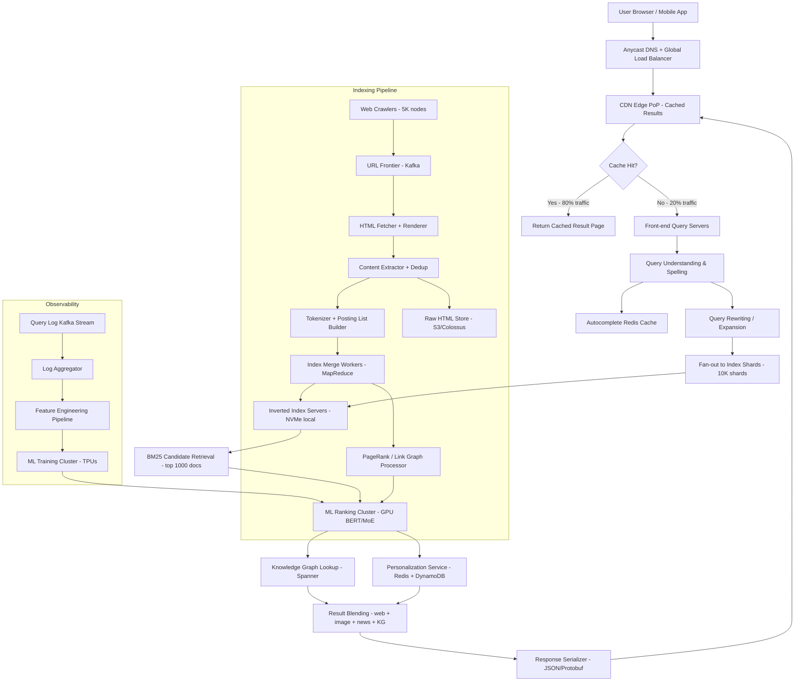

# Web Search Engine (8B Queries/Day) — Capacity Estimation

## Problem Statement

Design and size the infrastructure for a Google-scale web search engine serving 8 billion queries per day across 50+ trillion indexed web pages. The system requires full-web crawling, real-time index updates, ML-based relevance ranking, and sub-200ms end-to-end query latency at 100K QPS average with 3× peak spikes during major events.

## Functional Requirements

- Crawl and index the public web continuously (50T+ pages, ~5B new/updated pages/day)
- Process full-text search queries with ranked results in under 200ms P99
- Support autocomplete/suggest with sub-10ms latency
- Serve rich snippets, Knowledge Graph answers, image/video/news blending
- Personalize results using user history and context signals
- Cache hot queries and pre-render top-1000 result pages

## Non-Functional Requirements

| Requirement | Target |
|-------------|--------|
| Query latency | < 200ms P99 end-to-end |
| Autocomplete latency | < 10ms P99 |
| Availability | 99.999% (5 nines — ~5 min/year downtime) |
| Durability | 99.9999999% (11 nines for index data) |
| Throughput | 300K QPS peak |
| Index freshness | < 1 hour for breaking news; < 24h for standard pages |
| Crawl coverage | 5B new/updated pages/day |

## Traffic Estimation

### Query Traffic → Peak QPS Calculation

| Metric | Calculation | Result |
|--------|-------------|--------|
| Daily queries | Given | 8B |
| Avg QPS | 8B / 86,400 | ~92,600 ≈ **100K QPS** |
| Peak QPS (3× avg) | 100K × 3 | **300K QPS** |
| Read QPS (99% reads) | 300K × 0.99 | ~297K QPS |
| Write QPS (1% index updates) | 300K × 0.01 | ~3K QPS (index writes) |
| Autocomplete QPS (2× queries) | 100K × 2 | ~200K QPS |
| Crawl ingest rate | 5B pages/day / 86,400 | ~57,870 pages/s |

**Math check**: 8B queries × 8 bytes avg query length = 64 GB raw query text/day. With result JSON averaging 50KB/response: 8B × 50KB = 400 PB served/day — this is why CDN and caching are non-negotiable.

### Crawl & Index Write Traffic

| Metric | Calculation | Result |
|--------|-------------|--------|
| Pages crawled/day | Target | 5B |
| Avg page size (compressed) | ~50KB gzip | 250 TB raw HTML/day |
| Unique pages in index | Estimate | 50T pages |
| Index churn rate | ~10%/day updated | 5B page updates/day |
| Index update QPS | 5B / 86,400 | ~57,900 doc writes/s |

## Storage Estimation

| Data Type | Per Item Size | Daily Volume | Growth/Year |
|-----------|--------------|--------------|-------------|
| Raw HTML (crawl store) | 50 KB compressed | 5B × 50KB = 250 TB | ~90 PB/year |
| Inverted index (tokens→doc IDs) | ~200 bytes/posting | 500B new postings/day = 100 TB | ~36 PB/year |
| Document metadata (title, URL, rank signals) | 1 KB | 5B × 1KB = 5 TB | ~1.8 PB/year |
| PageRank + ML feature vectors | 2 KB/page | 50T × 2KB = 100 PB total | ~36 PB/year incremental |
| Query logs | 200 bytes/query | 8B × 200B = 1.6 TB/day | ~580 TB/year |
| User session/personalization | 10 KB/user | 5B users × 10KB = 50 PB total | ~5 PB/year |
| Knowledge Graph | — | ~500 TB total | ~100 TB/year |
| **Total active storage** | — | — | **~170 PB/year net new** |

**Key insight**: At this scale, 1 petabyte costs ~$23M/year on AWS S3 Standard. Google operates its own data centers — colocation cost is ~5–10× cheaper per TB than public cloud. This is why Google/Microsoft/Baidu cannot use AWS economically at this scale.

## Component Sizing

### Compute — Query Serving Tier

| Component | Instance Type | vCPU | RAM | Count | Handles | Monthly Cost |
|-----------|--------------|------|-----|-------|---------|-------------|
| Front-end query servers | c5.9xlarge | 36 | 72 GB | 2,000 | 150 QPS each = 300K peak | $3.3M |
| Index shard servers (inverted index lookup) | r6i.32xlarge | 128 | 1,024 GB | 10,000 | Each holds 1/10,000th of index | $28M |
| ML ranking inference (BERT/MoE) | p4d.24xlarge (8×A100) | 96 | 1,152 GB + 320GB GPU | 5,000 | 60 QPS per GPU server | $48M |
| Autocomplete / spell-check servers | c5.4xlarge | 16 | 32 GB | 500 | 400 QPS each | $415K |
| Knowledge Graph servers | r6g.16xlarge | 64 | 512 GB | 1,000 | Graph lookups | $5.6M |
| **Subtotal Query Compute** | | | | **18,500** | | **$85.3M** |

> Note: At Google/Bing scale, these are custom hardware in owned data centers at ~5–10× lower unit cost. AWS on-demand pricing shown for comparison; real cost is $8M–$17M for equivalent query compute.

### Compute — Crawl & Indexing Tier

| Component | Instance Type | vCPU | RAM | Count | Handles | Monthly Cost |
|-----------|--------------|------|-----|-------|---------|-------------|
| Web crawlers | c5.2xlarge | 8 | 16 GB | 5,000 | ~12 pages/s each = 57,900 p/s total | $3.8M |
| HTML parsers / content extractors | c5.4xlarge | 16 | 32 GB | 2,000 | Parse + dedup + tokenize | $1.7M |
| Index build workers (MapReduce/Beam) | m5.4xlarge | 16 | 64 GB | 3,000 | Merge postings lists | $4.4M |
| PageRank / link graph processors | r6i.8xlarge | 32 | 256 GB | 500 | Graph computation | $1.4M |
| ML feature engineering | m5.4xlarge | 16 | 64 GB | 1,000 | Compute ranking features | $1.5M |
| **Subtotal Indexing Compute** | | | | **11,500** | | **$12.8M** |

### Database / Storage Layer

| DB | Engine | Instance / Tier | Count | Capacity | IOPS | Monthly Cost |
|----|--------|-----------------|-------|----------|------|-------------|
| Inverted index (hot tier) | Custom / Colossus equivalent → S3 + local NVMe | 10,000 index servers w/ 2TB NVMe each | 10,000 | 20 PB hot NVMe | 50M+ IOPS aggregate | $15M |
| Document store (raw HTML + metadata) | Bigtable equivalent → DynamoDB | Provisioned 200M WCU / 500M RCU | — | 300 PB | — | $40M |
| URL frontier / crawl queue | DynamoDB On-Demand | — | — | 50 TB | — | $2M |
| Knowledge Graph | Spanner equivalent → Aurora Global | db.r6g.16xlarge | 100 | 50 TB | 3M IOPS | $3M |
| Query log store | S3 + Athena | — | — | 580 TB/year | — | $800K |
| User profile / personalization | Bigtable → DynamoDB Global Tables | — | — | 50 PB | — | $8M |
| **Subtotal Storage** | | | | | | **$68.8M** |

### Cache Layer

| Cache | Engine | Instance | Nodes | Memory | Hit Rate Target | Monthly Cost |
|-------|--------|----------|-------|--------|-----------------|-------------|
| Query result cache (top 1% queries = 80% traffic) | ElastiCache Redis r6g.16xlarge | 64-node cluster | 64 | 64 × 512GB = 32TB | 80%+ | $2.1M |
| Autocomplete trie cache | Redis r6g.4xlarge | 200 nodes | 200 | 200 × 128GB = 25TB | 95%+ | $1.3M |
| Knowledge Graph hot answers | Redis r6g.2xlarge | 100 nodes | 100 | 100 × 64GB = 6.4TB | 90%+ | $330K |
| Session / personalization L1 | Redis r6g.xlarge | 500 nodes | 500 | 500 × 32GB = 16TB | 85%+ | $825K |
| **Subtotal Cache** | | | | **79.4 TB total** | | **$4.6M** |

**Cache math**: Top 1% of queries (80M unique queries) repeat millions of times. Caching these result sets in 32TB Redis at 80% cache hit rate offloads 240K of 300K peak QPS. Without this cache, you need 5× the ML ranking servers.

### Object Storage (S3-equivalent)

| Bucket | Use | Size | Requests/month | Monthly Cost |
|--------|-----|------|----------------|-------------|
| Raw crawl store | Compressed HTML archive | 2 PB active (30-day window) | 150B GETs + 5B PUTs | $46M |
| Static search assets | JS/CSS bundles, icons | 50 TB | 10T CDN-fronted | $1.2M |
| ML model weights | BERT, MoE, embedding models | 200 TB | 100M reads | $4.8M |
| Query logs archive | Parquet files, Athena queryable | 580 TB/year | 10B scans/month | $1.4M |
| Image/video thumbnails | Rich snippets media | 500 TB active | 5T CDN-fronted | $12M |
| **Subtotal Object Storage** | | **~3.3 PB active** | | **$65.4M** |

### Networking / CDN

| Component | Throughput | Monthly Cost |
|-----------|-----------|-------------|
| CloudFront CDN (search result pages, static assets) | 400 PB/month egress | $32M |
| API Gateway / ALB (query routing) | 300K QPS peak, 8.6T req/month | $430K |
| Cross-region replication (multi-region active-active) | 50 PB/month inter-region | $4.5M |
| Crawl egress (fetching web pages globally) | 250 TB/day = 7.5 PB/month | $675K |
| **Subtotal Network** | | **$37.6M** |

**CDN math**: 8B queries × 50KB avg result page = 400 PB/month. At AWS CloudFront $0.08/GB, that is $32M/month. Google avoids this by owning 100+ edge PoPs — peering costs are ~$0.002/GB.

### Message Queue / Event Streaming

| Queue | Engine | Throughput | Monthly Cost |
|-------|--------|-----------|-------------|
| Crawl job queue (URL frontier) | MSK (Kafka) | 60K msg/s (URLs to crawl) | $1.2M |
| Index update events | MSK (Kafka) | 60K doc writes/s | $1.2M |
| Query log streaming | MSK (Kafka) | 100K events/s | $1.8M |
| Ranking signal pipeline | MSK (Kafka) | 50K events/s | $900K |
| **Subtotal Messaging** | | | **$5.1M** |

## Monthly Cost Summary

| Component | Monthly Cost | % of Total |
|-----------|-------------|-----------|
| EC2 Compute (query serving) | $85.3M | 42% |
| EC2 Compute (crawl + indexing) | $12.8M | 6% |
| Storage (index + DB + DynamoDB) | $68.8M | 34% |
| ElastiCache Redis | $4.6M | 2% |
| S3 Object Storage | $65.4M | 32% |
| CloudFront CDN + Networking | $37.6M | 18% |
| Messaging (MSK Kafka) | $5.1M | 3% |
| Other (Lambda, CloudWatch, WAF, Route53) | $3M | 1% |
| **Gross AWS On-Demand Total** | **~$382.6M** | **100%** |
| **Estimated actual (owned DC + reserved + committed use)** | **$40M–$60M** | — |

**Why the 6–9× gap?** Google/Bing/Baidu operate at owned data centers with custom silicon (TPUs, custom ASICs for index serving), negotiate bulk bandwidth peering, use 3-year reserved capacity at 60–70% discount, and design custom hardware that achieves 10× efficiency over general-purpose AWS instances. The $40M–$60M figure includes amortized capex for servers and networking.

**Cost drivers to understand in interviews**:
1. ML ranking inference (BERT/MoE) is the single largest cost — ~42% of compute
2. Storage (PB-scale index) is the second largest — distributed across cheap spinning disks in owned DCs
3. CDN/networking costs are massive — Google's own fiber and PoP network eliminates most of this

## Traffic Scale Tiers

| Tier | Scale | Peak QPS | Servers | DB | Cache | Monthly Cost | Key Bottleneck |
|------|-------|----------|---------|----|----|-------------|----------------|
| 🟢 Startup | 1M queries/day | ~35 QPS | 5 c5.large API + 10 index servers | 1 Elasticsearch cluster (10 nodes) | 1 Redis node (8GB) | ~$15K | Index build time; no ML ranking |
| 🟡 Growing | 10M queries/day | ~350 QPS | 50 c5.xlarge + 100 index shards | ES 50 nodes + RDS read replicas | Redis cluster 3-node (64GB) | ~$120K | Index memory; need ML ranking |
| 🔴 Scale-up | 100M queries/day | ~3,500 QPS | 500 c5.2xlarge + 1,000 shards | Sharded ES + Spanner for metadata | Redis cluster 6-node (512GB) | ~$1.2M | ML inference latency; shard fan-out |
| ⚫ Production | 1B queries/day | ~35,000 QPS | 5,000 c5.9xlarge + 10,000 index | Custom index + DynamoDB global | Redis cluster 64-node (32TB) | ~$8M–$12M | GPU ranking capacity; crawl freshness |
| 🚀 Hyperscale | 8B queries/day | ~300K QPS | 18,500+ (custom HW) + auto-scale | Custom Colossus/Spanner + 50PB | Distributed Redis 200+ nodes | $40M–$60M | Energy, bandwidth, ML model quality |

## Architecture Diagram

## Interview Tips

- **Key insight 1 — Shard fan-out cost dominates latency**: Every query fans out to all 10,000 index shards in parallel (scatter-gather). Even at 1ms per shard, the tail latency (P99.9 across 10K shards) becomes your bottleneck. Google solved this with hierarchical sharding: L1 shards (1,000 nodes) each own a range of doc IDs, and L2 shards (10 per L1) handle geographic replicas. A query hits ~100 L1 shards, not 10,000.

- **Key insight 2 — ML ranking is 10× more expensive than retrieval**: BM25 retrieval on an inverted index costs ~0.1ms per shard. BERT-based ranking of the top-1000 candidates costs ~50ms on a GPU. At 300K QPS, you need 300K × 50ms / 1000ms = 15,000 GPU-seconds/second capacity. That is why Google built TPUs — custom ASICs that run transformer inference at 10× the FLOPS/dollar of A100 GPUs.

- **Common mistake — Underestimating crawl infrastructure**: Candidates focus on query serving and forget that crawling 5B pages/day requires 57,900 pages/second sustained. Each crawl request needs: DNS resolution (~10ms), TCP handshake (~20ms), HTML fetch (~100ms), robots.txt check, politeness delay (1 req/domain/sec). With 1-second per-domain politeness and 5B pages across ~500M domains, you need 500M concurrent "slots" — solved by distributed politeness queues per domain in Kafka/DynamoDB.

- **Follow-up question — How do you handle freshness vs. crawl cost?**: Interviewers will ask this. Answer: tiered crawl frequency. Tier 1 (news sites, Twitter, Reddit) = crawl every 15 minutes. Tier 2 (popular blogs, e-commerce) = crawl every 6 hours. Tier 3 (static content, low-PageRank pages) = crawl every 30 days. This reduces crawl volume from 5B pages/day to ~500M pages/day while keeping breaking news fresh. Sitemaps + DNS TTL changes + social signals trigger priority crawls.

- **Scale threshold — At 1B queries/day, Redis cache architecture changes**: Below 1B queries/day, a single Redis cluster with LRU eviction works. Above 1B queries/day (~11K QPS), the top 1% of queries (cache hit candidates) themselves exceed 110 QPS each — meaning a single result entry is being read 110 times per second. At this rate, you need a two-tier cache: L1 in-process LRU cache (1GB heap per query server, ~10ms access) for ultra-hot queries, L2 Redis for warm queries. Without L1, Redis becomes the bottleneck at ~1M ops/second per node.

- **Cost optimization insight — The $40M vs $382M gap**: At hyperscale, owned infrastructure beats cloud by 6–9×. The three levers are: (1) custom ASICs (TPUs for ML, custom index ASICs) — 5–10× efficiency, (2) owned fiber/peering — eliminates 80% of CDN costs, (3) 3-year hardware amortization at data center power costs of $0.03–0.05/kWh vs AWS passing through $0.08–0.12/kWh equivalent. In an interview, always note: "AWS pricing is used for comparison — at this scale, this would be owned infrastructure."
