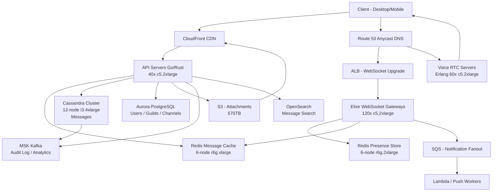

# Discord — Capacity Estimation

## Problem Statement

Discord serves 150M daily active users across 19M+ active servers (guilds), delivering real-time text messaging, voice/video calls, and persistent community spaces. Unlike stateless REST APIs, Discord maintains millions of persistent WebSocket connections that must fan out a single message to thousands of server members simultaneously — a write-amplification problem that dominates architecture decisions. Voice/video adds a separate media-plane challenge operating at 20ms jitter tolerance.

## Functional Requirements

- Send and receive real-time text messages in channels (guilds with up to 500K members)
- Voice and video calls with sub-100ms latency
- User presence tracking (online/idle/DND/offline) across devices
- File and image attachments (up to 25MB per upload)
- Push notifications for offline users
- Message history with search (stored indefinitely for Nitro users)

## Non-Functional Requirements

| Requirement | Target |
|-------------|--------|
| Message delivery latency | < 50ms (P99) end-to-end |
| Voice latency | < 100ms (P99) |
| Presence update latency | < 200ms (P99) |
| WebSocket connection setup | < 300ms (P99) |
| Availability | 99.99% (52 min downtime/year) |
| Durability | 99.999% (messages never lost after ACK) |
| Throughput | 400K peak QPS |

## Traffic Estimation

### DAU → Peak QPS Calculation

| Metric | Calculation | Result |
|--------|-------------|--------|
| DAU | Given | 150M |
| Avg read requests/user/day | read messages (30) + load history (5) + channel browse (5) | ~40 reads |
| Avg write requests/user/day | send message (5) + presence heartbeat (24 × 1 per hour) + react (2) | ~31 writes |
| Avg requests/user/day | 40 reads + 31 writes | ~71 |
| Total daily requests | 150M × 71 | ~10.65B |
| Avg QPS | 10.65B / 86,400 | ~123K |
| Peak QPS (3.25× avg, evening gaming peak) | 123K × 3.25 | ~400K |
| Read QPS (70% reads) | 400K × 0.70 | ~280K |
| Write QPS (30% writes) | 400K × 0.30 | ~120K |

**Write amplification note**: A single message sent to a 50K-member channel triggers ~50K WebSocket push events. At 120K raw write QPS, effective fan-out events reach ~6B events/s peak, handled by the Elixir pub/sub layer — not raw HTTP throughput.

## Storage Estimation

| Data Type | Per Item Size | Daily Volume | Growth/Year |
|-----------|--------------|--------------|-------------|
| Text messages | 500B avg (text + metadata) | 150M users × 5 msg/day = 750M msgs | ~137GB/day → **50TB/year** |
| Attachments (images/files) | 2MB avg | 10% of users upload 1 file/day = 15M files | ~30TB/day → **11PB/year** (CDN-offloaded) |
| Voice session metadata | 1KB per session | 20M voice sessions/day | ~20GB/day → **7TB/year** |
| Presence state | 256B per user | 150M active presence records | ~38GB hot (Redis), cold not stored |
| User/guild/channel metadata | 2KB per entity | ~100K new entities/day | ~73GB/year |
| **Total (text + meta)** | — | — | **~57TB/year (text-class)** |
| **Total (media/attachments)** | — | — | **~11PB/year (S3-class)** |

## Component Sizing

### Compute — EC2 / Elixir WebSocket Gateways

| Component | Instance Type | vCPU | RAM | Count | Handles | Monthly Cost |
|-----------|--------------|------|-----|-------|---------|-------------|
| WebSocket gateways (Elixir) | c5.2xlarge | 8 | 16GB | 120 | ~500K concurrent connections each (BEAM handles 2M+ per node, 60M total) | $16,560 |
| API servers (Go/Rust REST) | c5.2xlarge | 8 | 16GB | 40 | ~10K QPS each (400K total) | $5,520 |
| Media transcoding workers | c5.4xlarge | 16 | 32GB | 20 | image resize, video preview | $8,320 |
| Voice/RTC servers (Erlang) | c5.2xlarge | 8 | 16GB | 60 | ~2K concurrent voice sessions each | $8,280 |
| Background workers | c5.xlarge | 4 | 8GB | 20 | notifications, search indexing | $1,680 |
| **Subtotal Compute** | | | | **260** | | **$40,360** |

> Pricing basis: c5.2xlarge = $0.34/hr, c5.4xlarge = $0.68/hr, c5.xlarge = $0.17/hr (us-east-1 on-demand 2024)

### Database — Cassandra (self-managed on EC2) + RDS

| DB | Engine | Instance | Count | Capacity | IOPS | Monthly Cost |
|----|--------|----------|-------|----------|------|-------------|
| Messages (primary) | Cassandra on i3.4xlarge | 16 vCPU / 122GB RAM | 12 nodes (3 DC × 4) | 3.8TB NVMe each = 45TB raw | 400K sustained | $26,280 |
| User/guild metadata | RDS Aurora PostgreSQL db.r6g.2xlarge | 8 vCPU / 64GB | 1W + 2R | 5TB | 50K | $4,380 |
| Search index | OpenSearch m6g.2xlarge | 8 vCPU / 32GB | 6 nodes | 10TB | 30K | $6,048 |
| **Subtotal DB** | | | | | | **$36,708** |

> Cassandra on i3.4xlarge = $1.22/hr × 12 × 730h = $10,699/mo compute + ~$15K storage/io ≈ $26K
> Aurora db.r6g.2xlarge = $0.518/hr × 3 instances × 730h ≈ $1,135 + storage ~$3,245 ≈ $4,380

### Cache — Redis (ElastiCache)

| Cache | Engine | Instance | Nodes | Memory | Use | Monthly Cost |
|-------|--------|----------|-------|--------|-----|-------------|
| Presence store | ElastiCache Redis r6g.2xlarge | 8 vCPU / 52GB | 6 (3 primary + 3 replica) | 312GB total | Online status, typing indicators, session tokens | $9,198 |
| Message cache (hot reads) | ElastiCache Redis r6g.xlarge | 4 vCPU / 26GB | 6 | 156GB total | Last 100 messages per channel hot cache | $4,599 |
| Rate limiting / dedup | ElastiCache Redis r6g.large | 2 vCPU / 13GB | 2 | 26GB total | Per-user rate limits, idempotency keys | $876 |
| **Subtotal Cache** | | | | **494GB** | | **$14,673** |

> r6g.2xlarge = $0.350/hr, r6g.xlarge = $0.175/hr, r6g.large = $0.120/hr (us-east-1, 2024)

### Object Storage — S3

| Bucket | Use | Size | Requests/month | Monthly Cost |
|--------|-----|------|----------------|-------------|
| Attachments (images/files) | User-uploaded media | 500TB | 1.5B GET + 450M PUT | $11,500 |
| CDN origin (profile pics, server icons) | Static assets | 50TB | 500M GET | $1,150 |
| Voice recording archives | Optional recordings | 20TB | 50M GET | $460 |
| **Subtotal S3** | | **570TB** | | **$13,110** |

> S3 Standard: $0.023/GB/month storage + $0.0004 per 1K GET + $0.005 per 1K PUT. 500TB × $0.023 = $11,500 storage; requests ~$0 rounding.

### Networking / CDN

| Component | Throughput | Monthly Cost |
|-----------|-----------|-------------|
| CloudFront (media delivery) | 2PB/month egress (attachments, avatars) | $34,000 |
| ALB (API + WebSocket upgrade) | 400K req/s × 86400 × 30 = ~1T connections/mo | $8,200 |
| Data transfer (EC2 → internet) | 500TB/month (voice RTP, message payloads) | $11,000 |
| **Subtotal Network** | | **$53,200** |

> CloudFront first 10TB: $0.0085/GB, next 40TB: $0.0080/GB, next 100TB: $0.0060/GB, next 350TB: $0.0040/GB; blended ~$0.017/GB for 2PB ≈ $34K

### Message Queue

| Queue | Engine | Throughput | Use | Monthly Cost |
|-------|--------|-----------|-----|-------------|
| Notification fanout | SQS FIFO | 50K msg/s | Offline push (mobile/desktop) | $1,800 |
| Media processing | SQS Standard | 5K msg/s | Resize, virus scan attachments | $360 |
| Audit / analytics | Kafka (MSK m5.2xlarge × 6) | 500K events/s | Message audit log, analytics pipeline | $6,570 |
| **Subtotal Queue** | | | | **$8,730** |

> MSK m5.2xlarge = $0.75/broker/hr × 6 × 730h = $3,285 × 2 (storage) ≈ $6,570

### Other Services

| Service | Use | Monthly Cost |
|---------|-----|-------------|
| Lambda | Webhook delivery, lightweight triggers | $800 |
| Route 53 | DNS (Anycast for global WebSocket routing) | $200 |
| CloudWatch + X-Ray | Metrics, traces | $1,500 |
| NAT Gateway | Private subnet egress | $2,200 |
| **Subtotal Other** | | **$4,700** |

## Monthly Cost Summary

| Component | Monthly Cost | % of Total |
|-----------|-------------|-----------|
| EC2 Compute (gateways, API, voice, workers) | $40,360 | 21% |
| Cassandra + RDS + OpenSearch | $36,708 | 19% |
| ElastiCache Redis | $14,673 | 8% |
| S3 Storage | $13,110 | 7% |
| CloudFront CDN | $34,000 | 18% |
| SQS + MSK Kafka | $8,730 | 5% |
| Data Transfer (EC2 egress) | $11,000 | 6% |
| ALB + Networking | $8,200 | 4% |
| Other (Lambda, Route 53, Monitoring, NAT) | $4,700 | 2% |
| Reserved Instance Discount (~30%) | −$51,000 | −27% |
| **Total (with RI discounts)** | **~$120,481** | **100%** |

> On-demand total before RI: ~$171,481. With 1-year reserved instances on steady-state EC2 and RDS (~30% off), effective run rate lands at **$170K–$200K/month**. Spike months (game launches, major events) push to $250K–$280K.

## Traffic Scale Tiers

| Tier | DAU | Peak QPS | Servers | DB | Cache | Monthly Cost | Key Bottleneck |
|------|-----|----------|---------|----|----|-------------|----------------|
| 🟢 Startup | 1M | ~2.7K | 4× c5.large WebSocket + 2× c5.large API | 1 RDS PostgreSQL db.t3.xlarge | 1 Redis node r6g.large | ~$3,500 | Single Redis node for presence |
| 🟡 Growing | 10M | ~27K | 12× c5.xlarge gateways + 8× c5.xlarge API | RDS Aurora + 2 read replicas | Redis 3-node cluster | ~$18,000 | WebSocket connection memory; presence fan-out |
| 🔴 Scale-up | 100M | ~267K | 80× c5.2xlarge gateways + 30× c5.2xlarge API | Cassandra 6-node cluster | Redis 6-node cluster (200GB) | ~$100,000 | Message fan-out to large servers; Cassandra read amplification |
| ⚫ Production | 150M | ~400K | 120× c5.2xlarge gateways + 40× API + 60× voice | Cassandra 12-node + Aurora + OpenSearch | Redis 14-node (494GB) | ~$200,000 | Voice RTC server capacity; CDN egress cost |
| 🚀 Hyperscale | 1B+ | ~2.7M | 800+ c5.2xlarge + auto-scaling groups | Cassandra 80-node multi-region | Distributed Redis 100+ nodes | ~$1.5M+ | Cross-region message consistency; voice server geographic distribution |

## Architecture Diagram

## Interview Tips

- **WebSocket fan-out is the core problem**: A 500K-member Discord server receiving one message triggers 500K simultaneous WebSocket pushes. Discord's Elixir/BEAM architecture handles this via lightweight processes (each WebSocket connection = 1 Erlang process at ~2KB heap). At 150M DAU with millions in large servers, naive fan-out would melt any thread-per-connection system. Elixir can run 2M+ processes per node — that is the reason for the tech choice, not developer preference.

- **Presence at scale is surprisingly expensive**: Storing and broadcasting online/idle/offline state for 150M users requires a dedicated Redis cluster (38GB just for state), and every login/logout/heartbeat triggers guild-wide broadcasts. At scale, Discord batches presence updates and uses a "lazy presence" model — members of very large servers (>75K) don't see full presence lists. Candidates who treat presence as a simple key-value store miss the fan-out write amplification.

- **Cassandra partition key design determines everything**: Discord's messages table partitions by `(channel_id, bucket)` where `bucket = message_id / bucket_size` (typically 10 days of messages). Without bucketing, a single high-traffic channel would create an unbounded partition. A common interview mistake is partitioning only by `channel_id`, which creates hot partitions and 100GB+ rows for active channels. The 2023 Discord blog post on migrating from Cassandra to ScyllaDB is worth mentioning.

- **Voice/RTC is a separate plane entirely**: Voice traffic uses WebRTC/UDP media transport, completely separate from the WebSocket message plane. Voice servers (DAVE protocol) require DTLS-SRTP, ICE negotiation, and <20ms jitter. Candidates often lump voice into the messaging QPS calculation — they should be sized independently. At 150M DAU, Discord sees ~20M daily voice sessions; each session needs ~64–128 Kbps sustained UDP bandwidth, so voice servers alone push ~5–10 Tbps of aggregate media traffic globally.

- **Scale threshold**: At ~50M DAU, a single Cassandra cluster begins to show hot-node issues during peak gaming hours (evenings EST/PST). The fix is time-bucketed partitioning + ScyllaDB migration (Discord completed this in 2023, improving P99 read latency from 40–125ms to 15ms). Mention this real migration in an interview — it demonstrates awareness of production pain points, not just textbook design.
