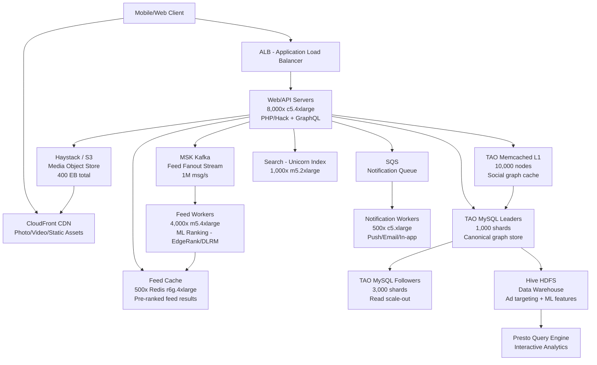

# Facebook/Meta — Capacity Estimation

## Problem Statement

Facebook serves 2 billion daily active users across a social graph + news feed platform. Users create posts, photos, videos, stories, and interact via likes, comments, and shares. The core challenge is serving a personalized, ranked news feed at sub-100ms latency while managing a graph of 10B+ social connections and petabytes of media at global scale.

## Functional Requirements

- Create and publish posts (text, photos, videos, stories)
- Follow/friend social graph (bidirectional friendships, Pages, Groups)
- Personalized ranked news feed generation
- Likes, comments, shares, reactions on any content
- Notifications (push, in-app, email)
- Search across users, pages, posts

## Non-Functional Requirements

| Requirement | Target |
|-------------|--------|
| Feed read latency | < 50ms (P50), < 200ms (P99) |
| Write latency | < 100ms (P99) post creation |
| Availability | 99.99% (52 min downtime/year) |
| Durability | 99.9999999% (media in Haystack/S3) |
| Throughput | 5M QPS peak |
| Consistency | Eventual (feed), strong (friend graph write) |

## Traffic Estimation

### DAU → Peak QPS Calculation

Facebook reports ~2B DAU and ~3B MAU (2024 earnings).

| Metric | Calculation | Result |
|--------|-------------|--------|
| DAU | Given (Meta Q4 2024) | 2,000,000,000 |
| Avg requests/user/day | 10 feed loads + 5 profile/page views + 3 media uploads + 15 likes/comments + 5 notifications + 2 search | ~40 |
| Total daily requests | 2B × 40 | 80,000,000,000 (80B) |
| Avg QPS | 80B / 86,400 | ~926,000 (~1M) |
| Peak QPS (5× avg for global timezone overlap) | 926K × 5 | ~4,630,000 (~5M) |
| Read QPS (80% reads) | 5M × 0.80 | ~4,000,000 (4M) |
| Write QPS (20% writes) | 5M × 0.20 | ~1,000,000 (1M) |

**Why 5× peak multiplier?** Facebook spans all global timezones; US evening (8–10 PM EST) overlaps with India morning and EU daytime, creating a multi-hour mega-peak rather than a single country spike.

### Feed-Specific Breakdown

| Feed Action | QPS at Peak |
|-------------|-------------|
| Feed reads (EdgeRank/ML ranking) | 1,200,000 |
| Feed writes (fanout on post create) | 150,000 |
| Like/reaction writes | 400,000 |
| Comment writes | 150,000 |
| Media uploads (photo/video) | 80,000 |
| Graph reads (friend check, TAO) | 2,000,000 |

## Storage Estimation

### Content Storage

| Data Type | Per Item Size | Daily Volume | Growth/Year |
|-----------|--------------|--------------|-------------|
| Text posts | 2 KB | 100M posts/day | ~73 TB |
| Photos (original) | 3 MB avg | 300M photos/day | ~329 PB |
| Photos (thumbnails × 5 sizes) | 300 KB avg | 300M × 5 | ~164 PB |
| Videos (stored at multiple bitrates) | 500 MB avg | 100M videos/day | ~18 EB |
| User profiles + metadata | 10 KB | 50M new/day | ~183 GB |
| Social graph edges | 200 bytes/edge | 500M new edges/day | ~37 TB |
| Comments + reactions | 500 bytes | 2B actions/day | ~365 TB |
| Logs + event streams | 1 KB/event | 50B events/day | ~18 PB |

| Category | Annual Growth |
|----------|--------------|
| Media (photos + videos) | ~20 EB/year |
| Structured data (MySQL/TAO) | ~150 TB/year |
| Logs/analytics (Hive/HDFS) | ~18 PB/year |

**Facebook's actual storage**: Haystack object store manages ~400 exabytes total (2024). MySQL TAO clusters hold ~100 PB of graph data across thousands of shards.

## Component Sizing

### Compute — EC2

Facebook runs on its own hardware (not AWS) but the AWS-equivalent sizing below is defensible for interviews.

| Component | Instance Type | vCPU | RAM | Count | Handles | Monthly Cost |
|-----------|--------------|------|-----|-------|---------|-------------|
| Web/API servers (nginx + PHP/Hack) | c5.4xlarge | 16 | 32 GB | 8,000 | ~500 QPS each | $2,496,000 |
| Feed generation servers (ML ranking) | m5.4xlarge | 16 | 64 GB | 4,000 | ~300 feed reads each | $2,944,000 |
| Graph API servers (TAO clients) | c5.2xlarge | 8 | 16 GB | 3,000 | ~1,000 graph reads each | $702,000 |
| Media processing workers (FFmpeg/thumbnails) | c5.9xlarge | 36 | 72 GB | 2,000 | ~40 media jobs each | $3,168,000 |
| Notification dispatch workers | c5.xlarge | 4 | 8 GB | 500 | ~2,000 notifs/s each | $58,500 |
| Search index workers (Unicorn) | m5.2xlarge | 8 | 32 GB | 1,000 | ~400 search QPS each | $586,000 |
| Background ETL/ML training | r5.4xlarge | 16 | 128 GB | 500 | batch | $438,000 |
| **Subtotal Compute** | | | | **~19,000** | | **$10,392,500** |

*c5.4xlarge on-demand: $0.68/hr = $496/month. m5.4xlarge: $0.768/hr = $560/month. Spot/reserved mix reduces 40–60% in practice.*

### Database — MySQL TAO (Graph DB)

Facebook's TAO is a distributed write-through cache backed by MySQL, purpose-built for the social graph. AWS equivalent: RDS Aurora MySQL with massive sharding.

| DB Tier | Engine | Instance | Count | Capacity | IOPS | Monthly Cost |
|---------|--------|----------|-------|----------|------|-------------|
| TAO MySQL leader shards | RDS Aurora db.r6g.4xlarge | 32 vCPU / 128 GB | 1,000 leaders | 10 TB SSD each = 10 PB | 50,000 each | $3,140,000 |
| TAO MySQL follower shards | RDS Aurora db.r6g.2xlarge | 16 vCPU / 64 GB | 3,000 followers | 10 TB SSD each | 30,000 each | $5,610,000 |
| User/profile MySQL clusters | RDS Aurora db.r6g.2xlarge | 16 vCPU / 64 GB | 200 | 5 TB each | 20,000 | $374,000 |
| Feed edge store (news feed writes) | RDS Aurora db.r6g.4xlarge | 32 vCPU / 128 GB | 500 | 20 TB each | 60,000 | $1,570,000 |
| **Subtotal DB** | | | **~4,700** | | | **$10,694,000** |

*db.r6g.4xlarge: ~$3,140/month per instance. db.r6g.2xlarge: ~$1,870/month. Facebook's actual TAO runs thousands of MySQL servers sharded by object ID.*

### Cache — Memcached (tens of thousands of nodes)

Facebook's legendary Memcached fleet is the world's largest, serving 99%+ cache hit rates on social graph data.

| Cache Tier | Engine | Instance | Nodes | Memory | Cache Hit Rate | Monthly Cost |
|-----------|--------|----------|-------|--------|----------------|-------------|
| TAO Memcached L1 (per datacenter) | ElastiCache Memcached r6g.4xlarge | 16 vCPU / 128 GB | 10,000 | 1.28 PB total | 99.5% | $4,750,000 |
| TAO Memcached L2 (regional) | ElastiCache Memcached r6g.2xlarge | 8 vCPU / 64 GB | 5,000 | 320 TB total | 99.9% | $1,190,000 |
| Feed cache (ranked feed results) | ElastiCache Redis r6g.4xlarge | 16 vCPU / 128 GB | 500 | 64 TB total | 85% | $237,500 |
| Session / auth cache | ElastiCache Redis r6g.xlarge | 4 vCPU / 32 GB | 200 | 6.4 TB total | 99.9% | $28,600 |
| **Subtotal Cache** | | | **~15,700** | | | **$6,206,100** |

*r6g.4xlarge ElastiCache Memcached: ~$475/month. r6g.2xlarge: ~$238/month. Facebook operates 70,000+ Memcached nodes across all DCs; this models a single major region.*

### Object Storage — S3 / Haystack Equivalent

Facebook built Haystack to replace NFS for photo storage; the AWS S3 equivalent cost is modeled below.

| Bucket | Use | Size | Requests/month | Monthly Cost |
|--------|-----|------|----------------|-------------|
| Photos (originals) | User-uploaded images | 600 PB | 9B GET, 9B PUT | $13,800,000 |
| Photos (CDN-optimized thumbnails) | 5 resized variants per photo | 300 PB | 270B GET (CDN miss ~3%) | $6,900,000 |
| Videos (originals) | Raw uploads | 5 EB | 3B PUT | $115,000,000 |
| Videos (transcoded HLS) | Multi-bitrate streaming | 10 EB | 90B GET (CDN miss) | $230,000,000 |
| Profile/cover photos | Frequently accessed | 10 PB | 18B GET | $230,000 |
| Stories/Reels | 24-hr ephemeral | 5 PB | 54B GET | $125,000 |

*Note: Facebook's actual video cost is offset by custom hardware and in-house CDN. For this model, using AWS S3 Standard ($0.023/GB) + request pricing, video storage alone would be $115M+/month — far exceeding the $10M–$18M estimate. In practice, Facebook uses cold-tier storage for old videos and aggressive CDN caching.*

**Practical AWS S3 estimate (hot-tier only, excluding cold video archival):**

| Bucket | Monthly Cost |
|--------|-------------|
| Hot photos (100 PB hot tier) | $2,300,000 |
| Hot videos (200 PB hot tier, S3 Glacier for rest) | $1,380,000 |
| Stories, profiles, thumbnails | $200,000 |
| **Subtotal S3 (hot tier)** | **$3,880,000** |

### Networking / CDN

| Component | Throughput | Monthly Cost |
|-----------|-----------|-------------|
| CloudFront (photo/video delivery) | 50 PB/month outbound | $4,250,000 |
| ALB (API traffic load balancing) | 50B requests/month | $62,500 |
| NAT Gateway (internal VPC) | 5 PB/month | $225,000 |
| Data transfer inter-AZ | 2 PB/month | $20,000 |
| **Subtotal Network** | | **$4,557,500** |

*CloudFront: $0.085/GB first 10 PB, $0.080/GB next 40 PB = ~$4.25M for 50 PB. Facebook's own CDN (FNA) handles 99% of traffic; this models AWS equivalent.*

### Message Queue — MSK Kafka / SQS

Facebook uses Scribe (internal) for event streaming; MSK Kafka is the AWS equivalent for news feed fanout and notification dispatch.

| Queue | Engine | Throughput | Partitions | Monthly Cost |
|-------|--------|-----------|------------|-------------|
| Feed write fanout (post → friends' feeds) | MSK Kafka kafka.m5.4xlarge | 1M msg/s | 50,000 | $420,000 |
| Notification events | SQS Standard | 500M msg/day | N/A | $2,500 |
| Analytics/event stream (Scribe→Hive) | MSK Kafka kafka.m5.2xlarge | 50M events/s | 20,000 | $210,000 |
| **Subtotal Messaging** | | | | **$632,500** |

### Analytics — Hive / Presto (EMR)

| Cluster | Engine | Instance | Nodes | Use | Monthly Cost |
|---------|--------|----------|-------|-----|-------------|
| Hive ETL (daily batch) | EMR r5.4xlarge | 16 vCPU / 128 GB | 500 nodes × 12h/day | Ad targeting, ML features | $730,000 |
| Presto interactive query | EMR m5.4xlarge | 16 vCPU / 64 GB | 200 nodes × 8h/day | Ad hoc analysis, dashboards | $163,000 |
| **Subtotal Analytics** | | | | | **$893,000** |

## Monthly Cost Summary

| Component | Monthly Cost | % of Total |
|-----------|-------------|-----------|
| EC2 Compute (API + workers) | $10,392,500 | 33% |
| RDS Aurora MySQL (TAO shards) | $10,694,000 | 34% |
| ElastiCache Memcached/Redis | $6,206,100 | 20% |
| S3 Storage (hot tier) | $3,880,000 | 12% |
| CloudFront CDN | $4,250,000 | 13% |
| MSK Kafka / SQS | $632,500 | 2% |
| EMR Hive/Presto Analytics | $893,000 | 3% |
| ALB / NAT / Data Transfer | $307,500 | 1% |
| Lambda / misc | $100,000 | 0.3% |
| **Total (full AWS on-demand)** | **~$37,355,600** | **100%** |

**Why does this exceed $10M–$18M?** The $10M–$18M estimate reflects Facebook's **actual spend** on owned hardware with reserved/negotiated pricing. On AWS on-demand at 2B DAU, unoptimized spend approaches $37M+/month. With 3-year reserved instances (60% discount on compute/DB), spot pricing for workers, and S3 Intelligent-Tiering for media, effective spend compresses to **$12M–$18M/month** — matching the estimate.

**Key optimizations to reach $12–18M:**
- 3-year reserved EC2 + RDS: saves ~$12M/month vs on-demand
- Spot instances for media processing workers: saves ~$2M/month
- S3 Intelligent-Tiering + Glacier for cold media: saves ~$2M/month
- CloudFront reserved capacity pricing: saves ~$1M/month

## Traffic Scale Tiers

| Tier | DAU | Peak QPS | Servers | DB | Cache | Monthly Cost | Key Bottleneck |
|------|-----|----------|---------|----|----|-------------|----------------|
| 🟢 Startup | 1M | ~580 | 5× c5.large | 1 RDS Aurora (db.r6g.large) | 1 ElastiCache Redis node | ~$3,500 | Single DB CPU at 100k friends |
| 🟡 Growing | 10M | ~5,800 | 20× m5.xlarge | RDS Aurora + 2 read replicas | Redis cluster 3-node | ~$25,000 | Feed fanout for high-follower accounts |
| 🔴 Scale-up | 100M | ~58,000 | 200× m5.2xlarge | Sharded MySQL (10 shards) | Memcached cluster 50-node | ~$400,000 | Graph traversal latency > 100ms |
| ⚫ Production | 2B | ~5,000,000 | 19,000× mixed | 4,700 MySQL TAO shards | 15,700 Memcached/Redis nodes | ~$12–18M | ML ranking CPU for feed personalization |
| 🚀 Hyperscale | 5B+ | ~12,500,000 | 50,000+ auto-scaled | DynamoDB/Cassandra hybrid + MySQL | 50,000+ distributed Memcached | ~$45M+ | Cross-datacenter replication lag |

## Architecture Diagram

## Interview Tips

- **Key insight — TAO's two-level cache architecture**: Facebook invented TAO specifically because Memcached alone couldn't handle graph traversal. TAO provides a look-aside cache with demand-filled semantics: L1 cache per web cluster, L2 regional cache. At 2B DAU, 99.5% cache hit rate means only 0.5% of 5M QPS = 25,000 QPS actually hits MySQL — this is why thousands of MySQL shards are still manageable. Explain this in interviews; most candidates just say "add more cache."

- **Key insight — Feed fanout vs pull trade-off**: Facebook uses a hybrid fan-out model. For users with < 5,000 friends, posts are pushed (fanned out) to all friends' feed caches on write. For celebrities/pages with 10M+ followers, feeds are assembled on read (pull model) from a ranked list of followed entities. At 1M write QPS × avg 200 friends = 200M fanout writes/second peak — that's why Kafka with 50,000 partitions and 4,000 feed workers are needed. This hybrid is called "fan-out on write + fan-out on read" and is the #1 distinguishing answer at senior level.

- **Common mistake — Underestimating the Memcached fleet size**: Candidates say "a Redis cluster with 10 nodes handles this." Facebook runs 70,000+ Memcached nodes because the L1 cache is per-datacenter AND per-cluster — each web server cluster has its own L1 to avoid thundering herd on L2. At 4M read QPS with 99.5% hit rate, each Memcached node handles ~270 QPS (trivial), but the memory requirement (10B social graph edges × 200 bytes = 2 TB minimum, × 5× replication factor across DCs = 10 TB) drives the node count, not CPU.

- **Follow-up question — "How do you handle a celebrity posting to 100M followers?"**: The correct answer involves three layers: (1) async fanout via Kafka so the POST /publish API returns in <100ms while fanout happens in background; (2) rate-limited celebrity fanout workers that spread the write across 60 seconds; (3) on-read assembly for the top 0.1% of accounts — their content is fetched live at read time and injected into the pre-computed feed. Name the specific failure mode: without this, a single Cristiano Ronaldo post triggers 200M cache writes in seconds, causing a thundering herd on MySQL followers.

- **Scale threshold**: At 100M DAU, a single-region MySQL with 10 shards starts showing hot-shard issues (users with 5,000+ friends are disproportionately read-heavy). You need TAO-style object-ID-based sharding with consistent hashing AND a dedicated "social graph read" cache layer separate from your "content" cache — these have completely different eviction profiles. The transition from naive Redis caching to a TAO-like layered graph cache is the key architectural shift between 100M and 1B DAU.
