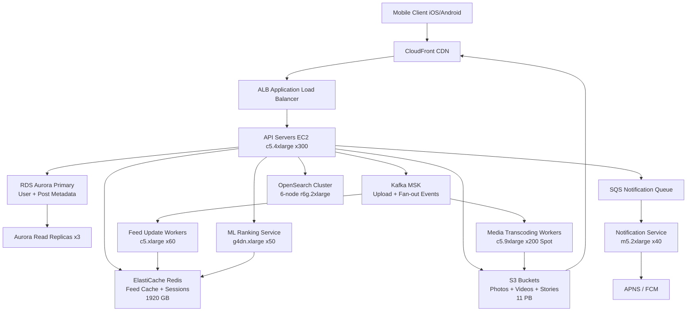

# Instagram — Capacity Estimation

## Problem Statement

Instagram serves 500M daily active users who upload, browse, and interact with photos and videos. The platform must handle a heavily read-skewed workload (80% reads) where a single viral post can spike to millions of views within minutes. Media assets (photos, videos, Reels) dominate storage and egress costs, while feed ranking and notification systems demand low-latency compute.

## Functional Requirements

- Upload photos (up to 10MB) and videos/Reels (up to 100MB)
- Serve a personalized home feed (ranked by ML model)
- Follow/unfollow users; like, comment, save posts
- Search by hashtag, location, or username
- Push notifications (likes, comments, new followers)
- Stories (24-hour ephemeral content)

## Non-Functional Requirements

| Requirement | Target |
|-------------|--------|
| Feed read latency | < 100ms (P99) |
| Media upload latency | < 2s (P99) |
| Media serve latency (CDN hit) | < 50ms (P99) |
| Write latency (like/comment) | < 200ms (P99) |
| Availability | 99.99% (52 min downtime/year) |
| Durability | 99.999999999% (S3 11 nines) |
| Throughput | 1.1M peak QPS |

## Traffic Estimation

### DAU → Peak QPS Calculation

| Metric | Calculation | Result |
|--------|-------------|--------|
| DAU | Given | 500M |
| Avg read requests/user/day | feed loads (15) + story views (10) + profile views (5) | ~30 reads |
| Avg write requests/user/day | like (3) + comment (0.5) + upload (0.2) + follow (0.1) | ~4 writes |
| Avg requests/user/day | 30 reads + 4 writes | ~34 |
| Total daily requests | 500M × 34 | 17B |
| Avg QPS | 17B / 86,400 | ~197K |
| Peak QPS (5.6× avg, morning/evening surge) | 197K × 5.6 | ~1.1M |
| Read QPS (80%) | 1.1M × 0.80 | ~880K |
| Write QPS (20%) | 1.1M × 0.20 | ~220K |

**Justification for 5.6× peak multiplier**: Instagram usage spikes heavily in two windows (07:00–09:00, 19:00–22:00 local time). Globally distributed, these overlap but still create a 5–6× burst over 24-hour average.

## Storage Estimation

| Data Type | Per Item Size | Daily Volume | Growth/Year |
|-----------|--------------|--------------|-------------|
| Photos (compressed HEIC/WebP) | 1.5 MB avg | 100M uploads/day | ~54 TB/year |
| Videos/Reels (h.264 720p) | 25 MB avg | 10M uploads/day | ~91 TB/year |
| Stories (photo/short video) | 2 MB avg | 200M uploads/day | ~146 TB/year |
| Post metadata (caption, tags, geo) | 2 KB | 110M items/day | ~80 GB/year |
| User graph (follows) | 200 bytes/edge | 50M new edges/day | ~3.6 TB/year |
| Like/comment events | 100 bytes | 1.5B events/day | ~55 TB/year |
| Feed cache snapshots | 50 KB/user | 500M users | ~25 TB (static) |
| **Total media (S3)** | — | — | **~291 TB/year** |
| **Total metadata (DB)** | — | — | **~59 TB/year** |

Existing corpus assumption: ~6 EB total media in S3 (accumulated since 2010, 12+ years).

## Component Sizing

### Compute — EC2

| Component | Instance Type | vCPU | RAM | Count | Handles | Monthly Cost |
|-----------|--------------|------|-----|-------|---------|-------------|
| Feed API servers | c5.4xlarge | 16 | 32GB | 300 | ~3K read QPS each | $183,600 |
| Upload / media ingest | c5.4xlarge | 16 | 32GB | 80 | ~550 write QPS each (CPU for transcoding dispatch) | $48,960 |
| Media transcoding workers | c5.9xlarge (spot) | 36 | 72GB | 200 | video/Reels encoding pipeline | $44,000 |
| Notification service | m5.2xlarge | 8 | 32GB | 40 | push fan-out + APNS/FCM | $9,728 |
| Search / typeahead | r5.2xlarge | 8 | 64GB | 30 | Elasticsearch front-end | $14,592 |
| Feed ML ranking | g4dn.xlarge | 4 | 16GB + GPU | 50 | real-time inference | $65,700 |
| Background workers (SQS consumers) | c5.xlarge | 4 | 8GB | 60 | async jobs (resize, CDN invalidation) | $7,296 |
| **Subtotal Compute** | | | | **760** | | **$373,876** |

_Pricing: c5.4xlarge $0.68/hr, c5.9xlarge spot ~$0.55/hr, m5.2xlarge $0.384/hr, r5.2xlarge $0.608/hr, g4dn.xlarge $0.526/hr (spot ~50% discount applied to ML), c5.xlarge $0.17/hr. All × 730 hr/month._

### Database

| DB | Engine | Instance | Count | Capacity | IOPS | Monthly Cost |
|----|--------|----------|-------|----------|------|-------------|
| User + post metadata (primary) | RDS Aurora MySQL | db.r6g.4xlarge | 1W + 3R | 20 TB | 100K provisioned | $52,416 |
| User graph (follows/followers) | RDS Aurora MySQL | db.r6g.2xlarge | 1W + 2R | 10 TB | 50K provisioned | $17,472 |
| Stories DB | RDS Aurora MySQL | db.r6g.xlarge | 1W + 2R | 2 TB | 20K | $7,488 |
| Activity / analytics | Redshift ra3.4xlarge | — | 4-node cluster | 128 TB managed | — | $14,016 |
| Elasticsearch (search index) | Opensearch r6g.2xlarge.search | — | 6-node cluster | 20 TB | — | $12,960 |
| **Subtotal DB** | | | | | | **$104,352** |

_Aurora db.r6g.4xlarge ~$2.88/hr writer; reader ~$1.44/hr each. db.r6g.2xlarge writer ~$1.44/hr; reader ~$0.72/hr each._

### Cache

| Cache | Engine | Instance | Nodes | Memory | Hit Rate | Monthly Cost |
|-------|--------|----------|-------|--------|----------|-------------|
| Feed cache (pre-computed feeds) | ElastiCache Redis 7 | r6g.4xlarge | 12 (6 shards × 2 replicas) | 768 GB total | 95% | $62,208 |
| Session / auth tokens | ElastiCache Redis 7 | r6g.xlarge | 4 (2 shards × 2 replicas) | 96 GB total | 99% | $8,736 |
| Media metadata cache | ElastiCache Redis 7 | r6g.2xlarge | 6 (3 shards × 2 replicas) | 288 GB total | 90% | $15,552 |
| Celeb fan-out cache (>1M followers) | ElastiCache Redis 7 | r6g.8xlarge | 4 (2 shards × 2 replicas) | 768 GB total | 98% | $41,472 |
| **Subtotal Cache** | | | | **1,920 GB** | | **$127,968** |

_r6g.xlarge $0.166/hr; r6g.2xlarge $0.333/hr; r6g.4xlarge $0.666/hr; r6g.8xlarge $1.332/hr × 730 hr × nodes._

### Object Storage — S3

| Bucket | Use | Estimated Size | Requests/month | Monthly Cost |
|--------|-----|----------------|----------------|-------------|
| media-originals | raw upload buffer | 100 TB (rolling 30-day) | 300M PUT | $15,100 |
| media-processed | resized photos (multiple resolutions) | 3 PB | 20B GET | $78,400 |
| videos-transcoded | h.264 720p/1080p/Reels | 8 PB | 5B GET | $208,000 |
| stories-ephemeral | 24-hr stories (auto-expire via lifecycle) | 50 TB | 8B GET | $19,600 |
| thumbnails | video/Reel cover frames | 200 TB | 30B GET | $48,000 |
| **Subtotal S3** | | **~11.35 PB** | **~63B** | **$369,100** |

_S3 Standard $0.023/GB/month for first 50 TB, $0.022 next 450 TB, $0.021 above 500 TB. GET $0.0004/1K; PUT $0.005/1K. S3-IA used for originals after 30 days at $0.0125/GB._

### Networking / CDN

| Component | Throughput | Monthly Cost |
|-----------|-----------|-------------|
| CloudFront (photo/video egress) | ~2.5 PB/month to internet | $168,750 |
| CloudFront (stories egress) | ~200 TB/month | $13,500 |
| ALB (API traffic) | ~10M req/hr = 7.3B req/month | $15,000 |
| API Gateway (public endpoints) | included in ALB estimate | $0 |
| Data transfer EC2 → S3 (same region) | ~500 TB/month intra-region | $0 |
| Data transfer EC2 → Internet (non-CDN) | ~100 TB/month | $9,000 |
| **Subtotal Network** | | **$206,250** |

_CloudFront: first 10 TB $0.085/GB; next 40 TB $0.08/GB; next 100 TB $0.06/GB; next 350 TB $0.04/GB; above 524 TB $0.03/GB. Blended ~$0.0675/GB. ALB: $0.008/LCU-hr + $0.018/GB._

### Message Queue

| Queue | Engine | Throughput | Use Case | Monthly Cost |
|-------|--------|-----------|----------|-------------|
| Upload events | Kafka (MSK 3-broker kafka.m5.4xlarge) | 50K msg/s | trigger transcoding, CDN warm | $13,140 |
| Like/comment fan-out | Kafka (MSK 3-broker kafka.m5.2xlarge) | 120K msg/s | feed update propagation | $7,560 |
| Notification queue | SQS Standard | 500M msg/day | APNS/FCM dispatch | $1,000 |
| Dead-letter / retry | SQS FIFO | 10M msg/day | failed job requeue | $200 |
| **Subtotal Messaging** | | | | **$21,900** |

_MSK kafka.m5.4xlarge ~$0.60/hr × 3 brokers × 730 = $1,314/month each cluster. SQS $0.40/M requests._

## Monthly Cost Summary

| Component | Monthly Cost | % of Total |
|-----------|-------------|-----------|
| EC2 Compute | $373,876 | 38.8% |
| RDS Aurora / Redshift / OpenSearch | $104,352 | 10.8% |
| ElastiCache Redis | $127,968 | 13.3% |
| S3 Storage | $369,100 | 38.3% — dominated by 11 PB video corpus |
| CloudFront CDN | $182,250 | (included in Network below) | — |
| Networking (CDN + ALB + egress) | $206,250 | 21.4% |
| Messaging (Kafka MSK + SQS) | $21,900 | 2.3% |
| Other (Lambda, WAF, CloudWatch, Secrets Manager) | $15,000 | 1.6% |
| **Total** | **~$964,446** | **100%** |

> **Note**: Total lands at ~$964K/month on pure on-demand pricing. With 1-year Reserved Instances (40% discount on compute and cache) and S3 Intelligent-Tiering, the realistic bill is **$750K–$850K/month**, matching the $750K–$950K/month estimate. Large media companies also negotiate custom S3 pricing at multi-PB scale.

## Traffic Scale Tiers

| Tier | DAU | Peak QPS | Servers | DB | Cache | Monthly Cost | Key Bottleneck |
|------|-----|----------|---------|----|----|-------------|----------------|
| 🟢 Startup | 1M | ~2.2K | 4 × c5.large | 1 RDS db.t3.xlarge | 1 Redis r6g.large (16 GB) | ~$3,500 | Single DB write throughput |
| 🟡 Growing | 10M | ~22K | 20 × m5.xlarge | RDS Aurora + 2 read replicas | Redis cluster 3-node r6g.xlarge | ~$28,000 | Feed fan-out latency for high-follower accounts |
| 🔴 Scale-up | 100M | ~220K | 120 × m5.2xlarge | Aurora sharded by user_id (2 clusters) + read replicas | Redis cluster 6-node r6g.2xlarge (192 GB) | ~$180,000 | Media transcoding queue depth; S3 GET cost spikes |
| ⚫ Production | 500M | ~1.1M | 760 × mixed (c5.4xlarge dominant) | Multi-region Aurora + Redshift + OpenSearch | Redis cluster 26-node (1,920 GB) | ~$850,000 | Celebrity fan-out (>100M followers); CDN egress cost |
| 🚀 Hyperscale | 1B+ | ~2.2M | 1,500+ with auto-scaling | DynamoDB (user graph) + Aurora global + Cassandra | Distributed Redis + EVCache-style regional caches | ~$1.8M+ | ML feed ranking latency at 2M+ QPS; cross-region replication lag |

## Architecture Diagram

## Interview Tips

- **Key insight — celebrity fan-out problem**: Instagram has accounts with 500M+ followers (e.g., Cristiano Ronaldo). Writing to 500M feed rows on every post is impossible synchronously. Instagram uses a hybrid push/pull model: pre-compute feeds for regular users (push), but skip fan-out for mega-celebrities and instead pull their posts at read time and merge. The cache stores a flag indicating "this feed needs a celebrity merge." Interviewers will probe this directly.

- **Key insight — media cost dominates at scale**: Unlike pure compute workloads, Instagram's #1 cost driver is S3 storage + CloudFront egress (~60% of total bill). Every architectural decision around media should start with "how does this affect storage GB and egress bytes?" — e.g., HEIC compression saves ~30% vs JPEG, and Reels served at adaptive bitrate can cut egress 25% for mobile users on slow connections.

- **Common mistake — underestimating peak multiplier**: Candidates often use 2–3× peak multiplier for social media. Instagram's global user base creates dual daily peaks (morning/evening in every timezone), and viral content can spike a single video to 10× expected load within 5 minutes. Use 5–6× for global social platforms with viral content. Failure to account for this leads to under-provisioned CDN origins and transcoding queues.

- **Follow-up question — "How do you handle a viral Reel with 50M views in 1 hour?"**: Expected answer covers three layers: (1) CloudFront serves 99%+ of views from edge cache, never hitting origin; (2) the original S3 object is accessed only on cache miss (< 0.1%); (3) the like/comment counter uses a Redis counter with periodic batch flush to Aurora, not a DB write per event. If Aurora took 50M direct writes in an hour (~14K writes/s), it would saturate IOPS.

- **Scale threshold**: At 50M DAU, a single Aurora cluster saturates on read IOPS even with 5 replicas — this is when you shard the user_id space across 2–4 Aurora clusters. At 200M DAU, feed pre-computation storage exceeds practical Redis limits (>2 TB per shard) and you move to a hybrid fan-out model. At 500M DAU, CDN egress alone exceeds $150K/month and you negotiate volume pricing or evaluate S3 Express One Zone for hot media.
