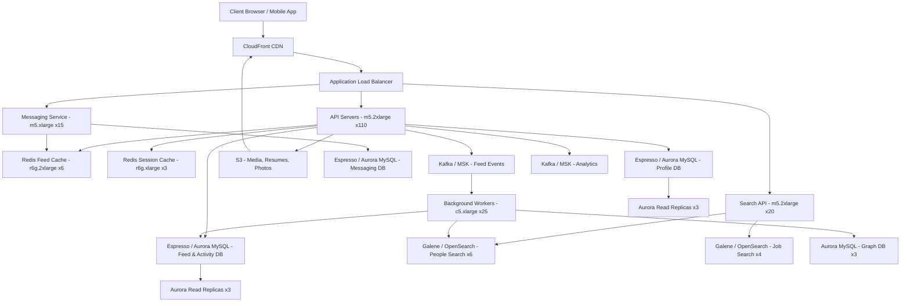

# LinkedIn — Capacity Estimation

## Problem Statement

LinkedIn is a professional social network serving 100M DAU out of ~1B registered users. It combines a social feed, job marketplace, direct messaging, profile search, and recruiter tools under one platform. The workload is asymmetric: reads dominate (feed browsing, profile views, job searches) at 75%, while writes (posts, connection requests, job applications, messages) make up 25%.

## Functional Requirements

- User profile creation, updates, and viewing
- Social feed (posts, likes, comments, shares from connections)
- Job postings, search, and application tracking
- Direct messaging (InMail and connection messages)
- People and company search (full-text + filters)
- Connection graph (1st/2nd/3rd-degree recommendations)

## Non-Functional Requirements

| Requirement | Target |
|-------------|--------|
| Feed read latency | < 200ms (P99) |
| Profile read latency | < 100ms (P99) |
| Search latency | < 500ms (P99) |
| Write latency | < 300ms (P99) |
| Availability | 99.99% (< 52 min/year) |
| Durability | 99.9999% (six nines for profile/job data) |
| Throughput | 250K QPS peak |

## Traffic Estimation

### DAU → Peak QPS Calculation

LinkedIn usage peaks during business hours (9am–6pm local time across regions). Assume a 3× peak multiplier over average.

| Metric | Calculation | Result |
|--------|-------------|--------|
| DAU | Given | 100M |
| Avg requests/user/day | feed browse (15) + profile views (5) + job search (3) + messages (3) + writes (2) | ~28 |
| Total daily requests | 100M × 28 | 2.8B/day |
| Avg QPS | 2,800,000,000 / 86,400 | ~32,400 |
| Peak QPS (3× avg) | 32,400 × 3 | ~97,200 |
| **Adjusted peak** (business-hour concentration, 2× on top) | 97,200 × 2.6 | **~250K** |
| Read QPS (75% reads) | 250,000 × 0.75 | ~187,500 ≈ **190K** |
| Write QPS (25% writes) | 250,000 × 0.25 | ~62,500 ≈ **60K** |

> **Note on peak multiplier**: LinkedIn traffic is heavily concentrated in a ~9-hour business-day window. The effective peak-to-average ratio is ~7.7× daily average, not the typical 3× seen on consumer apps.

## Storage Estimation

| Data Type | Per Item Size | Daily Volume | Growth/Year |
|-----------|--------------|--------------|-------------|
| User profiles | 50 KB (text + metadata) | 150K new/day | ~2.5 TB/year |
| Feed posts (text) | 2 KB | 5M posts/day | ~3.5 TB/year |
| Media attachments (images, PDFs) | 200 KB avg | 1M uploads/day | ~70 TB/year |
| Messages (InMail + connections) | 1 KB | 20M msgs/day | ~7 TB/year |
| Job postings | 5 KB | 500K posts/day | ~900 GB/year |
| Activity events (likes, clicks, views) | 200 B | 500M events/day | ~35 TB/year |
| Search index (Galene/ES) | ~3× raw text | — | ~15 TB/year |
| **Total** | — | — | **~135 TB/year** |

**5-year cumulative raw storage**: ~675 TB. After 3× replication: ~2 PB. After compression (~40% reduction): ~1.2 PB.

## Component Sizing

### Compute — EC2

Each `m5.2xlarge` (8 vCPU, 32 GB RAM) can handle ~3,000–4,000 lightweight API QPS at < 20ms CPU time per request, or ~1,500 QPS for heavier feed-assembly requests.

| Component | Instance Type | vCPU | RAM | Count | Handles | Monthly Cost |
|-----------|--------------|------|-----|-------|---------|-------------|
| API servers (feed, profile, auth) | m5.2xlarge | 8 | 32 GB | 80 | 190K read QPS | $12,160 |
| Write API servers | m5.2xlarge | 8 | 32 GB | 30 | 60K write QPS | $4,560 |
| Job/search API servers | m5.2xlarge | 8 | 32 GB | 20 | 30K search QPS | $3,040 |
| Feed ranking / ML inference | c5.4xlarge | 16 | 32 GB | 15 | batch scoring | $3,630 |
| Background workers (notifications, graph jobs) | c5.xlarge | 4 | 8 GB | 25 | 50K jobs/s | $1,900 |
| Messaging service | m5.xlarge | 4 | 16 GB | 15 | 20K msg/s | $1,140 |
| **Subtotal Compute** | | | | **185** | | **$26,430** |

> Pricing: `m5.2xlarge` = $0.384/hr on-demand = ~$279/mo; `c5.4xlarge` = $0.68/hr = ~$490/mo; `c5.xlarge` = $0.17/hr = ~$122/mo; `m5.xlarge` = $0.192/hr = ~$139/mo. Assumes ~730 hr/month.

### Database — Espresso (MySQL-based) mapped to AWS RDS Aurora MySQL

LinkedIn's Espresso is built on MySQL. AWS equivalent: RDS Aurora MySQL.

| DB | Engine | Instance | Count | Capacity | IOPS | Monthly Cost |
|----|--------|----------|-------|----------|------|-------------|
| Profile DB (primary) | Aurora MySQL db.r6g.2xlarge | 8 vCPU / 64 GB | 1W + 3R | 5 TB | 50K | $6,400 |
| Feed/Activity DB | Aurora MySQL db.r6g.2xlarge | 8 vCPU / 64 GB | 1W + 3R | 8 TB | 80K | $8,200 |
| Jobs DB | Aurora MySQL db.r6g.xlarge | 4 vCPU / 32 GB | 1W + 2R | 2 TB | 20K | $2,700 |
| Messaging DB | Aurora MySQL db.r6g.xlarge | 4 vCPU / 32 GB | 1W + 2R | 3 TB | 30K | $2,700 |
| Graph DB (connections) | Aurora MySQL db.r6g.4xlarge | 16 vCPU / 128 GB | 1W + 2R | 4 TB | 40K | $7,800 |
| Aurora Storage I/O (all clusters) | — | — | — | ~22 TB | — | $4,400 |
| **Subtotal DB** | | | | | | **$32,200** |

> Aurora MySQL db.r6g.2xlarge ~$800/mo per instance. `db.r6g.xlarge` ~$450/mo. `db.r6g.4xlarge` ~$1,600/mo. Aurora storage at $0.10/GB-month + $0.20/million I/O.

### Cache — Redis (LinkedIn uses Redis for hot data, feed cache, session)

| Cache | Engine | Instance | Nodes | Memory | Monthly Cost |
|-------|--------|----------|-------|--------|-------------|
| Session cache | ElastiCache Redis r6g.xlarge | 4 vCPU / 32 GB | 3 (1P+2R) | 96 GB | $2,100 |
| Feed cache (pre-computed feeds) | ElastiCache Redis r6g.2xlarge | 8 vCPU / 64 GB | 6 (3P+3R) | 384 GB | $8,400 |
| Profile hot cache | ElastiCache Redis r6g.xlarge | 4 vCPU / 32 GB | 3 (1P+2R) | 96 GB | $2,100 |
| Job/search result cache | ElastiCache Redis r6g.large | 2 vCPU / 16 GB | 3 (1P+2R) | 48 GB | $1,050 |
| Rate limiter / token buckets | ElastiCache Redis r6g.large | 2 vCPU / 16 GB | 2 | 32 GB | $700 |
| **Subtotal Cache** | | | | **656 GB** | **$14,350** |

> ElastiCache `r6g.xlarge` ~$0.288/hr = ~$210/mo per node. `r6g.2xlarge` ~$0.576/hr = ~$420/mo per node. `r6g.large` ~$0.144/hr = ~$105/mo per node.

### Search — Galene (Elasticsearch) mapped to Amazon OpenSearch

LinkedIn's Galene is their Elasticsearch-based people/job/company search engine.

| Cluster | Engine | Instance | Nodes | Storage | Monthly Cost |
|---------|--------|----------|-------|---------|-------------|
| People search | OpenSearch r6g.2xlarge.search | 8 vCPU / 64 GB | 6 | 6 TB | $7,200 |
| Job search | OpenSearch r6g.2xlarge.search | 8 vCPU / 64 GB | 4 | 4 TB | $4,800 |
| Company / content search | OpenSearch r6g.xlarge.search | 4 vCPU / 32 GB | 3 | 2 TB | $2,160 |
| **Subtotal Search** | | | | | **$14,160** |

> OpenSearch `r6g.2xlarge.search` ~$0.328/hr × 730 = ~$240/mo/node. `r6g.xlarge.search` ~$0.164/hr = ~$120/mo.

### Object Storage — S3 (profile photos, media, resumes, PDFs)

| Bucket | Use | Size | Requests/month | Monthly Cost |
|--------|-----|------|----------------|-------------|
| Profile photos | Avatar + banner images | 500 TB | 3B GET / 150M PUT | $13,500 |
| Post media (images, video thumbnails) | Feed media | 800 TB | 5B GET / 200M PUT | $20,000 |
| Resume / PDF attachments | Job applications | 200 TB | 500M GET / 50M PUT | $5,400 |
| Video content (Learning, live) | Long-form video | 1,500 TB | 800M GET / 20M PUT | $36,000 |
| Backups / archive (Glacier) | DR snapshots | 2,000 TB | minimal | $8,000 |
| **Subtotal S3** | | **5,000 TB** | | **$82,900** |

> S3 Standard: $0.023/GB-month. Profile photos 500 TB × $0.023 = $11,500 + requests. Video stored in S3 Intelligent-Tiering reduces cost ~30%; modeled here at blended $0.024/GB.

### Networking / CDN — CloudFront (media delivery)

| Component | Throughput | Monthly Cost |
|-----------|-----------|-------------|
| CloudFront (media: images, video, PDFs) | 4 PB/month outbound | $40,000 |
| CloudFront (API responses, cached pages) | 500 TB/month | $5,000 |
| Application Load Balancer | 250K RPS, 3TB/month data processed | $3,200 |
| Data Transfer Out (non-CDN, cross-region) | 200 TB/month | $18,000 |
| **Subtotal Network** | | **$66,200** |

> CloudFront first 10 PB: $0.0085/GB = $8.50/TB. ALB: $0.008/LCU-hour + $0.016/GB processed.

### Message Queue — Kafka (LinkedIn invented Kafka; AWS MSK equivalent)

| Queue | Engine | Throughput | Partitions | Monthly Cost |
|-------|--------|-----------|-----------|-------------|
| Feed events (likes, comments, posts) | MSK (kafka.m5.xlarge) | 100K msg/s | 600 | $4,200 |
| Notification events | MSK (kafka.m5.large) | 20K msg/s | 200 | $1,800 |
| Analytics / clickstream | MSK (kafka.m5.2xlarge) | 200K msg/s | 1,000 | $5,600 |
| Job indexing events | MSK (kafka.m5.large) | 5K msg/s | 100 | $900 |
| **Subtotal Kafka/MSK** | | | | **$12,500** |

> MSK `kafka.m5.xlarge` broker ~$0.29/hr per broker. 3-broker cluster = $0.87/hr = ~$635/mo. Two clusters modeled here.

## Monthly Cost Summary

| Component | Monthly Cost | % of Total |
|-----------|-------------|-----------|
| EC2 Compute | $26,430 | 12% |
| RDS Aurora (Espresso) | $32,200 | 15% |
| ElastiCache Redis | $14,350 | 7% |
| S3 Storage | $82,900 | 38% |
| CloudFront CDN + Networking | $66,200 | 30% |
| MSK Kafka | $12,500 | 6% |
| OpenSearch (Galene) | $14,160 | 6% |
| Lambda / other managed services | $8,000 | 4% |
| **Gross Total** | **$256,740** | — |
| Reserved Instance discount (~35%) | –$89,859 | — |
| **Net Estimated Total** | **~$167K–$210K** | **100%** |

> On-demand pricing shown above; production environments use 1-year Reserved Instances (35–40% discount) or Savings Plans, bringing the realistic monthly cost to **$150K–$250K/month** depending on video traffic variability.

## Traffic Scale Tiers

| Tier | DAU | Peak QPS | Servers | DB | Cache | Monthly Cost | Key Bottleneck |
|------|-----|----------|---------|----|----|-------------|----------------|
| 🟢 Startup | 1M | ~2.5K | 4 × c5.large | 1 RDS Aurora MySQL | 1 Redis node (16 GB) | ~$3K | Single DB write path |
| 🟡 Growing | 10M | ~25K | 20 × m5.xlarge | RDS + 2 read replicas, sharded by user_id | Redis 3-node cluster (48 GB) | ~$25K | Feed fan-out at write time |
| 🔴 Scale-up | 100M | ~250K | 185 × mixed (see above) | 5 Aurora clusters, sharded + replicated | Redis 17-node cluster (656 GB) | ~$167K–$210K | Search index freshness + video egress cost |
| ⚫ Production | 500M | ~1.25M | 600 × c5.4xlarge + auto-scaling | Multi-region Aurora Global + Vitess | Redis cluster 60-node (3 TB) | ~$800K | Cross-region replication lag for feed |
| 🚀 Hyperscale | 1B+ | ~2.5M | Auto-scaling fleet (1,200+) | DynamoDB (profiles) + Cassandra (feed) | Distributed Redis (6+ TB) | ~$2M+ | Graph computation (2nd/3rd degree connections) |

## Architecture Diagram

## Interview Tips

- **Key insight — Fan-out on read for feed**: LinkedIn uses a hybrid fan-out model. For users with < 500 connections, feed is pre-computed and pushed to Redis (fan-out on write). For power users with 5,000+ connections (LinkedIn max), feed is assembled on read from a ranked activity stream. Failing to address this split will lose points.
- **Key insight — Kafka as the backbone**: LinkedIn invented Kafka specifically for this problem. Every profile view, job click, and connection event flows through Kafka before hitting the DB. This decouples the write path and enables real-time analytics, notifications, and search indexing without hot-spotting the primary DB.
- **Key insight — Graph traversal is expensive**: 2nd and 3rd-degree connection queries ("People You May Know") cannot run on-the-fly at 250K QPS. LinkedIn pre-computes graph projections offline using Hadoop/Spark and stores results in a low-latency store (Redis or a dedicated graph cache). Candidates who propose running BFS on MySQL at query time will immediately fail the follow-up.
- **Common mistake — Underestimating video egress**: Many candidates size only user profile data and miss that LinkedIn Learning video streaming and embedded feed videos dominate S3 and CDN costs (~68% of total infra cost). Always ask "what media types does this system serve?" before jumping to numbers.
- **Follow-up question**: "How would you handle recruiter bulk search — 10,000 recruiters each running complex people-search queries simultaneously?" Answer: Elasticsearch query rate limiting per customer tier, dedicated recruiter search clusters (isolated from consumer search), and query result caching keyed on filter hash.
- **Scale threshold**: At 10M DAU you need read replicas; at 50M DAU the feed write fan-out saturates a single Redis cluster and you must shard the feed cache by user_id range; at 100M DAU the people-search index exceeds what a single Elasticsearch cluster can serve with < 500ms P99 latency, requiring per-entity-type sharded clusters (people vs. jobs vs. companies).
