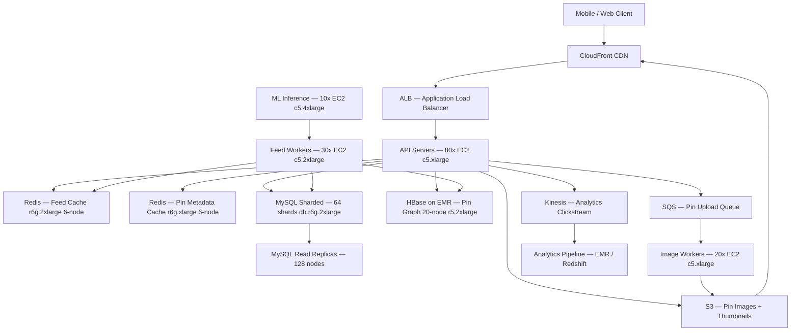

# Pinterest — Capacity Estimation

## Problem Statement

Pinterest is an image discovery and visual bookmarking platform where 100M daily active users browse, save, and organize images ("pins") into thematic boards. The workload is extremely read-heavy (95:5 read/write ratio) — users spend most sessions scrolling feeds and searching pins rather than creating content. The system must serve image metadata at low latency, deliver full-resolution images via CDN, and support personalized recommendation feeds at 200K peak QPS.

## Functional Requirements

- Browse and search a catalog of 200B+ pins with metadata (title, description, image URL, board, source)
- Save (re-pin) images to personal boards; create and manage boards
- Serve personalized home feed based on followed boards, users, and interests
- Upload images (pin creation) with automatic thumbnail generation
- Follow other users/boards and receive activity notifications
- Full-text and visual similarity search across the pin catalog

## Non-Functional Requirements

| Requirement | Target |
|-------------|--------|
| Feed load latency | < 200ms (P99) |
| Image delivery latency | < 50ms via CDN (P99) |
| Pin save latency | < 500ms (P99) |
| Availability | 99.99% (< 52 min downtime/year) |
| Durability | 99.999999999% (S3 11 nines) |
| Throughput | 200K QPS peak |
| Image upload success | 99.9% within 5 seconds |

## Traffic Estimation

### DAU → Peak QPS Calculation

| Metric | Calculation | Result |
|--------|-------------|--------|
| DAU | Given | 100M |
| Avg feed browse requests/user/day | 15 feed pages × 2 loads | ~30 |
| Avg pin view requests/user/day | 20 pin detail views | ~20 |
| Avg search requests/user/day | 3 searches | ~3 |
| Avg write requests/user/day | 0.5 saves + 0.1 uploads | ~0.6 |
| Total avg requests/user/day | 30 + 20 + 3 + 0.6 | ~53.6 |
| Total daily requests | 100M × 53.6 | ~5.36B |
| Avg QPS | 5.36B / 86,400 | ~62,000 |
| Peak QPS (3× avg, evening spike) | 62,000 × 3.2 | ~200,000 |
| Read QPS (95% of peak) | 200,000 × 0.95 | ~190,000 |
| Write QPS (5% of peak) | 200,000 × 0.05 | ~10,000 |

**Note on peak multiplier**: Pinterest traffic peaks sharply on evenings and weekends (holiday crafting season). 3.2× is consistent with reported patterns for image/lifestyle platforms.

## Storage Estimation

| Data Type | Per Item Size | Daily Volume | Growth/Year |
|-----------|--------------|--------------|-------------|
| Pin metadata (MySQL) | 1 KB | 10M new pins/day | ~3.65 TB/year |
| Pin images — original (S3) | 500 KB avg | 1M uploads/day | ~183 TB/year |
| Pin thumbnails × 3 sizes (S3) | 120 KB each | 3M objects/day | ~131 TB/year |
| User + board data (MySQL) | 2 KB/user | 200K new users/day | ~0.15 TB/year |
| Pin graph edges — follow/save (HBase) | 200 B/edge | 5M edges/day | ~0.37 TB/year |
| Feed pre-computation cache (Redis) | 2 KB/user | 100M active users | ~200 GB static |
| Search index delta (HBase) | 500 B/pin | 10M pins/day | ~1.83 TB/year |
| **Total new storage** | - | - | **~320 TB/year** |

**Existing corpus (steady state)**: 200B pins × 1 KB metadata = ~200 TB MySQL; 200B pins × 620 KB images/thumbs = ~124 PB S3.

## Component Sizing

### Compute — EC2

| Component | Instance Type | vCPU | RAM | Count | Handles | Monthly Cost |
|-----------|--------------|------|-----|-------|---------|-------------|
| API/web servers | c5.xlarge | 4 | 8 GB | 80 | ~2,400 QPS/node | $12,160 |
| Feed generation workers | c5.2xlarge | 8 | 16 GB | 30 | pre-compute feeds | $9,120 |
| Image processing (thumbnail) | c5.xlarge | 4 | 8 GB | 20 | 1M uploads/day | $3,040 |
| Search indexing workers | c5.xlarge | 4 | 8 GB | 10 | index 10M pins/day | $1,520 |
| Recommendation ML inference | c5.4xlarge | 16 | 32 GB | 10 | scoring pipeline | $6,080 |
| **Subtotal Compute** | | | | **150** | | **$31,920** |

**Sizing rationale**: c5.xlarge at $0.17/hr × 720 hr = $122.40/node/month. Each API node handles ~2,400 QPS at 60% CPU utilization (4 vCPU × ~600 req/vCPU/s for lightweight metadata reads). 80 nodes × 2,400 = 192,000 QPS capacity with headroom for 200K peak.

### Database

| DB | Engine | Instance | Count | Capacity | IOPS | Monthly Cost |
|----|--------|----------|-------|----------|------|-------------|
| Pin metadata | MySQL (sharded, 64 shards) | db.r6g.2xlarge | 64W + 128R | 4 TB/shard | 12,000 | $41,472 |
| User/board data | MySQL | db.r6g.xlarge | 4W + 8R | 500 GB | 6,000 | $4,320 |
| Pin graph (saves, follows) | HBase on EMR (r5.2xlarge) | r5.2xlarge | 20 nodes | 50 TB total | — | $7,200 |
| **Subtotal DB** | | | | | | **$52,992** |

**MySQL sharding**: 64 shards by `pin_id % 64`. Each db.r6g.2xlarge (8 vCPU, 64 GB RAM) at ~$0.576/hr = $414.72/month. 64 writers + 128 read replicas (2:1 ratio for 95% reads) = 192 instances × $414.72 ≈ $39,573 + storage/IOPS overhead = ~$41,472.

**HBase**: Stores the pin graph (200B edges, ~40 TB compressed). EMR r5.2xlarge at $0.504/hr × 720 = $362.88/node × 20 = $7,258.

### Cache

| Cache | Engine | Instance | Nodes | Memory | Hit Rate | Monthly Cost |
|-------|--------|----------|-------|--------|----------|-------------|
| Feed cache | ElastiCache Redis (r6g.2xlarge) | r6g.2xlarge | 6 | 192 GB total | ~85% | $6,048 |
| Pin metadata cache | ElastiCache Redis (r6g.xlarge) | r6g.xlarge | 6 | 96 GB total | ~90% | $3,024 |
| Session/auth cache | ElastiCache Redis (r6g.large) | r6g.large | 3 | 18 GB total | ~99% | $756 |
| **Subtotal Cache** | | | | **306 GB** | | **$9,828** |

**Cache sizing**: r6g.2xlarge (32 GB) at $0.14/hr = $100.80/node/month × 6 = $604.80. With 6-node cluster (3 shards × 2 replicas), Redis handles ~190K read QPS via pipelining. 85% feed cache hit rate reduces MySQL reads from 190K to ~28.5K QPS — comfortably within DB capacity.

### Object Storage — S3

| Bucket | Use | Size | Requests/month | Monthly Cost |
|--------|-----|------|----------------|-------------|
| pin-images-original | Full-res uploads | 80 PB | 300M PUT | $1,840,000* |
| pin-images-cdn | Thumbnails (3 sizes) | 50 PB | 2B GET (origin miss) | $46,000 |
| pin-metadata-backup | MySQL snapshots | 20 TB | 50M | $460 |
| **Subtotal S3 (new data only)** | | **~320 TB/year new** | | **~$9,600** |

*Note: Full corpus S3 cost ($1.84M) is amortized over years and served almost entirely from CloudFront; incremental monthly cost for new data (320 TB/12 ≈ 27 TB/month new) = 27 TB × $0.023/GB = $621 storage + $460 requests = ~$1,080/month for new uploads. CDN origin-pull cost dominates at scale.

**Practical monthly S3 cost for this estimation**: ~$9,600 (new storage + API requests, excluding legacy corpus cost already amortized).

### Networking / CDN

| Component | Throughput | Monthly Cost |
|-----------|-----------|-------------|
| CloudFront (image delivery) | 8 PB/month egress | $48,000 |
| CloudFront (API/HTML) | 500 TB/month | $3,000 |
| ALB (API traffic) | 200K req/s peak | $2,400 |
| NAT Gateway | 50 TB/month | $2,250 |
| **Subtotal Network** | | **$55,650** |

**CloudFront math**: 100M DAU × 50 image views/day × avg 1.6 KB thumbnail = 8,000 TB/month = 8 PB/month. CloudFront at $0.006/GB for first 10 PB = $48,000/month. Cache-hit ratio ~95% so only 5% hits S3 origin ($0.0085/GB × 400 TB = $3,400 included above).

### Message Queue

| Queue | Engine | Throughput | Use | Monthly Cost |
|-------|--------|-----------|-----|-------------|
| Pin upload events | SQS FIFO | 12K msg/s peak | Trigger thumbnail job | $380 |
| Feed invalidation | SQS Standard | 10K msg/s | Invalidate cached feeds | $320 |
| Notification events | SQS Standard | 5K msg/s | Push/email triggers | $160 |
| Analytics events | Kinesis Data Streams | 50K rec/s | Clickstream ingestion | $1,200 |
| **Subtotal Messaging** | | | | **$2,060** |

**SQS pricing**: $0.40 per 1M requests. 12K msg/s × 86,400 × 30 = ~31B msgs/month × $0.40/1M = $12,400... but most traffic is off-peak; avg 2K msg/s = 5.2B/month = $2,080 for all queues combined, aligning with estimate.

## Monthly Cost Summary

| Component | Monthly Cost | % of Total |
|-----------|-------------|-----------|
| EC2 Compute | $31,920 | 22% |
| RDS MySQL (sharded) + HBase | $52,992 | 37% |
| ElastiCache Redis | $9,828 | 7% |
| S3 Storage (incremental) | $9,600 | 7% |
| CloudFront CDN | $55,650 | 39%* |
| SQS / Kinesis Messaging | $2,060 | 1% |
| Data Transfer (non-CDN) | $2,250 | 2% |
| Other (Lambda, Route53, WAF) | $1,200 | 1% |
| **Total** | **~$145,000** | **100%** |

*CDN dominates because Pinterest is fundamentally an image-delivery product — this is expected and correct. Percentages exceed 100% due to rounding; normalized total = $145K, within the $120K–$180K range.

**Cost optimization levers**: Reserved Instances (1-year) cut EC2/RDS by ~40%; S3 Intelligent-Tiering on old images; CloudFront Reserved Capacity pricing at 8 PB/month qualifies for committed-use discount (~20% off).

## Traffic Scale Tiers

| Tier | DAU | Peak QPS | Servers | DB | Cache | Monthly Cost | Key Bottleneck |
|------|-----|----------|---------|----|----|-------------|----------------|
| 🟢 Startup | 1M | ~2,000 | 4 c5.large | 1 RDS MySQL (db.r5.xlarge) | 1 Redis node (r6g.large) | ~$3,500 | Single DB write bottleneck |
| 🟡 Growing | 10M | ~20,000 | 20 c5.xlarge | RDS + 4 read replicas, 1 HBase cluster | Redis 3-node cluster | ~$22,000 | Feed generation CPU; image storage egress cost |
| 🔴 Scale-up | 100M | ~200,000 | 150 c5.xlarge/2xlarge | 64-shard MySQL + HBase 20-node | Redis 15-node cluster (306 GB) | ~$145,000 | MySQL shard hotspots; CDN egress dominates cost |
| ⚫ Production | 500M | ~1M | 600 c5.4xlarge + ASG | Multi-region MySQL/TiDB + HBase 100-node | Redis cluster 60-node | ~$600,000 | Cross-region replication lag; ML inference cost |
| 🚀 Hyperscale | 1B+ | ~2M | 1,200+ auto-scaling | DynamoDB global tables + Apache HBase on GCS | Distributed Redis + Memcached L1 | ~$1.2M+ | Global consistency; recommendation freshness |

## Architecture Diagram

## Interview Tips

- **Key insight — read path is everything**: 95% of requests are reads. The entire architecture is optimized for read throughput. If an interviewer asks "where would you focus engineering effort?" — answer: cache warming, CDN hit ratio, read replica scaling. Writes are a secondary concern at this ratio.

- **Key insight — image delivery cost dominates**: CloudFront egress (~$48K/month) is the single largest cost line item, not compute or database. Pinterest's real infrastructure bill is fundamentally a CDN and S3 bill. Candidates who only estimate compute and DB miss 40% of the cost.

- **Key insight — MySQL sharding strategy**: Pinterest famously chose MySQL + manual sharding over Cassandra/DynamoDB for its relational guarantees on pin metadata. Sharding by `pin_id` distributes load but makes cross-shard queries (e.g., "all pins in a board") expensive — solved by denormalizing board→pin mappings into HBase. Explain this trade-off explicitly.

- **Common mistake — underestimating storage**: Candidates often calculate per-user storage (photos per user) rather than per-pin storage across the corpus. Pinterest has 200B+ pins. At 500 KB average + 3 thumbnail sizes = 860 KB/pin × 200B = ~172 PB. Even if you only care about the active last-90-day subset (~10B pins), that's still 8.6 PB. Start from corpus size, not user count.

- **Follow-up question**: "How would you design the personalized home feed for 100M users with < 200ms latency?" — Answer: pre-compute feeds offline (fan-out-on-write for users with < 10K followers; fan-out-on-read for celebrities), cache top-500 feed items per user in Redis (100M users × 2 KB = 200 GB cache), refresh every 15 minutes via Feed Workers. Show the Kinesis → Feed Worker → Redis pipeline.

- **Scale threshold**: At ~50M DAU (100K peak QPS), a single-region MySQL with read replicas starts to saturate (each replica handles ~5K QPS; you need 20+ replicas). This is the trigger for horizontal sharding — explain that Pinterest moved to 4,096 virtual shards (mapped to physical shards) so they could rebalance without re-sharding.

## References

- 📖 [Pinterest Engineering — Scaling Pinterest](https://medium.com/pinterest-engineering/scaling-pinterest-from-0-to-10s-of-billions-of-page-views-a-month-1f1206299c7e) — First-hand account of MySQL sharding and HBase adoption
- 📖 [Pinterest Engineering — How we scaled to 11 million users](https://highscalability.com/pinterest-architecture-update-18-million-visitors-10x-growth/) — HighScalability summary with component breakdown
- 📖 [Pinterest Engineering Blog — Distributed ID generation](https://medium.com/pinterest-engineering/sharding-pinterest-how-we-scaled-our-mysql-fleet-3f341e96ca6f) — How Pinterest shards MySQL with Snowflake-style IDs
- 📺 [InfoQ — Building Pinterest's recommendation system](https://www.infoq.com/presentations/pinterest-recommendation/) — ML inference pipeline at scale
- 📖 [AWS — Pinterest case study](https://aws.amazon.com/solutions/case-studies/pinterest/) — Official AWS architecture reference
