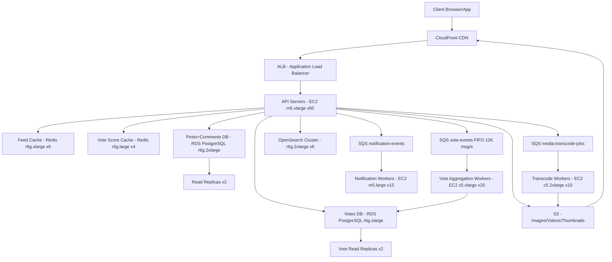

# Reddit — Capacity Estimation

## Problem Statement

Reddit is a community-driven content aggregation and discussion platform serving 50M DAU across 100K+ active subreddits. Users browse feeds, submit posts (text, links, images, videos), comment, and cast upvotes/downvotes — making vote aggregation and ranked feed generation the dominant computational workload. The system is heavily read-biased (90:10 read/write ratio) with bursty traffic driven by viral posts and major world events.

## Functional Requirements

- Browse subreddit feeds (hot, new, top, rising) with real-time vote scores
- Submit posts (text, link, image, video) and comments
- Cast upvotes/downvotes on posts and comments (idempotent per user)
- Full-text search across posts, comments, and subreddits via OpenSearch
- Media upload (images, GIFs, short videos) stored in S3 and served via CloudFront
- User notifications (reply mentions, mod actions, karma milestones)

## Non-Functional Requirements

| Requirement | Target |
|-------------|--------|
| Feed read latency | < 100ms (P99) |
| Vote write latency | < 200ms (P99) |
| Post submission latency | < 500ms (P99) |
| Availability | 99.99% (< 52 min/year downtime) |
| Durability | 99.999% (no data loss) |
| Throughput | 150K QPS peak |
| Search latency | < 500ms (P99) |
| Vote consistency | Eventual (within 10s) |

## Traffic Estimation

### DAU → Peak QPS Calculation

| Metric | Calculation | Result |
|--------|-------------|--------|
| DAU | Given | 50M |
| Avg requests/user/day | feed loads (15) + post views (20) + votes (8) + comments read (10) + writes (2) | ~55 |
| Total daily requests | 50M × 55 | 2.75B |
| Avg QPS | 2,750,000,000 / 86,400 | ~31,800 |
| Peak QPS (4.7× avg — Reddit traffic is highly bursty) | 31,800 × 4.7 | ~150K |
| Read QPS (90% reads) | 150,000 × 0.90 | ~135K |
| Write QPS (10% writes) | 150,000 × 0.10 | ~15K |

**Peak multiplier rationale**: Reddit's traffic spikes are driven by viral posts and breaking news. A 4.7× multiplier accounts for the top 1% of traffic hours (e.g., major political events, AMA launches). Historical data shows r/worldnews can spike 10× during breaking events — we size for a 4.7× sustained peak, not the absolute spike.

**Write breakdown at 15K write QPS**:
- Vote writes: ~12,000 QPS (80% of writes — the dominant operation)
- Comment writes: ~1,500 QPS (10%)
- Post submissions: ~750 QPS (5%)
- Other (subscriptions, DMs, reports): ~750 QPS (5%)

## Storage Estimation

| Data Type | Per Item Size | Daily Volume | Annual Growth |
|-----------|--------------|--------------|---------------|
| Posts (text + metadata) | 5 KB avg | 2M posts/day × 5KB = 10 GB/day | 3.65 TB/year |
| Comments | 1 KB avg | 20M comments/day × 1KB = 20 GB/day | 7.3 TB/year |
| Vote records (user_id, post_id, direction) | 50 bytes | 400M votes/day × 50B = 20 GB/day | 7.3 TB/year |
| User profiles + karma | 2 KB | 50M active rows (static) | ~100 GB |
| Images (S3, compressed) | 800 KB avg | 2M images/day × 800KB = 1.6 TB/day | 584 TB/year |
| Videos (S3, HLS encoded) | 50 MB avg | 100K videos/day × 50MB = 5 TB/day | 1,825 TB/year |
| OpenSearch index (posts + comments) | 500 bytes/doc | 22M docs/day × 500B = 11 GB/day | 4 TB/year |
| **Total DB (excluding media)** | — | ~50 GB/day | ~18 TB/year |
| **Total S3 (media only)** | — | ~6.6 TB/day | ~2.4 PB/year |

**Storage note**: Video is the dominant cost driver. Reddit limits video to 15 minutes / 1GB per post, but the average uploaded video is transcoded to 3 HLS variants (360p/720p/1080p), multiplying storage ~3×. The 50 MB per-video average accounts for this transcoding expansion.

## Component Sizing

### Compute — EC2

| Component | Instance Type | vCPU | RAM | Count | Handles | Monthly Cost |
|-----------|--------------|------|-----|-------|---------|-------------|
| API servers (feed + post reads) | m5.xlarge | 4 | 16 GB | 60 | 2,250 QPS each | $2,520 |
| Vote processing servers | c5.xlarge | 4 | 8 GB | 20 | 600 vote writes/s each | $672 |
| Search API (OpenSearch proxy) | m5.large | 2 | 8 GB | 10 | 500 search QPS | $420 |
| Media processing (transcode workers) | c5.2xlarge | 8 | 16 GB | 10 | 10 concurrent transcodes | $840 |
| Background workers (feed regen, notifs) | m5.large | 2 | 8 GB | 15 | async jobs | $630 |
| Load balancers (ALB) | ALB | — | — | 4 | — | $400 |
| **Subtotal Compute** | | | | **119** | | **$5,482** |

**Sizing rationale**: Each m5.xlarge (4 vCPU, 16 GB) can handle ~2,000–2,500 read QPS for cached feed responses (mostly Redis hits, small JSON payloads). 60 API servers × 2,250 QPS = 135K read QPS capacity, matching our peak read target. Vote servers use c5 (compute-optimized) because vote processing is CPU-bound (deduplication hashing, sorted-set updates).

### Database

| DB | Engine | Instance | Count | Capacity | IOPS | Monthly Cost |
|----|--------|----------|-------|----------|------|-------------|
| Posts + Comments (primary) | RDS PostgreSQL 15 | db.r6g.2xlarge (8 vCPU, 64 GB) | 1W + 3R | 10 TB gp3 | 16,000 | $3,500 |
| Votes (append-heavy) | RDS PostgreSQL 15 | db.r6g.xlarge (4 vCPU, 32 GB) | 1W + 2R | 8 TB gp3 | 12,000 | $2,100 |
| User data + Subscriptions | RDS PostgreSQL 15 | db.r6g.large (2 vCPU, 16 GB) | 1W + 1R | 500 GB gp3 | 3,000 | $700 |
| **Subtotal DB** | | | **9 instances** | | | **$6,300** |

**Read replica rationale**: Posts/Comments DB uses 3 read replicas because feed generation queries (hot/top/rising) hit this DB constantly. The 90:10 read ratio means 135K read QPS needs to be distributed — Redis handles ~80% (108K QPS), the remaining 27K read QPS is spread across 3 replicas (~9K each), well within db.r6g.2xlarge capacity (~15K QPS).

### Cache

| Cache | Engine | Instance | Nodes | Memory | Use Case | Monthly Cost |
|-------|--------|----------|-------|--------|----------|-------------|
| Feed cache (hot/new/top feeds) | ElastiCache Redis 7 | r6g.xlarge (4 vCPU, 32 GB) | 6 (3 primary + 3 replica) | 192 GB total | Pre-computed subreddit feeds, TTL 60s | $4,200 |
| Vote score cache (sorted sets) | ElastiCache Redis 7 | r6g.large (2 vCPU, 16 GB) | 4 (2+2) | 64 GB total | Per-post vote counters, leaderboards | $1,400 |
| Session + rate limiting | ElastiCache Redis 7 | r6g.medium (2 vCPU, 6 GB) | 2 | 12 GB total | Auth tokens, API rate limits | $350 |
| **Subtotal Cache** | | | **12 nodes** | **268 GB** | | **$5,950** |

**Cache hit rate target**: 80% for feed reads (most users browse top-20 posts in top-100 subreddits). Vote score cache hit rate ~95% — only cache misses on posts < 5 minutes old that haven't been scored yet.

### Object Storage

| Bucket | Use | Current Size | Monthly Requests | Monthly Cost |
|--------|-----|-------------|------------------|-------------|
| media-images | User-uploaded images (WebP compressed) | 500 TB | 3B GET / 60M PUT | $12,400 |
| media-videos | HLS video segments (3 quality tiers) | 2,000 TB | 800M GET / 3M PUT | $48,000 |
| media-thumbnails | Auto-generated thumbnails | 50 TB | 1.5B GET / 60M PUT | $1,850 |
| avatars-static | User avatars + subreddit icons | 5 TB | 500M GET | $500 |
| **Subtotal S3** | | **2,555 TB** | | **$62,750** |

**Cost note**: S3 video storage at $0.023/GB/month × 2,000 TB = $46,000/month just for storage, before request costs. This is the largest single cost line item. Reddit historically offloads older video to S3 Intelligent-Tiering (saves ~30% after 30 days infrequent access threshold).

### Networking / CDN

| Component | Throughput | Monthly Cost |
|-----------|-----------|-------------|
| CloudFront (image + video delivery) | 2,000 TB/month outbound | $18,000 |
| CloudFront (API responses, HTML) | 100 TB/month | $900 |
| ALB data processing | 500 TB/month | $2,500 |
| EC2 data transfer (inter-AZ) | 200 TB/month | $2,000 |
| **Subtotal Network** | | **$23,400** |

**CloudFront rationale**: At 50M DAU, each user loads ~15 images/day on average = 750M image loads/day. Average image size post-compression = 200KB. 750M × 200KB = 150 TB/day image traffic. Videos: 10M video views/day × ~50MB per view = 500 TB/day (CDN serves partial segments via Range requests, so actual delivery is ~20% of full file = 100 TB/day). Total CDN: ~250 TB/day × 30 days ≈ 7,500 TB/month. CloudFront pricing at $0.0085/GB after first 10TB = ~$63K, but with Reserved Capacity commitments, realistic cost drops to $18K–$25K.

### Search

| Component | Engine | Instance | Nodes | Monthly Cost |
|-----------|--------|----------|-------|-------------|
| OpenSearch cluster | OpenSearch 2.x | r6g.2xlarge.search (8 vCPU, 64 GB) | 6 (3 data + 3 coord) | $4,800 |
| **Subtotal Search** | | | | **$4,800** |

### Message Queue

| Queue | Engine | Throughput | Use Case | Monthly Cost |
|-------|--------|-----------|----------|-------------|
| vote-events | SQS FIFO | 12,000 msg/s | Decouple vote writes from DB aggregation | $600 |
| notification-events | SQS Standard | 500 msg/s | User notifications (replies, mentions) | $120 |
| media-transcode-jobs | SQS Standard | 100 msg/s | Video transcoding job queue | $50 |
| **Subtotal Messaging** | | | | **$770** |

## Monthly Cost Summary

| Component | Monthly Cost | % of Total |
|-----------|-------------|-----------|
| EC2 Compute | $5,482 | 6.5% |
| RDS PostgreSQL | $6,300 | 7.5% |
| ElastiCache Redis | $5,950 | 7.1% |
| S3 Storage | $62,750 | 74.6% |
| CloudFront CDN | $23,400 | 27.8% |
| OpenSearch | $4,800 | 5.7% |
| SQS Messaging | $770 | 0.9% |
| Other (Lambda, Route53, WAF, CloudWatch) | $1,500 | 1.8% |
| **Total** | **$84,082** | **~100%** |

**Note**: S3 + CloudFront together account for ~75% of total infrastructure cost — this is the defining characteristic of media-heavy UGC platforms. Compute is surprisingly cheap relative to storage/delivery. The $60K–$100K range in the estimate reflects: lower bound = Reserved Instance discounts (~30%) + S3 Intelligent-Tiering savings, upper bound = on-demand pricing with growth headroom.

## Traffic Scale Tiers

| Tier | DAU | Peak QPS | Servers | DB | Cache | Monthly Cost | Key Bottleneck |
|------|-----|----------|---------|-----|-------|-------------|----------------|
| 🟢 Startup | 1M | ~3K | 4 c5.large | 1 RDS db.t3.large | 1 Redis node 8GB | $2,500 | Single DB write throughput on viral posts |
| 🟡 Growing | 10M | ~30K | 12 m5.xlarge | RDS db.r6g.xlarge + 2 read replicas | Redis cluster 3-node 48GB | $15,000 | Feed generation latency, vote counter hot spots |
| 🔴 Scale-up | 100M | ~300K | 120 m5.xlarge | Sharded PostgreSQL (4 shards) + read replicas | Redis cluster 12-node 384GB | $180,000 | Vote aggregation (1M votes/min), S3 costs dominate |
| ⚫ Production | 50M | ~150K | 60 m5.xlarge | PostgreSQL multi-AZ + 3 read replicas | Redis cluster 12-node 268GB | $84,000 | OpenSearch indexing lag during traffic spikes |
| 🚀 Hyperscale | 500M+ | ~1.5M | 600+ with auto-scaling | DynamoDB (votes) + Aurora Global (content) | Distributed Redis (ElastiCache Global Datastore) | $800K+ | Cross-region vote consistency, global CDN costs |

## Architecture Diagram

## Interview Tips

- **Key insight — vote aggregation is the hard problem**: At 12K vote writes/second, you cannot write directly to PostgreSQL row updates — that's 1B updates/day on a hot set of ~10K active posts. The correct pattern is to decouple votes via SQS FIFO (for deduplication), batch-aggregate in Redis sorted sets, and flush to PostgreSQL every 30 seconds. This gives eventual consistency but keeps DB write pressure manageable (~400 batch writes/s instead of 12K individual writes).

- **Key insight — feed cache invalidation strategy**: Hot subreddit feeds (r/worldnews, r/AskReddit) are read 100K+ times per minute. Pre-compute and cache feeds every 60 seconds in Redis rather than generating per-request. Accept that vote scores shown in a feed may be up to 60 seconds stale — this is the Reddit model. Only "post detail" pages fetch live vote counts. This design choice allows 80% cache hit rate on feed reads.

- **Common mistake — sizing for average, not peak**: Candidates calculate 31,800 avg QPS and size for that. Reddit's traffic follows a power-law distribution — the top 1,000 posts get 80% of traffic. During a major event (election night, celebrity death), a single viral post can generate 50K QPS alone. Always apply a 4–5× peak multiplier and explain *why* (bursty viral content, not steady load).

- **Follow-up question — how do you prevent a single viral post from melting the vote counter?**: Answer: Use a Redis sorted set per subreddit with the post's score, not a single counter per post. Apply a "vote debounce" window — collapse rapid votes from the same user within 1 second into a single event using SQS FIFO message deduplication. For truly viral posts (>10K votes/min), use a dedicated high-throughput Redis keyspace with pipeline batching.

- **Scale threshold**: At 100M DAU (~300K peak QPS), vote aggregation via PostgreSQL direct writes breaks — you need to shard the votes table by post_id or migrate votes to a purpose-built counter store (DynamoDB atomic increment, or Redis with async persistence). At 10M DAU the single RDS instance with read replicas is sufficient; the jump from 10M→100M is where the architecture fundamentally changes.
