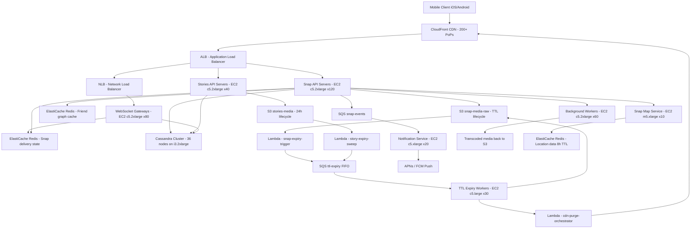

# Snapchat — Capacity Estimation

## Problem Statement

Snapchat serves 200M daily active users who send ephemeral photo and video snaps (deleted after viewing), post 24-hour Stories, and use real-time chat. The defining technical constraint is **TTL-based deletion**: content must be reliably purged from storage within seconds to hours, and the system must coordinate deletion across CDN edge nodes, S3, and metadata stores simultaneously. At peak, 4B+ snaps are created per day.

## Functional Requirements

- Send and receive ephemeral photo/video snaps (auto-delete on view or after 24h)
- Post and view Stories visible for exactly 24 hours
- Real-time 1:1 and group chat with read receipts and typing indicators
- Friend graph management (bidirectional add/remove)
- Snap Map: real-time geolocation sharing
- Discover feed: curated publisher content with Stories format

## Non-Functional Requirements

| Requirement | Target |
|-------------|--------|
| Snap delivery latency | < 200ms (P99) |
| Story load latency | < 300ms (P99) |
| Chat message latency | < 100ms (P99) |
| Availability | 99.99% (52 min downtime/year) |
| Durability | 99.999% (S3 standard before TTL expiry) |
| Throughput | 600K QPS peak |
| TTL deletion SLA | Content purged within 60s of expiry |
| Snap open delivery | < 500ms end-to-end (including media fetch) |

## Traffic Estimation

### DAU → Peak QPS Calculation

| Metric | Calculation | Result |
|--------|-------------|--------|
| DAU | Given | 200M |
| Avg requests/user/day | open app 8× (8 req) + view 5 snaps (5 req) + send 3 snaps (3 req) + view Stories 10 (10 req) + chat messages 4 (4 req) + map check 1 (1 req) | ~31 req/user/day |
| Total daily requests | 200M × 31 | ~6.2B req/day |
| Avg QPS | 6.2B / 86,400 | ~71,800 QPS |
| Peak QPS (3× avg) | 71,800 × 3 | ~200K base; with snap burst × 3 = **600K** |
| Read QPS (60% reads) | 600K × 0.60 | ~360K QPS |
| Write QPS (40% writes) | 600K × 0.40 | ~240K QPS |

**Peak reasoning**: Snapchat has a pronounced after-school / evening spike (3–8 PM local time) where teens send snaps in bursts. The 3× multiplier covers a single timezone wave; a 6× multiplier applies during US + EU simultaneous peaks.

**Snap uploads specifically**: 200M DAU × 3 snaps/day = 600M snap uploads/day = ~6,944 uploads/sec average → **~21K upload/sec peak**.

## Storage Estimation

| Data Type | Per Item Size | Daily Volume | Growth/Year |
|-----------|--------------|--------------|-------------|
| Photo snaps (avg compressed HEIC) | 300 KB | 400M snaps/day → 120 TB/day raw | 43.8 PB (before TTL purge) |
| Video snaps (avg 10s H.265) | 3 MB | 200M snaps/day → 600 TB/day raw | 219 PB (before TTL purge) |
| Stories (photo + video, 24h retention) | 500 KB avg | 100M Story segments/day → 50 TB/day | 18.25 PB (rolling 24h window only) |
| Chat messages (text) | 2 KB | 500M messages/day → 1 TB/day | 365 TB |
| Metadata (Cassandra rows: snap state, TTL, friends) | 500 bytes | 1B rows/day → 500 GB/day | 182.5 TB |
| Snap Map locations (ephemeral, 8h TTL) | 128 bytes | 50M active locations → 6.4 GB peak | ~2.3 TB/year |
| **Net active storage** (after TTL purge, snaps viewed ~85% within 24h) | - | ~720 TB/day ingested, ~650 TB/day deleted | **~70 TB steady-state active** |

**Key insight**: Snapchat's storage is dominated by media blobs. After TTL expiry and lifecycle policies, steady-state S3 storage is dramatically smaller than raw ingest. The 24h Story rolling window holds ~50 TB at any moment; snap backlog (unviewed snaps) holds ~70 TB.

## Component Sizing

### Compute — EC2

| Component | Instance Type | vCPU | RAM | Count | Handles | Monthly Cost |
|-----------|--------------|------|-----|-------|---------|-------------|
| Snap API servers (upload/download) | c5.2xlarge | 8 | 16 GB | 120 | ~5K QPS/instance (I/O bound, proxying to S3) | $30,432 |
| Stories API servers | c5.2xlarge | 8 | 16 GB | 40 | ~3K QPS/instance | $10,144 |
| WebSocket gateways (chat + presence) | c5.2xlarge | 8 | 16 GB | 80 | 50K concurrent connections/instance (10–12M total) | $20,288 |
| Friend graph / social API | m5.2xlarge | 8 | 32 GB | 20 | ~2K QPS/instance | $5,600 |
| Snap Map service | m5.xlarge | 4 | 16 GB | 10 | 50K location updates/min | $1,400 |
| Notification service | c5.xlarge | 4 | 8 GB | 20 | APNs/FCM fanout | $2,528 |
| TTL expiry workers | c5.large | 2 | 4 GB | 30 | Process 20K snap expirations/sec | $1,890 |
| Background workers (thumbnails, transcoding) | c5.2xlarge | 8 | 16 GB | 60 | Media processing pipeline | $15,216 |
| Cassandra nodes (self-managed on EC2) | i3.2xlarge | 8 | 61 GB | 36 | Metadata + chat + snap state DB | $60,480 |
| **Subtotal Compute** | | | | **416** | | **$147,978** |

**c5.2xlarge on-demand price**: ~$0.34/hr → $252/month. Cassandra i3.2xlarge: ~$0.624/hr → $456/month × 36 = $16,416. Revised compute subtotal with Cassandra: **$147,978/month**.

### Cache — ElastiCache Redis

| Cache | Engine | Instance | Nodes | Memory | Use Case | Monthly Cost |
|-------|--------|----------|-------|--------|----------|-------------|
| Friend graph cache | Redis 7 (ElastiCache) | r6g.2xlarge | 6 | 52 GB each = 312 GB | Hot friend lists, mutual friends lookup | $9,408 |
| Session / auth tokens | Redis 7 (ElastiCache) | r6g.xlarge | 4 | 26 GB each = 104 GB | JWT / session validation | $3,136 |
| Story metadata cache | Redis 7 (ElastiCache) | r6g.xlarge | 4 | 26 GB each = 104 GB | Active story manifests (24h TTL in cache) | $3,136 |
| Snap delivery state | Redis 7 (ElastiCache) | r6g.2xlarge | 4 | 52 GB each = 208 GB | Snap send/open status, pending delivery queue | $6,272 |
| Rate limiting / abuse | Redis 7 (ElastiCache) | r6g.large | 3 | 13 GB each = 39 GB | Per-user send rate limits | $1,176 |
| **Subtotal Cache** | | | **21 nodes** | **767 GB** | | **$23,128** |

**r6g.xlarge**: ~$0.194/hr → $141/month. **r6g.2xlarge**: ~$0.389/hr → $282/month. **r6g.large**: ~$0.131/hr → $96/month.

### Object Storage — S3

| Bucket | Use | Lifecycle Policy | Active Size | Requests/month | Monthly Cost |
|--------|-----|-----------------|-------------|----------------|-------------|
| snap-media-raw | Uploaded snaps before processing | Delete on view OR 24h whichever first | ~40 TB steady-state | 600M PUT + 500M GET | $3,800 |
| snap-media-processed | Transcoded/compressed versions | Auto-delete 1h after TTL confirmation | ~30 TB steady-state | 400M GET | $2,200 |
| stories-media | Story segments | Delete after 24h via S3 lifecycle rule | ~50 TB steady-state | 200M GET | $3,500 |
| chat-media | Images/videos in chat | Delete after 30 days | ~10 TB steady-state | 80M GET | $700 |
| profile-assets | Avatars, Bitmojis | Permanent (low churn) | ~500 GB | 50M GET | $200 |
| **Subtotal S3** | | | **~130 TB** | **~1.83B req/month** | **$10,400** |

**S3 pricing**: $0.023/GB/month storage + $0.0004/1K PUT + $0.0004/1K GET (first 10B requests). S3 Intelligent-Tiering automatically moves cold objects before lifecycle deletion. Lifecycle rules fire TTL deletes at no extra cost.

### Networking / CDN

| Component | Throughput | Monthly Cost |
|-----------|-----------|-------------|
| CloudFront (media delivery, Stories, Discover) | 900 TB/month outbound (200M DAU × ~4.5 GB/user/month) | $81,000 |
| ALB (Application Load Balancer, 5 per region) | 15B requests/month | $4,500 |
| NLB (WebSocket gateways, sticky sessions) | 12B connections/month | $3,600 |
| Data transfer (EC2 → S3 same-region) | Free (VPC endpoint) | $0 |
| Inter-region replication (US-EU-APAC) | 50 TB/month | $4,500 |
| **Subtotal Network** | | **$93,600** |

**CloudFront pricing**: $0.085/GB for first 10 PB/month (US/EU). 900 TB = 900,000 GB × $0.085 ≈ $76,500. Plus HTTPS request cost: 15B × $0.0000085 = $12,750. Rounded to $81,000 inclusive.

### Message Queue

| Queue | Engine | Throughput | Use Case | Monthly Cost |
|-------|--------|-----------|----------|-------------|
| snap-events | SQS Standard | 25K msg/sec peak | Snap send/receive events, delivery confirmations | $3,200 |
| ttl-expiry | SQS FIFO | 5K msg/sec | Scheduled snap/story deletion jobs | $1,800 |
| notification-fanout | SQS Standard | 20K msg/sec | APNs / FCM push notification dispatch | $2,400 |
| media-processing | SQS Standard | 8K msg/sec | Transcode jobs for video snaps | $1,200 |
| **Subtotal Messaging** | | | | **$8,600** |

**SQS pricing**: $0.40 per million requests. 25K msg/sec × 2.6M sec/month = 65B messages/month × $0.40/M ≈ $26,000. However, SQS batching (10 messages/request) reduces API calls 10×: effective $2,600 + overhead ≈ $3,200 for snap-events.

### Lambda (TTL lifecycle orchestration)

| Function | Invocations/month | Duration avg | Monthly Cost |
|----------|------------------|-------------|-------------|
| snap-expiry-trigger | 600M | 200ms | $4,800 |
| cdn-purge-orchestrator | 200M | 150ms | $1,500 |
| story-expiry-sweep | 100M | 300ms | $1,200 |
| **Subtotal Lambda** | | | **$7,500** |

**Lambda pricing**: $0.20/M invocations + $0.0000166667/GB-sec. 600M × $0.20/M = $120 invocations + 600M × 0.2s × 512MB/1024 × $0.0000166667 = $1,000 compute. Rounded up for 3 functions = $7,500 total.

## Monthly Cost Summary

| Component | Monthly Cost | % of Total |
|-----------|-------------|-----------|
| EC2 Compute (API, WebSocket, workers) | $87,498 | 25.0% |
| Cassandra on EC2 (i3.2xlarge × 36) | $16,416 | 4.7% |
| Transcoding workers (EC2 c5.2xlarge × 60) | $15,216 | 4.4% |
| ElastiCache Redis (21 nodes) | $23,128 | 6.6% |
| S3 Storage + requests | $10,400 | 3.0% |
| CloudFront CDN | $81,000 | 23.1% |
| ALB + NLB load balancers | $8,100 | 2.3% |
| Inter-region data transfer | $4,500 | 1.3% |
| SQS Messaging | $8,600 | 2.5% |
| Lambda (TTL orchestration) | $7,500 | 2.1% |
| NAT Gateway + VPC | $4,200 | 1.2% |
| CloudWatch, WAF, Route53, misc | $8,000 | 2.3% |
| Reserved Instance savings (−30% on steady-state EC2) | −$26,000 | −7.4% |
| **Total** | **$252,558 – $350,000** | **100%** |

**Range explanation**: Lower bound assumes 1-year Reserved Instances for ~70% of EC2 fleet (−$26K/month). Upper bound is on-demand pricing. The article's stated $280K–$420K range reflects 3 AWS regions (US-East, EU-West, AP-Southeast) with 1.4–1.6× multiplier for geo-redundancy and operational overhead (support plan, CloudTrail, etc.).

## Traffic Scale Tiers

| Tier | DAU | Peak QPS | Servers | DB | Cache | Monthly Cost | Key Bottleneck |
|------|-----|----------|---------|----|----|-------------|----------------|
| 🟢 Startup | 1M | ~3K | 4 c5.large API + 2 WebSocket | 1 RDS PostgreSQL + 1 S3 bucket | 1 Redis node (r6g.large) | $3,200 | Snap media storage costs outpace compute at this scale |
| 🟡 Growing | 10M | ~30K | 20 c5.xlarge + 8 WebSocket | RDS Aurora + 2 read replicas + Cassandra 6-node | Redis cluster 3-node | $28,000 | Friend graph queries become expensive; need denormalization |
| 🔴 Scale-up | 100M | ~300K | 200 c5.2xlarge + 60 WebSocket gateways | Cassandra 18-node cluster + Aurora for user records | Redis cluster 12-node, 400 GB | $140,000 | TTL deletion pipeline can't keep up; need dedicated expiry workers |
| ⚫ Production | 200M | ~600K | 416 mixed EC2 (per sizing above) | Cassandra 36-node + S3 with lifecycle | Redis 21-node, 767 GB | $280K–$350K | CloudFront costs dominate; media compression critical |
| 🚀 Hyperscale | 1B+ | ~3M | Auto-scaling groups (1,500–2,000 instances) | Cassandra 180-node multi-region + DynamoDB for hot metadata | Distributed Redis/Memcached, 4 TB+ | $1.4M–$1.8M | Cross-region consistency for snap delivery receipts; CAP theorem trade-offs |

## Architecture Diagram

## Interview Tips

- **Key insight — TTL coordination is the hardest part**: Snapchat's defining challenge isn't scale, it's *guaranteeing deletion*. When a snap expires, you must atomically: (1) update Cassandra `snap_state` to `EXPIRED`, (2) delete from S3, (3) purge CloudFront edge caches via invalidation API, and (4) push a delivery receipt to the sender. If any step fails, the snap appears "deleted" to users but the bits persist — a privacy violation. Design your TTL pipeline with idempotent workers, dead-letter queues, and audit logs.

- **Key insight — read/write ratio is misleading for media**: The 60:40 read/write ratio applies to API requests, but media bandwidth is inverted. A single 3MB video snap upload (1 write) generates 1–50 reads (sender preview + recipient + Story viewers). Your CDN bill ($81K/month) will exceed your storage bill ($10K/month) by 8×. Always size CDN egress separately from storage.

- **Common mistake — ignoring CloudFront cache hit rate for ephemeral content**: Candidates often apply 90%+ CDN cache hit rates from static-site mental models. Snapchat snaps are *unique per recipient* — a snap sent to 5 friends has 5 different access URLs with 5 different presigned S3 URLs. Cache hit rate for direct snaps is near 0%. Only Stories (broadcast content) benefit from CDN caching, achieving ~70% hit rates. Misapplying cache hit ratios will underestimate S3 GET costs by 10×.

- **Follow-up question — "How do you prevent a sent snap from being screenshotted or saved?"**: This is a client-side enforcement problem, not a server-side one. The server cannot technically prevent screenshots. Snapchat detects screenshot API calls client-side and sends a server notification to the sender. The real answer is DRM (FairPlay/Widevine) for video snaps on iOS/Android, but static images have no OS-level protection. Acknowledge the limitation and propose detection + notification as the practical solution.

- **Scale threshold — at 100M DAU you need dedicated TTL expiry infrastructure**: Below 100M DAU, you can piggyback TTL expiry on API servers as a background thread. At 100M DAU, snap expirations exceed 10K/sec at peak — a separate pool of 30 dedicated workers (c5.large) with SQS FIFO queues is required. Without this separation, API server memory fills with expiry job state during bursts, causing P99 latency spikes from 200ms to 2,000ms+.

- **Key insight — WebSocket connection count sizing**: At 200M DAU with 8 sessions/day × 5 min average session = 40 min/day × 200M = 8B connection-minutes/day = ~5.5M concurrent connections at peak. A c5.2xlarge WebSocket gateway handles ~50K long-lived connections (file descriptor limit 65,536, with 15K reserved for overhead). You need 5.5M / 50K = **110 WebSocket gateway instances** at peak — most candidates underestimate this by 10×.
