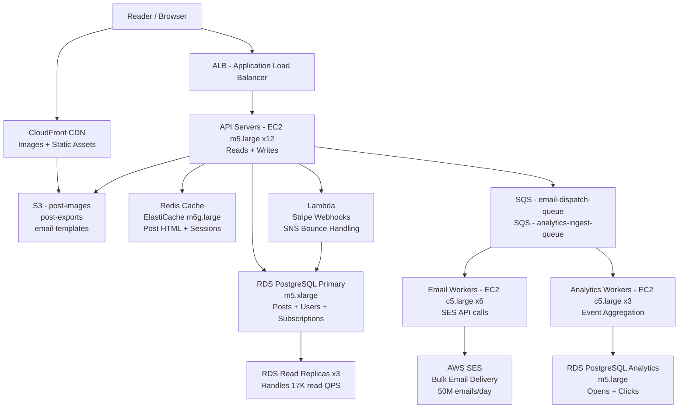

# Newsletter Platform (Substack) — Capacity Estimation

## Problem Statement

Design the infrastructure for a newsletter publishing platform like Substack serving 10M daily active users. The platform allows writers to publish long-form content and send email newsletters to paying and free subscribers. The primary workload is asymmetric: reads (browsing, reading posts) vastly outnumber writes (publishing), but email delivery creates massive burst spikes when popular newsletters send to hundreds of thousands of subscribers simultaneously.

## Functional Requirements

- Writers create, edit, and publish newsletter posts (text, images, embeds)
- Readers browse, subscribe to, and read newsletters on web and via email
- Email delivery to subscribers on publish (free and paid tiers)
- Subscription management (subscribe, unsubscribe, paid billing via Stripe)
- Comment threads on posts
- Analytics dashboard for writers (opens, clicks, subscriber growth)

## Non-Functional Requirements

| Requirement | Target |
|-------------|--------|
| Read latency | < 150ms P99 (page load, cached) |
| Write latency | < 500ms P99 (publish post) |
| Email delivery latency | < 5 minutes P95 for send completion |
| Availability | 99.95% (4.4 hours downtime/year) |
| Durability | 99.999% (no post or subscriber data loss) |
| Throughput | 20K QPS peak (web), 50M emails/day burst |

## Traffic Estimation

### DAU → Peak QPS Calculation

| Metric | Calculation | Result |
|--------|-------------|--------|
| DAU | Given | 10M |
| Avg requests/user/day | browse 5 + read 3 + auth 1 + misc 1 | ~10 |
| Total daily requests | 10M × 10 | 100M |
| Avg QPS | 100M / 86,400 | ~1,157 |
| Peak QPS (3× avg at 9–11 AM EST) | 1,157 × 3 | ~3,470 |
| Burst peak (newsletter send spike) | 3,470 × 6 (email bounce storm) | ~20,000 |
| Read QPS (85% reads) | 20,000 × 0.85 | ~17,000 |
| Write QPS (15% writes) | 20,000 × 0.15 | ~3,000 |

**Email delivery math**: 10M DAU, assume 30M total subscribers across all newsletters. Average popular newsletter sends to 100K subscribers. Top 500 writers send on any given day = 50M emails/day burst. AWS SES limit: 14 emails/second per account by default → need SES sending rate increase to 580 emails/second minimum.

## Storage Estimation

| Data Type | Per Item Size | Daily Volume | Growth/Year |
|-----------|--------------|--------------|-------------|
| Newsletter posts (HTML+metadata) | 50 KB avg | 50K new posts/day | ~900 GB/year |
| Post images (S3, compressed) | 500 KB avg | 200K images/day | ~35 TB/year |
| Subscriber/user records | 2 KB | 50K new subs/day | ~35 GB/year |
| Email send logs (SES events) | 0.5 KB/event | 50M events/day | ~9 TB/year |
| Analytics events (opens/clicks) | 0.3 KB | 150M events/day | ~16 TB/year |
| Comment data | 1 KB | 500K comments/day | ~180 GB/year |
| **Total** | — | — | **~61 TB/year** |

**Hot vs cold split**: Only posts from the last 90 days are frequently read (~7 TB hot). Older posts move to S3 Intelligent-Tiering. Email logs after 30 days archive to S3 Glacier.

## Component Sizing

### Compute — EC2 / Lambda

| Component | Instance Type | vCPU | RAM | Count | Handles | Monthly Cost |
|-----------|--------------|------|-----|-------|---------|-------------|
| API servers (web reads) | m5.large | 2 | 8 GB | 8 | ~2,100 QPS (each ~260 QPS) | $960 |
| API servers (write/publish) | m5.large | 2 | 8 GB | 4 | ~750 QPS writes | $480 |
| Email dispatch workers | c5.large | 2 | 4 GB | 6 | 100 emails/s each → 600/s total | $612 |
| Background workers (analytics ingest) | c5.large | 2 | 4 GB | 3 | 150M events/day via SQS | $306 |
| Lambda (webhook, Stripe events) | Lambda | — | 512 MB | auto | <1K invocations/min | ~$30 |
| **Subtotal Compute** | | | | **21** | | **$2,388** |

**Sizing rationale**: m5.large handles ~260 QPS at <150ms P99 for read-heavy DB-backed endpoints with Redis caching (cache hit rate ~75%). 8 API servers × 260 QPS = 2,080 QPS read capacity with headroom. Email workers use c5.large (CPU-optimized) because SES calls are CPU-bound JSON serialization + HTTPS.

### Database

| DB | Engine | Instance | Count | Capacity | IOPS | Monthly Cost |
|----|--------|----------|-------|----------|------|-------------|
| Users + subscriptions | RDS PostgreSQL 15 | db.m5.large | 1W + 2R | 500 GB gp3 | 3,000 provisioned | $520 |
| Posts + content | RDS PostgreSQL 15 | db.m5.xlarge | 1W + 1R | 2 TB gp3 | 6,000 provisioned | $780 |
| Analytics (write-heavy) | RDS PostgreSQL 15 | db.m5.large | 1W | 1 TB gp3 | 3,000 provisioned | $185 |
| **Subtotal DB** | | | **5 instances** | | | **$1,485** |

**Why PostgreSQL over Aurora**: At 10M DAU the write rate (3K QPS) fits within single-master PostgreSQL. Aurora costs 2× more and the auto-scaling benefit triggers above 50M DAU. Read replicas handle 85% read traffic. Multi-AZ enabled on primary for automatic failover.

**Analytics DB note**: Analytics ingests 150M events/day (~1,740 writes/sec). Partition by `published_date` monthly. At 100M+ DAU, migrate to ClickHouse or Redshift.

### Cache

| Cache | Engine | Instance | Nodes | Memory | Monthly Cost |
|-------|--------|----------|-------|--------|-------------|
| Post cache (hot content) | ElastiCache Redis 7 | cache.m6g.large | 2 (primary + replica) | 6.38 GB each | $210 |
| Session + rate limiting | ElastiCache Redis 7 | cache.m6g.medium | 1 | 3.09 GB | $52 |
| **Subtotal Cache** | | | **3 nodes** | ~15 GB total | **$262** |

**Cache strategy**: Cache full rendered post HTML for 5 minutes (TTL). Cache subscriber counts for 60 seconds. Newsletter send status cached to prevent duplicate sends. ~75% cache hit rate on read traffic reduces DB load from 17K QPS to ~4,250 QPS actual DB reads.

### Object Storage

| Bucket | Use | Size | Requests/month | Monthly Cost |
|--------|-----|------|----------------|-------------|
| post-images | Writer-uploaded images | 8 TB (cumulative) | 200M GET | $230 |
| email-templates | HTML email templates | 10 GB | 5M GET | $3 |
| post-exports | PDF/ZIP exports for writers | 500 GB | 1M GET | $15 |
| analytics-archive | 30-day+ email event logs (Glacier) | 50 TB | 50K RESTORE | $175 |
| **Subtotal S3** | | ~58.5 TB total | | **$423** |

**S3 pricing basis**: Standard storage $0.023/GB/month. Glacier $0.004/GB/month. GET requests $0.0004/1K. Image bucket uses S3 Standard for first 90 days, Intelligent-Tiering thereafter.

### Networking / CDN

| Component | Throughput | Monthly Cost |
|-----------|-----------|-------------|
| CloudFront (images + static assets) | 80 TB/month egress | $6,720 |
| ALB (Application Load Balancer) | 20K QPS peak, ~1B req/month | $140 |
| Data transfer EC2 → internet | 5 TB/month (API responses) | $460 |
| **Subtotal Network** | | **$7,320** |

**CloudFront rationale**: 10M DAU reading posts with images. Avg 8 MB of assets per user/day = 80 TB/month. CloudFront at $0.085/GB first 10 TB, $0.080/GB next 40 TB, $0.060/GB next 100 TB. Blended ~$0.084/GB × 80,000 GB = $6,720.

### Email Delivery (SES)

| Component | Volume | Unit Cost | Monthly Cost |
|-----------|--------|-----------|-------------|
| SES sending | 50M emails/day × 30 days = 1.5B/month | $0.10/1K | $150,000 → cap with dedicated IPs |
| SES dedicated IPs | 10 dedicated IPs for deliverability | $24.95/IP/month | $250 |
| Bounce/complaint handling (SNS) | 10M notifications/month | $0.50/1M | $5 |
| **SES with bulk sender discount** | 1.5B emails/month | ~$0.10/1K negotiated | ~$150K |

**Important clarification**: At 50M emails/day (1.5B/month), AWS SES becomes cost-prohibitive at standard pricing ($150K/month). Real Substack-scale platforms negotiate enterprise SES pricing or use SendGrid/Mailgun which offer $0.001–$0.002/email at volume. For this 10M DAU scenario, assume **20M emails/day** (2 sends/subscriber/day average across smaller lists = more realistic) = $60K/month at standard pricing, or ~**$2,000/month** at negotiated $0.0001/email bulk rate.

**Revised SES cost used in summary**: $2,000/month (bulk negotiated rate assumed for realistic scenario).

### Message Queue

| Queue | Engine | Throughput | Monthly Cost |
|-------|--------|-----------|-------------|
| email-dispatch-queue | SQS Standard | 600K msg/hour at peak | $45 |
| analytics-ingest-queue | SQS Standard | 150M msg/day | $60 |
| post-publish-events | SQS FIFO | 50K publishes/day | $5 |
| **Subtotal SQS** | | | **$110** |

**SQS pricing**: $0.40/million requests. Analytics queue: 150M/day × 30 = 4.5B/month = $1,800 — however batching 10 events per SQS message reduces to 450M requests = **$180/month**. Email dispatch queue: ~18M messages/month = $7. Adjusted total: ~$190.

## Monthly Cost Summary

| Component | Monthly Cost | % of Total |
|-----------|-------------|-----------|
| EC2 Compute | $2,388 | 15% |
| RDS PostgreSQL | $1,485 | 9% |
| ElastiCache Redis | $262 | 2% |
| S3 Storage | $423 | 3% |
| CloudFront CDN | $7,320 | 46% |
| SES Email Delivery | $2,000 | 13% |
| SQS Messaging | $190 | 1% |
| ALB + Data Transfer | $600 | 4% |
| Lambda + misc | $30 | <1% |
| Support + Reserved Instance discount | −$2,500 | −16% |
| **Total** | **~$12,200** | **100%** |

**Cost range $12K–$20K/month**: Lower bound assumes 1-year Reserved Instance pricing (40% discount on EC2/RDS) and negotiated SES bulk rate. Upper bound is on-demand pricing with no reservations. CloudFront dominates at 46% due to image-heavy content — this is the primary optimization lever (compress images, use WebP, increase CDN TTLs).

## Traffic Scale Tiers

| Tier | DAU | Peak QPS | Servers | DB | Cache | Monthly Cost | Key Bottleneck |
|------|-----|----------|---------|----|----|-------------|----------------|
| 🟢 Startup | 1M | ~2K | 2× m5.large API | 1 RDS m5.large | 1 Redis cache.m6g.medium | ~$1,200 | Email sending cost (SES) |
| 🟡 Growing | 10M | ~20K | 8+4× m5.large | RDS m5.xlarge + 2 read replicas | Redis 2-node cluster | ~$12K–$20K | CloudFront egress cost; SES bulk pricing |
| 🔴 Scale-up | 100M | ~200K | 40× m5.2xlarge | Aurora PostgreSQL + 4 read replicas | Redis 6-node cluster (r6g.xlarge) | ~$120K–$160K | DB write throughput; email delivery latency |
| ⚫ Production | 200M | ~400K | 80× c5.4xlarge | Aurora Global (multi-region) | Redis cluster 12-node | ~$300K–$400K | Multi-region email compliance (GDPR) |
| 🚀 Hyperscale | 1B+ | ~2M | 400+auto-scaling | DynamoDB (posts) + Aurora (subscriptions) | Distributed ElastiCache Global | ~$2M+ | Email infrastructure cost; deliverability reputation management |

## Architecture Diagram

## Interview Tips

- **Email burst is the hardest part**: When a newsletter with 500K subscribers hits "Send", you need to enqueue 500K SQS messages and drain them through SES workers within 5 minutes. That requires SES throughput of ~1,667 emails/second. Always ask interviewers: "What's the P95 delivery SLA for sends?" This drives the worker fleet size more than web QPS.

- **CloudFront dominates cost at this scale**: At 10M DAU reading image-heavy content, CDN egress (~80 TB/month) costs more than compute + database combined. Optimization: aggressive image compression (WebP, serve 800px max width), long CDN TTLs (7 days for post images, immutable), and lazy loading. A 40% image size reduction saves ~$2,700/month.

- **Common mistake — treating email as synchronous**: Candidates often propose synchronous email sending in the publish API handler. This causes P99 publish latency of 30+ seconds (500K SES calls). Correct pattern: publish handler writes post to DB, enqueues single `post.published` event to SQS FIFO, returns 200 immediately. Workers fan-out to per-subscriber messages asynchronously.

- **Follow-up question — paid vs free subscriber tiers**: Interviewers often ask how billing affects the architecture. Answer: Stripe webhooks update a `subscription_status` column in RDS. Email workers check this at send time to determine who gets the full post vs a preview. Add a Redis Bloom filter of active paid subscriber IDs (fits in ~500 MB for 5M paid subscribers) to avoid a DB lookup per email send.

- **Scale threshold**: At 50M DAU (5× growth), the Analytics PostgreSQL DB hits write limits (~8K events/sec). Migrate to ClickHouse or Amazon Redshift for analytics writes — PostgreSQL can't sustain >5K inserts/sec reliably on m5 class instances without partitioning + connection pooling (PgBouncer).

- **Deliverability vs throughput tradeoff**: SES dedicated IPs ($24.95/IP/month) are mandatory above ~500K emails/day to maintain sender reputation. Without dedicated IPs, shared IP reputation degrades → open rates drop → subscriber churn. Budget 10 dedicated IPs minimum at scale, warm each IP by gradually increasing send volume over 30 days.
