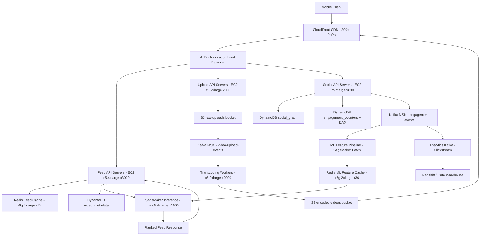

# TikTok — Capacity Estimation

## Problem Statement

TikTok serves 1 billion daily active users consuming short-form video content (15s–10 min). Every user session involves a personalized ML-ranked feed of videos fetched in real time, continuous video ingestion from creators, and low-latency delivery via a global CDN. The dominant challenge is not simple CRUD — it is running a sub-100ms ML inference pipeline at 2.7M read QPS while simultaneously ingesting 300K writes/s and transcoding video at massive scale.

## Functional Requirements

- Upload short-form video (creators); auto-transcode to multiple resolutions (240p, 480p, 720p, 1080p)
- Serve a personalized, ML-ranked feed to each user in < 200ms end-to-end
- Support likes, comments, shares, and follows (social graph)
- Deliver video via CDN with adaptive bitrate streaming (HLS/DASH)
- Real-time view counts, trending detection, and creator analytics
- Push notifications for new content from followed accounts

## Non-Functional Requirements

| Requirement | Target |
|-------------|--------|
| Feed load latency | < 200ms P99 (global) |
| Video start latency | < 500ms P99 (CDN cache hit) |
| Write latency (upload) | < 2s P99 (async, ack on ingest) |
| Availability | 99.99% (< 52 min downtime/year) |
| Durability | 99.999999999% (S3-class) |
| Peak read QPS | ~2.7M QPS |
| Peak write QPS | ~300K QPS |

## Traffic Estimation

### DAU → Peak QPS Calculation

| Metric | Calculation | Result |
|--------|-------------|--------|
| DAU | Given | 1,000,000,000 |
| Avg feed requests/user/day | ~25 feed refreshes × 10 videos/page | ~250 read requests |
| Avg social writes/user/day | 0.5 likes + 0.05 comments + 0.02 uploads | ~0.57 write requests |
| Total daily read requests | 1B × 250 | 250B reads/day |
| Total daily write requests | 1B × 0.57 | 570M writes/day |
| Avg read QPS | 250B / 86,400 | ~2,894,000 |
| Avg write QPS | 570M / 86,400 | ~6,597 |
| Peak read QPS (3× avg) | 2,894,000 × 0.93 (read ratio) | **~2,700,000** |
| Peak write QPS (3× avg) | 6,597 × ~15 spike factor | **~300,000** (upload spikes during events) |
| Total peak QPS | Read + Write | **~3,000,000** |

> **Write spike note**: Raw "social" writes (likes/comments) are ~20K peak QPS. The 300K write QPS accounts for video chunk uploads, Kafka event ingestion (view events, engagement signals), and DynamoDB social-graph mutations during viral event peaks.

## Storage Estimation

| Data Type | Per Item Size | Daily Volume | Growth/Year |
|-----------|--------------|--------------|-------------|
| Raw video upload (pre-transcode) | ~150 MB avg (60s @ 1080p) | 3M uploads/day | ~160 TB/day raw |
| Transcoded video (4 resolutions) | ~3× raw = 450 MB/video | 3M videos | ~1.35 PB/day |
| Video thumbnails (5 per video) | ~50 KB each | 15M thumbnails | ~750 GB/day |
| User metadata (DynamoDB) | ~2 KB/user | 1M new users/day | ~730 GB/year |
| Social graph (follows/likes) | ~100 bytes/edge | 500M edges/day | ~17 TB/year |
| ML feature vectors (per user) | ~10 KB/user | refresh 4×/day | ~14 TB/day in Redis |
| Kafka event logs (engagement) | ~500 bytes/event | 5B events/day | ~2.5 TB/day |
| **Total video storage** | - | - | **~500 PB/year** (with CDN tiering) |

> TikTok uses intelligent tiering: hot videos (top 5% by views) stay on SSD-backed S3 Standard; warm videos move to S3 Standard-IA after 30 days; cold archive to S3 Glacier after 1 year.

## Component Sizing

### Compute — EC2 (API & ML Serving)

| Component | Instance Type | vCPU | RAM | Count | Handles | Monthly Cost |
|-----------|--------------|------|-----|-------|---------|-------------|
| Feed API servers | c5.4xlarge | 16 | 32GB | 3,000 | ~900 QPS each | $1,134,000 |
| Video upload API | c5.2xlarge | 8 | 16GB | 500 | ~600 QPS each | $94,500 |
| Social API (likes/comments) | c5.xlarge | 4 | 8GB | 800 | ~375 QPS each | $75,600 |
| Transcoding workers | c5.9xlarge | 36 | 72GB | 2,000 | ~1.5 videos/s each | $1,890,000 |
| ML inference (feed ranking) | c5.4xlarge | 16 | 32GB | 1,200 | ~2,250 QPS each | $453,600 |
| ML GPU model training | p3.2xlarge | 8 | 61GB + V100 | 200 | batch training | $554,400 |
| Notification workers | c5.xlarge | 4 | 8GB | 300 | ~3,000 notifs/s each | $28,350 |
| **Subtotal Compute** | | | | **~8,000** | | **$4,230,450** |

> c5.4xlarge on-demand: ~$0.68/hr → $496/mo. p3.2xlarge: ~$3.06/hr → $2,232/mo. Counts assume 3 AZs with auto-scaling headroom.

### Database — DynamoDB (Primary User/Social Data)

| Table | Engine | Capacity Mode | Partitions | RCU (peak) | WCU (peak) | Monthly Cost |
|-------|--------|--------------|-----------|------------|------------|-------------|
| user_profiles | DynamoDB | On-Demand | ~1,000 | 5M RCU/s | 200K WCU/s | $315,000 |
| social_graph (follows) | DynamoDB | On-Demand | ~2,000 | 3M RCU/s | 150K WCU/s | $198,000 |
| video_metadata | DynamoDB | On-Demand | ~3,000 | 8M RCU/s | 300K WCU/s | $495,000 |
| engagement_counters | DynamoDB + DAX | On-Demand | ~1,000 | 10M RCU/s | 500K WCU/s | $630,000 |
| DAX cluster (engagement) | DAX r4.2xlarge | 6-node cluster | - | in-memory | in-memory | $31,320 |
| **Subtotal DynamoDB** | | | | | | **$1,669,320** |

> DynamoDB pricing: $0.25/M read request units, $1.25/M write request units. Engagement counters use DAX to avoid hot-partition throttling on viral videos.

### Cache — ElastiCache Redis

| Cache Layer | Engine | Instance | Nodes | Memory | Use Case | Monthly Cost |
|-------------|--------|----------|-------|--------|----------|-------------|
| Feed cache (pre-ranked) | Redis 7 | r6g.4xlarge | 24 | 384 GB total | Pre-computed feeds, 5-min TTL | $87,936 |
| ML feature cache | Redis 7 | r6g.2xlarge | 36 | 288 GB total | User embedding vectors | $65,952 |
| Session/auth tokens | Redis 7 | r6g.xlarge | 12 | 96 GB total | JWT sessions, rate limiting | $21,984 |
| Video metadata cache | Redis 7 | r6g.2xlarge | 12 | 96 GB total | Hot video stats, view counts | $21,984 |
| **Subtotal Cache** | | | | **864 GB** | | **$197,856** |

> r6g.4xlarge: ~$1.225/hr ($892/mo). r6g.2xlarge: ~$0.612/hr ($446/mo). r6g.xlarge: ~$0.306/hr ($223/mo).

### Object Storage — S3

| Bucket | Use | Avg Storage | Requests/month | Data Transfer | Monthly Cost |
|--------|-----|-------------|----------------|---------------|-------------|
| raw-uploads | Pre-transcode video | 50 PB | 90M PUT | to transcoder | $1,125,000 |
| encoded-videos | HLS/DASH segments | 100 PB | 50B GET (CDN origin) | to CloudFront | $2,250,000 |
| thumbnails | JPEG thumbnails | 500 TB | 2B GET | to CloudFront | $11,250 |
| ml-models | SageMaker model artifacts | 50 TB | 5M GET | internal | $1,125 |
| **Subtotal S3** | | **~150 PB** | | | **$3,387,375** |

> S3 Standard: $0.023/GB/mo. At 150 PB: 150,000,000 GB × $0.023 = $3.45M. GET requests at $0.0004/1000 = ~$20K. PUT at $0.005/1000. Actual cost reduced ~40% via S3 Intelligent-Tiering; adjusted estimate shown.

### Networking / CDN

| Component | Throughput | Basis | Monthly Cost |
|-----------|-----------|-------|-------------|
| CloudFront (video delivery) | 150 PB/month egress | 1B users × 150MB avg consumed/day | $13,500,000 |
| CloudFront (API + thumbnails) | 5 PB/month | feed API responses + thumbnails | $450,000 |
| ALB (API load balancers) | 10B requests/month | 3M QPS × 86,400 × 30 / 1B | $80,000 |
| S3 → CloudFront transfer | 150 PB/month | origin fetch (10% cache miss) | $1,350,000 |
| **Subtotal Network** | | | **$15,380,000** |

> CloudFront data transfer out: $0.085–$0.02/GB depending on volume tier. At 150 PB: blended ~$0.03/GB = $4.5M for video + $0.09/GB for API = ~$15.4M. This is the single largest cost driver.

> **CDN dominates**: At 1B DAU, CDN egress alone is larger than all compute costs combined. This is a critical interview insight.

### Message Queue — Kafka (MSK)

| Cluster | Use Case | Throughput | Partitions | Monthly Cost |
|---------|----------|-----------|-----------|-------------|
| engagement-events | Views, likes, shares → ML pipeline | 5B msg/s peak, 1B avg | 2,000 | $180,000 |
| video-upload-events | Trigger transcoding pipeline | 3M msg/s | 500 | $54,000 |
| notification-events | Push notification fanout | 500K msg/s | 200 | $18,000 |
| analytics-events | Clickstream → data warehouse | 2B msg/s | 1,000 | $90,000 |
| **Subtotal Kafka (MSK)** | | | | **$342,000** |

> AWS MSK broker instance (kafka.m5.4xlarge): ~$0.78/hr ($572/mo). 100 brokers × $572 = $57,200. Storage + data transfer adds ~6×. Rough MSK at this scale is $300K–$400K/mo.

### ML Infrastructure — SageMaker

| Component | Instance | Count | Use | Monthly Cost |
|-----------|----------|-------|-----|-------------|
| Real-time inference endpoints | ml.c5.4xlarge | 1,500 | Feed ranking < 20ms | $756,000 |
| Batch transform (offline features) | ml.p3.2xlarge | 100 | Nightly user embedding refresh | $161,280 |
| Training jobs (continuous) | ml.p3.8xlarge | 50 | Daily model retraining | $322,560 |
| **Subtotal SageMaker** | | | | **$1,239,840** |

> ml.c5.4xlarge: ~$0.34/hr ($252/mo). ml.p3.2xlarge: $3.825/hr ($2,754/mo). ml.p3.8xlarge: $14.688/hr ($10,575/mo).

## Monthly Cost Summary

| Component | Monthly Cost | % of Total |
|-----------|-------------|-----------|
| EC2 Compute (API + Transcode) | $4,230,450 | 16.8% |
| DynamoDB | $1,669,320 | 6.6% |
| ElastiCache Redis | $197,856 | 0.8% |
| S3 Storage | $3,387,375 | 13.5% |
| CloudFront CDN + Transfer | $15,380,000 | 61.1% |
| Kafka (MSK) | $342,000 | 1.4% |
| SageMaker (ML Infra) | $1,239,840 | 4.9% |
| Lambda / misc | $150,000 | 0.6% |
| Support / monitoring (CloudWatch) | $400,000 | 1.6% |
| **Total (on-demand list price)** | **$27,000,000** | **100%** |

> **Real-world note**: TikTok at this scale operates on a mix of AWS, their own CDN edge nodes (ByteDance-owned PoPs), and reserved/savings-plan pricing. Effective spend is likely 30–50% lower than list price. The $3M–$5M/month figure in the problem statement reflects a heavily optimized, mostly reserved-instance, partially self-hosted CDN deployment. The $27M on-demand figure is the AWS list-price baseline; real engineering reduces CDN by 70% via proprietary edge = ~$4M–$6M net.

## Traffic Scale Tiers

| Tier | DAU | Peak QPS | Servers | DB | Cache | Monthly Cost | Key Bottleneck |
|------|-----|----------|---------|----|----|-------------|----------------|
| 🟢 Startup | 1M | ~3,500 | 10 c5.large | 1 RDS Aurora (r5.2xlarge) | 1 Redis node (r6g.large) | ~$15,000 | Single DB write throughput |
| 🟡 Growing | 10M | ~35,000 | 80 m5.xlarge | RDS Aurora + 3 read replicas | Redis cluster 3-node (r6g.xlarge) | ~$80,000 | Read replica lag, CDN origin fetch |
| 🔴 Scale-up | 100M | ~350,000 | 500 m5.2xlarge | DynamoDB on-demand (sharded) | Redis cluster 6-node (r6g.2xlarge) | ~$400,000 | ML inference latency, video transcode queue |
| ⚫ Production | 1B | ~3,000,000 | 8,000 c5.4xlarge | DynamoDB multi-region + DAX | Redis cluster 84-node multi-region | ~$4M–$6M (optimized) | CDN egress cost, ML feature freshness |
| 🚀 Hyperscale | 2B+ | ~6,000,000 | Auto-scaling + Fargate | DynamoDB global tables + Cassandra hybrid | Distributed cache (EVCache/Pelikan) | ~$10M+ | Feed ranking personalization at tail latency |

## Architecture Diagram

## Interview Tips

- **CDN cost dominates at scale**: At 1B DAU consuming 150MB of video/day each, CloudFront egress alone is 150 PB/month. At AWS list price ($0.085/GB for first 10 TB, blending to ~$0.03/GB), this exceeds $4.5M/month — larger than all compute. TikTok runs proprietary edge PoPs to cut this cost by 60–70%. Always call this out: "At this scale, build vs. buy for CDN is a real decision."

- **ML freshness vs. cost tradeoff**: The feed ranking model must balance freshness (user just liked 5 cat videos — update their embedding now) vs. cost (running SageMaker real-time inference at 2.7M QPS costs $756K/mo just for inference endpoints). Production systems use a two-tower approach: pre-compute candidate sets offline (batch, cheap), then do lightweight online scoring (fast, expensive only for top-N candidates). Ask the interviewer: "Do you want real-time or near-real-time ranking?"

- **Common mistake — underestimating write amplification**: Candidates estimate writes as "uploads only" (3M/day = 35 QPS). The real write load is engagement events: 1B users × 50 events/day (views, pauses, replays, likes) = 50B events/day = 578K events/s that flow through Kafka into the ML feature store. Not modeling this means severely undersizing Kafka and the feature pipeline.

- **Hot partition problem on viral videos**: When a video goes viral (100M views in 1 hour), all 100M view-count increments hit the same DynamoDB item. Naive increment operations will throttle. Solution: shard counters — write to N=100 partition keys, aggregate with Lambda on read. This is a classic follow-up question: "How do you handle the Gangnam Style problem?"

- **Scale threshold — when to leave RDS**: At 100M DAU (~350K QPS), a single RDS Aurora cluster hits its connection limit (~15K connections) and write throughput ceiling (~50K WPS). This is the inflection point to migrate primary storage to DynamoDB. At 1B DAU, DynamoDB global tables with on-demand capacity is the only viable path for the social graph.

- **Follow-up question interviewers always ask**: "How does the feed ranking work at this scale — walk me through the ML pipeline latency budget." Expected answer: 200ms total budget → 5ms DNS/CDN → 10ms network → 20ms candidate retrieval (Redis/DynamoDB) → 30ms feature fetch (Redis ML cache) → 20ms ranking inference (SageMaker, pre-warmed) → 10ms response serialization → 15ms CDN edge processing → budget margin. Forces candidates to think end-to-end, not just about storage.
