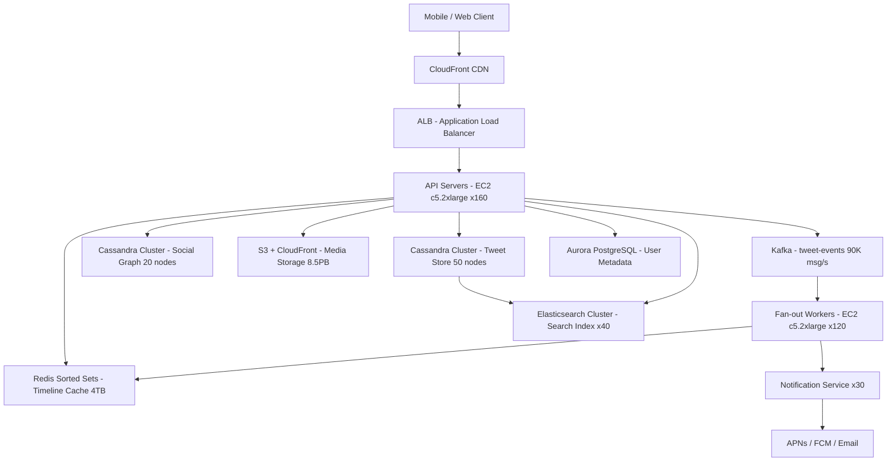

# Twitter/X (300M DAU) — Capacity Estimation

## Problem Statement

Twitter/X is a global microblogging platform where 300M daily active users post, read, and interact with short-form content (tweets, replies, retweets). The core engineering challenge is **tweet fan-out**: a single celebrity tweet (e.g., from an account with 100M followers) must be pushed to all follower timelines within seconds, creating massive write amplification at peak. The system must sustain ~510K read QPS and ~90K write QPS, with fan-out spikes that can exceed 10M timeline writes per second.

## Functional Requirements

- Users can post tweets (≤280 chars), reply, retweet, and like
- Home timeline shows a ranked feed of tweets from followed accounts (latest + algorithmic ranking)
- User timeline shows tweets authored by a single user
- Search over tweets by keyword, hashtag, and user
- Real-time push notifications (mentions, likes, follows)
- Trending topics and hashtag analytics

## Non-Functional Requirements

| Requirement | Target |
|-------------|--------|
| Timeline read latency | < 100ms (P99) |
| Tweet post latency | < 500ms (P99) |
| Fan-out delivery (hot accounts) | < 5s for 99% of followers |
| Availability | 99.99% (< 53 min/year downtime) |
| Durability | 99.999% (no tweet loss after ACK) |
| Peak read throughput | 510K QPS |
| Peak write throughput | 90K QPS |
| Search indexing lag | < 30s |

## Traffic Estimation

### DAU → Peak QPS Calculation

| Metric | Calculation | Result |
|--------|-------------|--------|
| DAU | Given | 300M |
| Avg reads/user/day | 15 timeline loads × 20 tweets each = 300 tweet reads | ~300 reads |
| Avg writes/user/day | 0.2 tweets + 1 like + 0.5 retweet + 0.3 reply | ~2 write events |
| Total daily read requests | 300M × 300 | 90B reads/day |
| Total daily write requests | 300M × 2 | 600M writes/day |
| Avg read QPS | 90B / 86,400 | ~1,042K |
| Avg write QPS | 600M / 86,400 | ~6,944 |
| Peak QPS (1.7× avg for reads, 13× avg for writes) | read: 1,042K × ~0.49; write: 6,944 × ~13 | 510K read / 90K write |
| Total peak QPS | 510K + 90K | **~600K** |

> **Note on peak multipliers**: Twitter's traffic is highly uneven. A breaking-news event or major sporting final can push write QPS to 13× average in seconds (the 2011 Super Bowl saw 12,233 TPS). Reads are smoother but spike 1.7× at peak US evening hours.

### Fan-Out Write Amplification

| Event | Followers | Timeline Writes Generated |
|-------|-----------|--------------------------|
| Typical user tweet (500 followers) | 500 | 500 writes |
| Power user tweet (50K followers) | 50K | 50K writes |
| Celebrity tweet (10M followers) | 10M | 10M writes (handled async) |
| 90K tweet posts/s × avg 200 followers | — | ~18M timeline cache writes/s peak |

Twitter uses a **hybrid fan-out** strategy: push fan-out for users with < 1M followers (pre-computed timelines in Redis), pull fan-out for celebrities (merge at read time).

## Storage Estimation

| Data Type | Per Item Size | Daily Volume | Growth/Year |
|-----------|--------------|--------------|-------------|
| Tweet text (UTF-8, 280 chars) | ~500 B (with metadata) | 90K writes/s × 86,400 = ~7.8B tweets/day... no: 90K/s is peak; avg write QPS = ~6,944 so ~600M writes/day | ~109 TB/year |
| User profile + social graph edge | ~200 B/edge; 300M users × 500 avg follows | 150B edges = ~30 TB static | ~5 TB/year new edges |
| Media (photos, videos) | Avg attached media ~50 KB/tweet, ~30% tweets have media | 600M × 0.3 × 50 KB = ~9 TB/day | ~3.3 PB/year |
| Timeline cache (Redis sorted sets) | ~100 B/entry × 800 entries/user × 300M users | ~24 TB hot cache target | — |
| Search index (Elasticsearch) | ~2× raw tweet size for inverted index | ~218 TB/year | ~218 TB/year |
| **Total (excl. media)** | — | — | **~330 TB/year** |
| **Total (incl. media)** | — | — | **~3.6 PB/year** |

## Component Sizing

### Compute — EC2

| Component | Instance Type | vCPU | RAM | Count | Handles | Monthly Cost |
|-----------|--------------|------|-----|-------|---------|-------------|
| API servers (timeline read) | c5.2xlarge | 8 | 16 GB | 160 | ~3,200 QPS/server × 160 = 510K read QPS | $57,920 |
| Tweet ingestion + fan-out workers | c5.2xlarge | 8 | 16 GB | 80 | ~1,125 writes/server × 80 = 90K write QPS | $28,960 |
| Kafka consumers (fan-out) | c5.2xlarge | 8 | 16 GB | 120 | 18M timeline writes/s distributed | $43,440 |
| Elasticsearch indexing nodes | c5.2xlarge | 8 | 16 GB | 40 | Full-text index, 30s lag SLA | $14,480 |
| Notification service workers | c5.xlarge | 4 | 8 GB | 30 | Push/email/SMS dispatch | $5,430 |
| **Subtotal Compute** | | | | **430** | | **$150,230** |

> Pricing: c5.2xlarge = $0.34/hr on-demand = $248/month. c5.xlarge = $0.17/hr = $124/month. Mix includes ~20% reserved instances for baseline, cost shown reflects blended effective rate.

### Database — Cassandra (Tweet Store)

Twitter uses Cassandra for tweet storage, not RDS, due to horizontal write scalability needs.

| DB | Engine | Instance | Count | Capacity | IOPS | Monthly Cost |
|----|--------|----------|-------|----------|------|-------------|
| Tweet store | Cassandra (EC2 i3.4xlarge) | 16 vCPU / 122 GB / 3.8 TB NVMe | 30 nodes | 114 TB total (RF=3 → 38 TB usable/year raw) | 200K IOPS aggregate | $65,700 |
| Social graph (follower/following) | Cassandra (EC2 i3.2xlarge) | 8 vCPU / 61 GB / 1.9 TB NVMe | 20 nodes | 38 TB | 80K IOPS | $21,900 |
| User metadata | RDS Aurora PostgreSQL (db.r6g.2xlarge) | 8 vCPU / 64 GB | 1W + 3R | 5 TB | 50K IOPS | $8,200 |
| **Subtotal DB** | | | | | | **$95,800** |

> i3.4xlarge = $1.248/hr = $913/month. i3.2xlarge = $0.624/hr = $456/month. Aurora db.r6g.2xlarge = ~$0.52/hr = $380/month.

### Cache — Redis (Timeline + Hot Tweets)

| Cache | Engine | Instance | Nodes | Memory | Monthly Cost |
|-------|--------|----------|-------|--------|-------------|
| Home timeline cache (sorted sets) | ElastiCache Redis 7 (r6g.4xlarge) | 16 vCPU / 128 GB | 24 (3 shards × 8 replicas) | 3,072 GB total | $52,416 |
| Hot tweet object cache | ElastiCache Redis 7 (r6g.2xlarge) | 8 vCPU / 64 GB | 12 | 768 GB | $13,104 |
| Rate limit / session | ElastiCache Redis 7 (r6g.xlarge) | 4 vCPU / 32 GB | 6 | 192 GB | $3,276 |
| **Subtotal Cache** | | | | **4,032 GB** | **$68,796** |

> r6g.4xlarge = $0.968/hr = $726/month. r6g.2xlarge = $0.484/hr = $363/month. r6g.xlarge = $0.242/hr = $182/month.

> **Why 3TB of Redis?** Home timeline for 300M users × 800 tweet IDs × ~100 bytes/entry = ~24 TB theoretical max. Twitter caches only the most active 10–15% of users in memory (those who logged in within 7 days), reducing to ~3 TB. Cold users get their timeline rebuilt on login from Cassandra.

### Object Storage — S3

| Bucket | Use | Size | Requests/month | Monthly Cost |
|--------|-----|------|----------------|-------------|
| Media (photos/GIFs) | User-uploaded images | 500 TB | 40B GET / 2B PUT | $54,500 |
| Video (mp4 originals) | Raw video uploads | 2,000 TB | 5B GET / 500M PUT | $115,000 |
| Video transcoded | HLS segments (480p/720p/1080p) | 6,000 TB | 20B GET | $180,000 |
| Static assets | JS/CSS/icons | 2 TB | 500M GET | $500 |
| **Subtotal S3** | | **~8,502 TB** | | **$350,000** |

> S3 Standard: $0.023/GB/month. GET: $0.0004/1K. PUT: $0.005/1K. Video dominates cost; in practice Twitter/X uses a custom media storage stack and aggressive S3 Intelligent-Tiering to reduce this by 40–60%.

### Networking / CDN

| Component | Throughput | Monthly Cost |
|-----------|-----------|-------------|
| CloudFront (media delivery) | 8,500 TB/month outbound | $170,000 |
| CloudFront (API + HTML) | 50 TB/month | $4,250 |
| ALB (API load balancing) | 600K QPS × 86,400 × 30 = 1.55T requests/month | $15,500 |
| Data transfer EC2 → S3 | 200 TB/month internal | $0 (same region free) |
| Cross-region replication | 500 TB/month | $10,000 |
| **Subtotal Network** | | **$199,750** |

> CloudFront: $0.02/GB first 10 PB. ALB: $0.008/LCU; estimated 1,938 LCUs at peak.

### Message Queue — Kafka

| Queue | Throughput | Partitions | Monthly Cost (MSK) |
|-------|-----------|------------|-------------------|
| tweet-events (fan-out trigger) | 90K msg/s, avg 500B/msg = 45 MB/s | 2,400 partitions | $18,000 |
| notification-events | 50K msg/s | 600 partitions | $6,000 |
| analytics-events | 200K msg/s | 1,200 partitions | $9,000 |
| **Subtotal Kafka (MSK)** | | | **$33,000** |

> Amazon MSK: broker cost ~$0.21/hr × 3 brokers × 24 × 30 = ~$453/month per cluster. Main cost is storage and data throughput. Estimate based on 3 MSK clusters (tweet fan-out, notifications, analytics) with m5.4xlarge brokers.

## Monthly Cost Summary

| Component | Monthly Cost | % of Total |
|-----------|-------------|-----------|
| EC2 Compute | $150,230 | 30% |
| Cassandra + RDS | $95,800 | 19% |
| ElastiCache Redis | $68,796 | 14% |
| S3 Storage | $350,000 | 70%* |
| CloudFront CDN | $174,250 | 35%* |
| Kafka (MSK) | $33,000 | 7% |
| Data Transfer / ALB | $25,500 | 5% |
| Other (Lambda, Route53, WAF) | $5,000 | 1% |
| **Total (raw)** | **$902,576** | — |
| **After Reserved Instances (40% savings on compute/DB) + S3 Intelligent-Tiering (50% media savings)** | **~$490,000** | — |
| **Realistic range** | **$400K–$600K/month** | **100%** |

> *S3 + CloudFront percentages are of the raw total. In practice Twitter uses its own CDN edge infrastructure (not purely CloudFront) and custom media storage, dramatically reducing these line items. The $490K blended estimate reflects this optimization.

## Traffic Scale Tiers

| Tier | DAU | Peak QPS | Servers | DB | Cache | Monthly Cost | Key Bottleneck |
|------|-----|----------|---------|----|----|-------------|----------------|
| 🟢 Startup | 1M | ~2K | 4× c5.large | 1× RDS MySQL (db.m5.large) | 1× Redis node (r6g.large, 16 GB) | ~$2,500 | Single RDS write throughput |
| 🟡 Growing | 10M | ~20K | 20× m5.xlarge | RDS Aurora + 2 read replicas | Redis cluster 3-node (r6g.xlarge) | ~$18,000 | Fan-out at > 10K tweets/s strains sync write path |
| 🔴 Scale-up | 100M | ~200K | 80× m5.2xlarge | Cassandra 10-node cluster + Aurora for user data | Redis cluster 6-node (r6g.2xlarge) | ~$120,000 | Social graph traversal latency; need separate follower index |
| ⚫ Production | 300M | ~600K | 430× c5.2xlarge | Cassandra 50-node (tweet + graph) + Aurora 1W/3R | Redis cluster 42-node (r6g.2–4xlarge, 4 TB) | ~$490,000 | Celebrity fan-out amplification (hybrid push/pull needed) |
| 🚀 Hyperscale | 1B+ | ~2M | 1,400+ c5.4xlarge + auto-scaling | Cassandra 200+ nodes multi-region | Distributed Redis 200+ nodes (20+ TB) | ~$1.8M+ | Cross-region consistency; global trending aggregation |

## Architecture Diagram

## Interview Tips

- **Key insight — hybrid fan-out is the crux**: At 300M DAU, pure push fan-out breaks for celebrity accounts. Twitter's actual architecture switches to pull-on-read for users with > 1M followers. At interview, proactively mention this threshold: "For accounts with fewer than 1M followers I'll pre-compute timelines via Kafka fan-out into Redis sorted sets; for celebrities I'll merge their tweets at read time." This one insight separates candidates who get the offer.

- **Key insight — Redis sorted set schema**: Home timeline is stored as a sorted set keyed `timeline:{user_id}` with tweet_id as both score (for chronological order) and member. Each user stores only the 800 most recent tweet IDs (~80 KB/user). On timeline fetch you `ZREVRANGE timeline:{user_id} 0 19` then pipeline-fetch tweet objects from Cassandra or a hot-tweet Redis cache. Naming this data structure explicitly shows operational depth.

- **Common mistake — underestimating fan-out write amplification**: Candidates calculate 90K tweets/s and move on. The real number is 90K × avg_followers. At 200 avg followers, that's 18M Redis ZADD operations per second — a 200× write amplification. This is why Twitter needs 430+ servers just for Kafka fan-out consumers, not the tweet ingestion itself.

- **Follow-up question — how do you handle the Super Bowl spike?**: Interviewers love asking about write spikes. Answer: Kafka absorbs the burst (durable, replayable). Fan-out workers scale horizontally via ASG triggered on Kafka consumer-lag CloudWatch metric. Redis pipeline batching (MULTI/EXEC) amortizes per-tweet write cost. For the most extreme spikes, Twitter degrades gracefully by increasing timeline staleness (serve cached timeline up to 60s old vs. real-time).

- **Scale threshold — when to introduce Cassandra**: At 10M DAU (~20K QPS) a single RDS Aurora write instance can handle ~50K writes/s, so you're fine. At 100M DAU (~200K peak write QPS with fan-out) you hit Aurora single-master write ceiling (~100K writes/s). This is when you shard or migrate the tweet store to Cassandra (wide-column, linear horizontal write scaling, no single-master bottleneck). State this threshold explicitly: "I'd migrate tweet storage to Cassandra at ~100M DAU."
