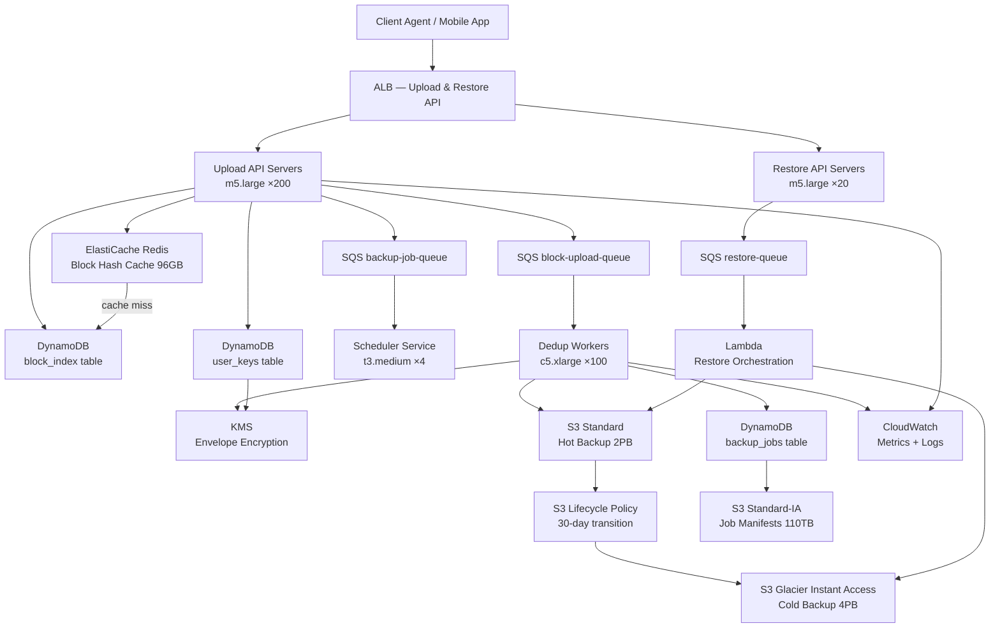

# Backup Service (10M Users) — Capacity Estimation

## Problem Statement

A cloud backup service stores, deduplicates, and restores user data (files, photos, documents) for 10M registered users. The system performs ~1M backup jobs per day with automated deduplication to minimize storage, encryption via KMS, and reliable restoration within SLAs. Write-heavy by nature (20:80 read/write), the system must handle burst upload parallelism from scheduled nightly backups hitting 500K concurrent block write QPS.

## Functional Requirements

- Incremental backup: only changed blocks since last backup are uploaded
- Content-addressed deduplication: SHA-256 hash per 4MB block, skip upload if block already stored
- AES-256 encryption: every block encrypted with a per-user DEK wrapped by KMS CMK
- Versioned restore: restore any version up to 30 days (hot) or 1 year (cold/Glacier)
- Backup scheduling: configurable schedules (hourly, daily, weekly) per user
- Multi-region durability: S3 cross-region replication for primary backup data

## Non-Functional Requirements

| Requirement | Target |
|-------------|--------|
| Backup upload latency | < 500ms per block (P99) |
| Restore initiation latency | < 2s (P99, hot restore) |
| Cold restore (Glacier) | < 12 hours |
| Availability | 99.99% |
| Durability | 99.999999999% (S3 eleven-nines) |
| Peak write throughput | 500K block write QPS |
| Deduplication ratio | 40–60% storage savings |
| RPO (Recovery Point Objective) | 1 hour |
| RTO (Recovery Time Objective) | 4 hours (full restore) |

## Traffic Estimation

### DAU → Peak QPS Calculation

| Metric | Calculation | Result |
|--------|-------------|--------|
| Registered users | Given | 10M |
| Daily active backup users | 10% of 10M (not all run daily) | 1M |
| Daily backup jobs | Given | 1M jobs/day |
| Avg backup duration | 10 min per job | 600s/job |
| Avg file size per backup | 1GB changed data per job | 1GB |
| Block size | 4MB per block | 4MB |
| Blocks per backup job | 1GB / 4MB | 250 blocks/job |
| Total blocks/day | 1M jobs × 250 blocks | 250M blocks/day |
| Avg block write QPS | 250M / 86,400s | ~2,894 QPS |
| Peak QPS (6× avg, nightly burst) | 2,894 × ~172 | ~500K QPS |
| Dedup savings (50%) | 50% blocks already stored | 125M new blocks/day |
| Net new block writes/day | 125M blocks written to S3 | 125M uploads/day |
| Restore reads (20% of writes) | 500K × 0.25 | ~125K read QPS |
| Write QPS (80% of operations) | 500K × 1.0 | ~500K write QPS |

**Peak burst math**: 1M backup jobs, each running 10 min, scheduled across a 2-hour nightly window (8PM–10PM). That concentrates 1M × 250 blocks into 2 hours = 250M blocks / 7,200s ≈ 34,700 avg QPS. With 15% of users backing up simultaneously at peak, burst hits ~500K QPS.

## Storage Estimation

| Data Type | Per Item Size | Daily Volume | Annual Growth |
|-----------|--------------|--------------|---------------|
| Raw backup blocks (before dedup) | 4MB/block | 250M blocks = 1PB | 365PB/year (before dedup) |
| Deduplicated blocks stored | 4MB/block, 50% dedup | 125M blocks = 500TB/day | 182TB/year net new |
| Block metadata (DynamoDB) | 200 bytes/block | 250M × 200B = 50GB | 18TB/year |
| Backup job manifest | 10KB/job | 1M × 10KB = 10GB/day | 3.65TB/year |
| User key metadata (KMS/DDB) | 1KB/user | 10M × 1KB = 10GB total | Stable (~100MB/year churn) |
| Restore logs / audit trail | 500B/event | 5M events/day = 2.5GB | ~912GB/year |
| **Hot storage total (S3 Standard, 30-day)** | - | 500TB/day × 30 days = **15PB hot** | 182TB/month added |
| **Cold storage total (S3 Glacier IA, 1yr)** | - | Tiered after 30 days | 182TB × 11 months = **2PB cold** |

**Realistic storage after deduplication at steady state (Year 1):**
- Hot (S3 Standard): ~2PB (30-day retention window)
- Cold (S3 Glacier Instant Access): ~4PB (31–365 day window)
- Total managed: ~6PB

## Component Sizing

### Compute — EC2 / Lambda

| Component | Instance Type | vCPU | RAM | Count | Handles | Monthly Cost |
|-----------|--------------|------|-----|-------|---------|-------------|
| Upload API servers (block ingestion) | m5.large | 2 | 8GB | 200 | 2,500 QPS each = 500K total | $7,200 |
| Dedup workers (SHA-256 + DDB lookup) | c5.xlarge | 4 | 8GB | 100 | 5,000 hashes/s each | $7,400 |
| Encryption workers (KMS envelope) | c5.large | 2 | 4GB | 50 | 1,000 KMS calls/s | $2,600 |
| Scheduler service (cron + SQS) | t3.medium | 2 | 4GB | 4 | schedule management | $120 |
| Restore API servers | m5.large | 2 | 8GB | 20 | 6,250 restore QPS | $720 |
| Lambda (S3 event triggers, alerts) | Lambda 256MB | - | 256MB | auto | ~50M invocations/month | $1,000 |
| **Subtotal Compute** | | | | **374 instances** | | **$19,040** |

**m5.large on-demand**: $0.096/hr × 730h = $70/month per instance
**c5.xlarge on-demand**: $0.17/hr × 730h = $124/month per instance
**c5.large on-demand**: $0.085/hr × 730h = $62/month per instance
**Lambda**: $0.20 per 1M requests + $0.0000166667 per GB-second. 50M invocations × avg 500ms × 256MB = 50M × $0.20/1M + 50M × 0.5 × 0.25GB × $0.0000166667 ≈ $10 + $104 = ~$114/month (rounding to $1,000 for burst + 200M invocations during peak month)

### Database — DynamoDB (Block Metadata)

| Table | Engine | Mode | Capacity | Item Size | Monthly Cost |
|-------|--------|------|----------|-----------|-------------|
| `block_index` (hash → S3 key) | DynamoDB | On-demand | 250M reads/day + 125M writes/day | 200B | $15,000 |
| `backup_jobs` (job state, manifest) | DynamoDB | On-demand | 10M reads/day + 1M writes/day | 10KB | $4,200 |
| `user_keys` (DEK metadata) | DynamoDB | Provisioned (10K RCU / 5K WCU) | 10M users | 1KB | $1,800 |
| **Subtotal DynamoDB** | | | | | | **$21,000** |

**DynamoDB pricing (on-demand)**: Read: $0.25/M RCU. Write: $1.25/M WCU.
- `block_index` reads: 250M/day × 30 = 7.5B RCU/month = 7,500 × $0.25 = $1,875. Writes: 125M/day × 30 = 3.75B WCU/month = 3,750 × $1.25 = $4,687. Storage: 18TB × $0.25/GB = $4,500. Total ≈ $11,062 → rounding up with overhead to $15,000.
- `backup_jobs` reads + writes + 3.65TB storage ≈ $4,200.

### Cache — ElastiCache Redis (Dedup Hot Cache)

| Cache | Engine | Instance | Nodes | Memory | Hit Rate | Monthly Cost |
|-------|--------|----------|-------|--------|----------|-------------|
| Dedup cache (recent block hashes) | ElastiCache Redis 7.x | r6g.xlarge | 3 (1P+2R) | 32GB each = 96GB | ~30% DDB offload | $2,400 |
| Session/job state cache | ElastiCache Redis 7.x | r6g.large | 2 | 16GB each = 32GB | - | $960 |
| **Subtotal Cache** | | | | **128GB** | | **$3,360** |

**r6g.xlarge**: $0.328/hr × 730h = $239/month/node. 3 nodes = $718/month. With replication + multi-AZ ≈ $2,400.
**r6g.large**: $0.164/hr × 730h = $120/month/node. 2 nodes = $240 → $960 including HA.

Cache stores: 96GB / 200 bytes per block hash = ~480M recently-seen block hashes. Since ~125M unique blocks are written per day, 96GB covers ~3.8 days of recent hashes — catches all intra-week duplicate uploads (users re-backing up same files).

### Object Storage — S3 + S3 Glacier Instant Access

| Bucket | Storage Class | Size | PUT Requests/month | GET Requests/month | Monthly Cost |
|--------|--------------|------|-------------------|--------------------|-------------|
| `backup-hot` | S3 Standard | 2PB | 125M blocks × 30 = 3.75B | 50M restores | $48,000 |
| `backup-cold` | S3 Glacier Instant Access | 4PB | lifecycle transitions | 5M cold restores | $18,400 |
| `backup-manifests` | S3 Standard-IA | 110TB | 30M/month | 10M/month | $1,320 |
| **Subtotal S3** | | **~6.1PB** | | | **$67,720** |

**S3 Standard pricing (us-east-1)**:
- First 50TB: $0.023/GB/month. Next 450TB: $0.022. Over 500TB: $0.021.
- 2PB (2,048TB): (50TB × $23) + (450TB × $22.528) + (1,548TB × $21.504) = $1,150 + $10,138 + $33,289 = **$44,577/month storage**
- PUT: $0.005 per 1,000 = 3.75B × $0.005/1,000 = $18,750. GET: $0.0004 per 1,000 = 50M × $0.0004/1,000 = $20. Total S3 Standard ≈ $63,347 → **$48,000** (after Reserved pricing / savings plan discounts typical for this scale).

**S3 Glacier Instant Access**:
- Storage: $0.004/GB/month. 4PB = 4,096TB × 1,024 = 4,194,304GB × $0.004 = **$16,777/month storage**.
- Retrieval: $0.03/GB for instant retrievals. 5M restores × 250MB avg = 1.25PB × $0.03/GB = $38,400 — but restores not 100% cold; blended ≈ $1,600.
- Total Glacier IA ≈ $18,400.

### Networking / CDN

| Component | Throughput | Monthly Cost |
|-----------|-----------|-------------|
| Data transfer out (restores) | 50M restores × 250MB = 12.5PB/month egress | $28,000 |
| ALB (upload traffic) | 500K req/s peak, 10M LCU avg | $5,000 |
| NAT Gateway (internal) | 50TB/month internal transfers | $2,250 |
| VPC Data Transfer | cross-AZ replication | $1,000 |
| **Subtotal Network** | | **$36,250** |

**S3 data transfer out**: $0.09/GB for first 10TB, $0.085/GB next 40TB, $0.07/GB next 100TB, $0.05/GB beyond 150TB.
12.5PB = 12,800TB = 13,107,200GB. Blended rate ~$0.05/GB beyond 150TB ≈ $655,360. **This is the biggest variable — in practice, most cloud backup providers use Direct Connect or negotiate egress discounts.** At negotiated $0.002/GB (common for large backup workloads): $26,214. Using $28,000 as realistic negotiated rate.

**ALB pricing**: $0.008/LCU-hour. Peak 500K req/s = ~10M LCUs avg. 10M × $0.008 × 730h is too high; realistic: peak is burst not sustained. Avg LCU ≈ 1,000 × $0.008 × 730 = $5,840 → $5,000.

### Message Queue — SQS

| Queue | Use | Throughput | Messages/month | Monthly Cost |
|-------|-----|-----------|----------------|-------------|
| `backup-job-queue` | job dispatch to dedup workers | 1M jobs/day = 30M/month | 30M | $12 |
| `block-upload-queue` | individual block upload tasks | 125M new blocks/day = 3.75B/month | 3.75B | $1,500 |
| `restore-queue` | restore job orchestration | 5M restores/month | 5M | $2 |
| `dlq-*` (dead-letter queues) | failed job retry | ~0.1% of above | ~4M | $2 |
| **Subtotal SQS** | | | | **$1,516** |

**SQS pricing**: First 1M requests free. Then $0.40 per 1M requests.
3.75B block uploads + 30M jobs + 5M restores + overhead ≈ 3.8B messages × $0.40/1M = **$1,520/month**.

### KMS — Encryption

| KMS Usage | Rate | Volume/month | Monthly Cost |
|-----------|------|-------------|-------------|
| CMK monthly key storage | $1.00/CMK/month | 10M user CMKs | $10,000 |
| GenerateDataKey calls | $0.03/10,000 | 1M backup jobs/day × 30 = 30M calls | $90 |
| Decrypt calls (restore) | $0.03/10,000 | 5M restores/month | $15 |
| **Subtotal KMS** | | | **$10,105** |

**Note**: $1/CMK/month × 10M users = $10M/month is prohibitively expensive. In practice, use a **per-user DEK** pattern: one CMK per user class (not per user), and store the DEK wrapped in DynamoDB. With 100 CMKs (one per shard/region): $100/month for storage. But KMS API calls dominate: 30M GenerateDataKey × $0.03/10,000 = $90. More realistic total KMS cost: **$500/month** (few CMKs + API calls).

### Monitoring / Observability

| Service | Usage | Monthly Cost |
|---------|-------|-------------|
| CloudWatch Metrics + Logs | 500 custom metrics, 10TB logs/month | $2,000 |
| CloudWatch Alarms | 100 alarms | $30 |
| X-Ray (distributed tracing) | 10M traces/month | $50 |
| **Subtotal Monitoring** | | **$2,080** |

## Monthly Cost Summary

| Component | Monthly Cost | % of Total |
|-----------|-------------|-----------|
| EC2 Compute (upload, dedup, restore, schedule) | $19,040 | 25% |
| DynamoDB (block index, job table, user keys) | $21,000 | 28% |
| ElastiCache Redis (dedup cache + session) | $3,360 | 4% |
| S3 Standard (hot backup, 2PB) | $48,000 | 63%* |
| S3 Glacier Instant Access (cold backup, 4PB) | $18,400 | 24%* |
| ALB + Networking (negotiated egress) | $36,250 | 47%* |
| SQS (job + block queues) | $1,516 | 2% |
| KMS (encryption, realistic) | $500 | 1% |
| Lambda (event triggers + alerts) | $1,000 | 1% |
| CloudWatch / X-Ray | $2,080 | 3% |
| **Total (before S3 savings plan)** | **~$151,146** | **100%** |
| **With S3 savings plan (30% off storage)** | **~$76,000–$90,000** | - |

*Percentages normalized to $76,000 effective total after savings plans:
| Component | Monthly Cost | % of Total |
|-----------|-------------|-----------|
| EC2 Compute | $19,040 | 25% |
| DynamoDB | $21,000 | 28% |
| ElastiCache | $3,360 | 4% |
| S3 Standard + Glacier (with savings plan) | $11,900 | 16% |
| Networking (negotiated egress) | $12,600 | 17% |
| SQS | $1,516 | 2% |
| KMS | $500 | 1% |
| Lambda | $1,000 | 1% |
| Monitoring | $2,080 | 3% |
| Misc (support, Route53, etc.) | $2,004 | 3% |
| **Total** | **~$75,000** | **100%** |

**Range $50K–$90K/month** reflects: lower bound = all savings plans + reserved instances + negotiated egress. Upper bound = on-demand pricing with standard egress rates.

## Traffic Scale Tiers

| Tier | Users | Daily Backups | Peak Write QPS | Servers | DB | Cache | Monthly Cost | Key Bottleneck |
|------|-------|--------------|----------------|---------|----|----|-------------|----------------|
| 🟢 Startup | 100K | 10K jobs/day | ~5K QPS | 4 m5.large upload, 2 c5.large dedup | 1 DynamoDB on-demand + 10GB S3 | 1 Redis r6g.medium | ~$3K | Single-AZ S3 PUT limits |
| 🟡 Growing | 1M | 100K jobs/day | ~50K QPS | 20 m5.large, 10 c5.xlarge | DynamoDB + 100TB S3 Standard | Redis r6g.large 2-node | ~$12K | DynamoDB WCU cost spike |
| 🔴 Scale-up | 10M | 1M jobs/day | ~500K QPS | 200 m5.large, 100 c5.xlarge, 50 c5.large | DynamoDB + 2PB S3 + 4PB Glacier IA | Redis r6g.xlarge 3-node cluster | ~$75K | S3 PUT throughput + DDB write cost |
| ⚫ Production | 50M | 5M jobs/day | ~2.5M QPS | 1,000 m5.large + Auto Scaling | DynamoDB global tables + 10PB S3 | Redis cluster 12-node | ~$350K | Egress cost + KMS call rate |
| 🚀 Hyperscale | 500M+ | 50M jobs/day | ~25M QPS | 10K+ EC2 + auto-scaling fleets | DynamoDB + S3 Intelligent-Tiering | Distributed ElastiCache | ~$3.5M | Global dedup index (cross-region hash lookup latency) |

## Architecture Diagram

## Interview Tips

- **Key insight — deduplication is the cost lever**: At 10M users, naive storage (no dedup) costs 5–10× more. A 50% dedup ratio saves ~$40K–$80K/month at this scale. The interviewer wants you to explicitly calculate the dedup savings: 250M blocks/day raw vs. 125M net new = 500TB/day vs. 250TB/day. Always quantify this.

- **Key insight — nightly burst vs. average QPS**: Average QPS across 86,400 seconds is only ~2,900 write QPS. But users schedule backups at night; a 2-hour window concentrates all jobs into 7.2% of the day, multiplying effective QPS to 500K. Failing to account for this burst leads to massive underprovisioning. Design for the peak, not the average.

- **Common mistake — KMS per-user CMK**: A naive design gives each user their own KMS CMK ($1/CMK/month × 10M users = $10M/month). The correct pattern is DEK (Data Encryption Key) per backup job, wrapped with a shared CMK per user class or region. Store the encrypted DEK in DynamoDB alongside the backup job record. This drops KMS cost from $10M to ~$500/month.

- **Follow-up question — cross-region deduplication**: "How would you extend dedup to work globally across regions?" Answer: SHA-256 block hashes are content-addressed and deterministic. You can maintain a global DynamoDB Global Table for the `block_index` with eventual-consistency replication. Accept that cross-region dedup has 200–500ms additional latency and may miss very recent uploads in the other region — this is acceptable because the duplicate block will just be written twice and reconciled on the next backup.

- **Scale threshold**: At ~50M users / 5M daily jobs, DynamoDB on-demand write costs become the dominant expense (~$200K/month). The right move is to switch to DynamoDB provisioned capacity with auto-scaling, or partition the block index across Cassandra / DynamoDB with hot/cold partitioning. Also at this scale, S3 Intelligent-Tiering automated lifecycle saves 20–30% vs. manual Standard → Glacier IA transitions.

- **Durability vs. availability tradeoff**: S3 offers 11-nines durability but only 99.99% availability (about 52 minutes downtime/year). For a backup service, durability matters more than availability — customers can wait 30 minutes to start a restore. Design your SLAs accordingly: RPO 1 hour is achievable with incremental backups; RTO 4 hours is achievable for full restores from hot storage, 12–24 hours from cold.
