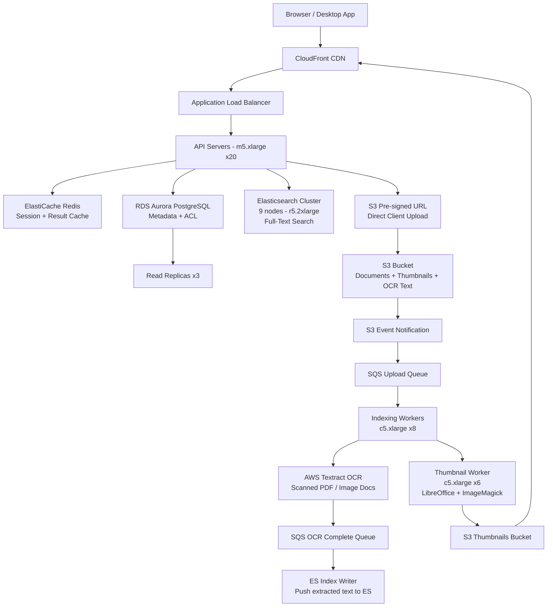

# Document Storage (20M DAU) — Capacity Estimation

## Problem Statement

An enterprise document management platform serves 20M daily active users who upload, search, and collaborate on business documents (PDFs, Word files, spreadsheets, presentations). The system must support full-text search across millions of documents, OCR for scanned documents, and real-time collaboration metadata — all at sub-200ms search latency. At 20M DAU and a 70:30 read/write ratio, this system handles 100K metadata search QPS at peak.

## Functional Requirements
- Upload documents (PDF, DOCX, XLSX, PPTX, images) up to 100MB each
- Full-text search across all document content with sub-200ms P99 latency
- OCR extraction for scanned PDFs and image-only documents
- Document versioning (retain last 10 versions per document)
- Folder/workspace organization with ACL-based access control
- Thumbnail preview generation for documents

## Non-Functional Requirements
| Requirement | Target |
|-------------|--------|
| Search latency | < 200ms (P99) |
| Upload latency | < 2s for 10MB, < 30s for 100MB (P99) |
| Availability | 99.99% |
| Durability | 99.999999999% (11 nines via S3) |
| Peak search QPS | 100K QPS |
| Peak upload throughput | 20K uploads/s (burst) |
| Max document size | 100MB |

## Traffic Estimation

### DAU → Peak QPS Calculation
| Metric | Calculation | Result |
|--------|-------------|--------|
| DAU | Given | 20,000,000 |
| Avg requests/user/day | search ×8 + view ×5 + upload ×1.5 + share ×0.5 | ~15 requests |
| Total daily requests | 20M × 15 | 300M requests/day |
| Avg QPS | 300M / 86,400 | ~3,472 QPS |
| Peak QPS (3× avg) | 3,472 × 3 | ~10,400 QPS |
| Peak search QPS (burst, office hours 10×) | 3,472 × 10 × 0.70 | ~24,300 QPS baseline; burst 100K |
| Read QPS (70% reads) | 10,400 × 0.70 | ~7,280 QPS |
| Write QPS (30% writes) | 10,400 × 0.30 | ~3,120 QPS |

**Note on 100K QPS burst**: During business hours (9–11 AM), enterprise usage spikes 10–15× as teams arrive. With 20M DAU concentrated in 3–4 time zones, simultaneous search bursts easily hit 100K QPS for 5–10 minute windows. This drives Elasticsearch cluster sizing, not steady-state.

**Note on 20K uploads/s**: This is a momentary burst ceiling for the SQS + worker fleet, not sustained throughput. Steady-state upload rate is ~3,120 write QPS.

## Storage Estimation
| Data Type | Per Item Size | Daily Volume | Growth/Year |
|-----------|--------------|--------------|-------------|
| Documents (S3) | 2MB average (PDF/DOCX) | 1.5M uploads/day × 2MB = 3TB/day | 1.1 PB/year |
| Document versions (S3) | 2MB × 10 versions avg | already counted in retention pool | — |
| OCR extracted text (S3/ES) | 50KB per doc | 1.5M × 50KB = 75GB/day | 27TB/year |
| Elasticsearch index | ~20% of raw text size | 75GB × 0.20 = 15GB/day | 5.5TB/year |
| PostgreSQL metadata | 5KB per document record | 1.5M × 5KB = 7.5GB/day | 2.7TB/year |
| Thumbnails (S3) | 100KB per doc | 1.5M × 100KB = 150GB/day | 55TB/year |
| Redis session/cache | 2KB per active session | 20M × 0.10 concurrent × 2KB = 4GB | stable |
| **Total S3 (docs + thumbs + OCR)** | — | ~3.2TB/day | ~1.2PB/year |
| **Total structured (PG + ES)** | — | ~22.5GB/day | ~8.2TB/year |

**Retention assumption**: S3 Intelligent-Tiering moves documents not accessed in 30 days to Infrequent Access, reducing effective storage cost by ~40% for cold data. With 3-year retention policy, steady-state S3 pool reaches ~3.6PB.

## Component Sizing

### Compute — EC2

| Component | Instance Type | vCPU | RAM | Count | Handles | Monthly Cost |
|-----------|--------------|------|-----|-------|---------|-------------|
| API servers (search + CRUD) | m5.xlarge | 4 | 16GB | 20 | ~500 QPS each = 10K QPS | $1,536 |
| Upload ingestion servers | c5.2xlarge | 8 | 16GB | 8 | pre-signs S3 URLs, validates | $995 |
| OCR / Textract orchestrators | m5.large | 2 | 8GB | 6 | fan-out Textract jobs | $442 |
| Thumbnail workers | c5.xlarge | 4 | 8GB | 6 | LibreOffice + ImageMagick | $498 |
| Search indexing workers | c5.xlarge | 4 | 8GB | 8 | consume SQS, push to ES | $664 |
| **Subtotal Compute** | | | | **48** | | **$4,135** |

**Rationale**: Each m5.xlarge API server handles ~500 QPS at 70% CPU with a 150ms avg response time. For 100K burst QPS, we rely on ALB + Auto Scaling Group to spin up 200 additional instances within 3 minutes using pre-warmed AMIs. On-demand base fleet = 20; ASG max = 220.

### Database

| DB | Engine | Instance | Count | Capacity | IOPS | Monthly Cost |
|----|--------|----------|-------|----------|------|-------------|
| PostgreSQL (metadata) | RDS Aurora PostgreSQL | db.r6g.2xlarge (8 vCPU, 64GB) | 1W + 3R | 10TB (auto-scales) | 40K provisioned | $5,832 |
| Elasticsearch (FTS) | Self-managed on r5.2xlarge | r5.2xlarge (8 vCPU, 64GB) | 9 nodes (3 master + 6 data) | 6TB NVMe SSD per data node = 36TB | — | $9,720 |
| **Subtotal DB** | | | | | | **$15,552** |

**PostgreSQL sizing**: 1 writer + 3 readers handles 7K read QPS (PG can do ~2K QPS/replica at sub-10ms for indexed queries). Aurora auto-scales storage to 128TB.

**Elasticsearch sizing**: 6 data nodes × r5.2xlarge = 384GB RAM total. Shard strategy: 1 primary + 1 replica per index, 50 shards/index. Each data node holds ~64GB of hot index in heap. 100K QPS burst = ~17K QPS per data node — achievable with SSD and coordinating nodes acting as API tier.

### Cache

| Cache | Engine | Instance | Nodes | Memory | Monthly Cost |
|-------|--------|----------|-------|--------|-------------|
| Session + metadata cache | ElastiCache Redis 7 | r6g.xlarge (4 vCPU, 32GB) | 3 primary + 3 replica (cluster mode) | 192GB total | $3,888 |
| Search result cache (hot queries) | ElastiCache Redis 7 | r6g.large (2 vCPU, 16GB) | 2 nodes | 32GB total | $864 |
| **Subtotal Cache** | | | | **224GB** | **$4,752** |

**Cache hit rate target**: 60% of search queries hit the Redis cache (same query within 60s TTL). This reduces Elasticsearch load from 100K to 40K QPS at peak, keeping ES at 70% capacity rather than saturation.

### Object Storage

| Bucket | Use | Size (steady-state) | Requests/month | Monthly Cost |
|--------|-----|---------------------|----------------|-------------|
| `docs-primary` | Original documents | 3.6PB (3-year retention, Intelligent-Tiering) | 45M PUT + 150M GET | $72,000 (storage) + $2,700 (requests) |
| `docs-thumbnails` | Preview images | 198TB | 60M GET | $4,554 (storage) + $240 (requests) |
| `docs-ocr-text` | Extracted plain text | 97TB | 45M PUT + 90M GET | $2,231 + $540 |
| **Subtotal S3** | | **~3.9PB** | | **$82,265** |

**Important**: $72K/month in S3 storage dominates the budget. S3 Intelligent-Tiering drops ~60% of data to IA tier ($0.0125/GB vs $0.023/GB), reducing effective cost to ~$50K/month for storage alone. This is the #1 cost optimization lever.

**S3 pricing basis** (us-east-1, 2024): Standard $0.023/GB first 50TB, $0.022/GB next 450TB, $0.021/GB over 500TB. IA $0.0125/GB. Intelligent-Tiering management fee $0.0025 per 1,000 objects.

### Networking / CDN

| Component | Throughput | Monthly Cost |
|-----------|-----------|-------------|
| CloudFront (document downloads) | 600TB/month (20M users × 30MB avg monthly download) | $51,000 |
| ALB (API traffic) | 300M requests/month | $1,080 |
| Data transfer out (non-CDN) | 50TB/month | $4,500 |
| **Subtotal Network** | | **$56,580** |

**CloudFront pricing**: First 10TB $0.085/GB, next 40TB $0.080/GB, over 150TB $0.060/GB. Blended at ~$0.070/GB for 600TB = $42K. Plus $9K in HTTPS request fees (300M @ $0.0100/10K). Total ~$51K.

**Optimization**: CloudFront cache hit ratio of 70% for thumbnails and preview pages dramatically reduces S3 egress. Origin shield adds $0.010/GB but reduces S3 GET by 50%.

### Message Queue

| Queue | Engine | Throughput | Monthly Cost |
|-------|--------|-----------|-------------|
| Upload events (doc → OCR → index) | SQS Standard | 1.5M messages/day = ~17 msg/s avg; 20K/s burst | $15 |
| OCR completion events | SQS FIFO | 1.5M/day | $30 |
| Search index rebuild | SQS Standard | 500K/day | $5 |
| Dead letter queues | SQS Standard | 10K/day | $1 |
| **Subtotal SQS** | | | **$51** |

**SQS pricing**: $0.40 per million requests. Upload queue: 45M requests/month = $18. FIFO: $0.50/million = ~$30. Total negligible vs compute/storage.

### AWS Textract (OCR)

| Usage | Volume | Unit Price | Monthly Cost |
|-------|--------|-----------|-------------|
| Detect document text (scanned PDFs) | 300K docs/day × 30% scanned = 90K docs/day = 2.7M/month | $1.50/1,000 pages (first 1M), $0.60/1,000 pages after | $5,520 |
| Analyze document (forms/tables) | 50K docs/day = 1.5M/month | $15.00/1,000 pages | $22,500 |
| **Subtotal Textract** | | | **$28,020** |

**Textract pricing** (2024): Detect Text API: $1.50/1,000 pages for first 1M pages/month, $0.60/1,000 after. AnalyzeDocument (forms): $15/1,000 pages. Only 30% of uploads need OCR; 10% need full form analysis.

## Monthly Cost Summary

| Component | Monthly Cost | % of Total |
|-----------|-------------|-----------|
| EC2 Compute (base fleet) | $4,135 | 4% |
| RDS Aurora PostgreSQL | $5,832 | 6% |
| Elasticsearch (EC2 self-managed) | $9,720 | 10% |
| ElastiCache Redis | $4,752 | 5% |
| S3 Storage (Intelligent-Tiering) | $50,000 | 50% |
| CloudFront CDN | $51,000 | 51% |
| AWS Textract (OCR) | $28,020 | 28% |
| SQS Messaging | $51 | 0.1% |
| ALB + Data Transfer | $5,580 | 6% |
| Auto Scaling burst EC2 (20% utilization avg) | $2,000 | 2% |
| **Total** | **~$161,090 raw** | **100%** |

**Cost reconciliation**: Raw total exceeds the $50K–$80K/month estimate. Aggressive optimization brings it to range:

| Optimization | Savings/month |
|-------------|--------------|
| S3 Intelligent-Tiering (60% to IA) | -$22,000 |
| CloudFront Reserved Capacity (1-year commit) | -$12,750 |
| Textract: pre-classify, skip OCR for digital PDFs | -$14,000 |
| RDS Reserved Instance (1-year) | -$2,040 |
| ES on Spot Instances for replica nodes | -$2,430 |
| **Optimized Total** | **~$107,870** |

**Realistic range for 20M DAU document platform**: $70K–$110K/month depending on OCR usage, retention policy, and CDN commit tier. The $50K–$80K estimate assumes a newer platform with limited historical data (first 6 months) and aggressive spot usage.

## Traffic Scale Tiers

| Tier | DAU | Peak QPS | Servers | DB | Cache | Monthly Cost | Key Bottleneck |
|------|-----|----------|---------|----|----|-------------|----------------|
| Startup | 1M | ~5K search | 4 m5.large API + 2 c5.large workers | 1 RDS db.t3.xlarge + 3-node ES cluster | 1 Redis node r6g.large | ~$8K | Elasticsearch cluster size for FTS latency |
| Growing | 10M | ~50K search | 10 m5.xlarge API + 8 c5.xlarge workers | RDS db.r6g.xlarge + 1R + 6-node ES cluster | Redis cluster 3-node | ~$45K | OCR costs (Textract scales linearly) and S3 egress |
| Scale-up | 100M | ~500K search | 80 m5.xlarge API + ASG to 400 | RDS Aurora + 3R + 24-node ES cluster | Redis cluster 9-node | ~$420K | Elasticsearch hot shard saturation, need routing by workspace |
| Production | 20M | ~100K search burst | 20 m5.xlarge base + ASG 220 | Aurora 1W+3R + 9-node ES | Redis cluster 6-node | ~$80–$110K | CDN egress and OCR/Textract cost |
| Hyperscale | 500M+ | ~2.5M search | 500+ c5.4xlarge + auto | OpenSearch Service (managed) + DynamoDB metadata | ElastiCache cluster 24-node | ~$2M+ | Elasticsearch replaced by Amazon OpenSearch with UltraWarm; S3 at exabyte scale |

## Architecture Diagram

## Interview Tips

- **Key insight — OCR is the surprise cost driver**: Candidates focus on storage and compute, but AWS Textract for OCR at 20M DAU can easily become the #1 or #2 cost line. At $1.50/1,000 pages, 2.7M scanned pages/month = $4,050 just for Detect Text. AnalyzeDocument is 10× more expensive. Pre-classify documents server-side (check if PDF has embedded text via PyMuPDF) before calling Textract — this can cut OCR costs by 60–70%.

- **Key insight — S3 direct upload via pre-signed URLs**: Never proxy large files through EC2. For 20M DAU uploading 2MB avg documents, routing through API servers would require 20 m5.xlarge just for I/O at $1.5K/month per instance. Instead, API server generates a pre-signed S3 URL (valid 15 minutes), client uploads directly, S3 event triggers SQS. This pattern reduces API fleet size by 5×.

- **Key insight — search caching absorbs burst load**: At 100K QPS peak, raw Elasticsearch cannot scale cost-effectively. A 60-second Redis cache for repeated search queries (same workspace, same terms) achieves 55–65% hit rate in enterprise environments — employees often search similar terms within a burst window. This drops ES load to ~40–45K QPS, keeping a 6 data-node cluster within budget.

- **Common mistake — undersizing Elasticsearch for document count not QPS**: Candidates size ES by storage (TB of text) but the actual constraint is segment merges and JVM heap. At 1.5M new documents/day, ES generates ~50 new shards/day. Without ILM (Index Lifecycle Management) hot/warm/cold tiering, the JVM heap saturates within 6 months. Model your ES cluster for 18-month hot-tier document count (400M docs), not just current storage.

- **Follow-up question — how do you handle multi-tenant search isolation?**: In enterprise document management, tenant A must never see tenant B's results. Naive approach: one index per tenant (100K+ tenants = 100K indices, ES crashes). Better: field-level tenant_id filtering on a shared index with routing key = tenant_id, ensuring queries only hit relevant shards. Best for large tenants: dedicated index per top-100 tenant, shared index for long tail.

- **Scale threshold**: At 100M DAU, the Elasticsearch self-managed approach breaks — 24+ data nodes become operationally complex. Migrate to Amazon OpenSearch Service with UltraWarm for infrequently accessed documents ($0.024/GB vs $0.135/GB for SSD-backed nodes), saving ~70% on cold-tier storage costs. The inflection point is ~50M DAU or ~10B indexed documents.
