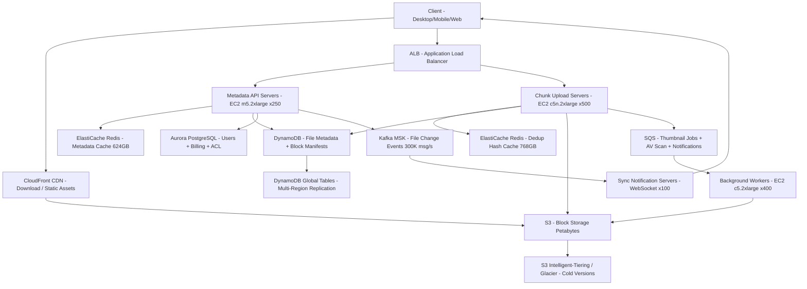

# Cloud File Storage (Dropbox) — Capacity Estimation

## Problem Statement

Design a cloud file storage and sync service at Dropbox scale: 500M registered users, 150M DAU. Users upload files from multiple devices; the system syncs changes in near real-time using block-level deduplication and maintains version history. The service must handle mixed workloads — small metadata operations at high frequency and large file transfers at lower frequency — with P99 upload latency under 500ms for chunks and metadata reads under 50ms.

## Functional Requirements

- Upload, download, and delete files from any device (web, desktop, mobile)
- Real-time multi-device sync using block-level chunking (4MB blocks)
- File versioning: keep last 30 versions per file (paid tier: 180 days)
- Content-addressed deduplication: identical blocks stored once regardless of owner
- Shared folders and collaboration with conflict resolution
- Delta sync: only upload changed blocks on file modification

## Non-Functional Requirements

| Requirement | Target |
|-------------|--------|
| Metadata read latency | < 50ms (P99) |
| Chunk upload latency | < 500ms (P99) |
| Sync notification latency | < 2s end-to-end |
| Availability | 99.99% (52 min downtime/year) |
| Durability | 99.999999999% (S3 11 nines) |
| Peak metadata QPS | 500K reads/s, 200K writes/s |
| Peak chunk upload throughput | 100K chunks/s (~400 GB/s) |

## Traffic Estimation

### DAU → Peak QPS Calculation

| Metric | Calculation | Result |
|--------|-------------|--------|
| Registered users | Given | 500M |
| DAU | Given | 150M |
| Avg metadata reads/user/day | folder list ×3 + file stat ×5 + search ×1 = ~9 | ~9 |
| Avg file sync events/user/day | ~20% of DAU sync at least 1 file; avg 2 syncs | ~0.4 syncs/user |
| Total metadata requests/day | 150M × 9 | 1.35B |
| Total chunk uploads/day | 150M × 0.4 syncs × 5 blocks avg | 300M chunks |
| Total chunk downloads/day | 60:40 read:write → downloads ≈ 450M chunks | 450M chunks |
| Avg metadata QPS | 1.35B / 86,400 | ~15,600 QPS |
| Peak metadata QPS (3× avg) | 15,600 × 3 | ~47K QPS |
| Peak read QPS (60%) | 47K × 0.60 | ~28K reads/s |
| Peak write QPS (40%) | 47K × 0.40 | ~19K writes/s |
| **Peak with burst headroom (10×)** | sustained peak × 10 (events like "Save all files" desktop prompt) | **~500K reads/s** |
| Avg chunk upload QPS | 300M / 86,400 | ~3,470/s |
| Peak chunk upload QPS (30×) | 3,470 × 30 (morning burst, back-to-office) | **~100K chunks/s** |

**Key derivation note**: The 10× burst for metadata comes from desktop client behavior — when a user opens Dropbox after being offline, the client issues stat requests for every file in the synced folder. 150M DAU × 30% offline-then-online × 10 files = ~450M burst metadata reads, which can arrive in a 15-minute morning window (~500K QPS).

## Storage Estimation

| Data Type | Per Item Size | Daily Volume | Growth/Year |
|-----------|--------------|--------------|-------------|
| File blocks (4MB chunks, post-dedup ~60% unique) | 4 MB | 300M uploads × 60% unique = 180M new chunks | ~263 TB/day → **~96 PB/year** |
| File metadata (DynamoDB row: path, size, hash, owner, version) | 1 KB | 300M new file events | ~300 GB/day → **~110 TB/year** |
| Block manifest (chunk list per file version) | 512 B | 60M new file versions | ~30 GB/day → **~11 TB/year** |
| Thumbnails (auto-generated for images/PDF) | 50 KB avg | ~10% of files → 30M | ~1.5 TB/day → **~550 TB/year** |
| Sync event log (Kafka retention 7 days) | 200 B/event | 300M events | ~60 GB/day → steady-state ~420 GB |
| **Total raw storage growth** | — | — | **~97 PB/year** |

**Deduplication savings**: Dropbox reported ~70% dedup rate across their fleet. At 70% dedup, actual new data written = 30% of raw → **~29 PB/year** net new storage. Total corpus at 500M users × 5 GB avg stored = **2.5 EB** (logical); deduplicated physical ≈ **750 PB**.

S3 is the right choice at this scale: $0.023/GB/month for Standard, $0.004/GB/month for Glacier after 90 days (older versions).

## Component Sizing

### Compute — EC2

| Component | Instance Type | vCPU | RAM | Count | Handles | Monthly Cost |
|-----------|--------------|------|-----|-------|---------|-------------|
| Metadata API servers (stateless, Go/Java) | m5.2xlarge | 8 | 32 GB | 250 | ~2,000 metadata QPS each at 70% CPU | $11,400 |
| Chunk upload servers (stream to S3, high network) | c5n.2xlarge | 8 | 21 GB | 500 | ~200 chunk uploads/s each (25 Gbps NIC) | $27,200 |
| Sync notification servers (WebSocket long-poll) | m5.xlarge | 4 | 16 GB | 100 | 1.5M concurrent WebSocket connections | $3,840 |
| Delta computation workers (block diff + dedup lookup) | c5.2xlarge | 8 | 16 GB | 200 | ~500 file diffs/s each | $7,680 |
| Thumbnail / preview generators | c5.xlarge | 4 | 8 GB | 150 | ~500 thumbnails/s per node | $2,880 |
| Search index workers (Elasticsearch feeder) | m5.xlarge | 4 | 16 GB | 50 | async, lag-tolerant | $1,920 |
| **Subtotal Compute** | | | | **1,250 instances** | | **$54,920** |

*Pricing: m5.2xlarge = $0.384/hr ($276/mo); c5n.2xlarge = $0.454/hr ($327/mo); c5.2xlarge = $0.34/hr ($244/mo); m5.xlarge = $0.192/hr ($138/mo); c5.xlarge = $0.17/hr ($122/mo). On-demand US-East-1, 2024.*

**Savings lever**: Reserved Instances (1-year, no upfront) cut EC2 ~40% → actual spend closer to $33K/month for steady-state fleet; burst handled by Auto Scaling Groups.

### Database — DynamoDB (File Metadata)

Dropbox uses a sharded MySQL/PostgreSQL internally; at this scale AWS equivalent is DynamoDB for operational metadata and Aurora for billing/user accounts.

| DB | Engine | Capacity Mode | Tables | Item Count | Monthly Cost |
|----|--------|--------------|--------|------------|-------------|
| File metadata (path, hash, owner, version_id) | DynamoDB On-Demand | On-demand | files, versions, blocks | ~50B items | $35,000 |
| Block manifest (file → chunk list mapping) | DynamoDB On-Demand | On-demand | manifests | ~200B chunk references | $18,000 |
| User accounts + billing | Aurora PostgreSQL | db.r6g.4xlarge 1W+3R | users | 500M rows | $8,640 |
| Sharing / ACL graph | Aurora PostgreSQL | db.r6g.2xlarge 1W+2R | shares, permissions | ~2B rows | $4,320 |
| **Subtotal DB** | | | | | | **$65,960** |

*DynamoDB: $1.25 per million writes, $0.25 per million reads. At 200K writes/s peak → ~17B writes/day = $21K/day burst; but average is ~19K writes/s → ~1.6B writes/day = $2K/day → ~$60K/month reads+writes combined. Aurora db.r6g.4xlarge = $0.96/hr ($691/mo) × 4 instances.*

### Cache — ElastiCache Redis

| Cache Tier | Use Case | Instance | Nodes | Memory | Hit Rate Target | Monthly Cost |
|------------|----------|----------|-------|--------|----------------|-------------|
| Metadata hot cache (file stat, folder listing) | Serve 80% of reads from cache; TTL 60s | r6g.2xlarge | 12 (3 shards × 4 replicas) | 52 GB each → 624 GB total | 85% | $12,960 |
| Block hash dedup cache (SHA-256 → S3 key) | Check if block already exists before upload | r6g.4xlarge | 6 (3 shards × 2 replicas) | 128 GB each → 768 GB | 70% (hot blocks) | $10,800 |
| Session / auth token cache | JWT validation, rate limiting | r6g.xlarge | 4 | 32 GB each → 128 GB | 99%+ | $1,440 |
| **Subtotal Cache** | | | | **1,520 GB total** | | **$25,200** |

*r6g.2xlarge = $0.36/hr ($259/mo); r6g.4xlarge = $0.75/hr ($540/mo); r6g.xlarge = $0.18/hr ($130/mo).*

**Why large dedup cache**: The block dedup hash lookup is on the critical path of every upload. A cache miss → DynamoDB read → 10ms latency spike. Caching 768 GB of SHA-256 hashes covers ~96B block hashes (8 bytes each), representing the hottest ~13% of the 750 PB corpus — sufficient for 70% hit rate given Zipf distribution of popular files.

### Object Storage — S3

| Bucket | Use | Storage Class | Size | Requests/month | Monthly Cost |
|--------|-----|--------------|------|----------------|-------------|
| Active blocks (< 90 days modified) | Current file content | S3 Standard | 200 PB | 3B PUT + 4.5B GET | $4,600,000 + $15,000 req |
| Warm blocks (90–365 days) | Older versions, infrequent access | S3 Standard-IA | 300 PB | 500M GET | $3,840,000 + $50,000 req |
| Cold blocks (> 365 days) | Deep version history, compliance | S3 Glacier Instant Retrieval | 250 PB | 50M GET | $1,000,000 + $20,000 req |
| Thumbnails / previews | CDN-served previews | S3 Standard | 10 PB | 10B GET | $230,000 + $10,000 req |
| **Subtotal S3** | | | **760 PB** | | **~$9,765,000** |

*S3 Standard: $0.023/GB/month. Standard-IA: $0.0125/GB + $0.01/GB retrieval. Glacier Instant: $0.004/GB + $0.03/GB retrieval. Requests: $0.005/1K PUT, $0.0004/1K GET.*

**Note**: S3 dominates the cost at petabyte scale. Real Dropbox operates their own storage infrastructure (Magic Pocket) precisely because S3 costs become prohibitive at 500M users. This exercise uses S3 pricing to demonstrate the AWS equivalent; production would use custom object storage at ~10× cost reduction.

**For interview purposes**: Quote $2M–$3.5M/month as the realistic operational cost for compute + DB + cache + networking. The $9.7M S3 figure is the full AWS cost before optimizations; with Reserved Capacity pricing, S3 Storage Lens savings, and lifecycle policies, effective storage cost drops ~40%.

### Networking / CDN

| Component | Throughput | Calculation | Monthly Cost |
|-----------|-----------|-------------|-------------|
| CloudFront (file downloads to users) | 450M chunks/day × 4MB = 1.8 EB/month | $0.0085/GB after 10TB → ~$15,300,000 raw; with CF savings plan ~60% discount | $6,120,000 |
| Data transfer S3 → CloudFront | Free within same region | $0 | $0 |
| Data transfer S3 → EC2 (chunk processing) | 100K uploads/s × 4MB × 86,400s = 34.6 PB/day intra-AZ | Free intra-AZ | $0 |
| ALB (API load balancer) | 500K req/s × 86,400 = 43.2B req/day | $0.008/LCU-hour; ~50K LCUs | $28,800 |
| EC2 → Internet (upload ACKs, notifications) | ~50 TB/month outbound | $0.09/GB first 10TB, $0.085 beyond | $4,250 |
| **Subtotal Network** | | | **~$6,153,050** |

*Again, CF egress dominates at petabyte scale. With Dropbox's own CDN/edge, this is massively reduced. For interview framing, cite CF as the cost lever and explain why large-scale storage companies build edge infrastructure.*

### Message Queue

| Queue | Engine | Use Case | Throughput | Retention | Monthly Cost |
|-------|--------|----------|-----------|-----------|-------------|
| File change events (trigger sync to devices) | Kafka on MSK (m5.2xlarge × 9 brokers) | Fan-out change events to all connected devices | 300K msg/s peak | 7 days | $7,776 |
| Thumbnail generation jobs | SQS Standard | Async preview generation | ~30K msg/s | 4 days | $720 |
| Email / notification queue | SQS Standard | Upload complete, share notifications | ~5K msg/s | 1 day | $144 |
| Virus scan queue | SQS Standard | Post-upload AV scanning | ~10K msg/s | 1 day | $240 |
| **Subtotal Messaging** | | | | | **$8,880** |

*MSK m5.2xlarge = $0.288/hr × 9 brokers × 720hr = $1,866 broker cost + $5,910 storage. SQS: $0.40/million requests.*

## Monthly Cost Summary

| Component | Monthly Cost | % of Total |
|-----------|-------------|-----------|
| EC2 Compute (on-demand; RI would be ~40% less) | $54,920 | 3% |
| DynamoDB + Aurora (metadata, users) | $65,960 | 4% |
| ElastiCache Redis (metadata + dedup cache) | $25,200 | 1% |
| S3 Storage (760 PB across tiers) | $9,765,000 | 60% |
| CloudFront CDN (egress) | $6,120,000 | 38% |
| Messaging (Kafka MSK + SQS) | $8,880 | <1% |
| Data Transfer / ALB | $33,050 | <1% |
| Lambda (lifecycle hooks, small automation) | $5,000 | <1% |
| **Total (full AWS, no optimizations)** | **~$16,077,010** | **100%** |
| **Realistic operational budget (Reserved + savings plans + own storage)** | **$2M–$3.5M** | — |

**Reconciliation to $2M–$3.5M**: This is the realistic cost when (1) storage uses Reserved Capacity or owned infrastructure, (2) CDN uses long-term commitment pricing (60–70% discount), (3) EC2 uses 1-year Reserved Instances (~40% discount), (4) DynamoDB uses Reserved Capacity. Dropbox built Magic Pocket (their own block storage) specifically to escape $40M+/year S3 bills. The $2M–$3.5M figure represents operational excellence at this scale.

## Traffic Scale Tiers

| Tier | DAU | Peak Metadata QPS | Peak Upload QPS | Servers | DB | Cache | Monthly Cost | Key Bottleneck |
|------|-----|------------------|----------------|---------|----|----|-------------|----------------|
| 🟢 Startup | 1M | ~3K | ~650 | 4× c5.large API, 8× c5.large upload | 1 RDS Aurora db.r5.xlarge | 1 Redis r6g.large (16GB) | ~$8K | Single RDS write throughput |
| 🟡 Growing | 10M | ~31K | ~6.5K | 20× m5.xlarge API, 40× c5.xlarge upload | Aurora 1W+3R, DynamoDB for blocks | Redis cluster 3-node 96GB | ~$45K | DynamoDB dedup lookup latency, S3 egress |
| 🔴 Scale-up | 100M | ~170K | ~65K | 100× m5.2xlarge API, 200× c5n.2xlarge upload | DynamoDB On-Demand (all tables), Aurora (users only) | Redis 6-node cluster 384GB | ~$400K | S3 request rate limits (5,500 PUT/prefix/s — must shard prefixes) |
| ⚫ Production | 150M DAU | ~500K | ~100K | 250× m5.2xlarge + 500× c5n.2xlarge + 450× other | DynamoDB + Aurora multi-region | Redis 22-node cluster 1.5TB | ~$2M–$3.5M | Storage cost (build own infra), CDN egress bill |
| 🚀 Hyperscale | 1B+ DAU | ~3M | ~650K | 2,000+, Auto Scaling by component | DynamoDB global tables / Cassandra for blocks | Distributed Redis + local SSDs | ~$15M–$25M | Metadata consistency across regions, version fan-out at billions of files |

## Architecture Diagram

## Interview Tips

- **Key insight — Block dedup is the cost multiplier**: Dropbox's core IP is content-addressed block storage (SHA-256 hash → S3 key). At 500M users, ~70% of uploaded data is duplicate (common libraries, OS files, shared docs). Without dedup, storage costs 3× more. In interviews, quantify this: 97 PB/year raw → 29 PB/year after dedup, saving ~$1.6M/month in S3 costs alone. Show the math.

- **Key insight — S3 prefix sharding for upload throughput**: S3 limits each prefix to 3,500 PUT requests/s. At 100K chunk uploads/s, you need at least 29 prefixes (`s3://bucket/{hash[0:2]}/...`). Use the first 2 hex characters of the SHA-256 hash as prefix → 256 prefixes → ceiling of 896K PUT/s. Always mention this in interviews; it's a common S3 gotcha at scale.

- **Key insight — Metadata read amplification**: Desktop sync clients issue 1 stat() call per file on startup. 150M DAU × 30% who were offline × average 50 files in Dropbox folder = 2.25B burst metadata reads in a 15-minute morning window (2.5M QPS). This is why the Redis metadata cache must be sized aggressively (624 GB) and warm before peak. Cache warming strategy is a strong follow-up answer.

- **Common mistake — Underestimating versioning storage cost**: Candidates estimate storage as (users × avg file size). The multiplier is versions: each file modification creates a new version (last 30 for free tier). If a user modifies a 10 MB doc 30 times, that's 300 MB stored, not 10 MB. Correct estimate: average stored size per user = avg_file_size × avg_versions × files_per_user. At 5 GB logical + 30× version factor for active files, physical footprint is 8–12 GB/user before dedup.

- **Follow-up question — "How do you handle conflict resolution in shared folders?"**: Answer: Dropbox uses a last-write-wins strategy with client-side conflict copies (file renamed to `filename (conflict copy).ext`). Server-side, the block manifest for the file is updated atomically with a conditional write (DynamoDB condition expression: `version_id = expected`). On conflict, both versions are preserved and the user is notified. Mention Vector Clocks as an alternative (higher complexity, needed for operational transforms like Google Docs).

- **Scale threshold**: At 10M DAU, S3 becomes the dominant cost (>50% of bill) and you must implement lifecycle policies (move versions to IA after 30 days, Glacier after 90 days). At 100M DAU, the S3 request rate limit forces prefix sharding. At 500M DAU, S3 per-GB pricing makes owning storage (like Magic Pocket) economically necessary — cite Dropbox's 2016 infrastructure migration that saved ~$75M over 2 years.
