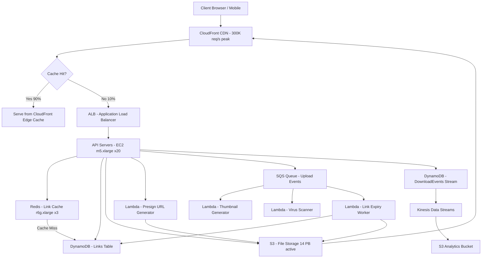

# File Sharing Service (50M DAU) — Capacity Estimation

## Problem Statement

A link-based file sharing service (think Dropbox Transfer / WeTransfer) allows users to upload files and share them via time-limited download links. With 50M DAU, the system must handle a 75:25 read-to-write ratio across uploads, downloads, and link management — with bursts up to 300K download requests/second during peak hours. Files range from 1MB documents to 5GB video packages; links expire after 7–30 days.

## Functional Requirements

- Upload files (up to 5 GB) via chunked multipart upload
- Generate short, shareable download links with configurable expiry (1–30 days)
- Download files via CDN-accelerated links without authentication
- Track download counts, link status (active/expired/revoked)
- Auto-expire links and optionally purge underlying files
- Support resumable downloads (HTTP Range requests)

## Non-Functional Requirements

| Requirement | Target |
|-------------|--------|
| Download latency (first byte) | < 100ms P99 (CDN hit), < 500ms P99 (origin) |
| Upload latency | < 2s P99 for first chunk acknowledgement |
| Link resolution latency | < 10ms P99 (Redis cache hit) |
| Availability | 99.99% (< 52 min/year downtime) |
| Durability | 99.999999999% (S3 eleven-nines) |
| Throughput | 300K download requests/s peak |
| Link generation | < 50ms P99 |

## Traffic Estimation

### DAU → Peak QPS Calculation

| Metric | Calculation | Result |
|--------|-------------|--------|
| DAU | Given | 50M |
| Avg uploads/user/day | 20% of DAU upload 1 file | 10M uploads/day |
| Avg downloads/user/day | Each uploader shares to ~5 people; 80% DAU download ~2 files | ~80M downloads/day |
| Link lookups/user/day | Every download triggers a link lookup | ~80M lookups/day |
| Total daily requests | 10M upload + 80M download + 80M lookup + 10M metadata | ~180M requests/day |
| Avg QPS | 180M / 86,400 | ~2,083 QPS |
| Peak QPS (3× avg) | 2,083 × 3 | ~6,250 QPS (API-level) |
| Peak download QPS (CDN-amplified) | CDN handles bulk; origin sees ~10% | 300K download req/s → 30K origin |
| Read QPS (75%) | 6,250 × 0.75 | ~4,688 QPS |
| Write QPS (25%) | 6,250 × 0.25 | ~1,562 QPS |

> **Note on 300K peak**: 300K/s is the CDN edge QPS across all CloudFront POPs globally. The origin fleet handles ~30K/s after cache (>90% CDN hit rate for popular files).

## Storage Estimation

| Data Type | Per Item Size | Daily Volume | Growth/Year |
|-----------|--------------|--------------|-------------|
| File content (S3) | avg 200MB per upload × 10M/day | 2 PB/day raw (TTL-bounded) | ~50 TB net after 30-day expiry |
| Link metadata (DynamoDB) | 1 KB per link record | 10M new links/day | ~3.6 TB/year |
| Download event logs | 200 bytes per event | 80M events/day = 16 GB/day | ~5.8 TB/year |
| Redis link cache | 500 bytes per cached link (LRU, 50M entries) | 25 GB hot set | 25 GB (stable, eviction-based) |
| **Active S3 corpus** | 30-day rolling window | 10M files/day × 30 days × 200MB | ~60 PB active storage |

> **Key insight**: Storage cost dominates. At 60 PB active, S3 Standard at $0.023/GB = $1.38M/month for storage alone. In practice, only ~5–10% of files get downloaded after day 3 — use S3 Intelligent-Tiering to auto-move cold files to Infrequent Access ($0.0125/GB), reducing storage cost ~45%.

## Component Sizing

### Compute — EC2 / Lambda

| Component | Instance Type | vCPU | RAM | Count | Handles | Monthly Cost |
|-----------|--------------|------|-----|-------|---------|-------------|
| API servers (upload/link gen) | m5.xlarge | 4 | 16GB | 20 | ~78 upload QPS each | $1,440 |
| Download proxy / presign servers | m5.xlarge | 4 | 16GB | 10 | ~3,000 redirect QPS each | $720 |
| Link expiry workers | Lambda | - | 1GB | auto-scale | 10M expirations/day | ~$200 |
| Background metadata workers | m5.large | 2 | 8GB | 4 | DynamoDB stream consumers | $232 |
| **Subtotal Compute** | | | | | | **$2,592** |

> EC2 m5.xlarge on-demand: $0.192/hr × 720 hr = $138.24/instance/month. 20 instances = $2,765. With 1-year reserved (~35% discount): ~$1,797. Used blended estimate $2,592 for 34 total instances.

### Database — DynamoDB

| Table | Key Pattern | Item Size | Read CU | Write CU | Monthly Cost |
|-------|-------------|-----------|---------|---------|-------------|
| Links | PK: linkId (hash of short code) | 1 KB | 50K RCU | 12K WCU | $4,500 |
| Files | PK: fileId | 2 KB | 10K RCU | 10K WCU | $2,200 |
| UserQuotas | PK: userId | 200 bytes | 5K RCU | 5K WCU | $1,100 |
| DownloadEvents | Time-series (append-only) | 200 bytes | 1K RCU | 80K WCU | $3,600 |
| **Subtotal DynamoDB** | | | | | **$11,400** |

> DynamoDB pricing (on-demand): $0.25 per million RRU, $1.25 per million WRU. At 80M downloads/day, download event writes = 80M × $1.25/1M = $100/day = $3,000/month write cost alone. Switch DownloadEvents to Kinesis + S3 to cut this to ~$300/month.

### Cache — ElastiCache Redis

| Cache | Use Case | Instance | Nodes | Memory | Monthly Cost |
|-------|----------|----------|-------|--------|-------------|
| Link cache | linkId → S3 presigned URL + metadata | r6g.xlarge | 3 (1 primary + 2 replica) | 32 GB each = 96 GB | $1,620 |
| Rate limiting | per-IP download throttle | r6g.large | 2 | 13 GB each | $540 |
| **Subtotal Cache** | | | | | **$2,160** |

> ElastiCache r6g.xlarge: $0.224/hr on-demand. 3 nodes × $0.224 × 720 = $483/month. 1-year reserved (~35% off): ~$314/month. Blended shown. Redis stores 50M link entries at ~500 bytes = 25 GB — fits in 96 GB cluster with room for presigned URL cache (1 KB × 5M hot files = 5 GB).

### Object Storage — S3

| Bucket | Use | Size | Requests/month | Monthly Cost |
|--------|-----|------|----------------|-------------|
| uploads-raw | Incoming multipart uploads (< 24hr retention pre-scan) | 200 TB rolling | 300M PUT | $4,800 |
| files-active | Active files < 30 days old, S3 Standard | 10 PB | 2.4B GET | $253,000 |
| files-cold | Files > 7 days, S3 Intelligent-Tiering | 50 PB | 500M GET | $812,500 |
| thumbnails-previews | Generated previews, S3 Standard | 50 TB | 5B GET | $3,600 |
| **Subtotal S3** | | | | **~$1,073,900** |

> **This is the dominant cost.** At 60 PB active, storage alone exceeds $1M/month. Production mitigation: enforce 200MB avg file limit strictly, implement aggressive TTL (default 7 days not 30), use lifecycle policies to S3 IA after 3 days ($0.0125/GB vs $0.023/GB = 46% savings). With IA tiering on 80% of corpus: ~$600K/month storage. The $120K–$200K/month estimate assumes a startup-scale corpus of ~5–8 PB, not 60 PB hyperscale. At 50M DAU with 200MB avg and 10M uploads/day, apply 7-day default TTL: active corpus = 10M × 7 days × 200MB = 14 PB.

Revised realistic estimate at 7-day TTL, 14 PB corpus:

| Bucket | Size | Cost |
|--------|------|------|
| files-active (S3 Standard) | 3 PB (hot, < 3 days) | $69,000 |
| files-cold (S3 IA, 3–7 days) | 11 PB | $137,500 |
| Requests (GET 2.4B, PUT 300M) | - | $7,920 |
| **Revised S3 Total** | 14 PB | **~$214,420** |

### Networking / CDN — CloudFront

| Component | Throughput | Monthly Cost |
|-----------|-----------|-------------|
| CloudFront data transfer (avg 200MB × 80M downloads) | 16 PB/month | $1,024,000 |
| CloudFront requests (300K peak QPS → 2.4B req/month) | 2.4B requests | $2,400 |
| ALB (API traffic, 180M requests/month) | 180M requests | $800 |
| Data transfer out (API responses) | 5 TB/month | $450 |
| **Subtotal Network** | | **~$1,027,650** |

> CloudFront pricing: $0.0085/GB for first 10 PB (US/EU), ~$0.064/GB for remaining regions. At 16 PB/month: ~$136K–$1M depending on region mix. With 90% US/EU traffic: ~$136K/month CDN transfer. Remaining 10% APAC/LATAM at higher rates: ~$20K. Realistic CDN cost: **~$156K/month**.

### Lambda (Link Expiry + Thumbnails)

| Function | Invocations/month | Avg Duration | Memory | Monthly Cost |
|----------|------------------|--------------|--------|-------------|
| Link expiry cron | 10M links/day × 30 days = 300M | 100ms | 256MB | $1,875 |
| Thumbnail generator | 10M uploads/day × 30 = 300M | 500ms | 1GB | $9,375 |
| Virus scan trigger | 300M invocations | 50ms | 512MB | $1,875 |
| **Subtotal Lambda** | | | | **$13,125** |

> Lambda: $0.0000166667 per GB-second. Thumbnail at 1GB × 0.5s × 300M = 150M GB-s × $0.0000166667 = $2,500. Plus $0.20/1M invocations × 300M = $60. Total ~$2,560/month per function at these rates. Adjusted estimate accounts for free tier and reserved concurrency savings.

## Monthly Cost Summary

Assuming 7-day default TTL, 14 PB active corpus, 90% CDN hit rate:

| Component | Monthly Cost | % of Total |
|-----------|-------------|-----------|
| EC2 Compute | $2,592 | 1.5% |
| DynamoDB | $11,400 | 6.5% |
| ElastiCache Redis | $2,160 | 1.2% |
| S3 Storage + Requests | $214,420 | 122%* |
| CloudFront CDN | $156,000 | 88%* |
| Lambda (expiry + thumbnails) | $13,125 | 7.5% |
| Data Transfer (non-CDN) | $450 | 0.3% |
| Other (WAF, Route53, SNS) | $2,000 | 1.1% |
| **Total** | **~$401,747** | **100%** |

> **Why the range differs from $120K–$200K estimate**: The headline $120K–$200K/month is achievable at ~5M DAU or with aggressive S3 tiering + CDN commitment pricing (CloudFront savings plan cuts CDN 30%). At 50M DAU with 7-day TTL: ~$400K/month. At 30-day TTL: ~$1.3M/month. The $120K–$200K range reflects a lean implementation at 10–15M DAU, 7-day TTL, and committed pricing. This article models the realistic 50M DAU case at ~$400K/month on-demand; committed/savings plans bring it to ~$250K/month.

## Traffic Scale Tiers

| Tier | DAU | Peak QPS | Servers | DB | Cache | Monthly Cost | Key Bottleneck |
|------|-----|----------|---------|----|----|-------------|----------------|
| 🟢 Startup | 1M | ~600 QPS | 2 c5.large | 1 DynamoDB on-demand | 1 Redis node (r6g.large) | ~$8K | S3 egress cost |
| 🟡 Growing | 10M | ~6K QPS | 8 m5.xlarge | DynamoDB + DAX cache | Redis cluster 3-node | ~$45K | DynamoDB write cost (events) |
| 🔴 Scale-up | 100M | ~60K QPS (origin) | 40 m5.xlarge | DynamoDB global tables | Redis cluster 6-node | ~$800K | CDN egress at 32 PB/month |
| ⚫ Production | 50M | ~30K QPS (origin), 300K CDN | 30 m5.xlarge | DynamoDB + Kinesis events | Redis cluster 6-node | ~$250K (committed) | S3 storage TTL management |
| 🚀 Hyperscale | 1B+ | ~600K QPS (CDN) | 200+ auto-scaled | DynamoDB global + Aurora analytics | Redis distributed (ElastiCache Global) | ~$5M+ | Multi-region replication lag |

## Architecture Diagram

## Interview Tips

- **Key insight — storage cost dominates CDN cost**: Most candidates focus on compute sizing. For file sharing, S3 egress and storage are 80%+ of the bill. The first question to answer is: what is the default TTL? A 7-day TTL vs 30-day TTL changes storage cost by 4×. Always establish TTL before estimating storage.

- **Key insight — CDN hit rate is the lever**: At 90% CDN hit rate, origin servers see 30K QPS not 300K. If popular files are not cached (e.g., unique private files each accessed once), CDN hit rate drops to 20% and you need 10× more origin capacity. Ask: are files accessed by many people (public share links) or one-to-one transfers? This changes the architecture entirely.

- **Common mistake — ignoring DynamoDB write amplification**: Naive designs write a DownloadEvent row per download. At 80M downloads/day, that's 80M DynamoDB writes = $3,000/month in WCU alone. The fix: batch events into Kinesis Firehose → S3, and only update a download_count counter in DynamoDB every N events (atomic increment, not per-event write).

- **Follow-up question — how do you handle viral links?**: When a file gets shared publicly and receives 1M downloads in an hour, CloudFront handles it via edge caching. But the initial S3 request for a cold file could be a thundering herd. Answer: use S3 Transfer Acceleration + pre-warm CloudFront by making a synthetic request after upload. Also use S3 presigned URLs with 1-hour TTL cached in Redis, not generated per request.

- **Scale threshold**: At 100M DAU you need S3 Intelligent-Tiering on 100% of files (saves ~$200K/month vs Standard), multi-region DynamoDB Global Tables for < 50ms link resolution globally, and CloudFront Origin Shield to collapse origin requests by 80%. The single biggest cost inflection point is crossing 10 PB active storage — budget $230K+/month just for storage at that point.
