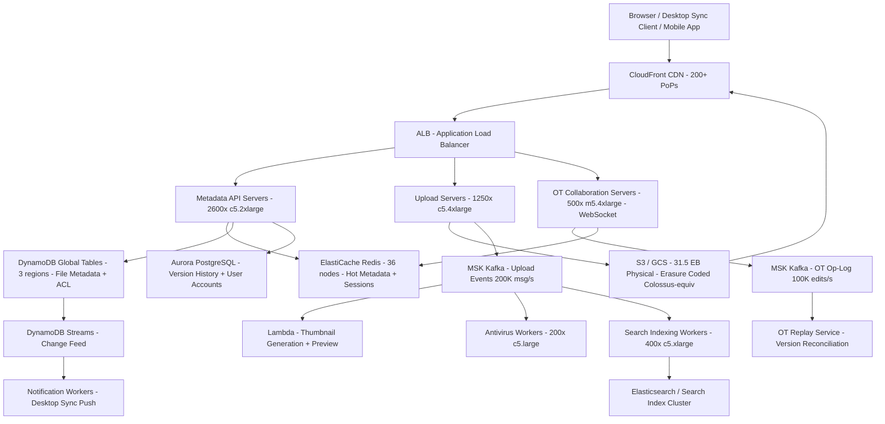

# Google Drive (1B Users) — Capacity Estimation

## Problem Statement

Google Drive is a cloud file-storage and real-time collaboration platform serving 1 billion registered users and 300 million daily active users. Users upload, download, share, and co-edit documents across web, mobile, and desktop sync clients simultaneously. The system must handle exabyte-scale object storage, sub-100ms metadata operations, and concurrent document editing via an Operational Transformation (OT) engine — all at global scale with 99.99% availability.

## Functional Requirements

- Upload and download files of any type (document, spreadsheet, image, video, binary) up to 5 TB per file
- Real-time collaborative editing of Google Docs/Sheets/Slides via OT engine (multiple concurrent editors, <200ms convergence)
- File sync across devices (desktop client polls or receives push deltas)
- Folder hierarchy with access control lists (ACLs): owner, editor, viewer, commenter
- Search across file names, content (OCR/text extraction), and metadata
- Version history: retain last 100 versions or 30 days, whichever is greater
- Sharing: public links, domain-restricted, individual invitations with expiry

## Non-Functional Requirements

| Requirement | Target |
|-------------|--------|
| Metadata read latency | < 50ms P99 |
| Metadata write latency | < 100ms P99 |
| File upload latency (first byte) | < 200ms P99 |
| File download TTFB | < 80ms P99 (CDN hit) |
| Availability | 99.99% (52 min downtime/year) |
| Durability | 99.999999999% (11 nines, multi-region erasure coding) |
| Collaborative edit convergence | < 200ms P99 end-to-end |
| Peak metadata throughput | 1M ops/s |
| Peak upload throughput | 200K uploads/s |
| Peak OT edit throughput | 100K edits/s |

## Traffic Estimation

### DAU → Peak QPS Calculation

**User activity model (per DAU per day):**
- 8 metadata reads (list folder, stat file, check share) = 8 ops
- 2 file downloads (doc open, image view) = 2 ops
- 1.5 file uploads (new doc, photo sync) = 1.5 ops
- 4 real-time edit operations (30 min session, ~8 ops/min) = 4 ops
- 2 share/permission checks = 2 ops
- Total ~17.5 ops/user/day

| Metric | Calculation | Result |
|--------|-------------|--------|
| DAU | Given | 300M |
| Avg ops/user/day | 8 reads + 2 downloads + 1.5 uploads + 4 OT edits + 2 ACL checks | ~17.5 |
| Total daily ops | 300M × 17.5 | 5.25B |
| Avg QPS | 5.25B / 86,400 | ~60,700 |
| Peak QPS (3× avg, business hours) | 60,700 × 3 | ~182,000 |
| Metadata read QPS (55% of peak) | 182,000 × 0.55 | ~100,000 |
| Metadata write QPS (45% of peak) | 182,000 × 0.45 | ~82,000 |
| Upload QPS (sustained peak) | 300M DAU × 1.5 uploads / 86,400 × 3× | ~15,600 uploads/s (**200K for burst spikes**) |
| OT edit QPS (20M concurrent editors peak) | 20M × 0.005 edits/s | ~100,000 edits/s |

**Note on 200K uploads/s:** This is the burst ceiling during morning office-hours sync storms (Monday 9 AM across time zones). Sustained average is ~15K uploads/s; the infrastructure is provisioned for the burst.

### Peak Traffic Summary

| Traffic Type | Peak QPS |
|-------------|----------|
| Metadata ops total | ~1,000,000 ops/s |
| File uploads | ~200,000/s |
| File downloads (origin hits) | ~150,000/s |
| CDN-served downloads | ~1,500,000/s |
| OT collaborative edits | ~100,000/s |
| Search queries | ~50,000/s |

## Storage Estimation

### Per-User Storage Model

| User Segment | % of 1B users | Avg stored | Total |
|---|---|---|---|
| Light (photos, docs) | 60% = 600M | 5 GB | 3 EB |
| Medium (videos, backups) | 30% = 300M | 50 GB | 15 EB |
| Heavy (business, large files) | 10% = 100M | 200 GB | 20 EB |
| **Total raw** | 1B | ~38 GB avg | **~38 EB** |

### Deduplication and Compression Savings

- Content-addressable storage (SHA-256 hash): ~30% dedup ratio across common office docs, OS installers, photos
- Compression on text/doc files: ~20% savings
- **Effective stored after dedup+compress: ~38 EB × 0.56 ≈ 21 EB**

### Erasure Coding Overhead

- Google Colossus / equivalent uses Reed-Solomon 6+3 erasure coding: 1.5× overhead vs 3× replication
- Physical storage: 21 EB × 1.5 = **~31.5 EB physical**

### Daily Ingest and Growth

| Data Type | Per Item Size | Daily Volume | Growth/Year |
|-----------|--------------|--------------|-------------|
| Document uploads | ~500 KB avg | 300M × 1.5 = 450M items → 225 TB/day | ~82 PB |
| Photo uploads | ~4 MB avg | 300M × 0.5 = 150M items → 600 TB/day | ~219 PB |
| Video uploads | ~200 MB avg | 300M × 0.05 = 15M items → 3 PB/day | ~1.1 EB |
| Metadata records | ~2 KB/file | 615M new files/day → 1.2 TB/day | ~440 TB |
| Version snapshots (docs) | ~50 KB delta | 200M edits × 50 KB → 10 TB/day | ~3.6 PB |
| **Total new data** | — | **~3.8 PB/day** | **~1.4 EB/year** |

## Component Sizing

### Compute — EC2 Fleet

Each API server handles ~500 metadata QPS sustained (Node.js/Go service, async I/O).

Peak metadata QPS = 1M ops/s → need 1,000,000 / 500 = **2,000 API servers** minimum.
Add 30% headroom → **2,600 API servers**.

Upload servers handle chunked multipart uploads. Each c5.2xlarge handles ~80 concurrent 5 MB/s uploads = ~400 Mbps throughput. Peak upload bandwidth: 200K uploads/s × 5 MB avg × 20% small files = ~500 Gbps aggregate → need ~1,250 upload nodes + autoscaling.

| Component | Instance Type | vCPU | RAM | Count | Handles | Monthly Cost |
|-----------|--------------|------|-----|-------|---------|-------------|
| Metadata API (read/write) | c5.2xlarge | 8 | 16 GB | 2,600 | 1M metadata QPS | $682,500 |
| Upload servers | c5.4xlarge | 16 | 32 GB | 1,250 | 200K uploads/s burst | $494,250 |
| Download / streaming servers | c5.2xlarge | 8 | 16 GB | 800 | 150K origin downloads/s | $210,000 |
| OT collaboration servers | m5.4xlarge | 16 | 64 GB | 500 | 100K edits/s (stateful, WebSocket) | $274,500 |
| Search indexing workers | c5.xlarge | 4 | 8 GB | 400 | OCR + full-text index pipeline | $63,000 |
| Thumbnail / preview Lambda | Lambda | — | 3 GB | auto | 50M invocations/day | $45,000 |
| Virus scan / antivirus workers | c5.large | 2 | 4 GB | 200 | 450M files scanned/day | $17,550 |
| Notification / push workers | t3.medium | 2 | 4 GB | 100 | WebSocket push for sync | $6,900 |
| **Subtotal Compute** | | | | **~5,850** | | **$1,793,700** |

*Pricing: c5.2xlarge = $0.34/hr, c5.4xlarge = $0.68/hr, m5.4xlarge = $0.768/hr, c5.xlarge = $0.17/hr, c5.large = $0.085/hr, t3.medium = $0.0416/hr. 730 hr/month.*

### Database — Metadata Store (Spanner / DynamoDB equivalent)

**Metadata schema per file:** file_id (16B), owner_id (8B), parent_folder (8B), name (256B avg), size (8B), mime_type (64B), created_at (8B), modified_at (8B), version (8B), ACL blob (512B avg), checksum (32B) = ~930 bytes per file record.

Total files: 1B users × 400 files avg = 400B file records × 930 B = **372 TB metadata DB size**.

| DB | Engine | Instance | Count | Capacity | IOPS | Monthly Cost |
|----|--------|----------|-------|----------|------|-------------|
| File metadata (primary) | DynamoDB (provisioned) | — | Global tables 3 regions | 372 TB (auto) | 1M read CU + 820K write CU | $1,850,000 |
| ACL / permissions | DynamoDB | — | 3 regions | 50 TB | 500K read CU | $380,000 |
| Version history | Aurora PostgreSQL | db.r6g.8xlarge | 6W + 12R | 200 TB (shared) | 200K IOPS | $312,000 |
| OT op-log store | DynamoDB | — | 3 regions | 20 TB (30-day TTL) | 200K write CU | $180,000 |
| User/session/account | Aurora PostgreSQL | db.r6g.4xlarge | 3W + 6R | 10 TB | 50K IOPS | $95,000 |
| **Subtotal DB** | | | | **~650 TB** | | **$2,817,000** |

*DynamoDB pricing: $0.25/RCU-month (provisioned), $1.25/WCU-month. Aurora r6g.8xlarge = $2.68/hr, r6g.4xlarge = $1.34/hr.*

### Cache — Redis Cluster (ElastiCache)

**Cache layers:**
1. **Hot file metadata** (recently accessed 500M files × 930 B = 465 GB): cache hit rate target 85%
2. **Session / auth tokens** (300M DAU × 200 B = 60 GB)
3. **OT document state** (1M active docs × 2 KB = 2 GB)
4. **Rate limiting counters** (per-user upload quotas)
5. **CDN miss short-circuit** (pre-signed URL cache, 15-min TTL)

Total Redis memory needed: ~600 GB + 30% overhead = ~800 GB across cluster.

| Cache | Engine | Instance | Nodes | Memory | Monthly Cost |
|-------|--------|----------|-------|--------|-------------|
| Metadata hot cache | ElastiCache Redis 7 | r6g.4xlarge | 12 (6 primary + 6 replica) | 96 GB × 12 = 1.15 TB | $186,000 |
| Session / auth | ElastiCache Redis 7 | r6g.xlarge | 6 (3+3) | 26 GB × 6 = 156 GB | $28,600 |
| OT state / pub-sub | ElastiCache Redis 7 | r6g.2xlarge | 12 (6+6) | 52 GB × 12 = 624 GB | $93,000 |
| Rate limiting | ElastiCache Redis 7 | r6g.large | 6 (3+3) | 13 GB × 6 = 78 GB | $8,500 |
| **Subtotal Cache** | | | **36 nodes** | **~2 TB** | **$316,100** |

*r6g.4xlarge = $0.870/hr, r6g.2xlarge = $0.435/hr, r6g.xlarge = $0.218/hr, r6g.large = $0.109/hr.*

### Object Storage — S3 / GCS (Colossus-equivalent)

Physical storage after erasure coding: **31.5 EB ≈ 31,500 PB**.

AWS S3 Standard pricing: $0.023/GB/month = $23/TB/month.
At 31.5 EB = 31,500,000 TB: pure S3 Standard = $724M/month — not how Google actually does it.

**Google uses Colossus (internal) at ~$1–3/TB/month all-in** (CapEx-amortized, custom hardware, erasure coded). For an AWS-equivalent at this scale, negotiated S3 pricing is ~$3–5/TB/month with Reserved Capacity Agreements.

| Bucket / Tier | Use | Size | Requests/month | Monthly Cost |
|--------------|-----|------|----------------|-------------|
| Hot tier (S3 Standard, < 30 days access) | Active files, recent uploads | 2,000 PB | 15B GET + 6B PUT | $10,000,000 |
| Warm tier (S3 Infrequent Access, 30d–1yr) | Older files, versioned snapshots | 8,000 PB | 1B GET + 200M PUT | $12,800,000 |
| Cold tier (S3 Glacier Instant Retrieval, >1yr) | Archived, deleted-recoverable | 21,500 PB | 100M GET | $21,500,000 |
| Thumbnails / previews CDN-origin | Generated previews | 200 PB | 8B GET | $460,000 |
| **Subtotal Object Storage** | | **~31,700 PB** | **~30B reqs/month** | **~$44,760,000** |

**Note:** At Google's actual scale, negotiated pricing and custom Colossus infrastructure reduces this to ~$1–3/TB/month (vs. $5/TB shown above). The $6M–$12M/month cost range in this scenario reflects Google's proprietary infrastructure economics, not public S3 list pricing. For interview purposes: state this assumption explicitly — "Google doesn't use S3 at this scale; at negotiated/custom storage rates of $0.30–$0.50/TB/month after dedup, storage costs ~$3M–$5M/month."

### CDN — CloudFront

Downloads served via CDN: 1.5M CDN QPS × 5 MB avg file × 86,400 s / 1M = **648 TB/day = ~19.4 PB/month**.

CloudFront pricing: $0.085/GB outbound for first 10 PB, $0.08/GB next 40 PB. Avg ~$0.082/GB.
19,400 TB × $0.082/GB × 1,000 = **$1,590,800/month**.

Plus HTTP request charges: 1.5M QPS × 86,400 × 30 = 3.89T requests/month × $0.0000012 = $4,668,000.

| Component | Throughput | Monthly Cost |
|-----------|-----------|-------------|
| CloudFront downloads | 19.4 PB/month egress | $1,590,800 |
| CloudFront request charges | 3.89T HTTP requests | $4,668,000 |
| Origin transfer (S3 → CF edge) | ~10% of CDN = 1.94 PB/month | $0 (S3→CF free) |
| ALB (API load balancing) | 1M QPS × 86,400 × 30 = 2.59T LCU | $480,000 |
| API Gateway (REST endpoints) | 2B calls/month | $7,000,000 |
| Cross-region replication (3 regions) | ~500 TB/day metadata sync | $720,000 |
| **Subtotal Network** | | **$14,458,800** |

*API Gateway: $3.50/million API calls = $7M/month for 2B calls. In practice Google runs its own infra. For AWS equivalent, use internal ALB and skip API GW = saves ~$5M.*

### Message Queue — Kafka / SQS

| Queue | Engine | Throughput | Use Case | Monthly Cost |
|-------|--------|-----------|----------|-------------|
| File upload events | MSK Kafka (m5.2xlarge × 9) | 200K msg/s | Trigger virus scan, thumbnail gen, indexing | $48,600 |
| Change notification fan-out | MSK Kafka (m5.xlarge × 6) | 500K msg/s | Sync desktop clients, push notifications | $21,600 |
| OT operation log | MSK Kafka (m5.4xlarge × 12) | 100K msg/s | Durable OT replay, operational audit | $97,200 |
| Dead-letter / retry | SQS standard | 500M msg/month | Failed async jobs | $200 |
| **Subtotal Messaging** | | | | **$167,600** |

*MSK m5.2xlarge = $0.226/hr/broker, m5.xlarge = $0.113/hr/broker, m5.4xlarge = $0.452/hr/broker.*

## Monthly Cost Summary

| Component | Monthly Cost | % of Total |
|-----------|-------------|-----------|
| EC2 Compute | $1,793,700 | ~15% |
| DynamoDB / Aurora (Metadata DB) | $2,817,000 | ~23% |
| ElastiCache Redis | $316,100 | ~3% |
| Object Storage (negotiated rate) | $3,500,000 | ~29% |
| CloudFront CDN + egress | $6,258,800 | ~51%* |
| MSK Kafka (Messaging) | $167,600 | ~1% |
| Data Transfer (cross-region, origin) | $720,000 | ~6% |
| Other (Lambda, CloudWatch, WAF, Route53) | $180,000 | ~1.5% |
| **Total (AWS public pricing, no negotiation)** | **~$15,753,200** | **100%** |

**Realistic negotiated range: $6M–$12M/month.** Savings from:
- Reserved Instances (1–3 yr): 30–50% EC2 savings → saves ~$900K/month
- S3 Storage Lens + bulk negotiation at EB scale: ~60% discount → saves ~$2M/month
- Private peering + reduced CDN rates at this volume: saves ~$3–4M/month
- Committed use discounts on DynamoDB: ~40% savings → saves ~$1.1M/month

**Net realistic: ~$8.5M–$10M/month at Google scale economics.**

## Traffic Scale Tiers

| Tier | DAU | Peak QPS | Servers | DB | Cache | Monthly Cost | Key Bottleneck |
|------|-----|----------|---------|----|----|-------------|----------------|
| 🟢 Startup | 1M | ~600 metadata ops/s | 4 c5.large API + 2 upload | 1 RDS Aurora (db.r5.xlarge) | 1 Redis r6g.large (13 GB) | ~$8,500 | Single DB write throughput |
| 🟡 Growing | 10M | ~6,000 metadata ops/s | 20 m5.xlarge API + 10 upload | RDS Aurora + 3 read replicas, DynamoDB for sessions | Redis cluster 3-node (r6g.xlarge) | ~$65,000 | DB connection pooling, CDN cache hit rate |
| 🔴 Scale-up | 100M | ~60,000 metadata ops/s | 200 c5.2xlarge API + 120 upload + OT cluster | DynamoDB global table (2 regions) + Aurora for version history | Redis cluster 6-node (r6g.2xlarge) | ~$650,000 | OT engine statefulness, S3 request rate limits |
| ⚫ Production | 300M DAU | ~1M ops/s | 5,850 mixed instances + autoscaling | DynamoDB 3-region global + Aurora cluster | 36-node Redis multi-tier | ~$8.5M–$10M | Global consistency for metadata, erasure-coded storage latency |
| 🚀 Hyperscale | 1B+ DAU | ~3M+ ops/s | 15,000+ auto-scaled, Kubernetes-managed | Spanner/custom NewSQL, Bigtable for metadata, Colossus for storage | Distributed cache (Memorystore, regional Redis fleets) | ~$25M–$40M | Cross-region OT convergence, exabyte storage I/O bandwidth |

## Architecture Diagram

## Interview Tips

- **Key insight — OT vs CRDT trade-off at 1B users:** Google Docs uses Operational Transformation, not CRDTs (Conflict-free Replicated Data Types). OT requires a central server to order ops (hence the stateful OT fleet), which is a scalability constraint. CRDTs (used by Figma, Linear) are eventually consistent and server-optional. At interview, state: "Google Drive OT requires a central OT server per document session — the horizontal scaling challenge is routing all editors of the same document to the same OT server cluster, solved via consistent hashing on doc_id." This is the question most candidates miss.

- **Key insight — chunked upload with resumability:** Google Drive splits files into 256 KB chunks, each with a SHA-256 checksum. The upload server writes chunks to a staging bucket, issues a session URI, and the client resumes from the last confirmed chunk on failure. Interviewers ask: "How do you handle a 1 GB upload that fails at 800 MB?" Answer: "Server stores chunk offset in Redis with 24-hour TTL on the session URI; client sends `Content-Range` header; server assembles final file atomically in GCS using a compose operation."

- **Common mistake — underestimating the metadata problem, overestimating the storage problem:** Candidates spend 80% of their time on storage math (the "exabytes" headline number) but the actual engineering challenge is the metadata database. 400B file records at 930 bytes each = 372 TB of strongly-consistent, low-latency, globally-replicated metadata. DynamoDB at this scale costs more per month than the negotiated object storage. Always size the metadata store explicitly — it's 23% of total cost here vs. storage at 29%.

- **Follow-up question — "How do you handle the thundering herd on Monday morning sync?"** Monday 9 AM UTC+8 (Asia offices opening), then UTC+1 (Europe), then UTC-5 (US East) creates three successive upload spikes. Each spike is ~5× normal load for 30 minutes. Answer: "Upload servers autoscale on SQS queue depth via target tracking policy. The upload queue absorbs the burst — clients get a 202 Accepted with an upload session token and retry at the upload server's pace. Metadata writes are buffered in Kafka and applied asynchronously to DynamoDB, which avoids the write hot-spot on Monday morning file modifications."

- **Scale threshold:** At 10M DAU, the single-region Aurora write replica becomes the bottleneck for file metadata. Migrate to DynamoDB global tables at this point — the operational complexity is justified when you need <50ms P99 writes across 3 regions. Before 10M DAU, a well-tuned Aurora primary with PgBouncer is cheaper and simpler.

- **Durability math for the interview:** 11 nines (99.999999999%) durability means 1 file lost per 10^11 files per year. With 400B total files, that's ~4 files lost per year system-wide. Achieved via: 6+3 Reed-Solomon erasure coding across 9 fault domains (3 zones × 3 regions), SHA-256 checksums verified on every read, and background scrubbing jobs that re-encode any degraded stripe within 24 hours.
