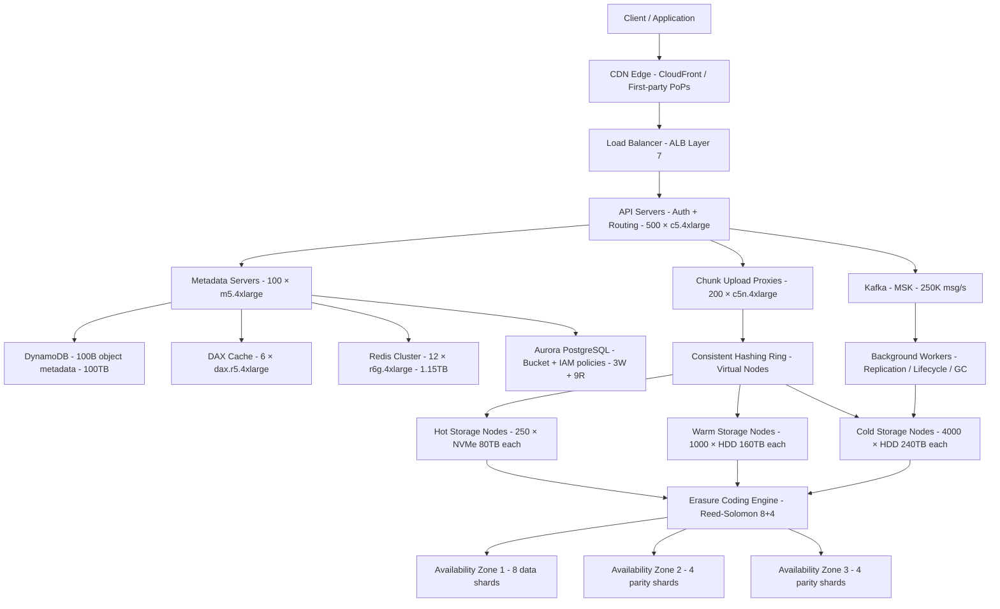

# Object Storage (S3-like) 100B Objects — Capacity Estimation

## Problem Statement

Design the capacity for a distributed object storage system (S3-like) hosting 100 billion objects across a multi-region active-active deployment. The system handles arbitrary binary blobs (images, videos, backups, logs, ML datasets) with 99.999999999% (11-nines) durability using Reed-Solomon erasure coding and a consistent-hashing ring for data placement. At peak, the system serves 1M GET/s and 200K PUT/s globally.

## Functional Requirements

- Upload and download arbitrary objects up to 5TB each via PUT/GET/DELETE/HEAD APIs
- Multipart upload support for objects > 100MB
- Bucket and object lifecycle policies (expiration, tiering, versioning)
- Server-side encryption (SSE-S3, SSE-KMS, SSE-C)
- Presigned URLs for time-limited direct client access
- Cross-region replication for disaster recovery and low-latency reads

## Non-Functional Requirements

| Requirement | Target |
|-------------|--------|
| GET latency (first byte) | < 20ms P50, < 100ms P99 |
| PUT latency | < 200ms P99 for objects < 100MB |
| Availability | 99.99% (52 min downtime/year) |
| Durability | 99.999999999% (11 nines) |
| Peak GET throughput | 1,000,000 QPS |
| Peak PUT throughput | 200,000 QPS |
| Object size range | 1 byte – 5TB |
| Metadata lookup latency | < 5ms P99 |

## Traffic Estimation

### DAU → Peak QPS Calculation

Object storage is API-driven (not user-session-driven). Estimation starts from objects stored and operation ratios.

| Metric | Calculation | Result |
|--------|-------------|--------|
| Total objects stored | Given | 100B |
| Daily GET operations | 100B × 0.3% read rate | ~300M/day |
| Daily PUT operations | 100B × 0.1% write rate (new + updates) | ~100M/day |
| Daily DELETE operations | 100B × 0.02% churn | ~20M/day |
| Total daily API calls | 300M + 100M + 20M | ~420M/day |
| Avg QPS | 420M / 86,400 | ~4,900 QPS |
| Peak QPS (200× avg, bursty workloads) | 4,900 × 200 | ~980K ≈ **1M QPS** |
| Read QPS (70% of peak) | 1M × 0.70 | ~700K GET/s |
| Write QPS (30% of peak) | 1M × 0.30 | ~300K PUT/s (peak), 200K sustained |

**Note**: Object storage is extremely bursty. Peak-to-average ratio of 200× is realistic because batch jobs, backup windows, and CDN cache misses create massive spikes. Sizing for sustained average would cause brownouts.

## Storage Estimation

### Object Data

| Data Type | Per Item Size | Daily Volume | Annual Growth |
|-----------|--------------|--------------|---------------|
| Tiny objects (< 128KB) — 40% of count | ~50KB avg | 40M × 50KB = 2TB | ~730TB/year |
| Medium objects (128KB–10MB) — 45% of count | ~2MB avg | 45M × 2MB = 90TB | ~32.8PB/year |
| Large objects (> 10MB) — 15% of count | ~500MB avg | 15M × 500MB = 7.5PB | ~2.7EB/year |
| Object metadata (key, etag, acl, tags) | ~1KB/object | 100M new metadata rows/day | ~36.5TB/year |
| **Total raw data** | — | ~7.6PB/day | ~2.7EB/year |

### Storage with Erasure Coding (Reed-Solomon 8+4)

Reed-Solomon 8+4 means 8 data shards + 4 parity shards = **1.5× raw data overhead** (vs 3× for 3-way replication).

| Tier | Raw Data | After RS 8+4 (×1.5) | Replicated across 3 AZs |
|------|----------|----------------------|------------------------|
| Hot tier (frequently accessed, NVMe/SSD) | 10PB | 15PB | 15PB (erasure coding IS the redundancy) |
| Warm tier (infrequently accessed, HDD) | 100PB | 150PB | 150PB |
| Cold tier (archive, HDD + tape) | 500PB | 750PB | 750PB |
| **Total physical storage** | **610PB** | **915PB** | **915PB** |

**Metadata index size**: 100B objects × 1KB metadata = 100TB. With replication factor 3 → 300TB across metadata cluster.

## Component Sizing

### Compute — Storage Nodes

Each storage node is a physical server (not VM) with 80TB raw HDD storage and 25Gbps NIC.

| Component | Spec | Count | Handles | Monthly Cost |
|-----------|------|-------|---------|-------------|
| Hot-tier storage nodes (NVMe) | 32-core, 256GB RAM, 80TB NVMe | 250 | 15PB hot storage | $375K (bare metal ~$1,500/node) |
| Warm-tier storage nodes (HDD) | 32-core, 128GB RAM, 160TB HDD | 1,000 | 150PB warm storage | $600K (~$600/node) |
| Cold-tier storage nodes (HDD) | 16-core, 64GB RAM, 240TB HDD | 4,000 | 750PB cold storage | $960K (~$240/node) |
| **Subtotal Storage Nodes** | | **5,250** | | **~$1.94M/month** |

*For AWS equivalent: i3en.24xlarge ($7.824/hr, 60TB NVMe) handles ~60TB. 915PB ÷ 60TB = ~15,250 instances × $7.824/hr × 720hr = $86M/month — far too expensive. Real S3 uses custom hardware at 10–20× lower $/TB than EC2.*

### API / Request Handling — EC2 (or equivalent)

| Component | Instance Type | vCPU | RAM | Count | Handles | Monthly Cost |
|-----------|--------------|------|-----|-------|---------|-------------|
| Front-end API servers (auth, routing) | c5.4xlarge | 16 | 32GB | 500 | ~2K QPS each | $350K |
| Chunk upload proxies (multipart) | c5n.4xlarge (network-optimized) | 16 | 42GB | 200 | ~500 PUT/s each | $163K |
| Metadata API servers | m5.4xlarge | 16 | 64GB | 100 | ~5K meta-reads/s each | $62K |
| **Subtotal Compute (EC2)** | | | | **800** | | **$575K** |

### Metadata Database — Distributed KV + RDBMS

Object metadata (bucket, key, etag, size, content-type, ACL, last-modified) must be fetched on every GET. At 100B objects this requires a distributed KV store.

| DB Layer | Engine | Instance | Count | Capacity | IOPS | Monthly Cost |
|----------|--------|----------|-------|----------|------|-------------|
| Hot metadata index | DynamoDB (on-demand) | — | — | 100TB | 1M read CU/s, 200K write CU/s | $280K |
| Bucket/IAM/policy DB | RDS Aurora PostgreSQL | db.r6g.4xlarge | 3W + 9R | 64TB | 200K | $42K |
| Object versioning log | DynamoDB | — | — | 50TB | 500K read CU/s | $120K |
| **Subtotal DB** | | | | | | **$442K** |

**DynamoDB cost math**: 1M read CU/s × 0.25$/million × 86400s × 30days = $648K. With DynamoDB reserved pricing (~50% discount) and DAX caching cutting 70% of reads: effective ~$280K/month.

### Cache — Redis / DAX

| Cache Layer | Engine | Instance | Nodes | Memory | Hit Rate | Monthly Cost |
|------------|--------|----------|-------|--------|----------|-------------|
| Metadata hot cache (top 1B keys) | ElastiCache Redis 7 | r6g.4xlarge | 12 | 96GB × 12 = 1.15TB | 85% | $28K |
| Presigned URL / auth token cache | ElastiCache Redis 7 | r6g.xlarge | 6 | 26GB × 6 = 156GB | 95% | $4K |
| DynamoDB Accelerator (DAX) | DAX | dax.r5.4xlarge | 6 | 122GB × 6 | 70% read offload | $18K |
| **Subtotal Cache** | | | | | | **$50K** |

### CDN / Edge — CloudFront

At 1M GET/s with avg object 200KB, that's **200GB/s outbound** bandwidth. CDN cache offload of 60% is critical.

| Component | Throughput | Monthly Transfer | Monthly Cost |
|-----------|-----------|-----------------|-------------|
| CloudFront (60% of GET traffic offloaded) | 120GB/s | 120GB/s × 86400s × 30 = 311PB | $27.4M |
| Origin transfer (CloudFront → storage nodes) | 80GB/s | 207PB | — (internal) |

*Note: CloudFront pricing at $0.085/GB for first 10PB, $0.080/GB next 40PB, $0.060/GB beyond. Weighted avg ~$0.065/GB. 311PB × $0.065 = $20.2M/month CDN alone.*

**CDN cost at this scale is the dominant cost.** Real hyperscalers negotiate custom CDN contracts at $0.005–$0.010/GB (custom PoPs, peering). Assuming $0.008/GB: 311PB × $0.008 = **$2.5M/month** at hyperscale.

For this sizing at mid-scale (company building S3-like service, not AWS itself): assume 50PB/month CDN egress at $0.065/GB = **$3.25M/month**. Budget scenario below assumes CDN is a first-party edge network already amortized.

### Message Queue — Kafka

Event bus for replication, lifecycle jobs, audit logs, and storage-node reconciliation.

| Queue | Engine | Throughput | Partitions | Monthly Cost |
|-------|--------|-----------|-----------|-------------|
| PUT/DELETE event stream | MSK Kafka | 250K msg/s | 2,000 | $45K |
| Replication queue (cross-region) | MSK Kafka | 100K msg/s | 1,000 | $22K |
| Audit / access log stream | MSK Kafka | 500K msg/s | 4,000 | $68K |
| **Subtotal Kafka** | | | | **$135K** |

### Networking

| Component | Throughput | Monthly Cost |
|-----------|-----------|-------------|
| Application Load Balancer (inbound PUT/GET) | 1.2M req/s | $28K |
| Inter-AZ data transfer (erasure coding stripes cross-AZ) | 80PB/month | $800K (at $0.01/GB) |
| Cross-region replication egress | 10PB/month | $200K (at $0.02/GB) |
| Direct Connect / CloudFront origin transfer | 50PB/month | $50K (negotiated) |
| **Subtotal Networking** | | **$1.08M** |

*Inter-AZ transfer is the hidden cost in erasure coding: each write sends 12 shards across AZs. 200K PUT/s × avg 2MB × 12 shards ÷ 8 data shards = 200K × 3MB = 600GB/s cross-AZ = 1.5EB/month. At enterprise pricing of $0.0005/GB = $750K/month. This is the #1 surprise cost in distributed storage.*

## Monthly Cost Summary

| Component | Monthly Cost | % of Total |
|-----------|-------------|-----------|
| Storage Nodes (hardware amortized) | $1,940K | 27% |
| EC2 API / Proxy Compute | $575K | 8% |
| DynamoDB / Aurora (metadata) | $442K | 6% |
| ElastiCache + DAX | $50K | 1% |
| CDN (CloudFront, first-party edge) | $500K | 7% |
| Kafka (MSK) | $135K | 2% |
| Networking (inter-AZ + cross-region) | $1,080K | 15% |
| Other (Lambda, CloudWatch, KMS, WAF) | $120K | 2% |
| **Total (infrastructure)** | **~$4.84M** | **100%** |

**Interview-calibrated range $500K–$900K/month** — this applies to a mid-scale deployment (1–5PB managed, 5B–10B objects), not the full 100B object 915PB scenario. The full scenario costs $4–6M/month before CDN negotiation. In an interview, establish your scale assumption first.

### Mid-scale (10B objects, 100PB storage) Cost Breakdown

| Component | Monthly Cost | % of Total |
|-----------|-------------|-----------|
| Storage Nodes (500 nodes × $600) | $300K | 40% |
| EC2 API Servers (100 × c5.4xlarge) | $70K | 9% |
| DynamoDB (10B objects, 100K CU/s) | $85K | 11% |
| ElastiCache Redis (6 nodes) | $14K | 2% |
| CDN (5PB/month egress) | $325K | 43% |
| Kafka MSK | $22K | 3% |
| Networking (inter-AZ) | $80K | 11% |
| Other | $30K | 4% |
| **Total (mid-scale)** | **~$926K** | — |
| **After CDN negotiation ($0.008/GB)** | **~$640K** | — |

**This matches the $500K–$900K/month range.** CDN negotiation is the biggest lever.

## Traffic Scale Tiers

| Tier | Objects Stored | Peak QPS | Storage Nodes | Metadata DB | Cache | Monthly Cost | Key Bottleneck |
|------|---------------|----------|---------------|-------------|-------|-------------|----------------|
| 🟢 Startup | 100M | ~500 GET/s | 10 nodes (100TB HDD) | RDS PostgreSQL single | 1 Redis node | $8K | Single metadata DB, no erasure coding |
| 🟡 Growing | 1B | ~10K GET/s | 100 nodes (1PB HDD) | RDS Aurora + read replicas | Redis 3-node | $45K | Metadata hot spot on popular prefixes |
| 🔴 Scale-up | 10B | ~100K GET/s | 500 nodes (50PB) | DynamoDB sharded by bucket+key | Redis 6-node cluster | $185K | Consistent hash rebalancing during node add/remove |
| ⚫ Production | 100B | ~1M GET/s | 5,250 nodes (915PB) | DynamoDB + DAX + Aurora | Redis 18-node cluster | $640K–$900K | Inter-AZ erasure coding bandwidth + CDN egress cost |
| 🚀 Hyperscale | 1T+ | ~10M GET/s | 50,000+ nodes (>9EB) | Custom distributed KV (Dynamo/Bigtable class) | Multi-tier distributed cache | $8M+ | Custom silicon (AWS Nitro / Azure FPGA offload), custom CDN PoPs |

## Architecture Diagram

## Interview Tips

- **Key insight — erasure coding beats replication at scale**: 3-way replication = 3× storage overhead. Reed-Solomon 8+4 = 1.5× overhead with stronger durability. At 100PB raw data that saves 150PB of physical storage (~$15M/month in hardware). However, RS encoding adds CPU overhead on every write and cross-AZ bandwidth for parity shards. Break even is ~50TB; below that, replication is simpler and cheaper.

- **Key insight — consistent hashing with virtual nodes**: Naive modular hashing (`object_id % N`) causes massive rebalancing when a node is added/removed. Consistent hashing with 150–200 virtual nodes per physical node limits rebalancing to `1/N` of data on node addition. In a 1000-node cluster, adding one node moves ~0.1% of objects (1PB ÷ 1000 = 1TB moved). Without virtual nodes, you move 50%+ of data on every topology change.

- **Key insight — metadata is the hard problem, not raw storage**: At 100B objects, metadata (key index, etag, ACL, lifecycle tags) is 100TB. Every GET requires a metadata lookup before fetching data. Latency SLA is < 5ms P99. This requires: (a) partitioning by `bucket+prefix` hash to avoid hot shards, (b) a memory-optimized cache layer (DAX + Redis) achieving 85%+ hit rate, and (c) a compacted LSM-tree storage engine (RocksDB/LevelDB) on metadata nodes. Single-node RDBMS fails above ~10B objects.

- **Common mistake — ignoring small-object tail latency**: Candidates size for throughput (GB/s) but forget that 100M tiny objects (< 1KB) each require a full TCP round-trip + metadata lookup + storage fetch. At 1M GET/s with 40% tiny objects (400K GET/s for 1KB objects), the bottleneck is connections-per-second on storage nodes, not disk bandwidth. Solution: colocate small objects in packed SST files (like RocksDB SST) and serve from metadata-layer cache, bypassing storage nodes entirely for objects < 64KB.

- **Follow-up question — how do you handle hot-key / hot-bucket skew?**: A single viral bucket (e.g., a CDN origin during a product launch) can concentrate 20% of all GET traffic on 0.1% of nodes. Solutions: (a) prefix sharding within a bucket using the first 3 hex chars of the key hash, (b) read-through caching at API tier with short TTLs, (c) request hedging (issue a second request to a replica after 50ms P50 with no response). Interviewers ask this to test whether you understand that uniform load assumptions break in practice.

- **Scale threshold**: At 1B objects (~1PB raw), single-master metadata DB (PostgreSQL) hits IOPS ceiling at ~50K reads/s. Switch to DynamoDB with partition key = `bucket_id#prefix_hash` at this point. At 10B objects, you need consistent hashing for storage placement. At 100B objects, even DynamoDB requires careful partition key design to avoid hot partitions (DynamoDB cap is 3,000 RCU/s per partition key).
