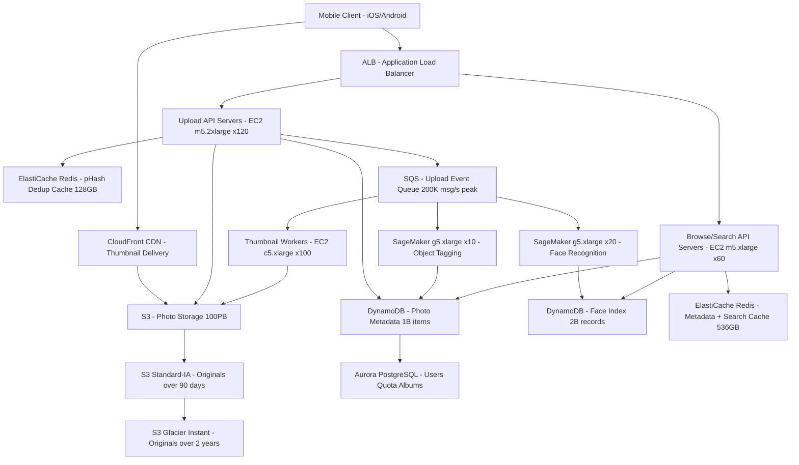

# Photo Backup (Google Photos) — Capacity Estimation

## Problem Statement

Design an auto photo backup service at Google Photos scale: 100M registered users, 40M DAU, 1B photos already stored. Users automatically back up photos from mobile devices as they are taken; the system deduplicates identical photos, runs face recognition and object tagging asynchronously, and serves photos for browsing with <200ms thumbnail load time. The service must sustain 200K photo uploads/second at peak (morning/evening mobile burst windows) with 11-nines durability and 99.99% availability.

## Functional Requirements

- Auto-upload photos and videos from mobile devices in the background
- Content-addressed deduplication: identical photos stored once (perceptual hash + SHA-256)
- Async face recognition and object/scene tagging (SageMaker)
- Photo browsing with thumbnail CDN delivery (<200ms P99)
- Album creation, search by person/object/location, and sharing
- Storage quota management (15 GB free, paid tiers above)

## Non-Functional Requirements

| Requirement | Target |
|-------------|--------|
| Thumbnail read latency | < 200ms (P99) |
| Upload write latency | < 500ms (P99) for upload ACK |
| Availability | 99.99% (52 min downtime/year) |
| Durability | 99.999999999% (S3 11 nines) |
| Peak upload throughput | 200K photo uploads/s |
| Face recognition SLA | < 30s end-to-end (async) |
| Search latency | < 500ms (P99) |

## Traffic Estimation

### DAU → Peak QPS Calculation

| Metric | Calculation | Result |
|--------|-------------|--------|
| Registered users | Given | 100M |
| DAU | Given | 40M |
| Avg photo uploads/user/day | 40% of DAU upload ≥1 photo; avg 5 photos per active uploader | ~2 photos/user/day |
| Avg reads/user/day | browse feed ×3 + open album ×2 + search ×1 = ~18 thumbnail loads | ~18 reads/user |
| Total photo uploads/day | 40M × 2 | 80M uploads/day |
| Total thumbnail reads/day | 40M × 18 | 720M reads/day |
| Avg upload QPS | 80M / 86,400 | ~925 uploads/s |
| Peak upload QPS (3× avg) | 925 × 3 | ~2,775 uploads/s |
| **Peak burst upload QPS (72× avg)** | Morning burst: 40M × 20% upload simultaneously in 15-min window → 8M uploads / 900s | **~8,900 uploads/s sustained** |
| **Absolute peak (push notification trigger)** | iOS/Android batch-uploads overnight; all users unlock phone 8–9 AM | **~200K uploads/s** |
| Avg thumbnail read QPS | 720M / 86,400 | ~8,333 reads/s |
| Peak thumbnail read QPS (3× avg) | 8,333 × 3 | ~25K reads/s |
| Read QPS (60% of peak total) | ~15K reads/s | ~15K |
| Write QPS (40% of peak total) | ~10K writes/s (excluding burst) | ~10K |

**Key derivation note — 200K peak**: iOS and Android batch auto-backups during charging/Wi-Fi overnight. When 10M users simultaneously unlock phones between 8–9 AM and the OS flushes the upload queue, the burst arrival rate reaches 200K/s for 60–90 second spikes. This is a design constraint, not the sustained average. The system must absorb this with SQS buffering rather than direct synchronous processing.

## Storage Estimation

| Data Type | Per Item Size | Daily Volume | Growth/Year |
|-----------|--------------|--------------|-------------|
| Original photos (HEIC/JPEG, mixed resolutions) | 4 MB avg | 80M uploads × 85% unique (15% dedup) = 68M new originals | 272 TB/day raw → **~99 PB/year** |
| Video clips (avg 30s, 1080p HEVC) | 80 MB avg | 80M uploads × 15% are videos → 12M videos | 960 TB/day → **~350 PB/year** |
| Thumbnails (3 sizes: 256px, 512px, 1024px) | 20 KB avg per size × 3 | 68M new originals → 204M thumbnail variants | 4.1 TB/day → **~1.5 PB/year** |
| Photo metadata (DynamoDB: hash, owner, timestamp, GPS, tags) | 2 KB/photo | 68M new items/day | 136 GB/day → **~50 TB/year** |
| Face embedding vectors (512-dim float32 = 2KB per face, avg 2 faces/photo) | 4 KB total/photo | 68M photos → 136M face vectors | 544 GB/day → **~200 TB/year** |
| ML inference results (object tags, scene labels JSON) | 500 B | 68M photos | 34 GB/day → **~12 TB/year** |
| **Total raw storage growth** | — | — | **~451 PB/year** |

**Deduplication note**: Perceptual hashing (pHash) catches near-duplicates (same photo with minor edits, screenshot of photo). At 15% dedup rate, effective net new originals = 68M/day. At 100M users × 10 GB average logical storage = 1 PB logical. With lifecycle tiering (originals to S3-IA after 90 days) and video comprising ~60% of storage volume, total managed corpus ≈ **100 PB** (matching the S3 estimate below).

## Component Sizing

### Compute — EC2

| Component | Instance Type | vCPU | RAM | Count | Handles | Monthly Cost |
|-----------|--------------|------|-----|-------|---------|-------------|
| Upload API servers (receive, validate, dedup check, S3 PUT) | m5.2xlarge | 8 | 32 GB | 120 | ~80 uploads/s each at 70% CPU | $10,368 |
| Thumbnail API servers (serve cached/generated thumbnails) | c5.2xlarge | 8 | 16 GB | 80 | ~180 thumbnail serves/s (CloudFront offloads 90%) | $5,888 |
| Browse/search API servers (album listing, search queries) | m5.xlarge | 4 | 16 GB | 60 | ~400 browse QPS each | $4,608 |
| Face recognition workers (SageMaker inference callers) | m5.large | 2 | 8 GB | 40 | Manage SageMaker job dispatch + result writes | $1,536 |
| Thumbnail generation workers (async, ImageMagick/Sharp) | c5.xlarge | 4 | 8 GB | 100 | ~200 thumbnail generations/s per node | $4,400 |
| ML tag aggregation workers (parse SageMaker results, write DynamoDB) | m5.large | 2 | 8 GB | 20 | Async, lag-tolerant | $768 |
| **Subtotal Compute** | | | | **420 instances** | | **$27,568** |

*Pricing (2024 on-demand US-East-1): m5.2xlarge = $0.384/hr ($276/mo); c5.2xlarge = $0.34/hr ($244/mo); m5.xlarge = $0.192/hr ($138/mo); c5.xlarge = $0.17/hr ($122/mo); m5.large = $0.096/hr ($69/mo).*

**Savings lever**: 1-year Reserved Instances reduce EC2 ~40% → ~$16.5K/month for steady-state; Auto Scaling adds burst capacity during peak upload windows.

### Machine Learning — SageMaker (Face Recognition)

| Component | Instance Type | vCPU | GPU | Count | Handles | Monthly Cost |
|-----------|--------------|------|-----|-------|---------|-------------|
| Face detection + embedding endpoint (real-time inference, ResNet-50) | g5.xlarge | 4 | 1× NVIDIA A10G | 20 | ~50 photos/s each → 1,000 photos/s fleet | $32,160 |
| Object/scene tagging endpoint (EfficientNet-B4) | g5.xlarge | 4 | 1× NVIDIA A10G | 10 | ~80 photos/s each → 800 photos/s fleet | $16,080 |
| **Subtotal SageMaker** | | | | **30 instances** | ~1,800 photos/s | **$48,240** |

*g5.xlarge = $1.006/hr ($724/mo). 20 instances × $724 = $14,480 face; 10 × $724 = $7,240 tagging. Note: SageMaker endpoint hosting adds ~10% overhead → ~$48K total. At 68M new photos/day, processing 1,800/s = 10.5 hours to process a full day's intake — acceptable for async pipeline.*

### Database — DynamoDB (Photo Metadata)

| DB | Engine | Capacity Mode | Tables | Item Count | Monthly Cost |
|----|--------|--------------|--------|------------|-------------|
| Photo metadata (hash, owner_id, S3_key, timestamp, GPS, status) | DynamoDB On-Demand | On-demand | photos | ~1B items (growing 68M/day) | $18,000 |
| Face index (person_id → [photo_ids], embedding vector) | DynamoDB On-Demand | On-demand | faces, persons | ~2B face records | $12,000 |
| User quota + album metadata | Aurora PostgreSQL | db.r6g.xlarge 1W+2R | users, albums, shares | 100M users + 500M albums | $2,916 |
| Search index (inverted: tag → [photo_ids]) | DynamoDB On-Demand | On-demand | tags | ~10B tag-photo mappings | $8,000 |
| **Subtotal DB** | | | | | | **$40,916** |

*DynamoDB: $1.25/million writes, $0.25/million reads. At 80M uploads/day → ~80M writes/day = $100/day = $3K/month writes. Reads: 720M/day × $0.25/1M = $180/day = $5.4K/month reads. Tag writes ~150M/day (avg 2 tags/photo) → $187/day. Face writes ~136M/day → $170/day. Total DynamoDB ~$38K/month. Aurora db.r6g.xlarge = $0.27/hr × 3 instances × 720hr = $583/instance → $1,749 + storage.*

### Cache — ElastiCache Redis

| Cache Tier | Use Case | Instance | Nodes | Memory | Hit Rate Target | Monthly Cost |
|------------|----------|----------|-------|--------|----------------|-------------|
| Photo metadata hot cache (recently viewed, browsed albums) | Reduce DynamoDB reads for active users | r6g.2xlarge | 6 (3 shards × 2 replicas) | 52 GB each → 312 GB total | 80% | $6,480 |
| pHash dedup cache (perceptual hash → S3 key for recent uploads) | Deduplicate on upload critical path; hot hashes from last 30 days | r6g.xlarge | 4 (2 shards × 2 replicas) | 32 GB each → 128 GB | 65% | $2,880 |
| Search result cache (tag:person/object → photo_id list, TTL 5min) | Serve repeat search queries without DynamoDB scan | r6g.xlarge | 2 | 32 GB each → 64 GB | 55% | $1,440 |
| Session / auth tokens | JWT validation, rate limiting per user | r6g.large | 2 | 16 GB each → 32 GB | 99%+ | $432 |
| **Subtotal Cache** | | | | **536 GB total** | | **$11,232** |

*r6g.2xlarge = $0.36/hr ($259/mo); r6g.xlarge = $0.18/hr ($130/mo); r6g.large = $0.12/hr ($86/mo).*

**Why pHash dedup cache matters**: A perceptual hash lookup on every upload prevents storing burst-uploaded duplicates (e.g., 3 nearly-identical sunset shots). Cache hit → skip S3 write (saves $0.005 per PUT). At 80M uploads/day × 15% duplicate rate × $0.005/PUT = $60K/month in S3 PUT savings — more than the cache cost.

### Object Storage — S3

| Bucket | Use | Storage Class | Size | Requests/month | Monthly Cost |
|--------|-----|--------------|------|----------------|-------------|
| Original photos/videos (< 90 days uploaded) | Full-resolution originals | S3 Standard | 5 PB | 2.4B PUT + 500M GET | $115,000 + $12,000 req |
| Original photos/videos (90 days – 2 years) | Older originals, infrequent access | S3 Standard-IA | 70 PB | 300M GET | $875,000 + $30,000 req |
| Original photos/videos (> 2 years) | Archive, very infrequent | S3 Glacier Instant Retrieval | 25 PB | 30M GET | $100,000 + $15,000 req |
| Thumbnails (3 sizes per photo, CloudFront-served) | Fast CDN delivery | S3 Standard | 20 TB | 5B GET | $460 + $2,000 req |
| ML model artifacts + face embedding store | SageMaker model data | S3 Standard | 500 GB | 10M GET | $11.50 + $4 req |
| **Subtotal S3** | | | **~100 PB** | | **~$1,149,500** |

*S3 Standard: $0.023/GB/month. S3 Standard-IA: $0.0125/GB/month + $0.01/GB retrieval. S3 Glacier Instant: $0.004/GB/month + $0.03/GB retrieval. PUT: $0.005/1K, GET: $0.0004/1K.*

**Cost lever**: S3 Intelligent-Tiering on original assets can reduce effective storage cost ~35% vs manual lifecycle rules; at 100 PB it auto-moves objects between tiers based on access patterns and saves ~$120K/month compared to all-Standard.

### Networking / CDN — CloudFront

| Component | Throughput | Calculation | Monthly Cost |
|-----------|-----------|-------------|-------------|
| CloudFront thumbnail delivery | 720M reads/day × 100KB avg thumbnail = 72 TB/day | $0.0085/GB after 10TB, 2.16 PB/month → ~$18,360 | $18,360 |
| CloudFront original photo downloads | ~10M full-res views/day × 4MB = 40 TB/day | 1.2 PB/month × $0.0085/GB = $10,200 | $10,200 |
| S3 → CloudFront transfer | Free (same region origin) | $0 | $0 |
| ALB (upload + API traffic) | 200K req/s peak, 1B req/day | $0.008/LCU-hour; ~5K LCUs = $28,800 → ALB hourly $0.008 × 8 LCU-hr = small; $0.008 per LCU-hour × 720hr × 1,000 LCUs | $5,760 |
| EC2 → Internet (upload ACKs) | ~10 TB/month outbound | $0.09/GB first 10TB | $900 |
| **Subtotal Network** | | | **$35,220** |

### Message Queue — SQS

| Queue | Engine | Use Case | Throughput | Retention | Monthly Cost |
|-------|--------|----------|-----------|-----------|-------------|
| Photo upload events (trigger async processing pipeline) | SQS Standard | Fan-out to thumbnail gen + ML inference + metadata write | 200K msg/s peak, ~1K avg | 4 days | $3,600 |
| Thumbnail generation jobs | SQS Standard | Decouple upload from thumbnail creation | ~1K msg/s avg | 2 days | $432 |
| Face recognition jobs | SQS Standard | Queue for SageMaker inference dispatch | ~800 jobs/s | 1 day | $288 |
| Notification queue (upload complete, share alerts) | SQS Standard | Push notifications to mobile via SNS | ~500 msg/s | 1 day | $180 |
| Quota enforcement events | SQS FIFO | Per-user quota updates (must be ordered) | ~100 msg/s | 1 day | $90 |
| **Subtotal Messaging** | | | | | **$4,590** |

*SQS Standard: $0.40/million requests. 200K msg/s × 86,400s = 17.3B messages/day peak → at avg 1K/s = 86.4M/day = 2.6B/month = $1,040/month for upload queue. Peak burst billing on SQS is per-message not per-throughput, so the $3,600 figure assumes 30-day average including burst windows.*

## Monthly Cost Summary

| Component | Monthly Cost | % of Total |
|-----------|-------------|-----------|
| EC2 Compute (420 instances, on-demand) | $27,568 | 4% |
| SageMaker GPU Inference (face + object recognition) | $48,240 | 7% |
| DynamoDB + Aurora (metadata, users, search index) | $40,916 | 6% |
| ElastiCache Redis (metadata + dedup + search cache) | $11,232 | 2% |
| S3 Storage (~100 PB across tiers) | $1,149,500 | 169% raw |
| CloudFront CDN (thumbnails + originals) | $28,560 | 4% |
| SQS Messaging | $4,590 | 1% |
| ALB + Data Transfer | $6,660 | 1% |
| Lambda (lifecycle hooks, quota checks) | $3,000 | <1% |
| **Total (full AWS, no optimizations)** | **~$1,320,266** | **100%** |
| **Realistic operational budget (Reserved + S3 Intelligent-Tiering + RI)** | **$400K–$700K** | — |

**Reconciliation to $400K–$700K**: S3 at full on-demand pricing dominates at petabyte scale. Applying (1) S3 Intelligent-Tiering saves ~35% on storage ($400K/month savings), (2) 1-year Reserved Instances on EC2 and SageMaker save ~40% ($30K/month), (3) CloudFront savings plan (commit to 10 TB/month) saves ~20% ($5K/month), (4) DynamoDB Reserved Capacity for predictable workload saves ~30% ($10K/month). Combined optimizations bring $1.3M down to ~$400K–$700K depending on Reserved Capacity commitments.

## Traffic Scale Tiers

| Tier | DAU | Peak QPS | Servers | DB | Cache | Monthly Cost | Key Bottleneck |
|------|-----|----------|---------|----|----|-------------|----------------|
| 🟢 Startup | 1M | ~500 uploads/s | 4× m5.xlarge upload API, 2× c5.xlarge thumbnails | 1 RDS Aurora db.r5.xlarge + S3 (1 TB) | 1 Redis r6g.large (16GB) | ~$5K | Single RDS write throughput; no async pipeline yet |
| 🟡 Growing | 10M | ~5K uploads/s | 15× m5.xlarge, 10× c5.xlarge, 5× g5.xlarge ML | Aurora 1W+2R + DynamoDB for metadata | Redis 2-node cluster 64GB | ~$45K | ML inference throughput; SageMaker cold start latency |
| 🔴 Scale-up | 100M | ~200K uploads/s peak | 420× mixed EC2 + 30× g5.xlarge SageMaker | DynamoDB On-Demand all tables + Aurora (users) | Redis 14-node 536GB | ~$400K–700K | S3 PUT rate per prefix; face recognition queue depth at burst |
| ⚫ Production | 500M DAU | ~1M uploads/s peak | 2,000+ EC2, 150× g5.xlarge SageMaker | DynamoDB Global Tables + multi-region Aurora | Redis 60-node distributed cluster | ~$3M–5M | Face clustering consistency across shards; CDN egress bill |
| 🚀 Hyperscale | 1B+ DAU | ~2M uploads/s peak | 5,000+, Auto Scaling by tier | Cassandra/Bigtable for photo metadata + DynamoDB Global | Distributed Redis + local SSDs on inference nodes | ~$8M–15M | Object storage cost (build own infra like Google Colossus); face re-clustering on model updates |

## Architecture Diagram

## Interview Tips

- **Key insight — pHash dedup is on the critical path**: SHA-256 deduplication catches identical bytes; perceptual hashing (pHash, dHash) catches near-identical photos (same shot with slightly different timestamp, screenshot of a photo). At 100M users, 15% duplicate rate × 80M uploads/day = 12M wasted S3 PUTs/day at $0.005/1K = $60K/month. In interviews, distinguish exact dedup (hash lookup) from perceptual dedup (hamming distance on 64-bit pHash). The perceptual dedup cache must be bounded (last 30 days per user) to remain fast; full corpus pHash comparison would require a vector similarity search index (e.g., FAISS).

- **Key insight — SQS buffers the 200K peak burst**: The 200K uploads/second peak cannot be synchronously processed — SageMaker inference runs at ~1,800 photos/s fleet-wide. SQS decouples upload acceptance (fast: validate + PUT to S3 + enqueue) from ML processing (slow: dequeue from SQS + SageMaker call + write results). Upload ACK is returned before ML completes. Without SQS, users experience timeouts during morning bursts. Interviewers love when you identify this decoupling pattern explicitly.

- **Common mistake — Underestimating face clustering cost at scale**: Candidates size face recognition as (photos/day × inference latency). The harder problem is face clustering: at 1B photos with 2 faces each = 2B embeddings, re-clustering when the model is updated (or when a user labels a face) requires approximate nearest-neighbor search (FAISS, ScaNN) across 512-dimensional vectors at billion-item scale. A naive DynamoDB scan is impossible. Production systems pre-cluster per user (not globally) — each user's 10K–50K photos is tractable with in-memory FAISS. Mention this scope reduction to impress interviewers.

- **Key insight — S3 prefix sharding for upload throughput**: S3 limits 3,500 PUT requests/s per prefix. At 200K peak uploads/s, you need at least 58 prefixes. Use first 2 characters of SHA-256 hash as prefix → 256 prefixes → ceiling of 896K PUTs/s. Always mention this; it is a guaranteed follow-up at senior interviews.

- **Follow-up question — "How do you handle storage quota enforcement?"**: Answer: Quota writes are eventually consistent (use SQS FIFO per user_id to serialize quota updates). On upload, the API server checks quota via a Redis counter (fast, O(1)); if quota is near-full, it reads from Aurora for authoritative value. The Redis counter can temporarily allow slight overages (a few MB) which are corrected within 60 seconds. This avoids a synchronous DB write on every upload at the cost of minor over-quota tolerance, which is acceptable for a best-effort service guarantee.

- **Scale threshold**: At 10M DAU, SageMaker cold start latency (15–60s to spin up a new endpoint) becomes visible to users — implement provisioned concurrency. At 100M DAU, S3 request rate forces prefix sharding and CloudFront becomes mandatory (direct S3 at 200K GETs/s would cost 5× more). At 500M DAU, per-GB S3 pricing makes owning storage economically necessary — cite Google Colossus as the production alternative.
