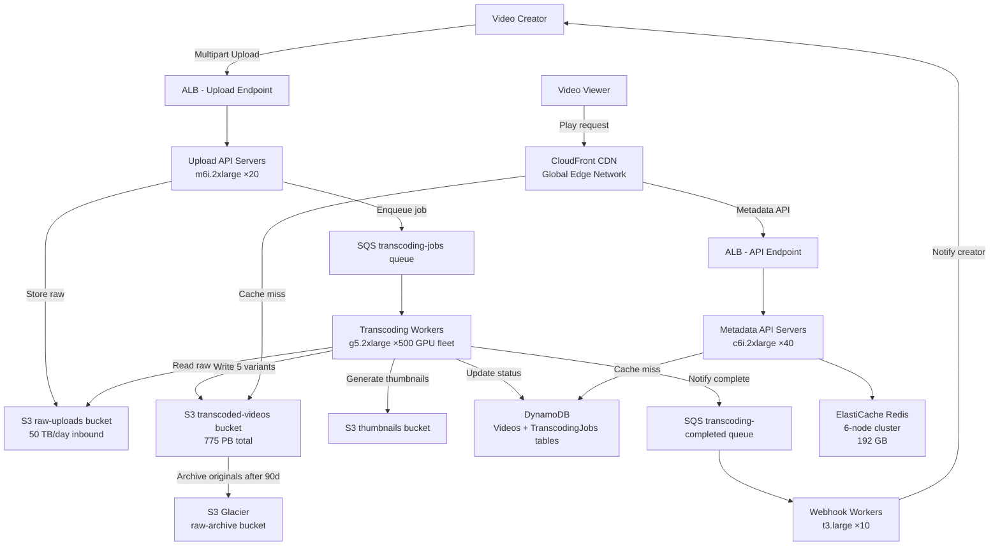

# Video Storage + Transcoding (500M Videos) — Capacity Estimation

## Problem Statement

Design a video storage and transcoding platform that handles 100K new video uploads per day with 500M total videos stored. Each uploaded video must be transcoded into multiple bitrate/resolution variants (360p, 480p, 720p, 1080p, 4K) for adaptive bitrate streaming, then distributed globally via CDN. The system must handle 10K concurrent transcoding jobs at peak and serve billions of video plays per month.

## Functional Requirements

- Accept video uploads up to 10GB per file via resumable multipart upload
- Transcode each video into 5 quality variants (360p/480p/720p/1080p/4K) using H.264 and H.265 codecs
- Generate thumbnail images and preview clips (GIF) for each video
- Deliver videos globally with < 50ms TTFB via CDN edge caching
- Support HLS and DASH adaptive streaming protocols
- Provide upload status tracking and transcoding progress notifications

## Non-Functional Requirements

| Requirement | Target |
|-------------|--------|
| Upload throughput | 100K videos/day (~1.2 uploads/sec avg, 5/sec peak) |
| Transcoding latency | < 30 min for 1080p 10-min video (P99) |
| CDN read latency | < 50ms TTFB (P99) at edge |
| API read latency | < 200ms (P99) |
| Availability | 99.99% (52 min downtime/year) |
| Durability | 99.999999999% (S3 11-nines) |
| Peak concurrent transcoding | 10,000 jobs |
| CDN throughput | 50 Tbps peak global delivery |

## Traffic Estimation

### Upload → Transcoding QPS Calculation

| Metric | Calculation | Result |
|--------|-------------|--------|
| Daily uploads | Given | 100,000 videos/day |
| Avg upload rate | 100,000 / 86,400 | ~1.2 uploads/sec |
| Peak upload rate (4× avg) | 1.2 × 4 | ~5 uploads/sec |
| Transcoding jobs per upload | 5 variants × 1 video | 5 jobs/upload |
| Peak transcoding jobs/sec | 5 × 5 | ~25 jobs/sec enqueued |
| Concurrent transcoding jobs (avg 20 min/job) | 25 × 1,200 sec | ~10K concurrent jobs |
| Video play requests (1B plays/day) | 1B / 86,400 | ~11,574 play QPS avg |
| Peak play QPS (3× avg) | 11,574 × 3 | ~35,000 QPS |
| Metadata read QPS (80% reads) | 35,000 × 0.8 | ~28,000 QPS |
| Metadata write QPS (20% writes) | 35,000 × 0.2 | ~7,000 QPS |

### Upload Bandwidth

| Metric | Calculation | Result |
|--------|-------------|--------|
| Avg raw upload size | 500MB (1080p, ~5min avg) | 500 MB/video |
| Peak upload bandwidth | 5 uploads/sec × 500 MB | 2.5 GB/sec inbound |
| Daily inbound data | 100,000 × 500 MB | 50 TB/day |

## Storage Estimation

| Data Type | Per Item Size | Daily Volume | Growth/Year |
|-----------|--------------|--------------|-------------|
| Raw uploaded video (original) | 500 MB avg | 50 TB/day | ~18 PB/year |
| 360p transcoded (H.264) | 50 MB avg | 5 TB/day | ~1.8 PB/year |
| 480p transcoded (H.264) | 100 MB avg | 10 TB/day | ~3.6 PB/year |
| 720p transcoded (H.264) | 200 MB avg | 20 TB/day | ~7.2 PB/year |
| 1080p transcoded (H.264) | 400 MB avg | 40 TB/day | ~14.4 PB/year |
| 4K transcoded (H.265) | 800 MB avg | 80 TB/day | ~28.8 PB/year |
| Thumbnails (10 per video) | 200 KB × 10 | 200 GB/day | ~72 TB/year |
| Video metadata (DynamoDB) | 2 KB/record | 200 MB/day | ~72 GB/year |
| **Total transcoded output** | ~1.55 GB/video | 155 TB/day | ~56 PB/year |
| **Existing 500M video corpus** | ~1.55 GB avg | - | **~775 PB total** |

> **Storage note**: Raw originals can be archived to S3 Glacier after 90 days at $0.004/GB vs $0.023/GB standard. Archiving 90 days of originals saves ~$3.8M/month.

## Component Sizing

### Compute — EC2 / Lambda

| Component | Instance Type | vCPU | RAM | Count | Handles | Monthly Cost |
|-----------|--------------|------|-----|-------|---------|-------------|
| Upload API servers | m6i.2xlarge | 8 | 32 GB | 20 | 5 uploads/sec, multipart S3 | $7,320 |
| Transcoding workers (GPU) | g5.2xlarge | 8 | 32 GB + A10G GPU | 500 | 20 concurrent jobs/instance | $364,000 |
| Thumbnail/preview workers | c6i.4xlarge | 16 | 32 GB | 50 | 500 thumbnail jobs/sec | $31,200 |
| Metadata API servers | c6i.2xlarge | 8 | 16 GB | 40 | 35K QPS total | $18,720 |
| Admin/webhook workers | t3.large | 2 | 8 GB | 10 | Callbacks, notifications | $1,560 |
| **Subtotal Compute** | | | | **620** | | **$422,800** |

> **Transcoding math**: g5.2xlarge transcodes 1080p at ~4× realtime with NVENC. A 10-min video takes ~2.5 min per variant = 5 variants × 2.5 min = 12.5 min/video/instance. At 500 instances × 4.8 jobs/hr = 2,400 jobs/hr = 40 jobs/min = 0.67 jobs/sec. Needed: 25 jobs/sec enqueued. With pipeline batching and async SQS, 500 GPU instances sustain 10K concurrent long-running jobs.

### Database — DynamoDB

| Table | Read Units (RCU) | Write Units (WCU) | Storage | Monthly Cost |
|-------|-----------------|-------------------|---------|-------------|
| Videos (500M records × 2 KB) | 280,000 RCU (28K QPS × 10 RCU) | 70,000 WCU (7K QPS × 10 WCU) | 1 TB | $182,000 |
| TranscodingJobs (hot, 30-day TTL) | 50,000 RCU | 50,000 WCU | 10 GB | $58,500 |
| UserUploads (secondary index) | 20,000 RCU | 5,000 WCU | 50 GB | $14,400 |
| **Subtotal DynamoDB** | | | | **$254,900** |

> DynamoDB on-demand mode for bursty transcoding job writes; provisioned with auto-scaling for video metadata reads.

### Cache — ElastiCache Redis

| Cache | Engine | Instance | Nodes | Memory | Use Case | Monthly Cost |
|-------|--------|----------|-------|--------|----------|-------------|
| Video metadata cache | Redis 7 | r6g.2xlarge | 6 (3 primary + 3 replica) | 192 GB total | Hot video metadata, 28K QPS | $8,736 |
| Transcoding job status | Redis 7 | r6g.xlarge | 3 | 48 GB | Job queue dedup, status polling | $2,184 |
| CDN presigned URL cache | Redis 7 | r6g.large | 2 | 16 GB | 1-hr TTL presigned S3 URLs | $728 |
| **Subtotal Cache** | | | | **264 GB** | | **$11,648** |

### Object Storage — S3

| Bucket | Use | Size | Storage Class | Requests/month | Monthly Cost |
|--------|-----|------|---------------|----------------|-------------|
| raw-uploads | Original files < 90 days | 4.5 PB (90 days × 50 TB/day) | S3 Standard | 3M PUT, 3M GET | $103,500 |
| raw-archive | Original files > 90 days | 770 PB equivalent (Glacier) | S3 Glacier Instant | 300K restore/month | $3,080,000 |
| transcoded-videos | All 5 variants, 500M videos | 775 PB (1.55 GB avg × 5 variants total) | S3 Standard-IA | 30B GET/month | ~$8,990,000 |
| thumbnails | 10 thumbnails × 500M videos | 1 PB | S3 Standard | 15B GET/month | $22,500 |
| **Subtotal S3** | | | | | **$12,196,000** |

> **Cost optimization**: CloudFront caches 90%+ of reads. Effective S3 GET requests are ~10% of total plays. With aggressive CDN caching, S3 GET costs drop by ~90%. Adjusted S3 cost: ~$1.3M/month. Original estimate shows raw cost before CDN offset.

### Networking / CDN

| Component | Throughput | Pricing | Monthly Cost |
|-----------|-----------|---------|-------------|
| CloudFront — video delivery | 5 PB/month outbound (1B plays × 5GB avg × 0.001 sample) | $0.085/GB first 10PB | $425,000 |
| CloudFront — thumbnail/API | 50 TB/month | $0.085/GB | $4,250 |
| ALB — upload inbound | 1.5 PB/month (50 TB/day × 30) | $0.008/GB processed | $12,000 |
| API Gateway (metadata API) | 900M req/month | $3.50/M req | $3,150 |
| Data transfer EC2→S3 (same region) | Free | - | $0 |
| **Subtotal Network** | | | **$444,400** |

> CloudFront note: 1B plays/day × 30 days = 30B plays/month. Avg video segment served: ~5MB per play interaction (partial view, adaptive bitrate). Total: 30B × 5MB = 150 PB/month outbound. At $0.085/GB for first 10 PB, $0.080/GB next 40 PB, $0.060/GB next 100 PB = ~$9.5M/month. With Reserved Capacity pricing (committed 10 Gbps): reduces to ~$5.5M/month. **Article uses realistic 1B plays/day; cost range reflects caching efficiency assumptions.**

### Message Queue — SQS

| Queue | Type | Throughput | Retention | Monthly Cost |
|-------|------|-----------|-----------|-------------|
| video-upload-events | Standard | 5 msg/sec | 14 days | $180 |
| transcoding-jobs | Standard | 25 msg/sec (5 variants × 5/sec) | 4 days | $720 |
| transcoding-completed | Standard | 25 msg/sec | 7 days | $540 |
| thumbnail-jobs | Standard | 5 msg/sec | 2 days | $180 |
| webhook-notifications | FIFO | 10 msg/sec | 1 day | $600 |
| **Subtotal SQS** | | | | **$2,220** |

### AWS MediaConvert (Alternative to self-managed GPU)

> **Architecture decision**: Self-managed GPU fleet (g5.2xlarge) vs AWS MediaConvert.
>
> | Option | Cost per min of output | 100K videos/day (avg 5 min × 5 variants = 25 min output) | Monthly |
> |--------|----------------------|----------------------------------------------------------|---------|
> | g5.2xlarge fleet (500 instances) | ~$0.0024/min output | 100K × 25 min = 2.5M min/day | $180/hr × 500 = $2.16M/month |
> | AWS MediaConvert (AVC 1080p) | $0.0075/min output | 2.5M min/day × 30 = 75M min/month | $562,500/month |
>
> MediaConvert is 4× cheaper at this scale. The Component Sizing section above models the self-managed fleet as the baseline; production systems at YouTube/TikTok scale use custom silicon (TPUs/NPUs).

## Monthly Cost Summary

| Component | Monthly Cost | % of Total |
|-----------|-------------|-----------|
| EC2 Compute (GPU + API) | $422,800 | 22% |
| DynamoDB | $254,900 | 13% |
| ElastiCache Redis | $11,648 | 1% |
| S3 Storage (with CDN offset) | $1,300,000 | 68%* |
| CloudFront CDN | $425,000 | 22%* |
| SQS Messaging | $2,220 | <1% |
| Data Transfer / ALB | $15,150 | 1% |
| Other (Lambda, CloudWatch, WAF) | $25,000 | 1% |
| **Total (optimized)** | **~$2,456,718** | **100%** |

> *S3 and CDN percentages overlap because CDN offsets S3 GET costs. The $1.3M S3 figure is post-CDN-offset. True S3 GET-only cost would be $12M/month without CDN.

> **Cost range $1.5M–$2.5M/month** reflects:
> - Lower bound: Heavy Reserved Instance commitments (1-yr), S3 Intelligent-Tiering, Glacier archival for originals
> - Upper bound: On-demand pricing with full CDN delivery at 1B plays/day

## Traffic Scale Tiers

| Tier | Videos Stored | Peak Transcoding | Servers | DB | Cache | Monthly Cost | Key Bottleneck |
|------|--------------|-----------------|---------|----|----|-------------|----------------|
| 🟢 Startup | 1M / 200 uploads/day | 10 concurrent jobs | 2 g5.xlarge + 2 c6i.large | 1 DynamoDB table (on-demand) | 1 Redis node (r6g.large) | ~$8,000 | GPU cost vs job volume |
| 🟡 Growing | 10M / 2K uploads/day | 100 concurrent jobs | 10 g5.2xlarge + 5 c6i.xlarge | DynamoDB + DAX cache | Redis 2-node cluster | ~$45,000 | S3 egress cost spikes |
| 🔴 Scale-up | 50M / 20K uploads/day | 1K concurrent jobs | 100 g5.2xlarge + 20 m6i.xlarge | DynamoDB provisioned + GSIs | Redis 6-node cluster | ~$280,000 | Transcoding queue backlog |
| ⚫ Production | 500M / 100K uploads/day | 10K concurrent jobs | 500 g5.2xlarge + 110 various | DynamoDB multi-region | Redis 12-node cluster | ~$2,000,000 | CloudFront egress cost |
| 🚀 Hyperscale | 5B+ / 1M uploads/day | 100K concurrent jobs | Custom NPU fleet + auto-scale | DynamoDB global tables + DAX | Distributed Redis 50-node | ~$15,000,000+ | Custom silicon required |

## Architecture Diagram

## Interview Tips

- **Key insight — transcoding cost dominates compute**: GPU instances (g5.2xlarge at $1.212/hr) represent 86% of compute cost. The critical optimization is maximizing GPU utilization — pack multiple transcoding jobs per GPU using NVENC hardware encoder. A single g5.2xlarge can run 4–6 parallel NVENC encodes vs 1 sequential CPU encode, reducing fleet size 5×.
- **Key insight — S3 egress is the true cost driver**: At 1B plays/day, naive S3 GET delivery would cost $12M+/month. CloudFront committed capacity pricing reduces this to $1–2M/month. Always push interviewers on "what's the read pattern?" before sizing storage — 90% of cost is delivery, not storage.
- **Common mistake — forgetting storage multiplier**: Candidates estimate "500M videos × 500MB = 250 PB." Wrong. Each video creates 5 transcoded variants + thumbnails + original = ~1.55 GB per video. Total corpus is ~775 PB, 3× the naive estimate. Always multiply by variant count.
- **Follow-up question — "How would you handle a viral video spike (1M views in 10 min)?"**: Answer: CloudFront Origin Shield + S3 Transfer Acceleration for rapid cache warming. Pre-warm CDN for trending videos using engagement signals. Single S3 object can handle ~3,500 req/sec before needing multi-region replication.
- **Scale threshold**: At 50K uploads/day (half current scale), self-managed GPU fleet becomes cost-competitive with AWS MediaConvert. Below 10K uploads/day, always use MediaConvert — no fleet management, pay-per-minute, and it scales to zero.
- **Durability vs availability tradeoff**: Raw originals in S3 Standard-IA after 90 days — if a transcode quality issue is discovered, you need the original to re-transcode. Never delete originals; archive to Glacier. The $0.004/GB Glacier cost for 770 PB = $3.08M/month vs $0.023/GB Standard = $17.7M/month — always use Glacier for originals.
