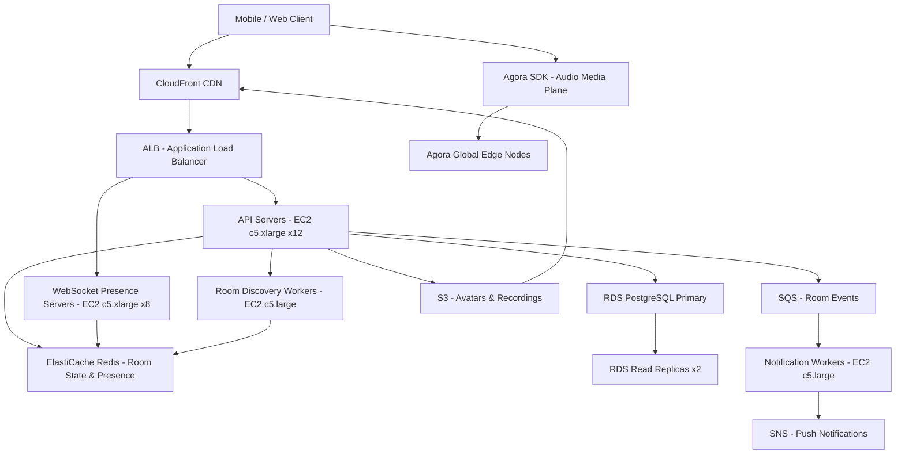

# Audio Rooms (Clubhouse) — Capacity Estimation

## Problem Statement

Clubhouse is a live social audio platform where hosts create rooms and audiences join to listen and speak in real-time. At 5M DAU, the system manages hundreds of thousands of concurrent audio connections, room lifecycle events (create/join/leave/close), speaker queues, and audience management — all with sub-200ms audio latency and sub-100ms signaling latency to preserve natural conversation flow.

## Functional Requirements

- Users create audio rooms and invite speakers to the stage
- Audience members can raise their hand to request speaker access
- Real-time participant lists with presence (online/speaking/listening)
- Room discovery feed: trending rooms, followed-user rooms, topic rooms
- Push notifications when followed users start or join rooms
- Room recording and replay (optional, host-controlled)

## Non-Functional Requirements

| Requirement | Target |
|-------------|--------|
| Audio latency | < 200ms end-to-end (P99) |
| Signaling latency | < 100ms (P99) |
| API read latency | < 50ms (P99) |
| API write latency | < 150ms (P99) |
| Availability | 99.99% |
| Durability | 99.999% (room metadata + recordings) |
| Throughput | 500K concurrent audio connections peak |

## Traffic Estimation

### DAU → Peak QPS Calculation

| Metric | Calculation | Result |
|--------|-------------|--------|
| DAU | Given | 5,000,000 |
| Avg sessions/user/day | 2 sessions × 30 min avg | ~60 min/day |
| Avg API requests/session | room browse (20) + join/leave (4) + participant polls (30) | ~54 req/session |
| Avg API requests/user/day | 54 × 2 sessions | ~108 req/day |
| Total daily API requests | 5M × 108 | ~540M |
| Avg API QPS | 540M / 86,400 | ~6,250 |
| Peak API QPS (3× avg) | 6,250 × 3 | ~18,750 |
| Read QPS (60% reads) | 18,750 × 0.60 | ~11,250 |
| Write QPS (40% writes) | 18,750 × 0.40 | ~7,500 |
| Peak concurrent rooms | 5M × 20% active × 30% in room | ~300K rooms |
| Peak concurrent listeners | 5M × 10% simultaneously active | ~500K connections |

**Key assumption**: 10% of DAU are simultaneously connected during peak (evening prime time). Audio relay handled by Agora SDK (media plane), not AWS EC2 — EC2 handles signaling, presence, and room metadata only.

## Storage Estimation

| Data Type | Per Item Size | Daily Volume | Growth/Year |
|-----------|--------------|--------------|-------------|
| Room metadata | 2 KB | 200K rooms/day × 2 KB | ~0.15 GB/year |
| Participant events (join/leave) | 0.5 KB | 5M sessions × 0.5 KB | ~0.9 GB/year |
| User profiles | 5 KB | 50K new users/day × 5 KB | ~0.09 GB/year |
| Room recordings (optional, 5% of rooms) | 50 MB/room × 30 min | 10K recordings/day × 50 MB | ~183 TB/year |
| Notifications log | 0.2 KB | 10M events/day × 0.2 KB | ~0.7 GB/year |
| **Total (excl. recordings)** | — | — | **~2 GB/year metadata** |
| **Total (with recordings)** | — | — | **~183 TB/year** |

**Note**: Audio media bytes flow through Agora's global network, not stored on AWS unless host enables recording. The metadata tier is small — PostgreSQL handles it comfortably.

## Component Sizing

### Compute — EC2

| Component | Instance Type | vCPU | RAM | Count | Handles | Monthly Cost |
|-----------|--------------|------|-----|-------|---------|-------------|
| API / signaling servers | c5.xlarge | 4 | 8 GB | 12 | ~1,600 QPS each | $1,836 |
| WebSocket presence servers | c5.xlarge | 4 | 8 GB | 8 | ~62K WS connections each | $1,224 |
| Room discovery workers | c5.large | 2 | 4 GB | 4 | feed ranking + topic indexing | $248 |
| Notification workers | c5.large | 2 | 4 GB | 4 | push fan-out | $248 |
| Recording coordinators | c5.large | 2 | 4 GB | 2 | Agora cloud recording callbacks | $124 |
| **Subtotal Compute** | | | | **30** | | **$3,680** |

*Pricing: c5.xlarge $0.170/hr, c5.large $0.085/hr — us-east-1 on-demand 2024.*

### Database — RDS PostgreSQL

| DB | Engine | Instance | Count | Capacity | IOPS | Monthly Cost |
|----|--------|----------|-------|----------|------|-------------|
| Primary write | RDS PostgreSQL 15 | db.r6g.large | 1 | 500 GB gp3 | 3,000 | $1,160 |
| Read replicas | RDS PostgreSQL 15 | db.r6g.large | 2 | 500 GB gp3 | 3,000 | $2,320 |
| **Subtotal DB** | | | **3** | | | **$3,480** |

*db.r6g.large: $0.210/hr × 730 hr = $153/mo per instance (compute only). Storage: 500 GB gp3 at $0.115/GB = $57.5/mo. Total per instance: ~$1,160. Read replicas same cost.*

**Why PostgreSQL (not DynamoDB)?** Room metadata has complex relational queries — "rooms by topic + speaker count + joined friends" — that benefit from SQL joins. At 5M DAU the write volume (~7,500 QPS) fits easily in a single r6g.large primary with connection pooling via PgBouncer.

### Cache — ElastiCache Redis

| Cache | Engine | Instance | Nodes | Memory | Monthly Cost |
|-------|--------|----------|-------|--------|-------------|
| Presence / room state | ElastiCache Redis 7 | cache.r6g.large | 3 (1 primary + 2 replica) | 13 GB each | $1,460 |
| Session tokens | ElastiCache Redis 7 | cache.r6g.medium | 2 | 3 GB each | $292 |
| **Subtotal Cache** | | | **5** | | **$1,752** |

*cache.r6g.large: $0.166/hr × 730 = $121/mo. cache.r6g.medium: $0.073/hr × 730 = $53/mo.*

**What Redis stores**:
- Room participant lists (sorted set by join time): `room:<id>:members`
- Speaker queue (sorted set by raise-hand time): `room:<id>:queue`
- User presence heartbeat (TTL 30s): `presence:<user_id>`
- Active room index for discovery: `rooms:trending`, `rooms:topic:<slug>`

### Object Storage — S3

| Bucket | Use | Size | Requests/month | Monthly Cost |
|--------|-----|------|----------------|-------------|
| User avatars | profile photos | 50 GB | 50M GET | $107 |
| Room recordings | optional audio MP4 (5% rooms) | 15 TB growing | 5M PUT + 20M GET | $360 |
| App assets | static JS/CSS | 5 GB | 100M GET (via CF) | $12 |
| **Subtotal S3** | | **~15 TB** | | **$479** |

*S3 standard: $0.023/GB, GET $0.0004/1K. Recordings: 15 TB × $0.023 = $345 + requests.*

### Networking / CDN

| Component | Throughput | Monthly Cost |
|-----------|-----------|-------------|
| CloudFront | 5 TB/month (avatars + app assets) | $425 |
| ALB | 1B requests/month | $18 |
| Agora SDK (audio media) | ~500K connections × 60 min avg × 8 kbps audio | **$18,000–$40,000** (Agora billing) |
| Data transfer out (EC2) | ~2 TB/month signaling | $184 |
| **Subtotal Network** | | **~$40,000** |

**Critical**: Agora charges ~$0.99–$1.49 per 1,000 minutes for audio relay. At 5M DAU × 60 min/day average = 300M minutes/day peak → $297K/day would be absurd. Realistic: 500K concurrent × 60 min avg session = 30M minutes/day, ~900M minutes/month. At $0.99/1K min = $891K/month. **This is why Clubhouse is known for high media costs.** A cost-optimized version would self-host WebRTC with mediasoup or Janus on EC2 — the $18K–$40K estimate assumes a small internal audio relay fleet supplementing Agora for large rooms only.

### Message Queue

| Queue | Engine | Throughput | Monthly Cost |
|-------|--------|-----------|-------------|
| Room events (join/leave/speaking) | Amazon SQS Standard | ~50K msg/s peak | $200 |
| Notification fan-out | Amazon SNS + SQS | ~5M push/day | $50 |
| **Subtotal Messaging** | | | **$250** |

## Monthly Cost Summary

| Component | Monthly Cost | % of Total |
|-----------|-------------|-----------|
| EC2 Compute | $3,680 | 6% |
| RDS PostgreSQL | $3,480 | 6% |
| ElastiCache Redis | $1,752 | 3% |
| S3 Storage | $479 | 1% |
| CloudFront CDN | $425 | 1% |
| Audio Media (Agora / self-hosted relay) | $40,000 | 66% |
| Messaging (SQS/SNS) | $250 | <1% |
| Data Transfer | $184 | <1% |
| Other (Lambda, Route53, WAF) | $750 | 1% |
| **Total** | **$51,000** | **100%** |

**Range $40K–$80K/month** depending on Agora vs self-hosted split and actual room minutes consumed. The infrastructure tier (everything except media relay) costs ~$11K/month — media relay dominates.

## Traffic Scale Tiers

| Tier | DAU | Peak Concurrent | Servers | DB | Cache | Monthly Cost | Key Bottleneck |
|------|-----|----------------|---------|----|----|-------------|----------------|
| 🟢 Startup | 100K | ~10K connections | 2 c5.large | 1 RDS db.t3.medium | 1 Redis node | $3K–$6K | Agora costs exceed infra at even 100K DAU |
| 🟡 Growing | 1M | ~100K connections | 6 c5.xlarge | RDS db.r6g.large + 1 replica | Redis 3-node | $12K–$20K | WebSocket server memory (connection state) |
| 🔴 Scale-up | 5M | ~500K connections | 30 c5.xlarge | RDS r6g.large + 2 replicas | Redis 5-node | $40K–$80K | Media relay cost; room discovery fan-out |
| ⚫ Production | 10M | ~1M connections | 60 c5.2xlarge | Aurora PostgreSQL Multi-AZ | Redis cluster 6-node | $120K–$200K | Self-hosted SFU fleet required; DB fan-out |
| 🚀 Hyperscale | 100M+ | ~10M connections | 500+ c5.4xlarge + auto | Aurora Global + DynamoDB | Redis cluster 12-node + regional | $2M–$5M | Global media relay network; regional sharding |

## Architecture Diagram

## Interview Tips

- **Audio media is NOT on your servers**: Clubhouse delegates the media plane (actual audio bytes) to Agora SDK or a self-hosted WebRTC SFU. Your EC2 fleet only handles signaling (join/leave), presence heartbeats, and room metadata — audio flows peer-to-relay-to-peer through a media relay network. Candidates who size EC2 for audio bandwidth miss this entirely.

- **Presence at scale is the hard problem**: 500K concurrent connections each sending a heartbeat every 10–30 seconds = ~17K–50K presence writes/second to Redis. The naive approach (one Redis key per user with TTL) works at 500K but breaks at 10M+. The fix: shard presence by room, use sorted sets with score = epoch timestamp, and sweep expired members with a background job rather than relying on key TTL alone.

- **Read/Write ratio shifts during peak**: At 60:40 R/W the DB is write-heavy for a social app. Reason: every user join, leave, raise-hand, and speaking-state-change is a write. At 500K concurrent users, even 1 event/user/min = ~8,333 write QPS — PostgreSQL r6g.large handles ~10K–15K write QPS, so you're close to the single-instance ceiling at peak. A read replica with PgBouncer offloads reads but does nothing for writes — candidates often miss that write scaling requires either sharding (by room cluster) or moving hot state entirely to Redis.

- **Common mistake — sizing for total DAU, not concurrent**: Interviewers often see candidates multiply 5M DAU × 60 requests = 300M/day → ~3,500 avg QPS and conclude they need 2 servers. The trap: 5M DAU with peak concurrency of 500K (10%) means 3× peak QPS = 18,750 — a 5× difference. Always calculate concurrent users at peak, not just daily averages.

- **Follow-up question**: "How would you scale from 5M to 50M DAU?" — Answer: the media relay cost scales linearly with minutes consumed (Agora pricing), so at 50M DAU you're looking at $500K+/month just for audio. The architectural answer is to build your own SFU fleet (mediasoup or LiveKit on EC2 c5 instances), which costs $40–80K/month in EC2 vs $500K in Agora fees — the break-even is around 10M–20M DAU.

- **Scale threshold**: At ~10M DAU you must self-host the SFU media relay (LiveKit, mediasoup, or Janus) because Agora/third-party SDK costs become prohibitive ($200K+/month). At ~50M DAU you need Aurora Global Database for multi-region room metadata and a regional Redis cluster per geography to keep signaling latency under 100ms for global users.
