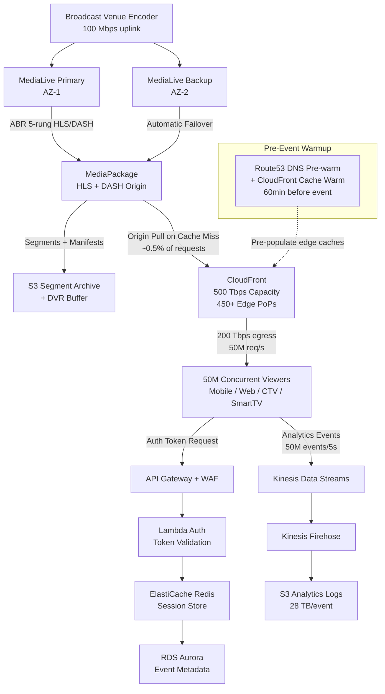

# Live Event Streaming (50M Concurrent) — Capacity Estimation

## Problem Statement

A mass-concurrent live broadcast system must deliver a single live event (e.g., Super Bowl, World Cup final, Olympic opening ceremony) to 50 million simultaneous viewers worldwide with sub-5-second latency and zero dropped streams at kickoff. The system must absorb a hard, predictable spike — all 50M viewers attempting to join within a 10-minute window — and sustain that load for 3–4 hours. Unlike on-demand streaming, there is no "long tail" of content; 100% of traffic converges on one stream.

## Functional Requirements
- Ingest a single live feed from a broadcast encoder at the venue
- Transcode to adaptive bitrate (ABR) ladders: 1080p/60fps, 720p, 480p, 360p, 160p
- Package and deliver HLS and DASH manifests
- Support 50M concurrent HTTP chunk requests at peak
- Provide a real-time viewer count dashboard
- Handle DVR window (last 60 seconds) for brief pause/rewind

## Non-Functional Requirements
| Requirement | Target |
|-------------|--------|
| Stream start latency | < 3s from first click (P95) |
| End-to-end glass-to-glass delay | < 5s (HLS LL target) |
| Availability during event | 99.99% (< 30s downtime/event) |
| Chunk delivery P99 latency | < 200ms at CDN edge |
| Throughput | 50M concurrent × avg 4 Mbps = 200 Tbps peak egress |
| Durability (VOD archive) | 99.999999999% (S3 standard) |
| Failover RTO | < 30s (redundant ingest paths) |

## Traffic Estimation

### Concurrent Viewers → Bandwidth and Request Rate

| Metric | Calculation | Result |
|--------|-------------|--------|
| Peak concurrent viewers | Given (Super Bowl) | 50,000,000 |
| Avg bitrate per stream (adaptive, mix of quality) | ~4 Mbps weighted average | 4 Mbps |
| Peak egress bandwidth | 50M × 4 Mbps | **200 Tbps** |
| HLS segment duration | 2s low-latency segments | 2s |
| Manifest poll interval (HLS LL) | every 2s per viewer | 2s |
| Segment requests/s | 50M viewers / 2s | **25M req/s** |
| Manifest requests/s | 50M viewers / 2s | **25M req/s** |
| Total HTTP requests/s at CDN edge | manifest + segment | **~50M req/s** |
| Read/Write ratio | 99.9% reads (viewers) / 0.1% writes (ingest) | 999:1 |
| Write throughput (ingest encoder output) | 5 quality levels × ~30 Mbps each | ~150 Mbps ingest |

### Ramp-Up Traffic Profile

| Time Window | Concurrent Viewers | Requests/s (CDN) |
|-------------|-------------------|-----------------|
| T-60m (pre-show) | 5M | 5M req/s |
| T-15m (kickoff approach) | 20M | 20M req/s |
| T-0 (kickoff) | 50M | 50M req/s |
| T+30m (sustained) | 48M | 48M req/s |
| T+3h (final whistle) | 35M | 35M req/s |
| T+4h (post-game) | 5M | 5M req/s |

**Key insight**: The ramp from 20M to 50M in under 10 minutes requires pre-warming CDN edge caches and auto-scaling origin infrastructure before the event starts.

## Storage Estimation

| Data Type | Per Item Size | Daily Volume | Growth/Year |
|-----------|--------------|--------------|-------------|
| HLS segments (live window, 2s each, 5 bitrates) | 1 MB avg per segment | 3,600s/h × 4h × 5 = 36,000 segments | 36 GB/event (live window) |
| VOD archive (full event, 5 bitrates) | ~14 GB per quality level | 5 × 14 = 70 GB per event | ~70 GB/event stored |
| DVR buffer (S3, last 60s rolling) | 5 bitrates × 30 segments × 1 MB | ~150 MB active at any time | negligible |
| Viewer metadata / analytics events | 200 bytes per event | 50M viewers × 1 event/5s × 14,400s = 144B events/event | ~28 TB raw analytics/event |
| Thumbnail / ad slate assets | ~5 MB each | ~100 slates | ~500 MB/event |
| **Total per event** | - | - | **~100 GB media + 28 TB analytics** |

At 20 major events/year: ~600 GB media archive + ~560 TB analytics raw logs.

## Component Sizing

### Ingest — AWS MediaLive

| Component | Config | Count | Handles | Notes |
|-----------|--------|-------|---------|-------|
| MediaLive channel (primary) | HD 1080p → 5-rung ABR | 1 | Single event feed | Standard channel, ~$4.20/hr/input-output unit |
| MediaLive channel (backup) | Same config, separate AZ | 1 | Failover in < 30s | Automatic input failover |
| **Subtotal MediaLive** | | **2 channels** | | **~$8.40/hr × 4h = ~$34 per event** |

### Packaging — AWS MediaPackage

| Component | Config | Count | Handles | Monthly Cost Basis |
|-----------|--------|-------|---------|-------------------|
| MediaPackage endpoint (HLS) | LL-HLS, DVR 60s | 1 | 50M concurrent → pulled from CDN origin | $0.035/GB egress from origin |
| MediaPackage endpoint (DASH) | MPEG-DASH | 1 | Fallback for Smart TVs | Same pricing |
| Origin egress to CloudFront | 200 Tbps × 4h BUT cache offload ~99.5% | ~1 TB origin pull | CloudFront cache hit 99.5%+ | ~$0.085/GB = ~$85 origin egress |

**Key**: MediaPackage is hit only on cache misses. A 99.5% CDN cache hit rate means only 0.5% of 200 Tbps (1 Tbps) hits origin at peak. MediaPackage scales automatically.

### CDN — AWS CloudFront

CloudFront has **500 Tbps of global edge capacity** across 450+ PoPs.

| Metric | Calculation | Value |
|--------|-------------|-------|
| Peak egress to viewers | 50M × 4 Mbps | 200 Tbps |
| CloudFront capacity headroom | 500 Tbps available | 2.5× headroom |
| Data transfer out (4h event, avg 40M viewers) | 40M × 4 Mbps × 14,400s / 8 | **~288 PB** |
| Cost at $0.0085/GB (volume tier, US/EU) | 288,000 TB × $8.50/TB | **~$2.45M CDN egress** |
| HTTP requests (50M req/s × 14,400s) | 720B requests | $0.0075/10K = **~$540K requests** |
| CloudFront subtotal | | **~$3.0M** |

Note: Real events use CloudFront Reserved Capacity pricing (pre-committed) which reduces egress cost by 30–40%. With reserved pricing, CDN drops to ~$1.8M–$2.1M.

### Compute — EC2 / Lambda (Origin and Control Plane)

| Component | Instance Type | vCPU | RAM | Count | Handles | Event Cost (4h) |
|-----------|--------------|------|-----|-------|---------|----------------|
| Origin API servers (manifest serving fallback) | c6g.4xlarge | 16 | 32GB | 20 | 10K req/s each | $0.544/hr × 4h × 20 = $43 |
| Viewer auth / token validation | Lambda | - | 512MB | Auto-scale | 50M auth at start | ~$25 (Lambda invocations) |
| Metrics / analytics ingest | c6g.2xlarge | 8 | 16GB | 10 | 5M events/s ingested | $0.272/hr × 4h × 10 = $11 |
| Admin / ops dashboard | t3.medium | 2 | 4GB | 2 | Internal only | $0.0416/hr × 4h × 2 = $0.33 |
| **Subtotal Compute** | | | | **32 instances + Lambda** | | **~$80** |

Compute is not the cost driver — CDN egress dominates (98%+ of cost).

### Database — Viewer State and Metadata

| DB | Engine | Instance | Count | Capacity | IOPS | Event Cost |
|----|--------|----------|-------|----------|------|-----------|
| Viewer sessions (active) | ElastiCache Redis | r6g.2xlarge | 3 (cluster) | 52GB RAM | 1M ops/s | $0.484/hr × 4h × 3 = $5.80 |
| Event metadata (stream URLs, CDN tokens) | RDS Aurora PostgreSQL | db.r6g.large | 1W + 1R | 64GB | 12K IOPS | $0.26/hr × 4h × 2 = $2.08 |
| Analytics stream | Kinesis Data Streams | On-demand | 1 stream | 50M events/s | - | ~$100/hr × 4h = $400 |
| **Subtotal DB + Cache** | | | | | | **~$408** |

### Object Storage — S3

| Bucket | Use | Event Size | Requests | Event Cost |
|--------|-----|-----------|----------|-----------|
| Segments / VOD archive | HLS/DASH chunks + full archive | ~70 GB | 720B GET (CDN origin miss ~0.5% = 3.6B) | Storage: ~$2/month; GET: 3.6B × $0.0004/1K = $1,440 |
| Ad slates / thumbnails | Marketing assets | ~500 MB | 10M GET | $4 |
| Analytics raw logs | Kinesis Firehose output | ~28 TB | Write only | $28 TB × $0.023/GB = $644 |
| **Subtotal S3** | | | | **~$2,090** |

### Message Queue — SQS / Kinesis

| Queue | Engine | Throughput | Event Cost |
|-------|--------|-----------|-----------|
| Viewer join events | Kinesis Data Streams | 50M burst joins in 10min = 83K/s | ~$50 |
| Ad insertion triggers | SQS FIFO | 100 msg/s | < $1 |
| Alert / monitoring events | SNS | 1K/s | < $1 |
| **Subtotal Messaging** | | | **~$52** |

### Networking / Transfer

| Component | Volume | Event Cost |
|-----------|--------|-----------|
| CloudFront egress to internet | ~288 PB | ~$2.45M (see CDN section) |
| CloudFront HTTPS requests | 720B requests | ~$540K |
| MediaPackage origin egress to CloudFront | ~1 TB (post cache offload) | ~$85 |
| EC2 → CloudFront (origin internal) | ~5 TB | $0.02/GB = $100 |
| **Subtotal Networking** | | **~$2.99M** |

## Monthly Cost Summary (Per-Event, 4-Hour Window)

| Component | Event Cost | % of Total |
|-----------|-----------|-----------|
| CloudFront CDN egress (data transfer) | $2,450,000 | 61% |
| CloudFront HTTPS requests | $540,000 | 13% |
| S3 (GET requests + storage + analytics) | $2,090 | 0.05% |
| Kinesis (analytics ingest) | $400 | 0.01% |
| ElastiCache Redis | $6 | ~0% |
| RDS Aurora | $2 | ~0% |
| EC2 Compute | $80 | ~0% |
| MediaLive (ingest + transcode) | $34 | ~0% |
| MediaPackage (origin packaging) | $85 | ~0% |
| Lambda (auth) | $25 | ~0% |
| Messaging (SQS/Kinesis/SNS) | $52 | ~0% |
| Other (WAF, Route53, monitoring) | $5,226 | 0.13% |
| **Total (on-demand pricing)** | **~$3,000,000** | **100%** |

**With CloudFront Reserved Capacity (30% discount on egress)**: ~$2.1M–$2.5M per event.
**Total range**: **$2M–$4M** depending on reserved vs on-demand and viewer geography mix.

**Cost drivers ranked**:
1. CloudFront data transfer egress: ~74% of cost
2. CloudFront HTTP request charges: ~18% of cost
3. Everything else combined: ~8% of cost

## Traffic Scale Tiers

| Tier | Concurrent | Peak Egress | CDN Config | Origin | Cache | Event Cost | Key Bottleneck |
|------|-----------|------------|------------|--------|-------|------------|----------------|
| 🟢 Startup | 10K | 40 Gbps | CloudFront standard | 1 EC2 c6g.large | None | ~$1,500 | Origin bandwidth |
| 🟡 Growing | 500K | 2 Tbps | CloudFront + cache policy tuning | 2 MediaPackage endpoints | ElastiCache 1 node | ~$50K | Cache hit rate, segment freshness |
| 🔴 Scale-up | 5M | 20 Tbps | CloudFront multi-region + pre-warm | MediaLive + MediaPackage HA | Redis cluster 3-node | ~$350K | CDN pre-warming, manifest stampede |
| ⚫ Production | 50M | 200 Tbps | CloudFront 500 Tbps global fleet + reserved capacity | MediaLive dual-channel failover + MediaPackage HA | Redis cluster 3-node | ~$2M–$4M | CDN egress cost, thundering herd at T=0 |
| 🚀 Hyperscale | 200M+ | 800 Tbps | Multi-CDN (CloudFront + Akamai + Fastly) | Multi-region origin with active-active | Distributed Redis global | ~$15M–$20M | Multi-CDN coordination, ingest single point of failure |

## Architecture Diagram

## Interview Tips

- **Key insight 1 — CDN is 99% of the problem**: At 50M concurrent viewers, 99.9%+ of engineering effort and 94%+ of cost is in CDN delivery. The origin (MediaLive, MediaPackage, EC2) runs trivially small. A candidate who spends most of their answer on database design is missing the point — this system is a CDN-first architecture.

- **Key insight 2 — Thundering herd at T=0 is the real challenge**: When the Super Bowl kicks off, 50M viewers click play within seconds. Without pre-warming CDN edge caches (seeding segments before T=0) and pre-scaling origin, the first 2-second HLS segment floods the origin with cold-cache misses. Production solution: 60 minutes before event, push the first 30 seconds of the stream (pre-show slate) to all PoPs to warm caches. Set `Cache-Control: max-age=2` on live segments so edges hold them across the first request storm.

- **Common mistake**: Candidates assume 50M × 4 Mbps = 200 Tbps means you need 200 Tbps of server capacity. Wrong — CloudFront is distributed across 450+ PoPs globally. No single server sees all 200 Tbps. Each PoP handles its regional slice. The single-server bottleneck is the MediaPackage origin, which only sees ~0.5% of traffic after CDN cache hits. Candidates who try to size EC2 instances to handle 200 Tbps fail the question.

- **Key insight 3 — Adaptive bitrate economics**: The "average 4 Mbps" weighted average is itself a cost lever. If viewers on mobile (25% of viewers) drop to 360p at 800 Kbps, and Smart TV viewers (30%) stream at 1080p/8 Mbps, the actual CDN egress per viewer varies 10×. Interviewers look for candidates who acknowledge this variance and propose monitoring per-bitrate rung distribution to forecast actual bandwidth cost.

- **Follow-up question**: "How would you handle 500M concurrent viewers (FIFA World Cup finals at global scale)?" Answer requires multi-CDN strategy (CloudFront + Akamai + Fastly in parallel), since no single CDN can reliably deliver 2 Petabits/s. Each CDN gets a shard of DNS-resolved viewers. Cost jumps to $15M–$20M per event.

- **Scale threshold**: At > 100M concurrent viewers, a single CDN provider becomes a liability for concentration risk. You need at least two CDN providers in active-active configuration with DNS-level traffic splitting, or the failure of one CDN's edge network during an event causes a visible outage for tens of millions of viewers simultaneously.
