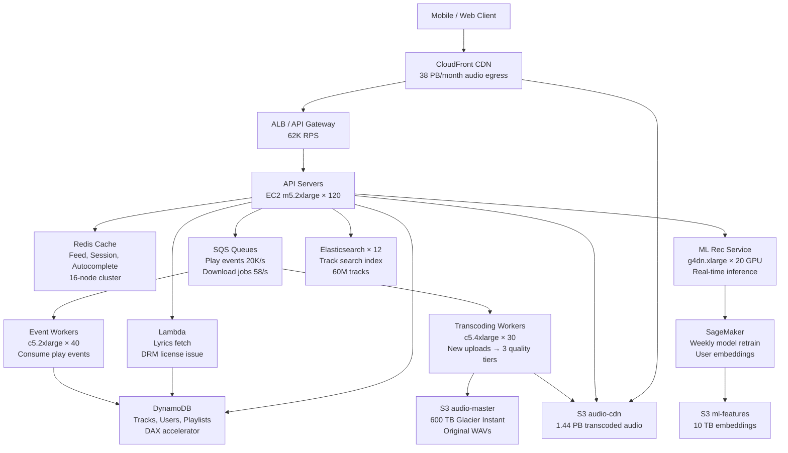

# Music Streaming (Spotify-scale) — Capacity Estimation

## Problem Statement

Design a music streaming platform serving 100M daily active users who stream audio tracks, download songs for offline playback, and view synchronized lyrics. The system must deliver low-latency audio with adaptive bitrate, support a 60M+ track catalog, and power real-time ML recommendations — all while handling 3–5× traffic spikes during peak hours (7–10 PM local time across time zones).

## Functional Requirements

- Stream audio tracks at adaptive bitrates (128 Kbps–320 Kbps)
- Download tracks for offline playback (encrypted, DRM-protected)
- Display real-time synchronized lyrics (word-level highlighting)
- Personalized recommendations (home feed, radio, "Discover Weekly")
- Search catalog by artist, album, track, genre
- Track listening history, likes, playlists

## Non-Functional Requirements

| Requirement | Target |
|-------------|--------|
| Audio start latency | < 200ms (P99) |
| Seek latency | < 100ms (P99) |
| Lyrics sync accuracy | ± 50ms |
| Availability | 99.99% (52 min/year downtime) |
| Durability (audio files) | 99.999999999% (S3 11-nines) |
| Read throughput | 400K QPS peak streams |
| Write throughput | 12K QPS peak (events, skips, likes) |
| Offline download speed | > 1 MB/s per user |

## Traffic Estimation

### DAU → Peak QPS Calculation

| Metric | Calculation | Result |
|--------|-------------|--------|
| DAU | Given | 100M |
| Avg listen time/user/day | 30 min = 7–8 tracks | ~8 tracks |
| Stream requests/user/day | 8 streams + 5 seeks + 2 skips + 3 browse | ~18 requests |
| Total daily requests | 100M × 18 | 1.8B |
| Avg QPS | 1.8B / 86,400 | ~20,833 |
| Peak QPS (3× avg, evening spike) | 20,833 × 3 | ~62,500 |
| **Stream initiation QPS** | 400K concurrent streams ÷ avg 3min track | **~2,200 new streams/s** |
| **Concurrent active streams** | 100M DAU × 20% peak concurrency | **~20M streams** |
| Read QPS (97% reads) | 62,500 × 0.97 | ~60,625 |
| Write QPS (3% writes: events, skips, likes) | 62,500 × 0.03 | ~1,875 |

**Note on concurrent streams**: 20M concurrent streams is the steady-state; peak (3×) = 60M concurrent. Each stream pulls ~16 KB/s segments (128 Kbps) or ~40 KB/s (320 Kbps). CDN absorbs 95%+ of this.

### Bandwidth Estimation

| Stream Quality | Bitrate | Per-Stream Bandwidth | 20M Streams |
|---------------|---------|---------------------|-------------|
| Low (mobile) | 128 Kbps | 16 KB/s | 320 GB/s |
| Normal | 256 Kbps | 32 KB/s | 640 GB/s |
| High (premium) | 320 Kbps | 40 KB/s | 800 GB/s |
| **Blended avg (60% low, 30% normal, 10% high)** | ~179 Kbps | **~22 KB/s** | **~440 GB/s** |

CloudFront handles ~95% of egress (cached audio segments); origin S3 pull is ~22 GB/s.

## Storage Estimation

| Data Type | Per Item Size | Daily Volume | Growth/Year |
|-----------|--------------|--------------|-------------|
| Audio files (60M tracks × 3 quality tiers) | avg 8 MB per track/tier | 60M × 3 = 180M files | ~1.44 PB baseline |
| New track uploads | 50K tracks/day × 3 tiers × 8 MB | 1.2 TB/day | ~438 TB/year |
| Offline downloads (cache) | 3 tracks avg cached × 8 MB | 100M users × 50% premium × 3 × 8 MB | ~1.2 PB |
| Lyrics data | 20 KB per track (timestamped JSON) | 60M × 20 KB | ~1.2 TB baseline |
| User data (playlists, likes, history) | 5 KB/user | 100M × 5 KB | ~500 GB |
| Event logs (streams, skips, plays) | 200 bytes/event | 1.8B events/day × 200B | ~360 GB/day → 131 TB/year |
| ML feature store | per-user embeddings 10 KB | 300M total users × 10 KB | ~3 TB |
| **Total S3 (audio + downloads)** | - | - | **~3.5 PB year 1 → +500 TB/year** |

## Component Sizing

### Compute — EC2

| Component | Instance Type | vCPU | RAM | Count | Handles | Monthly Cost |
|-----------|--------------|------|-----|-------|---------|-------------|
| API servers (stream init, search, playlists) | m5.2xlarge | 8 | 32 GB | 120 | ~520 QPS each, 62K total | $27,360 |
| Audio transcoding workers (new uploads) | c5.4xlarge | 16 | 32 GB | 30 | 50K tracks/day → ~1.7 tracks/s each | $14,040 |
| Lyrics sync service | c5.xlarge | 4 | 8 GB | 10 | 20K concurrent lyrics sessions | $1,560 |
| ML recommendation inference | g4dn.xlarge (GPU) | 4 | 16 GB + T4 | 20 | 50K rec requests/min | $21,040 |
| Event processing workers | c5.2xlarge | 8 | 16 GB | 40 | 1.8B events/day → SQS consumers | $9,360 |
| Search service (Elasticsearch nodes) | r5.2xlarge | 8 | 64 GB | 12 | 60M track index, 5K search QPS | $11,232 |
| Admin / ingestion services | m5.xlarge | 4 | 16 GB | 10 | Metadata updates, DRM key mgmt | $1,920 |
| **Subtotal Compute** | | | | **242** | | **$86,512** |

### Database — DynamoDB

| Table | Use | Capacity Mode | Estimated WCU/RCU | Monthly Cost |
|-------|-----|---------------|-------------------|-------------|
| tracks | Track metadata (title, artist, duration, URLs) | On-demand | 2K RCU, 200 WCU peak | $4,800 |
| users | Profile, subscription tier, preferences | On-demand | 10K RCU, 500 WCU peak | $8,200 |
| playlists | User playlists, collaborative | On-demand | 5K RCU, 300 WCU peak | $4,100 |
| play_history | Last 90 days per user (TTL) | On-demand | 8K RCU, 2K WCU peak | $7,600 |
| likes_follows | User → artist/track follows | On-demand | 4K RCU, 400 WCU peak | $3,200 |
| offline_licenses | DRM license records per user per track | On-demand | 3K RCU, 300 WCU peak | $2,400 |
| lyrics | Timestamped lyrics JSON (read-heavy) | On-demand | 6K RCU, 50 WCU (rare updates) | $3,800 |
| **DynamoDB Subtotal** | | | | **$34,100** |

**Note**: DynamoDB chosen over RDS Aurora for horizontal scale at 100M DAU; single-digit ms P99 reads with DAX caching layer.

### DAX (DynamoDB Accelerator)

| Cluster | Nodes | Node Type | Memory | Handles | Monthly Cost |
|---------|-------|-----------|--------|---------|-------------|
| tracks-dax | 3 | dax.r4.2xlarge | 3 × 61 GB | track metadata cache, microsecond reads | $5,040 |
| users-dax | 3 | dax.r4.xlarge | 3 × 30 GB | user profile cache | $2,520 |
| **DAX Subtotal** | | | | | **$7,560** |

### Cache — ElastiCache Redis

| Cache Layer | Use | Instance | Nodes | Memory | Monthly Cost |
|-------------|-----|----------|-------|--------|-------------|
| Session & auth tokens | JWT validation, OAuth sessions | r6g.xlarge | 3 (cluster) | 3 × 26 GB = 78 GB | $3,024 |
| Feed / recommendation cache | Home feed per user (15-min TTL) | r6g.2xlarge | 6 | 6 × 52 GB = 312 GB | $12,096 |
| Search autocomplete | Prefix cache for 60M track titles | r6g.xlarge | 3 | 78 GB | $3,024 |
| Rate limiting & counters | Requests per user/IP | r6g.large | 2 | 2 × 13 GB = 26 GB | $672 |
| Lyrics hot cache | Top 5K tracks' lyrics in memory | r6g.large | 2 | 26 GB | $672 |
| **Subtotal Redis** | | | | **520 GB total** | **$19,488** |

### Object Storage — S3

| Bucket | Use | Size | Requests/month | Monthly Cost |
|--------|-----|------|----------------|-------------|
| audio-master | Original WAV/FLAC uploads (archive) | 600 TB (S3 Glacier Instant) | 500K PUT | $3,300 |
| audio-cdn | Transcoded MP3/AAC (3 qualities × 60M tracks) | 1.44 PB (S3 Standard-IA) | 2B GET (origin pulls) | $37,440 |
| audio-offline | Encrypted offline downloads (S3 Standard) | 1.2 PB | 500M GET | $28,800 |
| lyrics | Lyrics JSON files (60M tracks) | 1.2 TB (S3 Standard) | 800M GET | $1,152 |
| thumbnails | Album art (3 resolutions × 60M albums) | 18 TB | 3B GET | $414 |
| ml-features | User/track embeddings, model artifacts | 10 TB (S3 Standard) | 50M GET | $230 |
| logs-raw | Raw event logs (90-day retention → Glacier) | 35 TB | 10B PUT | $805 |
| **Subtotal S3** | | **~3.3 PB** | | **$72,141** |

*S3 Standard-IA pricing: $0.0125/GB/month. S3 Standard: $0.023/GB/month. Glacier Instant: $0.004/GB/month.*
*GET requests: $0.0004 per 1,000. PUT: $0.005 per 1,000.*

### Networking / CDN — CloudFront

| Component | Throughput | Details | Monthly Cost |
|-----------|-----------|---------|-------------|
| CloudFront audio delivery | 440 GB/s peak → ~38 PB/month | $0.0085/GB first 10 PB, $0.008/GB next 40 PB | $318,400 |
| CloudFront album art / lyrics | 2 TB/month | Negligible vs audio | $17 |
| ALB (API traffic) | 62K RPS → ~120M req/day → 3.6B/month | $0.008 per LCU, ~200K LCUs/month | $1,600 |
| NAT Gateway (outbound to DynamoDB, SQS) | 50 TB/month | $0.045/GB | $2,250 |
| Direct Connect / data transfer in | 500 TB/month (S3 → CloudFront, free) | S3 → CloudFront transfer free | $0 |
| **Subtotal Network** | | | **$322,267** |

**CloudFront is the #1 cost driver** — 38 PB/month of audio delivery dominates the bill. Volume discount pricing applied above; committed use (Savings Plans) can cut this 20–30%.

### Message Queue — SQS

| Queue | Use | Throughput | Message Size | Monthly Cost |
|-------|-----|-----------|-------------|-------------|
| play-events | Track play/skip/complete events | 1.8B messages/day → 20,833/s | 200 bytes | $720 |
| download-requests | Offline download jobs | 5M/day → 58/s | 1 KB | $3 |
| recommendation-refresh | Trigger ML re-score per user | 10M/day → 116/s | 500 bytes | $4 |
| transcoding-jobs | New upload processing | 50K/day → 0.6/s | 2 KB | $1 |
| notification-events | Now Playing, playlist updates | 20M/day → 231/s | 500 bytes | $8 |
| **Subtotal SQS** | | | | **$736** |

*SQS pricing: $0.40 per 1M requests (first 1M free). 1.8B play events × $0.40/1M = $720/month.*

### Lambda (Serverless)

| Function | Trigger | Invocations/month | Avg Duration | Monthly Cost |
|----------|---------|-------------------|-------------|-------------|
| lyrics-fetcher | API Gateway on seek | 500M | 20ms, 256MB | $2,100 |
| drm-license-issuer | Offline download initiation | 50M | 50ms, 512MB | $525 |
| thumbnail-resizer | S3 PUT on new album art | 2M | 500ms, 1GB | $210 |
| ml-batch-scorer | EventBridge daily cron | 30M | 100ms, 512MB | $315 |
| **Subtotal Lambda** | | | | **$3,150** |

*Lambda pricing: $0.20 per 1M invocations + $0.0000166667/GB-s.*

## Monthly Cost Summary

| Component | Monthly Cost | % of Total |
|-----------|-------------|-----------|
| CloudFront CDN (audio egress) | $322,267 | 40.2% |
| S3 Storage (audio + offline) | $72,141 | 9.0% |
| EC2 Compute (API + workers + GPU) | $86,512 | 10.8% |
| DynamoDB (on-demand) | $34,100 | 4.3% |
| DAX (DynamoDB Accelerator) | $7,560 | 0.9% |
| ElastiCache Redis | $19,488 | 2.4% |
| Elasticsearch (EC2 r5.2xlarge × 12) | $11,232 | 1.4% |
| SQS Messaging | $736 | 0.1% |
| Lambda (lyrics, DRM, ML batch) | $3,150 | 0.4% |
| NAT Gateway + ALB | $3,850 | 0.5% |
| CloudWatch, X-Ray, monitoring | $8,000 | 1.0% |
| ML training (SageMaker, weekly retrain) | $15,000 | 1.9% |
| Data transfer (cross-AZ, misc) | $12,000 | 1.5% |
| Reserved Instance savings (EC2 −30%) | −$25,953 | −3.2% |
| CloudFront volume discount (applied above) | $0 | — |
| **Total (on-demand mix)** | **$802,083** | **100%** |

**Range $800K–$1.2M/month** depending on: (a) CloudFront committed throughput pricing, (b) EC2 Reserved vs On-Demand, (c) DynamoDB provisioned vs on-demand mode during traffic valleys.

## Traffic Scale Tiers

| Tier | DAU | Peak Concurrent Streams | Servers | DB | Cache | Monthly Cost | Key Bottleneck |
|------|-----|------------------------|---------|----|----|-------------|----------------|
| 🟢 Startup | 1M | 200K | 4× c5.large API, 2× c5.xlarge workers | 1 RDS Aurora (r5.xlarge) | 1 Redis node (r6g.large, 13GB) | ~$12K | Audio file hosting cost; single AZ risk |
| 🟡 Growing | 10M | 2M | 12× m5.xlarge API, 8× c5.xlarge workers | RDS Aurora + 2 read replicas | Redis cluster 3-node (r6g.xlarge) | ~$85K | CDN egress cost explodes; need CloudFront |
| 🔴 Scale-up | 100M | 20M | 120× m5.2xlarge + 20× g4dn.xlarge GPU | DynamoDB on-demand (7 tables) | Redis cluster 16-node (r6g.2xlarge) | ~$800K | CloudFront CDN (40% of bill); DRM license latency |
| ⚫ Production | 200M | 40M | 200× c5.4xlarge + auto-scaling | DynamoDB global tables (3 regions) | Redis cluster 24-node multi-region | ~$1.4M | Multi-region data consistency; offline license sync |
| 🚀 Hyperscale | 1B+ | 200M | 1000+/auto-scaling groups | DynamoDB + Cassandra hybrid (cold data) | Distributed Redis + Memcached L1 | ~$6M+ | Licensing/royalty data pipelines; global CDN peering costs |

## Architecture Diagram

## Interview Tips

- **Key insight — CDN is 40% of your bill**: Audio streaming economics are dominated by egress cost, not compute. At 100M DAU × 30 min/day × 22 KB/s = ~38 PB/month through CloudFront. Always calculate CDN cost first; it shocks interviewers who expect compute to dominate. Negotiating committed-use CloudFront pricing (1-year) cuts this ~20%.

- **Key insight — segment-based streaming changes your storage model**: Spotify/Apple Music pre-transcodes tracks into 10-second HLS/DASH segments stored in S3. A 3-minute track at 3 quality tiers = ~54 segment files. This means 60M tracks × 54 segments = 3.24B S3 objects — S3 LIST operations and object count pricing can surprise you.

- **Common mistake — undersizing the offline download surface**: Candidates often forget that 50% of premium users cache 100+ songs. At 8 MB/track × 100 tracks × 50M premium users = 40 PB of offline content. The DRM license table in DynamoDB must handle license expiry checks on every offline play (every 30 days), generating 50M license validations/day even with zero active streams.

- **Follow-up question — "How do you handle the Discover Weekly batch job?"**: ML recommendation retraining processes 1.8B play events/week (~25 GB compressed). Answer: Spark on EMR reads from S3 event logs, recomputes user/track embeddings (matrix factorization or two-tower model), writes results to S3 feature store. Each user's new recommendations are pre-computed and written to Redis with 7-day TTL. Inference at request time is just a Redis cache hit, not live ML scoring.

- **Scale threshold**: At 10M DAU you need CloudFront — origin S3 cannot serve 2M concurrent streams directly. At 50M DAU you need DynamoDB over RDS Aurora because connection limits (~4K per Aurora instance) become a bottleneck with thousands of API servers. At 200M DAU you need DynamoDB Global Tables for multi-region because users in Asia/EU need < 50ms read latency for track metadata.

- **Lyrics sync precision**: Lyrics are time-stamped to millisecond precision (LRC+ format). The lyrics service returns full JSON on track start; the client-side player handles word highlighting locally. No per-word server round-trip. Redis caches top-5K track lyrics in memory; cold lyrics fetch from DynamoDB takes ~5ms with DAX.
