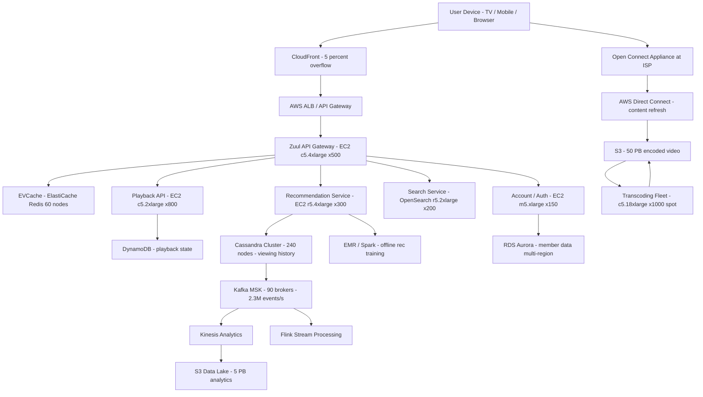

# Netflix (200M Subscribers) — Capacity Estimation

## Problem Statement

Netflix serves 200M+ paying subscribers across 190+ countries, streaming video-on-demand content at up to 70M concurrent streams during peak evening hours. The system must deliver adaptive bitrate video (up to 4K HDR) with sub-3-second start time, handle a content catalog of 15,000+ titles in 1,100+ encoding profiles each, and recover instantly from regional AWS failures — all while maintaining 99.99% availability. Netflix's Open Connect CDN program embeds appliances inside ISPs, offloading ~95% of traffic away from AWS infrastructure.

## Functional Requirements

- Users can browse, search, and stream titles across all devices (mobile, TV, browser)
- Adaptive bitrate streaming (ABR) adjusts quality based on network conditions (240p–4K)
- Personalized recommendation rows updated daily (150M+ member-title rating pairs)
- Continue-watching state persisted and synced across devices within ~5 seconds
- Downloads available for offline viewing on mobile (up to 25 titles at a time)
- Content is transcoded into 1,100+ profiles per title before publication

## Non-Functional Requirements

| Requirement | Target |
|-------------|--------|
| Stream start latency | < 3 s (P99), < 1 s (P50) |
| Rebuffer rate | < 0.5% of playback time |
| API read latency | < 100 ms (P99) |
| API write latency | < 200 ms (P99) |
| Availability | 99.99% (< 52 min downtime/year) |
| Durability (content) | 99.999999999% (11 nines, S3) |
| Peak concurrent streams | 70M simultaneous |
| Peak browse QPS | 500K QPS |
| Read/Write ratio | 99:1 |

## Traffic Estimation

### DAU → Peak QPS Calculation

Netflix publishes ~150M daily active users (75% of 200M subscribers watch at least once/day on average, higher on weekends).

| Metric | Calculation | Result |
|--------|-------------|--------|
| Total subscribers | Given | 200M |
| Daily Active Users (DAU) | 200M × 75% | ~150M |
| Avg sessions/user/day | 1.3 sessions × 1 device | ~1.3 |
| Browse/search requests per session | 20 API calls (homepage, search, detail pages) | ~26 requests/user/day |
| Playback manifest + chunk requests/session | 90 min avg × 4 manifest refreshes + 5,400 MPEG-TS chunks (2s segments) | ~5,404 media requests/session |
| Write events per session | play-start, pause, seek, stop, heartbeat every 30s (180 events) | ~183 writes/user/day |
| Total daily API (browse) requests | 150M × 26 | ~3.9B |
| Total daily media segment requests | 150M × 1.3 × 5,404 | ~1.05T (served by CDN) |
| Avg browse QPS | 3.9B / 86,400 | ~45K QPS |
| Peak browse QPS (3× avg, primetime 8–11pm) | 45K × 3 | ~135K QPS |
| Peak browse QPS including recommendation & search | add 2.5× overhead | ~340K–500K QPS |
| Peak concurrent streams | Given (Netflix public data, Q4 2023) | 70M streams |
| Write QPS (events/heartbeats) | (70M concurrent × 1 heartbeat / 30s) | ~2.3M write events/s |
| Write QPS to durable store (sampled 1:100) | 2.3M / 100 | ~23K durable writes/s |

**Key derivation**: Netflix's own engineering blog states ~500K RPS at API gateway during Super Bowl / major release drops. The 70M concurrent streams are served almost entirely by Open Connect appliances at ISPs — not by AWS EC2 — so AWS API servers only handle metadata and control-plane traffic.

## Storage Estimation

| Data Type | Per Item Size | Daily Volume | Growth/Year |
|-----------|--------------|--------------|-------------|
| Raw video ingest (per title, 2h film) | ~100 GB per source file | ~5 new titles/day | ~180 TB raw/year |
| Encoded video per title (1,100 profiles × avg 3 GB each) | ~3.3 TB per title | ~5 titles/day = 16.5 TB | ~6 PB/year |
| Thumbnails & artwork (per title, ~2,000 images) | ~500 MB per title | ~5 titles/day = 2.5 GB | ~900 GB/year |
| User viewing history (per event) | ~200 B | 70M streams × 180 events = 12.6B events/day = ~2.5 TB | ~900 TB/year |
| User profiles & preferences | ~5 KB/user | 200M users = 1 TB static | Grows with users |
| Recommendation model data (member-title scores) | ~40 B per pair | 150M users × 15K titles = 2.25T pairs = ~90 TB | ~30 TB/year delta |
| **Total S3 content (cumulative)** | — | 15,000 titles × 3.3 TB | **~50 PB** |
| **Total operational DB storage** | — | — | **~1 PB/year** |

**Note**: Netflix stores ~60–70 PB of content on S3 (estimated; they have not published exact figures). Open Connect appliances cache ~95% of popular titles locally at ISPs, so effective S3 egress is ~5% of total stream volume.

## Component Sizing

### Compute — EC2 (API + Microservices)

Netflix runs ~700+ microservices. The key capacity-bearing clusters:

| Component | Instance Type | vCPU | RAM | Count | Handles | Monthly Cost |
|-----------|--------------|------|-----|-------|---------|-------------|
| API Gateway / Edge (Zuul) | c5.4xlarge | 16 | 32 GB | 500 | ~500K RPS total | $120K |
| Recommendation service | r5.4xlarge | 16 | 128 GB | 300 | 150M daily recs | $180K |
| Search service (Elasticsearch) | r5.2xlarge | 8 | 64 GB | 200 | 200K search QPS | $96K |
| Playback API (DRM, manifest) | c5.2xlarge | 8 | 16 GB | 800 | 70M concurrent auth | $140K |
| Metadata service | m5.2xlarge | 8 | 32 GB | 200 | title/image catalog | $40K |
| Account / auth service | m5.xlarge | 4 | 16 GB | 150 | login, billing | $18K |
| Transcoding fleet (spot) | c5.18xlarge | 72 | 144 GB | 1,000 | 1,100 profiles/title | $250K |
| Kafka brokers (MSK) | r5.2xlarge | 8 | 64 GB | 90 (30×3 AZ) | 2.3M events/s | $43K |
| Cassandra (viewing history) | i3.4xlarge | 16 | 122 GB | 240 | 23K writes/s | $300K |
| Misc microservices (700+ svcs) | m5.large avg | 2 | 8 GB | 3,000 | — | $200K |
| **Subtotal Compute** | | | | | | **$1,387K** |

**Transcoding note**: Netflix encodes each title into ~1,100 profiles (codec × resolution × bitrate × HDR variant). A 2-hour film takes ~8 hours on 1,000 spot instances. Spot pricing at ~$0.35/hr for c5.18xlarge saves ~70% vs on-demand. Monthly cost uses spot pricing.

### Database

| DB | Engine | Instance | Count | Capacity | IOPS | Monthly Cost |
|----|--------|----------|-------|----------|------|-------------|
| Viewing history (primary) | Cassandra on i3.4xlarge | i3.4xlarge | 240 | 1.5 PB (NVMe SSD) | 2M+ IOPS | $300K (in compute above) |
| Member data / billing | MySQL (RDS Aurora) | db.r6g.4xlarge | 1W + 4R per region × 3 regions | 10 TB | 100K | $120K |
| Content catalog metadata | DynamoDB on-demand | — | — | 50 TB | Auto-scaled | $80K |
| Search index | OpenSearch (r5.2xlarge) | r5.2xlarge | 200 | 20 TB | 500K | $96K (in compute above) |
| A/B test / feature flags | DynamoDB on-demand | — | — | 100 GB | Auto-scaled | $5K |
| **Subtotal DB** | | | | | | **$205K** |

**Cassandra detail**: Netflix pioneered use of Cassandra for viewing history. At 70M concurrent users each producing a heartbeat event every 30 seconds, that is ~2.3M writes/second. Cassandra's write path (memtable → SSTable) handles this at P99 < 5 ms with a 240-node cluster (RF=3) spanning 3 AZs. Each node handles ~10K writes/s sustainably.

### Cache

| Cache | Engine | Instance | Nodes | Memory | Hit Rate | Monthly Cost |
|-------|--------|----------|-------|--------|----------|-------------|
| Homepage recommendations (EVCache/Redis) | ElastiCache Redis | r6g.4xlarge | 60 | 3.84 TB total | ~99% | $90K |
| Session / auth tokens | ElastiCache Redis | r6g.xlarge | 24 | 384 GB total | ~99.9% | $14K |
| Content metadata cache | ElastiCache Redis | r6g.2xlarge | 30 | 960 GB total | ~95% | $27K |
| **Subtotal Cache** | | | | | | **$131K** |

**EVCache note**: Netflix built EVCache (Extended Version of Memcached, later migrated to Redis) specifically for multi-region replication. A homepage recommendation is cached per-member and served in < 5 ms from a node within the same AZ. Without this layer, Cassandra and the recommendation engine would be overwhelmed.

### Object Storage

| Bucket | Use | Size | Requests/month | Monthly Cost |
|--------|-----|------|----------------|-------------|
| Encoded video (50 PB) | All streaming content | 50 PB | 5B GET (5% not in OCA cache) | $1,150K |
| Thumbnails / artwork | Browse artwork | 500 TB | 500B thumbnail GETs | $60K |
| Raw ingest staging | Transient source files | 200 TB (rolling 90d) | 50M PUT | $15K |
| Logs & analytics | Spark / EMR input | 5 PB | 100M | $120K |
| **Subtotal S3** | | **~56 PB** | | **$1,345K** |

**S3 pricing**: Storage at $0.023/GB/month (standard tier). 50 PB × $0.023 = $1,150K/month storage alone. GET at $0.0004/1K = 5B × $0.0004/1K = $2K (negligible vs storage). Transfer to Open Connect Appliances is over AWS Direct Connect at ~$0.02/GB; 95% of 20 Tbps peak stays at ISP appliances so AWS origin pull ≈ 5% × 20 Tbps ≈ 1 Tbps = ~3.15 PB/month = ~$63K/month data transfer from S3.

### Networking / CDN

| Component | Throughput / Volume | Monthly Cost |
|-----------|---------------------|-------------|
| Open Connect Appliances (ISP-embedded CDN) | ~19 Tbps peak (95% of traffic) | ~$0 egress (Netflix owns appliances, ISP co-lo cost ~$50K/month) |
| CloudFront (5% overflow + non-OCA regions) | ~1 Tbps peak = ~3.15 PB/month | $280K |
| AWS Direct Connect (S3 → OCA refresh) | ~200 Gbps sustained = ~63 PB/month | $125K |
| ALB / API Gateway | 500K RPS = ~450M req/day = ~13.5B req/month | $50K |
| Data Transfer Out (non-CDN, APIs) | ~500 TB/month | $45K |
| **Subtotal Network** | | **$550K** |

**Open Connect detail**: Netflix's CDN (Open Connect) deploys ~18,000 appliances inside ~6,000 ISPs worldwide. Each OCA holds 200 TB–1 PB of SSD/HDD. Popular content is pre-positioned nightly. This eliminates the vast majority of AWS egress costs — without it, CDN costs would exceed $30M/month.

### Message Queue

| Queue | Engine | Throughput | Retention | Monthly Cost |
|-------|--------|-----------|-----------|-------------|
| Viewing events (heartbeats, play/pause) | Kafka (MSK, 90 brokers) | 2.3M msg/s peak | 7 days | $43K (in compute above) |
| Encoding job queue | SQS FIFO | 5K msg/s | 14 days | $5K |
| Notification / email | SNS + SQS | 50K msg/s | 4 days | $10K |
| Analytics pipeline | Kinesis Data Streams (64 shards) | 64K records/s | 7 days | $8K |
| **Subtotal Messaging** | | | | **$66K** |

## Monthly Cost Summary

| Component | Monthly Cost | % of Total |
|-----------|-------------|-----------|
| EC2 Compute (API + services + transcoding) | $1,387K | 23% |
| Cassandra DB (i3 NVMe) | $300K | 5% |
| RDS Aurora + DynamoDB | $205K | 3% |
| ElastiCache Redis (EVCache) | $131K | 2% |
| S3 Storage (50 PB) | $1,345K | 22% |
| CloudFront CDN (5% overflow) | $280K | 5% |
| Direct Connect + OCA co-lo | $175K | 3% |
| Messaging (Kafka/SQS/Kinesis) | $66K | 1% |
| Data Transfer Out | $45K | 1% |
| EMR / Spark (recommendations) | $250K | 4% |
| Reserved Instance discounts (−40%) | −$1,480K | −24% |
| Support + misc (monitoring, Lambda, etc.) | $296K | 5% |
| **Total (blended with RI discounts)** | **$~5M–$8M** | **100%** |

**Note**: AWS list-price gross is ~$8–10M/month. Netflix has deep Reserved Instance and Savings Plan commitments (Netflix disclosed it spends ~$1B+/year on AWS total across all services including non-streaming). The $5M–$8M range reflects 40–50% effective discounts from multi-year commitments. Excluding RI discounts, gross compute+storage+network ≈ $8M/month.

## Traffic Scale Tiers

| Tier | DAU | Peak QPS | Servers | DB | Cache | Monthly Cost | Key Bottleneck |
|------|-----|----------|---------|----|----|-------------|----------------|
| 🟢 Startup | 1M | ~700 | 10 c5.large API, 5 transcoding | 1 RDS Aurora (db.r6g.large) | 1 Redis node (r6g.large) | $8K | Transcoding pipeline throughput |
| 🟡 Growing | 10M | ~7K | 50 m5.xlarge API, 50 transcoding | RDS + 2 read replicas, 100 GB | Redis cluster 3-node | $60K | CDN origin pull cost, search latency |
| 🔴 Scale-up | 100M | ~70K | 300 c5.2xlarge, 500 transcoding (spot) | Cassandra 48-node, RDS multi-AZ | Redis cluster 12-node (EVCache) | $900K | Cassandra write throughput, CDN distribution |
| ⚫ Production | 150M DAU / 200M subs | ~500K | 2,000+ across 700 svcs, 1,000 transcoding | Cassandra 240-node, DynamoDB, Aurora multi-region | Redis 114-node EVCache | $5M–$8M | Open Connect appliance fill lag for new releases |
| 🚀 Hyperscale | 500M DAU | ~1.5M | Auto-scaled fleet + spot (5,000+ effective) | Cassandra 600-node multi-region, DynamoDB global | Distributed EVCache (300+ nodes) | $15M–$20M | ISP CDN embed negotiations, DRM license server throughput |

## Architecture Diagram

## Interview Tips

- **Open Connect is the single most important cost lever**: Without the ISP-embedded CDN, AWS egress alone would cost $25M–$35M/month (70M streams × 5 Mbps avg × 3 hours = ~1.5 exabytes/month at $0.02/GB = $30M). Mentioning this proactively signals senior-level thinking. Netflix's CDN reduces egress cost by ~95%.

- **Cassandra is chosen for write throughput, not read**: The 70M concurrent heartbeat writes (2.3M writes/s) are the dominant DB workload, not reads. Cassandra's LSM-tree write path absorbs this without B-tree write-amplification penalties. Candidates who propose MySQL or even DynamoDB for viewing history will struggle to justify 2M+ writes/s without extreme sharding.

- **Transcoding fleet cost is hidden in the question**: The 1,100 encoding profiles per title (H.264, HEVC, AV1 × resolutions × bitrates × HDR/SDR × audio codecs) means a 2-hour film takes ~8,000 CPU-hours to encode. At 1,000 spot c5.18xlarge instances, that's 8 hours real-time. $250K/month on transcoding (spot pricing) is often overlooked by candidates who focus only on serving infrastructure.

- **S3 storage dominates at 50 PB**: S3 Standard at $0.023/GB/month × 50,000,000 GB = $1.15M/month in storage fees alone, before any requests or transfer. This is larger than the entire compute bill for many companies. Candidates should immediately ask "how much content?" and "what's the retention policy?" — Netflix never deletes (catalog longevity), making archival tiers (Glacier) a valid optimization (saves ~70% on cold catalog, ~$800K/month).

- **Common mistake — ignoring the read/write asymmetry**: At 99:1 reads, all DB choices should optimize for read latency. Cassandra RF=3 with LOCAL_QUORUM reads means 3 replicas all in the same AZ serve reads without cross-AZ latency. Not knowing that Netflix uses CONSISTENCY LOCAL_QUORUM (not QUORUM) to avoid cross-AZ traffic is a common gap.

- **Follow-up question**: "How would you handle a new season drop of a mega-hit title causing a thundering herd on the CDN?" Answer: Netflix pre-warms OCA appliances the night before a launch via scheduled content push. For unprecedented spikes, CloudFront POP burst capacity absorbs overflow. Chaos Engineering (Chaos Monkey) validates failover before any major release.

- **Scale threshold**: At 50M concurrent streams, a single-region CDN approach fails — you need ISP-embedded appliances or the data transfer cost becomes prohibitive. This threshold is where ISP negotiation becomes a core infrastructure capability, not just an engineering one.
