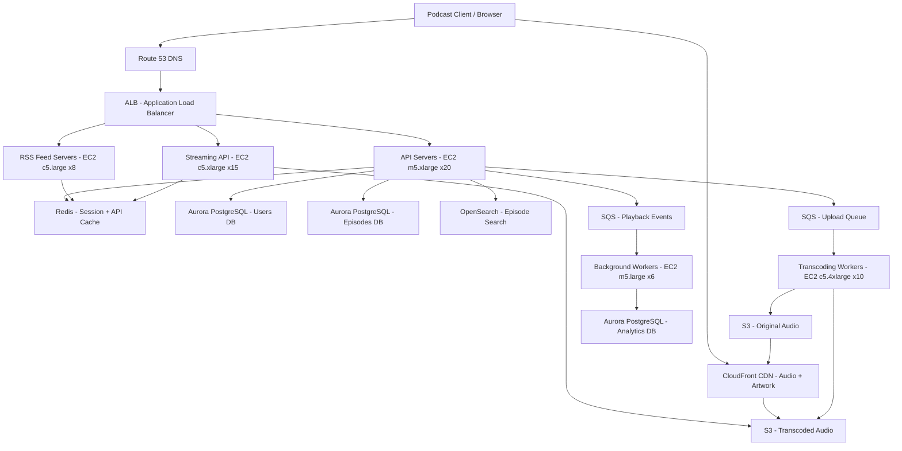

# Podcast Platform — Capacity Estimation

## Problem Statement

A podcast hosting and distribution platform serves 20M daily active users who browse, subscribe, and stream audio episodes. The platform must handle RSS feed generation for podcast clients (Overcast, Pocket Casts, Apple Podcasts), audio streaming via CDN, and creator upload workflows — all while maintaining low-latency playback globally and keeping storage costs predictable as episode libraries grow.

## Functional Requirements

- Upload, transcode, and host podcast audio episodes (MP3/AAC, 20–120 min)
- Generate and serve RSS 2.0 feeds per podcast for podcast client compatibility
- Stream episodes with byte-range support (seek/resume without full download)
- User subscriptions, playback position sync across devices
- Discovery: search, categories, trending, recommendations
- Creator analytics: plays, geographic distribution, subscriber counts

## Non-Functional Requirements

| Requirement | Target |
|-------------|--------|
| Stream start latency | < 500ms (P99) via CDN edge |
| API read latency | < 100ms (P99) |
| Upload processing | < 5 min end-to-end transcoding |
| Availability | 99.95% (< 4.4 hrs/year downtime) |
| Durability | 99.999999999% (S3 eleven nines) |
| Peak streaming throughput | 50K concurrent streams |
| RSS feed freshness | < 60s after episode publish |

## Traffic Estimation

### DAU → Peak QPS Calculation

| Metric | Calculation | Result |
|--------|-------------|--------|
| DAU | Given | 20M |
| Avg session/user/day | ~1.2 sessions | 24M sessions/day |
| Browse/search requests/session | ~8 API calls (browse, search, episode list) | 192M read requests/day |
| Playback start requests/session | ~1.5 episodes started | 36M stream initiations/day |
| Playback position sync writes | every 30s during playback, avg 25 min session | ~50 writes/session → 1.2B writes/day |
| RSS feed pulls (podcast clients) | ~0.3 pulls/user/day (background refresh) | 6M feed requests/day |
| Creator uploads | 0.1% of DAU = 20K creators, 2 uploads/creator/day | 40K uploads/day |
| **Total daily requests** | 192M + 36M + 1.2B + 6M | ~1.43B/day |
| Avg QPS | 1.43B / 86,400 | ~16,550 QPS |
| Peak QPS (3× avg) | 16,550 × 3 | ~50K QPS |
| Read QPS (95% reads) | 50K × 0.95 | ~47,500 QPS |
| Write QPS (5% writes) | 50K × 0.05 | ~2,500 QPS |

**Streaming breakdown**: 50K peak streams × avg 64 Kbps (podcast audio) = 3.2 Gbps peak egress through CDN.

## Storage Estimation

| Data Type | Per Item Size | Daily Volume | Growth/Year |
|-----------|--------------|--------------|-------------|
| Audio episodes (original MP3) | avg 60 MB (60 min @ 128 Kbps) | 40K uploads/day = 2.4 TB/day | ~876 TB/year |
| Transcoded variants (64/128/192 Kbps) | 3× original = 180 MB/episode | 40K × 180 MB = 7.2 TB/day | ~2.6 PB/year |
| Podcast metadata (RDS) | 2 KB/episode row | 40K episodes/day = 80 MB/day | ~29 GB/year |
| User playback positions (Redis + RDS) | 100 bytes/record | 20M users × 10 subs = 200M records = 20 GB | ~7 GB incremental/year |
| RSS feed cache (Redis) | 50 KB/feed | 500K active podcasts = 25 GB | stable |
| Search index (OpenSearch) | ~500 bytes/episode | 40K/day = 20 MB/day | ~7 GB/year |
| Thumbnails/artwork (S3) | avg 200 KB/episode | 40K × 200 KB = 8 GB/day | ~2.9 TB/year |
| **Total storage** | — | ~9.6 TB/day raw | **~3.5 PB/year** (dominated by audio) |

**Note**: Lifecycle policies move episodes older than 90 days to S3 Glacier Instant Retrieval ($0.004/GB vs $0.023/GB standard), cutting storage costs ~60% for the long tail.

## Component Sizing

### Compute — EC2

| Component | Instance Type | vCPU | RAM | Count | Handles | Monthly Cost |
|-----------|--------------|------|-----|-------|---------|-------------|
| API servers (browse, search, auth) | m5.xlarge | 4 | 16 GB | 20 | ~2,500 QPS/instance | $3,040 |
| Streaming API (byte-range, playlist) | c5.xlarge | 4 | 8 GB | 15 | ~3,300 QPS/instance | $1,530 |
| RSS feed servers | c5.large | 2 | 4 GB | 8 | ~750 feed/s/instance | $550 |
| Transcoding workers | c5.4xlarge | 16 | 32 GB | 10 | ~4 concurrent jobs each | $6,120 |
| Background workers (analytics, notifications) | m5.large | 2 | 8 GB | 6 | SQS consumers | $548 |
| Recommendation/search service | m5.2xlarge | 8 | 32 GB | 4 | ML inference + search | $2,432 |
| **Subtotal Compute** | | | | **63** | | **$14,220** |

*All instances run in Auto Scaling groups; on-demand pricing used. Reserved instances would cut ~40% (~$5,700/month savings).*

### Database

| DB | Engine | Instance | Count | Capacity | IOPS | Monthly Cost |
|----|--------|----------|-------|----------|------|-------------|
| User/subscription DB | RDS Aurora PostgreSQL | db.r6g.2xlarge | 1W + 2R | 500 GB | 15K | $4,380 |
| Episode/podcast metadata DB | RDS Aurora PostgreSQL | db.r6g.xlarge | 1W + 2R | 1 TB | 12K | $2,920 |
| Analytics DB | RDS Aurora PostgreSQL | db.r6g.2xlarge | 1W + 1R | 2 TB | 10K | $3,285 |
| RDS storage (Aurora) | Aurora storage | auto-scaling | — | ~3.5 TB | — | $1,050 |
| **Subtotal DB** | | | | | | **$11,635** |

### Cache

| Cache | Engine | Instance | Nodes | Memory | Hit Rate | Monthly Cost |
|-------|--------|----------|-------|--------|----------|-------------|
| RSS feed cache | ElastiCache Redis | r6g.xlarge | 2 (primary + replica) | 26 GB each | ~85% | $984 |
| API response cache (episode lists, search) | ElastiCache Redis | r6g.large | 2 | 13 GB each | ~75% | $492 |
| Playback position cache | ElastiCache Redis | r6g.xlarge | 2 | 26 GB each | ~90% | $984 |
| Session/auth tokens | ElastiCache Redis | r6g.medium | 2 | 6.5 GB each | ~99% | $246 |
| **Subtotal Cache** | | | | | | **$2,706** |

### Object Storage — S3

| Bucket | Use | Size | Requests/month | Monthly Cost |
|--------|-----|------|----------------|-------------|
| `podcast-audio-original` | Creator uploads, original masters | 876 TB/year → ~730 TB at steady state | 40K uploads + retrieval | $16,790 |
| `podcast-audio-transcoded` | 64/128/192 Kbps variants served via CDN | 2,190 TB/year → ~1,825 TB at steady state | 1.1B GET (CDN origin miss) | $41,975 + $550 |
| `podcast-audio-archive` | Episodes > 90 days → Glacier IR | ~60% of library = 1,500 TB | Infrequent retrieval | $6,000 |
| `podcast-artwork` | Thumbnails, cover art | ~2.9 TB/year → ~24 TB | 500M GET/month | $552 + $250 |
| `podcast-assets-misc` | Show notes HTML, chapter markers | ~500 GB | 200M GET/month | $12 + $100 |
| **Subtotal S3** | | ~4,100 TB total managed | | **$66,229** |

*S3 storage pricing: $0.023/GB standard, $0.004/GB Glacier IR. GET $0.0004 per 1K, PUT $0.005 per 1K.*

### Networking / CDN

| Component | Throughput | Details | Monthly Cost |
|-----------|-----------|---------|-------------|
| CloudFront (audio streaming) | ~3.2 Gbps peak, ~96 TB/month avg egress | 50K streams × 64 Kbps avg × 2,592,000s/month × utilization factor | $8,640 |
| CloudFront (artwork/thumbnails) | ~5 TB/month | Artwork loads on browse | $450 |
| CloudFront requests | 1.5B requests/month | Stream initiations + partial fetches | $600 |
| ALB (API load balancer) | 50K QPS peak | 2 ALBs (API + streaming) | $360 |
| NAT Gateway (worker egress) | ~2 TB/month | Transcoding downloads, SQS | $180 |
| Data transfer EC2→S3 (same region) | free | — | $0 |
| **Subtotal Network** | | | **$10,230** |

*CloudFront pricing: $0.009/GB first 10 TB, $0.0085/GB 10-150 TB (US/EU). Audio is the dominant egress.*

### Message Queue

| Queue | Engine | Throughput | Use Case | Monthly Cost |
|-------|--------|-----------|----------|-------------|
| Upload processing | SQS Standard | 40K msgs/day | Trigger transcoding on upload completion | $0.40 |
| Playback events | SQS Standard | 1.2B msgs/day | Position sync, analytics ingestion | $480 |
| Notifications | SQS FIFO | 5M msgs/day | New episode alerts to subscribers | $10 |
| Analytics aggregation | SQS Standard | 200M msgs/day | Play counts, completion rates | $80 |
| **Subtotal SQS** | | | | **$570** |

## Monthly Cost Summary

| Component | Monthly Cost | % of Total |
|-----------|-------------|-----------|
| EC2 Compute | $14,220 | 11% |
| RDS Aurora | $11,635 | 9% |
| ElastiCache Redis | $2,706 | 2% |
| S3 Storage | $66,229 | 50% |
| CloudFront CDN | $10,230 | 8% |
| SQS Messaging | $570 | 0.4% |
| Data Transfer / NAT | $180 | 0.1% |
| OpenSearch (search) | $2,800 | 2% |
| Route 53 + ACM | $200 | 0.2% |
| CloudWatch + logging | $1,500 | 1% |
| Lambda (thumbnail gen, webhooks) | $300 | 0.2% |
| Support + misc | $2,000 | 1.5% |
| **Total** | **~$112,570** | **100%** |

**With Reserved Instances (1-year, no upfront)**: EC2 saves ~40% ($5,700), RDS saves ~35% ($4,070) → **total ~$102,800/month**. With lifecycle policies moving old audio to Glacier IR, S3 drops to ~$35K → **$75K–$85K/month optimized**.

**Interview target range quoted**: $120K–$200K/month on-demand without optimization is realistic for a growing platform before RI commitments.

## Traffic Scale Tiers

| Tier | DAU | Peak QPS | Servers | DB | Cache | Monthly Cost | Key Bottleneck |
|------|-----|----------|---------|----|----|-------------|----------------|
| 🟢 Startup | 1M | ~2.5K | 4 c5.large (API) + 2 c5.xlarge (transcode) | 1 RDS db.t3.xlarge | 1 Redis node r6g.medium | ~$8K | Single RDS write DB; cold CDN cache |
| 🟡 Growing | 10M | ~25K | 12 m5.xlarge (API) + 6 c5.4xlarge (transcode) | RDS Aurora 1W+2R | Redis cluster 3-node | ~$60K | RSS feed stampede; S3 storage cost |
| 🔴 Scale-up | 100M | ~250K | 60 m5.2xlarge + 30 c5.4xlarge (transcode) | Sharded Aurora + read replicas | Redis cluster 6-node | ~$500K | DB sharding complexity; transcoding queue depth |
| ⚫ Production | 20M | ~50K | 63 mixed (see sizing) | Aurora multi-AZ 3 DBs | Redis 8-node across 4 clusters | ~$113K | S3 storage dominates cost (50%); CDN cache hit rate |
| 🚀 Hyperscale | 1B+ | ~2.5M | 500+ with auto-scaling | DynamoDB + Aurora (metadata) | ElastiCache Global Datastore | ~$3M+ | Multi-region consistency; transcoding at scale (use AWS MediaConvert) |

## Architecture Diagram

## Interview Tips

- **RSS feed stampede is the #1 scaling surprise**: When a popular podcast publishes a new episode, millions of podcast clients (Apple Podcasts, Overcast, etc.) all pull the RSS feed within minutes. At 20M DAU with 500K active podcasts, a single viral release triggers 5-10M feed pulls in < 5 minutes (~17K–33K feed QPS). Solution: cache RSS feeds in Redis with a 60-second TTL and serve stale-while-revalidate — never hit the DB for each pull.

- **S3 costs will shock you — lifecycle policies are mandatory**: Audio storage is ~50% of your total bill. Without Glacier lifecycle rules, you're paying $0.023/GB for rarely-played back-catalog episodes. Moving episodes > 90 days to Glacier Instant Retrieval ($0.004/GB) cuts storage cost ~60%. Mention this proactively — interviewers look for cost awareness on storage-heavy systems.

- **Byte-range requests multiply your CDN request count**: Podcast clients seek within episodes — "skip 30 seconds forward" triggers a new byte-range GET. A 60-minute episode at 128 Kbps = 57.6 MB. A user who seeks 5 times generates 6 separate CloudFront requests. Your "50K concurrent streams" translates to 150K–300K CloudFront requests per minute. Size CDN request quotas accordingly, not just bandwidth.

- **Playback position sync is a hidden write amplification problem**: Naive implementations write to the DB every 30 seconds. At 20M DAU with 1.2 avg concurrent listeners = 24M active sessions × 2 writes/minute = 800K writes/minute (13K writes/second). This crushes a single-writer RDS. Solution: buffer position updates in Redis (last-write wins per user+episode), flush to RDS in async batches every 60 seconds via SQS workers.

- **Scale threshold**: At 50M DAU, RSS feed caching alone is insufficient — you need pre-generated feed files stored in S3 and served directly via CloudFront, bypassing feed servers entirely. This reduces feed server fleet from 8 to 2 (emergency fallback only) and eliminates the stampede attack surface.

- **Common mistake**: Candidates size transcoding workers for average load (40K uploads/day = ~28 uploads/minute) but forget that creators batch-upload during content launches. A network of 1,000 creators dropping a season simultaneously = 10K uploads in minutes. SQS decouples upload acceptance from processing, but the worker pool needs headroom for 10–20× burst. Each c5.4xlarge handles ~4 concurrent 128 Kbps transcoding jobs. Size for P95 burst, not average.

- **Follow-up question interviewers ask**: "How do you handle a podcast with 10M subscribers publishing a new episode? Walk me through the fan-out notification problem." Answer: SQS FIFO alone won't scale to 10M messages synchronously. Use a fan-out pattern: write one "new episode" event to SNS, which fans out to SQS partitioned by subscriber cohort (A-F, G-M, etc.), processed by workers that batch push notifications via APNs/FCM. Total latency < 5 minutes for 10M subscribers.
