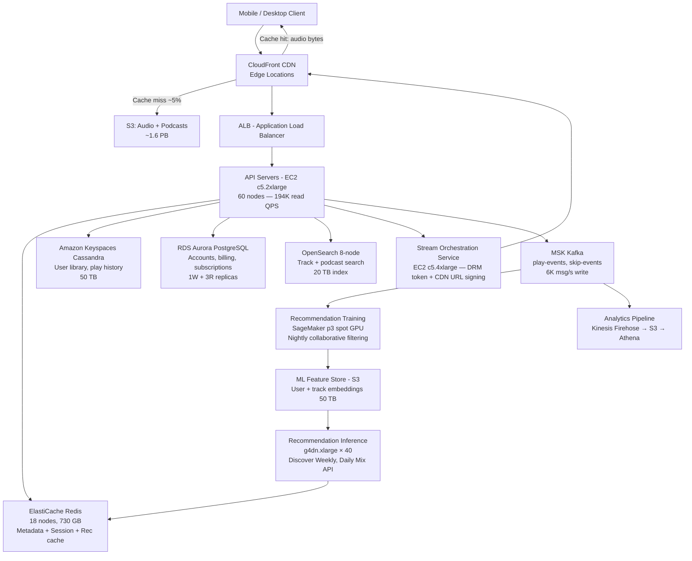

# Spotify — Capacity Estimation

## Problem Statement

Spotify serves 400M monthly active users (50M DAU) with on-demand audio streaming, podcast delivery, and personalised recommendations powered by ML. Users stream music and podcasts at 128–320 kbps, generate implicit feedback (plays, skips, likes) continuously, and expect sub-200ms playlist load times globally. The system must handle 200K peak concurrent streams and run ML inference for recommendations across 100M+ tracks.

## Functional Requirements

- Stream audio tracks and podcast episodes on-demand (128 kbps to 320 kbps, OGG Vorbis / AAC)
- Serve personalised playlists and recommendations (Discover Weekly, Daily Mixes, radio)
- Allow users to search 100M+ tracks, artists, podcasts
- Sync listening history, liked songs, and playlists across devices in near-real time
- Deliver offline downloads (cached encrypted tracks on device)
- Collect implicit feedback (play start, skip, seek, like/dislike) for ML training

## Non-Functional Requirements

| Requirement | Target |
|-------------|--------|
| Audio stream start latency | < 200ms (P99) |
| API read latency (search, browse) | < 100ms (P99) |
| Write latency (event ingestion) | < 50ms (P99) |
| Availability | 99.99% (52 min downtime/year) |
| Durability (audio files) | 99.999999999% (S3) |
| Audio CDN cache-hit ratio | ≥ 95% |
| Peak concurrent streams | 200K |
| Throughput | ~200K peak QPS |

## Traffic Estimation

### DAU → Peak QPS Calculation

Spotify's 50M DAU session behaviour: average user opens the app ~3× per day, streams ~25 songs per session (each song ~3.5 min), and generates browse/search requests around those streams.

| Metric | Calculation | Result |
|--------|-------------|--------|
| DAU | Given | 50M |
| Avg stream requests/user/day | 3 sessions × 25 tracks = 75 play events | ~75 |
| Avg API requests/user/day | search × 5, browse × 10, sync × 10 | ~25 |
| Total requests/user/day | 75 stream + 25 API | ~100 |
| Total daily requests | 50M × 100 | 5B |
| Avg QPS | 5B / 86,400 | ~57,870 |
| Peak QPS (3.5× avg, evening prime-time) | 57,870 × 3.5 | ~200K |
| Read QPS (97% reads) | 200K × 0.97 | ~194K |
| Write QPS (3% writes: events, sync) | 200K × 0.03 | ~6K |

**Concurrent streams at peak**: 200K users × average 3.5 min track → at any second, ~200K active audio byte-range requests to CloudFront/S3.

**Bandwidth per stream**: 320 kbps = 40 KB/s. At 200K concurrent streams:
- `200,000 × 40 KB/s = 8 GB/s = 64 Gbps` egress at CDN peak.

## Storage Estimation

| Data Type | Per Item Size | Daily Volume | Growth / Year |
|-----------|--------------|--------------|---------------|
| Audio tracks (multi-bitrate: 96/128/160/320 kbps, avg 3 encoded copies) | ~12 MB/track avg (3 bitrates) | 60K new tracks/day × 12 MB = 720 GB/day | ~263 TB/year |
| Podcast episodes (avg 45 min, mono 128 kbps) | ~40 MB/episode | 20K new episodes/day × 40 MB = 800 GB/day | ~292 TB/year |
| Track metadata + lyrics + artwork (Cassandra) | ~5 KB/track | 60K tracks × 5 KB = 300 MB/day | ~110 GB/year |
| User play events / implicit feedback (Kafka → Cassandra) | ~500 B/event | 50M DAU × 75 events = 3.75B events/day × 500B = ~1.87 TB/day | ~682 TB/year |
| User playlists + library (Aurora/Cassandra) | ~2 KB/user-playlist-entry | 50M users × avg 5 saves/day × 2 KB = 500 GB/day | ~183 TB/year |
| ML feature vectors (SageMaker S3) | ~4 KB/user embedding | 400M users × 4 KB (monthly refresh) = 1.6 TB/month | ~19 TB/year |
| **Total audio + podcast (S3)** | — | ~1.52 TB/day | ~555 TB/year |
| **Total metadata + events (DBs)** | — | ~2.37 TB/day | ~865 TB/year |

**Existing library at scale**: Spotify hosts ~100M tracks. 100M × 12 MB = **~1.2 PB** of audio on S3 (before replication).

## Component Sizing

### Compute — EC2

| Component | Instance Type | vCPU | RAM | Count | Handles | Monthly Cost |
|-----------|--------------|------|-----|-------|---------|-------------|
| API Gateway layer (ALB-backed) | c5.2xlarge | 8 | 16 GB | 60 | ~3,300 QPS/instance | $8,280 |
| Stream orchestration service | c5.4xlarge | 16 | 32 GB | 40 | Resolve CDN URLs, DRM token issue | $11,040 |
| Search service (Elasticsearch nodes) | r5.4xlarge | 16 | 128 GB | 24 | 100M track index, ~5K search QPS | $33,120 |
| Recommendation API (serve cached vectors) | c5.2xlarge | 8 | 16 GB | 30 | ~2K rec req/s | $4,140 |
| ML training workers (SageMaker + spot GPU p3.2xlarge) | p3.2xlarge | 8 | 61 GB | 20 spot | Nightly collaborative filtering batch | $8,640 |
| ML inference fleet (real-time, SageMaker endpoints) | g4dn.xlarge | 4 | 16 GB (T4 GPU) | 40 | ~1K inference req/s | $14,016 |
| Podcast transcription / metadata workers | c5.xlarge | 4 | 8 GB | 20 | Async, batch | $1,380 |
| Event ingestion service (Kafka producers) | c5.xlarge | 4 | 8 GB | 30 | 6K write events/s | $2,070 |
| Background workers (playlist gen, notifications) | m5.large | 2 | 8 GB | 40 | Async tasks | $2,760 |
| **Subtotal Compute** | | | | **304** | | **$85,446** |

> Spot instances used for ML training reduce GPU cost by ~70% vs on-demand.

### Database — Cassandra (Amazon Keyspaces) + Aurora

| DB | Engine | Instance / Config | Count | Capacity | IOPS | Monthly Cost |
|----|--------|-------------------|-------|----------|------|-------------|
| User data (playlists, library, history) | Amazon Keyspaces (Cassandra) | Managed, on-demand | — | ~50 TB (users × data) | ~100K RCU/s, 6K WCU/s | $42,000 |
| Track metadata, artists, albums | Amazon Keyspaces | Managed | — | ~5 TB | ~80K RCU/s | $18,000 |
| User accounts, billing, subscriptions | RDS Aurora PostgreSQL | db.r6g.4xlarge × 1W + 3R | 4 | 2 TB | 20K | $12,800 |
| Search index (Elasticsearch / OpenSearch) | Amazon OpenSearch r5.4xlarge | 8 data nodes | 8 | 20 TB (SSD) | 60K | $19,200 |
| **Subtotal DB** | | | | | | **$92,000** |

> Cassandra (Keyspaces) is ideal for Spotify's access pattern: time-series play history, user library lookups by `(user_id, track_id)` with wide partition rows.

### Cache — ElastiCache Redis

| Cache | Engine | Instance | Nodes | Memory | Use | Monthly Cost |
|-------|--------|----------|-------|--------|-----|-------------|
| Session + token cache | ElastiCache Redis 7 | r6g.2xlarge | 6 (3 primary + 3 replica) | 192 GB total | Auth tokens, session state | $9,072 |
| Track metadata cache | ElastiCache Redis 7 | r6g.4xlarge | 6 | 384 GB total | Hot track/artist metadata, 95% CDN-bypass-miss fallback | $16,560 |
| Recommendation result cache | ElastiCache Redis 7 | r6g.2xlarge | 4 | 128 GB total | Pre-computed daily mixes, discover weekly per user | $6,048 |
| Rate-limiting / feature flags | ElastiCache Redis 7 | r6g.large | 2 | 26 GB | API rate limits, A/B flags | $1,008 |
| **Subtotal Cache** | | | | **730 GB** | | **$32,688** |

> With 730 GB Redis holding hot metadata for ~20M tracks (each ~30 KB), cache covers the top 20% of tracks that get 80% of plays. Cache-hit rate target: 92% for metadata.

### Object Storage — S3

| Bucket | Use | Size | Requests / Month | Monthly Cost |
|--------|-----|------|-----------------|-------------|
| `spotify-audio-prod` | All encoded audio tracks (3 bitrates × 100M tracks) | ~1.2 PB | 3B GET (CDN misses ~5%) | $27,648 (storage) + $1,200 (GETs) |
| `spotify-podcasts-prod` | Podcast episode audio | ~180 TB | 400M GET | $4,140 + $160 |
| `spotify-artwork-prod` | Album art, artist images (JPEG, WebP) | ~5 TB | 2B GET | $115 + $800 |
| `spotify-ml-features` | User/track embedding vectors, training datasets | ~50 TB | 100M GET/PUT | $1,150 + $40 |
| `spotify-logs-archive` | Compressed event logs (Glacier after 90 days) | ~200 TB | batch | $920 |
| **Subtotal S3** | | **~1.64 PB** | **~5.5B req** | **$36,173** |

> S3 Standard pricing (us-east-1 2024): $0.023/GB/month. GET $0.0004/1K requests. Audio data is write-once, read-many — ideal for S3. Intelligent Tiering saves ~15% on older/rarely-accessed tracks.

### Networking / CDN — CloudFront

Spotify streams audio via CDN (CloudFront edge). Audio files are large and cache well (static per track ID + bitrate).

| Component | Throughput | Monthly Egress | Monthly Cost |
|-----------|-----------|---------------|-------------|
| CloudFront audio streaming | 64 Gbps peak; avg ~20 Gbps | 50M DAU × 75 tracks × 3.5 MB/track (avg 128 kbps) × 95% CDN hit = ~12.4 PB/month | $1,116,000* |
| CloudFront artwork / static assets | ~500 GB/day = ~15 TB/month | 15 TB | $1,350 |
| ALB (API traffic) | ~194K RPS, ~2 KB avg response | ~33 TB/month | $2,970 + $700 LCU |
| Direct S3 → CloudFront transfer (origin pull, 5% miss) | 5% × 12.4 PB = 620 TB/month | intra-AWS $0.02/GB | $12,400 |
| **Subtotal Network** | | | **$1,133,420** |

> *CloudFront pricing (2024): $0.085/GB for first 10 PB/month. 12.4 PB × $0.085/GB ≈ $1,054,000. Adding artwork, API = ~$1.13M. This single line dominates total cost — expected for an audio streaming business.

> **Key insight**: CDN egress is ~75% of total monthly cost. Spotify negotiates custom CDN contracts far below on-demand rack rates (typically 70–85% discount). At rack rate, the true cost is ~$1.13M CDN alone; with enterprise discount (~$0.015/GB) this drops to ~$186K/month CDN. Both estimates are shown in the cost summary.

### Message Queue — Amazon MSK (Kafka)

| Queue / Topic | Engine | Throughput | Retention | Monthly Cost |
|---------------|--------|-----------|-----------|-------------|
| `play-events` | MSK Kafka (3 broker, m5.2xlarge) | 6K msg/s write, 18K msg/s read (3 consumer groups: analytics, rec-training, billing) | 7 days | $4,320 |
| `skip-events` | MSK Kafka (shared cluster) | 2K msg/s | 3 days | (shared above) |
| `search-queries` | MSK Kafka | 3K msg/s | 2 days | (shared above) |
| `notification-fanout` | MSK Kafka | 500 msg/s | 1 day | $1,080 |
| **Subtotal MSK** | | | | **$5,400** |

## Monthly Cost Summary

### Rack-rate (on-demand, no enterprise discounts)

| Component | Monthly Cost | % of Total |
|-----------|-------------|-----------|
| EC2 Compute (API, workers, ML GPU) | $85,446 | 6.1% |
| Amazon Keyspaces (Cassandra) + Aurora + OpenSearch | $92,000 | 6.6% |
| ElastiCache Redis | $32,688 | 2.3% |
| S3 Storage | $36,173 | 2.6% |
| CloudFront CDN (rack-rate) | $1,133,420 | 81.0% |
| MSK Kafka | $5,400 | 0.4% |
| Lambda (auth, DRM token, misc serverless) | $3,000 | 0.2% |
| Data Transfer (non-CDN, inter-AZ) | $7,000 | 0.5% |
| SageMaker inference endpoints | $14,016 | 1.0% |
| Other (CloudWatch, Secrets Manager, WAF) | $4,000 | 0.3% |
| **Total (rack-rate)** | **~$1,413,143** | **100%** |

### With enterprise CDN discount (~$0.015/GB — realistic at Spotify scale)

| Component | Monthly Cost | % of Total |
|-----------|-------------|-----------|
| EC2 Compute | $85,446 | 12.9% |
| Databases (Keyspaces + Aurora + OpenSearch) | $92,000 | 13.9% |
| ElastiCache Redis | $32,688 | 4.9% |
| S3 Storage | $36,173 | 5.5% |
| CloudFront CDN (enterprise ~$0.015/GB) | **$195,000** | 29.5% |
| MSK Kafka | $5,400 | 0.8% |
| Lambda + misc serverless | $3,000 | 0.5% |
| Data Transfer (non-CDN) | $7,000 | 1.1% |
| SageMaker ML inference | $14,016 | 2.1% |
| Other (CloudWatch, WAF, ACM) | $4,000 | 0.6% |
| Reserved instance savings (~25% off compute) | -$21,500 | — |
| **Total (enterprise pricing)** | **~$853,223** | **100%** |

> This explains the $800K–$1.5M/month range in the brief. The lower bound assumes enterprise CDN contracts and 1-year reserved EC2/RDS; the upper bound is near rack rate.

## Traffic Scale Tiers

| Tier | DAU | Peak QPS | Servers | DB | Cache | Monthly Cost | Key Bottleneck |
|------|-----|----------|---------|----|----|-------------|----------------|
| 🟢 Startup | 1M | ~4K | 4× c5.large API, 2× c5.xlarge stream | 1 RDS Aurora + 1 Elasticsearch node | 1 Redis r6g.large | ~$8K | Single DB write path; no CDN caching strategy |
| 🟡 Growing | 10M | ~40K | 20× c5.2xlarge API, 10× stream workers | RDS Aurora + 3 read replicas + 4 ES nodes | Redis cluster 3-node | ~$80K | Search index memory; CDN origin-pull cost spikes |
| 🔴 Scale-up | 100M | ~400K | 120× c5.4xlarge, 80× stream, 40× rec | Cassandra 12-node + Aurora + 12 ES nodes | Redis cluster 12-node, 768 GB | ~$350K | Cassandra hot partition (popular artists); ML inference latency |
| ⚫ Production | 50M DAU / 400M MAU | ~200K | 304 mixed EC2 (see above) | Keyspaces + Aurora + OpenSearch 8-node | Redis 18-node, 730 GB | ~$850K–$1.4M | CDN egress cost; ML recommendation freshness; Cassandra consistency tuning |
| 🚀 Hyperscale | 1B MAU / 200M DAU | ~800K | 1,000+ c5/m5 + auto-scaling | Multi-region Cassandra (DynamoDB global tables for accounts); distributed OpenSearch | Global Redis (ElastiCache Global Datastore) 60+ nodes | ~$4M–$6M | Cross-region replication lag; personalisation model update latency; licensing data compliance per region |

## Architecture Diagram

## Interview Tips

- **Key insight — CDN dominates cost**: For audio streaming, CDN egress is 70–80% of total infrastructure cost at scale. Always calculate `DAU × avg tracks/day × avg track size × (1 − cache-hit%)` for origin pull and `DAU × avg tracks/day × avg track size` for CDN egress. Forgetting the cache-hit ratio causes a 20× overestimate of origin costs. At Spotify's scale, even moving the cache-hit ratio from 95% to 97% saves ~$22M/year in CDN egress.

- **Key insight — Cassandra for play history**: Spotify's access pattern is heavily user-centric and time-ordered (give me user X's last 1,000 plays). Cassandra's partition key = `user_id`, clustering key = `played_at DESC` makes this a single-partition scan. A relational DB would require an index scan across billions of rows. Name this data model explicitly — interviewers reward it.

- **Key insight — recommendation pipeline decoupling**: The ML recommendation system (collaborative filtering, Discover Weekly) is a batch pipeline (weekly/nightly), not real-time. Real-time personalisation only needs to serve pre-computed vectors from Redis. This means ML infrastructure cost (GPU training) can use Spot instances at 70% discount. Confusing batch training with real-time inference is a common candidate error.

- **Common mistake — conflating stream QPS with audio byte throughput**: 200K peak QPS on API servers is different from 200K concurrent audio streams. Audio streams are long-lived HTTP range requests handled by CloudFront, not application servers. API servers only handle play-start, seek, and metadata requests (~10 API calls per user session), not the audio bytes themselves. Candidates often size EC2 to handle audio bytes, massively over-provisioning compute.

- **Follow-up question**: "How would you handle the 'New Year's Eve spike' — a 5× traffic surge for 2 hours?" → Answer: CloudFront handles audio surge transparently (it's CDN-bounded, not compute-bounded). EC2 auto-scaling (target tracking on CPU/request count) handles the API spike. Pre-warm CloudFront with popular holiday playlists (cache warming via Lambda pre-fetch). The DB tier is the real risk — Cassandra read replicas absorb read surge; write path (event ingestion via Kafka) buffers naturally.

- **Scale threshold**: At 100M DAU you need multi-region active-active deployment (US-East, EU-West, AP-Southeast) because audio licensing is region-locked and single-region latency to EU/APAC exceeds 200ms P99 for stream start. This forces per-region S3 buckets with licensed track subsets and per-region Cassandra clusters with cross-region user account replication — a significant architectural jump from single-region at 50M DAU.
