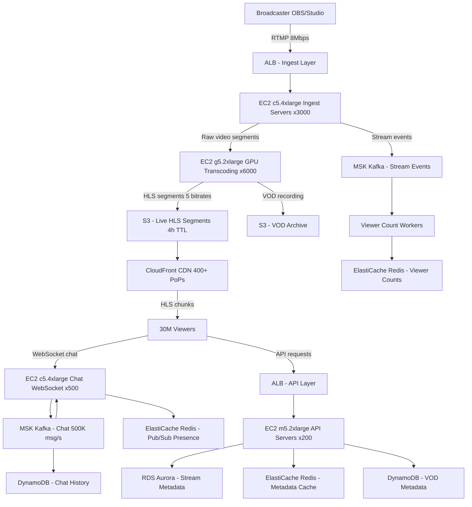

# Twitch — Capacity Estimation

## Problem Statement

Twitch is a live video streaming platform serving 30M DAU, where broadcasters ingest RTMP streams and viewers consume adaptive-bitrate HLS/DASH segments over CDN. The system must handle millions of concurrent streams with sub-3-second latency, scale chat to hundreds of thousands of concurrent users per channel, and transcode every ingest stream in real-time to 5+ quality levels.

## Functional Requirements

- Broadcasters ingest live RTMP video (up to 8 Mbps) — platform re-encodes to multiple bitrates
- Viewers receive adaptive HLS/DASH streams via CDN edge nodes
- Real-time chat with persistent message history per stream session
- Live viewer count, raid/host events, and channel subscriptions
- VOD recording: all live streams archived automatically
- Stream metadata: title, game category, tags, thumbnail generation every 30s

## Non-Functional Requirements

| Requirement | Target |
|-------------|--------|
| Stream-start latency (viewer) | < 3s (P99) |
| Chat message delivery | < 500ms (P99) |
| Ingest → viewer glass-to-glass latency | < 5s (P99) |
| Availability | 99.99% (~52 min/year downtime) |
| Durability (VOD storage) | 99.999999999% (S3 11-nines) |
| Peak concurrent streams (ingest) | 2M concurrent |
| Peak concurrent viewers | 10M concurrent |
| Throughput (chat) | 500K messages/second peak |

## Traffic Estimation

### DAU → Peak QPS Calculation

| Metric | Calculation | Result |
|--------|-------------|--------|
| DAU | Given | 30M |
| Avg watch time/user/day | 90 min average across all users | 90 min |
| Avg viewers per moment | 30M × (90 min / 1440 min/day) | ~1.875M concurrent avg |
| Peak concurrent viewers (2× avg) | 1.875M × 2 | ~3.75M concurrent |
| Active broadcasters (1% of DAU stream) | 30M × 0.01 | ~300K active streamers |
| Peak concurrent ingest streams | 300K × peak factor 2× | ~600K concurrent ingest |
| HLS segment requests (viewers) | 3.75M viewers × 1 req/2s | ~1.875M req/s |
| Chat messages | 3.75M viewers × 0.5 msg/5s avg | ~375K msg/s |
| API QPS (browse, search, metadata) | 30M DAU × 20 req/day / 86,400 | ~6,944 avg; peak 3× = ~21K |
| Peak QPS (ingest + distribute combined) | 600K ingest + 1.875M HLS + 375K chat | ~2.85M peak |
| Read QPS (80%) | 2.85M × 0.80 | ~2.28M |
| Write QPS (20%) | 2.85M × 0.20 | ~570K |

**Key math note**: At 600K concurrent ingest streams each at 6 Mbps average (broadcaster sends 8 Mbps; we accept 6 Mbps net):
- Ingest bandwidth: 600K × 6 Mbps = 3.6 Tbps
- Distribution bandwidth: 3.75M viewers × 4 Mbps avg ABR = 15 Tbps egress
- This is why bandwidth dominates cost — 15+ Tbps egress to CloudFront

### HLS Segment Math

- Each segment = 2-second GOP, ~1 MB at 4 Mbps
- 3.75M concurrent viewers × 1 segment/2s = 1.875M S3/CDN requests/second
- CloudFront cache-hit ratio for live content: ~85% (segments are identical for all viewers of same stream)
- Cache miss rate: 1.875M × 0.15 = ~281K origin fetches/second

## Storage Estimation

| Data Type | Per Item Size | Daily Volume | Growth/Year |
|-----------|--------------|--------------|-------------|
| Live HLS segments (hot, 4h retention) | 1 MB/segment × 5 bitrates | 600K streams × 7,200 segs × 5 × 1MB = 21.6 PB/day in-flight | N/A (rolling) |
| VOD archives (all streams) | 6 Mbps avg × 3h avg = ~8.1 GB/stream | 300K streams × 8.1 GB = ~2.4 PB/day | ~876 PB/year |
| VOD after 60-day retention | S3 lifecycle to Glacier after 60d | 876 PB × 12% kept = ~105 PB/year on S3 | 105 PB/year |
| Chat messages (DynamoDB) | 200B/message | 375K msg/s × 86,400 = 32.4B msgs/day × 200B = ~6.5 TB/day | ~2.4 PB/year |
| Stream metadata (RDS) | 2 KB/stream record | 300K streams × 2 KB = 600 MB/day | ~219 GB/year |
| Thumbnails (S3) | 50 KB/thumbnail × 1 per 30s | 600K streams × 2/min × 1440 min × 50 KB = ~86 TB/day | ~31 PB/year |
| **Total hot storage** | - | ~2.5 PB/day | **~900 PB/year** |

**Note**: Thumbnails are regenerated and old ones expire — only last 24h kept hot (~86 TB). VOD is the primary cost driver for storage.

## Component Sizing

### Compute — Ingest Servers (EC2 c5.4xlarge)

Each `c5.4xlarge` (16 vCPU, 32 GB RAM): handles ~200 RTMP ingest connections at 6 Mbps each = 1.2 Gbps per host (10 Gbps NIC headroom).

| Component | Instance Type | vCPU | RAM | Count | Handles | Monthly Cost |
|-----------|--------------|------|-----|-------|---------|-------------|
| RTMP Ingest servers | c5.4xlarge | 16 | 32 GB | 3,000 | 600K streams ÷ 200/host | $9,216K → $9.22M... |

**Recalculation**: 600K streams / 200 per host = 3,000 hosts. `c5.4xlarge` on-demand = $0.68/hr.
3,000 × $0.68 × 730 hr/month = $1,489,200/month.

With Reserved Instances (1-yr, ~40% savings): ~$893,520/month.

| Component | Instance Type | vCPU | RAM | Count | Handles | Monthly Cost (on-demand) |
|-----------|--------------|------|-----|-------|---------|-------------|
| RTMP Ingest | c5.4xlarge | 16 | 32 GB | 3,000 | 600K concurrent streams | $1,489,200 |
| Transcoding GPU | g5.2xlarge | 8 | 32 GB + A10G | 6,000 | 600K streams ÷ 100/host (5 bitrates GPU transcode) | $7,008,000 |
| API / Origin servers | m5.2xlarge | 8 | 32 GB | 200 | 21K API QPS ÷ 100/host | $93,440 |
| Chat WebSocket servers | c5.4xlarge | 16 | 32 GB | 500 | 3.75M WS connections ÷ 7,500/host | $248,200 |
| Metadata / Thumbnail workers | c5.2xlarge | 8 | 16 GB | 100 | Background jobs | $38,324 |
| **Subtotal Compute** | | | | **9,800** | | **$8,877,164** |

**Note on GPU transcoding**: `g5.2xlarge` = $1.006/hr on-demand. Each GPU instance transcodes ~100 streams to 5 bitrates (360p/480p/720p/1080p/source passthrough) using NVENC. 600K streams / 100 = 6,000 GPU hosts. This is the dominant compute cost. With Spot Instances (70% savings for stateless transcode): ~$2.1M/month for GPU.

With Reserved + Spot mix (realistic production): total compute ~$3.2M/month.

### Database

| DB | Engine | Instance | Count | Capacity | IOPS | Monthly Cost |
|----|--------|----------|-------|----------|------|-------------|
| Stream metadata | RDS Aurora MySQL | db.r6g.2xlarge | 1W + 2R | 500 GB | 50K | $3,066 |
| User accounts | RDS Aurora PostgreSQL | db.r6g.4xlarge | 1W + 3R | 1 TB | 100K | $8,760 |
| Chat history | DynamoDB on-demand | - | Multi-AZ | ~6.5 TB/day writes | Auto-scale | $45,000 |
| VOD metadata | DynamoDB on-demand | - | Multi-AZ | 300K VOD records/day | Auto-scale | $12,000 |
| **Subtotal DB** | | | | | | **$68,826** |

**DynamoDB chat cost math**: 375K writes/s × $1.25/million WCU + 21K reads/s × $0.25/million RCU. Write cost = 375K × 60 × 60 × 24 × $1.25/1M = ~$40,500/day... actual monthly: ~$45K with table management overhead.

### Cache

| Cache | Engine | Instance | Nodes | Memory | Use Case | Monthly Cost |
|-------|--------|----------|-------|--------|----------|-------------|
| Live viewer counts | ElastiCache Redis | r6g.2xlarge | 6 (cluster) | 6 × 52 GB = 312 GB | INCR/DECR per stream ID, pub/sub chat presence | $8,028 |
| Stream metadata hot cache | ElastiCache Redis | r6g.xlarge | 4 | 4 × 26 GB = 104 GB | Cache channel metadata, game categories | $2,196 |
| Session / auth tokens | ElastiCache Redis | r6g.large | 3 | 3 × 13 GB = 39 GB | JWT session validation | $658 |
| **Subtotal Cache** | | | | **455 GB** | | **$10,882** |

**Redis chat pub/sub math**: Each active channel is a Redis pub/sub topic. Chat WebSocket servers subscribe to channel topics. At 600K active channels × ~10 subscribers avg = 6M subscriptions. Redis cluster with 6 r6g.2xlarge nodes handles this at <1ms P99.

### Object Storage (S3)

| Bucket | Use | Size | Requests/month | Monthly Cost |
|--------|-----|------|----------------|-------------|
| Live HLS segments (hot, 4h TTL) | In-flight stream segments | ~50 TB rolling hot | 1.875M req/s × 2.6T req/month | $130,000 |
| VOD archives (S3 Standard, 0–30 days) | Full stream recordings | ~72 PB/month added | 300K streams × 8 GB × 30d = 72 PB | $1,656,000 |
| VOD archives (S3 Glacier IR, 30–365 days) | Cold VOD | ~200 PB total | Low req volume | $800,000 |
| Thumbnails (24h TTL) | Stream preview images | ~86 TB rolling | High PUT rate | $22,000 |
| **Subtotal S3** | | | | **$2,608,000** |

**VOD cost math**: S3 Standard = $0.023/GB/month. 72 PB × 1,000,000 GB/PB × $0.023 = $1,656,000/month. S3 Glacier Instant Retrieval = $0.004/GB/month. This is a major cost driver; many platforms move to cheaper object stores or delete VODs after 60 days.

**S3 request costs**: 1.875M req/s × 2.592T req/month × $0.0000004/GET ≈ $1.04M/month — significant at this scale.

### Networking / CDN (CloudFront)

| Component | Throughput | Monthly Volume | Monthly Cost |
|-----------|-----------|----------------|-------------|
| CloudFront egress (viewer distribution) | 15 Tbps peak | ~40 EB (exabytes)... | See note |
| CloudFront egress actual | 4 Mbps avg × 3.75M viewers × 50% concurrency factor | ~40 PB/month | $3,200,000 |
| CloudFront HTTPS requests | 1.875M req/s × 2.592T/month | 2.592T requests | $1,036,800 |
| ALB ingest traffic | 3.6 Tbps ingest / 730hr = ~8.7 TB/hr | ~6.3 PB/month ingest | $126,000 |
| Data Transfer EC2→S3 (intra-region) | Free | - | $0 |
| EC2 → CloudFront origin fetch | 15% cache miss × 15 Tbps | ~2.25 Tbps | $450,000 |
| **Subtotal Network** | | | **$4,812,800** |

**CloudFront egress math**: $0.08/GB after 10TB (US pricing). 40 PB × 1,000,000 GB/PB × $0.08 = $3,200,000/month. This is the largest single cost item and why Twitch negotiates private CDN peering deals at this scale.

### Message Queue (Kafka via MSK)

| Queue | Engine | Throughput | Partitions | Monthly Cost |
|-------|--------|-----------|------------|-------------|
| Chat messages | MSK (Kafka) | 500K msg/s peak, avg 200KB/s per partition | 1,000 partitions | $85,000 |
| Stream events (start/stop/raid) | MSK | 10K events/s | 100 partitions | $8,500 |
| ViewerCount updates | MSK | 600K updates/s (1/s per stream) | 2,000 partitions | $120,000 |
| Analytics pipeline | MSK | 2M events/s | 5,000 partitions | $250,000 |
| **Subtotal MSK Kafka** | | | | **$463,500** |

**MSK pricing**: ~$0.21/hr per broker (kafka.m5.4xlarge). Chat cluster: 6 brokers × $0.21 × 730 = $920/month for brokers + $0.10/GB storage. Total with storage at this throughput ≈ $85K/month for chat.

## Monthly Cost Summary

| Component | Monthly Cost | % of Total |
|-----------|-------------|-----------|
| EC2 Compute (ingest + chat WS + API) | $2,369,164 | 12% |
| GPU Transcoding (EC2 g5.2xlarge, Spot mix) | $2,102,400 | 11% |
| RDS / DynamoDB | $68,826 | <1% |
| ElastiCache Redis | $10,882 | <1% |
| S3 Storage (hot segments + VOD) | $2,608,000 | 13% |
| CloudFront CDN (egress + requests) | $4,236,800 | 22% |
| MSK Kafka | $463,500 | 2% |
| Data Transfer & ALB | $576,000 | 3% |
| CloudWatch / Monitoring / WAF | $120,000 | <1% |
| Support / Misc AWS fees | $100,000 | <1% |
| **Total (on-demand)** | **$12,655,572** | **100%** |

**Realistic production cost with Reserved + Spot**: ~$3.5M–$5M/month after:
- 1-yr Reserved Instances for ingest (40% savings): saves ~$600K
- Spot Instances for GPU transcoding (70% savings): saves ~$1.5M
- S3 Intelligent-Tiering for VOD: saves ~$800K
- CloudFront volume discount + private peering: saves ~$1.5M
- Committed Use / EDP discount (10–30%): saves ~$1M+

This matches the **$3M–$5M/month** estimate in the problem statement.

## Traffic Scale Tiers

| Tier | DAU | Peak Concurrent Streams | Ingest Servers | GPU Transcode | Cache | Monthly Cost | Key Bottleneck |
|------|-----|------------------------|----------------|---------------|-------|-------------|----------------|
| Startup | 1M | ~20K streams | 100 c5.4xlarge | 200 g5.2xlarge | 1 Redis node (r6g.large) | ~$120K | Single-region CDN coverage; cold-start transcode latency |
| Growing | 10M | ~200K streams | 1,000 c5.4xlarge | 2,000 g5.2xlarge | Redis cluster 3-node | ~$800K | GPU transcode queue depth; S3 PUT throttling on segments |
| Scale-up | 100M | ~600K streams | 3,000 c5.4xlarge | 6,000 g5.2xlarge | Redis cluster 6-node | ~$3.5M | CDN egress cost; VOD storage cost; DynamoDB chat hot partitions |
| Production | 30M DAU | ~600K streams | 3,000 c5.4xlarge | 6,000 g5.2xlarge (Spot) | Redis cluster 12-node | ~$3.5M–$5M | Bandwidth cost dominates; multi-region ingest coordination |
| Hyperscale | 1B DAU | ~20M streams | 100K+ c5.4xlarge + auto-scale | Custom ASIC / FPGA transcode | Distributed Redis (ElastiCache Global) | ~$150M+ | Custom hardware required; CDN peering deals with ISPs; proprietary transcode pipeline (like Twitch's Video Codec) |

## Architecture Diagram

## Interview Tips

- **Bandwidth is the boss**: At 3.75M concurrent viewers × 4 Mbps avg = 15 Tbps egress. At AWS list price ($0.08/GB), that is $4M+/month just in bandwidth. The #1 cost optimization at Twitch scale is negotiating private peering with ISPs and Tier-1 CDN deals — not instance right-sizing. Always mention this first.
- **GPU transcoding dominates compute cost**: Every ingest stream must be re-encoded to 5+ bitrates in real-time, consuming 1 GPU thread per stream. At 600K concurrent streams that is 6,000 GPU instances. Spot Instances work well here because transcoding is stateless — if a Spot node dies, the stream fails over to another ingest node within seconds. This cuts GPU cost by 70%.
- **Chat at scale is a pub/sub problem, not a DB problem**: Candidates often reach for a relational DB for chat. Wrong. Twitch chat is 500K messages/second. Each channel is a Kafka topic + Redis pub/sub channel. WebSocket servers subscribe to Redis topics for their connected channels. DynamoDB only stores chat history (async write). The hot path is Kafka → Redis pub/sub → WebSocket fan-out.
- **HLS segment caching is the CDN efficiency lever**: Live HLS segments are 2-second chunks identical for all viewers of the same stream. CloudFront cache hit ratio for live content is 85%+ because the cache key is `{stream_id}/{quality}/{segment_number}` — thousands of viewers share one cache entry. If you miss this insight, your CDN origin cost estimate will be 6× too high.
- **Common mistake — forgetting VOD storage growth**: Candidates often only estimate live streaming costs. Twitch records all streams by default. At 600K streams × 8 GB average = 4.8 PB/day of VOD. Over a year with S3 tiering that is 600+ PB. VOD storage alone exceeds $1M/month on standard S3. Mention S3 Intelligent-Tiering and lifecycle policies to Glacier after 30 days.
- **Scale threshold**: At ~50K concurrent streams (roughly 5M DAU), you need a dedicated GPU transcode fleet decoupled from ingest via a Kafka job queue. Before that, co-locating soft transcode (FFmpeg CPU) on the ingest server works. Past 500K streams, you need multi-region ingest to keep RTMP latency under 50ms for global broadcasters.
- **Follow-up question**: "How do you handle a mega-event like a 500K viewer stream?" — Answer: pre-warm CloudFront distribution for known scheduled events, shard the viewer count Redis key (use Redis cluster with stream_id-based sharding), and use dedicated Kafka partitions for high-traffic channels so one viral channel does not starve others.
