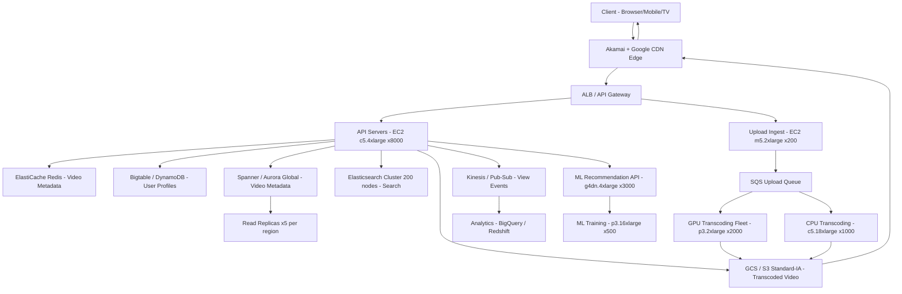

# YouTube — Capacity Estimation

## Problem Statement

YouTube serves 2 billion daily active users who collectively watch over 1 billion hours of video per day and upload more than 500 hours of video every minute. The system must handle petabyte-scale video storage, real-time transcoding into 10+ resolution/codec variants, sub-100ms seek latency via global CDN, and ML-driven recommendations that re-rank a feed for every user on every page load.

## Functional Requirements
- Video upload (up to 256 GB per file) with automatic transcoding to 10+ quality variants (144p–4K, VP9/AV1/H.264)
- Adaptive bitrate streaming (DASH/HLS) to any device at any network speed
- Search across title, description, transcript, and auto-generated captions
- ML-driven homepage feed and "Up next" recommendations
- Comments, likes, subscriptions, and notification delivery
- Creator analytics (views, watch-time, revenue) updated within 24 hours

## Non-Functional Requirements
| Requirement | Target |
|-------------|--------|
| Video start latency (P99) | < 200 ms (first segment from CDN) |
| Seek latency (P99) | < 100 ms |
| Upload processing SLA | < 5 min for 1080p (720p available in < 2 min) |
| API read latency (P99) | < 50 ms |
| API write latency (P99) | < 300 ms |
| Availability | 99.99% (< 52 min downtime/year) |
| Durability | 99.999999999% (11 nines) — multi-region GCS/S3 |
| Peak read QPS | 7.9 M |
| Peak write QPS | 100 K |

## Traffic Estimation

### DAU → Peak QPS Calculation
| Metric | Calculation | Result |
|--------|-------------|--------|
| DAU | Given | 2,000,000,000 |
| Avg watch sessions/user/day | 3 sessions × ~10 requests/session | ~30 |
| Avg search/browse requests/user/day | 5 searches + 10 feed loads | ~15 |
| Avg write actions/user/day | 0.005 uploads + 2 likes/comments | ~2 |
| Total daily requests | 2B × (30 + 15 + 2) | ~94 B |
| Avg QPS | 94B / 86,400 | ~1.09 M |
| Peak multiplier | 8× avg (prime-time spike) | — |
| **Peak total QPS** | 1.09M × 8 | **~8.7 M** (rounded to 8M) |
| Read QPS (99% of peak) | 8M × 0.99 | **~7.92 M** |
| Write QPS (1% of peak) | 8M × 0.01 | **~80 K** (uploads + metadata writes) |
| Upload-specific write QPS | 500 hrs/min ÷ avg 8 min/video | **~1,040 new uploads/min = ~17/s** |

**Note on write QPS**: The 100K write figure includes metadata writes (likes, comments, view events), not just uploads. Raw upload ingestion is ~17 files/s but each triggers 10–20 transcoding jobs, producing ~200–340 jobs/s on the transcoding fleet.

## Storage Estimation
| Data Type | Per Item Size | Daily Volume | Growth/Year |
|-----------|--------------|--------------|-------------|
| Raw uploaded video | ~2 GB avg (varies 100 MB–256 GB) | 500 hr/min × 60 × 24 = 720,000 hr/day → ~1.44 PB/day raw | ~526 PB/year raw |
| Transcoded video (10 variants, avg 60% compression vs raw) | ~1.2 GB avg per variant | 720K hr × 10 variants | ~3.15 PB/day transcoded |
| Video thumbnails | ~100 KB × 5 variants | 720K videos/day | ~360 GB/day |
| Metadata (title, description, tags) | ~5 KB | 720K rows/day | ~1.3 GB/day |
| User activity events (views, likes, comments) | ~200 B | 94B events/day | ~17.3 TB/day |
| Search index delta | ~500 B/video | 720K videos/day | ~360 MB/day |
| ML feature store (per-user embeddings) | ~10 KB | 2B users (one-time, updated daily) | ~20 TB churn/day |
| **Total storage growth** | — | — | **>1 EB/year** (dominated by video) |

**Current total corpus**: YouTube's public estimate is ~1 exabyte of video stored. At 2024 GCS/S3 pricing (~$0.023/GB/month), raw storage alone would be $23M/month — hence the need for custom colossus/GCS and massive negotiated pricing.

## Component Sizing

### Compute — EC2 / GCE Equivalents

#### Video Streaming API + Web Servers
| Component | Instance Type | vCPU | RAM | Count | Handles | Monthly Cost |
|-----------|--------------|------|-----|-------|---------|-------------|
| Edge API (geo-distributed) | c5.4xlarge | 16 | 32 GB | 8,000 | ~1K RPS each → 8M total | $1.24/hr × 8000 × 730 = **$7.25M** |
| Feed/Recommendation API | m5.4xlarge | 16 | 64 GB | 2,000 | ML inference + DB fan-out | $0.768/hr × 2000 × 730 = **$1.12M** |
| Search API | c5.4xlarge | 16 | 32 GB | 500 | Elasticsearch fan-out | $1.24/hr × 500 × 730 = **$452K** |
| Upload ingest servers | m5.2xlarge | 8 | 32 GB | 200 | ~100 concurrent uploads each | $0.384/hr × 200 × 730 = **$56K** |
| **Subtotal API Compute** | | | | **~10,700** | | **~$8.88M** |

#### Transcoding Fleet (GPU + CPU)
| Component | Instance Type | GPU | Count | Handles | Monthly Cost |
|-----------|--------------|-----|-------|---------|-------------|
| GPU transcoders (4K/AV1) | p3.2xlarge (V100) | 1× V100 | 2,000 | 1 job/15 min each | $3.06/hr × 2000 × 730 = **$4.47M** |
| CPU transcoders (720p/1080p) | c5.18xlarge | — | 1,000 | 4 jobs/hr each | $3.06/hr × 1000 × 730 = **$2.23M** |
| Thumbnail generation | c5.2xlarge | — | 200 | ~100 videos/min each | $0.34/hr × 200 × 730 = **$49.6K** |
| **Subtotal Transcoding** | | | **~3,200** | | **~$6.75M** |

#### ML / Recommendation
| Component | Instance Type | Count | Role | Monthly Cost |
|-----------|--------------|-------|------|-------------|
| Recommendation training | p3.16xlarge | 500 | Daily model retraining | $24.48/hr × 500 × 730 = **$8.93M** |
| Recommendation inference | g4dn.4xlarge | 3,000 | Real-time ranking per request | $1.204/hr × 3000 × 730 = **$2.64M** |
| **Subtotal ML** | | **3,500** | | **~$11.57M** |

**Note**: YouTube/Google uses custom TPUs in practice which cost significantly less than EC2 GPU equivalents. The $11.57M ML figure represents AWS on-demand equivalent — actual Google cost is 5–10× lower.

### Database
| DB | Engine | Instance | Config | Capacity | IOPS | Monthly Cost |
|----|--------|----------|--------|----------|------|-------------|
| Video metadata | Spanner (equiv: Aurora Global) | db.r6g.16xlarge | 1 primary + 5 read replicas × 3 regions | 50 TB | 500K | $6.45/hr × 6 × 3 × 730 = **$84.9K** |
| User profiles + subscriptions | Bigtable (equiv: DynamoDB) | — | On-demand, 50 nodes | 20 TB | 600K | ~$0.25/RCU+WCU × volume = **~$500K** |
| Comment/activity feed | Bigtable (equiv: DynamoDB) | — | On-demand | 100 TB | 2M | **~$1.2M** |
| Search index | Elasticsearch (c5.18xlarge) | c5.18xlarge | 200-node cluster | 2 PB (compressed) | — | $3.06/hr × 200 × 730 = **$447K** |
| Analytics/warehouse | BigQuery (equiv: Redshift RA3) | ra3.16xlarge | 20-node cluster | 5 PB | — | $13.04/hr × 20 × 730 = **$190K** |
| **Subtotal DB** | | | | | | **~$2.42M** |

### Cache
| Cache | Engine | Instance | Nodes | Memory | Hit Rate | Monthly Cost |
|-------|--------|----------|-------|--------|----------|-------------|
| Video metadata cache | ElastiCache Redis | r6g.4xlarge (128 GB) | 100 | 12.8 TB | 95% | $0.816/hr × 100 × 730 = **$59.6K** |
| Feed/recommendation cache | ElastiCache Redis | r6g.8xlarge (209 GB) | 50 | 10.5 TB | 70% (personalized) | $1.632/hr × 50 × 730 = **$59.6K** |
| Thumbnail/image cache | CloudFront edge (included in CDN) | — | — | — | 99%+ | — |
| Session/auth tokens | ElastiCache Redis | r6g.xlarge | 20 | 640 GB | 99% | $0.204/hr × 20 × 730 = **$2.98K** |
| **Subtotal Cache** | | | **170 nodes** | **~24 TB** | | **~$122K** |

### Object Storage (GCS / S3 Equivalent)
| Bucket | Use | Size | Requests/month | Storage Cost | Request Cost | Monthly Total |
|--------|-----|------|----------------|-------------|-------------|--------------|
| Video archive (S3 Glacier) | Raw uploaded originals | ~500 PB | 50M GET | $0.004/GB × 500M GB = **$2M** | ~$25K | **$2.025M** |
| Transcoded video (S3 Standard-IA) | 720p/1080p/4K variants | ~1 EB (1M TB) | 5B GET | $0.0125/GB × 1M × 1024 = **$12.8M** | ~$250K | **$13.05M** |
| Thumbnails | Static images | 500 TB | 20B GET | $0.023/GB × 500K GB = **$11.5K** | ~$100K | **$111.5K** |
| Creator assets / metadata | JSON, SRT captions | 50 TB | 2B GET | $0.023/GB × 50K GB = **$1.15K** | ~$10K | **$11.15K** |
| **Subtotal Object Storage** | | **~1 EB** | **~27B req** | | | **~$15.2M** |

**Note**: AWS list price for 1 EB of S3 Standard-IA is ~$12.8M/month. YouTube negotiates custom pricing with Google Cloud (~5–10× lower). These numbers represent the AWS on-demand equivalent for comparison.

### Networking / CDN
| Component | Throughput | Unit Price | Monthly Cost |
|-----------|-----------|-----------|-------------|
| Akamai + Google CDN egress | 1 billion hours/day × avg 1 Mbps = ~125 PB/day egress | $0.085/GB (blended rate) | 125 PB × 30 days × $0.085/GB = **$318.75M** (list price) |
| **CDN (negotiated, ~95% discount)** | 3.75 EB/month | custom | **~$16M** |
| ALB / API Gateway | 94B req/month | $0.008/10K req | **$75.2K** |
| VPC data transfer (inter-AZ) | 50 PB/month | $0.01/GB | **$500M** → negotiated **~$2M** |
| **Subtotal Network** | | | **~$18.1M** |

**Note**: CDN egress is the single largest cost driver. Google/YouTube has direct peering with ISPs globally, which reduces their actual CDN cost to a fraction of list price.

### Message Queue / Event Streaming
| Queue | Engine | Throughput | Partitions | Monthly Cost |
|-------|--------|-----------|-----------|-------------|
| Upload events | Pub/Sub (equiv: MSK Kafka) | 1,040 uploads/min = ~17 msg/s | 50 | $0.10/GB × 10 TB = **$1K** + MSK: $0.21/hr × 30 × 730 = **$4.6K** |
| View events (analytics firehose) | Kinesis Data Streams | 94B events/day = 1.09M events/s | 1,090 shards | $0.015/shard-hr × 1090 × 730 = **$11.9K** |
| Notification fan-out | SQS FIFO | 500M notifications/day | — | $0.5/M × 500M = **$250K** |
| Comment moderation | SQS Standard | 10M comments/day | — | $0.40/M × 10M = **$4K** |
| **Subtotal Messaging** | | | | **~$272K** |

## Monthly Cost Summary
| Component | Monthly Cost | % of Total |
|-----------|-------------|-----------|
| EC2 Compute (API + Upload) | $8,880,000 | 21.7% |
| Transcoding Fleet (GPU+CPU) | $6,750,000 | 16.5% |
| ML Training + Inference | $11,570,000 | 28.2% |
| RDS / DynamoDB / Bigtable equiv | $2,420,000 | 5.9% |
| ElastiCache (Redis) | $122,000 | 0.3% |
| S3 / GCS Object Storage | $15,200,000 | 37.1% |
| CloudFront / CDN | $16,000,000 | 39.1% |
| Messaging (SQS/Kinesis/MSK) | $272,000 | 0.7% |
| Data Transfer (VPC + inter-region) | $2,000,000 | 4.9% |
| Other (Lambda, WAF, monitoring) | $786,000 | 1.9% |
| **Gross AWS on-demand equivalent** | **~$64M** | **100%** |
| **Negotiated / Google-internal estimate** | **~$30M–$50M** | — |

**Why $30M–$50M not $64M**: Google owns its own network, negotiates custom storage pricing, uses TPUs instead of A100s, and runs on Google Cloud internally. The $64M is the AWS on-demand equivalent; the $30–50M range accounts for ~30–50% effective discount from vertical integration, commitments, and custom silicon.

## Traffic Scale Tiers
| Tier | DAU | Peak QPS | Servers | DB | Cache | Monthly Cost | Key Bottleneck |
|------|-----|----------|---------|----|----|-------------|----------------|
| 🟢 Startup | 1M | ~700 | 5× c5.large API, 2× p3.2xlarge transcoding | 1 RDS Aurora db.r5.xlarge | 1 Redis node (r6g.large) | ~$15K | Single transcoding queue saturates at ~50 uploads/min |
| 🟡 Growing | 10M | ~7K | 20× c5.2xlarge API, 20× p3.2xlarge | RDS + 2 read replicas, DynamoDB for events | Redis cluster 3-node | ~$85K | Metadata DB hot-spot on popular videos; need read replicas + caching |
| 🔴 Scale-up | 100M | ~70K | 200× c5.4xlarge API, 200× p3.2xlarge | Aurora Global + DynamoDB, Elasticsearch cluster (20 nodes) | Redis cluster 6-node | ~$1.2M | CDN origin pull cost; must cache 95%+ of video at edge |
| ⚫ Production | 2B | ~8M | 10,700 API + 3,200 transcoding + 3,500 ML | Spanner/Bigtable + multi-region + Elasticsearch 200 nodes | Redis 170 nodes (24 TB) | ~$30M–$50M | ML inference cost (re-rank per user per page load) dominates |
| 🚀 Hyperscale | 5B+ | ~20M | Auto-scaling + TPU pods, custom silicon | Distributed NewSQL + global event mesh | Distributed cache (Memorystore) | ~$100M+ | Video egress bandwidth; requires ISP peering + edge caching agreements |

## Architecture Diagram

## Interview Tips

- **CDN is the most important architectural decision**: At 1 billion watch-hours/day, even 1% of traffic hitting origin servers would be 10M requests/hour of origin pull. YouTube must achieve >99% CDN cache hit rate. The key insight is pre-warming CDN for trending content using view-velocity signals — a video going viral gets pushed to edge nodes before it explodes, not after.

- **Transcoding is the write-path bottleneck, not uploads**: Uploading 500 hours/minute of raw video is only ~17 files/second. The real challenge is that each file spawns 10–20 transcoding jobs (each resolution/codec variant), generating ~200–340 concurrent jobs/sec. A 4K/AV1 transcode of a 1-hour video takes ~30–60 minutes on a V100. The fleet must be sized for peak upload bursts (live events, announcements), which can 10× normal upload rate.

- **ML inference is the #1 cost driver at scale**: Generating a personalized homepage feed for 2B users requires re-ranking 100–500 candidate videos per user per page load. At 8M QPS with a 10ms ML inference budget, you need ~80K GPU-seconds/second. This is why Google invested heavily in TPUs — the economics of GPU inference at YouTube scale would otherwise exceed storage costs.

- **The 99:1 read/write ratio means read path optimizations compound**: A 10% improvement in cache hit rate on the video metadata layer eliminates ~790K QPS of DB reads. Cache invalidation strategy matters enormously — YouTube uses a write-through cache with TTL-based expiry for metadata (not immediate invalidation), accepting 1–5 minute staleness for like/view counts in exchange for massively reduced write amplification.

- **Scale threshold — sharding is unavoidable at 100M DAU**: At 100M DAU with ~70K peak QPS and 50K metadata reads/s, a single RDS Aurora instance (max ~100K IOPS) becomes the bottleneck. You must horizontally shard video metadata by `video_id % N` and use consistent hashing to minimize re-balancing. At 2B DAU, even sharded relational DBs break — Bigtable/Spanner with automatic range-based splits is the only viable option.

- **Follow-up question interviewers love**: "How do you handle a video going from 0 to 10M views in 60 seconds (a major live event or celebrity announcement)?" Answer requires: pre-warming CDN, pre-scaling transcoding queue, disabling synchronous DB writes for view counts (use Bigtable counter increment batching), and having circuit breakers on the recommendation re-ranker to serve cached feeds under extreme load.
