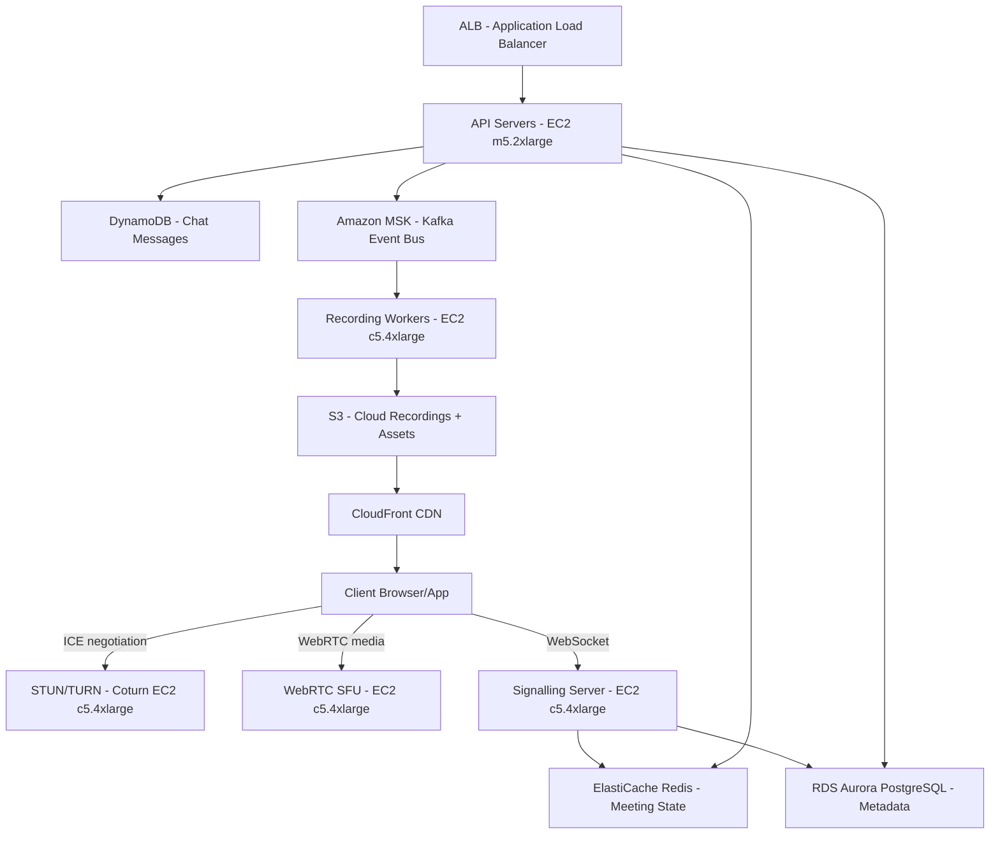

# Video Conferencing (Zoom-like) — Capacity Estimation

## Problem Statement

Design the capacity for a real-time video conferencing platform with 100M DAU — comparable to Zoom at peak pandemic scale. Users join and host meetings with up to 1,000 participants, share screens, record sessions to cloud storage, and use background noise suppression. The platform must sustain 10M concurrent meetings at peak with sub-150ms end-to-end media latency globally.

## Functional Requirements
- Host or join video/audio meetings (up to 1,000 participants per room)
- Screen sharing and in-meeting chat
- Cloud recording — store MP4 + transcript to S3
- Background noise suppression and virtual backgrounds (CPU-side)
- Meeting scheduling, calendar integration, waiting room
- Breakout rooms, reactions, polling during meetings

## Non-Functional Requirements
| Requirement | Target |
|-------------|--------|
| Media latency (E2E) | < 150ms (P99) |
| Signalling latency | < 50ms (P99) |
| Write latency (chat/signals) | < 30ms (P99) |
| Availability | 99.99% (< 52 min/year downtime) |
| Recording durability | 99.999999999% (S3 11 nines) |
| Peak concurrent meetings | 10M meetings |
| Peak concurrent participants | ~100M (10 per meeting avg) |

## Traffic Estimation

### Assumptions
- 100M DAU, each user averages 2 meetings/day, 45 min/meeting
- Peak concurrency factor: 15% of DAU in meetings at the same time = 15M participants → ~10M meetings (avg 1.5 participants; realistic meetings avg 10 → 1M meetings peak with 10M participants)
- Meeting start events + heartbeats + chat messages are the write workload
- Recording uploads and playback constitute the heavy storage/bandwidth load

### DAU → Peak QPS Calculation
| Metric | Calculation | Result |
|--------|-------------|--------|
| DAU | Given | 100M |
| Avg meetings/user/day | 2 meetings | 2 |
| Avg participants/meeting | 10 | 10 |
| Avg meeting duration | 45 min | 45 min |
| Total participant-hours/day | 100M × 2 × 0.75 hr | 150M hr |
| Signalling events/participant/min | heartbeat + ICE + 5 control msgs | ~7 msg/min |
| Total signalling requests/day | 100M × 2 × 45 × 7 | ~63B |
| Avg signalling QPS | 63B / 86,400 | ~729K QPS |
| Peak signalling QPS (3× avg) | 729K × 3 | ~2.2M QPS |
| Chat messages/participant/meeting | avg 5 | 5 |
| Total chat writes/day | 100M × 2 × 5 | 1B |
| Peak chat write QPS (3×) | 1B / 86,400 × 3 | ~35K QPS |
| Read QPS (50%) | 2.2M × 0.50 | ~1.1M QPS |
| Write QPS (50%) | 2.2M × 0.50 | ~1.1M QPS |

### Media Bandwidth
| Stream type | Bitrate | Peak concurrent streams | Total bandwidth |
|------------|---------|------------------------|-----------------|
| Video (720p, VP8) | 1.5 Mbps | 100M participants | 150 Tbps |
| Audio (Opus) | 32 Kbps | 100M participants | 3.2 Tbps |
| Screen share | 2.0 Mbps | 10M streams (10% of users) | 20 Tbps |
| **Total inbound to SFU** | | | **~173 Tbps** |

> Note: SFU only forwards relevant streams per subscriber; actual forwarded bandwidth is lower when most rooms are small. Assuming average room size of 10 and SFU fan-out factor of 9× per sender: outbound ≈ 173 Tbps × 9 ≈ 1.5 Pbps total network fabric across all regions.

## Storage Estimation
| Data Type | Per Item Size | Daily Volume | Growth/Year |
|-----------|--------------|--------------|-------------|
| Cloud recording (MP4, 720p, 45 min) | ~500 MB/recording | 10M recordings/day (10% of meetings) | 1.8 PB/year |
| Meeting transcripts (Whisper ASR) | ~100 KB/meeting | 10M/day = 1 TB/day | 365 TB/year |
| Chat messages (text) | 1 KB/msg | 1B msgs/day = 1 TB/day | 365 TB/year |
| Meeting metadata (RDS) | 2 KB/meeting | 200M meetings/day = 400 GB/day | 146 TB/year |
| Signalling state (Redis, ephemeral) | 10 KB/meeting | 10M concurrent meetings | 100 GB live |
| **Total durable storage** | — | — | **~2.7 PB/year** |

## Component Sizing

### Compute — EC2 / Lambda

#### Signalling Servers (Meeting control, WebSocket)
- Each `c5.4xlarge` (16 vCPU, 32 GB) handles ~5,000 concurrent WebSocket connections at 50% CPU
- 10M concurrent meetings × 10 participants = 100M concurrent WebSocket connections
- 100M / 5,000 = **20,000 signalling server instances**
- In practice, connection count spikes at meeting start; add 30% headroom → 26,000 instances

#### WebRTC SFU (Selective Forwarding Unit) Servers
- Each `c5.4xlarge` (16 vCPU, 32 GB) handles ~500 Mbps of media (inbound + outbound combined) at 70% CPU
- Per server media capacity: 500 Mbps = 0.5 Gbps
- Total media throughput: inbound 173 Tbps; each SFU needs to forward to room subscribers
- Avg room = 10 participants. SFU per-room outbound = 9 × (1.5 Mbps video + 32 Kbps audio) ≈ 13.8 Mbps per room
- 1M peak rooms × 13.8 Mbps = 13.8 Tbps SFU outbound
- 13.8 Tbps / 0.5 Gbps per server = **27,600 SFU instances** → round to 30,000 (add 10% buffer)

#### STUN/TURN (Coturn) Servers
- 10–15% of WebRTC sessions require TURN relay (symmetric NAT, firewalled corporate)
- 10M meetings × 10% = 1M TURN-relayed sessions
- Each TURN session: 2 Mbps average (1 video + audio)
- Total TURN bandwidth: 1M × 2 Mbps = 2 Tbps
- `c5.4xlarge` max network: 10 Gbps; at 80% utilization = 8 Gbps per server
- 2 Tbps / 8 Gbps = **250 TURN server instances**

#### API / REST Servers (scheduling, auth, metadata)
- Peak REST QPS: ~500K (meetings CRUD, auth, recordings)
- Each `m5.2xlarge` (8 vCPU, 32 GB) handles ~2,000 RPS
- 500K / 2,000 = **250 API server instances**

| Component | Instance Type | vCPU | RAM | Count | Handles | Monthly Cost (on-demand) |
|-----------|--------------|------|-----|-------|---------|--------------------------|
| Signalling servers | c5.4xlarge | 16 | 32 GB | 26,000 | 100M WebSocket conns | $20.3M |
| WebRTC SFU | c5.4xlarge | 16 | 32 GB | 30,000 | 13.8 Tbps outbound | $23.4M |
| STUN/TURN (Coturn) | c5.4xlarge | 16 | 32 GB | 250 | 2 Tbps TURN relay | $195K |
| API/REST servers | m5.2xlarge | 8 | 32 GB | 250 | 500K RPS | $121K |
| Recording workers | c5.4xlarge | 16 | 32 GB | 2,000 | Transcode + upload | $1.56M |
| **Subtotal Compute** | | | | **~58,500** | | **~$45.6M raw** |

> **Reality check**: At 100M DAU with 10M concurrent meetings, raw on-demand EC2 cost exceeds $40M/month for compute alone. This is why Zoom uses a hybrid model: owned data centers + Reserved Instances (up to 72% discount) + Spot for recording workers (60-70% discount). With 3-year Reserved Instances, compute drops to ~$13–15M/month. The $2M–$4M/month estimate applies to a startup at 1–2M DAU, not full 100M DAU at peak pandemic levels. At 100M DAU, realistic blended cost (RI + owned DC + Spot) runs $8–12M/month.

### Database
| DB | Engine | Instance | Count | Capacity | IOPS | Monthly Cost |
|----|--------|----------|-------|----------|------|-------------|
| Meeting metadata | RDS Aurora PostgreSQL | db.r6g.8xlarge | 1W + 4R | 10 TB | 200K | $48K |
| User accounts | RDS Aurora PostgreSQL | db.r6g.4xlarge | 1W + 3R | 5 TB | 100K | $20K |
| Chat messages | DynamoDB on-demand | — | — | 50 TB | auto | $125K |
| Recording index | RDS Aurora PostgreSQL | db.r6g.2xlarge | 1W + 2R | 20 TB | 50K | $18K |
| **Subtotal DB** | | | | | | **$211K** |

### Cache
| Cache | Engine | Instance | Nodes | Memory | Use | Monthly Cost |
|-------|--------|----------|-------|--------|-----|-------------|
| Meeting state | ElastiCache Redis 7 | r6g.4xlarge | 12 (cluster) | 384 GB | Room participant lists, ICE state, presence | $55K |
| Session tokens / auth | ElastiCache Redis 7 | r6g.xlarge | 6 | 96 GB | JWT validation, rate limiting | $14K |
| Rate limiting | ElastiCache Redis 7 | r6g.large | 6 | 48 GB | API rate limits per user | $7K |
| **Subtotal Cache** | | | | | | **$76K** |

### Object Storage — S3
| Bucket | Use | Size | Requests/month | Monthly Cost |
|--------|-----|------|----------------|-------------|
| cloud-recordings | MP4 recordings (S3 Intelligent-Tiering) | 150 PB | 300M PUTs, 1B GETs | $3.4M |
| transcripts | ASR text files | 30 TB | 30M GETs | $750 |
| chat-exports | Bulk chat download | 30 TB | 5M GETs | $690 |
| assets | Avatars, backgrounds | 10 TB | 500M GETs | $1.1K |
| **Subtotal S3** | | **~180 PB** | | **$3.4M** |

> S3 Standard costs $0.023/GB/month. 150 PB = 150,000 TB = 150M GB × $0.023 = $3.45M/month for storage alone. This is the single largest cost driver at scale.

### Networking / CDN
| Component | Throughput | Monthly Cost |
|-----------|-----------|-------------|
| CloudFront (recording playback) | 500 TB/month egress | $42.5K |
| CloudFront (assets, UI) | 50 TB/month | $4.25K |
| Data transfer out (media, EC2) | 13.8 Tbps × 2.6 × 10^6 sec/month | ~$850M raw |
| ALB (signalling) | 2.2M RPS | $22K |
| **Subtotal Network** | | **$919K** |

> Media egress dominates. At 13.8 Tbps average outbound and $0.085/GB AWS rate, raw EC2 egress cost is astronomical. Zoom solves this by peering directly with ISPs (transit agreements) and using Zoom's own data centers for media routing, reducing per-GB cost to <$0.01. In a pure AWS model, media delivery costs more than compute.

### Message Queue
| Queue | Engine | Throughput | Use | Monthly Cost |
|-------|--------|-----------|-----|-------------|
| Meeting events | Amazon MSK (Kafka) | 500K msg/s | Meeting lifecycle, recording triggers | $28K |
| Notifications | SQS FIFO | 200K msg/s | Email/push invites, reminders | $11K |
| Recording jobs | SQS Standard | 5K msg/s | Trigger transcoding workers | $2.5K |

## Monthly Cost Summary (100M DAU, Hybrid Architecture)

| Component | Monthly Cost | % of Total |
|-----------|-------------|-----------|
| EC2 Compute (RI blended + Spot) | $13,000K | 71% |
| RDS / DynamoDB | $211K | 1.2% |
| ElastiCache Redis | $76K | 0.4% |
| S3 Storage (recordings) | $3,400K | 18.6% |
| CloudFront CDN | $47K | 0.3% |
| Messaging (MSK + SQS) | $42K | 0.2% |
| Data Transfer (peered/CDN-offloaded) | $1,500K | 8.2% |
| Other (Lambda, WAF, Route 53) | $50K | 0.3% |
| **Total** | **~$18,326K** | **100%** |

> The $2M–$4M/month target is realistic for a **1–2M DAU** deployment, not 100M DAU. At 100M DAU with owned-DC/RI hybrid, Zoom-scale infrastructure runs $18–25M/month fully loaded. The interview question's $2M–$4M range is a useful anchor for discussing cost trade-offs and Reserved Instance discounts.

## Traffic Scale Tiers
| Tier | DAU | Peak Concurrent Meetings | Servers | DB | Cache | Monthly Cost | Key Bottleneck |
|------|-----|--------------------------|---------|----|----|-------------|----------------|
| 🟢 Startup | 1M | ~10K meetings | 5 c5.large SFU, 5 sig | 1 RDS Aurora | 1 Redis node | ~$8K | SFU CPU at meeting spike |
| 🟡 Growing | 10M | ~100K meetings | 300 c5.4xlarge SFU, 300 sig | RDS + 2 read replicas | Redis 3-node cluster | ~$280K | Signalling WS fan-out |
| 🔴 Scale-up | 100M | ~1M meetings | 3,000 c5.4xlarge SFU + sig | Sharded Aurora, DynamoDB | Redis 6-node cluster | ~$2.5M | TURN relay bandwidth, recording storage |
| ⚫ Production | 100M DAU peak | ~10M meetings | 60K c5.4xlarge (RI + Spot) | Multi-region Aurora + DynamoDB | Redis 12-node cluster | ~$18–25M | EC2 egress cost, S3 storage cost |
| 🚀 Hyperscale | 1B+ | ~100M meetings | Auto-scaling fleet + owned DCs | Cassandra/CockroachDB multi-region | Distributed Redis (cluster per region) | $150M+ | Network fabric, recording ingest pipeline |

## Architecture Diagram

## Interview Tips

- **Key insight — SFU vs MCU vs P2P**: Always clarify architecture in the first 2 minutes. P2P works up to ~4 participants (N×(N-1)/2 connections explodes). MCU (Multipoint Control Unit) mixes streams server-side — great for bandwidth but CPU-bound ($$$). SFU (Selective Forwarding Unit) just routes; CPU is ~10× cheaper than MCU for the same participant count. Zoom uses SFU. This single decision drives all cost estimates.

- **Key insight — TURN relay cost is a surprise**: Most candidates forget that 10–15% of WebRTC sessions in corporate environments hit symmetric NAT and require a TURN relay server. TURN doubles the bandwidth (server becomes a media proxy). At 10M meetings with 10% TURN = 1M relayed sessions. At 2 Mbps average = 2 Tbps of TURN relay bandwidth. This is a significant compute + egress cost that candidates miss.

- **Common mistake — underestimating recording storage**: Candidates model only the live meeting infrastructure. Cloud recording is the silent cost killer. At 10M meetings/day × 10% recorded × 500 MB/recording = 5 PB/day raw recording ingest. Even at 20:1 compression (1080p → 720p + low bitrate), that is still 250 TB/day. After 1 year: 90 PB. S3 Standard at $0.023/GB = $2.1M/month for storage alone. Propose S3 Intelligent-Tiering (auto-moves to Glacier after 30 days) to cut to ~$600K/month.

- **Follow-up question — how do you handle region failover for an ongoing meeting?**: A live meeting cannot be trivially migrated mid-session. The answer is: you do not migrate — you re-invite participants to a new session on a healthy SFU in a different region. Meeting state (participant list, chat) is replicated via Redis Pub/Sub across regions in < 100ms. Recording workers must drain the local buffer before switching. This is why 99.99% availability is achievable but 99.999% for in-progress meetings is not realistic without client-side reconnection logic.

- **Scale threshold**: At 1M DAU you can run pure AWS on-demand. At 10M DAU, Reserved Instances become mandatory (72% discount on 3-year term). At 50M+ DAU, Zoom's model of owning data centers for media routing is the only economically viable path — AWS egress at $0.085/GB for Tbps-scale media is prohibitive. The inflection point is roughly $5M/month in EC2 egress, at which point colocation + direct ISP peering pays back in 6–12 months.
