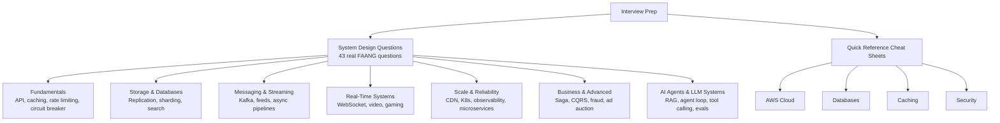

# Interview Prep

Structured preparation for system design interviews at top tech companies. This section contains 33+ real interview questions with detailed answers and quick-reference sheets.

## Sections

### System Design Questions

40+ real questions from FAANG interviews, each with:
- Problem statement and clarifying questions
- High-level architecture
- Deep-dive into key components
- Trade-offs and alternatives

Includes an **[AI Agents & LLM Systems](/12-interview-prep/system-design/ai-and-agents)** section covering agent loop design, RAG architecture, tool calling, multi-agent coordination, observability, and prompt injection defense.

[Browse all questions](/12-interview-prep/system-design)

### Quick Reference

Concise reference sheets organized by topic:

- [AWS & Cloud](/12-interview-prep/quick-reference/aws-cloud) — Key AWS services and limits
- [Security & Encryption](/12-interview-prep/quick-reference/security) — JWT, OAuth, hashing, TLS
- [Databases](/12-interview-prep/quick-reference/databases) — SQL vs NoSQL, indexes, replication
- [Caching & CDN](/12-interview-prep/quick-reference/caching) — Redis, CDN, cache strategies

## Quick Navigation by Topic

| I'm preparing for... | Go to | Pair with theory |
|----------------------|-------|-----------------|
| API design questions | [API Design questions](/12-interview-prep/system-design/fundamentals) | [07-api-design](/07-api-design) |
| Database questions | [DB & Storage questions](/12-interview-prep/system-design/storage-and-databases) | [01-databases](/01-databases) |
| Caching questions | [Caching reference](/12-interview-prep/quick-reference/caching) | [02-caching](/02-caching) |
| Streaming/queue questions | [Messaging questions](/12-interview-prep/system-design/messaging-and-streaming) | [04-messaging](/04-messaging) |
| Security questions | [Security reference](/12-interview-prep/quick-reference/security) | [08-security](/08-security) |
| AWS questions | [AWS reference](/12-interview-prep/quick-reference/aws-cloud) | [06-scalability](/06-scalability) |
| Real-time system questions | [Real-time questions](/12-interview-prep/system-design/real-time-systems) | [10-architecture](/10-architecture) |
| Distributed system questions | [Scale & reliability](/12-interview-prep/system-design/scale-and-reliability) | [05-distributed-systems](/05-distributed-systems) |
| System case studies | [Real-World Systems](/11-real-world) | — |
| AI/LLM agent questions | [AI Agents & LLM Systems](/12-interview-prep/system-design/ai-and-agents) | [13-agent-workflows](/13-agent-workflows) |

## Interview Strategy

1. **Clarify requirements first** — Ask about scale, consistency, availability trade-offs
2. **Start high-level** — Sketch the architecture before diving into details
3. **Use numbers** — Back-of-envelope estimates show structured thinking
4. **Discuss trade-offs** — There's no perfect solution, show you know the trade-offs
5. **Know failure modes** — What happens when components fail?

See [Learning Paths](/00-start-here/learning-paths) for a structured study plan.
