# A/B Testing ML Models

10 questions covering experiment design, statistical significance, interleaving, multi-armed bandits, and holdout groups.

---

## Q1: What is A/B testing for ML models and how does it differ from UI A/B testing?
**Role:** Mid / ML Engineer | **Difficulty:** 🟡 | **Priority:** P0 | **Format:** Quick Answer

> **What the interviewer is testing:** Whether you understand the unique challenges of ML model experiments vs frontend feature experiments.

### Answer in 60 seconds
- **UI A/B testing:** Compare two UI variants (button color, layout). Binary treatment, deterministic behavior, immediate feedback (click or no click).
- **ML A/B testing:** Compare two model versions with different predictions. Non-deterministic output, feedback can be delayed (purchase, return, churn), model behavior changes continuously as it processes different inputs.
- **Key differences:**

| Dimension | UI A/B Test | ML Model A/B Test |
|-----------|-------------|-------------------|
| Treatment | Fixed UI variant | Model outputs vary per input |
| Feedback delay | Seconds (click) | Hours to days (conversion, churn) |
| Interaction effects | Low (UI changes don't affect other users) | High (recommendation affects inventory, pricing) |
| Rollback | Instant (flip a flag) | Complex (model + features may be coupled) |
| Contamination | Low | High (model learns from experiment traffic) |
| Guardrail complexity | Low | High (latency, fairness, diversity metrics) |

- **Additional ML concern:** The model being tested may not be static — if it's an online learning model, experiment traffic itself trains the model, changing its behavior mid-experiment

### Diagram

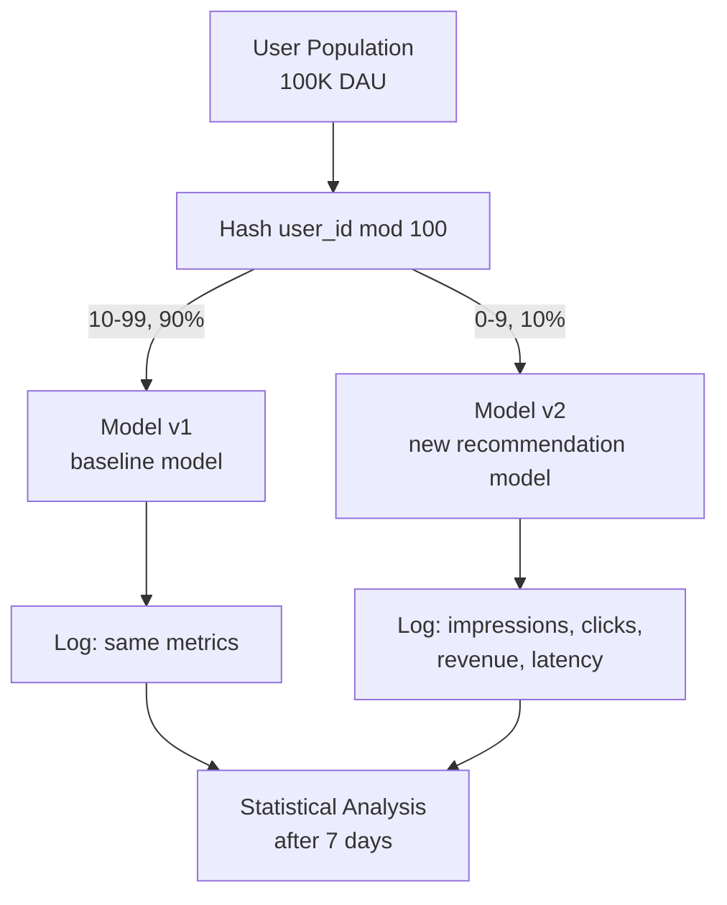

### Pitfalls
- ❌ **Ignoring novelty effect:** When users see a new recommendation system, they click more in the first 3 days simply because it's different — not because it's better. Run experiments for at least 7 days.
- ❌ **Forgetting long-tail metrics:** CTR improves but return rate increases 20% → net revenue is negative. Define success metrics AND downstream impact metrics before starting.

### Concept Reference
→ [Observability](../../../system-design/scale-and-reliability/observability)

---

## Q2: How do you calculate the minimum sample size for statistical significance?
**Role:** Mid | **Difficulty:** 🟡 | **Priority:** P1 | **Format:** Quick Answer

> **What the interviewer is testing:** Ability to properly size an experiment before launching it — a critical skill to prevent under-powered experiments.

### Answer in 60 seconds
- **Goal:** Determine how many users (N) each variant needs to detect a meaningful difference with confidence
- **Key parameters:**
  - α (significance level): Type I error rate — typically 0.05 (5% false positive rate)
  - β (power): 1 - Type II error rate — typically 0.80 (80% chance of detecting a real effect)
  - Baseline metric: current conversion rate (p₁ = 0.05 = 5% CTR)
  - Minimum detectable effect (MDE): smallest improvement worth detecting (Δ = 0.005 = 0.5% lift)
- **Formula:** `N ≈ 2 × (z_α/2 + z_β)² × p(1-p) / Δ²`
  - For α=0.05, β=0.80: `z_α/2 = 1.96`, `z_β = 0.84`
  - Example: p=0.05, Δ=0.005 → N ≈ 2 × (2.80)² × 0.0475 / 0.000025 ≈ **29,900 per variant**
- **Interpretation:** Need ~30K users per variant (60K total) to detect a 10% relative lift in 5% CTR
- **Duration calculation:** At 500K DAU with 10% in experiment = 50K/day per variant → takes **1 day** (but still run 7 days for weekly patterns)

### Diagram

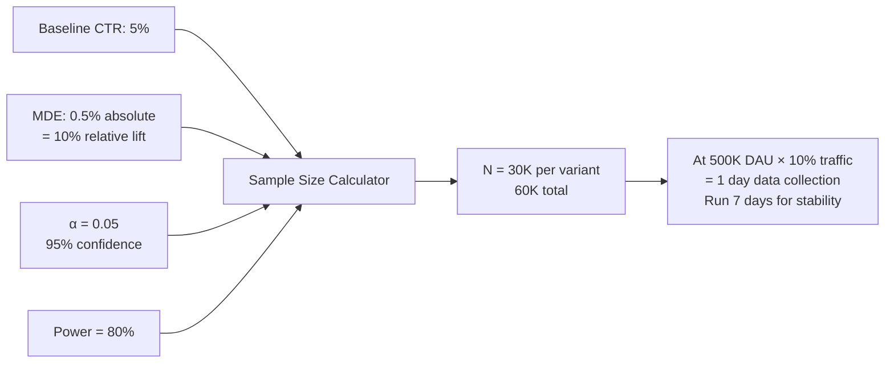

### Pitfalls
- ❌ **MDE too small:** Setting MDE = 0.1% requires 2.5M users per variant — impossible for most products. Set MDE based on business value, not "I want to detect anything."
- ❌ **Calculating sample size after seeing results:** Setting MDE based on the observed difference you see on day 3 inflates Type I error rate from 5% to 30%+

### Concept Reference
→ [Observability](../../../system-design/scale-and-reliability/observability)

---

## Q3: What is the difference between a guardrail metric and a success metric in ML experiments?
**Role:** Senior | **Difficulty:** 🔴 | **Priority:** P1 | **Format:** Deep Dive

> **What the interviewer is testing:** Understanding that experiments need constraints (guardrails) to prevent gaming and to protect core product quality.

### Problem Constraints
| Dimension | Value |
|-----------|-------|
| System | E-commerce recommendation model A/B test |
| Primary success metric | Revenue per session |
| Experiment duration | 14 days |
| Traffic | 20% users in experiment (200K) |

### Success Metrics vs Guardrail Metrics

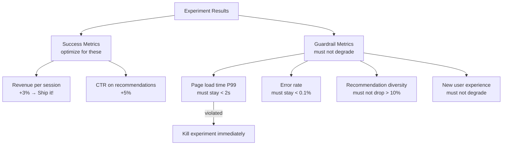

| Metric Type | Examples | Action if violated |
|-------------|----------|--------------------|
| Success | Revenue, CTR, engagement | Determines go/no-go decision |
| Guardrail | Latency, error rate, diversity, fairness | Immediate stop — non-negotiable |

### Why Guardrails Matter

Without guardrails, ML models can "win" on the success metric by harming other dimensions:
- A recommendation model might improve CTR by showing only popular items → diversity collapses
- A pricing model might increase revenue by charging high prices to inelastic users → fairness concern
- A ranking model might improve CTR by showing more sensational content → long-term trust erosion

### What a great answer includes
- [ ] Name at least 3 distinct guardrail categories: technical (latency, errors), product (diversity, freshness), business (revenue cannibalization), fairness
- [ ] State that guardrail violations stop the experiment — not just a warning
- [ ] Explain why guardrails prevent "Goodhart's Law" gaming: when a measure becomes a target, it ceases to be a good measure
- [ ] Mention pre-registering all metrics before the experiment starts — no adding new metrics mid-experiment

### Pitfalls
- ❌ **Only defining guardrails after seeing the data:** "We didn't think to monitor diversity, and now we see it dropped 30%" — all guardrail metrics must be defined before experiment launch
- ❌ **Too many success metrics:** With 20 success metrics, you'll find a significant positive result by chance (p<0.05 means 1 in 20 will look significant at random) — pre-register 1–3 primary metrics

### Concept Reference
→ [Observability](../../../system-design/scale-and-reliability/observability)

---

## Q4: What is a multi-armed bandit and when does it outperform A/B testing?
**Role:** Senior | **Difficulty:** 🔴 | **Priority:** P1 | **Format:** Quick Answer

> **What the interviewer is testing:** Understanding of adaptive experiment design and the explore-exploit trade-off.

### Answer in 60 seconds
- **A/B test (fixed split):** Equal traffic to all variants for the full duration. Maximizes statistical power but wastes traffic on clearly worse variants.
- **Multi-armed bandit (MAB):** Adaptively allocates more traffic to better-performing variants as evidence accumulates. Algorithms: epsilon-greedy, UCB (Upper Confidence Bound), Thompson Sampling.
- **When MAB outperforms A/B:**
  - Short experiments with clear winner emerging quickly
  - High cost of showing bad variant (e.g., ad revenue, conversion rate)
  - Many variants to test (10+ — A/B test dilutes traffic; MAB finds the winner faster)
  - Real-time content personalization (each user interaction is a "pull" of the bandit)
- **When A/B testing outperforms MAB:**
  - Scientific rigor required (causal inference, FDA-style evaluation)
  - Delayed feedback (churn prediction — can't observe outcome in real time)
  - Long-term effects matter (MAB optimizes myopically; A/B captures longer-term patterns)
- **Typical outcome:** MAB reduces regret (revenue lost to worse variant) by 15–30% vs fixed A/B split with the same number of total users

### Diagram

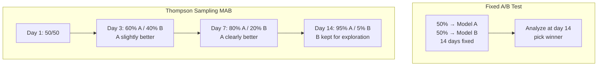

### Pitfalls
- ❌ **MAB for safety-critical decisions:** A bandit algorithm that sends 80% of medical diagnostic traffic to a slightly better model before rigorous validation is dangerous — use A/B test with pre-specified stopping rules instead
- ❌ **MAB in seasonal environments:** If Model A is better in summer but Model B is better in winter, the bandit will exploit A in summer, then have no budget to discover B's winter superiority

### Concept Reference
→ [Observability](../../../system-design/scale-and-reliability/observability)

---

## Q5: How do you implement interleaving for evaluating ranking models without user-visible variants?
**Role:** Senior | **Difficulty:** 🔴 | **Priority:** P2 | **Format:** Deep Dive

> **What the interviewer is testing:** Awareness of the advanced evaluation technique used by Netflix, Spotify, and Google to compare ranking models with 100× fewer users than A/B testing.

### Problem Constraints
| Dimension | Value |
|-----------|-------|
| System | Music recommendation ranking model |
| Baseline model | v1 ranking model |
| Candidate model | v2 ranking model |
| A/B test user requirement | 100K users for 7 days |
| Interleaving user requirement | 1K users for 1 day |

### How Interleaving Works
Instead of showing User A v1's list and User B v2's list, merge both models' lists for every user. Rank positions alternate between models. Whichever model's items get more clicks "wins" for that user.

```mermaid
graph TD
  USER[User Request] --> M1[Model v1 Rankings:<br/>1. Song A, 2. Song C, 3. Song E]
  USER --> M2[Model v2 Rankings:<br/>1. Song B, 2. Song A, 3. Song D]
  M1 --> INTERLEAVE[Interleaved List:<br/>1. Song B (v2), 2. Song A (v1),<br/>3. Song C (v1), 4. Song D (v2), 5. Song E (v1)]
  M2 --> INTERLEAVE
  INTERLEAVE --> USER2[Shown to user]
  USER2 --> CLICK[User clicks Song D<br/>= v2 win for this user]
```

| Dimension | A/B Testing | Interleaving |
|-----------|-------------|--------------|
| Users needed to detect 1% CTR lift | 100K | 1K |
| Sensitivity | 100× lower | 100× higher |
| User sees both models | No | Yes (interleaved) |
| Reveals personalization effects | Indirect | Direct (which items get clicked) |
| Measures | Average CTR | Relative preference per user |
| Risk of user noticing | None | Low (interleaving is invisible) |

### Why Interleaving is 100× More Sensitive
Each user serves as their own control — variance from user-to-user preference is eliminated. In A/B testing, variance from different user populations dominates the signal; interleaving removes this entirely.

### What a great answer includes
- [ ] Explain the user-as-own-control insight: same user sees items from both models
- [ ] State the 100× sensitivity improvement (or 10× depending on the study cited)
- [ ] Describe the credit assignment: item at position i is "owned by" whichever model ranked it highest
- [ ] Note that interleaving measures relative ranking quality only — doesn't measure absolute CTR or revenue
- [ ] Netflix, Spotify, and Google all use interleaving for ranking model evaluation

### Pitfalls
- ❌ **Using interleaving for non-ranking experiments:** Interleaving only works for systems that produce ranked lists. Cannot interleave ad targeting, fraud scoring, or price recommendations.
- ❌ **Forgetting position bias:** Items shown in position 1 get more clicks regardless of model origin — use a position-debiased click model (DCG-style weighting) when attributing credits

### Concept Reference
→ [Observability](../../../system-design/scale-and-reliability/observability)

---

## Q6: How do you handle network effects in A/B tests?
**Role:** Senior | **Difficulty:** 🔴 | **Priority:** P2 | **Format:** Quick Answer

> **What the interviewer is testing:** Awareness of a major source of experiment bias in social and marketplace products.

### Answer in 60 seconds
- **Network effects problem (SUTVA violation):** Standard A/B testing assumes each user's outcome is independent. In social/marketplace products, treatment users interact with control users — contamination occurs.
- **Example — Uber:** Testing a new "surge pricing algorithm." Treatment drivers see new surge prices; control riders see old prices. But drivers and riders interact — control riders now have fewer treatment drivers available → control group is contaminated. Results are biased.
- **Mitigation strategies:**
  - *Geographic clustering:* Assign treatment by city/region, not individual user. Treatment city vs control city have no interaction. Fewer independent units → needs more units to compensate.
  - *Network clustering:* Assign treatment by social graph component (friend group), not individual. Users mostly interact within their cluster.
  - *Switchback design:* Alternate treatment across time periods in the same market: Monday=treatment, Tuesday=control, Wednesday=treatment. Removes spatial interference.
  - *Egocentric treatment:* Both user and all their connections get same treatment — eliminates interaction contamination.

### Diagram

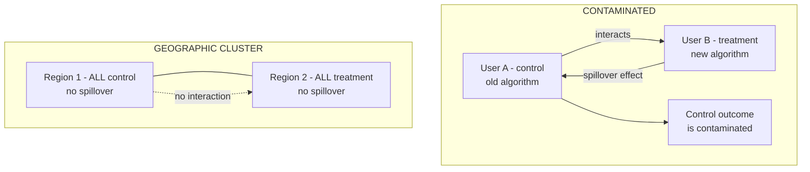

### Pitfalls
- ❌ **Using geographic clustering for a global product:** If treatment users in Chicago interact significantly with control users in New York (e.g., global marketplace), geographic clustering doesn't fully solve contamination
- ❌ **Ignoring equilibrium effects:** In a two-sided marketplace, the new algorithm may need time to reach equilibrium — measure results after 7+ days, not immediately after launch

### Concept Reference
→ [Observability](../../../system-design/scale-and-reliability/observability)

---

## Q7: How does Netflix run 1000+ concurrent A/B tests without interference?
**Role:** Staff | **Difficulty:** ⚫ | **Priority:** P2 | **Format:** Quick Answer

> **What the interviewer is testing:** Awareness of layered experiment infrastructure at massive scale.

### Answer in 60 seconds
- **Scale:** Netflix runs 250+ concurrent A/B tests. Managing interaction between tests requires careful layer isolation.
- **Layer-based experiment system:**
  - **Independent layers:** Each layer covers a different part of the product (UI layer, recommendation layer, playback layer, pricing layer). Tests in different layers are orthogonal — a user can be in treatment for UI AND control for recommendations simultaneously.
  - **Mutual exclusion:** Tests within the same layer that affect the same feature are mutually exclusive — a user can only be in one experiment at a time within a layer.
  - **User-level bucketing:** Consistent hash(user_id + layer_id + experiment_id) → bucket. Same user always in same bucket for the same experiment.
- **Interaction detection:** Netflix tracks pairwise experiment interactions — if two concurrent experiments show correlated effects, they investigate potential interference.
- **Holdout:** ~2% of users are in a global holdout group — never receive any experiment treatment. Allows measurement of cumulative effect of all shipped changes vs control.

### Diagram

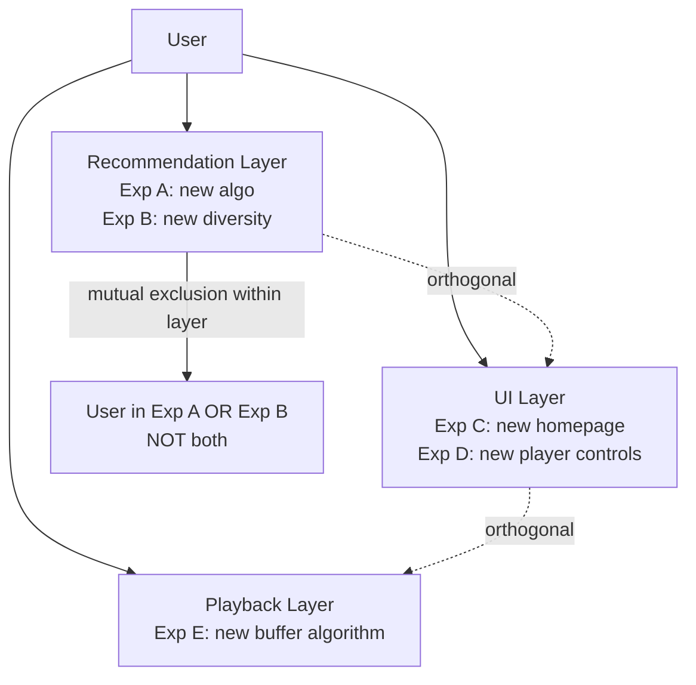

### Pitfalls
- ❌ **Ignoring interaction between layers:** Recommendation changes + UI changes can interact — a new recommendation list looks better on the new UI but worse on the old UI. Monitor for treatment × treatment interactions.
- ❌ **No holdout group:** Without a holdout, you cannot measure the cumulative effect of 250 concurrent shipped changes over a year — individual A/B wins can compound into a net negative

### Concept Reference
→ [Observability](../../../system-design/scale-and-reliability/observability)

---

## Q8: How do you implement sequential testing to stop an experiment early?
**Role:** Staff | **Difficulty:** ⚫ | **Priority:** P2 | **Format:** Deep Dive

> **What the interviewer is testing:** Understanding of statistically valid early stopping — a common need that's often implemented incorrectly (peeking problem).

### Problem Constraints
| Dimension | Value |
|-----------|-------|
| Business need | Stop experiment early if effect is clear — don't wait 14 days |
| Risk | Peeking at p-value daily inflates false positive rate to 30%+ |
| Goal | Valid statistical guarantee at any stopping time |

### Approach A — Fixed-Horizon Testing (Traditional)
Set sample size upfront. Do not look at results until N is reached. Valid but inflexible.

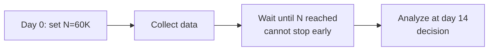

| Dimension | Fixed-Horizon |
|-----------|--------------|
| False positive rate | Controlled (α=0.05) |
| Flexibility | None |
| Business friction | High (wait full duration even if clear winner) |

### Approach B — Alpha Spending (Pocock / O'Brien-Fleming)
Pre-specify multiple "looks" at defined intervals. Adjust α threshold at each look to maintain overall α=0.05.

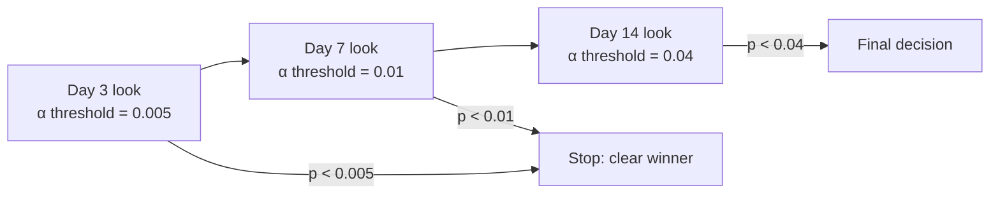

| Dimension | Alpha Spending |
|-----------|---------------|
| False positive rate | Controlled (α=0.05 cumulative) |
| Flexibility | Can stop at pre-specified looks |
| Sensitivity | Lower at early looks (conservative threshold) |

### Approach C — Sequential Probability Ratio Test (SPRT) / Always-Valid p-values
Valid p-value at any stopping point. Stop as soon as `p < α` OR `p > (1-power)`. No pre-specified sample size.

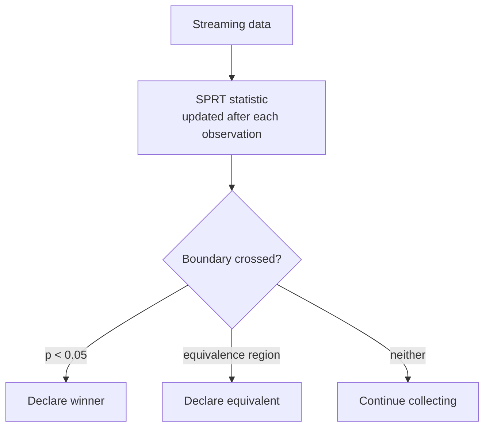

| Dimension | SPRT / Always-Valid |
|-----------|-------------------|
| False positive rate | Controlled at any stopping time |
| Flexibility | Stop at any point |
| Sensitivity | Near-optimal (slightly less powerful than fixed-horizon) |
| Implementations | Statsig, Eppo, Optimizely Stats Engine |

### Recommended Answer
**Approach C (SPRT / Always-Valid)** for teams that need flexible stopping. Modern implementations (Statsig, Eppo) implement this correctly. For teams building from scratch, **Approach B (alpha spending)** is easier to implement correctly.

### What a great answer includes
- [ ] Name the peeking problem: checking p-value daily inflates α from 5% to 30%
- [ ] Distinguish pre-specified multiple looks (alpha spending) from continuous monitoring (SPRT)
- [ ] Name a commercial tool that implements valid sequential testing (Statsig, Eppo)
- [ ] State that you pay a power cost for flexibility: valid sequential tests need ~10–20% more data than fixed-horizon

### Pitfalls
- ❌ **Naive daily p-value monitoring:** The most common incorrect implementation — engineers see p<0.05 on day 3 and stop, achieving 5× more false discoveries than intended
- ❌ **Sequential testing for non-stationary metrics:** SPRT assumes the treatment effect is constant. If effects are seasonal (e.g., Black Friday spike), sequential testing may stop too early when the effect is inflated

### Concept Reference
→ [Observability](../../../system-design/scale-and-reliability/observability)

---

## Q9: What is a holdout group and why do you keep it for months?
**Role:** Staff | **Difficulty:** ⚫ | **Priority:** P3 | **Format:** Quick Answer

> **What the interviewer is testing:** Understanding of the long-term experiment design needed to measure cumulative effects of continuous product changes.

### Answer in 60 seconds
- **Holdout group:** A small percentage of users (1–5%) permanently excluded from all experiments and feature launches for a defined period (3–12 months)
- **Purpose:** Measure the cumulative effect of all shipped changes over time vs a clean baseline
- **Problem it solves:** You ship 100 "winning" A/B tests in a year. Each shows +0.5% revenue. But do they actually compound to +50% revenue? Or do the gains interfere with each other? A holdout group gives you the ground truth.
- **Real findings:** Google has found that 1 in 10 experiments that "won" on the primary metric caused harm on a long-term metric not measured in the 2-week experiment window
- **Why months-long?** Novelty effects wear off after 2–4 weeks; 3-month holdout captures sustained behavioral changes
- **Cost:** Holdout users see the old product → some revenue/engagement loss. At 2% holdout × $1B revenue, cost is $20M/year. Netflix, Google, and Booking.com all accept this cost.

### Diagram

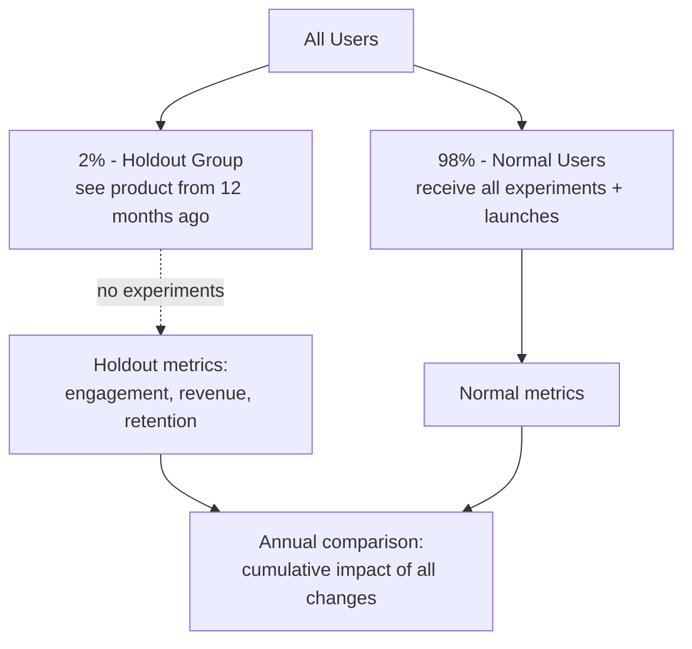

### Pitfalls
- ❌ **Holdout too small (<0.5%):** Statistical power insufficient to detect 2–3% cumulative effect differences — need at least 1% holdout for annual comparisons
- ❌ **Holdout leakage:** Holdout users see launched features through social sharing, screenshots, or logged-out state — holdout must be enforced at the user session layer, not just at feature flag level

### Concept Reference
→ [Observability](../../../system-design/scale-and-reliability/observability)

---

## Q10: Design an A/B testing framework for comparing two recommendation models
**Role:** Senior | **Difficulty:** 🔴 | **Priority:** P1 | **Format:** Scenario

**Real Company:** Spotify / Netflix / LinkedIn

### The Brief
> "Design an A/B testing framework to compare two recommendation models (v1: collaborative filtering, v2: deep learning ranker). The platform has 5M daily active users. Success metric: weekly stream minutes. Guardrails: P99 recommendation latency <200ms, diversity score, error rate."

### Clarifying Questions
1. What is the current weekly stream minutes per user and what lift is the minimum worth shipping? (Determines sample size)
2. Do users interact with multiple recommendation surfaces (home feed, search, radio)? Should models be tested on all surfaces simultaneously?
3. Are there user segments where we expect different effects? (New users, premium users, mobile vs desktop)
4. What is the minimum experiment duration? (Weekly periodicity suggests at least 14 days to capture two full weekly cycles)
5. Is interleaving feasible here? (Interleaving works well for ranked recommendation lists)

### Back-of-Envelope Estimation
| Metric | Calculation | Result |
|--------|-------------|--------|
| DAU | 5M | 5,000,000 |
| Experiment traffic | 20% in experiment | 1M users/day |
| Per variant | 50% of experiment | 500K users/day |
| Weekly users per variant | 500K × 7 | 3.5M |
| Baseline weekly streams | 45 streams/user/week | |
| MDE (1% relative lift) | 0.45 streams | |
| Sample size needed | ~250K per variant (for weekly metric, higher variance) | 250K per variant |
| Duration at 500K/day | 250K / 500K = 0.5 days minimum | Run 14 days (capture 2 weekly cycles) |

### High-Level Architecture

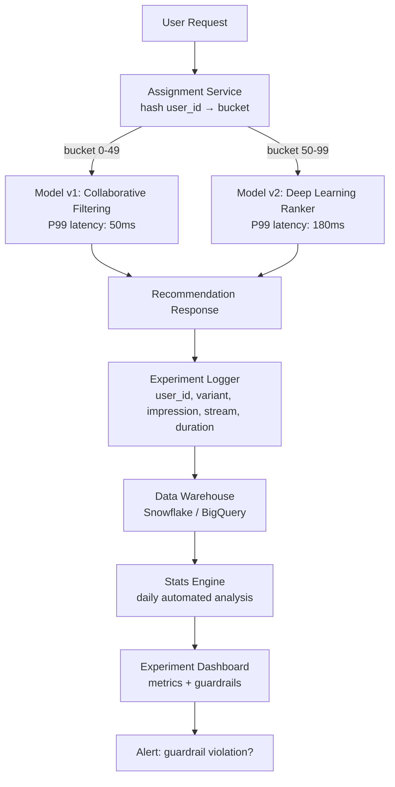

### Trade-off Decisions
| Decision | Option A | Option B | Chosen | Why |
|----------|----------|----------|--------|-----|
| Evaluation method | Standard A/B test | Interleaving | Both | Interleaving for fast signal on ranking quality (1K users, 1 day); A/B test for business metrics and guardrails (full 14 days) |
| Assignment unit | Per session | Per user | Per user | User should have consistent experience; session-level assignment causes same user to see v1 and v2 on same day → bias |
| Traffic allocation | 50/50 | 10/90 (v2 gets 10%) | 10/90 initially | v2 is new and untested — shadow score for 2 days, then interleaving for 1 day, then 10% A/B before full 50/50 |
| Primary metric | CTR | Weekly stream minutes | Weekly stream minutes | CTR is a proxy; stream minutes is the actual engagement value Spotify optimizes for |
| Stopping rule | Fixed 14 days | Sequential testing | Fixed 14 days | Weekly metric has high week-over-week variance — sequential testing would stop too early during a high-engagement week |

### Failure Modes
| Failure | Impact | Mitigation |
|---------|--------|------------|
| v2 latency guardrail violation (P99 > 200ms) | Users on v2 see slow recommendations → bad UX | Daily automated latency monitoring; auto-stop experiment if P99 v2 > 180ms (buffer before 200ms SLA) |
| Assignment contamination | User logs out and back in, gets different variant | Persistent assignment in user profile table; fallback to browser cookie |
| Novelty effect inflating v2 results | v2 shows +5% stream minutes in first 3 days, then returns to baseline | Analyze results by week; don't decide until week 2 data is in |
| Diversity guardrail violation | v2 recommends only top-10 popular songs → diversity drops 30% | Monitor catalog coverage (% of catalog recommended in past 24h) as guardrail; deep learning models often sacrifice diversity |
| Model v2 fails silently | v2 returns empty recommendations for 0.5% of users | Per-variant empty response rate alert; auto-fallback to v1 for failed v2 requests (don't count as v2 impressions) |

### Concept References
→ [Observability](../../../system-design/scale-and-reliability/observability)
→ [AI Agents](../../../system-design/ai-and-agents/agent-loop-tool-calling)
