# Feature Store Design

10 questions covering feature store architecture, online/offline stores, point-in-time correctness, and feature freshness.

---

## Q1: What is a feature store and what problems does it solve?
**Role:** Mid / ML Engineer | **Difficulty:** 🟡 | **Priority:** P0 | **Format:** Quick Answer

> **What the interviewer is testing:** Whether you understand the operational problems that emerge when many ML models share overlapping feature requirements.

### Answer in 60 seconds
- **Feature store:** A centralized data service that manages, stores, and serves ML features consistently for both training and inference
- **Problems it solves:**

| Problem | Without Feature Store | With Feature Store |
|---------|----------------------|-------------------|
| Feature duplication | 5 teams build "7-day avg spend" 5 different ways | Build once, reuse across 50 models |
| Training–serving skew | Training code ≠ serving code → 10–30% accuracy loss | Single definition, dual-path materialization |
| Feature freshness | Ad-hoc pipelines, unknown staleness | Declared freshness SLAs per feature |
| Data leakage | Future data accidentally included in training | Point-in-time correct joins enforced by platform |
| Discovery | No catalog of what features exist | Searchable feature registry |

- **Key concept:** Features are computed once and shared; not recomputed per-model per-team
- **Real impact:** Airbnb estimated 50% reduction in ML engineer time on data prep after adopting their internal feature store

### Diagram

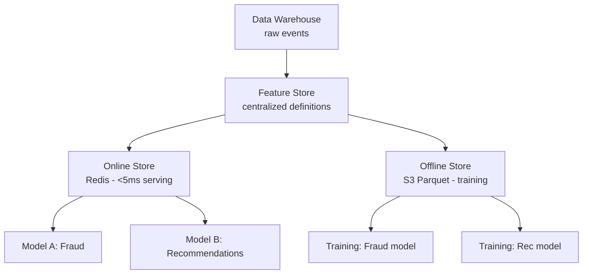

### Pitfalls
- ❌ **Building a feature store before you have 5+ models:** A feature store adds operational complexity; the benefit materializes at scale — premature investment for teams with <5 models
- ❌ **Treating feature store as just a Redis cache:** Feature stores also enforce point-in-time correctness for training data — the online serving (Redis) is only half the value

### Concept Reference
→ [Kafka & Messaging](../../../system-design/messaging-and-streaming/kafka-rabbitmq)

---

## Q2: What is the difference between online and offline feature stores?
**Role:** Mid | **Difficulty:** 🟡 | **Priority:** P1 | **Format:** Quick Answer

> **What the interviewer is testing:** Understanding of the dual-store architecture and why different storage systems are needed for training vs inference.

### Answer in 60 seconds
- **Online store:** Low-latency key-value store used at inference time. Retrieve current feature values for a given entity (user_id, item_id) in <10ms.
  - Storage: Redis, DynamoDB, Cassandra
  - Latency: 2–10ms
  - Data: Latest value only (no history)
  - Scale: Millions of entities, hundreds of features
- **Offline store:** Columnar storage used for training data generation. Contains full history of feature values with timestamps.
  - Storage: Parquet on S3, BigQuery, Delta Lake
  - Latency: Minutes (full table scan or time-range query)
  - Data: Historical values (months to years)
  - Scale: Billions of rows
- **Why both are needed:** Training needs historical snapshots at precise timestamps (point-in-time correctness); inference needs the current value fast. No single storage technology handles both well.

| Dimension | Online Store | Offline Store |
|-----------|-------------|---------------|
| Use case | Model inference | Model training |
| Storage | Redis / DynamoDB | S3 Parquet / BigQuery |
| Latency | 2–10ms | Minutes |
| Data | Latest value | Full history with timestamps |
| Query | `GET user:123:feature_xyz` | `SELECT features WHERE ts BETWEEN t1 AND t2` |

### Diagram

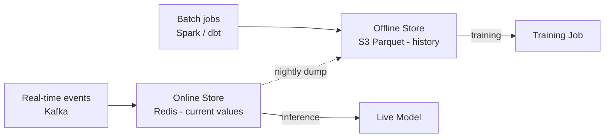

### Pitfalls
- ❌ **Using Redis as the offline store:** Reading 100M training examples from Redis is 10–100× slower than Parquet column-scan — Redis is for point lookups, not bulk scans
- ❌ **No synchronization between stores:** If the offline store has feature=v2 logic but the online store was updated to v3 logic, training and serving diverge → training–serving skew

### Concept Reference
→ [Kafka & Messaging](../../../system-design/messaging-and-streaming/kafka-rabbitmq)

---

## Q3: What is point-in-time correctness and why does it matter for training data?
**Role:** Senior | **Difficulty:** 🔴 | **Priority:** P1 | **Format:** Deep Dive

> **What the interviewer is testing:** Understanding of one of the most common and harmful data bugs in ML — using "future" feature values when training on historical data.

### Problem Constraints
| Dimension | Value |
|-----------|-------|
| Task | Train a credit default prediction model |
| Training data | Historical loan events from 2023–2024 |
| Features | User's total debt, credit utilization, recent purchases |
| Target | Did user default within 90 days of loan? |

### The Problem — Temporal Leakage

Without point-in-time correctness, joining features to training events uses the **current** (2025) value of each feature, not the value **at the time of the loan event** (2023).

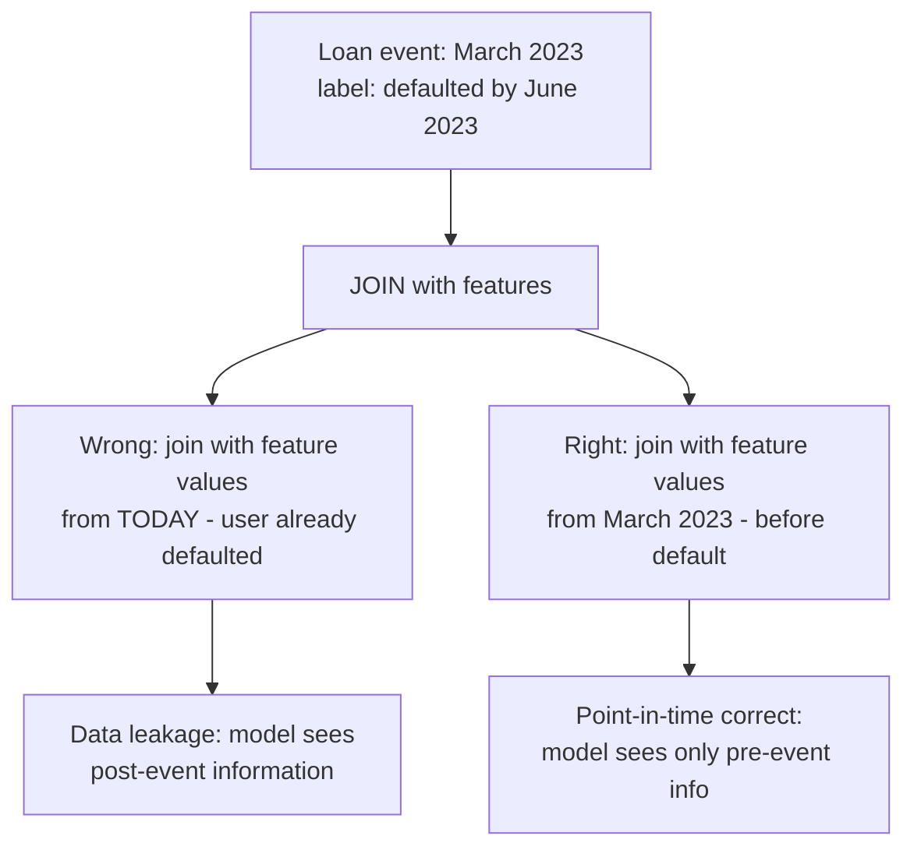

### Point-in-Time Join Algorithm

```mermaid
graph TD
  EVENTS[Training events table<br/>user_id, event_ts, label] --> PTJOIN[Point-in-Time JOIN<br/>as-of join]
  FEATURES[Feature history table<br/>user_id, feature_ts, feature_value] --> PTJOIN
  PTJOIN --> RESULT[For each event at ts T:<br/>select feature value WHERE feature_ts <= T<br/>AND MAX(feature_ts)]
```

| Approach | SQL Pattern | Correctness |
|----------|-------------|-------------|
| Naive join | `JOIN features ON user_id` | Wrong — uses latest feature value |
| Point-in-time join | `JOIN features ON user_id WHERE feature_ts <= event_ts ORDER BY feature_ts DESC LIMIT 1` | Correct — uses value as-of event time |
| Feature store PT join | `feast.get_historical_features(entity_df, feature_refs)` | Correct — handled by platform |

### Impact of Leakage

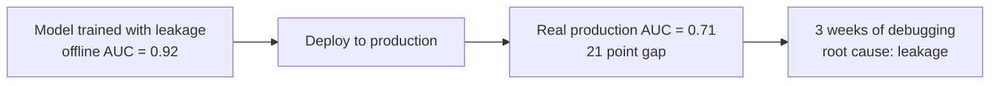

### What a great answer includes
- [ ] Define the exact problem: feature value at training event time ≠ feature value today
- [ ] Give a concrete example of leakage (using post-event feature in training)
- [ ] Explain the as-of join: for each event timestamp, find the latest feature value before that timestamp
- [ ] Quantify impact: 10–30% offline-online AUC gap is common when leakage is present
- [ ] Name that Feast and Tecton implement point-in-time joins natively

### Pitfalls
- ❌ **Point-in-time joins are expensive:** For 100M training events × 50 features, a point-in-time join requires sorting by time and scanning billions of feature rows — use a dedicated framework (Feast, dbt time-travel) not hand-written SQL
- ❌ **Leakage only at the label, not features:** Even with correct labels, features can leak (e.g., using a "user churn risk score" computed after the churn event as a training feature)

### Concept Reference
→ [Kafka & Messaging](../../../system-design/messaging-and-streaming/kafka-rabbitmq)

---

## Q4: How do you ensure feature freshness for real-time ML models?
**Role:** Senior | **Difficulty:** 🔴 | **Priority:** P1 | **Format:** Quick Answer

> **What the interviewer is testing:** Understanding of freshness requirements and the pipeline choices that achieve them.

### Answer in 60 seconds
- **Feature freshness:** How recently the stored feature value reflects the actual underlying state. A "7-day purchase count" feature updated nightly has 24-hour staleness maximum.
- **Freshness tiers by use case:**

| Feature type | Acceptable staleness | Pipeline |
|-------------|---------------------|---------|
| Session-level (last 3 clicks) | <30 seconds | Kafka → Flink → Redis |
| User engagement (daily active) | <1 hour | Micro-batch Spark → Redis |
| Long-term behavior (30-day spend) | <24 hours | Nightly Spark batch → Redis |
| Static profile (age, location) | 1–7 days | Weekly batch → Redis |

- **Monitoring freshness:** Track `feature_last_updated_ts` for each entity. Alert when `NOW - last_update > threshold`. Example: alert if 30-day spend feature is >26 hours stale (6-hour buffer before SLA violation).
- **Consequences of stale features:** A fraud model using 30-day spend that's 3 days stale during a pipeline failure scores users as if it's 3 days ago — misses recent fraud pattern changes

### Diagram

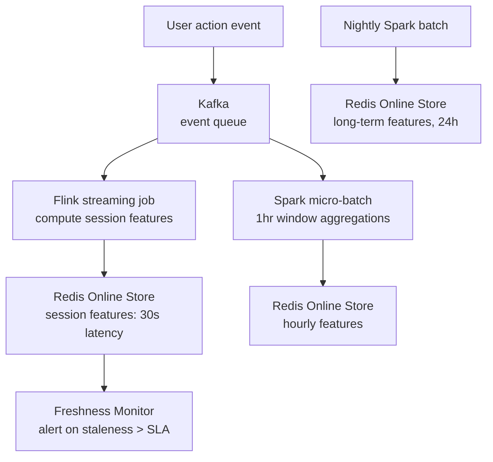

### Pitfalls
- ❌ **Same freshness pipeline for all features:** Session features (30s requirement) built with a nightly batch job will always be 24 hours stale — match pipeline latency to feature SLA
- ❌ **No freshness monitoring:** During pipeline failures, online store serves values from days ago silently. Freshness monitoring is required — don't assume the pipeline always runs on time

### Concept Reference
→ [Kafka & Messaging](../../../system-design/messaging-and-streaming/kafka-rabbitmq)

---

## Q5: How does feature sharing across teams reduce duplication and increase consistency?
**Role:** Senior | **Difficulty:** 🔴 | **Priority:** P2 | **Format:** Deep Dive

> **What the interviewer is testing:** Understanding of the organizational and technical benefits of a centralized feature catalog.

### Problem Constraints
| Dimension | Value |
|-----------|-------|
| Teams | 8 ML teams (fraud, search, ads, recommendations, pricing, trust, risk, growth) |
| Models per team | 10–20 models each |
| Shared entity types | user_id, item_id, session_id |
| Current state | Each team computes features independently |

### Without Feature Store (Current State)

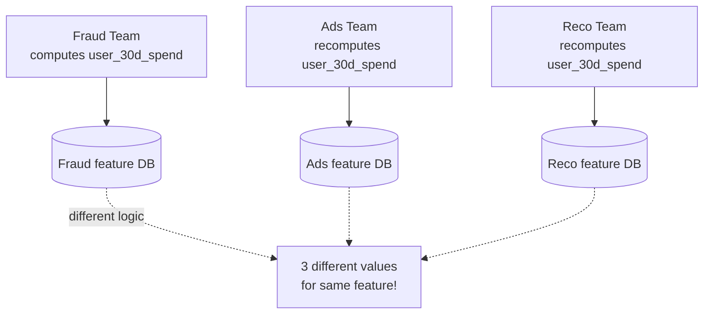

Problems: 3× compute cost, 3 different implementations (different NULL handling, different time windows), debugging nightmare when models disagree.

### With Feature Store (Target State)

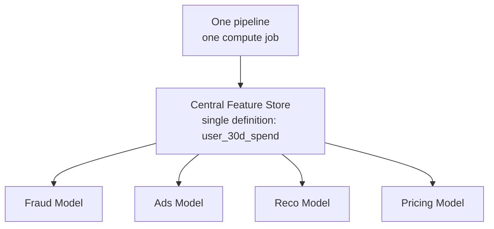

Benefits:
- **1× compute:** Feature computed once, served to all teams — 8× compute reduction for shared features
- **Consistent values:** All models use the same `user_30d_spend` — disagreements between models are eliminated
- **Faster iteration:** New model can use 200+ existing features without any data engineering work
- **Feature discovery:** Engineers search the catalog for features before building new ones

### Feature Registry

| Feature | Owner | Freshness | Description | Used by |
|---------|-------|-----------|-------------|---------|
| `user_30d_spend` | fraud-team | 24h | Total spend in last 30 days | fraud, ads, pricing |
| `session_click_count` | ads-team | 30s | Clicks in current session | ads, recommendations |
| `item_view_7d` | reco-team | 1h | Item views in last 7 days | recommendations, search |

### What a great answer includes
- [ ] Quantify compute savings: N teams × M shared features → 1 compute job (1/N cost)
- [ ] Highlight consistency: same definition means same NULL handling, same time window semantics
- [ ] Mention feature discovery as a cultural benefit — reduces "we didn't know that feature existed"
- [ ] Address ownership: who is responsible when a shared feature is wrong?

### Pitfalls
- ❌ **No clear feature ownership model:** When user_30d_spend has a bug, who fixes it? A shared feature without a clear owner becomes nobody's problem — assign an owning team and SLA
- ❌ **Forcing all features into the shared store:** Some features are model-specific (e.g., "probability of click on this exact ad-item combination") — these don't benefit from sharing; keep them in the model serving layer

### Concept Reference
→ [Kafka & Messaging](../../../system-design/messaging-and-streaming/kafka-rabbitmq)

---

## Q6: How do you implement feature backfill for a new feature across historical data?
**Role:** Senior | **Difficulty:** 🔴 | **Priority:** P2 | **Format:** Quick Answer

> **What the interviewer is testing:** Understanding of the data engineering challenge of retroactively computing a new feature over years of historical data.

### Answer in 60 seconds
- **Problem:** A new feature `user_merchant_diversity` (number of distinct merchants in last 30 days) was never computed historically. Training data needs it for the last 2 years.
- **Backfill steps:**
  1. Define feature transformation logic in feature store (Feast/Tecton)
  2. Run historical backfill job: Spark job reads raw event data from data warehouse, computes feature for every (entity, timestamp) pair going back 2 years
  3. Write computed values to offline store (Parquet on S3) with timestamps
  4. Validate: sample-check computed values against manual calculation
  5. Start materialization to online store (Redis) for current + future values
- **Scale example:** 2 years × 30M users × 1 feature = 22B rows to compute. Spark cluster of 20 nodes: ~4 hours at 1.5B rows/hour
- **Incremental backfill:** Don't recompute everything at once — compute in monthly batches to allow validation and restart on failure
- **Key gotcha:** Backfill must use the exact same transformation logic as the real-time pipeline — different logic = training–serving skew

### Diagram

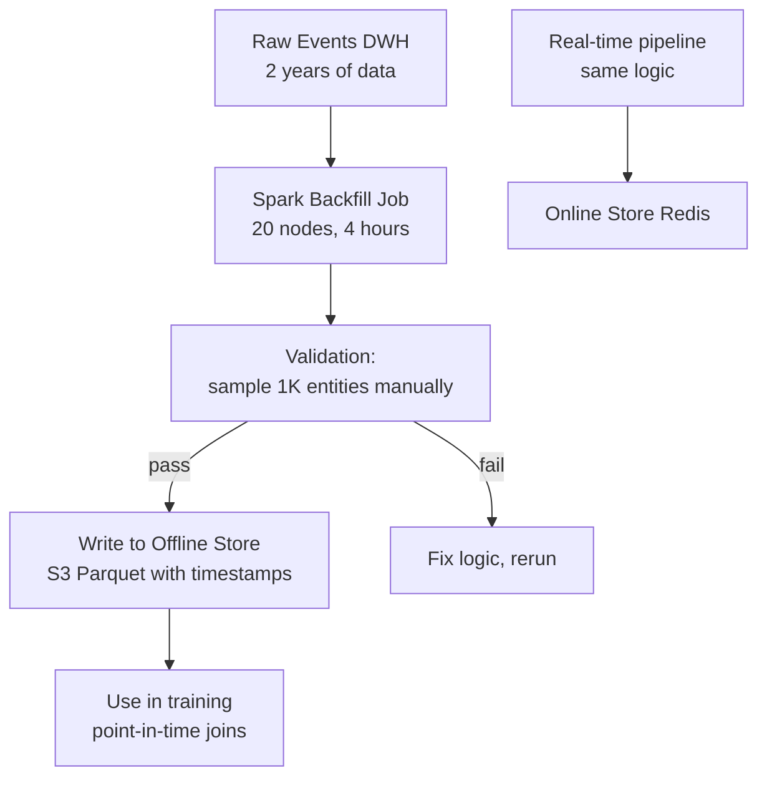

### Pitfalls
- ❌ **Different logic in backfill vs real-time pipeline:** The most common source of training–serving skew — backfill uses slightly different NULL handling or time window boundaries than the streaming pipeline
- ❌ **No incremental checkpoint:** A 4-hour Spark job that fails at hour 3.5 restarts from scratch — checkpoint monthly batches

### Concept Reference
→ [Kafka & Messaging](../../../system-design/messaging-and-streaming/kafka-rabbitmq)

---

## Q7: How does Uber's Feast feature store handle real-time and batch features?
**Role:** Staff | **Difficulty:** ⚫ | **Priority:** P2 | **Format:** Quick Answer

> **What the interviewer is testing:** Awareness of how a widely-used open-source feature store (Feast, originally from Gojek, adopted at Uber) handles the dual-store problem.

### Answer in 60 seconds
- **Feast architecture:** Open-source feature store managing feature definitions, materialization, and serving for both online and offline workloads
- **Feature definition:** Declared in Python (FeatureView): entity, data source, feature names, freshness SLA. Single source of truth.
- **Batch materialization:** Feast reads from offline source (BigQuery, S3), processes features, writes to offline store (Parquet) for training + to online store (Redis) for serving
- **Real-time features (push source):** Feast 0.20+ supports push-based streaming — application pushes feature updates directly to online store (Redis) when events occur; no Flink/Spark streaming required for simple cases
- **Point-in-time joins:** `feast.get_historical_features(entity_df, feature_refs)` implements correct as-of joins automatically — no manual SQL
- **At Uber scale:** Uber uses their own internal fork (not vanilla Feast) — Palette feature store. Key additions: Flink streaming for sub-second freshness, a feature discovery UI, ownership enforcement

### Diagram

```mermaid
graph TD
  DEF[Feature Definitions<br/>Python FeatureView] --> FEAST[Feast SDK]
  FEAST --> MAT[Materialization Job<br/>batch: Spark / BigQuery]
  MAT --> ONLINE[Online Store<br/>Redis - <10ms]
  MAT --> OFFLINE[Offline Store<br/>S3 Parquet]
  PUSH[Push Source<br/>real-time events] --> ONLINE
  ONLINE --> INF[Inference:<br/>feast.get_online_features()]
  OFFLINE --> TRAIN[Training:<br/>feast.get_historical_features()]
```

### Pitfalls
- ❌ **Feast is not a compute engine:** Feast orchestrates materialization but relies on Spark/BigQuery for the actual computation — teams that expect Feast to run Spark jobs for them misunderstand the architecture
- ❌ **Vanilla Feast at high scale:** Feast's built-in materialization doesn't handle 500K events/sec — at Uber/TikTok scale, the real-time path uses Flink with Feast only for the offline store and API layer

### Concept Reference
→ [Kafka & Messaging](../../../system-design/messaging-and-streaming/kafka-rabbitmq)

---

## Q8: How does DoorDash's Riviera feature store handle features updated every 30 seconds?
**Role:** Staff | **Difficulty:** ⚫ | **Priority:** P2 | **Format:** Deep Dive

> **What the interviewer is testing:** Understanding of the design choices for a sub-minute feature freshness requirement at high write throughput.

### Problem Constraints
| Dimension | Value |
|-----------|-------|
| Feature examples | Dasher availability, restaurant ETA, demand surge by zone |
| Update frequency | Every 30 seconds |
| Write throughput | 100K feature updates/sec |
| Read throughput | 500K reads/sec at inference |
| Read latency | <5ms (P99) |

### Architecture: Streaming → In-Memory → Serving

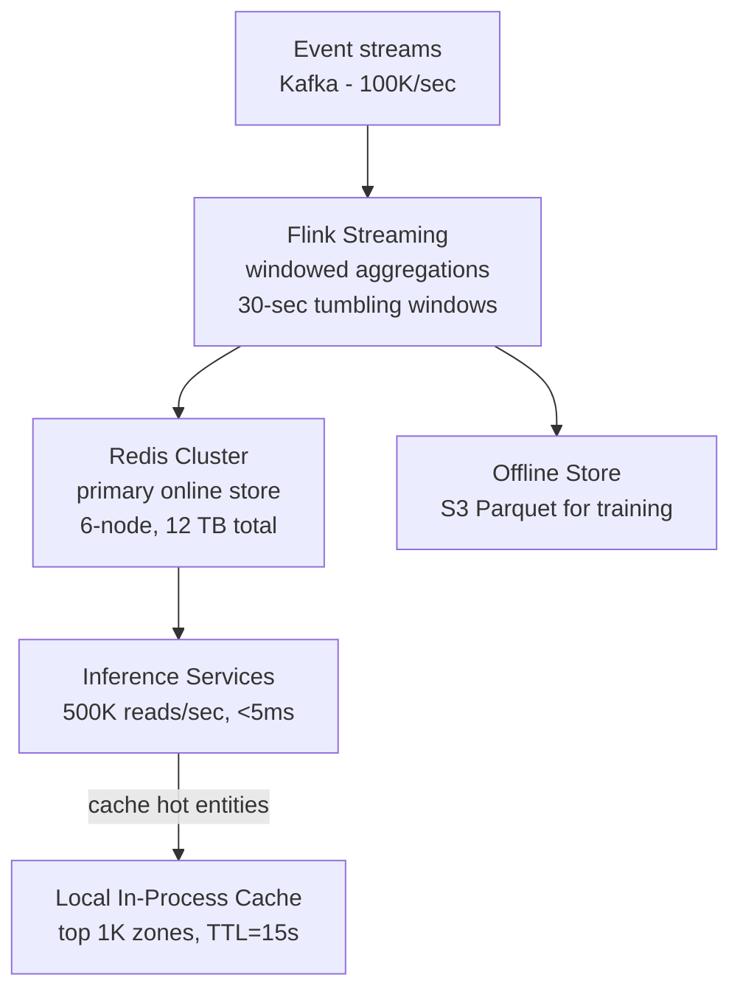

| Dimension | Implementation | Why |
|-----------|---------------|-----|
| Streaming compute | Flink | Exactly-once semantics; 30s windowing with low latency |
| Online store | Redis Cluster | 500K reads/sec, <5ms — Redis handles 1M+ simple ops/sec per node |
| Write pattern | Full overwrite per entity per window | Simpler than delta updates for window aggregations |
| Local cache | In-process LRU for top 1K hotspots | Zone-level features (demand surge) are read for every order in that zone — cache hit rate ~60% |
| Feature versioning | Timestamp + version in Redis key | `feature:demand_surge:zone_99:v3:ts=1700000000` |

### Why 30-Second Freshness?
Dasher ETA and demand surge change on the order of minutes — 30-second freshness ensures pricing and dispatch decisions are never more than 30 seconds stale. A fraud feature might tolerate 5-minute staleness; dispatch needs 30 seconds.

### What a great answer includes
- [ ] Identify that 30-second freshness requires a streaming pipeline (Flink/Spark Streaming), not batch
- [ ] Calculate write throughput: 100K feature updates/sec × average feature size
- [ ] Address the write amplification: Flink outputs every 30 seconds even if underlying metric unchanged — consider change detection to reduce Redis write load
- [ ] Local cache layer: 60% cache hit rate reduces Redis load by 60% for hotspot features

### Pitfalls
- ❌ **Polling-based freshness check:** Having inference services poll Redis every 30 seconds creates 500K × 2 polls/min = 1M poll ops/min — use push-based update or cache-aside with TTL instead
- ❌ **No offline store for 30-second features:** Real-time features must also be materialized to offline store for training — training on historical data needs historical values at exact event timestamps

### Concept Reference
→ [Kafka & Messaging](../../../system-design/messaging-and-streaming/kafka-rabbitmq)

---

## Q9: How do you monitor features for drift and staleness in production?
**Role:** Staff | **Difficulty:** ⚫ | **Priority:** P3 | **Format:** Quick Answer

> **What the interviewer is testing:** Understanding of the ongoing operational monitoring needed to maintain feature quality after initial deployment.

### Answer in 60 seconds
- **Two types of feature problems:**
  - *Staleness:* Feature value is not fresh enough (pipeline delay or failure) — detected by timestamp monitoring
  - *Distribution drift:* Feature value distribution changes over time — detected by statistical comparison

- **Staleness monitoring:**
  - Track `last_write_timestamp` per entity per feature
  - Alert: `NOW - max(last_write_ts over past 100 reads) > freshness_SLA × 1.5`
  - Example: 24h SLA feature with no writes for 30h → alert

- **Distribution drift monitoring:**
  - Compute daily statistics per feature (mean, stddev, null rate, min/max)
  - Compare against 7-day rolling baseline using Population Stability Index (PSI)
  - PSI < 0.1: stable; PSI 0.1–0.2: warning; PSI > 0.2: alert + investigate
  - Example: `user_30d_spend` mean drops from $120 to $40 → likely upstream pipeline schema change

- **Automated remediation:** On staleness alert: page feature owner + trigger recompute job. On drift alert: hold model retraining until drift is investigated — don't train on drifted features

### Diagram

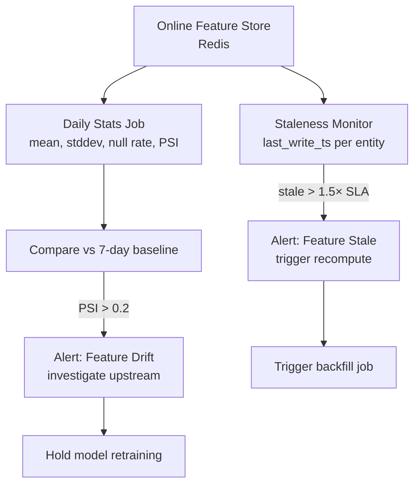

### Pitfalls
- ❌ **Monitoring only the feature store, not upstream sources:** Drift in the online store is a symptom; root cause is usually an upstream data source schema change or pipeline bug — alert owners of the upstream source
- ❌ **Same drift threshold for all features:** A `fraud_rate` feature naturally varies ±50% week-over-week (seasonal patterns); a `user_age` feature should never change — calibrate thresholds per-feature

### Concept Reference
→ [Observability](../../../system-design/scale-and-reliability/observability)

---

## Q10: Design a feature store for a fraud detection model
**Role:** Senior | **Difficulty:** 🔴 | **Priority:** P1 | **Format:** Scenario

**Real Company:** Stripe / PayPal / Adyen

### The Brief
> "Design a feature store for a fraud detection ML model. The model needs real-time transaction context (what's happening now) and historical user behavior patterns (long-term signals). Transaction volume: 500K/day. Fraud decision must complete in <100ms."

### Clarifying Questions
1. What are the entity types? (user_id, merchant_id, card_id, device_id, IP address?)
2. How far back does historical data go? (30 days? 12 months?)
3. Are any features shared with other models (churn prediction, recommendations)?
4. What is the data retention requirement for the offline store (compliance)?
5. Are there regulatory requirements on which features can be used (GDPR, FCRA)?

### Back-of-Envelope Estimation
| Metric | Calculation | Result |
|--------|-------------|--------|
| Transactions/day | 500K | ~6 txns/sec |
| Feature reads at inference | 6 txns/sec × 50 features × 5 entity types | 1,500 Redis ops/sec |
| Online store size | 10M users × 50 features × 4 bytes avg | ~2 GB |
| Offline store size | 2 years × 500K txns/day × 200 features | ~5 TB |
| Real-time feature latency budget | 100ms total → 15ms features | 15ms for all feature retrieval |

### Feature Taxonomy

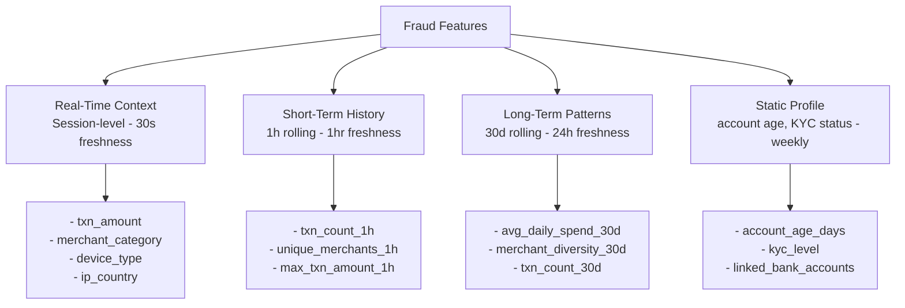

### High-Level Architecture

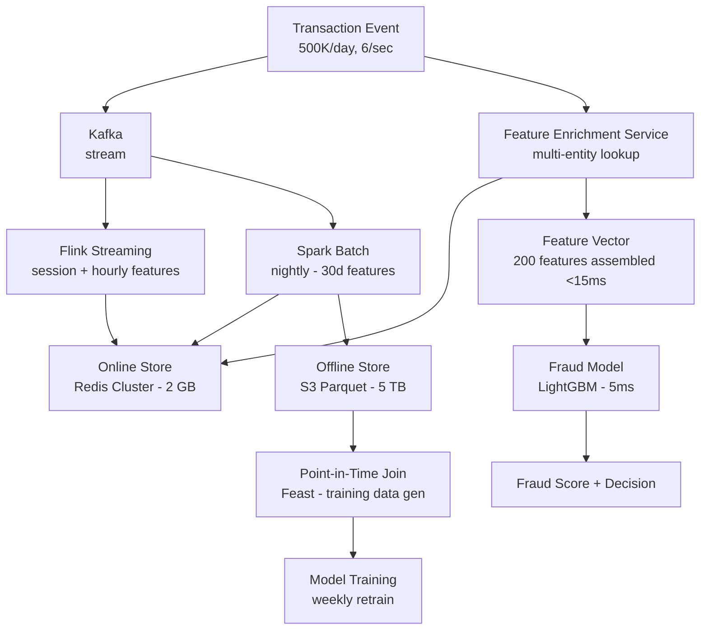

### Trade-off Decisions
| Decision | Option A | Option B | Chosen | Why |
|----------|----------|----------|--------|-----|
| Real-time feature compute | Flink streaming | Lambda on TXN event | Flink | Lambda can't maintain stateful window aggregations (1h txn count) efficiently; Flink handles exactly-once windowed aggregates |
| Online store | Redis | DynamoDB | Redis | 1,500 ops/sec is trivial; Redis P99 <2ms vs DynamoDB P99 5–10ms — 8ms savings matter in a 100ms budget |
| Feature lookups per transaction | Sequential (50ms) | Parallel batch | Parallel batch | Retrieve all entity features (user + merchant + device) in one batched Redis pipeline call → 5ms instead of 50ms |
| Offline store format | Parquet | Delta Lake | Parquet | Team has Spark expertise; Delta Lake adds complexity (ACID) without benefit for append-only feature history |
| Regulatory compliance | Store all features | Hash/tokenize PII before storage | Hash PII | Device fingerprints and IP addresses are PII; GDPR right-to-erasure requires pseudonymization before storage |

### Failure Modes
| Failure | Impact | Mitigation |
|---------|--------|------------|
| Redis unavailable | No features → can't score → fraud decision falls back to rules | Circuit breaker with rule-based fallback; Redis Sentinel for HA; always-available basic features (amount, category) avoid Redis |
| Flink lag (session feature stale >5 min) | Hour-level features stale during pipeline backlog | Alert on consumer lag >10K events; feature freshness monitor; flag stale features to model as null |
| Nightly Spark job fails | 30-day features become stale for >24h | Retry with backoff; alert if batch features older than 30h; model still works with just session + hourly features |
| Upstream schema change (merchant_category renamed) | Feature becomes null for all transactions | Schema validation step before loading; data contract enforcement; alert on null rate spike >5% |
| Feature drift post-promotion | Model degrades because feature distribution changed | Daily PSI check on all features; model performance monitoring; semi-automated rollback when PSI >0.2 + model AUC drops 5% |

### Concept References
→ [Kafka & Messaging](../../../system-design/messaging-and-streaming/kafka-rabbitmq)
→ [Observability](../../../system-design/scale-and-reliability/observability)
→ [Database Sharding](../../../system-design/storage-and-databases/database-sharding)
