# LLM System Design

10 questions covering LLM inference optimization, scaling, and production serving infrastructure.

---

## Q1: What is TTFT and TPOT and why do they matter?
**Role:** Mid / ML Engineer | **Difficulty:** 🟡 | **Priority:** P0 | **Format:** Quick Answer

> **What the interviewer is testing:** Whether you understand the two distinct latency components in LLM generation and which matters for which user experience.

### Answer in 60 seconds
- **TTFT (Time to First Token):** Latency from request submission to the first generated token appearing — driven by prefill (processing the prompt)
- **TPOT (Time Per Output Token):** Latency between each successive generated token — driven by autoregressive decode speed
- **Why they matter separately:**
  - TTFT drives *perceived responsiveness* — users notice when the chat box stays blank >500ms
  - TPOT drives *reading speed* — humans read ~250 words/min; TPOT >40ms per token (25 tokens/sec) makes text appear slower than reading speed
- **Typical targets:** TTFT <200ms for interactive chat; TPOT <30ms/token (>33 tokens/sec)
- **Prefill vs decode bottleneck:** Prefill is compute-bound (matrix-multiply intensive); decode is memory-bandwidth-bound (load model weights each step)

### Diagram

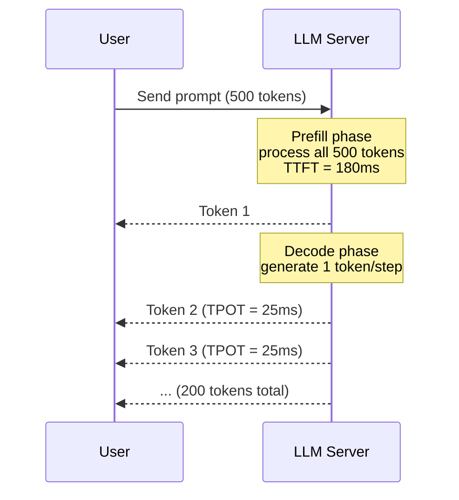

### Pitfalls
- ❌ **Optimizing only for end-to-end latency:** A model that generates 200 tokens in 5s total but takes 3s before the first token feels much slower than one that takes 5s total with first token in 150ms
- ❌ **Ignoring TPOT for long outputs:** For a 1000-token response at 25ms/token, TPOT contributes 25 seconds — dwarfs TTFT

### Concept Reference
→ [AI Agents](../../../system-design/ai-and-agents/agent-loop-tool-calling)

---

## Q2: What is a KV cache in LLM inference and how does it speed up generation?
**Role:** Mid | **Difficulty:** 🟡 | **Priority:** P1 | **Format:** Quick Answer

> **What the interviewer is testing:** Understanding of the core optimization that makes autoregressive LLM generation feasible at production scale.

### Answer in 60 seconds
- **Problem:** In autoregressive generation, each new token attends to all previous tokens — without caching, you recompute attention over the full sequence for every new token (O(n²) compute per step)
- **KV cache:** Store the Key and Value matrices for all previous tokens in GPU memory. For token N, only compute Q/K/V for token N, then attend against cached K/V for tokens 1..N-1
- **Speed impact:** KV cache reduces decode from O(n) per step to O(1) — generating token 100 takes the same compute as generating token 1
- **Memory cost:** KV cache size = 2 × num_layers × num_heads × head_dim × sequence_length × batch_size × dtype_bytes. For Llama-3 70B at 4K context, batch=32: ~48 GB — significant GPU memory pressure
- **PagedAttention:** vLLM's innovation — manages KV cache memory like OS virtual memory, enabling 2–4× higher throughput by eliminating fragmentation

### Diagram

```mermaid
graph TD
  subgraph Without KV Cache
    P1[Recompute K,V for<br/>tokens 1..N-1 each step]
    P1 --> SLOW[O(N²) total compute]
  end
  subgraph With KV Cache
    KV[KV Cache<br/>K,V stored for tokens 1..N-1]
    NEW[Compute K,V only<br/>for token N]
    KV --> ATT[Attention<br/>new Q × cached K,V]
    NEW --> ATT
    ATT --> FAST[O(N) total compute]
  end
```

### Pitfalls
- ❌ **KV cache eviction under memory pressure:** If batch grows and KV cache is evicted, requests are recomputed from scratch — latency spike 5–10× for affected requests
- ❌ **Fixed context length assumptions:** Allocating KV cache for max sequence length wastes GPU memory; PagedAttention allocates dynamically

### Concept Reference
→ [AI Agents](../../../system-design/ai-and-agents/agent-loop-tool-calling)

---

## Q3: What is continuous batching for LLM inference and how does it improve GPU utilization?
**Role:** Senior | **Difficulty:** 🔴 | **Priority:** P1 | **Format:** Deep Dive

> **What the interviewer is testing:** Understanding of the key serving optimization that enables high-throughput LLM inference.

### Problem Constraints
| Dimension | Value |
|-----------|-------|
| Model | Llama-3 70B (140 GB BF16) |
| Hardware | 2× A100 80GB (tensor parallel) |
| Request rate | 200 req/sec |
| Avg prompt length | 512 tokens |
| Avg output length | 256 tokens |
| Target TTFT | <500ms |

### Approach A — Static Batching
Wait until a fixed batch size (e.g., 32) is full, then run prefill for all requests simultaneously. All requests in the batch complete together before the next batch starts.

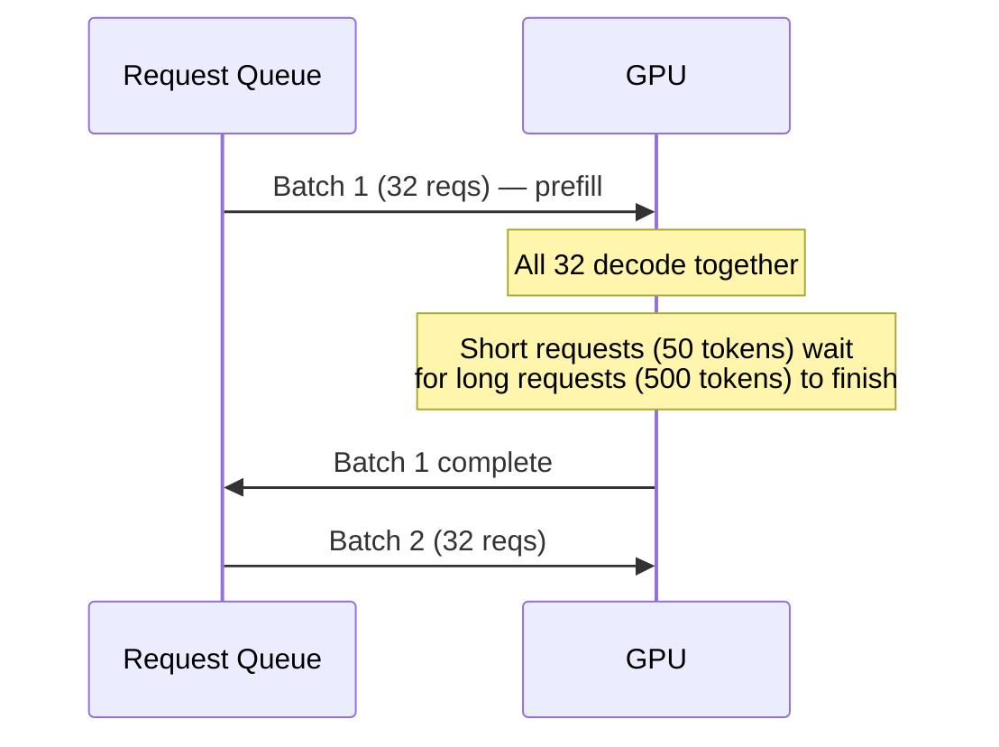

| Dimension | Static Batching |
|-----------|----------------|
| GPU utilization | 40–60% (idle while filling batch) |
| TTFT at 200 req/sec | 500–2000ms (wait in queue) |
| Short request penalty | Short requests blocked by long ones |
| Throughput | ~60 tokens/sec/GPU |

### Approach B — Continuous Batching (Iteration-Level Scheduling)
New requests join the batch at every decode step (iteration), not at batch boundaries. When a sequence finishes, a new request immediately fills its slot.

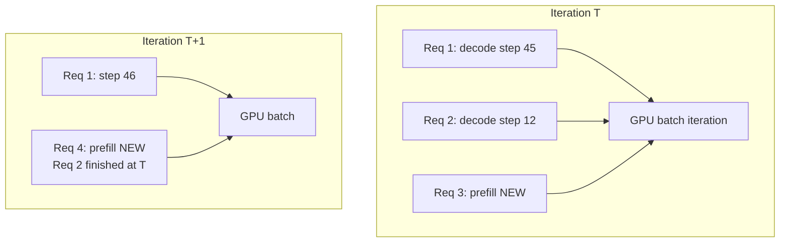

| Dimension | Continuous Batching |
|-----------|---------------------|
| GPU utilization | 85–95% |
| TTFT | <200ms (no batch fill wait) |
| Short request penalty | None — finishes immediately |
| Throughput | ~180 tokens/sec/GPU |

### Recommended Answer
**Continuous batching** is the correct answer for production LLM serving. Used by vLLM, TGI (HuggingFace), and TensorRT-LLM. The key insight: decode is memory-bandwidth bound, not compute bound — the GPU can process a mixed batch (some requests at step 3, some at step 300) with near-zero additional overhead compared to a uniform batch.

Combined with **PagedAttention** (KV cache memory virtualization), continuous batching achieves 2–4× throughput improvement over static batching at the same GPU count.

### What a great answer includes
- [ ] Explain the fundamental problem with static batching (head-of-line blocking by long sequences)
- [ ] State that decode is memory-bandwidth bound (70B model = 140 GB loaded per decode step regardless of batch size)
- [ ] Quantify improvement: 2–4× throughput gain
- [ ] Mention vLLM as the open-source reference implementation
- [ ] Note PagedAttention as the complementary KV cache optimization

### Pitfalls
- ❌ **Ignoring prefill latency spikes:** Prefilling a new request mid-batch pauses ongoing decodes — chunked prefill (splitting prefill into multiple iterations) mitigates this
- ❌ **Memory fragmentation without PagedAttention:** Variable-length KV caches fragment GPU memory, reducing effective batch size by 2–3× — PagedAttention eliminates fragmentation

### Concept Reference
→ [AI Agents](../../../system-design/ai-and-agents/agent-loop-tool-calling)

---

## Q4: What is tensor parallelism vs pipeline parallelism for large model serving?
**Role:** Senior | **Difficulty:** 🔴 | **Priority:** P1 | **Format:** Quick Answer

> **What the interviewer is testing:** Understanding of the two primary strategies for distributing model weights across multiple GPUs for inference.

### Answer in 60 seconds
- **Tensor Parallelism (TP):** Each layer's weight matrices are sharded horizontally across GPUs. All GPUs participate in every layer's computation. Requires high-bandwidth interconnect (NVLink, <1μs).
  - Best for: intra-node (8 GPUs on same server, NVLink)
  - Latency: adds 2 all-reduce operations per layer — ~0.5ms overhead per layer × 80 layers = 40ms for Llama-3 70B on fast NVLink
- **Pipeline Parallelism (PP):** Model layers are split into sequential stages, each stage on a different GPU/node. Requests flow sequentially through stages.
  - Best for: inter-node scaling (GPUs across different servers)
  - Latency: adds one round-trip per stage boundary — at 400 Gbps InfiniBand, activations transfer (~2 MB) takes ~40μs per boundary
- **For inference (vs training):** TP is preferred — pipeline parallelism adds serial latency (stages are sequential); TP spreads each layer's compute across all GPUs simultaneously
- **Rule of thumb:** Use TP within a node (NVLink), add PP only if model doesn't fit on one node's GPUs

### Diagram

```mermaid
graph TD
  subgraph Tensor Parallel - Same Node
    INPUT[Input Tensor] --> GPU1_TP[GPU1: W[:, 0:H/2]]
    INPUT --> GPU2_TP[GPU2: W[:, H/2:H]]
    GPU1_TP --> AR[All-Reduce NVLink]
    GPU2_TP --> AR
    AR --> OUT1[Output Layer N]
  end
  subgraph Pipeline Parallel - Multi-Node
    R[Request] --> S1[Stage 1 GPU<br/>Layers 0-17]
    S1 -->|InfiniBand| S2[Stage 2 GPU<br/>Layers 18-35]
    S2 -->|InfiniBand| S3[Stage 3 GPU<br/>Layers 36-53]
    S3 --> OUT2[Output]
  end
```

### Pitfalls
- ❌ **Pipeline parallelism for low-batch-size inference:** PP has idle GPU time during pipeline fill; with batch size 1, 3 of 4 pipeline stages are idle at any moment — 75% waste
- ❌ **Tensor parallelism across InfiniBand:** All-reduce across 400 Gbps InfiniBand is 10–100× slower than NVLink — model quality is fine but latency per layer increases from 0.5ms to 5ms, making TP across nodes impractical for interactive serving

### Concept Reference
→ [AI Agents](../../../system-design/ai-and-agents/agent-loop-tool-calling)

---

## Q5: How does quantization (INT8, INT4) reduce model memory and what accuracy does it cost?
**Role:** Senior | **Difficulty:** 🔴 | **Priority:** P2 | **Format:** Deep Dive

> **What the interviewer is testing:** Practical understanding of the quantization trade-off that determines GPU hardware requirements for LLM deployment.

### Problem Constraints
| Dimension | Value |
|-----------|-------|
| Model | Llama-3 70B |
| Target deployment | Single 8× A100 80GB node (640 GB total GPU memory) |
| Accuracy tolerance | <1% degradation on MMLU benchmark |
| Throughput target | >100 tokens/sec at batch size 8 |

### Approach A — BF16 (No Quantization)
2 bytes per parameter.

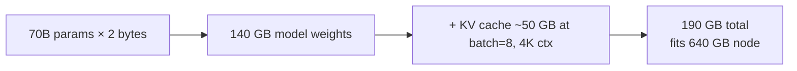

| Dimension | BF16 |
|-----------|------|
| Model memory | 140 GB |
| Accuracy (MMLU) | Baseline (e.g., 82.0%) |
| Throughput | 85 tokens/sec (memory-bandwidth limited) |
| Hardware requirement | 2× A100 80GB minimum |

### Approach B — INT8 (W8A8 Quantization)
Weights and activations quantized to 8-bit integers. NVIDIA's TensorRT-LLM supports W8A8 with calibration.

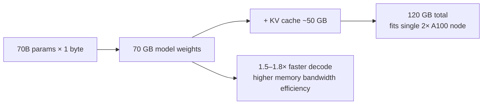

| Dimension | INT8 |
|-----------|------|
| Model memory | 70 GB (50% of BF16) |
| Accuracy drop | 0.2–0.5% MMLU |
| Throughput | 130 tokens/sec |
| Quantization method | LLM.int8() or SmoothQuant |

### Approach C — INT4 (GPTQ / AWQ)
Weights quantized to 4-bit; activations kept in FP16.

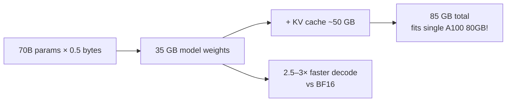

| Dimension | INT4 (GPTQ/AWQ) |
|-----------|----------------|
| Model memory | 35 GB (25% of BF16) |
| Accuracy drop | 0.5–2.0% MMLU (depends on model size) |
| Throughput | 220 tokens/sec |
| Best method | AWQ (Activation-Aware Weight Quantization) |

### Comparison

| Dimension | BF16 | INT8 | INT4 |
|-----------|------|------|------|
| Memory | 140 GB | 70 GB | 35 GB |
| Accuracy loss | 0% | ~0.3% | ~1.0% |
| Throughput gain | 1× | 1.5× | 2.5× |
| Min GPU for 70B | 2× A100 80GB | 1× A100 80GB | 1× A100 80GB (fits!) |
| Best use case | Max accuracy | Balanced | Cost-sensitive / edge |

### Recommended Answer
For the given constraints: **INT8 (SmoothQuant or W8A8)**. Reduces memory from 140 GB to 70 GB, improves throughput from 85 to 130 tokens/sec, and MMLU accuracy drop is <0.5% — within the 1% tolerance. INT4 (AWQ) is viable if cost matters more than accuracy and >1% drop is acceptable.

### What a great answer includes
- [ ] State memory formula: params × bytes_per_param (BF16=2, INT8=1, INT4=0.5)
- [ ] Quantify accuracy impact by precision level with a specific benchmark
- [ ] Distinguish weight-only (W4A16) vs weight+activation (W8A8) quantization
- [ ] Name a real method: GPTQ, AWQ, SmoothQuant, LLM.int8()
- [ ] Address the outlier problem: LLMs have activation outliers that break naive INT8 quantization

### Pitfalls
- ❌ **Ignoring activation outliers:** Transformers have large magnitude activation outliers in ~1% of channels. Naive INT8 quantization of these causes perplexity to spike 10× — SmoothQuant migrates the quantization difficulty to weights, which tolerate it better
- ❌ **Quantizing all layers equally:** Attention layers are more sensitive to quantization than FFN layers — mixed-precision (attention=INT8, FFN=INT4) reduces accuracy loss by 0.3–0.5% vs uniform INT4

### Concept Reference
→ [AI Agents](../../../system-design/ai-and-agents/agent-loop-tool-calling)

---

## Q6: How do you implement prompt caching to reduce latency and cost for repeated context?
**Role:** Senior | **Difficulty:** 🔴 | **Priority:** P2 | **Format:** Quick Answer

> **What the interviewer is testing:** Ability to identify and exploit redundancy in LLM workloads — a key cost optimization for production systems.

### Answer in 60 seconds
- **Problem:** System prompts (instructions, context, few-shot examples) are often 1,000–10,000 tokens long and identical across requests — recomputing KV cache for each request wastes GPU compute
- **Prompt caching:** Pre-compute and store the KV cache for the static prefix (system prompt). Subsequent requests with the same prefix skip prefill for cached tokens — TTFT drops from 500ms to 50ms
- **Anthropic's implementation:** Cache up to 4 prompt "breakpoints"; cached tokens cost 10% of normal input token price (90% reduction)
- **Key requirement:** The cacheable prefix must be the exact same token sequence — any variation (user-injected dynamic content) must come after the cached portion
- **Savings at scale:** A customer support bot with 5,000-token system prompt and 1,000 daily sessions: caching saves ~4.5M tokens/day × $3/1M tokens = $13.50/day → $5,000/year

### Diagram

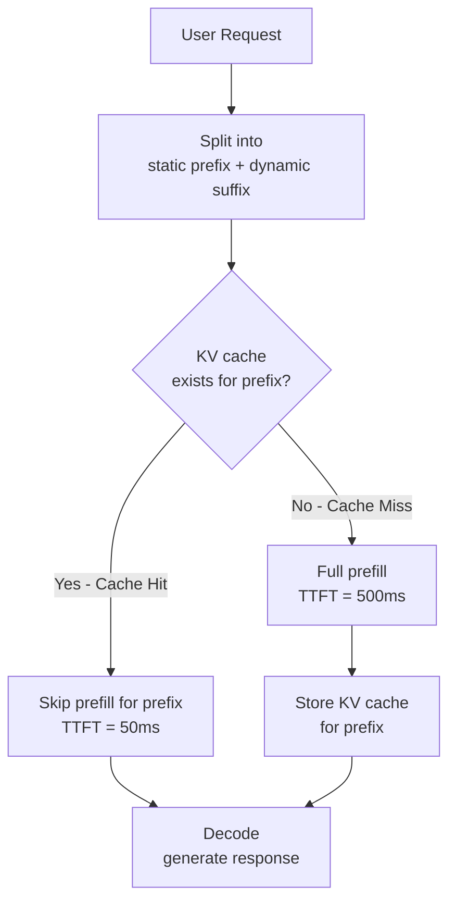

### Pitfalls
- ❌ **Dynamic content before static prefix:** Injecting a timestamp or user name at the beginning of the system prompt breaks cache — always put dynamic content at the end
- ❌ **Ignoring cache eviction:** KV caches are evicted when GPU memory is needed; at high load, cache hit rate can drop to 0% — don't architect around 100% cache hit rate

### Concept Reference
→ [AI Agents](../../../system-design/ai-and-agents/agent-loop-tool-calling)

---

## Q7: How does OpenAI serve GPT-4 at scale?
**Role:** Staff | **Difficulty:** ⚫ | **Priority:** P2 | **Format:** Quick Answer

> **What the interviewer is testing:** Awareness of public information about large-scale LLM serving infrastructure and the ability to reason about design choices.

### Answer in 60 seconds
- **Scale:** GPT-4 Turbo handles millions of requests per day across tens of thousands of concurrent users
- **What is known (from papers + interviews):**
  - Uses a Mixture of Experts (MoE) architecture — not publicly confirmed but widely inferred: only a subset of "expert" feed-forward layers activate per token, reducing compute 4–8× vs a dense model of equivalent parameter count
  - Tensor parallelism across 8 GPUs per inference replica; multiple replicas behind a load balancer
  - Batching: continuous batching (iteration-level scheduling) for high throughput
  - Geographic distribution: inference clusters in US, EU, Asia — requests routed to nearest region for <200ms TTFT
- **Cost efficiency tricks (inferred):**
  - Speculative decoding with a small draft model for common continuations
  - KV cache prefix sharing for the ChatGPT system prompt (identical across millions of sessions)
  - INT8 quantization on FFN layers where accuracy tolerance allows
- **Disclaimer:** Architecture is not fully public — reason from first principles and cite "inferred from public statements"

### Diagram

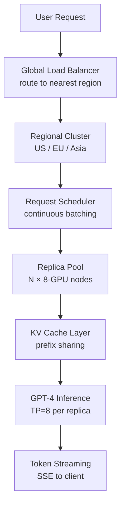

### Pitfalls
- ❌ **Presenting speculation as fact:** When asked about proprietary systems, clearly distinguish "publicly known" from "reasonable inference" — interviewers value intellectual honesty
- ❌ **Ignoring MoE implications:** MoE models have the same inference latency as a smaller dense model but with better quality — the key serving challenge is expert routing, not just model parallelism

### Concept Reference
→ [AI Agents](../../../system-design/ai-and-agents/agent-loop-tool-calling)

---

## Q8: How do you route requests across multiple LLM models based on capability and cost?
**Role:** Staff | **Difficulty:** ⚫ | **Priority:** P2 | **Format:** Deep Dive

> **What the interviewer is testing:** Ability to design an intelligent routing layer that optimizes the cost-quality-latency trade-off across a heterogeneous model fleet.

### Problem Constraints
| Dimension | Value |
|-----------|-------|
| Request rate | 10,000 req/min |
| Models available | GPT-4o ($5/1M tokens), GPT-4o-mini ($0.15/1M tokens), Claude-3-Haiku ($0.25/1M tokens) |
| Quality requirement | >95% of requests must receive "acceptable" response |
| Cost target | Reduce average cost by 60% vs routing all to GPT-4o |
| Latency target | P95 TTFT <800ms |

### Approach A — Complexity-Based Routing
Classify request complexity before routing. Simple requests (factual Q&A, summarization) → small model; complex (reasoning, code generation) → large model.

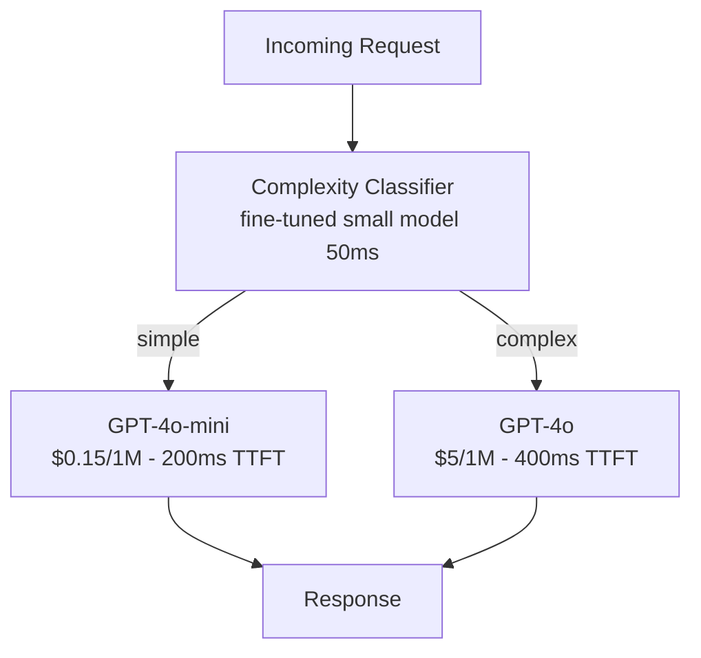

| Dimension | Complexity Routing |
|-----------|-------------------|
| Cost reduction | 55–65% (70% of requests are "simple") |
| Quality risk | Classification errors on ambiguous requests |
| Latency overhead | +50ms for classifier |
| Implementation | Train classifier on labeled good/bad outputs |

### Approach B — Cascading (Try Small, Escalate)
Send all requests to the small model first. If confidence is low (or response triggers a quality check), re-route to the large model.

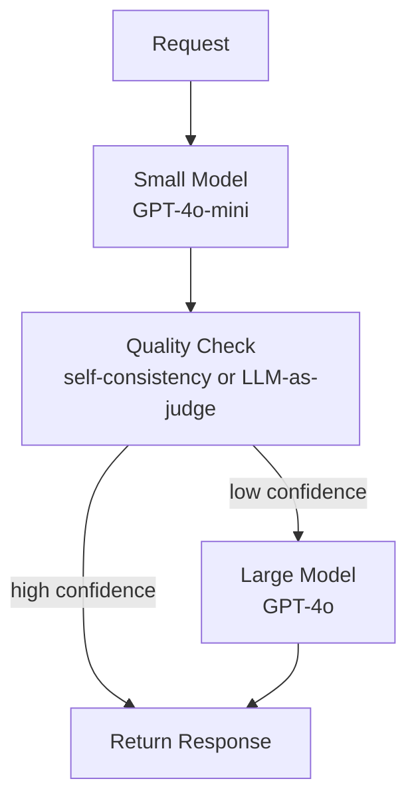

| Dimension | Cascading |
|-----------|-----------|
| Cost reduction | 40–55% (20–30% escalation rate) |
| Quality risk | Low — large model handles uncertainty |
| Latency overhead | +200–500ms when escalating (second call) |
| Implementation | Self-consistency check or LLM-as-judge confidence score |

### Approach C — Semantic Routing with Cached Responses
Hash semantically similar requests to cached responses; only novel requests reach models. Route based on semantic category.

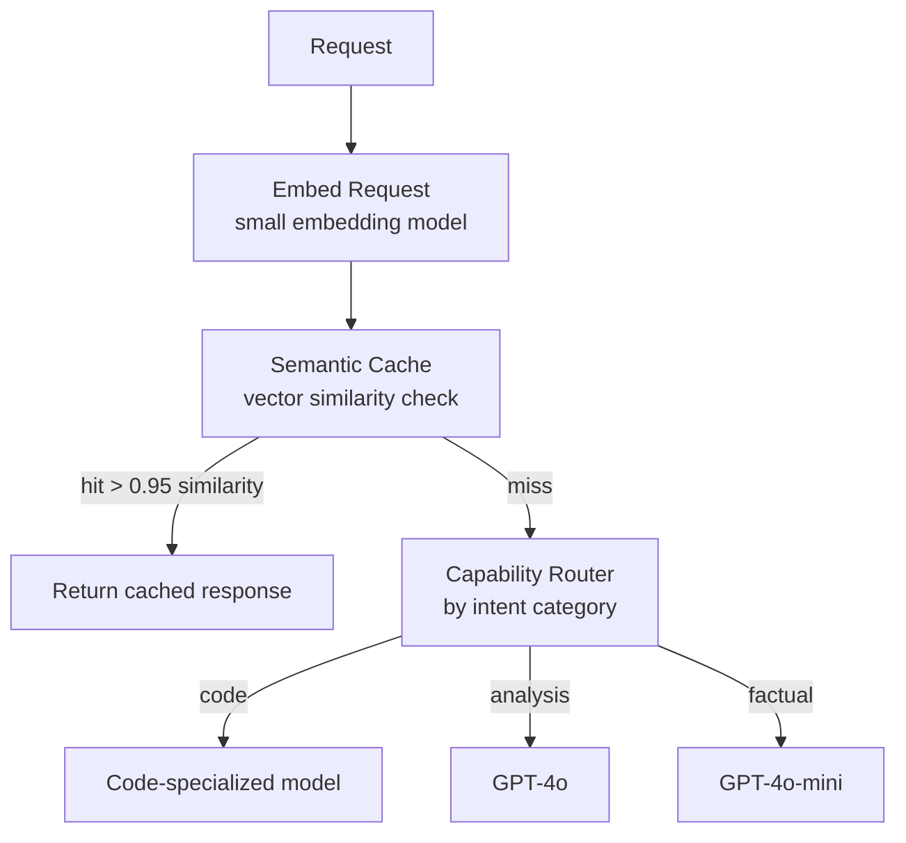

| Dimension | Semantic Routing |
|-----------|-----------------|
| Cost reduction | Up to 80% (cache hit rate 40–60% in enterprise) |
| Quality risk | Stale cached responses |
| Latency overhead | +20ms for embedding + cache lookup |
| Implementation | Redis vector search or Pinecone |

### Recommended Answer
Combine **Approach A + Approach C**: semantic cache for repeated queries (cache hit rate 40–60%) + complexity classifier for novel requests (routes 70% to mini model). Target outcome: 65–70% cost reduction, <1% quality degradation.

### What a great answer includes
- [ ] Name specific cost numbers — GPT-4o is 33× more expensive than GPT-4o-mini per token
- [ ] Address the quality validation problem — how do you know the small model answer is good?
- [ ] Mention LLM-as-judge as a quality check approach
- [ ] Quantify the latency overhead of each routing approach
- [ ] Discuss cache invalidation for semantic cache (TTL or document-change triggered)

### Pitfalls
- ❌ **No fallback for routing failures:** If the classifier is unavailable, the system must default to the capable model — never default to the cheap model when uncertain
- ❌ **Routing based only on input complexity:** Long inputs are not always complex; a 5,000-token document summarization task is simpler than a 50-token math proof request

### Concept Reference
→ [AI Agents](../../../system-design/ai-and-agents/agent-loop-tool-calling)
→ [RAG Architecture](../../../system-design/ai-and-agents/rag-retrieval-augmented-generation)

---

## Q9: What is speculative decoding and how does it achieve 2-3x faster inference?
**Role:** Staff | **Difficulty:** ⚫ | **Priority:** P3 | **Format:** Quick Answer

> **What the interviewer is testing:** Awareness of a critical inference optimization that exploits GPU compute headroom during memory-bandwidth-bound decode.

### Answer in 60 seconds
- **Problem:** Autoregressive decode is memory-bandwidth bound — the GPU spends most of its time loading 140 GB of model weights for each token, but compute units are mostly idle (low arithmetic intensity)
- **Insight:** The GPU can run a small draft model (7B) AND verify a large target model (70B) in nearly the same time as running the target model alone (both bottlenecked by memory bandwidth, not compute)
- **Algorithm:**
  1. Draft model generates K candidate tokens quickly (K=5–8)
  2. Target model evaluates all K candidates in one parallel forward pass
  3. Accept/reject each candidate token based on probability ratio
  4. Roll back to first rejected token and restart
- **Speedup:** 2–3× throughput on tasks where draft model is accurate (code, structured output). 1.1× on highly unpredictable text
- **Example:** Llama-3 70B with Llama-3 8B draft model: 2.5× speedup on code completion, 1.3× on open-ended conversation

### Diagram

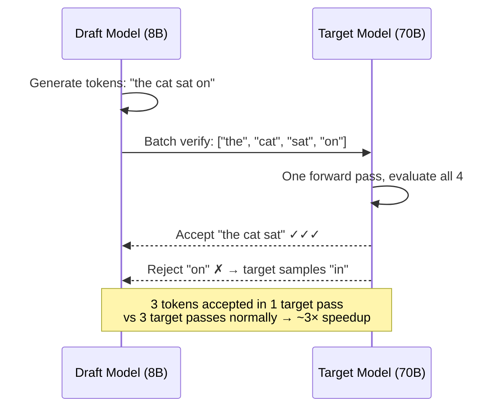

### Pitfalls
- ❌ **Using speculative decoding for short outputs:** Setup overhead (~50ms for draft initialization) makes it slower than standard decode for outputs <10 tokens
- ❌ **Mismatched draft/target tokenizers:** Draft and target models must use the same tokenizer — token IDs must correspond exactly for the rejection sampling to be valid

### Concept Reference
→ [AI Agents](../../../system-design/ai-and-agents/agent-loop-tool-calling)

---

## Q10: Design an LLM serving system for 100K concurrent users
**Role:** Senior | **Difficulty:** 🔴 | **Priority:** P1 | **Format:** Scenario

**Real Company:** OpenAI / Anthropic / Cohere

### The Brief
> "Design an LLM serving system for 100,000 concurrent users. Each user sends ~3 messages per session. Assume Llama-3 70B. Target: TTFT <500ms, TPOT <30ms, 99% availability."

### Clarifying Questions
1. What is the expected tokens per message (prompt + output)? (e.g., 500 prompt + 300 output = 800 tokens/message)
2. Are sessions stateful (multi-turn context maintained server-side) or stateless?
3. What is the burst factor — 100K concurrent or 100K peak DAU?
4. What is acceptable cost per request? (Drives quantization and hardware decisions)
5. Is streaming response required (tokens as generated) or batch (full response at once)?

### Back-of-Envelope Estimation
| Metric | Calculation | Result |
|--------|-------------|--------|
| Peak concurrent sessions | 100K users × assume 10% active simultaneously | 10,000 active sessions |
| Messages per second | 10,000 sessions × 3 msg/session / avg 60s session | ~500 req/sec |
| Tokens per second (input) | 500 req/sec × 500 prompt tokens | 250,000 input tokens/sec |
| Tokens per second (output) | 500 req/sec × 300 output tokens | 150,000 output tokens/sec |
| GPU throughput (A100, Llama3-70B INT8) | 1 A100 = ~1,500 output tokens/sec with continuous batching | 100 A100s needed |
| Cost at $2/GPU-hour | 100 A100s × $2/hr | $200/hour ($4,800/day) |

### High-Level Architecture

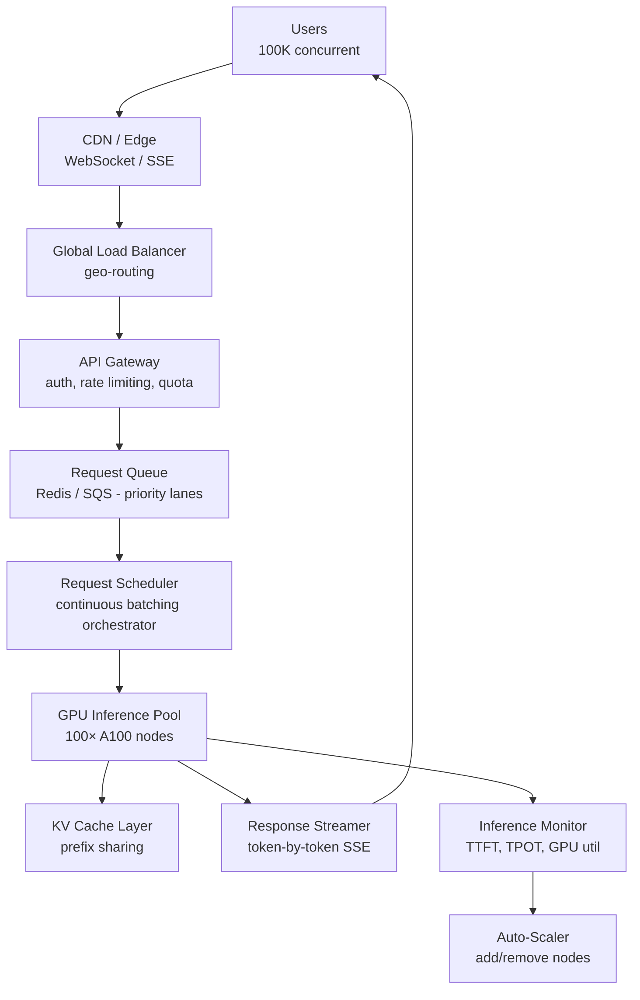

### Trade-off Decisions
| Decision | Option A | Option B | Chosen | Why |
|----------|----------|----------|--------|-----|
| Quantization | BF16 (140 GB/node) | INT8 (70 GB/node) | INT8 | 2× more requests per GPU, <0.3% quality loss, throughput 1.5× higher |
| Batching strategy | Static batch=32 | Continuous batching | Continuous | 2–3× throughput improvement, eliminates head-of-line blocking |
| KV cache management | Fixed allocation | PagedAttention | PagedAttention | Eliminates fragmentation, enables 2× larger effective batch size |
| Context handling | Full context per request | Prompt caching for system prompt | Prompt caching | System prompt (2K tokens) is identical across sessions — saves 40% of prefill compute |
| Autoscaling trigger | CPU utilization | GPU queue depth | Queue depth | CPU always low; queue depth >10 indicates GPU saturation — more accurate signal |

### Failure Modes
| Failure | Impact | Mitigation |
|---------|--------|------------|
| GPU node failure (1 of 100) | 1% capacity loss, queue builds up | Health checks every 5s; failed node removed from pool in <30s; autoscaler adds replacement |
| KV cache eviction storm | 10× latency spike for evicted requests — recompute from scratch | PagedAttention prevents fragmentation; alert when cache hit rate <80%; shed load before eviction |
| Token stream dropped mid-response | User sees incomplete response | Client-side reconnect with sequence number; server buffers last 100 tokens for 30s |
| Burst beyond 100 A100s capacity | Queue builds, TTFT >2s | Priority queue: premium users served first; free tier rate limited to 10 req/min |
| Model weight loading on new node | Cold start takes 8–12 min (download 70 GB weights) | Pre-warm spare nodes; keep 10% warm but idle; use model weight caching on NVMe |

### Concept References
→ [AI Agents](../../../system-design/ai-and-agents/agent-loop-tool-calling)
→ [Observability](../../../system-design/scale-and-reliability/observability)
→ [Kafka & Messaging](../../../system-design/messaging-and-streaming/kafka-rabbitmq)
