# ML Pipeline Design

10 questions covering data ingestion, feature engineering, distributed training, and pipeline operations.

---

## Q1: What are the stages of an ML pipeline from data to production?
**Role:** Mid / ML Engineer | **Difficulty:** 🟡 | **Priority:** P0 | **Format:** Quick Answer

> **What the interviewer is testing:** Whether you can map the end-to-end ML lifecycle and articulate what happens at each stage.

### Answer in 60 seconds
- **Data Ingestion:** Pull raw data from sources (S3, databases, Kafka) — typical batch size 1M–100M rows
- **Data Validation:** Schema checks, null checks, distribution drift alerts — run before every training job
- **Feature Engineering:** Transform raw signals into ML-consumable inputs — 60–80% of total ML effort
- **Model Training:** Fit model on labeled data — from 10 min (small models) to 72 hours (large transformers)
- **Model Evaluation:** Offline metrics (AUC, F1, RMSE) + shadow scoring on live traffic before promotion
- **Model Serving:** Deploy to inference endpoint — online (<100ms) or batch (minutes to hours)
- **Monitoring:** Watch data drift, prediction drift, business metrics — alert when offline–online gap exceeds 5%

### Diagram

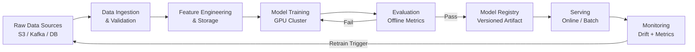

### Pitfalls
- ❌ **Skipping data validation:** Silent bad data corrupts training; model trains fine but degrades in production
- ❌ **No model registry:** Without versioned artifacts, you cannot roll back a bad model in under 5 minutes
- ❌ **Training–serving skew:** Computing features differently at training vs inference time causes 10–30% accuracy drops

### Concept Reference

---

## Q2: What is feature engineering and why does it matter more than model choice?
**Role:** Mid | **Difficulty:** 🟡 | **Priority:** P1 | **Format:** Quick Answer

> **What the interviewer is testing:** Understanding that data representation quality dominates model architecture in most real-world ML problems.

### Answer in 60 seconds
- **Definition:** Feature engineering transforms raw data into numerical representations that capture signal for the model
- **Why it dominates:** A linear model on great features beats a deep network on raw data 70% of the time in industry settings
- **Categories:**
  - *Numerical:* Log transforms, z-score normalization, binning (e.g., age → age bucket)
  - *Categorical:* One-hot encoding, target encoding, embeddings
  - *Temporal:* Rolling averages (7-day, 30-day), time-since-event, hour-of-day
  - *Cross features:* Combine two signals (user_category × item_category) — captures interactions models miss
- **Impact example:** LinkedIn reported +15% CTR by adding 3 cross features to their feed ranker vs upgrading model architecture

### Diagram

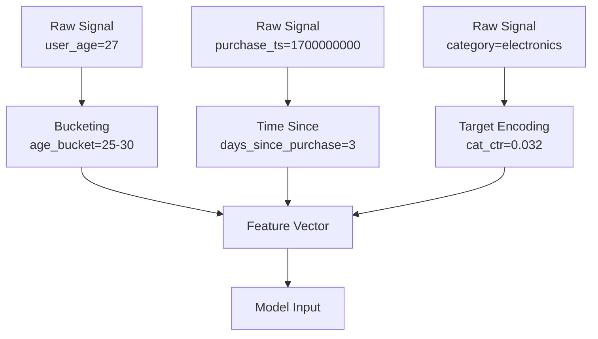

### Pitfalls
- ❌ **Data leakage:** Including future information in features (e.g., using post-event labels as inputs) — causes inflated offline metrics that collapse in production
- ❌ **Skipping normalization for tree models:** Decision trees handle raw scales; neural networks diverge without normalization
- ❌ **High-cardinality categoricals without encoding:** 1M user IDs as one-hot = 1M-dimensional sparse vector — use embeddings or hashing

### Concept Reference

---

## Q3: How do you parallelize model training across multiple GPUs?
**Role:** Senior | **Difficulty:** 🔴 | **Priority:** P1 | **Format:** Deep Dive

> **What the interviewer is testing:** Understanding of distributed training strategies — data parallelism, model parallelism, and their trade-offs at scale.

### Problem Constraints
| Dimension | Value |
|-----------|-------|
| Model size | 70B parameters (140 GB in BF16) |
| Dataset size | 500B tokens |
| Target training time | <14 days |
| GPU cluster | 512× A100 80GB |
| Network bandwidth | 800 Gbps NVLink intra-node, 400 Gbps InfiniBand inter-node |

### Approach A — Data Parallelism (DDP)
Each GPU holds a full model copy. Batch is sharded across GPUs. Gradients are all-reduced (averaged) after each backward pass.

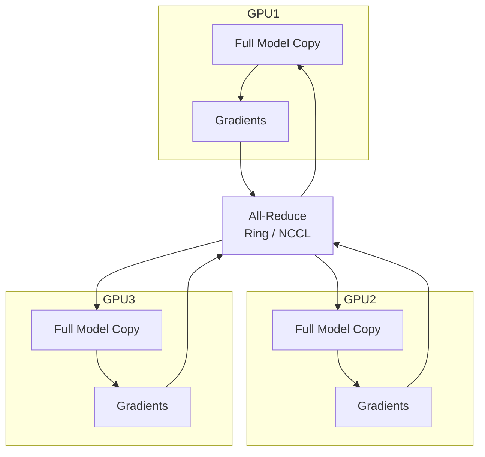

| Dimension | Data Parallelism |
|-----------|-----------------|
| Model fits single GPU? | Required (yes) |
| Scaling efficiency | 90%+ up to ~256 GPUs |
| Communication cost | O(model_params) per step |
| Implementation complexity | Low (PyTorch DDP built-in) |

### Approach B — Tensor Parallelism
Layer weight matrices are sharded across GPUs. Each GPU computes a partition of every matrix multiplication. Requires NVLink (<1μs latency).

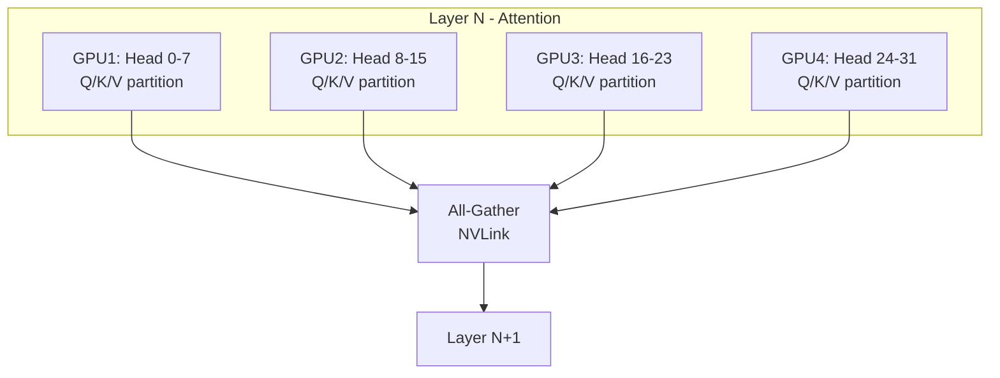

| Dimension | Tensor Parallelism |
|-----------|-------------------|
| Model fits single GPU? | Not required |
| Scaling efficiency | 70–85% (communication heavy) |
| Communication cost | 2× all-reduce per layer |
| Implementation complexity | High (custom CUDA kernels) |

### Approach C — Pipeline Parallelism
Model layers are split into stages, each stage assigned to a GPU. Micro-batches flow through the pipeline.

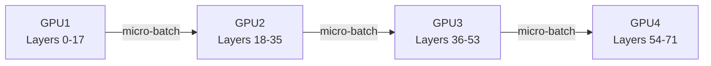

| Dimension | Pipeline Parallelism |
|-----------|---------------------|
| Model fits single GPU? | Not required |
| Scaling efficiency | 50–75% (pipeline bubble ~25%) |
| Communication cost | O(micro-batch × hidden_dim) per stage boundary |
| Implementation complexity | Medium |

### Comparison

| Dimension | Data Parallel | Tensor Parallel | Pipeline Parallel |
|-----------|--------------|-----------------|-------------------|
| Fits 70B on single GPU | No | No | No |
| Best for | <10B models | Intra-node scaling | Inter-node scaling |
| Typical speedup per 2× GPUs | 1.8× | 1.6× | 1.5× |
| Network requirement | InfiniBand | NVLink mandatory | InfiniBand sufficient |

### Recommended Answer
For 70B parameter training: combine **Tensor Parallelism** (TP=8, intra-node NVLink) + **Pipeline Parallelism** (PP=4, inter-node InfiniBand) + **Data Parallelism** (DP=16). This 3D parallelism (used by Megatron-LM and DeepSpeed) achieves 45–55% MFU (model flops utilization) on 512× A100s.

### What a great answer includes
- [ ] Distinguish data, tensor, and pipeline parallelism correctly
- [ ] State that tensor parallelism requires NVLink (<1μs latency)
- [ ] Name the pipeline bubble problem (~25% GPU idle time)
- [ ] Mention 3D parallelism for very large models (Megatron-LM pattern)
- [ ] Give a concrete MFU number (30–60% is realistic; 100% is theoretical max)

### Pitfalls
- ❌ **Treating all-reduce as free:** At 70B params, all-reduce of gradients is ~140 GB — takes 0.35 seconds on 400 Gbps InfiniBand, dominating compute time at small batch sizes
- ❌ **Ignoring gradient checkpointing:** Without it, backward pass memory is 3× forward; a 70B model needs ~420 GB activation memory — impossible on 80 GB GPUs
- ❌ **Pipeline bubble underestimated:** With 4 pipeline stages, ~25% of GPU time is idle during pipeline fill/drain

### Concept Reference

---

## Q4: What is data versioning and why is DVC (Data Version Control) needed?
**Role:** Senior | **Difficulty:** 🔴 | **Priority:** P1 | **Format:** Quick Answer

> **What the interviewer is testing:** Understanding that ML reproducibility requires versioning data, not just code.

### Answer in 60 seconds
- **Data versioning:** Snapshot the exact dataset used for each experiment so results are reproducible
- **Why code versioning (Git) is insufficient:** Datasets are gigabytes to terabytes — Git LFS breaks above ~2 GB; S3 paths change silently
- **DVC approach:** DVC stores a small `.dvc` pointer file in Git; actual data lives in S3/GCS. Commit hash → data hash → reproducible experiment
- **Key capabilities:**
  - `dvc repro` reruns pipeline from any commit (data + code pinned)
  - Tracks lineage: raw → processed → features → train split
  - Enables data diff: "what changed between v1.2 and v1.3 of the training set?"
- **Real impact:** Without data versioning, a 5% model regression took Airbnb 3 weeks to root-cause (silent feature pipeline change)

### Diagram

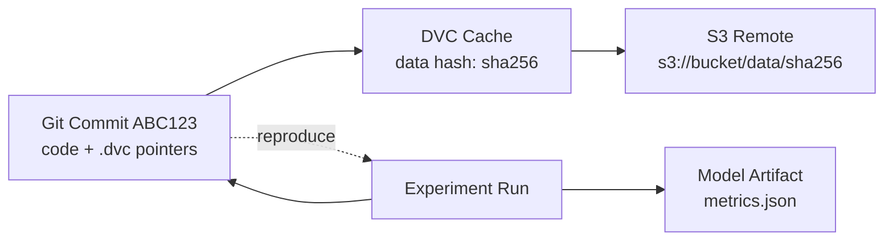

### Pitfalls
- ❌ **Relying on S3 path as version:** S3 paths are mutable — the same path can hold different data after a rerun
- ❌ **Versioning only final training set:** Feature engineering scripts may change; version raw data AND each pipeline stage output
- ❌ **No data lineage:** Cannot answer "which experiments used the corrupted batch from 2025-03-01" without lineage tracking

### Concept Reference

---

## Q5: How do you design a training pipeline that scales from 1M to 100M examples?
**Role:** Senior | **Difficulty:** 🔴 | **Priority:** P2 | **Format:** Deep Dive

> **What the interviewer is testing:** Ability to design elastic, data-efficient training infrastructure that grows with data volume.

### Problem Constraints
| Dimension | Value |
|-----------|-------|
| Scale range | 1M → 100M training examples |
| Feature count | 500 features per example |
| Training frequency | Daily retraining |
| Target training time | <4 hours at any scale |
| Storage | Parquet on S3 |

### Approach A — Single-Machine Pipeline
All data loaded into memory on a large instance (r7i.48xlarge: 1.5 TB RAM). Works up to ~20M rows × 500 features (≈40 GB uncompressed).

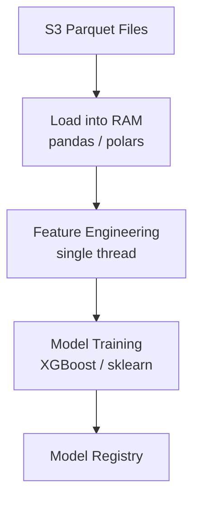

| Dimension | Single Machine |
|-----------|---------------|
| Max scale | ~20M rows (40 GB) |
| Training time at 1M | 15 min |
| Training time at 20M | 3.5 hours |
| Cost per run | $12 (r7i.48xlarge, 4h) |

### Approach B — Distributed Spark + Distributed Training
Spark for feature engineering across 10–100 nodes. Distributed training (Horovod / Ray Train) across GPU cluster.

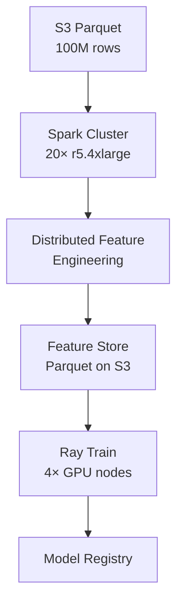

| Dimension | Spark + Distributed |
|-----------|-------------------|
| Max scale | 1B+ rows |
| Training time at 100M | 2.5 hours |
| Cost per run | $85 (Spark 20 nodes + 4 GPUs, 3h) |
| Operational complexity | High (Spark tuning, partitioning) |

### Approach C — Streaming Micro-Batch
Process data in micro-batches using online learning (e.g., Vowpal Wabbit, river). Model updated incrementally; never loads full dataset.

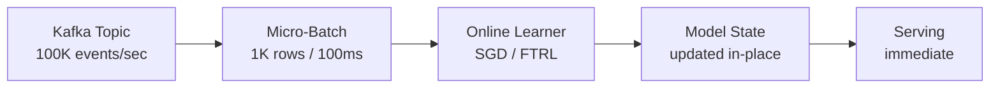

| Dimension | Online Learning |
|-----------|----------------|
| Data freshness | <1 second |
| Scale ceiling | Unlimited (streaming) |
| Accuracy vs batch | 5–15% lower (local minima) |
| Use case fit | Real-time fraud, CTR |

### Recommended Answer
Design for **Approach B** with progressive scaling:
- 1M examples: single machine (Polars + XGBoost), 15 min, $2/run
- 10M examples: Spark feature engineering, single-GPU training, 45 min, $18/run
- 100M examples: full Spark + distributed training, 2.5 hours, $85/run

Use Parquet with column pruning — reading 500 features from 100M rows requires ~50 GB; Parquet column pruning reduces I/O to only needed features (often 10–20 features → 2–5 GB).

### What a great answer includes
- [ ] State specific memory calculation: 100M × 500 features × 4 bytes = 200 GB — doesn't fit single machine
- [ ] Mention Parquet column pruning as a concrete I/O optimization
- [ ] Address the bottleneck shift: I/O bound at 1M, compute bound at 100M
- [ ] Name a distributed training framework (Horovod, Ray Train, PyTorch DDP)
- [ ] Discuss cost — Spark + GPU cluster is ~$85/run vs $2 single machine

### Pitfalls
- ❌ **No data sharding strategy:** Without partition key alignment between Spark and training data, shuffle-intensive joins kill Spark performance
- ❌ **Loading all features:** Reading all 500 features when model only uses top 20 wastes 25× I/O bandwidth
- ❌ **Fixed cluster size:** Spot instances for Spark training can cut cost 60–70%; use checkpointing to tolerate preemptions

### Concept Reference

---

## Q6: How do you monitor for data quality issues before they corrupt model training?
**Role:** Senior | **Difficulty:** 🔴 | **Priority:** P2 | **Format:** Quick Answer

> **What the interviewer is testing:** Proactive data validation discipline — catching bad data before it enters the pipeline.

### Answer in 60 seconds
- **Schema validation:** Assert column types, required fields, value ranges on every ingestion — catches 80% of issues immediately
- **Statistical profiling:** Compare each feature's mean/stddev/null rate against a reference window (last 7 days). Alert if >3σ deviation
- **Distribution drift:** Use Population Stability Index (PSI) — PSI < 0.1 is stable; PSI > 0.2 triggers retraining hold
- **Label quality:** Check label rate (e.g., fraud rate) — if fraud rate drops from 0.5% to 0.01%, labels may be missing, not fraud decreasing
- **Row count anomaly:** If today's batch has 40% fewer rows than 7-day average, abort training and page on-call
- **Tooling:** Great Expectations (open source) defines 100+ data quality checks declaratively

### Diagram

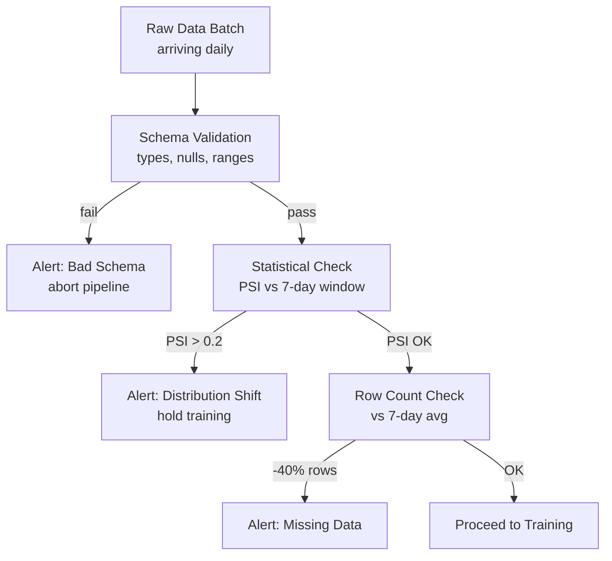

### Pitfalls
- ❌ **Monitoring only final model metrics:** By the time AUC drops 5%, the model has been in production for days serving degraded predictions
- ❌ **Static thresholds on dynamic data:** A feature that naturally spikes on weekends will alert daily — use rolling baselines, not fixed thresholds
- ❌ **Ignoring upstream data SLAs:** If the data warehouse team changes a column name, the pipeline silently drops the feature (null fill)

### Concept Reference

---

## Q7: How does Uber's Michelangelo ML platform manage the full ML lifecycle?
**Role:** Staff | **Difficulty:** ⚫ | **Priority:** P2 | **Format:** Quick Answer

> **What the interviewer is testing:** Awareness of production ML platform design from a company that built one of the first large-scale internal ML platforms.

### Answer in 60 seconds
- **Scope:** Michelangelo manages 200+ models serving 1M+ predictions/sec across Uber's products (ETA, surge pricing, fraud, recommendations)
- **Feature Store (Palette):** Centralized store with 10K+ features shared across teams. Online (Redis, <5ms) + offline (Hive/HDFS) with point-in-time correct historical retrieval
- **Training:** Distributed Spark for feature computation + TensorFlow/XGBoost for model training. Jobs defined as DAGs, scheduled via Airflow
- **Model Registry:** Every model is versioned with: training data hash, hyperparameters, evaluation metrics, owner. Rollback = switch registry pointer
- **Serving:** Online serving cluster (Java service) and offline batch scoring. Traffic splitting for A/B tests — 1% canary → 10% → 100%
- **Monitoring:** Prediction distribution tracking, feature drift alerts, business metric correlation — any model can be halted in <2 minutes

### Diagram

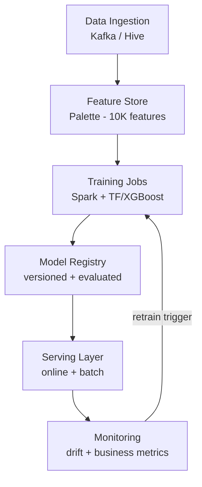

### Pitfalls
- ❌ **Building Michelangelo too early:** Uber had 200+ models before building the platform; small teams spending months on platform instead of models is premature optimization
- ❌ **Separate online and offline feature pipelines:** Training uses Hive; inference uses Redis. If they diverge, training–serving skew corrupts all models using that feature
- ❌ **No feature ownership:** When 10K features exist, unclear ownership means deprecated/broken features stay live and degrade models silently

### Concept Reference

---

## Q8: How do you design a pipeline that supports both online and offline feature computation?
**Role:** Staff | **Difficulty:** ⚫ | **Priority:** P2 | **Format:** Deep Dive

> **What the interviewer is testing:** Ability to design a dual-path feature system that eliminates training–serving skew while meeting latency requirements.

### Problem Constraints
| Dimension | Value |
|-----------|-------|
| Online latency | <10ms feature retrieval at inference |
| Offline freshness | New features available within 24 hours of event |
| Historical backfill | 2 years of data for training |
| Feature count | 1,000 features across 50 teams |
| Event rate | 500K events/second |

### Approach A — Dual Pipeline (Lambda Architecture)
Separate batch path (Spark → Hive) for training and streaming path (Kafka → Redis) for serving. Shared feature definitions in a central registry but **separate implementations**.

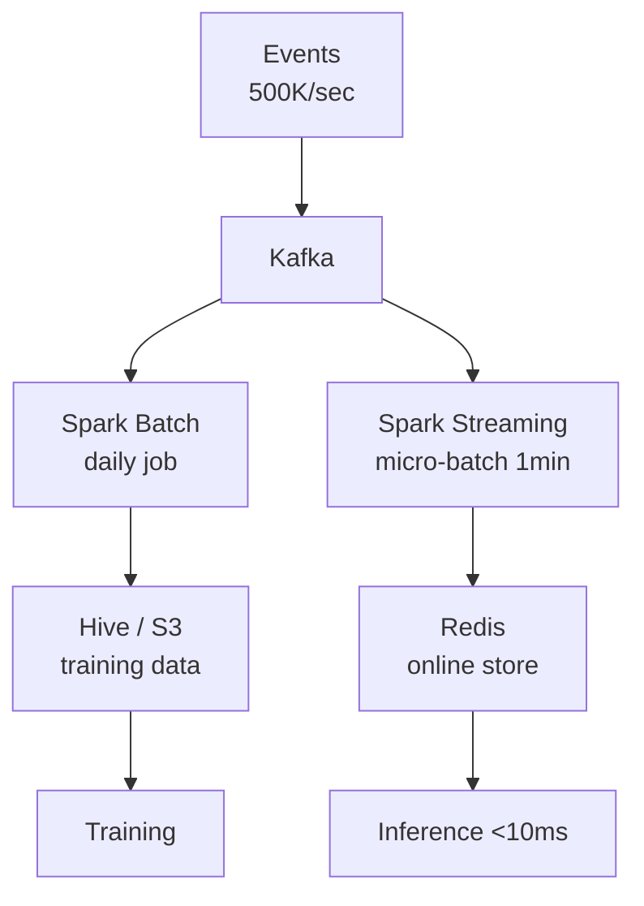

| Dimension | Dual Pipeline |
|-----------|--------------|
| Training–serving skew risk | High — two code paths can diverge |
| Online latency | <10ms (Redis) |
| Backfill support | Yes (Spark historical) |
| Operational complexity | High (maintain two pipelines) |

### Approach B — Unified Feature Definition (Kappa-Style)
Single feature transformation logic (e.g., Flink) runs in both streaming (for serving) and batch-replay mode (for training). One code path eliminates skew.

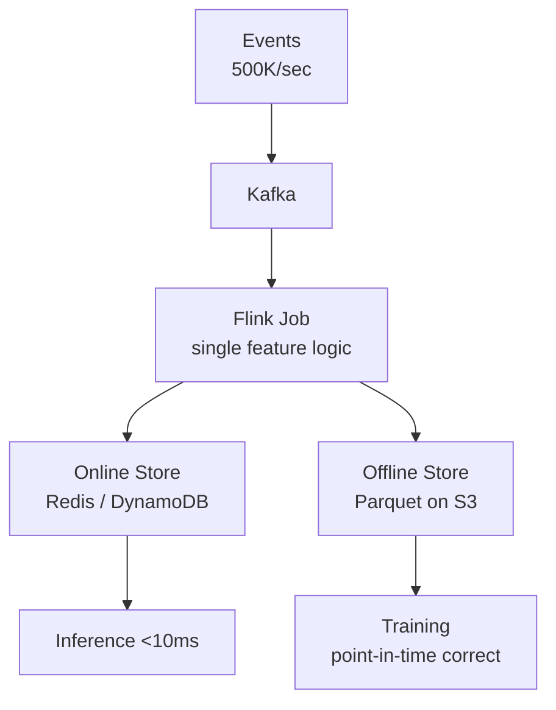

| Dimension | Unified (Kappa) |
|-----------|----------------|
| Training–serving skew risk | Low — single code path |
| Online latency | <10ms (Redis) |
| Backfill support | Replay Kafka (7-day retention) or replay from S3 |
| Operational complexity | Medium (Flink cluster) |

### Approach C — Pre-computed Feature Store (Feast / Tecton)
Use a managed feature store that handles dual-store complexity. Define feature in Python; platform handles online/offline materialization.

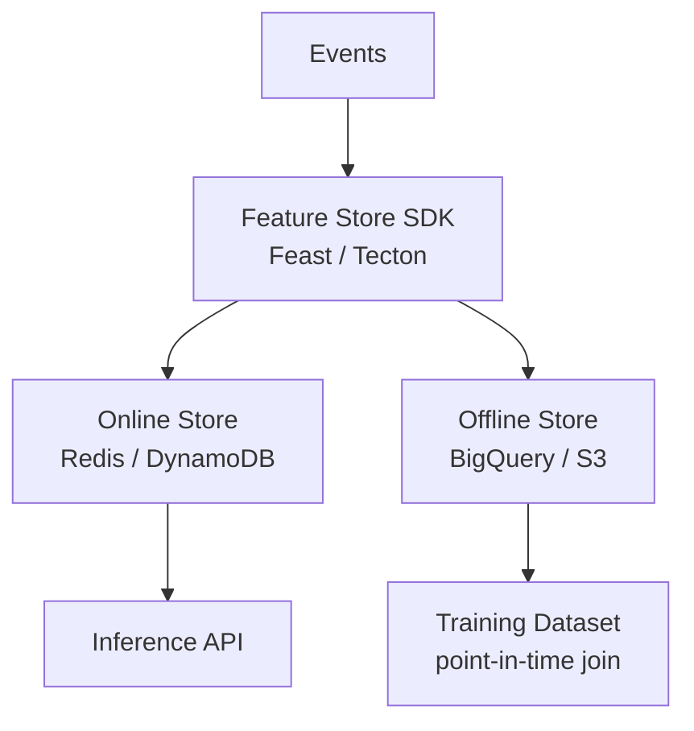

| Dimension | Managed Feature Store |
|-----------|----------------------|
| Training–serving skew risk | Very low (platform guarantee) |
| Online latency | <5ms (SLA) |
| Backfill support | Built-in |
| Operational complexity | Low (managed service) |

### Recommended Answer
**Approach C** for teams without dedicated ML infra engineers. **Approach B** for teams that need full control and have Flink expertise. Never **Approach A** — two separate implementations of the same logic will inevitably diverge within 6 months as engineers modify one path without updating the other.

### What a great answer includes
- [ ] Name "training–serving skew" as the central risk
- [ ] Distinguish online store (low-latency, Redis) from offline store (historical, Parquet)
- [ ] Explain point-in-time correct joins for training data
- [ ] State latency target: online feature retrieval <10ms to fit within 50ms overall SLO
- [ ] Mention backfill requirement for historical training data

### Pitfalls
- ❌ **Point-in-time incorrect training data:** Joining features at query time using current feature values (not feature values at the time of the training event) is the #1 cause of offline–online metric gaps
- ❌ **Redis for offline training:** Iterating over Redis for 100M training examples is 10× slower than reading Parquet from S3
- ❌ **No TTL on online features:** Stale features in Redis (written once, never updated) silently serve 6-month-old values

### Concept Reference

---

## Q9: What is MLOps and how does it differ from DevOps?
**Role:** Staff | **Difficulty:** ⚫ | **Priority:** P3 | **Format:** Quick Answer

> **What the interviewer is testing:** Understanding that ML systems have unique operational properties — data dependencies, model drift, and non-deterministic failures — that require extensions beyond standard DevOps.

### Answer in 60 seconds
- **DevOps:** CI/CD for code artifacts — build, test, deploy, monitor. Fails are deterministic (crash, exception)
- **MLOps:** CI/CD for code + data + models — three versioned artifacts must stay in sync. Failures are probabilistic (model degrades silently)
- **Key differences:**

| Dimension | DevOps | MLOps |
|-----------|--------|-------|
| Artifact | Code binary | Code + Data + Model |
| Test signal | Unit/integration tests | Offline metrics + shadow scoring |
| Failure mode | Crash / 5xx | Silent accuracy degradation |
| Rollback | Previous code version | Previous model + previous features |
| Monitoring | Latency, error rate | Prediction drift, feature drift, business KPI |
| Trigger for redeploy | Code commit | Model degradation OR new data |

- **MLOps maturity levels:** Level 0 = manual training + manual deploy; Level 1 = automated training pipeline; Level 2 = fully automated CI/CD including data validation → retrain → shadow → promote

### Diagram

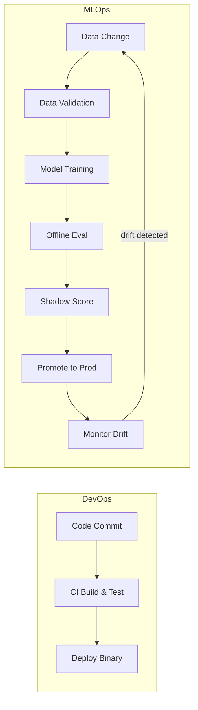

### Pitfalls
- ❌ **Treating model deployment like code deployment:** A code rollback is instant; a model rollback also requires rolling back feature transformations that the old model was trained on
- ❌ **No continuous training:** A model trained once in 2023 serving in 2025 will drift as user behavior changes — reported as -20% to -40% accuracy loss over 12 months without retraining
- ❌ **Shared test environments:** ML models trained in staging on synthetic data perform differently in production — always shadow score on live traffic

### Concept Reference

---

## Q10: Design an ML pipeline for a fraud detection model
**Role:** Senior | **Difficulty:** 🔴 | **Priority:** P1 | **Format:** Scenario

**Real Company:** Stripe / PayPal

### The Brief
> "We process 500K payment transactions per day. Our current rule-based fraud system catches 60% of fraud but has a 15% false-positive rate (legitimate transactions blocked). Design an ML-based fraud detection pipeline — from data ingestion to model monitoring."

### Clarifying Questions
1. What is the acceptable latency for a fraud decision? (real-time <100ms per transaction vs async batch?)
2. What labels do we have — confirmed fraud reports, chargebacks, or both?
3. What is the cost asymmetry — false negative (missed fraud) vs false positive (blocked customer)?
4. Do we handle card-not-present (CNP) fraud, account takeover (ATO), or both?
5. Is there regulatory requirement for model explainability (GDPR, FCRA)?

### Back-of-Envelope Estimation
| Metric | Calculation | Result |
|--------|-------------|--------|
| Transactions/day | 500K | 500,000 |
| Fraud rate | 0.5% typical | 2,500 fraudulent/day |
| Features per transaction | 200 (user, merchant, device, history) | 200 |
| Training data needed | 12 months | ~180M transactions |
| Feature store size | 180M × 200 × 4 bytes | ~144 GB |
| Inference latency budget | 100ms total — feature retrieval 10ms, model 15ms, overhead 75ms | 25ms for ML |

### High-Level Architecture

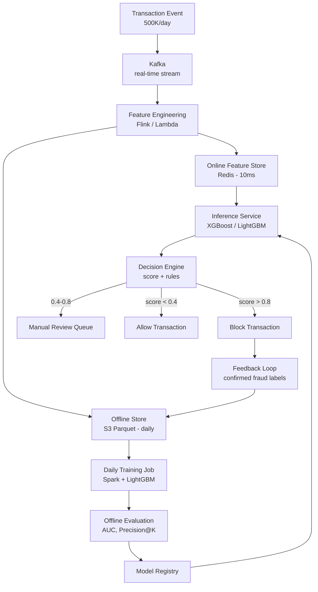

### Trade-off Decisions
| Decision | Option A | Option B | Chosen | Why |
|----------|----------|----------|--------|-----|
| Model type | Deep learning | Gradient boosting (LightGBM) | LightGBM | <15ms inference, explainable, 5% accuracy gap vs DL not worth 10× latency |
| Inference mode | Synchronous real-time | Async with risk score cache | Synchronous | Fraud decision must be in-transaction — cached scores are 30 min stale |
| Labeling strategy | Chargebacks only | Chargebacks + rule-based confirmed | Combined | Chargeback labels arrive 7–60 days late; rule-based confirmed fraud labels arrive <1 hour |
| Training frequency | Daily batch | Continuous online learning | Daily batch | Online learning for fraud has 5–15% accuracy loss; daily batch with same-day labels is sufficient |
| Threshold | Fixed 0.8 | Dynamic per merchant risk tier | Dynamic | High-risk merchants (new, foreign) warrant lower threshold (0.6); established merchants use 0.85 |

### Failure Modes
| Failure | Impact | Mitigation |
|---------|--------|------------|
| Feature store unavailable (Redis down) | Model falls back to rule-based system | Circuit breaker with rule fallback; Redis sentinel for HA |
| Label delay (chargebacks take 60 days) | Model trained on incomplete labels — underestimates fraud | Use proxy labels (strong rules + disputes) for recent data; weight recent data less |
| Model score distribution shift | Model suddenly scores all transactions 0.1–0.2 (miss all fraud) | Alert on score distribution mean/variance daily; automated rollback if mean shifts >20% |
| Training data poisoning | Fraudsters deliberately trigger false positives to exhaust manual review queue | Monitor false-positive rate trends; add diversity constraints to training sampling |
| Cold start for new merchants | No transaction history → features are null → model defaults to allow | Merchant risk-tier assignment (new = high risk) as explicit feature |

