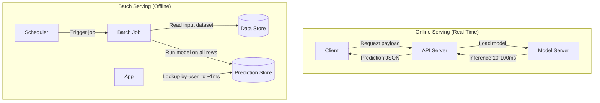
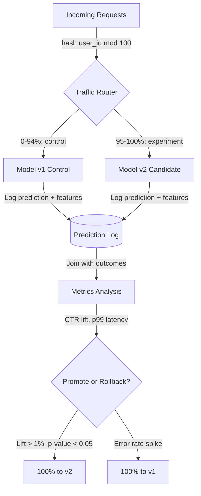
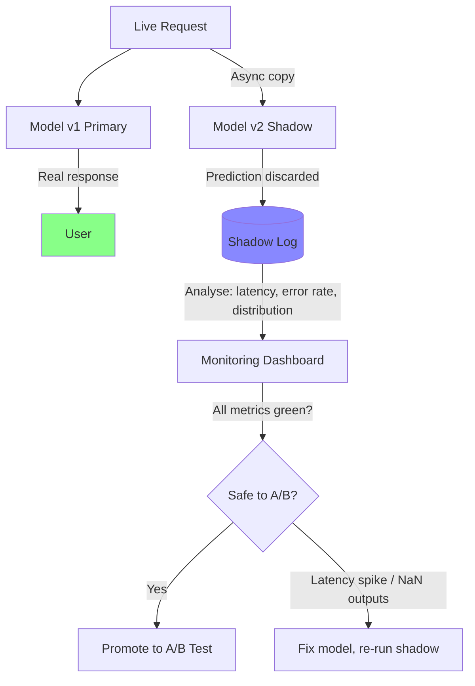
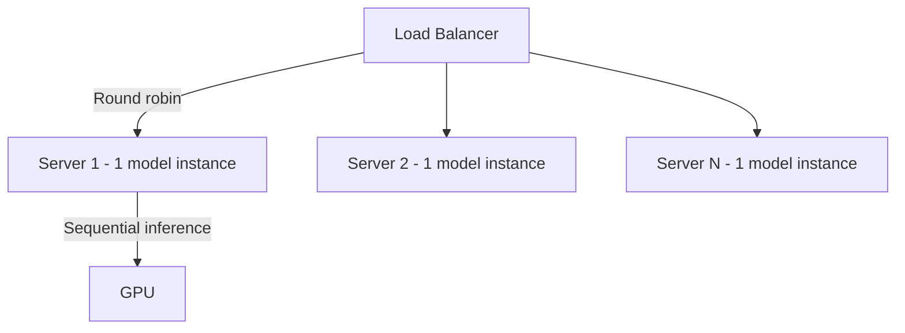
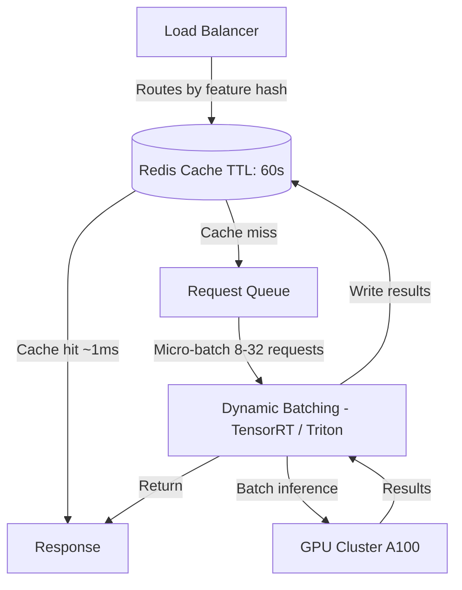
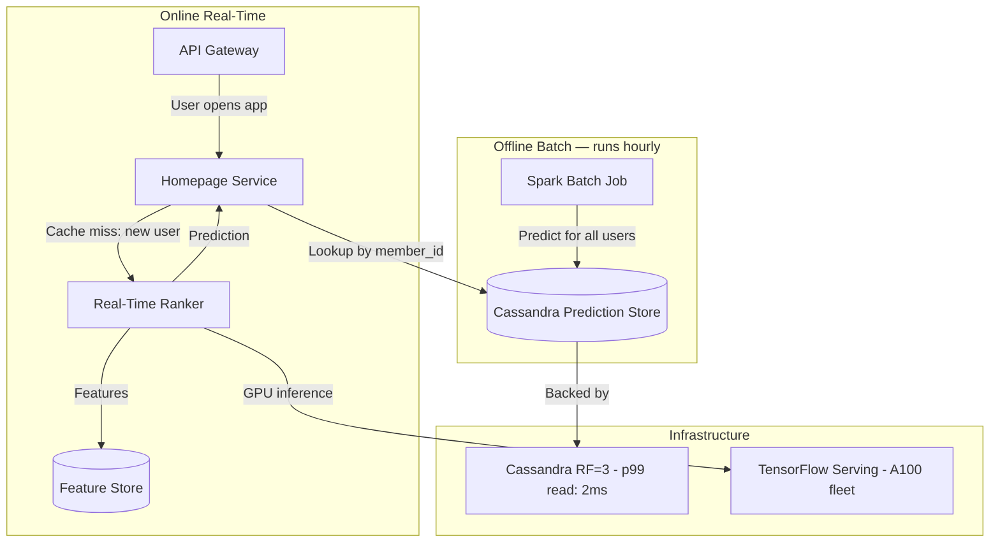

# Model Serving Infrastructure

6 questions covering model serving from online vs batch fundamentals to Staff-level production design at Netflix scale.

---

## Q1: What is the difference between online (real-time) vs batch model serving?

**Role:** Mid, ML Engineer | **Difficulty:** 🟡 | **Priority:** P0 | **Format:** Quick Answer

> **What the interviewer is testing:** Whether you understand the operational and architectural differences between real-time inference and batch prediction pipelines.

### Answer in 60 seconds
- **Online serving:** Request-response model — a client sends a payload, the model runs inference, and a prediction is returned synchronously. Latency SLA: p99 < 100ms for most use cases; p99 < 10ms for ad ranking.
- **Batch serving:** Pre-compute predictions offline for a known set of inputs and store results for lookup. Runs as scheduled jobs (hourly, daily). Latency SLA: irrelevant during job run; retrieval is a cache lookup (~1ms).
- **When to use online:** When the input is not known ahead of time (search query, fraud check on a new transaction).
- **When to use batch:** When the input set is finite and predictable (daily product recommendations for 10M users). Amortises compute cost — 100x cheaper per prediction than online for large user bases.
- **Hybrid (near-real-time):** Pre-compute for most users; fall back to real-time model for new users or low-coverage inputs. Used by YouTube for recommendations.

### Diagram



### Pitfalls
- ❌ **Using online serving for all users:** At 100M users, computing recommendations online costs 10–100x more than pre-computing and storing results. Always benchmark cost per prediction.
- ❌ **Ignoring staleness in batch:** Batch predictions computed at midnight can be 24 hours stale by end-of-day. Set a TTL and alert when predictions age beyond SLA.
- ❌ **Under-provisioning online servers for traffic spikes:** Model servers are stateful (loaded model weights in memory). Cold-start time for a 500MB model can be 5–30 seconds — auto-scaling must pre-warm.

### Concept Reference
→ [Feature Store Design](./feature-store-design)

---

## Q2: How do you A/B test two model versions in production safely?

**Role:** Mid, ML Engineer | **Difficulty:** 🟡 | **Priority:** P0 | **Format:** Quick Answer

> **What the interviewer is testing:** Whether you understand traffic splitting, logging requirements, and the metrics needed to make a safe model promotion decision.

### Answer in 60 seconds
- **Traffic split:** Route a percentage of live traffic to the candidate model. Start with 1% → 5% → 20% → 100% as confidence grows. Use a deterministic hash on user_id to ensure the same user always hits the same model (consistency).
- **Shadow mode first:** Before live traffic split, run the new model in shadow mode — it receives all requests but its predictions are discarded. Validates latency and error rate without user impact.
- **Metrics to monitor:** Business metric (CTR, conversion rate, revenue per session), ML metric (prediction latency p50/p99), error rate (model server 5xx), and data drift (input distribution shift).
- **Statistical significance:** Minimum 10K–100K samples per variant before declaring a winner. p-value < 0.05 and minimum detectable effect > 1% relative lift.
- **Rollback trigger:** If p99 latency exceeds SLA by 20% or error rate exceeds 0.1%, auto-rollback to the control model within 60 seconds.

### Diagram



### Pitfalls
- ❌ **Not logging both predictions and outcomes:** You cannot measure model lift without joining predictions to downstream business events (clicks, purchases). Set up this logging pipeline before the experiment.
- ❌ **Random per-request routing (not per-user):** A user seeing different recommendations on page 1 vs page 2 creates a noisy user experience. Always route by user_id hash for consistency.
- ❌ **Running experiments too short:** Statistical significance at 5% traffic split for a 1% relative lift typically requires 7–14 days to account for day-of-week effects.

### Concept Reference
→ [A/B Testing ML Models](./ab-testing-ml-models)

---

## Q3: What is shadow scoring (shadow mode) and how does it validate models without risk?

**Role:** Senior | **Difficulty:** 🔴 | **Priority:** P1 | **Format:** Quick Answer

> **What the interviewer is testing:** Whether you know the pre-production validation pattern that sits between offline evaluation and live A/B testing.

### Answer in 60 seconds
- **Shadow mode definition:** The new model receives a copy of every live request, runs inference, and logs predictions — but its output is never returned to users. The primary model continues to serve all responses.
- **What it validates:**
  - **Latency:** Does the new model meet p99 SLA under real production traffic patterns? Offline benchmarks miss tail latency from large inputs.
  - **Error rate:** Does the model fail on edge-case inputs unseen in the test set?
  - **Prediction distribution:** Are predictions in expected range (not NaN, inf, or out-of-distribution outputs)?
  - **Resource usage:** GPU memory, CPU utilisation under peak load.
- **Duration:** Run shadow mode for 24–72 hours to cover traffic pattern variance (weekday vs weekend, peak vs off-peak).
- **Infrastructure cost:** Shadow mode doubles inference compute cost. Use async shadow calls to avoid adding latency to the primary path.

### Diagram



### Pitfalls
- ❌ **Skipping shadow mode for small model changes:** Retraining on new data or hyperparameter changes can still introduce regressions. Shadow mode catches them at zero user risk.
- ❌ **Making shadow calls synchronous:** If the shadow model is slow or crashes, it should never block the primary response. Always implement shadow calls in fire-and-forget async.
- ❌ **Ignoring prediction distribution in shadow logs:** A model that passes latency checks but predicts outlier values (e.g., price = $99,999 for a $10 item) will cause business damage once promoted.

### Concept Reference
→ [A/B Testing ML Models](./ab-testing-ml-models)

---

## Q4: How do you design model serving for 50K req/sec with <50ms p99 latency?

**Role:** Senior | **Difficulty:** 🔴 | **Priority:** P1 | **Format:** Deep Dive

> **What the interviewer is testing:** Whether you can design a horizontally scalable, low-latency inference system with caching, batching, and GPU optimisation.

### Problem Constraints
| Dimension | Value |
|-----------|-------|
| Traffic | 50,000 req/sec sustained, 100K peak |
| Latency SLA | p99 < 50ms end-to-end |
| Model size | 500MB (transformer, e.g., BERT-base) |
| Infra budget | Minimise GPU count; use batching |

### Approach A — Naive: 1 Model Instance Per Server



| Dimension | Naive | Optimised |
|-----------|-------|-----------|
| GPU utilisation | 20–40% | 70–90% |
| Throughput per GPU | 500 req/sec | 2,000–5,000 req/sec |
| p99 latency | 80–200ms | 20–40ms |
| Cost | High | 4–10x lower |

### Approach B — Optimised: Batching + Async + Caching



### Recommended Answer
Design around three levers: **caching**, **dynamic batching**, and **model optimisation**.

**Caching:** Many requests are identical (same product page, same query). Cache prediction results in Redis with a 60-second TTL. Cache hit rate of 30–60% effectively reduces GPU load by half.

**Dynamic batching:** Use NVIDIA Triton Inference Server or TorchServe with dynamic batching — collect requests for up to 5ms or until batch size reaches 32, then run a single forward pass. GPU utilisation rises from 25% to 80%. Batch of 32 on A100 GPU: ~15ms inference vs 500ms sequential.

**Model optimisation:** Quantise model from FP32 to INT8 using TensorRT — 4x speed improvement, 4x memory reduction, <1% accuracy loss on BERT tasks. Convert to ONNX for runtime portability.

**Capacity math:** 50K req/sec, 30% cache hit rate → 35K req/sec to GPU. At 5,000 req/sec per A100 GPU → 7 A100s with 20% headroom = 9 A100s.

### What a great answer includes
- [ ] Cache with TTL to reduce GPU load — name cache hit rate assumption
- [ ] Dynamic batching with specific batch size and wait time numbers
- [ ] Model quantisation (FP32 → INT8) and the latency improvement
- [ ] Capacity planning math (req/sec per GPU)
- [ ] Mention Triton Inference Server or equivalent (TorchServe, KServe)

### Pitfalls
- ❌ **Using CPU for transformer inference:** BERT-base on CPU: ~200ms per request. On A100 GPU: ~5ms. Never serve transformer models on CPU at this scale.
- ❌ **Fixed batch size:** Fixed batches waste GPU capacity during low traffic. Dynamic batching adjusts to real load, maintaining low latency at low traffic and high throughput at high traffic.
- ❌ **No model warm-up:** A freshly started model server has no JIT-compiled kernels. First requests are 10x slower. Always warm up with synthetic requests before routing live traffic.

### Concept Reference
→ [Feature Store Design](./feature-store-design)

---

## Q5: What is model versioning — how do you roll back a bad model in production?

**Role:** Senior | **Difficulty:** 🔴 | **Priority:** P1 | **Format:** Quick Answer

> **What the interviewer is testing:** Whether you have a disciplined approach to model lifecycle management — artifact tracking, deployment metadata, and fast rollback.

### Answer in 60 seconds
- **Model versioning:** Every trained model artifact is stored immutably with a version tag (e.g., `fraud-model-v42`, or hash of training run). Metadata stored: training date, dataset version, training metrics (AUC, F1), hyperparameters, Git commit of training code.
- **Artifact storage:** S3 (or GCS) for model weights; MLflow or Weights & Biases for experiment tracking. Typical artifact size: 50MB–10GB.
- **Deployment metadata:** Track which model version is live per environment (staging, canary, production) in a model registry (MLflow Registry, Vertex AI Model Registry, SageMaker Model Registry).
- **Rollback procedure:**
  1. Detect issue (latency spike, business metric drop, error rate > threshold)
  2. Load previous model version from S3 (pre-cached on serving fleet: <5 seconds)
  3. Update model registry pointer to previous version
  4. Serving fleet polls registry every 30 seconds and hot-swaps model in memory
  5. Full rollback time: 30–90 seconds

### Diagram

```mermaid
sequenceDiagram
  participant Eng as Engineer
  participant Reg as Model Registry
  participant S3 as S3 Artifact Store
  participant Fleet as Serving Fleet

  Note over Fleet: v42 is live
  Eng->>Reg: Mark v42 as bad; promote v41
  Reg->>Fleet: Notify: active version = v41
  Fleet->>S3: Fetch v41 weights (pre-cached: 0s / cold: 10-30s)
  Fleet->>Fleet: Hot-swap model in memory
  Fleet-->>Eng: Rollback complete (~60s)
  Note over Fleet: v41 is live again
```

### Pitfalls
- ❌ **Not pre-caching previous model versions:** If rollback requires downloading 5GB from S3, it takes 3–5 minutes instead of 30 seconds. Keep the last 2 versions loaded in model server memory.
- ❌ **No automated rollback triggers:** Manual rollback during an incident takes 5–15 minutes of human decision-making. Automate: if p99 latency > 2x baseline for 5 minutes → auto-rollback.
- ❌ **Deleting old model artifacts aggressively:** Retain at least the last 10 model versions in S3. S3 storage cost for 10 x 500MB models = $0.12/month — trivially cheap insurance.

### Concept Reference
→ [A/B Testing ML Models](./ab-testing-ml-models)

---

## Q6: How does Netflix serve 500M model predictions/day for personalisation?

**Role:** Staff | **Difficulty:** ⚫ | **Priority:** P2 | **Format:** Deep Dive

> **What the interviewer is testing:** Whether you can reason about prediction infrastructure at massive scale — caching strategies, freshness vs cost trade-offs, and hybrid online/batch architectures.

### Problem Constraints
| Dimension | Value |
|-----------|-------|
| Scale | 500M predictions/day = 5,800 req/sec average; 50K peak |
| Users | 260M subscribers globally |
| Models | 30+ models (homepage ranking, search, similar titles, thumbnails) |
| Latency SLA | p99 < 200ms for homepage load (involves 10+ model calls) |

### Architecture



### Key Design Decisions

| Decision | Choice | Rationale |
|----------|--------|-----------|
| Primary serving | Batch pre-compute | 95% of 260M users get predictions from Cassandra lookup at 2ms |
| Freshness | Hourly refresh | Model quality vs compute cost trade-off; user taste changes slowly |
| New user fallback | Real-time model | Cold-start problem — no history to pre-compute from |
| Feature freshness | 5-minute lag (streaming) | Capture recent viewing behaviour for session context |
| Thumbnail A/B | Per-request real-time | Thumbnail selection is personalised per device and context |

### Recommended Answer
Netflix uses a **hybrid batch + real-time architecture** optimised for cost and scale:

**Batch layer (95% of traffic):** Hourly Spark jobs pre-compute top-N recommendations for every subscriber and write to Cassandra. Homepage load = Cassandra lookup (p99 2ms). This handles 247M of 260M users.

**Real-time layer (5% of traffic):** New users, users with recent activity changes, and highly contextual rankings (search, trending) use real-time TensorFlow Serving. The fleet runs ~20 A100 GPUs per region to handle 2,000–5,000 req/sec burst.

**Feature freshness:** Kafka streams viewing events to a feature store with 5-minute lag. This ensures "user just watched Season 2" is reflected in the next recommendation request.

**Cost insight:** Batch pre-compute on Spark costs ~$0.0001 per prediction vs $0.001 per prediction for real-time GPU inference — 10x cheaper. At 500M predictions/day, batch saves ~$45,000/day vs full real-time.

### What a great answer includes
- [ ] Name the batch pre-compute → Cassandra lookup as the primary path
- [ ] Quantify: 95% batch, 5% real-time; cost difference (~10x)
- [ ] Explain freshness trade-off (hourly batch vs 5-min streaming features)
- [ ] Cover cold-start problem for new users (real-time fallback)
- [ ] Include latency numbers: 2ms Cassandra, 200ms real-time p99

### Pitfalls
- ❌ **Proposing full real-time serving for 500M predictions/day:** GPU cost would be $45M+/year vs $4.5M for batch-primary hybrid.
- ❌ **Ignoring cold-start:** New users have no prediction in the pre-compute store. Always design the fallback path.
- ❌ **Stale features degrading batch quality:** If the feature store feeding the batch job has 24-hour-old features, recommendation quality degrades noticeably. Keep feature lag < 6 hours for ranking models.

### Concept Reference
→ [Feature Store Design](./feature-store-design)
