# RAG Architecture

10 questions covering retrieval-augmented generation design, chunking, embeddings, re-ranking, and evaluation.

---

## Q1: What is RAG and why use it over fine-tuning?
**Role:** Mid / ML Engineer | **Difficulty:** 🟡 | **Priority:** P0 | **Format:** Quick Answer

> **What the interviewer is testing:** Whether you understand the fundamental trade-off between RAG (retrieval at inference time) and fine-tuning (knowledge baked into weights).

### Answer in 60 seconds
- **RAG definition:** Retrieve relevant documents at query time and inject them into the LLM prompt as context — model uses retrieved facts to answer
- **Fine-tuning:** Update model weights on domain-specific data — knowledge becomes part of the model
- **Key differences:**

| Dimension | RAG | Fine-tuning |
|-----------|-----|-------------|
| Data freshness | Real-time (update vector store) | Stale until next fine-tune ($5K–$50K cost) |
| Source attribution | Yes (cite retrieved doc) | No (hallucination risk) |
| Accuracy on domain | Good (if retrieval works) | High (if enough labeled data) |
| Setup time | 1–2 days | 1–2 weeks + data prep |
| Best for | Dynamic knowledge, citation needed | Tone/style, fixed domain skills |

- **Rule of thumb:** If the knowledge changes more often than monthly, RAG wins. If you need model behavior change (not just knowledge), fine-tune.
- **Both is valid:** Use RAG for knowledge + fine-tune for style/format

### Diagram

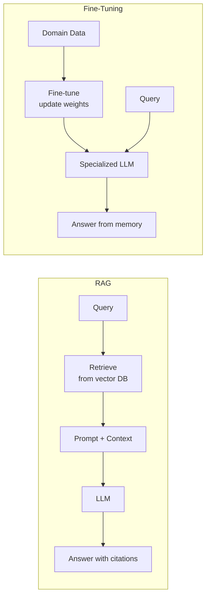

### Pitfalls
- ❌ **Fine-tuning for knowledge injection:** Fine-tuning a model on 10K company documents does not reliably teach it facts — models hallucinate fine-tuned knowledge; RAG is more reliable for factual recall
- ❌ **RAG for reasoning patterns:** If you need the model to answer in a specific structured format (JSON, bullet points, etc.), fine-tuning is more reliable than prompt engineering in RAG

### Concept Reference

---

## Q2: What is a chunking strategy for RAG and what are the options?
**Role:** Mid | **Difficulty:** 🟡 | **Priority:** P1 | **Format:** Quick Answer

> **What the interviewer is testing:** Understanding that chunk boundaries significantly affect retrieval quality — a poorly chunked corpus degrades RAG accuracy by 20–40%.

### Answer in 60 seconds
- **Why chunking matters:** LLMs have context limits (8K–200K tokens). Documents must be split into chunks for embedding. Chunk size and boundary placement determine whether retrieved chunks contain the answer.
- **Options:**

| Strategy | How | Best for | Pitfall |
|----------|-----|----------|---------|
| **Fixed size** | Split every N tokens (512, 1024) | Simple baseline | May split sentences/ideas mid-way |
| **Sentence/paragraph** | Split on sentence boundaries | Dense prose, articles | Variable chunk sizes; very short sentences lose context |
| **Semantic** | Embed sentences, split where cosine similarity drops | Technical docs | Slower; requires embedding step |
| **Hierarchical** | Small chunks for retrieval, larger parent chunks for context | Long documents | More complex architecture |
| **Document-aware** | Split by headings, sections (Markdown, HTML) | Structured docs | Requires parsing |

- **Recommended:** Hierarchical chunking — retrieve small chunks (256 tokens) for precision, return parent chunk (1024 tokens) for context. Reduces hallucination 15–25% vs flat fixed chunking.
- **Overlap:** Add 10–20% token overlap between adjacent chunks to prevent answers split across boundary from being missed

### Diagram

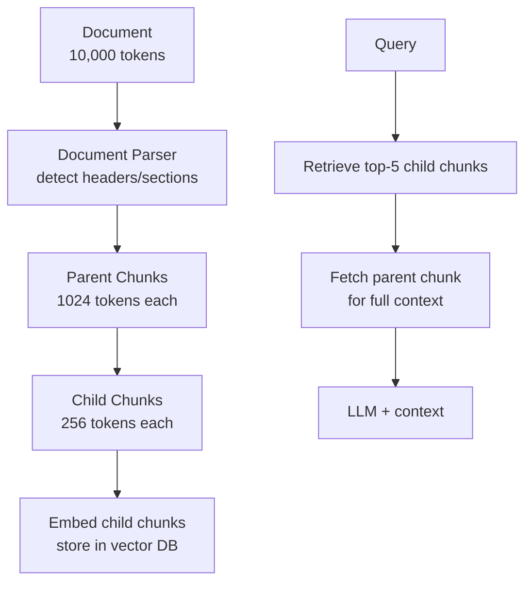

### Pitfalls
- ❌ **Chunks too small (<100 tokens):** No coherent context — the retrieved chunk is a sentence fragment without enough information to answer
- ❌ **Chunks too large (>2048 tokens):** Embedding one large chunk averages over many topics — the embedding loses specificity, reducing recall for specific questions

### Concept Reference

---

## Q3: How do you choose an embedding model — dimension, latency, quality trade-offs?
**Role:** Senior | **Difficulty:** 🔴 | **Priority:** P1 | **Format:** Deep Dive

> **What the interviewer is testing:** Ability to select an embedding model that meets production requirements for latency, accuracy, and cost.

### Problem Constraints
| Dimension | Value |
|-----------|-------|
| Corpus size | 5M documents, 512 tokens average |
| Query rate | 500 queries/sec |
| Retrieval latency budget | <100ms total (embedding + vector search) |
| Languages | English only |
| Hosting | Cloud (can use managed APIs or self-host) |

### Approach A — OpenAI text-embedding-3-large
1536-dimension embeddings, API-based, SOTA quality on MTEB benchmark.

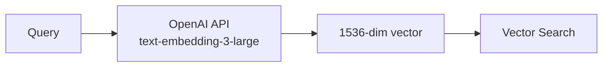

| Dimension | text-embedding-3-large |
|-----------|----------------------|
| Dimension | 1,536 |
| MTEB score | 64.6 (top tier) |
| Embedding latency | ~30ms API call |
| Cost | $0.13/1M tokens |
| 5M docs corpus storage | 5M × 1536 × 4 bytes = **30 GB** |

### Approach B — OpenAI text-embedding-3-small
512-dimension embeddings (can be truncated from 1536). 5× cheaper.

| Dimension | text-embedding-3-small |
|-----------|----------------------|
| Dimension | 512 (or up to 1536) |
| MTEB score | 62.3 |
| Embedding latency | ~20ms API call |
| Cost | $0.02/1M tokens |
| 5M docs corpus storage | 5M × 512 × 4 bytes = **10 GB** |

### Approach C — Self-hosted: E5-Large or BGE-Large
Open-source models (768-dim), self-hosted on GPU, no per-token cost.

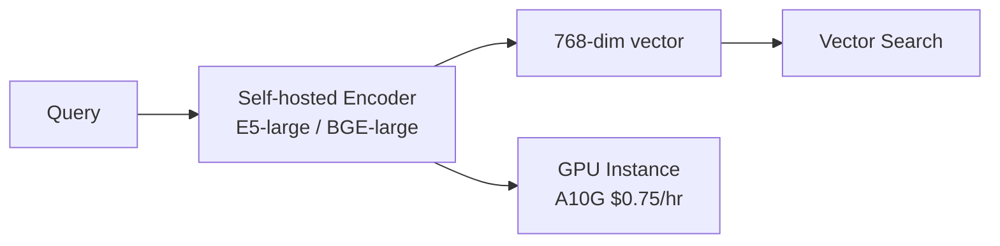

| Dimension | E5-Large / BGE-Large |
|-----------|---------------------|
| Dimension | 768 |
| MTEB score | 62.0–63.5 |
| Embedding latency | 5–15ms (GPU, batch=32) |
| Cost | $0.75/hr GPU (amortized) — free per-query |
| 5M docs corpus storage | 5M × 768 × 4 bytes = **15 GB** |

### Comparison

| Dimension | text-embedding-3-large | text-embedding-3-small | E5-Large (self-hosted) |
|-----------|----------------------|----------------------|----------------------|
| Quality (MTEB) | 64.6 | 62.3 | 62.0 |
| Latency | 30ms | 20ms | 10ms |
| Cost at 500 QPS | $4,680/day | $936/day | $18/day (GPU) |
| Storage (5M docs) | 30 GB | 10 GB | 15 GB |
| Operational burden | None | None | GPU management |

### Recommended Answer
For 500 QPS with a latency budget of <100ms: **E5-Large self-hosted** on 2× A10G instances. The $18/day vs $936/day cost difference ($33K/year savings) justifies the operational overhead, and 10ms GPU embedding latency leaves ample budget for vector search.

### What a great answer includes
- [ ] Quantify storage cost of different dimensions (dimension × 4 bytes × corpus size)
- [ ] Cite MTEB as the benchmark for comparing embedding models
- [ ] State that for high QPS, self-hosted per-query cost dominates API cost
- [ ] Address dimension reduction: Matryoshka embeddings (text-embedding-3) support truncation to lower dimensions with graceful quality degradation
- [ ] Mention multilingual requirement changes the calculus (multilingual-e5 or cohere-multilingual)

### Pitfalls
- ❌ **Using a single embedding model forever:** Domain-specific fine-tuned embeddings (e.g., medical, legal) outperform general models by 10–20% NDCG on domain queries
- ❌ **Ignoring embedding re-indexing cost:** Switching embedding models requires re-embedding the entire corpus — 5M docs × 500 tokens = 2.5B tokens at $0.13/1M = $325 re-indexing cost

### Concept Reference

---

## Q4: What is hybrid search (dense + sparse) and why is it better than dense-only?
**Role:** Senior | **Difficulty:** 🔴 | **Priority:** P1 | **Format:** Quick Answer

> **What the interviewer is testing:** Understanding of the complementary weaknesses of semantic (dense) and keyword (sparse) search, and how hybrid search addresses both.

### Answer in 60 seconds
- **Dense search (semantic):** Query and document are embedded into high-dimensional vectors; find nearest neighbors by cosine similarity. Understands meaning and paraphrases.
  - Weakness: fails on exact terms, product codes, proper nouns (e.g., "SKU-9374X" or "Dr. Ananya Krishnamurthy")
- **Sparse search (BM25/TF-IDF):** Keyword matching with TF-IDF weighting. Exact token matching.
  - Weakness: no semantic understanding; "car" ≠ "automobile"
- **Hybrid search:** Combine both with Reciprocal Rank Fusion (RRF) or linear score interpolation. Achieves 10–15% higher NDCG@10 than either alone on BEIR benchmark.
- **Formula (RRF):** `score = α × dense_rank_score + (1-α) × sparse_rank_score` — α=0.5 works well as starting point; tune on held-out queries
- **Implementation:** Elasticsearch supports hybrid search natively; Weaviate, Qdrant, and OpenSearch have built-in BM25 + vector hybrid modes

### Diagram

```mermaid
graph TD
  Q[Query: "SKU-9374X blue widget"] --> DE[Dense Encoder<br/>semantic embedding]
  Q --> SPAR[BM25 Index<br/>keyword search]
  DE --> DR[Dense Results<br/>similar product descriptions]
  SPAR --> SR[Sparse Results<br/>exact SKU matches]
  DR --> RRF[Reciprocal Rank Fusion<br/>merge + re-rank]
  SR --> RRF
  RRF --> FINAL[Hybrid Results<br/>best of both]
```

### Pitfalls
- ❌ **Using dense-only for product catalogs:** SKU numbers, part codes, and proper nouns are out-of-vocabulary for embedding models — BM25 retrieves them reliably
- ❌ **Equal weight for all query types:** Analytical/conceptual queries benefit from higher dense weight (α=0.7); identifier-heavy queries need higher sparse weight (α=0.3) — query type routing improves results 8–12%

### Concept Reference

---

## Q5: How do you implement re-ranking to improve retrieval quality?
**Role:** Senior | **Difficulty:** 🔴 | **Priority:** P2 | **Format:** Deep Dive

> **What the interviewer is testing:** Understanding of the two-stage retrieval + re-ranking pipeline that is standard in production RAG systems.

### Problem Constraints
| Dimension | Value |
|-----------|-------|
| Corpus size | 2M documents |
| Query rate | 100 queries/sec |
| Target NDCG@5 | >0.75 (vs 0.60 with embedding-only) |
| Latency budget | <300ms total |

### Approach A — Embedding Similarity Only (Baseline)
Retrieve top-20 by vector similarity. Return top-5 to LLM.

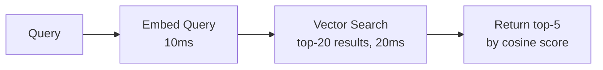

| Dimension | Embedding Only |
|-----------|---------------|
| NDCG@5 | 0.60 |
| Latency | 30ms |
| False positives | High (15–20% irrelevant in top-5) |

### Approach B — Cross-Encoder Re-ranking
Retrieve top-50 with embedding ANN search. Re-rank using a cross-encoder model that jointly encodes query + document (sees full interaction).

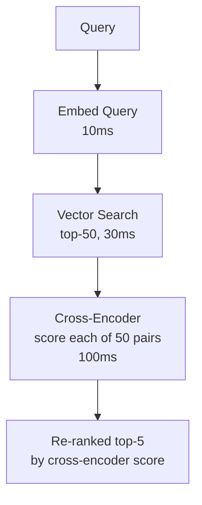

| Dimension | Cross-Encoder Re-ranking |
|-----------|--------------------------|
| NDCG@5 | 0.78 |
| Latency | 140ms (50 cross-encoder calls parallelized) |
| Model | ms-marco-MiniLM-L-6 (fast) or cohere-rerank (API) |
| Cost | Free (self-hosted) or $1/1K searches (Cohere API) |

### Approach C — LLM-as-Re-ranker
Use the same LLM that will generate the answer to score relevance of each retrieved document.

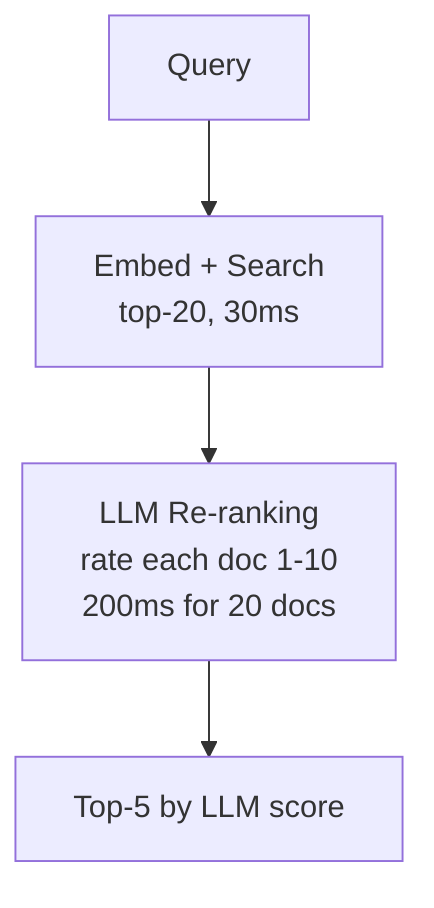

| Dimension | LLM Re-ranking |
|-----------|----------------|
| NDCG@5 | 0.82 |
| Latency | 250ms |
| Cost | High (LLM API calls per search) |
| Best for | High-value queries where accuracy dominates |

### Recommended Answer
**Cross-encoder re-ranking** (Approach B) is the production standard. It improves NDCG@5 from 0.60 to 0.78 at 140ms latency — well within the 300ms budget. Use Cohere Rerank API for zero-ops deployment or host `ms-marco-MiniLM-L-6` (22M parameters, 10ms per pair on CPU) for high-volume cost control.

### What a great answer includes
- [ ] Explain the bi-encoder (embedding) vs cross-encoder architectural difference
- [ ] State that cross-encoders can't scale to full corpus (O(n) per query) — they must operate on a pre-filtered candidate set
- [ ] Name NDCG@5 or NDCG@10 as the right retrieval quality metric
- [ ] Quantify typical improvement: +15–25% NDCG from re-ranking
- [ ] Mention batch parallelization — scoring 50 pairs in parallel takes ~100ms, not 50 × 2ms = 100ms serially

### Pitfalls
- ❌ **Re-ranking on full corpus:** A cross-encoder on 2M documents × 100 QPS = 200M inference calls/sec — impossible; re-ranking only works on the pre-filtered top-50 to top-100
- ❌ **Skipping candidate retrieval diversity:** If ANN search retrieves 50 near-duplicate chunks, re-ranking has nothing to improve — use MMR (Maximum Marginal Relevance) to diversify candidates before re-ranking

### Concept Reference

---

## Q6: How do you evaluate RAG quality — faithfulness, relevance, groundedness?
**Role:** Senior | **Difficulty:** 🔴 | **Priority:** P2 | **Format:** Quick Answer

> **What the interviewer is testing:** Understanding of the multi-dimensional evaluation challenge for RAG — you cannot just measure end-to-end answer quality.

### Answer in 60 seconds
- **Three core metrics:**
  - **Context Relevance:** Are the retrieved chunks relevant to the query? (Retrieval quality)
  - **Faithfulness (Groundedness):** Does the answer only contain claims supported by retrieved context? (Anti-hallucination)
  - **Answer Relevance:** Does the answer actually address the user's question? (End-to-end quality)
- **Measurement approaches:**
  - LLM-as-judge: Use a strong LLM (GPT-4) to score each dimension 1–5 on a sample of queries — scalable, 80–90% agreement with human raters
  - RAGAS framework: Open-source library implementing these metrics automatically
  - Human eval: Sample 200 queries quarterly, human raters score — ground truth for calibrating LLM-as-judge
- **Target thresholds:** Context relevance >0.75; faithfulness >0.90; answer relevance >0.80
- **Warning signal:** If faithfulness drops below 0.85, the LLM is hallucinating beyond retrieved context — reduce model temperature or add explicit "only answer from provided context" instruction

### Diagram

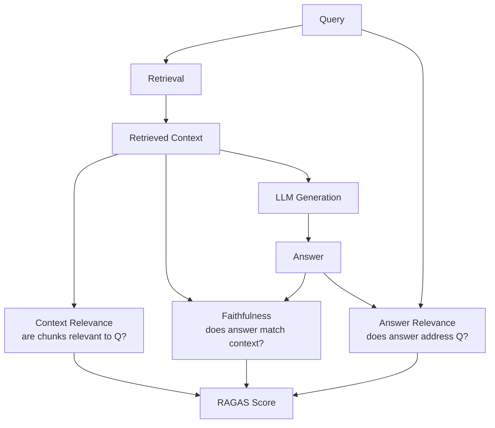

### Pitfalls
- ❌ **Only measuring end-to-end accuracy:** A correct answer achieved by hallucination (ignoring retrieved context) is a ticking time bomb — faithfulness must be measured separately
- ❌ **Static test sets for evaluation:** User queries evolve — a test set from 6 months ago may not represent current query distribution; resample monthly

### Concept Reference

---

## Q7: How does Notion AI implement RAG for searching personal notes?
**Role:** Staff | **Difficulty:** ⚫ | **Priority:** P2 | **Format:** Quick Answer

> **What the interviewer is testing:** Ability to reason about RAG design for personal/private data with specific UX constraints.

### Answer in 60 seconds
- **Key challenges unique to personal notes RAG:**
  - *Scale is per-user, not global:* 10K–500K notes per user; no cross-user retrieval (privacy)
  - *Dynamic index:* Notes change constantly; embedding index must update within seconds of edits
  - *Query intent:* "What did I write about the Japan trip?" is navigational; "Summarize my notes on React" is synthesis
- **Notion's inferred architecture:**
  - Per-user vector index (partitioned by user ID) — likely Postgres pgvector or a managed vector store
  - Real-time incremental indexing: on note save → diff → re-embed changed chunks → upsert vectors
  - Hybrid search: full-text search (Notion's existing search) + vector search, merged with RRF
  - Context window management: notes can be long; hierarchical chunking with page-level and block-level granularity
- **Privacy guarantee:** User A's notes never appear in User B's vector search — enforced by per-user namespace/partition

### Diagram

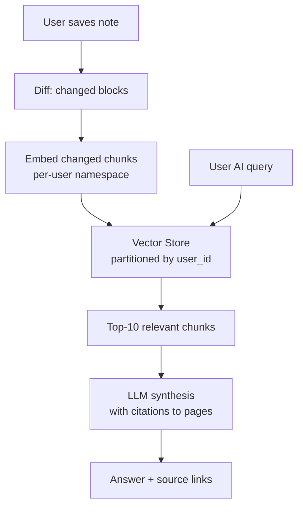

### Pitfalls
- ❌ **Global shared index for all users:** Even with access control filters, a shared embedding space allows timing side-channel attacks — per-user namespaces are safer
- ❌ **Batch indexing (nightly):** A note written at 9pm won't be retrievable until tomorrow morning — users expect freshness within seconds of writing

### Concept Reference

---

## Q8: How do you manage context window limits when retrieved documents are too large?
**Role:** Staff | **Difficulty:** ⚫ | **Priority:** P2 | **Format:** Deep Dive

> **What the interviewer is testing:** Ability to handle the context budget problem — retrieved documents often exceed the context window available for generation.

### Problem Constraints
| Dimension | Value |
|-----------|-------|
| LLM context window | 32K tokens |
| System prompt | 2K tokens |
| Output buffer | 2K tokens |
| Available for retrieved context | 28K tokens |
| Retrieved documents (top-10) | 50K tokens total |
| Query type | Multi-document synthesis |

### Approach A — Truncation (Naive)
Rank documents by relevance score. Include documents in order until context window is full. Truncate remaining.

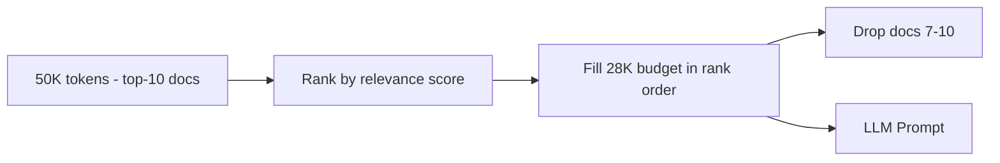

| Dimension | Truncation |
|-----------|-----------|
| Information loss | High — drops entire documents |
| Implementation | Trivial |
| Answer quality | Good for top-ranked docs; poor for cross-doc synthesis |

### Approach B — Map-Reduce Summarization
Summarize each retrieved document to a budget (500 tokens each). Feed all summaries to the final LLM call.

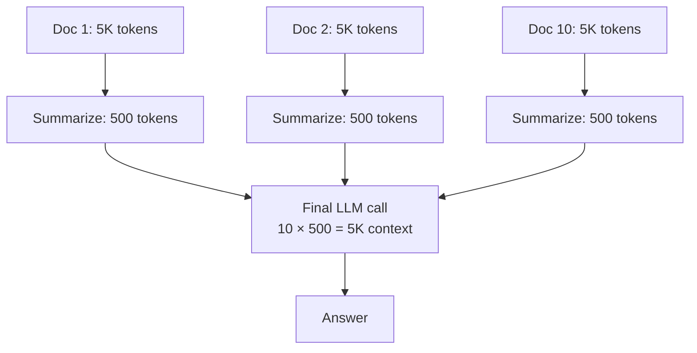

| Dimension | Map-Reduce |
|-----------|-----------|
| Information loss | Medium — summaries may drop specific facts |
| LLM calls | 10 (map) + 1 (reduce) = 11 calls total |
| Latency overhead | 10 parallel summary calls + 1 synthesis = +400ms |
| Cost overhead | 10× more tokens used |

### Approach C — Chunk-Level Relevance Filtering
Instead of document-level retrieval, retrieve and score at chunk level (256 tokens). Greedily fill context budget with highest-scoring chunks.

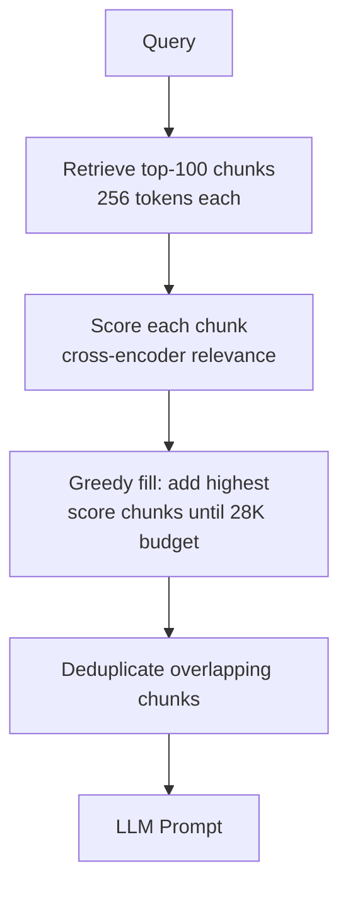

| Dimension | Chunk Filtering |
|-----------|----------------|
| Information loss | Low — includes most relevant passages |
| LLM calls | 1 |
| Latency overhead | +100ms for chunk re-ranking |
| Context efficiency | High — no wasted tokens on irrelevant sections |

### Recommended Answer
**Approach C** for most production RAG systems. Retrieve at chunk granularity (256–512 tokens), score all candidates with a cross-encoder, fill context budget with top-scoring diverse chunks. Eliminates the need for costly map-reduce summarization. Use **Approach B (map-reduce)** only when the task explicitly requires whole-document synthesis (e.g., "compare these 10 reports").

### What a great answer includes
- [ ] Identify the context budget: window_size - system_prompt - output_buffer = available context
- [ ] State that chunk-level retrieval is more efficient than document-level for budget management
- [ ] Address chunk diversity — avoid filling context with near-duplicate chunks from the same document
- [ ] Mention lost-in-the-middle effect: LLMs recall beginning and end of context better — put highest-relevance chunks first and last
- [ ] Cost impact: map-reduce uses 10× tokens → 10× cost for summarization step

### Pitfalls
- ❌ **Lost-in-the-middle effect:** LLMs have lower recall for content in the middle of long contexts — put the most critical retrieved chunk first or last, not buried in position 5 of 10
- ❌ **Ignoring deduplication:** If 3 of your top-10 chunks are from the same document with 80% overlap, you waste 2× context budget on redundant information

### Concept Reference

---

## Q9: What is multi-hop reasoning in RAG and when do you need it?
**Role:** Staff | **Difficulty:** ⚫ | **Priority:** P3 | **Format:** Quick Answer

> **What the interviewer is testing:** Awareness of the limitations of single-pass RAG for complex questions that require chaining multiple retrieved facts.

### Answer in 60 seconds
- **Single-hop RAG:** Retrieve once for the original query → answer. Works for 80% of factual questions.
- **Multi-hop RAG:** Some questions require following a chain of evidence: "What is the CEO of the company that acquired Slack?" requires retrieving: (1) who acquired Slack → Salesforce; (2) who is CEO of Salesforce → Marc Benioff.
- **When you need it:**
  - Questions with implicit intermediate entities ("the founder's alma mater")
  - Questions requiring comparison across multiple retrieved facts
  - Knowledge graph traversal questions
- **Implementation patterns:**
  - *Iterative retrieval:* Generate sub-questions, retrieve for each, synthesize — 2–3 retrieval rounds typical
  - *Query decomposition:* LLM breaks original question into sub-questions; parallel retrieval; merge results
  - *Chain of thought retrieval:* LLM generates reasoning steps; each step can trigger a new retrieval
- **Cost:** Multi-hop adds 2–4× latency (multiple retrieval + LLM calls) — only use when needed

### Diagram

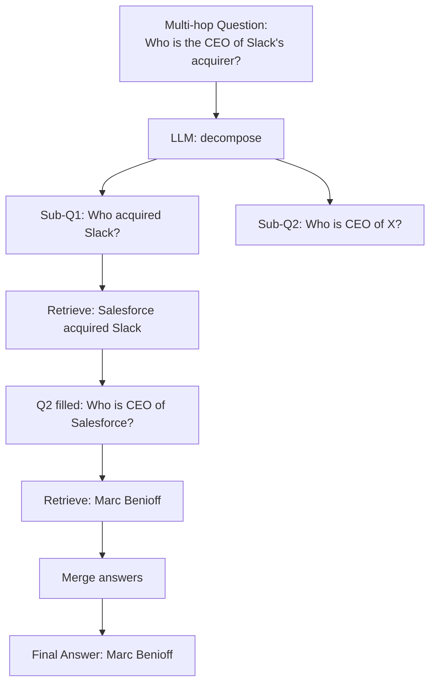

### Pitfalls
- ❌ **Applying multi-hop to simple questions:** Adds 2–4× latency for no benefit; classify question complexity first and route accordingly
- ❌ **Error propagation:** If hop 1 retrieves the wrong entity, hop 2 answers a completely wrong question — multi-hop errors compound

### Concept Reference

---

## Q10: Design a RAG system for a customer support chatbot
**Role:** Senior | **Difficulty:** 🔴 | **Priority:** P1 | **Format:** Scenario

**Real Company:** Intercom / Zendesk / Freshdesk

### The Brief
> "Design a RAG system for a customer support chatbot. The knowledge base has 1 million support documents, FAQs, and product manuals. Target: <2 second end-to-end response, >90% answer accuracy (per human eval), handles 500 queries/sec."

### Clarifying Questions
1. How frequently does the knowledge base update? (Daily new docs, or mostly static?)
2. Is citation/source attribution required in responses?
3. What languages must be supported?
4. Is this a deflection chatbot (try to avoid human handoff) or augmentation (always option to escalate)?
5. What is the fallback when the chatbot can't answer? (Escalate to human, say "I don't know", search results?)

### Back-of-Envelope Estimation
| Metric | Calculation | Result |
|--------|-------------|--------|
| Corpus size | 1M docs × 500 tokens avg | 500M tokens |
| Embedding cost (one-time) | 500M tokens × $0.02/1M | $10 |
| Vector storage (1536-dim) | 1M × 1536 × 4 bytes | 6 GB |
| Embedding at 500 QPS | 500 queries/sec × 512 tokens × $0.02/1M | $0.005/sec = $432/day |
| LLM generation | 500 QPS × 1K tokens × $0.002/1K | $1/sec = $86,400/day → use mini model |
| Self-hosted embedding (A10G) | 500 QPS, 10ms/query, batch=32 | 2× A10G sufficient |

### High-Level Architecture

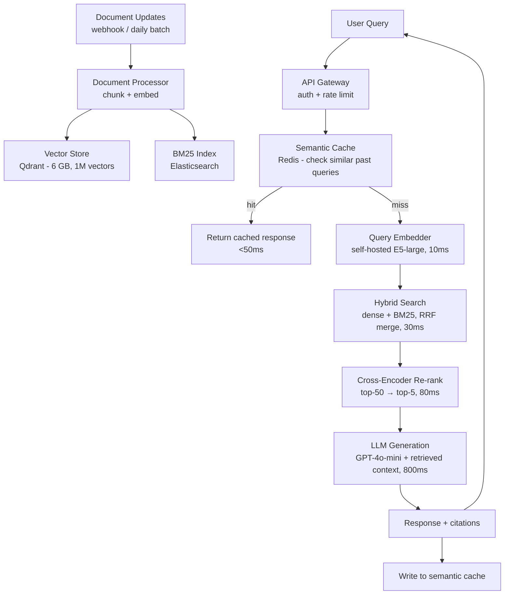

### Trade-off Decisions
| Decision | Option A | Option B | Chosen | Why |
|----------|----------|----------|--------|-----|
| LLM model | GPT-4o ($5/1M) | GPT-4o-mini ($0.15/1M) | GPT-4o-mini | Customer support answers are constrained to KB — small model + good context = 90% accuracy at 33× lower cost |
| Embedding model | OpenAI API | Self-hosted E5-large | Self-hosted | At 500 QPS, API cost is $432/day vs $36/day self-hosted; payback in 2 days |
| Index freshness | Batch nightly | Real-time incremental | Real-time incremental | New products/policies must be available immediately; outage workarounds need <5min index update |
| Fallback strategy | "I don't know" | Escalate to human | Escalate to human | Customer support escalation is better UX than unhelpful non-answer |
| Chunking | Fixed 512 tokens | Hierarchical | Hierarchical | Product manuals have natural structure; section-level context improves accuracy 15% |

### Failure Modes
| Failure | Impact | Mitigation |
|---------|--------|------------|
| Vector store unavailable | All queries fall through to BM25-only (keyword search) | Circuit breaker to BM25 fallback; vector store with 3-node Qdrant cluster for HA |
| Stale KB (new product launched, old docs retrieved) | Chatbot gives outdated answers | Webhook on KB update triggers incremental re-indexing within 5 minutes; document TTL metadata |
| LLM hallucination (ignores retrieved context) | Incorrect support answers — costly if user acts on them | Faithfulness guardrail: re-check answer against retrieved context before returning; reject if faithfulness <0.8 |
| Semantic cache poisoning (wrong answer cached) | Incorrect answer served to all users with similar queries | Cache answers only when LLM confidence is high (>0.9) AND answer has been verified; TTL 24h |
| Query outside KB scope | Chatbot makes up answer | Retrieval confidence gate: if top-1 similarity <0.6, route to human — don't generate an answer |

